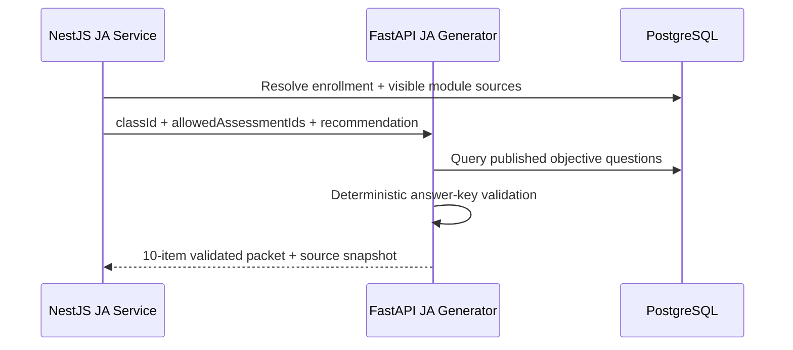
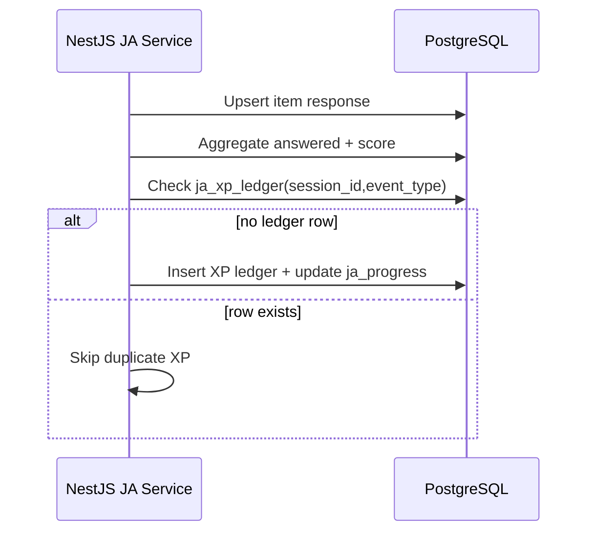

# JA RAG and Practice Architecture

Date: 2026-04-03

## Purpose
Document how JA Practice retrieves evidence, generates objective sessions, validates answer keys, and records student progress without touching official grading records.

## Ownership
- NestJS owns: authorization, source visibility filtering, JA persistence, XP, anti-cheat events, and auditing.
- FastAPI owns: bootstrap recommendation shaping and objective question packet generation.
- PostgreSQL stores both LMS domain data and JA tables, but JA records remain logically separated.

## Retrieval Constraints
- Student must be enrolled in the class.
- Backend computes allowed source IDs from class modules and visibility/given/published state.
- AI generation is restricted to allowed assessments and available class evidence.
- Generation fails if insufficient deterministic objective evidence exists.

## Objective Validation
JA v1 supports objective item types:
- `multiple_choice`
- `multiple_select`
- `true_false`
- `dropdown`

Validation pass requirements:
- item type present and objective
- options present
- answer key present and deterministic for type
- exactly one correct option for single-answer types
- one or more correct options for `multiple_select`

Invalid items are rejected before session persistence.

## Runtime Data Flow
1. Student opens JA bootstrap.
2. Backend verifies student access and gets AI bootstrap payload.
3. Student starts session.
4. Backend asks AI service to generate packet (fixed 10).
5. Backend stores session + items in JA tables.
6. Student submits answers; backend scores deterministically.
7. Student completes session; XP awarded once using ledger idempotency.

## Sequence: Retrieval + Generation

## Sequence: Scoring + Idempotent Reward

## Security Notes
- Student session APIs are role-guarded.
- Session reads/writes are constrained to `student_id` ownership.
- Citation payloads are sanitized against allowed lesson/assessment IDs.
- Audit events emitted for create, complete, delete, and focus strike.

## Known v1 Limits
- Practice-only mode; Ask/Review integration is deferred.
- Synchronous generation path only.
- Objective-only questions; no free-text grading in v1.
