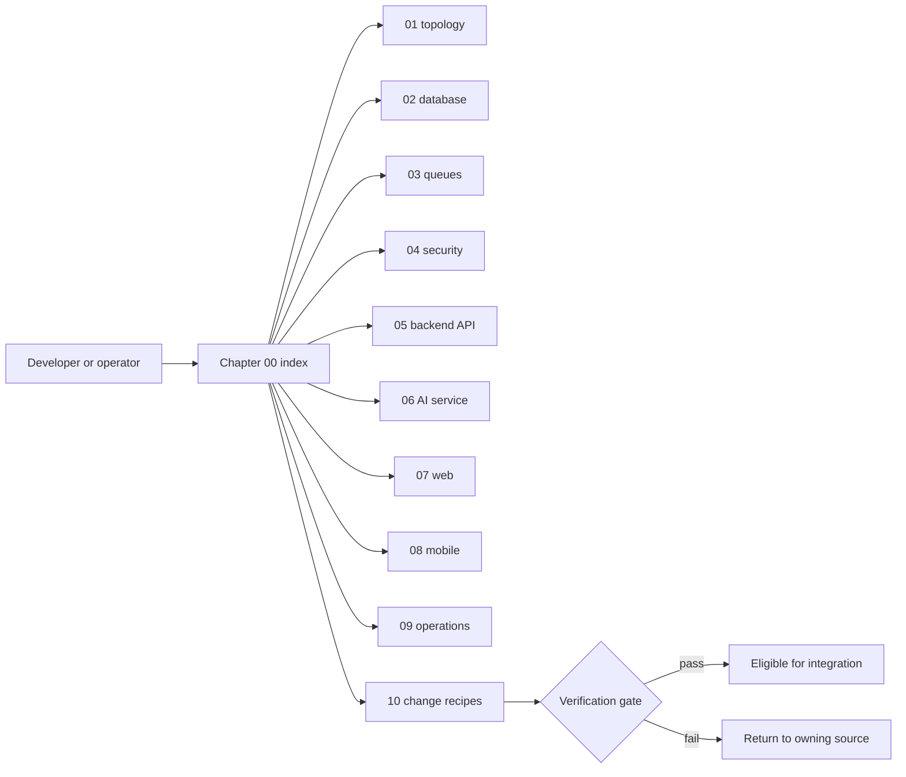

# Chapter 00 — Master Index and Field Guide

> **Snapshot authority.** This chapter describes commit `3d0c93e5270d44b9912deeae0218e95c9a311dd5` on branch `developement`. Source paths named below are the authority if the implementation changes after 2026-07-13.

This is the front door to the appliance-grade engineering reference for Nexora LMS/LXP. It defines the evidence boundary, terminology, update discipline, and safe paths to every subsystem.

## Source map

- `docs/CODEX_MASTER_MANUAL_PROMPT.md`
- `AGENTS.md`
- `backend/AGENTS.md`
- `next-frontend/AGENTS.md`
- `ai-service/AGENTS.md`
- `mobile/AGENTS.md`

<section class="manual-cover">
  
Gat Andres Bonifacio High School

  

    <svg viewBox="0 0 320 120" role="img" xmlns="http://www.w3.org/2000/svg">
      <rect x="4" y="4" width="312" height="112" rx="22" fill="#f8fafc" stroke="#0f172a" stroke-width="4"/>
      <text x="25" y="77" fill="#0f766e" font-size="47" font-family="DejaVu Sans, sans-serif" font-weight="700">NEXORA</text>
      <circle cx="280" cy="60" r="19" fill="#f59e0b"/><path d="M270 61l7 7 14-17" fill="none" stroke="#fff" stroke-width="6" stroke-linecap="round" stroke-linejoin="round"/>
    </svg>
  

  <h1>Nexora Master Technical &amp; Maintenance Service Manual</h1>
  
Repository-grounded engineering reference · 2026-07-13 · commit 3d0c93e

</section>

## Manual control record

| Control | Recorded value | Meaning |
| --- | --- | --- |
| Repository | capstone-nest-react-lms | Nexora LMS/LXP monorepo for web, mobile, backend, AI, and operations. |
| Branch | developement | Branch inspected while the manual was generated. |
| Commit | 3d0c93e5270d44b9912deeae0218e95c9a311dd5 | Immutable source snapshot for every catalog in this edition. |
| Inspection date | 2026-07-13 Asia/Manila | Calendar date for staleness checks. |
| Schema scope | 89 tables and 55 PostgreSQL enums | Derived from active files under backend/src/drizzle/schema. |
| Backend API scope | 385 route handlers | Derived from Nest HTTP decorators in every controller source. |
| AI API scope | 60 FastAPI route handlers | Derived from app and router decorators. |
| Web scope | 103 App Router pages | Derived from every page.tsx in next-frontend/app. |
| Mobile scope | 57 screen files | Derived from active mobile/src/screens, excluding tests. |

## Orientation map

## Chapter inventory

| Chapter | Title | Use it when |
| --- | --- | --- |
| 00 | Master index and guide | How to navigate, validate, rebuild, and maintain this manual. |
| 01 | System topology and architecture | Processes, containers, networks, ports, volumes, trust boundaries, and ownership. |
| 02 | Drizzle database schema and entity dictionary | All 89 tables, 55 enums, columns, indexes, foreign keys, and deletion behavior. |
| 03 | BullMQ queue and job orchestration | All seven queues, producers, job payloads, processors, retries, retention, and recovery. |
| 04 | Auth, RBAC, security, and session lifecycle | Web and mobile login, refresh rotation, guards, role access, and internal service authentication. |
| 05 | NestJS backend module and API catalog | All 37 modules, 385 controller routes, handler inputs, DTOs, responses, and downstream delegates. |
| 06 | FastAPI AI service and vector engine | All 60 AI routes, Pydantic contracts, runtime models, retrieval, indexing, and guardrails. |
| 07 | Next.js web frontend and role workspaces | All 103 pages, service wrappers, providers, caching, role gates, components, and tokens. |
| 08 | Expo mobile architecture and navigation | Boot composition, role navigation, screens, API clients, secure storage, and offline boundaries. |
| 09 | Observability, telemetry, and diagnostics | Metrics, logs, traces, dashboards, alerts, health endpoints, and incident procedures. |
| 10 | Developer modification cookbook | Exact maintenance recipes for schema, API, queue, AI, client, dependency, and verification work. |

## How to use the manual

1. Start with Chapter 01 when a request crosses process or trust boundaries.
2. Open Chapter 02 before changing persistence, because the database source is `backend/src/drizzle/schema/`, not a legacy `src/db/schema` path.
3. Open Chapter 03 before moving work into or out of a request cycle. BullMQ is the durability boundary for long-running AI and fan-out work.
4. Open Chapter 04 before changing cookies, bearer tokens, route decorators, forwarded headers, account state, or user-identifying logs.
5. Use the exhaustive catalogs in Chapters 05 through 08 to find the exact owner. Then inspect the named source file before editing.
6. Use Chapter 09 before claiming runtime health. A stopped stack and an old log stream are not live evidence.
7. Execute the recipe in Chapter 10 and its verification gate as one change unit.

## Authority and conflict rules

| Priority | Authority | Rule |
| --- | --- | --- |
| 1 | Active source and migrations | Runtime code, active Drizzle schema, active migrations, and Compose files win over prose. |
| 2 | Repository kernel and folder guides | AGENTS.md and subsystem AGENTS.md define ownership and safety invariants. |
| 3 | This manual at its recorded commit | Use the catalog directly only while the source snapshot still matches. |
| 4 | Older reports and archived migrations | Historical evidence can explain intent but cannot override active files. |

## Architectural invariants

- The NestJS backend owns public authentication, role authorization, official academic state, audit history, API envelopes, and durable queue orchestration.
- Web and mobile call backend routes under `/api`. Neither client calls the Python AI service directly.
- AI output is assistive. It does not become an official grade, enrollment, class record, or intervention action without backend-owned policy and, where required, teacher approval.
- Core Compose remains usable without the `observability` profile and without `docker-compose.debug.yml`.
- Long-running extraction and generation work remains restart-safe through backend-owned BullMQ contracts and durable database job records.
- The default generic mobile target is `mobile/`. Archived mobile folders are not active architecture.

## Naming and notation

| Notation | Interpretation |
| --- | --- |
| `/api/<route>` | Public NestJS route after the global prefix configured in backend/src/main.ts. |
| `/internal/<route>` | AI-service route requiring the shared internal service token unless the source states otherwise. |
| `:id` | NestJS or manual route parameter notation. |
| `{id}` | FastAPI path-parameter notation. |
| JWT authenticated | Global JwtAuthGuard applies and the handler is not marked public. |
| JWT plus roles | The bearer token is validated and RolesGuard accepts at least one listed role. |
| Derived state | A recomputable projection that is not the sole official academic record. |
| Official state | Backend-owned durable academic record requiring explicit authorization and audit discipline. |

## Edition maintenance procedure

1. Record the new commit with `git rev-parse HEAD`.
2. Compare active source counts for tables, routes, queues, pages, and screens against the control record.
3. Regenerate or reconcile the affected chapter before changing the recorded commit.
4. Search the manual for removed paths and renamed symbols.
5. Run the compile script and inspect the PDF table of contents, diagrams, wide tables, code blocks, and page footer.
6. Commit the source chapters and the compiler together so a reader can reproduce the edition.

## PDF build entrypoint

Run `bash docs/master-manual/compile_pdf.sh` from any directory. The script resolves the repository root, concatenates chapters 00 through 10, renders Mermaid in a local browser context, and writes `docs/master-manual/nexora-master-service-manual.pdf`. Its temporary build directory is removed after a successful compilation.

## Field glossary

| Term | Operational definition |
| --- | --- |
| BullMQ job ID | Queue-level deduplication and cancellation identifier, distinct from an AI database job UUID. |
| AI generation job | Durable row in ai_generation_jobs describing a teacher AI request and state. |
| Extraction | Durable extracted_modules workflow that converts an uploaded source into reviewable class content. |
| RAG | Retrieval-augmented generation over content_chunks and content_chunk_embeddings. |
| Class record | Official grade workbook rooted in class_records and its category, item, score, and final-grade children. |
| LXP intervention | Teacher-governed assistive remediation rooted in intervention_cases. |
| Ja | Student-facing J.A.K.I.P.I.R practice, review, ask, and tutoring capabilities. |
| Core topology | PostgreSQL, Redis, Ollama, backend, AI service, and frontend. |
| Observability topology | Opt-in Prometheus, blackbox exporter, Loki, Tempo, Grafana, Promtail, node-exporter, and cAdvisor services. |
