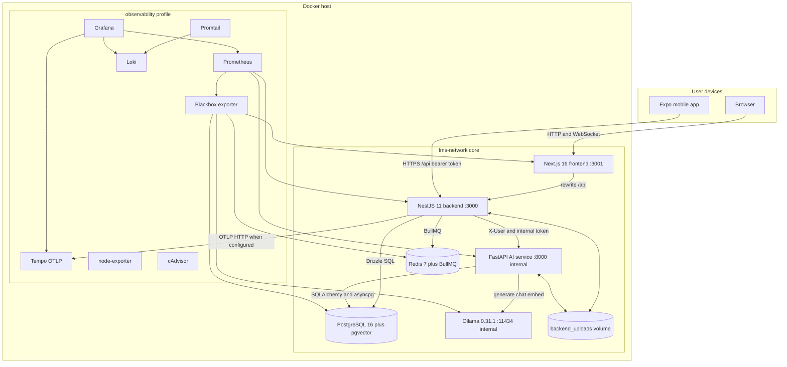
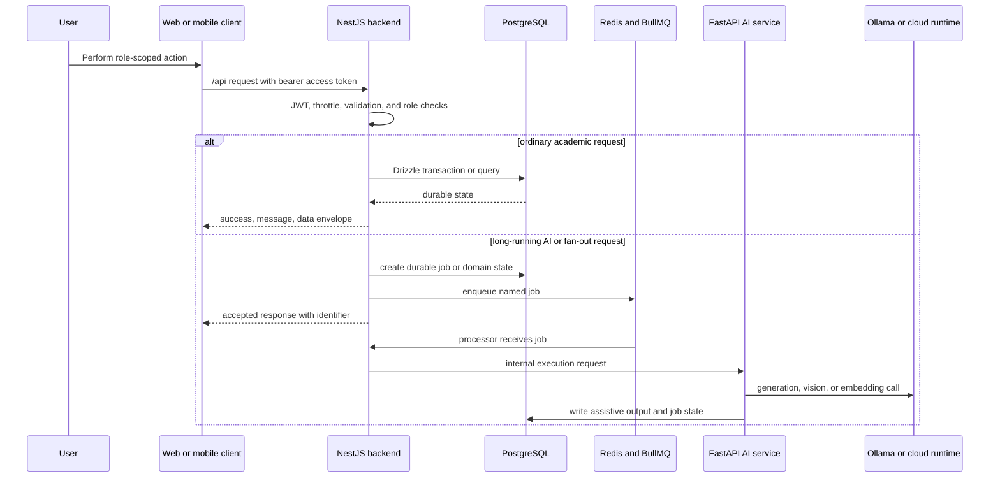
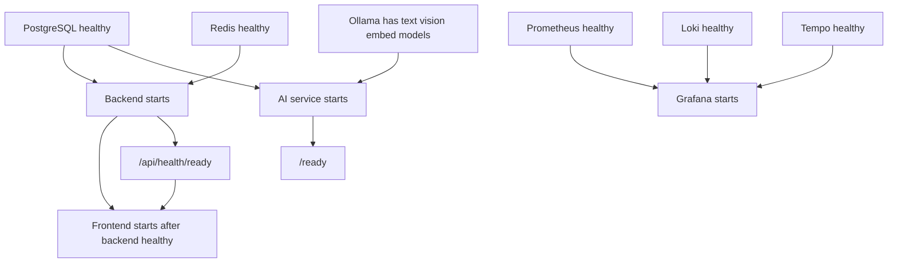

# Chapter 01 — System Topology and Cross-Subsystem Architecture

> **Snapshot authority.** This chapter describes commit `3d0c93e5270d44b9912deeae0218e95c9a311dd5` on branch `developement`. Source paths named below are the authority if the implementation changes after 2026-07-13.

This chapter is the deployment and ownership schematic. It follows every public request from client to backend, every durable asynchronous handoff through Redis, every AI execution boundary, and every optional telemetry path.

## Source map

- `docker-compose.yml`
- `docker-compose.debug.yml`
- `backend/src/main.ts`
- `backend/src/app.module.ts`
- `backend/Dockerfile`
- `backend/docker-entrypoint.sh`
- `next-frontend/Dockerfile`
- `next-frontend/next.config.ts`
- `ai-service/Dockerfile`
- `ai-service/app/main.py`
- `monitoring/`

## Deployment topology

### Public request path

## Service responsibility matrix

| Capability | Owning service | Durable authority | Prohibited shortcut |
| --- | --- | --- | --- |
| Authentication and RBAC | NestJS backend | users, roles, user_roles, refresh_tokens, OTP and audit data | Clients and AI service may not become independent auth authorities. |
| Official classes, enrollment, assessments, scores, and class records | NestJS backend | Drizzle tables and audited service transactions | AI output may not directly overwrite official records. |
| Web presentation and browser session orchestration | Next.js frontend | Backend API; browser holds only transient access state and refresh cookie | Web code may not query PostgreSQL or AI service directly. |
| Mobile presentation and secure token persistence | Expo mobile | Backend API; device secure storage holds session tokens | Mobile code may not assume browser cookie semantics. |
| AI tutoring, extraction, retrieval, and draft generation | FastAPI AI service behind backend | Assistive tables and backend-owned job rows | Shared-secret access does not grant public or academic authority. |
| Long-running work and retries | NestJS BullMQ workers | Redis queue state plus domain and job tables | FastAPI process-local background tasks may not replace durable queue orchestration. |
| Metrics, logs, and traces | Optional observability profile | Prometheus, Loki, Tempo, Grafana volumes | Core startup may not depend on observability services. |

## Compose service inventory

> **Exhaustive inventory rule.** The 17 Compose service declarations below were extracted from `docker-compose.yml and docker-compose.debug.yml` at commit `3d0c93e`. A later source change requires regenerating or manually reconciling this chapter.

| Compose file | Service | Image or build | Profile | Host ports | Runtime user | Volumes | Depends on |
| --- | --- | --- | --- | --- | --- | --- | --- |
| docker-compose.yml | postgres | pgvector/pgvector:pg16 | core or override | not host-published | image default or Dockerfile user | postgres_data:/var/lib/postgresql/data | none |
| docker-compose.yml | redis | redis:7-alpine | core or override | not host-published | image default or Dockerfile user | none | none |
| docker-compose.yml | ollama | ollama/ollama:0.31.1 | core or override | not host-published | image default or Dockerfile user | ollama_data:/root/.ollama | none |
| docker-compose.yml | backend | {"context":"./backend","dockerfile":"Dockerfile"} | core or override | 3000:3000 | image default or Dockerfile user | backend_uploads:/app/uploads | postgres, redis |
| docker-compose.yml | ai-service | {"context":"./ai-service","dockerfile":"Dockerfile"} | core or override | not host-published | image default or Dockerfile user | backend_uploads:/app/uploads | postgres, ollama |
| docker-compose.yml | frontend | {"context":"./next-frontend","dockerfile":"Dockerfile","args":{"NEXT_PUBLIC_API_URL":"${NEXT_PUBLIC_API_URL:-http://backend:3000}","NEXT_PUBLIC_WS_URL":"${NEXT_PUBLIC_WS_URL:-http://localhost:3000}"}} | core or override | ${FRONTEND_PORT:-3001}:3001 | image default or Dockerfile user | none | backend |
| docker-compose.yml | prometheus | prom/prometheus:v2.54.1 | observability | ${PROMETHEUS_PORT:-9090}:9090 | image default or Dockerfile user | ./monitoring/prometheus.yml:/etc/prometheus/prometheus.yml:ro, prometheus_data:/prometheus | none |
| docker-compose.yml | blackbox-exporter | prom/blackbox-exporter:v0.25.0 | observability | not host-published | image default or Dockerfile user | ./monitoring/blackbox.yml:/etc/blackbox_exporter/config.yml:ro | none |
| docker-compose.yml | loki | grafana/loki:3.2.1 | observability | ${LOKI_PORT:-3100}:3100 | image default or Dockerfile user | ./monitoring/loki-config.yml:/etc/loki/local-config.yaml:ro, loki_data:/loki | none |
| docker-compose.yml | tempo | grafana/tempo:2.6.1 | observability | ${TEMPO_PORT:-3200}:3200, ${TEMPO_OTLP_HTTP_PORT:-4318}:4318 | 0 | ./monitoring/tempo-config.yml:/etc/tempo.yaml:ro, tempo_data:/tmp/tempo | none |
| docker-compose.yml | grafana | grafana/grafana:11.6.16 | observability | ${GRAFANA_PORT:-3002}:3000 | image default or Dockerfile user | ./monitoring/grafana/provisioning:/etc/grafana/provisioning:ro, ./monitoring/grafana/dashboards:/var/lib/grafana/dashboards:ro, grafana_data:/var/lib/grafana | prometheus, loki, tempo |
| docker-compose.yml | promtail | grafana/promtail:3.2.1 | observability | not host-published | image default or Dockerfile user | ./monitoring/promtail-config.yml:/etc/promtail/config.yml:ro, promtail_positions:/run/promtail, /var/lib/docker/containers:/var/lib/docker/containers:ro, /var/run/docker.sock:/var/run/docker.sock:ro | loki |
| docker-compose.yml | node-exporter | prom/node-exporter:v1.8.2 | observability | not host-published | image default or Dockerfile user | /proc:/host/proc:ro, /sys:/host/sys:ro, /:/rootfs:ro, /run/udev/data:/run/udev/data:ro | none |
| docker-compose.yml | cadvisor | ghcr.io/google/cadvisor:v0.60.5 | observability | not host-published | image default or Dockerfile user | /:/rootfs:ro, /var/run:/var/run:ro, /sys:/sys:ro, /var/lib/docker:/var/lib/docker:ro | none |
| docker-compose.debug.yml | postgres | None | core or override | ${POSTGRES_HOST_PORT:-55432}:5432 | image default or Dockerfile user | none | none |
| docker-compose.debug.yml | redis | None | core or override | ${REDIS_HOST_PORT:-6379}:6379 | image default or Dockerfile user | none | none |
| docker-compose.debug.yml | ai-service | None | core or override | ${AI_SERVICE_PORT:-8000}:8000 | image default or Dockerfile user | none | none |

## Network and port boundaries

| Port | Owner | Core host exposure | Debug or observability exposure | Purpose |
| --- | --- | --- | --- | --- |
| 3000 | backend | 3000:3000 | unchanged | Public Nest HTTP API, Swagger outside production, WebSocket namespace, health, and metrics. |
| 3001 | frontend | FRONTEND_PORT default 3001 | unchanged | Next.js web application. |
| 5432 | postgres | internal only | POSTGRES_HOST_PORT default 55432 | PostgreSQL and pgvector. |
| 6379 | redis | internal only | REDIS_HOST_PORT default 6379 | BullMQ transport and token rotation grace cache. |
| 8000 | ai-service | internal only | AI_SERVICE_PORT default 8000 | FastAPI execution, health, readiness, and metrics. |
| 11434 | ollama | internal only | no supplied host mapping | Local text, vision, and embedding runtime. |
| 9090 | prometheus | absent unless profile enabled | PROMETHEUS_PORT default 9090 | Metrics query and storage. |
| 3100 | loki | absent unless profile enabled | LOKI_PORT default 3100 | Log aggregation API. |
| 3200 | tempo | absent unless profile enabled | TEMPO_PORT default 3200 | Tempo query and readiness API. |
| 4318 | tempo | absent unless profile enabled | TEMPO_OTLP_HTTP_PORT default 4318 | OTLP HTTP trace ingestion. |
| 3000 container | grafana | absent unless profile enabled | GRAFANA_PORT default 3002 | Dashboards and alerting UI. |
| 9115 | blackbox-exporter | internal only | profile-internal | HTTP and TCP probes. |
| 9080 | promtail | internal only | profile-internal | Promtail readiness. |
| 9100 | node-exporter | internal only | profile-internal | Host metrics. |
| 8080 | cadvisor | internal only | profile-internal | Container metrics. |

All services join the bridge network `lms-network`. Core data stores and AI execution remain unexposed by default. The debug override adds only PostgreSQL, Redis, and AI service host mappings and must be named explicitly with a second `-f` argument.

## Topology modes

| Mode | Command shape | Services | Use |
| --- | --- | --- | --- |
| Core | docker compose up --build | postgres, redis, ollama, backend, ai-service, frontend | Normal local or server topology; Compose reads root `.env`. |
| Core plus observability | docker compose --profile observability up --build | Core plus eight telemetry services | Operational dashboards, alerts, logs, probes, and traces. |
| Core plus debug ports | docker compose -f docker-compose.yml -f docker-compose.debug.yml up --build | Core with host access to PostgreSQL, Redis, and FastAPI | Explicit local diagnostics and direct client tools. |
| Core plus both | docker compose -f docker-compose.yml -f docker-compose.debug.yml --profile observability up --build | Core, debug mappings, and telemetry profile | Full local engineering laboratory. |

## Startup and readiness chain

- PostgreSQL uses `pg_isready` against database `capstone`.
- Redis uses `redis-cli ping`.
- Ollama readiness requires all configured text, vision, and embedding models to resolve with `ollama show`. Its entrypoint pulls each model before reporting ready.
- Backend readiness calls `/api/health/ready` after its entrypoint verifies the database, optionally runs migrations, optionally seeds, and drops privileges to the Node user.
- AI readiness calls `/ready` and is allowed to return a non-5xx degraded response only according to its configured readiness logic.
- Frontend waits for backend health but has no Compose healthcheck of its own.

## Volumes and durability

| Volume | Mounted by | Data class | Recovery implication |
| --- | --- | --- | --- |
| postgres_data | postgres | All PostgreSQL and pgvector records | Back up before destructive migration or credential-volume reset. |
| ollama_data | ollama | Downloaded model layers | Rebuildable from pinned model names but expensive to redownload. |
| backend_uploads | backend and ai-service | Uploaded PDFs, rosters, and library files | Shared path is required for extraction and protected download flows. |
| prometheus_data | prometheus | Metrics time series | Optional operations history. |
| grafana_data | grafana | Grafana runtime state | Provisioned dashboards remain in source; local UI state may be lost. |
| loki_data | loki | Aggregated logs | Optional incident history. |
| tempo_data | tempo | Trace blocks | Optional distributed tracing history. |
| promtail_positions | promtail | Docker log read offsets | Prevents duplicate log ingestion after restart. |

## Container user policy

- Backend image ownership is baked for the official `node` account. The entrypoint may begin as root only to repair the mounted upload volume, then re-executes migrations, seeding, and the server through `su-exec node`.
- Frontend creates UID 1001 `nextjs`, copies the standalone build with that ownership, and declares `USER nextjs`.
- AI service creates the system account `app`, copies source with `app:app` ownership, and declares `USER app`.
- Tempo explicitly runs as UID 0 in Compose because the supplied volume path and image contract require it. Treat this as an observability-profile exception, not a pattern for application containers.
- PostgreSQL, Redis, Ollama, Grafana, Prometheus, Loki, exporters, and collectors use their image defaults unless Compose states otherwise.

## Trust-boundary rules

1. External users terminate at Next.js or the backend. The AI service is not host-published in core mode.
2. The backend validates JWTs and roles before forwarding identity headers to FastAPI.
3. FastAPI accepts forwarded identity only when the configured internal service token matches, if a secret is configured. Internal-only execution routes always require a non-empty matching secret.
4. PostgreSQL and Redis do not have core host mappings. Add the debug override only for a controlled workstation.
5. Observability mounts Docker and host paths read-only where specified. cAdvisor requires device and host filesystem visibility; Promtail reads Docker container logs and the Docker socket.

## Failure domains

| Failure | What remains available | Expected symptom | First evidence |
| --- | --- | --- | --- |
| Ollama unavailable | Core academic API and clients | AI readiness or AI requests degrade or fail; cloud fallback may serve configured tasks | ai-service /ready, Ollama health, AI metrics. |
| AI service unavailable | Non-AI backend routes and clients | Backend AI proxy returns 503 or 504; queued jobs retry | backend logs, BullMQ state, ai-service container state. |
| Redis unavailable | Read paths not requiring Redis may work | Queues and refresh grace cache fail; backend health may report dependency failure | Redis health and backend readiness. |
| PostgreSQL unavailable | Static frontend process may still answer | Backend and AI durable operations fail readiness | pg_isready, backend entrypoint output, /api/health/ready. |
| Observability profile unavailable | Entire core product | No dashboards, stored logs, or traces | docker compose --profile observability ps. |
| Shared upload volume unavailable or misowned | Routes not touching files | Upload, extraction, and protected download failures | backend entrypoint ownership message and file-service logs. |
