# Chapter 02 — Drizzle ORM Database Schema and Entity Dictionary

> **Snapshot authority.** This chapter describes commit `3d0c93e5270d44b9912deeae0218e95c9a311dd5` on branch `developement`. Source paths named below are the authority if the implementation changes after 2026-07-13.

This chapter is the persistent-data service sheet. It records every active PostgreSQL table, enum, column builder, default, index, outgoing foreign key, vector dimension, and declared deletion action.

## Source map

- `backend/src/drizzle/schema/`
- `backend/drizzle/0000_baseline_nexora.sql`
- `backend/drizzle/0001_mixed_morgan_stark.sql`
- `backend/drizzle/0002_small_photon.sql`
- `backend/drizzle/0003_enable_pgvector.sql`
- `backend/drizzle/meta/`
- `backend/drizzle.config.ts`

## Data authority and migration chain

- Active TypeScript schema authority is `backend/src/drizzle/schema/`.
- Active SQL migrations are ordered `0000_baseline_nexora.sql`, `0001_mixed_morgan_stark.sql`, `0002_small_photon.sql`, and `0003_enable_pgvector.sql`.
- Migration 0003 executes `CREATE EXTENSION IF NOT EXISTS vector;`. This must run before a fresh database creates or uses the 768-dimensional vector column from the baseline.
- The baseline declares the complete current table set. Later migrations adjust it. Drizzle metadata snapshots support generation but do not replace the TypeScript source.
- Legacy or archived migration folders are historical evidence only and are not part of the active sequence.

## Master entity-relationship diagram

> **Exhaustive inventory rule.** The 89 active tables below were extracted from `backend/src/drizzle/schema/*.ts` at commit `3d0c93e`. A later source change requires regenerating or manually reconciling this chapter.

The master ERD includes every active table. For PDF legibility it shows one representative key field per entity; the complete columns follow in the encyclopedia.

```mermaid
erDiagram
  academic_system_states {
    uuid id PK
  }
  ai_interaction_logs {
    uuid id PK
  }
  extracted_modules {
    uuid id PK
  }
  announcements {
    uuid id PK
  }
  notifications {
    uuid id PK
  }
  app_versions {
    uuid id PK
  }
  roles {
    uuid id PK
  }
  users {
    uuid id PK
  }
  user_roles {
    uuid user_id
  }
  audit_logs {
    uuid id PK
  }
  sections {
    uuid id PK
  }
  classes {
    uuid id PK
  }
  class_schedules {
    uuid id PK
  }
  student_profiles {
    uuid user_id PK
  }
  teacher_profiles {
    uuid user_id PK
  }
  enrollments {
    uuid id PK
  }
  lessons {
    uuid id PK
  }
  lesson_content_blocks {
    uuid id PK
  }
  lesson_completions {
    uuid id PK
  }
  lesson_versions {
    uuid id PK
  }
  assessments {
    uuid id PK
  }
  assessment_questions {
    uuid id PK
  }
  assessment_question_options {
    uuid id PK
  }
  assessment_attempts {
    uuid id PK
  }
  assessment_responses {
    uuid id PK
  }
  archived_users {
    uuid id PK
  }
  class_modules {
    uuid id PK
  }
  module_sections {
    uuid id PK
  }
  module_items {
    uuid id PK
  }
  module_grading_scale_entries {
    uuid id PK
  }
  uploaded_files {
    uuid id PK
  }
  class_visibility_preferences {
    uuid id PK
  }
  student_class_presentation_preferences {
    uuid id PK
  }
  student_course_view_preferences {
    uuid id PK
  }
  section_visibility_preferences {
    uuid id PK
  }
  library_folders {
    uuid id PK
  }
  pending_roster {
    uuid id PK
  }
  class_records {
    uuid id PK
  }
  class_record_categories {
    uuid id PK
  }
  class_record_items {
    uuid id PK
  }
  class_record_scores {
    uuid id PK
  }
  class_record_final_grades {
    uuid id PK
  }
  class_templates {
    uuid id PK
  }
  class_template_modules {
    uuid id PK
  }
  class_template_module_sections {
    uuid id PK
  }
  class_template_assessments {
    uuid id PK
  }
  class_template_lessons {
    uuid id PK
  }
  class_template_lesson_blocks {
    uuid id PK
  }
  class_template_assessment_questions {
    uuid id PK
  }
  class_template_assessment_question_options {
    uuid id PK
  }
  class_template_engine_chunks {
    varchar id PK
  }
  class_template_module_items {
    uuid id PK
  }
  class_template_announcements {
    uuid id PK
  }
  discussion_threads {
    uuid id PK
  }
  discussion_thread_attachments {
    uuid id PK
  }
  discussion_comments {
    uuid id PK
  }
  discussion_comment_attachments {
    uuid id PK
  }
  discussion_comment_reactions {
    uuid id PK
  }
  ja_sessions {
    uuid id PK
  }
  ja_session_items {
    uuid id PK
  }
  ja_session_responses {
    uuid id PK
  }
  ja_session_events {
    uuid id PK
  }
  ja_progress {
    uuid student_id
  }
  ja_xp_ledger {
    uuid id PK
  }
  ja_threads {
    uuid id PK
  }
  ja_thread_messages {
    uuid id PK
  }
  ja_guardrail_events {
    uuid id PK
  }
  intervention_cases {
    uuid id PK
  }
  intervention_assignments {
    uuid id PK
  }
  lxp_generated_remedial_lessons {
    uuid id PK
  }
  lxp_generated_guided_assessments {
    uuid id PK
  }
  lxp_generated_guided_assessment_attempts {
    uuid id PK
  }
  lxp_progress {
    uuid student_id
  }
  system_evaluations {
    uuid id PK
  }
  system_evaluation_campaigns {
    uuid id PK
  }
  system_evaluation_assignments {
    uuid id PK
  }
  class_ai_policies {
    uuid class_id
  }
  teacher_evaluation_windows {
    uuid id PK
  }
  teacher_evaluation_submissions {
    uuid id PK
  }
  otp_verifications {
    uuid id PK
  }
  performance_snapshots {
    uuid id PK
  }
  performance_logs {
    uuid id PK
  }
  content_chunks {
    uuid id PK
  }
  content_chunk_embeddings {
    uuid chunk_id PK
  }
  student_concept_mastery {
    uuid id PK
  }
  ai_generation_jobs {
    uuid id PK
  }
  ai_generation_outputs {
    uuid id PK
  }
  refresh_tokens {
    uuid id PK
  }
  school_events {
    uuid id PK
  }
  ai_generation_jobs ||--o{ ai_generation_outputs : "job_id"
  assessment_attempts ||--o{ assessment_responses : "attempt_id"
  assessment_question_options ||--o{ assessment_responses : "selected_option_id"
  assessment_questions ||--o{ assessment_question_options : "question_id"
  assessment_questions ||--o{ assessment_responses : "question_id"
  assessment_questions ||--o{ content_chunks : "question_id"
  assessments ||--o{ assessment_attempts : "assessment_id"
  assessments ||--o{ assessment_questions : "assessment_id"
  assessments ||--o{ class_record_items : "assessment_id"
  assessments ||--o{ content_chunks : "assessment_id"
  assessments ||--o{ intervention_assignments : "assessment_id"
  assessments ||--o{ lxp_generated_guided_assessments : "source_assessment_id"
  assessments ||--o{ module_items : "assessment_id"
  class_modules ||--o{ module_grading_scale_entries : "module_id"
  class_modules ||--o{ module_sections : "module_id"
  class_record_categories ||--o{ class_record_items : "category_id"
  class_record_items ||--o{ class_record_scores : "gradebook_item_id"
  class_records ||--o{ class_record_categories : "gradebook_id"
  class_records ||--o{ class_record_final_grades : "gradebook_id"
  class_records ||--o{ class_record_items : "gradebook_id"
  class_template_assessment_questions ||--o{ class_template_assessment_question_options : "template_assessment_question_id"
  class_template_assessments ||--o{ class_template_assessment_questions : "template_assessment_id"
  class_template_assessments ||--o{ class_template_module_items : "template_assessment_id"
  class_template_lessons ||--o{ class_template_lesson_blocks : "template_lesson_id"
  class_template_lessons ||--o{ class_template_module_items : "template_lesson_id"
  class_template_module_sections ||--o{ class_template_module_items : "template_section_id"
  class_template_modules ||--o{ class_template_module_sections : "template_module_id"
  class_templates ||--o{ class_template_announcements : "template_id"
  class_templates ||--o{ class_template_assessments : "template_id"
  class_templates ||--o{ class_template_engine_chunks : "template_id"
  class_templates ||--o{ class_template_lessons : "template_id"
  class_templates ||--o{ class_template_modules : "template_id"
  classes ||--o{ ai_generation_jobs : "class_id"
  classes ||--o{ ai_generation_outputs : "target_class_id"
  classes ||--o{ announcements : "class_id"
  classes ||--o{ assessments : "class_id"
  classes ||--o{ class_ai_policies : "class_id"
  classes ||--o{ class_modules : "class_id"
  classes ||--o{ class_records : "class_id"
  classes ||--o{ class_schedules : "class_id"
  classes ||--o{ class_visibility_preferences : "class_id"
  classes ||--o{ content_chunks : "class_id"
  classes ||--o{ discussion_threads : "class_id"
  classes ||--o{ enrollments : "class_id"
  classes ||--o{ extracted_modules : "class_id"
  classes ||--o{ intervention_cases : "class_id"
  classes ||--o{ ja_guardrail_events : "class_id"
  classes ||--o{ ja_progress : "class_id"
  classes ||--o{ ja_sessions : "class_id"
  classes ||--o{ ja_threads : "class_id"
  classes ||--o{ ja_xp_ledger : "class_id"
  classes ||--o{ lessons : "class_id"
  classes ||--o{ lxp_generated_guided_assessment_attempts : "class_id"
  classes ||--o{ lxp_generated_guided_assessments : "class_id"
  classes ||--o{ lxp_generated_remedial_lessons : "class_id"
  classes ||--o{ lxp_progress : "class_id"
  classes ||--o{ performance_logs : "class_id"
  classes ||--o{ performance_snapshots : "class_id"
  classes ||--o{ student_class_presentation_preferences : "class_id"
  classes ||--o{ student_concept_mastery : "class_id"
  classes ||--o{ system_evaluation_campaigns : "class_id"
  classes ||--o{ teacher_evaluation_submissions : "class_id"
  classes ||--o{ teacher_evaluation_windows : "class_id"
  classes ||--o{ uploaded_files : "class_id"
  content_chunks ||--o| content_chunk_embeddings : "chunk_id"
  discussion_comments ||--o{ discussion_comment_attachments : "comment_id"
  discussion_comments ||--o{ discussion_comment_reactions : "comment_id"
  discussion_threads ||--o{ discussion_comments : "thread_id"
  discussion_threads ||--o{ discussion_thread_attachments : "thread_id"
  extracted_modules ||--o{ content_chunks : "extraction_id"
  intervention_assignments ||--o{ lxp_generated_guided_assessment_attempts : "assignment_id"
  intervention_cases ||--o{ intervention_assignments : "case_id"
  intervention_cases ||--o{ lxp_generated_guided_assessment_attempts : "case_id"
  intervention_cases ||--o{ lxp_generated_guided_assessments : "case_id"
  intervention_cases ||--o{ lxp_generated_remedial_lessons : "case_id"
  ja_session_items ||--o{ ja_session_responses : "session_item_id"
  ja_sessions ||--o{ ja_session_events : "session_id"
  ja_sessions ||--o{ ja_session_items : "session_id"
  ja_sessions ||--o{ ja_xp_ledger : "session_id"
  ja_thread_messages ||--o{ ja_guardrail_events : "message_id"
  ja_threads ||--o{ ja_guardrail_events : "thread_id"
  ja_threads ||--o{ ja_thread_messages : "thread_id"
  lessons ||--o{ content_chunks : "lesson_id"
  lessons ||--o{ intervention_assignments : "lesson_id"
  lessons ||--o{ lesson_completions : "lesson_id"
  lessons ||--o{ lesson_content_blocks : "lesson_id"
  lessons ||--o{ lesson_versions : "lesson_id"
  lessons ||--o{ module_items : "lesson_id"
  lxp_generated_guided_assessments ||--o{ lxp_generated_guided_assessment_attempts : "guided_assessment_id"
  module_sections ||--o{ module_items : "module_section_id"
  roles ||--o{ user_roles : "role_id"
  sections ||--o{ classes : "section_id"
  sections ||--o{ enrollments : "section_id"
  sections ||--o{ pending_roster : "section_id"
  sections ||--o{ section_visibility_preferences : "section_id"
  system_evaluation_campaigns ||--o{ system_evaluation_assignments : "campaign_id"
  system_evaluation_campaigns ||--o{ system_evaluations : "campaign_id"
  system_evaluations ||--o{ system_evaluation_assignments : "submitted_evaluation_id"
  teacher_evaluation_windows ||--o{ teacher_evaluation_submissions : "window_id"
  uploaded_files ||--o{ content_chunks : "library_file_id"
  uploaded_files ||--o{ discussion_comment_attachments : "file_id"
  uploaded_files ||--o{ discussion_thread_attachments : "file_id"
  uploaded_files ||--o{ extracted_modules : "file_id"
  users ||--o{ academic_system_states : "updated_by"
  users ||--o{ ai_generation_jobs : "teacher_id"
  users ||--o{ ai_generation_outputs : "approved_by"
  users ||--o{ ai_generation_outputs : "target_teacher_id"
  users ||--o{ ai_interaction_logs : "user_id"
  users ||--o{ announcements : "author_id"
  users ||--o{ assessment_attempts : "student_id"
  users ||--o{ audit_logs : "actor_id"
  users ||--o{ class_ai_policies : "updated_by"
  users ||--o{ class_record_final_grades : "student_id"
  users ||--o{ class_record_scores : "student_id"
  users ||--o{ class_records : "teacher_id"
  users ||--o{ class_templates : "created_by"
  users ||--o{ class_visibility_preferences : "user_id"
  users ||--o{ classes : "teacher_id"
  users ||--o{ discussion_comment_reactions : "user_id"
  users ||--o{ discussion_comments : "author_id"
  users ||--o{ discussion_comments : "deleted_by_id"
  users ||--o{ discussion_threads : "author_id"
  users ||--o{ enrollments : "student_id"
  users ||--o{ extracted_modules : "teacher_id"
  users ||--o{ intervention_cases : "student_id"
  users ||--o{ ja_guardrail_events : "student_id"
  users ||--o{ ja_progress : "student_id"
  users ||--o{ ja_sessions : "student_id"
  users ||--o{ ja_threads : "student_id"
  users ||--o{ ja_xp_ledger : "student_id"
  users ||--o{ lesson_completions : "student_id"
  users ||--o{ lesson_versions : "created_by"
  users ||--o{ library_folders : "owner_id"
  users ||--o{ lxp_generated_guided_assessment_attempts : "student_id"
  users ||--o{ lxp_generated_guided_assessments : "approved_by"
  users ||--o{ lxp_generated_guided_assessments : "student_id"
  users ||--o{ lxp_generated_remedial_lessons : "approved_by"
  users ||--o{ lxp_generated_remedial_lessons : "student_id"
  users ||--o{ lxp_progress : "student_id"
  users ||--o{ notifications : "user_id"
  users ||--o{ otp_verifications : "user_id"
  users ||--o{ pending_roster : "resolved_user_id"
  users ||--o{ performance_logs : "student_id"
  users ||--o{ performance_snapshots : "student_id"
  users ||--o{ refresh_tokens : "user_id"
  users ||--o{ section_visibility_preferences : "user_id"
  users ||--o{ sections : "adviser_id"
  users ||--o{ student_class_presentation_preferences : "user_id"
  users ||--o{ student_concept_mastery : "student_id"
  users ||--o{ student_course_view_preferences : "user_id"
  users ||--o{ system_evaluation_assignments : "respondent_id"
  users ||--o{ system_evaluation_campaigns : "created_by"
  users ||--o{ system_evaluations : "submitted_by"
  users ||--o{ teacher_evaluation_submissions : "student_id"
  users ||--o{ teacher_evaluation_submissions : "teacher_id"
  users ||--o{ teacher_evaluation_windows : "teacher_id"
  users ||--o{ uploaded_files : "teacher_id"
  users ||--o{ user_roles : "user_id"
  users ||--o| student_profiles : "user_id"
  users ||--o| teacher_profiles : "user_id"
```

## Domain ownership map

| Schema source | Tables | Primary ownership |
| --- | --- | --- |
| backend/src/drizzle/schema/academic-state.schema.ts | academic_system_states | Academic-State persistence |
| backend/src/drizzle/schema/ai-mentor.schema.ts | ai_interaction_logs, extracted_modules | Ai-Mentor persistence |
| backend/src/drizzle/schema/announcements-notifications.schema.ts | announcements, notifications | Announcements-Notifications persistence |
| backend/src/drizzle/schema/app-version.schema.ts | app_versions | App-Version persistence |
| backend/src/drizzle/schema/base.schema.ts | roles, users, user_roles, audit_logs, sections, classes, class_schedules, student_profiles, teacher_profiles, enrollments, lessons, lesson_content_blocks, lesson_completions, lesson_versions, assessments, assessment_questions, assessment_question_options, assessment_attempts, assessment_responses, archived_users, class_modules, module_sections, module_items, module_grading_scale_entries, uploaded_files, class_visibility_preferences, student_class_presentation_preferences, student_course_view_preferences, section_visibility_preferences, library_folders, pending_roster | Base persistence |
| backend/src/drizzle/schema/class-record.schema.ts | class_records, class_record_categories, class_record_items, class_record_scores, class_record_final_grades | Class-Record persistence |
| backend/src/drizzle/schema/class-templates.schema.ts | class_templates, class_template_modules, class_template_module_sections, class_template_assessments, class_template_lessons, class_template_lesson_blocks, class_template_assessment_questions, class_template_assessment_question_options, class_template_engine_chunks, class_template_module_items, class_template_announcements | Class-Templates persistence |
| backend/src/drizzle/schema/discussion-board.schema.ts | discussion_threads, discussion_thread_attachments, discussion_comments, discussion_comment_attachments, discussion_comment_reactions | Discussion-Board persistence |
| backend/src/drizzle/schema/ja.schema.ts | ja_sessions, ja_session_items, ja_session_responses, ja_session_events, ja_progress, ja_xp_ledger, ja_threads, ja_thread_messages, ja_guardrail_events | Ja persistence |
| backend/src/drizzle/schema/lxp.schema.ts | intervention_cases, intervention_assignments, lxp_generated_remedial_lessons, lxp_generated_guided_assessments, lxp_generated_guided_assessment_attempts, lxp_progress, system_evaluations, system_evaluation_campaigns, system_evaluation_assignments, class_ai_policies, teacher_evaluation_windows, teacher_evaluation_submissions | Lxp persistence |
| backend/src/drizzle/schema/otp.schema.ts | otp_verifications | Otp persistence |
| backend/src/drizzle/schema/performance.schema.ts | performance_snapshots, performance_logs | Performance persistence |
| backend/src/drizzle/schema/rag.schema.ts | content_chunks, content_chunk_embeddings, student_concept_mastery, ai_generation_jobs, ai_generation_outputs | Rag persistence |
| backend/src/drizzle/schema/refresh-tokens.schema.ts | refresh_tokens | Refresh-Tokens persistence |
| backend/src/drizzle/schema/school-events.schema.ts | school_events | School-Events persistence |

## PostgreSQL enum dictionary

> **Exhaustive inventory rule.** The 55 active enum declarations below were extracted from `backend/src/drizzle/schema/*.ts` at commit `3d0c93e`. A later source change requires regenerating or manually reconciling this chapter.

| Database enum | TypeScript symbol | Allowed values | Source |
| --- | --- | --- | --- |
| ai_session_type | aiSessionTypeEnum | module_extraction, mentor_chat, admin_analytics_chat, mistake_explanation | backend/src/drizzle/schema/ai-mentor.schema.ts |
| extraction_status | extractionStatusEnum | pending, processing, completed, failed, applied | backend/src/drizzle/schema/ai-mentor.schema.ts |
| notification_type | notificationTypeEnum | announcement_posted, discussion_thread_posted, discussion_comment_posted, assessment_assigned, grade_updated, assessment_due, assessment_graded | backend/src/drizzle/schema/announcements-notifications.schema.ts |
| account_status | accountStatusEnum | ACTIVE, PENDING, SUSPENDED, DELETED | backend/src/drizzle/schema/base.schema.ts |
| content_type | contentTypeEnum | video, document, quiz, link | backend/src/drizzle/schema/base.schema.ts |
| assessment_type | assessmentTypeEnum | quiz, exam, assignment, file_upload | backend/src/drizzle/schema/base.schema.ts |
| rubric_parse_status | rubricParseStatusEnum | pending, parsed, reviewed, failed | backend/src/drizzle/schema/base.schema.ts |
| class_record_category | classRecordCategoryEnum | written_work, performance_task, quarterly_assessment | backend/src/drizzle/schema/base.schema.ts |
| grading_period | gradingPeriodEnum | Q1, Q2, Q3, Q4 | backend/src/drizzle/schema/base.schema.ts |
| enrollment_status | enrollmentStatusEnum | enrolled, dropped, completed | backend/src/drizzle/schema/base.schema.ts |
| grade_level | gradeLevelEnum | 7, 8, 9, 10 | backend/src/drizzle/schema/base.schema.ts |
| lesson_content_type | lessonContentTypeEnum | text, image, video, question, file, divider | backend/src/drizzle/schema/base.schema.ts |
| lesson_version_type | lessonVersionTypeEnum | auto, manual, restore | backend/src/drizzle/schema/base.schema.ts |
| question_type | questionTypeEnum | multiple_choice, multiple_select, true_false, short_answer, fill_blank, dropdown | backend/src/drizzle/schema/base.schema.ts |
| feedback_level | feedbackLevelEnum | immediate, standard, detailed | backend/src/drizzle/schema/base.schema.ts |
| file_scope | fileScopeEnum | private, general | backend/src/drizzle/schema/base.schema.ts |
| library_subject_key | librarySubjectKeyEnum | math, science, english, filipino, ap, tle, mapeh, esp | backend/src/drizzle/schema/base.schema.ts |
| library_index_status | libraryIndexStatusEnum | not_indexed, pending, processing, completed, failed | backend/src/drizzle/schema/base.schema.ts |
| library_file_kind | libraryFileKindEnum | pdf, txt, pptx, image | backend/src/drizzle/schema/base.schema.ts |
| module_item_type | moduleItemTypeEnum | lesson, assessment, file | backend/src/drizzle/schema/base.schema.ts |
| student_presentation_mode | studentPresentationModeEnum | solid, gradient, preset | backend/src/drizzle/schema/base.schema.ts |
| student_course_view_mode | studentCourseViewModeEnum | card, wide | backend/src/drizzle/schema/base.schema.ts |
| class_record_status | classRecordStatusEnum | draft, finalized, locked | backend/src/drizzle/schema/class-record.schema.ts |
| class_record_remarks | classRecordRemarksEnum | Passed, For Intervention | backend/src/drizzle/schema/class-record.schema.ts |
| class_template_status | classTemplateStatusEnum | draft, published | backend/src/drizzle/schema/class-templates.schema.ts |
| class_template_item_type | classTemplateItemTypeEnum | assessment, lesson, file | backend/src/drizzle/schema/class-templates.schema.ts |
| discussion_thread_status | discussionThreadStatusEnum | draft, published, closed, archived | backend/src/drizzle/schema/discussion-board.schema.ts |
| discussion_reaction_type | discussionReactionTypeEnum | like, heart, wow | backend/src/drizzle/schema/discussion-board.schema.ts |
| discussion_attachment_type | discussionAttachmentTypeEnum | image, pdf, link | backend/src/drizzle/schema/discussion-board.schema.ts |
| ja_session_mode | jaSessionModeEnum | practice, review | backend/src/drizzle/schema/ja.schema.ts |
| ja_session_status | jaSessionStatusEnum | active, completed, deleted | backend/src/drizzle/schema/ja.schema.ts |
| ja_reward_state | jaRewardStateEnum | pending, awarded | backend/src/drizzle/schema/ja.schema.ts |
| ja_session_event_type | jaSessionEventTypeEnum | focus_lost, focus_restored, focus_strike, resumed, completed, deleted | backend/src/drizzle/schema/ja.schema.ts |
| ja_xp_event_type | jaXpEventTypeEnum | session_completion | backend/src/drizzle/schema/ja.schema.ts |
| ja_thread_status | jaThreadStatusEnum | active, archived | backend/src/drizzle/schema/ja.schema.ts |
| ja_thread_message_role | jaThreadMessageRoleEnum | student, assistant, system | backend/src/drizzle/schema/ja.schema.ts |
| ja_guardrail_event_type | jaGuardrailEventTypeEnum | blocked_prompt | backend/src/drizzle/schema/ja.schema.ts |
| intervention_case_status | interventionCaseStatusEnum | pending, active, completed, dismissed | backend/src/drizzle/schema/lxp.schema.ts |
| lxp_assignment_type | lxpAssignmentTypeEnum | lesson_review, assessment_retry, generated_lesson_review, guided_assessment | backend/src/drizzle/schema/lxp.schema.ts |
| lxp_generated_artifact_status | lxpGeneratedArtifactStatusEnum | draft, approved, rejected | backend/src/drizzle/schema/lxp.schema.ts |
| lxp_guided_attempt_status | lxpGuidedAttemptStatusEnum | in_progress, submitted | backend/src/drizzle/schema/lxp.schema.ts |
| system_evaluation_target | systemEvaluationTargetEnum | lms, lxp, ai_mentor, intervention, overall | backend/src/drizzle/schema/lxp.schema.ts |
| system_evaluation_form_type | systemEvaluationFormTypeEnum | system, ja_hub | backend/src/drizzle/schema/lxp.schema.ts |
| system_evaluation_audience_role | systemEvaluationAudienceRoleEnum | student, teacher | backend/src/drizzle/schema/lxp.schema.ts |
| system_evaluation_campaign_status | systemEvaluationCampaignStatusEnum | draft, active, closed | backend/src/drizzle/schema/lxp.schema.ts |
| system_evaluation_assignment_status | systemEvaluationAssignmentStatusEnum | pending, submitted, expired | backend/src/drizzle/schema/lxp.schema.ts |
| teacher_evaluation_type | teacherEvaluationTypeEnum | teacher_class, ja_hub, learners_path | backend/src/drizzle/schema/lxp.schema.ts |
| teacher_evaluation_window_status | teacherEvaluationWindowStatusEnum | active, closed | backend/src/drizzle/schema/lxp.schema.ts |
| ai_policy_source_scope | aiPolicySourceScopeEnum | recommended_only, class_materials | backend/src/drizzle/schema/lxp.schema.ts |
| otp_purpose | otpPurposeEnum | email_verification, password_reset, login_2fa | backend/src/drizzle/schema/otp.schema.ts |
| content_source_type | contentSourceTypeEnum | lesson_block, extracted_module, assessment_question, library_file | backend/src/drizzle/schema/rag.schema.ts |
| ai_generation_job_type | aiGenerationJobTypeEnum | quiz_generation, remedial_plan_generation, performance_diagnostics, class_lesson_plan_generation, reindexing, backfill | backend/src/drizzle/schema/rag.schema.ts |
| ai_generation_output_type | aiGenerationOutputTypeEnum | assessment_draft, intervention_recommendation, performance_diagnostic, class_lesson_plan | backend/src/drizzle/schema/rag.schema.ts |
| ai_generation_status | aiGenerationStatusEnum | pending, processing, completed, approved, cancelled, rejected, failed | backend/src/drizzle/schema/rag.schema.ts |
| school_event_type | schoolEventTypeEnum | school_event, holiday_break | backend/src/drizzle/schema/school-events.schema.ts |

## Vector and retrieval storage

| Concern | Current implementation | Maintenance consequence |
| --- | --- | --- |
| Extension | Migration 0003 runs CREATE EXTENSION IF NOT EXISTS vector | Do not remove the migration while the baseline contains vector(768). |
| Vector table | content_chunk_embeddings | Embedding lifecycle is separated from chunk text and cascades with chunk deletion. |
| Vector column | embedding vector(768) NOT NULL | Embedding providers must return exactly 768 numeric values. |
| Model identity | embedding_model text NOT NULL | A model change must update stored vectors or filter by model during mixed migration. |
| Timestamp | embedded_at defaults to the current time | Use it to identify stale or partial reindex runs. |
| ANN index | No HNSW or IVFFlat index is declared in active schema or migrations | Current similarity search has no declared approximate-nearest-neighbor index; add one only with measured query evidence and a migration. |
| B-tree index | content_chunk_embeddings_model_idx on embedding_model | Supports model filtering but does not accelerate vector distance ordering. |

## Relationship and cascade conventions

- Child content that has no independent meaning usually declares `onDelete: 'cascade'`. Examples include user-role assignments, lesson blocks, question options, and chunk embeddings.
- Historical or accountability references may declare `onDelete: 'set null'` so the event survives identity deletion.
- A nullable column is not proof of SET NULL behavior. The foreign-key callback must declare it.
- Junction uniqueness is normally implemented by a unique index or composite primary key. Read the exact table-level index list before creating duplicate-cleanup logic.
- Derived totals and risk flags must remain recomputable. Do not introduce a second authoritative copy in a new column.

## Complete entity encyclopedia

## Source file: backend/src/drizzle/schema/academic-state.schema.ts

This source file declares 1 active table.

### academic_system_states

**Purpose.** Current school-year and quarter state used for controlled academic transitions.

**Drizzle declaration.** `academicSystemStates` in `backend/src/drizzle/schema/academic-state.schema.ts`.

| Property | PostgreSQL column | Drizzle or SQL type | Nullability | Default | Constraints | Exact builder chain |
| --- | --- | --- | --- | --- | --- | --- |
| id | id | uuid | NOT NULL | defaultRandom() | PRIMARY KEY | uuid('id').primaryKey().defaultRandom() |
| schoolYear | school_year | text | NOT NULL | No default | No PK, FK, or unique marker | text('school_year').notNull() |
| quarter | quarter | gradingPeriodEnum | NOT NULL | default('Q1') | No PK, FK, or unique marker | gradingPeriodEnum('quarter').notNull().default('Q1') |
| updatedBy | updated_by | uuid | NULL allowed | No default | FK → users.id (onDelete: 'set null',) | uuid('updated_by').references(() => users.id, { onDelete: 'set null', }) |
| createdAt | created_at | timestamp | NOT NULL | defaultNow() | No PK, FK, or unique marker | timestamp('created_at').notNull().defaultNow() |
| updatedAt | updated_at | timestamp | NOT NULL | defaultNow() | No PK, FK, or unique marker | timestamp('updated_at').notNull().defaultNow() |

**Indexes and table constraints.**

- `schoolYearIdx: index('academic_system_states_school_year_idx').on( table.schoolYear, )`
- `quarterIdx: index('academic_system_states_quarter_idx').on(table.quarter)`
- `updatedAtIdx: index('academic_system_states_updated_at_idx').on( table.updatedAt, )`

**Relationship map.**

- updated_by: FK → users.id (onDelete: 'set null',)

**Delete and lifecycle behavior.**

- No outgoing foreign key declares cascading deletion.
- Parent deletes set these references to NULL: updated_by: FK → users.id (onDelete: 'set null',).
- Deletes without an explicit `onDelete` option use the PostgreSQL foreign-key default and must be tested before destructive maintenance.

## Source file: backend/src/drizzle/schema/ai-mentor.schema.ts

This source file declares 2 active tables.

### ai_interaction_logs

**Purpose.** AI conversation and generation interaction logs separated from official academic records.

**Drizzle declaration.** `aiInteractionLogs` in `backend/src/drizzle/schema/ai-mentor.schema.ts`.

| Property | PostgreSQL column | Drizzle or SQL type | Nullability | Default | Constraints | Exact builder chain |
| --- | --- | --- | --- | --- | --- | --- |
| id | id | uuid | NOT NULL | defaultRandom() | PRIMARY KEY | uuid('id').primaryKey().defaultRandom() |
| userId | user_id | uuid | NOT NULL | No default | FK → users.id (onDelete: 'cascade') | uuid('user_id') .notNull() .references(() => users.id, { onDelete: 'cascade' }) |
| sessionType | session_type | aiSessionTypeEnum | NOT NULL | No default | No PK, FK, or unique marker | aiSessionTypeEnum('session_type').notNull() |
| inputText | input_text | text | NOT NULL | No default | No PK, FK, or unique marker | text('input_text').notNull() |
| outputText | output_text | text | NOT NULL | No default | No PK, FK, or unique marker | text('output_text').notNull() |
| modelUsed | model_used | text | NOT NULL | No default | No PK, FK, or unique marker | text('model_used').notNull() |
| contextMetadata | context_metadata | json | NULL allowed | No default | No PK, FK, or unique marker | json('context_metadata') |
| responseTimeMs | response_time_ms | integer | NULL allowed | No default | No PK, FK, or unique marker | integer('response_time_ms') |
| sessionId | session_id | uuid | NULL allowed | No default | No PK, FK, or unique marker | uuid('session_id') |
| createdAt | created_at | timestamp | NOT NULL | defaultNow() | No PK, FK, or unique marker | timestamp('created_at').notNull().defaultNow() |

**Indexes and table constraints.**

- `userIdIdx: index('ai_interaction_logs_user_id_idx').on(table.userId)`
- `sessionTypeIdx: index('ai_interaction_logs_session_type_idx').on( table.sessionType, )`
- `createdAtIdx: index('ai_interaction_logs_created_at_idx').on( table.createdAt, )`
- `sessionIdIdx: index('ai_interaction_logs_session_id_idx').on( table.sessionId, )`

**Relationship map.**

- user_id: FK → users.id (onDelete: 'cascade')

**Delete and lifecycle behavior.**

- Cascading parent deletes affect: user_id: FK → users.id (onDelete: 'cascade').
- No outgoing foreign key declares SET NULL behavior.
- Deletes without an explicit `onDelete` option use the PostgreSQL foreign-key default and must be tested before destructive maintenance.

### extracted_modules

**Purpose.** Durable PDF or source extraction jobs, review payloads, progress, error, and apply state.

**Drizzle declaration.** `extractedModules` in `backend/src/drizzle/schema/ai-mentor.schema.ts`.

| Property | PostgreSQL column | Drizzle or SQL type | Nullability | Default | Constraints | Exact builder chain |
| --- | --- | --- | --- | --- | --- | --- |
| id | id | uuid | NOT NULL | defaultRandom() | PRIMARY KEY | uuid('id').primaryKey().defaultRandom() |
| fileId | file_id | uuid | NOT NULL | No default | FK → uploadedFiles.id (onDelete: 'cascade') | uuid('file_id') .notNull() .references(() => uploadedFiles.id, { onDelete: 'cascade' }) |
| classId | class_id | uuid | NOT NULL | No default | FK → classes.id (onDelete: 'cascade') | uuid('class_id') .notNull() .references(() => classes.id, { onDelete: 'cascade' }) |
| teacherId | teacher_id | uuid | NOT NULL | No default | FK → users.id (onDelete: 'cascade') | uuid('teacher_id') .notNull() .references(() => users.id, { onDelete: 'cascade' }) |
| rawText | raw_text | text | NOT NULL | No default | No PK, FK, or unique marker | text('raw_text').notNull() |
| structuredContent | structured_content | json | NULL allowed | No default | No PK, FK, or unique marker | json('structured_content') |
| extractionStatus | extraction_status | extractionStatusEnum | NOT NULL | default('pending') | No PK, FK, or unique marker | extractionStatusEnum('extraction_status') .notNull() .default('pending') |
| errorMessage | error_message | text | NULL allowed | No default | No PK, FK, or unique marker | text('error_message') |
| modelUsed | model_used | text | NULL allowed | No default | No PK, FK, or unique marker | text('model_used') |
| isApplied | is_applied | boolean | NOT NULL | default(false) | No PK, FK, or unique marker | boolean('is_applied').notNull().default(false) |
| progressPercent | progress_percent | integer | NOT NULL | default(0) | No PK, FK, or unique marker | integer('progress_percent').notNull().default(0) |
| totalChunks | total_chunks | integer | NULL allowed | No default | No PK, FK, or unique marker | integer('total_chunks') |
| processedChunks | processed_chunks | integer | NOT NULL | default(0) | No PK, FK, or unique marker | integer('processed_chunks').notNull().default(0) |
| createdAt | created_at | timestamp | NOT NULL | defaultNow() | No PK, FK, or unique marker | timestamp('created_at').notNull().defaultNow() |
| updatedAt | updated_at | timestamp | NOT NULL | defaultNow() | No PK, FK, or unique marker | timestamp('updated_at').notNull().defaultNow() |

**Indexes and table constraints.**

- `fileIdIdx: index('extracted_modules_file_id_idx').on(table.fileId)`
- `classIdIdx: index('extracted_modules_class_id_idx').on(table.classId)`
- `teacherIdIdx: index('extracted_modules_teacher_id_idx').on(table.teacherId)`
- `statusIdx: index('extracted_modules_status_idx').on(table.extractionStatus)`

**Relationship map.**

- file_id: FK → uploadedFiles.id (onDelete: 'cascade')
- class_id: FK → classes.id (onDelete: 'cascade')
- teacher_id: FK → users.id (onDelete: 'cascade')

**Delete and lifecycle behavior.**

- Cascading parent deletes affect: file_id: FK → uploadedFiles.id (onDelete: 'cascade'); class_id: FK → classes.id (onDelete: 'cascade'); teacher_id: FK → users.id (onDelete: 'cascade').
- No outgoing foreign key declares SET NULL behavior.
- Deletes without an explicit `onDelete` option use the PostgreSQL foreign-key default and must be tested before destructive maintenance.

## Source file: backend/src/drizzle/schema/announcements-notifications.schema.ts

This source file declares 2 active tables.

### announcements

**Purpose.** Scheduled or published class announcements and author ownership.

**Drizzle declaration.** `announcements` in `backend/src/drizzle/schema/announcements-notifications.schema.ts`.

| Property | PostgreSQL column | Drizzle or SQL type | Nullability | Default | Constraints | Exact builder chain |
| --- | --- | --- | --- | --- | --- | --- |
| id | id | uuid | NOT NULL | defaultRandom() | PRIMARY KEY | uuid('id').primaryKey().defaultRandom() |
| classId | class_id | uuid | NOT NULL | No default | FK → classes.id (onDelete: 'cascade') | uuid('class_id') .notNull() .references(() => classes.id, { onDelete: 'cascade' }) |
| authorId | author_id | uuid | NOT NULL | No default | FK → users.id (onDelete: 'cascade') | uuid('author_id') .notNull() .references(() => users.id, { onDelete: 'cascade' }) |
| title | title | varchar | NOT NULL | No default | No PK, FK, or unique marker | varchar('title', { length: 255 }).notNull() |
| content | content | text | NOT NULL | No default | No PK, FK, or unique marker | text('content').notNull() |
| isPinned | is_pinned | boolean | NOT NULL | default(false) | No PK, FK, or unique marker | boolean('is_pinned').notNull().default(false) |
| isVisible | is_visible | boolean | NOT NULL | default(true) | No PK, FK, or unique marker | boolean('is_visible').notNull().default(true) |
| isCoreTemplateAsset | is_core_template_asset | boolean | NOT NULL | default(false) | No PK, FK, or unique marker | boolean('is_core_template_asset') .notNull() .default(false) |
| templateId | template_id | uuid | NULL allowed | No default | No PK, FK, or unique marker | uuid('template_id') |
| templateSourceId | template_source_id | uuid | NULL allowed | No default | No PK, FK, or unique marker | uuid('template_source_id') |
| scheduledAt | scheduled_at | timestamp | NULL allowed | No default | No PK, FK, or unique marker | timestamp('scheduled_at') |
| publishedAt | published_at | timestamp | NULL allowed | No default | No PK, FK, or unique marker | timestamp('published_at') |
| archivedAt | archived_at | timestamp | NULL allowed | No default | No PK, FK, or unique marker | timestamp('archived_at') |
| createdAt | created_at | timestamp | NOT NULL | defaultNow() | No PK, FK, or unique marker | timestamp('created_at').notNull().defaultNow() |
| updatedAt | updated_at | timestamp | NOT NULL | defaultNow() | No PK, FK, or unique marker | timestamp('updated_at').notNull().defaultNow() |

**Indexes and table constraints.**

- `classIdIdx: index('announcements_class_id_idx').on(table.classId)`
- `authorIdIdx: index('announcements_author_id_idx').on(table.authorId)`
- `classPublishedIdx: index('announcements_class_published_idx').on( table.classId, table.publishedAt, )`

**Relationship map.**

- class_id: FK → classes.id (onDelete: 'cascade')
- author_id: FK → users.id (onDelete: 'cascade')

**Delete and lifecycle behavior.**

- Cascading parent deletes affect: class_id: FK → classes.id (onDelete: 'cascade'); author_id: FK → users.id (onDelete: 'cascade').
- No outgoing foreign key declares SET NULL behavior.
- Deletes without an explicit `onDelete` option use the PostgreSQL foreign-key default and must be tested before destructive maintenance.

### notifications

**Purpose.** Deduplicated per-user notification inbox records.

**Drizzle declaration.** `notifications` in `backend/src/drizzle/schema/announcements-notifications.schema.ts`.

| Property | PostgreSQL column | Drizzle or SQL type | Nullability | Default | Constraints | Exact builder chain |
| --- | --- | --- | --- | --- | --- | --- |
| id | id | uuid | NOT NULL | defaultRandom() | PRIMARY KEY | uuid('id').primaryKey().defaultRandom() |
| userId | user_id | uuid | NOT NULL | No default | FK → users.id (onDelete: 'cascade') | uuid('user_id') .notNull() .references(() => users.id, { onDelete: 'cascade' }) |
| type | type | notificationTypeEnum | NOT NULL | No default | No PK, FK, or unique marker | notificationTypeEnum('type').notNull() |
| referenceId | reference_id | uuid | NULL allowed | No default | No PK, FK, or unique marker | uuid('reference_id') |
| title | title | varchar | NOT NULL | No default | No PK, FK, or unique marker | varchar('title', { length: 255 }).notNull() |
| body | body | text | NOT NULL | No default | No PK, FK, or unique marker | text('body').notNull() |
| isRead | is_read | boolean | NOT NULL | default(false) | No PK, FK, or unique marker | boolean('is_read').notNull().default(false) |
| readAt | read_at | timestamp | NULL allowed | No default | No PK, FK, or unique marker | timestamp('read_at') |
| createdAt | created_at | timestamp | NOT NULL | defaultNow() | No PK, FK, or unique marker | timestamp('created_at').notNull().defaultNow() |

**Indexes and table constraints.**

- `userUnreadIdx: index('notifications_user_unread_idx').on( table.userId, table.isRead, )`
- `userCreatedIdx: index('notifications_user_created_idx').on( table.userId, table.createdAt, )`
- `userTypeReferenceUniqueIdx: uniqueIndex( 'notifications_user_type_reference_unique_idx', ) .on(table.userId, table.type, table.referenceId) .where(sqlreference_id IS NOT NULL)`

**Relationship map.**

- user_id: FK → users.id (onDelete: 'cascade')

**Delete and lifecycle behavior.**

- Cascading parent deletes affect: user_id: FK → users.id (onDelete: 'cascade').
- No outgoing foreign key declares SET NULL behavior.
- Deletes without an explicit `onDelete` option use the PostgreSQL foreign-key default and must be tested before destructive maintenance.

## Source file: backend/src/drizzle/schema/app-version.schema.ts

This source file declares 1 active table.

### app_versions

**Purpose.** Mobile platform version policy, minimum version, store links, and rollout messaging.

**Drizzle declaration.** `appVersions` in `backend/src/drizzle/schema/app-version.schema.ts`.

| Property | PostgreSQL column | Drizzle or SQL type | Nullability | Default | Constraints | Exact builder chain |
| --- | --- | --- | --- | --- | --- | --- |
| id | id | uuid | NOT NULL | defaultRandom() | PRIMARY KEY | uuid('id').primaryKey().defaultRandom() |
| platform | platform | text | NOT NULL | default('android') | No PK, FK, or unique marker | text('platform').notNull().default('android') |
| versionCode | version_code | integer | NOT NULL | No default | No PK, FK, or unique marker | integer('version_code').notNull() |
| minSupportedVersionCode | min_supported_version_code | integer | NOT NULL | No default | No PK, FK, or unique marker | integer('min_supported_version_code').notNull() |
| nativeVersion | native_version | text | NOT NULL | No default | No PK, FK, or unique marker | text('native_version').notNull() |
| otaRuntimeVersion | ota_runtime_version | text | NOT NULL | No default | No PK, FK, or unique marker | text('ota_runtime_version').notNull() |
| apkDownloadUrl | apk_download_url | text | NOT NULL | No default | No PK, FK, or unique marker | text('apk_download_url').notNull() |
| apkSha256 | apk_sha256 | text | NULL allowed | No default | No PK, FK, or unique marker | text('apk_sha256') |
| apkSizeBytes | apk_size_bytes | integer | NULL allowed | No default | No PK, FK, or unique marker | integer('apk_size_bytes') |
| isForceUpdate | is_force_update | boolean | NOT NULL | default(false) | No PK, FK, or unique marker | boolean('is_force_update').notNull().default(false) |
| requiresFullApk | requires_full_apk | boolean | NOT NULL | default(false) | No PK, FK, or unique marker | boolean('requires_full_apk').notNull().default(false) |
| releaseNotes | release_notes | text | NULL allowed | No default | No PK, FK, or unique marker | text('release_notes') |
| createdAt | created_at | timestamp | NOT NULL | defaultNow() | No PK, FK, or unique marker | timestamp('created_at').notNull().defaultNow() |
| updatedAt | updated_at | timestamp | NOT NULL | defaultNow() | No PK, FK, or unique marker | timestamp('updated_at').notNull().defaultNow() |

**Indexes and table constraints.**

- `platformIdx: index('app_versions_platform_idx').on(table.platform)`
- `versionCodeIdx: index('app_versions_version_code_idx').on( table.versionCode, )`

**Relationship map.**

- No outgoing foreign key is declared on this table.

**Delete and lifecycle behavior.**

- No outgoing foreign key declares cascading deletion.
- No outgoing foreign key declares SET NULL behavior.
- Deletes without an explicit `onDelete` option use the PostgreSQL foreign-key default and must be tested before destructive maintenance.

## Source file: backend/src/drizzle/schema/base.schema.ts

This source file declares 31 active tables.

### roles

**Purpose.** Canonical role records used by the user-to-role junction and RBAC checks.

**Drizzle declaration.** `roles` in `backend/src/drizzle/schema/base.schema.ts`.

| Property | PostgreSQL column | Drizzle or SQL type | Nullability | Default | Constraints | Exact builder chain |
| --- | --- | --- | --- | --- | --- | --- |
| id | id | uuid | NOT NULL | defaultRandom() | PRIMARY KEY | uuid('id').primaryKey().defaultRandom() |
| name | name | text | NOT NULL | No default | UNIQUE | text('name').notNull().unique() |
| description | description | text | NULL allowed | No default | No PK, FK, or unique marker | text('description') |
| createdAt | created_at | timestamp | NOT NULL | defaultNow() | No PK, FK, or unique marker | timestamp('created_at').notNull().defaultNow() |

**Indexes and table constraints.**

- No table-level index callback is declared in the active Drizzle source.

**Relationship map.**

- No outgoing foreign key is declared on this table.

**Delete and lifecycle behavior.**

- No outgoing foreign key declares cascading deletion.
- No outgoing foreign key declares SET NULL behavior.
- Deletes without an explicit `onDelete` option use the PostgreSQL foreign-key default and must be tested before destructive maintenance.

### users

**Purpose.** Application identities, credentials, account status, profile-completion state, and account lifecycle timestamps.

**Drizzle declaration.** `users` in `backend/src/drizzle/schema/base.schema.ts`.

| Property | PostgreSQL column | Drizzle or SQL type | Nullability | Default | Constraints | Exact builder chain |
| --- | --- | --- | --- | --- | --- | --- |
| id | id | uuid | NOT NULL | defaultRandom() | PRIMARY KEY | uuid('id').primaryKey().defaultRandom() |
| email | email | text | NOT NULL | No default | UNIQUE | text('email').notNull().unique() |
| password | password | text | NOT NULL | No default | No PK, FK, or unique marker | text('password').notNull() |
| firstName | first_name | text | NOT NULL | No default | No PK, FK, or unique marker | text('first_name').notNull() |
| middleName | middle_name | text | NULL allowed | No default | No PK, FK, or unique marker | text('middle_name') |
| lastName | last_name | text | NOT NULL | No default | No PK, FK, or unique marker | text('last_name').notNull() |
| status | account_status | accountStatusEnum | NOT NULL | default('ACTIVE') | No PK, FK, or unique marker | accountStatusEnum('account_status').notNull().default('ACTIVE') |
| isEmailVerified | is_email_verified | boolean | NOT NULL | default(false) | No PK, FK, or unique marker | boolean('is_email_verified').notNull().default(false) |
| lastLoginAt | last_login_at | timestamp | NULL allowed | No default | No PK, FK, or unique marker | timestamp('last_login_at') |
| createdAt | created_at | timestamp | NOT NULL | defaultNow() | No PK, FK, or unique marker | timestamp('created_at').notNull().defaultNow() |
| updatedAt | updated_at | timestamp | NOT NULL | defaultNow() | No PK, FK, or unique marker | timestamp('updated_at').notNull().defaultNow() |

**Indexes and table constraints.**

- `emailIdx: index('users_email_idx').on(table.email)`
- `statusIdx: index('users_status_idx').on(table.status)`

**Relationship map.**

- No outgoing foreign key is declared on this table.

**Delete and lifecycle behavior.**

- No outgoing foreign key declares cascading deletion.
- No outgoing foreign key declares SET NULL behavior.
- Deletes without an explicit `onDelete` option use the PostgreSQL foreign-key default and must be tested before destructive maintenance.

### user_roles

**Purpose.** Many-to-many assignments connecting users to canonical roles.

**Drizzle declaration.** `userRoles` in `backend/src/drizzle/schema/base.schema.ts`.

| Property | PostgreSQL column | Drizzle or SQL type | Nullability | Default | Constraints | Exact builder chain |
| --- | --- | --- | --- | --- | --- | --- |
| userId | user_id | uuid | NOT NULL | No default | FK → users.id (onDelete: 'cascade') | uuid('user_id') .notNull() .references(() => users.id, { onDelete: 'cascade' }) |
| roleId | role_id | uuid | NOT NULL | No default | FK → roles.id (onDelete: 'cascade') | uuid('role_id') .notNull() .references(() => roles.id, { onDelete: 'cascade' }) |
| assignedAt | assigned_at | timestamp | NOT NULL | defaultNow() | No PK, FK, or unique marker | timestamp('assigned_at').notNull().defaultNow() |
| assignedBy | assigned_by | text | NOT NULL | No default | No PK, FK, or unique marker | text('assigned_by').notNull() |

**Indexes and table constraints.**

- `pk: primaryKey({ columns: [table.userId, table.roleId] })`
- `userIdIdx: index('user_roles_user_id_idx').on(table.userId)`
- `roleIdIdx: index('user_roles_role_id_idx').on(table.roleId)`

**Relationship map.**

- user_id: FK → users.id (onDelete: 'cascade')
- role_id: FK → roles.id (onDelete: 'cascade')

**Delete and lifecycle behavior.**

- Cascading parent deletes affect: user_id: FK → users.id (onDelete: 'cascade'); role_id: FK → roles.id (onDelete: 'cascade').
- No outgoing foreign key declares SET NULL behavior.
- Deletes without an explicit `onDelete` option use the PostgreSQL foreign-key default and must be tested before destructive maintenance.

### audit_logs

**Purpose.** Append-only security and academic mutation evidence with actor, action, target, metadata, and time.

**Drizzle declaration.** `auditLogs` in `backend/src/drizzle/schema/base.schema.ts`.

| Property | PostgreSQL column | Drizzle or SQL type | Nullability | Default | Constraints | Exact builder chain |
| --- | --- | --- | --- | --- | --- | --- |
| id | id | uuid | NOT NULL | defaultRandom() | PRIMARY KEY | uuid('id').primaryKey().defaultRandom() |
| actorId | actor_id | uuid | NOT NULL | No default | FK → users.id (onDelete: 'cascade') | uuid('actor_id') .notNull() .references(() => users.id, { onDelete: 'cascade' }) |
| action | action | text | NOT NULL | No default | No PK, FK, or unique marker | text('action').notNull() |
| targetType | target_type | text | NOT NULL | No default | No PK, FK, or unique marker | text('target_type').notNull() |
| targetId | target_id | uuid | NOT NULL | No default | No PK, FK, or unique marker | uuid('target_id').notNull() |
| metadata | metadata | json | NULL allowed | No default | No PK, FK, or unique marker | json('metadata') |
| createdAt | created_at | timestamp | NOT NULL | defaultNow() | No PK, FK, or unique marker | timestamp('created_at').notNull().defaultNow() |

**Indexes and table constraints.**

- `actorIdIdx: index('audit_logs_actor_id_idx').on(table.actorId)`
- `actionIdx: index('audit_logs_action_idx').on(table.action)`
- `createdAtIdx: index('audit_logs_created_at_idx').on(table.createdAt)`

**Relationship map.**

- actor_id: FK → users.id (onDelete: 'cascade')

**Delete and lifecycle behavior.**

- Cascading parent deletes affect: actor_id: FK → users.id (onDelete: 'cascade').
- No outgoing foreign key declares SET NULL behavior.
- Deletes without an explicit `onDelete` option use the PostgreSQL foreign-key default and must be tested before destructive maintenance.

### sections

**Purpose.** School section master data, adviser ownership, grade level, school year, schedule presentation, and lifecycle state.

**Drizzle declaration.** `sections` in `backend/src/drizzle/schema/base.schema.ts`.

| Property | PostgreSQL column | Drizzle or SQL type | Nullability | Default | Constraints | Exact builder chain |
| --- | --- | --- | --- | --- | --- | --- |
| id | id | uuid | NOT NULL | defaultRandom() | PRIMARY KEY | uuid('id').primaryKey().defaultRandom() |
| name | name | text | NOT NULL | No default | No PK, FK, or unique marker | text('name').notNull() |
| gradeLevel | grade_level | text | NOT NULL | No default | No PK, FK, or unique marker | text('grade_level').notNull() |
| schoolYear | school_year | text | NOT NULL | No default | No PK, FK, or unique marker | text('school_year').notNull() |
| capacity | capacity | integer | NOT NULL | default(40) | No PK, FK, or unique marker | integer('capacity').notNull().default(40) |
| roomNumber | room_number | text | NULL allowed | No default | No PK, FK, or unique marker | text('room_number') |
| cardBannerUrl | card_banner_url | text | NULL allowed | No default | No PK, FK, or unique marker | text('card_banner_url') |
| adviserId | adviser_id | uuid | NULL allowed | No default | FK → users.id (onDelete: 'set null',) | uuid('adviser_id').references(() => users.id, { onDelete: 'set null', }) |
| isActive | is_active | boolean | NOT NULL | default(true) | No PK, FK, or unique marker | boolean('is_active').notNull().default(true) |
| createdAt | created_at | timestamp | NOT NULL | defaultNow() | No PK, FK, or unique marker | timestamp('created_at').notNull().defaultNow() |
| updatedAt | updated_at | timestamp | NOT NULL | defaultNow() | No PK, FK, or unique marker | timestamp('updated_at').notNull().defaultNow() |

**Indexes and table constraints.**

- `adviserIdx: index('sections_adviser_idx').on(table.adviserId)`
- `gradeLevelIdx: index('sections_grade_level_idx').on(table.gradeLevel)`
- `schoolYearIdx: index('sections_school_year_idx').on(table.schoolYear)`
- `uniqueSection: unique().on(table.name, table.gradeLevel, table.schoolYear)`

**Relationship map.**

- adviser_id: FK → users.id (onDelete: 'set null',)

**Delete and lifecycle behavior.**

- No outgoing foreign key declares cascading deletion.
- Parent deletes set these references to NULL: adviser_id: FK → users.id (onDelete: 'set null',).
- Deletes without an explicit `onDelete` option use the PostgreSQL foreign-key default and must be tested before destructive maintenance.

### classes

**Purpose.** Subject-class offerings connected to teachers and sections, including presentation and school-year settings.

**Drizzle declaration.** `classes` in `backend/src/drizzle/schema/base.schema.ts`.

| Property | PostgreSQL column | Drizzle or SQL type | Nullability | Default | Constraints | Exact builder chain |
| --- | --- | --- | --- | --- | --- | --- |
| id | id | uuid | NOT NULL | defaultRandom() | PRIMARY KEY | uuid('id').primaryKey().defaultRandom() |
| subjectName | subject_name | text | NOT NULL | No default | No PK, FK, or unique marker | text('subject_name').notNull() |
| subjectCode | subject_code | text | NOT NULL | No default | No PK, FK, or unique marker | text('subject_code').notNull() |
| subjectGradeLevel | subject_grade_level | gradeLevelEnum | NULL allowed | No default | No PK, FK, or unique marker | gradeLevelEnum('subject_grade_level') |
| sectionId | section_id | uuid | NOT NULL | No default | FK → sections.id (onDelete: 'cascade') | uuid('section_id') .notNull() .references(() => sections.id, { onDelete: 'cascade' }) |
| teacherId | teacher_id | uuid | NULL allowed | No default | FK → users.id (onDelete: 'set null',) | uuid('teacher_id').references(() => users.id, { onDelete: 'set null', }) |
| room | room | text | NULL allowed | No default | No PK, FK, or unique marker | text('room') |
| cardPreset | card_preset | text | NOT NULL | default('aurora') | No PK, FK, or unique marker | text('card_preset').notNull().default('aurora') |
| cardBannerUrl | card_banner_url | text | NULL allowed | No default | No PK, FK, or unique marker | text('card_banner_url') |
| schoolYear | school_year | text | NOT NULL | No default | No PK, FK, or unique marker | text('school_year').notNull() |
| writtenWorkGradingWeight | written_work_grading_weight | integer | NOT NULL | default(30) | No PK, FK, or unique marker | integer('written_work_grading_weight') .notNull() .default(30) |
| performanceTaskGradingWeight | performance_task_grading_weight | integer | NOT NULL | default(50) | No PK, FK, or unique marker | integer('performance_task_grading_weight') .notNull() .default(50) |
| quarterlyAssessmentGradingWeight | quarterly_assessment_grading_weight | integer | NOT NULL | default(20) | No PK, FK, or unique marker | integer( 'quarterly_assessment_grading_weight', ) .notNull() .default(20) |
| isActive | is_active | boolean | NOT NULL | default(true) | No PK, FK, or unique marker | boolean('is_active').notNull().default(true) |
| createdAt | created_at | timestamp | NOT NULL | defaultNow() | No PK, FK, or unique marker | timestamp('created_at').notNull().defaultNow() |
| updatedAt | updated_at | timestamp | NOT NULL | defaultNow() | No PK, FK, or unique marker | timestamp('updated_at').notNull().defaultNow() |

**Indexes and table constraints.**

- `teacherIdx: index('classes_teacher_idx').on(table.teacherId)`
- `sectionIdx: index('classes_section_idx').on(table.sectionId)`
- `subjectCodeIdx: index('classes_subject_code_idx').on(table.subjectCode)`
- `subjectNameIdx: index('classes_subject_name_idx').on(table.subjectName)`
- `schoolYearIdx: index('classes_school_year_idx').on(table.schoolYear)`
- `uniqueClass: unique().on( table.subjectCode, table.sectionId, table.schoolYear, )`

**Relationship map.**

- section_id: FK → sections.id (onDelete: 'cascade')
- teacher_id: FK → users.id (onDelete: 'set null',)

**Delete and lifecycle behavior.**

- Cascading parent deletes affect: section_id: FK → sections.id (onDelete: 'cascade').
- Parent deletes set these references to NULL: teacher_id: FK → users.id (onDelete: 'set null',).
- Deletes without an explicit `onDelete` option use the PostgreSQL foreign-key default and must be tested before destructive maintenance.

### class_schedules

**Purpose.** Normalized day, start-time, end-time, and room slots for a class.

**Drizzle declaration.** `classSchedules` in `backend/src/drizzle/schema/base.schema.ts`.

| Property | PostgreSQL column | Drizzle or SQL type | Nullability | Default | Constraints | Exact builder chain |
| --- | --- | --- | --- | --- | --- | --- |
| id | id | uuid | NOT NULL | defaultRandom() | PRIMARY KEY | uuid('id').primaryKey().defaultRandom() |
| classId | class_id | uuid | NOT NULL | No default | FK → classes.id (onDelete: 'cascade') | uuid('class_id') .notNull() .references(() => classes.id, { onDelete: 'cascade' }) |
| days | days | text | NOT NULL | No default | No PK, FK, or unique marker | text('days').array().notNull() |
| startTime | start_time | text | NOT NULL | No default | No PK, FK, or unique marker | text('start_time').notNull() |
| endTime | end_time | text | NOT NULL | No default | No PK, FK, or unique marker | text('end_time').notNull() |
| createdAt | created_at | timestamp | NOT NULL | defaultNow() | No PK, FK, or unique marker | timestamp('created_at').notNull().defaultNow() |
| updatedAt | updated_at | timestamp | NOT NULL | defaultNow() | No PK, FK, or unique marker | timestamp('updated_at').notNull().defaultNow() |

**Indexes and table constraints.**

- `classIdIdx: index('class_schedules_class_id_idx').on(table.classId)`

**Relationship map.**

- class_id: FK → classes.id (onDelete: 'cascade')

**Delete and lifecycle behavior.**

- Cascading parent deletes affect: class_id: FK → classes.id (onDelete: 'cascade').
- No outgoing foreign key declares SET NULL behavior.
- Deletes without an explicit `onDelete` option use the PostgreSQL foreign-key default and must be tested before destructive maintenance.

### student_profiles

**Purpose.** Role-specific profile data for student profiles.

**Drizzle declaration.** `studentProfiles` in `backend/src/drizzle/schema/base.schema.ts`.

| Property | PostgreSQL column | Drizzle or SQL type | Nullability | Default | Constraints | Exact builder chain |
| --- | --- | --- | --- | --- | --- | --- |
| userId | user_id | uuid | NOT NULL | No default | PRIMARY KEY; FK → users.id (onDelete: 'cascade') | uuid('user_id') .primaryKey() .references(() => users.id, { onDelete: 'cascade' }) |
| dateOfBirth | date_of_birth | timestamp | NULL allowed | No default | No PK, FK, or unique marker | timestamp('date_of_birth') |
| profilePicture | profile_picture | text | NULL allowed | No default | No PK, FK, or unique marker | text('profile_picture') |
| gender | gender | text | NULL allowed | No default | No PK, FK, or unique marker | text('gender') |
| phone | phone | text | NULL allowed | No default | No PK, FK, or unique marker | text('phone') |
| address | address | text | NULL allowed | No default | No PK, FK, or unique marker | text('address') |
| familyName | family_name | text | NULL allowed | No default | No PK, FK, or unique marker | text('family_name') |
| familyRelationship | family_relationship | text | NULL allowed | No default | No PK, FK, or unique marker | text('family_relationship') |
| familyContact | family_contact | text | NULL allowed | No default | No PK, FK, or unique marker | text('family_contact') |
| gradeLevel | grade_level | gradeLevelEnum | NULL allowed | No default | No PK, FK, or unique marker | gradeLevelEnum('grade_level') |
| lrn | lrn | varchar | NULL allowed | No default | No PK, FK, or unique marker | varchar('lrn', { length: 12 }) |
| createdAt | created_at | timestamp | NOT NULL | defaultNow() | No PK, FK, or unique marker | timestamp('created_at').notNull().defaultNow() |
| updatedAt | updated_at | timestamp | NOT NULL | defaultNow() | No PK, FK, or unique marker | timestamp('updated_at').notNull().defaultNow() |

**Indexes and table constraints.**

- `userIdx: index('student_profiles_user_id_idx').on(table.userId)`
- `gradeLevelIdx: index('student_profiles_grade_level_idx').on( table.gradeLevel, )`
- `lrnIdx: unique('student_profiles_lrn_unique').on(table.lrn)`

**Relationship map.**

- user_id: FK → users.id (onDelete: 'cascade')

**Delete and lifecycle behavior.**

- Cascading parent deletes affect: user_id: FK → users.id (onDelete: 'cascade').
- No outgoing foreign key declares SET NULL behavior.
- Deletes without an explicit `onDelete` option use the PostgreSQL foreign-key default and must be tested before destructive maintenance.

### teacher_profiles

**Purpose.** Role-specific profile data for teacher profiles.

**Drizzle declaration.** `teacherProfiles` in `backend/src/drizzle/schema/base.schema.ts`.

| Property | PostgreSQL column | Drizzle or SQL type | Nullability | Default | Constraints | Exact builder chain |
| --- | --- | --- | --- | --- | --- | --- |
| userId | user_id | uuid | NOT NULL | No default | PRIMARY KEY; FK → users.id (onDelete: 'cascade') | uuid('user_id') .primaryKey() .references(() => users.id, { onDelete: 'cascade' }) |
| department | department | text | NULL allowed | No default | No PK, FK, or unique marker | text('department') |
| specialization | specialization | text | NULL allowed | No default | No PK, FK, or unique marker | text('specialization') |
| profilePicture | profile_picture | text | NULL allowed | No default | No PK, FK, or unique marker | text('profile_picture') |
| contactNumber | contact_number | text | NULL allowed | No default | No PK, FK, or unique marker | text('contact_number') |
| dateOfBirth | date_of_birth | timestamp | NULL allowed | No default | No PK, FK, or unique marker | timestamp('date_of_birth') |
| gender | gender | text | NULL allowed | No default | No PK, FK, or unique marker | text('gender') |
| address | address | text | NULL allowed | No default | No PK, FK, or unique marker | text('address') |
| employeeId | employee_id | varchar | NULL allowed | No default | No PK, FK, or unique marker | varchar('employee_id', { length: 20 }) |
| createdAt | created_at | timestamp | NOT NULL | defaultNow() | No PK, FK, or unique marker | timestamp('created_at').notNull().defaultNow() |
| updatedAt | updated_at | timestamp | NOT NULL | defaultNow() | No PK, FK, or unique marker | timestamp('updated_at').notNull().defaultNow() |

**Indexes and table constraints.**

- `userIdx: index('teacher_profiles_user_id_idx').on(table.userId)`
- `departmentIdx: index('teacher_profiles_department_idx').on( table.department, )`
- `employeeIdIdx: index('teacher_profiles_employee_id_idx').on( table.employeeId, )`

**Relationship map.**

- user_id: FK → users.id (onDelete: 'cascade')

**Delete and lifecycle behavior.**

- Cascading parent deletes affect: user_id: FK → users.id (onDelete: 'cascade').
- No outgoing foreign key declares SET NULL behavior.
- Deletes without an explicit `onDelete` option use the PostgreSQL foreign-key default and must be tested before destructive maintenance.

### enrollments

**Purpose.** Student membership in classes and sections with enrollment lifecycle status.

**Drizzle declaration.** `enrollments` in `backend/src/drizzle/schema/base.schema.ts`.

| Property | PostgreSQL column | Drizzle or SQL type | Nullability | Default | Constraints | Exact builder chain |
| --- | --- | --- | --- | --- | --- | --- |
| id | id | uuid | NOT NULL | defaultRandom() | PRIMARY KEY | uuid('id').primaryKey().defaultRandom() |
| studentId | student_id | uuid | NOT NULL | No default | FK → users.id (onDelete: 'cascade') | uuid('student_id') .notNull() .references(() => users.id, { onDelete: 'cascade' }) |
| classId | class_id | uuid | NULL allowed | No default | FK → classes.id (onDelete: 'cascade',) | uuid('class_id').references(() => classes.id, { onDelete: 'cascade', }) |
| sectionId | section_id | uuid | NOT NULL | No default | FK → sections.id (onDelete: 'cascade') | uuid('section_id') .notNull() .references(() => sections.id, { onDelete: 'cascade' }) |
| status | status | enrollmentStatusEnum | NOT NULL | default('enrolled') | No PK, FK, or unique marker | enrollmentStatusEnum('status').notNull().default('enrolled') |
| enrolledAt | enrolled_at | timestamp | NOT NULL | defaultNow() | No PK, FK, or unique marker | timestamp('enrolled_at').notNull().defaultNow() |
| createdAt | created_at | timestamp | NOT NULL | defaultNow() | No PK, FK, or unique marker | timestamp('created_at').notNull().defaultNow() |

**Indexes and table constraints.**

- `studentIdx: index('enrollments_student_idx').on(table.studentId)`
- `classIdx: index('enrollments_class_idx').on(table.classId)`
- `sectionIdx: index('enrollments_section_idx').on(table.sectionId)`
- `statusIdx: index('enrollments_status_idx').on(table.status)`
- `uniqueEnrollment: unique().on(table.studentId, table.classId)`

**Relationship map.**

- student_id: FK → users.id (onDelete: 'cascade')
- class_id: FK → classes.id (onDelete: 'cascade',)
- section_id: FK → sections.id (onDelete: 'cascade')

**Delete and lifecycle behavior.**

- Cascading parent deletes affect: student_id: FK → users.id (onDelete: 'cascade'); class_id: FK → classes.id (onDelete: 'cascade',); section_id: FK → sections.id (onDelete: 'cascade').
- No outgoing foreign key declares SET NULL behavior.
- Deletes without an explicit `onDelete` option use the PostgreSQL foreign-key default and must be tested before destructive maintenance.

### lessons

**Purpose.** Teacher-authored or generated lessons, ordering, publication state, template lineage, and extraction lineage.

**Drizzle declaration.** `lessons` in `backend/src/drizzle/schema/base.schema.ts`.

| Property | PostgreSQL column | Drizzle or SQL type | Nullability | Default | Constraints | Exact builder chain |
| --- | --- | --- | --- | --- | --- | --- |
| id | id | uuid | NOT NULL | defaultRandom() | PRIMARY KEY | uuid('id').primaryKey().defaultRandom() |
| title | title | text | NOT NULL | No default | No PK, FK, or unique marker | text('title').notNull() |
| description | description | text | NULL allowed | No default | No PK, FK, or unique marker | text('description') |
| classId | class_id | uuid | NOT NULL | No default | FK → classes.id (onDelete: 'cascade') | uuid('class_id') .notNull() .references(() => classes.id, { onDelete: 'cascade' }) |
| order | order | integer | NOT NULL | default(0) | No PK, FK, or unique marker | integer('order').notNull().default(0) |
| isDraft | is_draft | boolean | NOT NULL | default(true) | No PK, FK, or unique marker | boolean('is_draft').notNull().default(true) |
| sourceExtractionId | source_extraction_id | uuid | NULL allowed | No default | No PK, FK, or unique marker | uuid('source_extraction_id') |
| isCoreTemplateAsset | is_core_template_asset | boolean | NOT NULL | default(false) | No PK, FK, or unique marker | boolean('is_core_template_asset') .notNull() .default(false) |
| templateId | template_id | uuid | NULL allowed | No default | No PK, FK, or unique marker | uuid('template_id') |
| templateSourceId | template_source_id | uuid | NULL allowed | No default | No PK, FK, or unique marker | uuid('template_source_id') |
| createdAt | created_at | timestamp | NOT NULL | defaultNow() | No PK, FK, or unique marker | timestamp('created_at').notNull().defaultNow() |
| updatedAt | updated_at | timestamp | NOT NULL | defaultNow() | No PK, FK, or unique marker | timestamp('updated_at').notNull().defaultNow() |

**Indexes and table constraints.**

- `classIdIdx: index('lessons_class_id_idx').on(table.classId)`
- `classOrderIdx: index('lessons_class_order_idx').on( table.classId, table.order, )`
- `sourceExtractionIdx: index('lessons_source_extraction_idx').on( table.sourceExtractionId, )`
- `templateIdIdx: index('lessons_template_id_idx').on(table.templateId)`
- `templateSourceIdIdx: index('lessons_template_source_id_idx').on( table.templateSourceId, )`

**Relationship map.**

- class_id: FK → classes.id (onDelete: 'cascade')

**Delete and lifecycle behavior.**

- Cascading parent deletes affect: class_id: FK → classes.id (onDelete: 'cascade').
- No outgoing foreign key declares SET NULL behavior.
- Deletes without an explicit `onDelete` option use the PostgreSQL foreign-key default and must be tested before destructive maintenance.

### lesson_content_blocks

**Purpose.** Ordered typed content blocks that compose a lesson body.

**Drizzle declaration.** `lessonContentBlocks` in `backend/src/drizzle/schema/base.schema.ts`.

| Property | PostgreSQL column | Drizzle or SQL type | Nullability | Default | Constraints | Exact builder chain |
| --- | --- | --- | --- | --- | --- | --- |
| id | id | uuid | NOT NULL | defaultRandom() | PRIMARY KEY | uuid('id').primaryKey().defaultRandom() |
| lessonId | lesson_id | uuid | NOT NULL | No default | FK → lessons.id (onDelete: 'cascade') | uuid('lesson_id') .notNull() .references(() => lessons.id, { onDelete: 'cascade' }) |
| type | type | lessonContentTypeEnum | NOT NULL | No default | No PK, FK, or unique marker | lessonContentTypeEnum('type').notNull() |
| order | order | integer | NOT NULL | default(0) | No PK, FK, or unique marker | integer('order').notNull().default(0) |
| content | content | json | NOT NULL | No default | No PK, FK, or unique marker | json('content').notNull() |
| metadata | metadata | json | NULL allowed | No default | No PK, FK, or unique marker | json('metadata') |
| createdAt | created_at | timestamp | NOT NULL | defaultNow() | No PK, FK, or unique marker | timestamp('created_at').notNull().defaultNow() |
| updatedAt | updated_at | timestamp | NOT NULL | defaultNow() | No PK, FK, or unique marker | timestamp('updated_at').notNull().defaultNow() |

**Indexes and table constraints.**

- `lessonIdIdx: index('lesson_content_blocks_lesson_id_idx').on( table.lessonId, )`
- `lessonOrderIdx: index('lesson_content_blocks_lesson_order_idx').on( table.lessonId, table.order, )`

**Relationship map.**

- lesson_id: FK → lessons.id (onDelete: 'cascade')

**Delete and lifecycle behavior.**

- Cascading parent deletes affect: lesson_id: FK → lessons.id (onDelete: 'cascade').
- No outgoing foreign key declares SET NULL behavior.
- Deletes without an explicit `onDelete` option use the PostgreSQL foreign-key default and must be tested before destructive maintenance.

### lesson_completions

**Purpose.** Per-student lesson completion evidence.

**Drizzle declaration.** `lessonCompletions` in `backend/src/drizzle/schema/base.schema.ts`.

| Property | PostgreSQL column | Drizzle or SQL type | Nullability | Default | Constraints | Exact builder chain |
| --- | --- | --- | --- | --- | --- | --- |
| id | id | uuid | NOT NULL | defaultRandom() | PRIMARY KEY | uuid('id').primaryKey().defaultRandom() |
| studentId | student_id | uuid | NOT NULL | No default | FK → users.id (onDelete: 'cascade') | uuid('student_id') .notNull() .references(() => users.id, { onDelete: 'cascade' }) |
| lessonId | lesson_id | uuid | NOT NULL | No default | FK → lessons.id (onDelete: 'cascade') | uuid('lesson_id') .notNull() .references(() => lessons.id, { onDelete: 'cascade' }) |
| completedAt | completed_at | timestamp | NOT NULL | defaultNow() | No PK, FK, or unique marker | timestamp('completed_at').notNull().defaultNow() |
| progressPercentage | progress_percentage | integer | NOT NULL | default(0) | No PK, FK, or unique marker | integer('progress_percentage').notNull().default(0) |

**Indexes and table constraints.**

- `studentIdIdx: index('lesson_completions_student_id_idx').on( table.studentId, )`
- `lessonIdIdx: index('lesson_completions_lesson_id_idx').on(table.lessonId)`
- `uniqueCompletion: unique('lesson_completions_student_lesson_unique').on( table.studentId, table.lessonId, )`

**Relationship map.**

- student_id: FK → users.id (onDelete: 'cascade')
- lesson_id: FK → lessons.id (onDelete: 'cascade')

**Delete and lifecycle behavior.**

- Cascading parent deletes affect: student_id: FK → users.id (onDelete: 'cascade'); lesson_id: FK → lessons.id (onDelete: 'cascade').
- No outgoing foreign key declares SET NULL behavior.
- Deletes without an explicit `onDelete` option use the PostgreSQL foreign-key default and must be tested before destructive maintenance.

### lesson_versions

**Purpose.** Saved lesson revision payloads used for version history.

**Drizzle declaration.** `lessonVersions` in `backend/src/drizzle/schema/base.schema.ts`.

| Property | PostgreSQL column | Drizzle or SQL type | Nullability | Default | Constraints | Exact builder chain |
| --- | --- | --- | --- | --- | --- | --- |
| id | id | uuid | NOT NULL | defaultRandom() | PRIMARY KEY | uuid('id').primaryKey().defaultRandom() |
| lessonId | lesson_id | uuid | NOT NULL | No default | FK → lessons.id (onDelete: 'cascade') | uuid('lesson_id') .notNull() .references(() => lessons.id, { onDelete: 'cascade' }) |
| versionNumber | version_number | integer | NOT NULL | No default | No PK, FK, or unique marker | integer('version_number').notNull() |
| type | type | lessonVersionTypeEnum | NOT NULL | default('auto') | No PK, FK, or unique marker | lessonVersionTypeEnum('type').notNull().default('auto') |
| label | label | text | NULL allowed | No default | No PK, FK, or unique marker | text('label') |
| snapshot | snapshot | json | NOT NULL | No default | No PK, FK, or unique marker | json('snapshot').notNull() |
| createdBy | created_by | uuid | NULL allowed | No default | FK → users.id (onDelete: 'set null',) | uuid('created_by').references(() => users.id, { onDelete: 'set null', }) |
| createdAt | created_at | timestamp | NOT NULL | defaultNow() | No PK, FK, or unique marker | timestamp('created_at').notNull().defaultNow() |

**Indexes and table constraints.**

- `lessonIdIdx: index('lesson_versions_lesson_id_idx').on(table.lessonId)`
- `lessonVersionUnique: unique('lesson_versions_lesson_version_unique').on( table.lessonId, table.versionNumber, )`

**Relationship map.**

- lesson_id: FK → lessons.id (onDelete: 'cascade')
- created_by: FK → users.id (onDelete: 'set null',)

**Delete and lifecycle behavior.**

- Cascading parent deletes affect: lesson_id: FK → lessons.id (onDelete: 'cascade').
- Parent deletes set these references to NULL: created_by: FK → users.id (onDelete: 'set null',).
- Deletes without an explicit `onDelete` option use the PostgreSQL foreign-key default and must be tested before destructive maintenance.

### assessments

**Purpose.** Assessment configuration, scheduling, attempt limits, publication, scoring, feedback, and class-record integration.

**Drizzle declaration.** `assessments` in `backend/src/drizzle/schema/base.schema.ts`.

| Property | PostgreSQL column | Drizzle or SQL type | Nullability | Default | Constraints | Exact builder chain |
| --- | --- | --- | --- | --- | --- | --- |
| id | id | uuid | NOT NULL | defaultRandom() | PRIMARY KEY | uuid('id').primaryKey().defaultRandom() |
| title | title | text | NOT NULL | No default | No PK, FK, or unique marker | text('title').notNull() |
| description | description | text | NULL allowed | No default | No PK, FK, or unique marker | text('description') |
| classId | class_id | uuid | NOT NULL | No default | FK → classes.id (onDelete: 'cascade') | uuid('class_id') .notNull() .references(() => classes.id, { onDelete: 'cascade' }) |
| type | type | assessmentTypeEnum | NOT NULL | default('quiz') | No PK, FK, or unique marker | assessmentTypeEnum('type').notNull().default('quiz') |
| dueDate | due_date | timestamp | NULL allowed | No default | No PK, FK, or unique marker | timestamp('due_date') |
| closeWhenDue | close_when_due | boolean | NOT NULL | default(true) | No PK, FK, or unique marker | boolean('close_when_due').notNull().default(true) |
| randomizeQuestions | randomize_questions | boolean | NOT NULL | default(false) | No PK, FK, or unique marker | boolean('randomize_questions').notNull().default(false) |
| timedQuestionsEnabled | timed_questions_enabled | boolean | NOT NULL | default(false) | No PK, FK, or unique marker | boolean('timed_questions_enabled') .notNull() .default(false) |
| questionTimeLimitSeconds | question_time_limit_seconds | integer | NULL allowed | No default | No PK, FK, or unique marker | integer('question_time_limit_seconds') |
| strictMode | strict_mode | boolean | NOT NULL | default(false) | No PK, FK, or unique marker | boolean('strict_mode').notNull().default(false) |
| fileUploadInstructions | file_upload_instructions | text | NULL allowed | No default | No PK, FK, or unique marker | text('file_upload_instructions') |
| teacherAttachmentFileId | teacher_attachment_file_id | uuid | NULL allowed | No default | No PK, FK, or unique marker | uuid('teacher_attachment_file_id') |
| rubricSourceFileId | rubric_source_file_id | uuid | NULL allowed | No default | No PK, FK, or unique marker | uuid('rubric_source_file_id') |
| rubricParseStatus | rubric_parse_status | rubricParseStatusEnum | NOT NULL | default('pending') | No PK, FK, or unique marker | rubricParseStatusEnum('rubric_parse_status') .notNull() .default('pending') |
| rubricParsedAt | rubric_parsed_at | timestamp | NULL allowed | No default | No PK, FK, or unique marker | timestamp('rubric_parsed_at') |
| rubricRawText | rubric_raw_text | text | NULL allowed | No default | No PK, FK, or unique marker | text('rubric_raw_text') |
| rubricParseError | rubric_parse_error | text | NULL allowed | No default | No PK, FK, or unique marker | text('rubric_parse_error') |
| rubricCriteria | rubric_criteria | json | NULL allowed | No default | No PK, FK, or unique marker | json('rubric_criteria') |
| allowedUploadMimeTypes | allowed_upload_mime_types | text | NULL allowed | No default | No PK, FK, or unique marker | text('allowed_upload_mime_types').array() |
| allowedUploadExtensions | allowed_upload_extensions | text | NULL allowed | No default | No PK, FK, or unique marker | text('allowed_upload_extensions').array() |
| maxUploadSizeBytes | max_upload_size_bytes | integer | NULL allowed | default(104857600) | No PK, FK, or unique marker | integer('max_upload_size_bytes').default(104857600) |
| totalPoints | total_points | integer | NOT NULL | default(0) | No PK, FK, or unique marker | integer('total_points').notNull().default(0) |
| passingScore | passing_score | integer | NULL allowed | default(60) | No PK, FK, or unique marker | integer('passing_score').default(60) |
| maxAttempts | max_attempts | integer | NOT NULL | default(1) | No PK, FK, or unique marker | integer('max_attempts').notNull().default(1) |
| timeLimitMinutes | time_limit_minutes | integer | NULL allowed | No default | No PK, FK, or unique marker | integer('time_limit_minutes') |
| isPublished | is_published | boolean | NULL allowed | default(false) | No PK, FK, or unique marker | boolean('is_published').default(false) |
| feedbackLevel | feedback_level | feedbackLevelEnum | NULL allowed | default('standard') | No PK, FK, or unique marker | feedbackLevelEnum('feedback_level').default('standard') |
| feedbackDelayHours | feedback_delay_hours | integer | NULL allowed | default(24) | No PK, FK, or unique marker | integer('feedback_delay_hours').default(24) |
| isCoreTemplateAsset | is_core_template_asset | boolean | NOT NULL | default(false) | No PK, FK, or unique marker | boolean('is_core_template_asset') .notNull() .default(false) |
| templateId | template_id | uuid | NULL allowed | No default | No PK, FK, or unique marker | uuid('template_id') |
| templateSourceId | template_source_id | uuid | NULL allowed | No default | No PK, FK, or unique marker | uuid('template_source_id') |
| classRecordCategory | class_record_category | classRecordCategoryEnum | NULL allowed | No default | No PK, FK, or unique marker | classRecordCategoryEnum('class_record_category') |
| quarter | quarter | gradingPeriodEnum | NULL allowed | No default | No PK, FK, or unique marker | gradingPeriodEnum('quarter') |
| aiOrigin | ai_origin | text | NULL allowed | No default | No PK, FK, or unique marker | text('ai_origin') |
| aiGenerationOutputId | ai_generation_output_id | uuid | NULL allowed | No default | No PK, FK, or unique marker | uuid('ai_generation_output_id') |
| createdAt | created_at | timestamp | NOT NULL | defaultNow() | No PK, FK, or unique marker | timestamp('created_at').notNull().defaultNow() |
| updatedAt | updated_at | timestamp | NOT NULL | defaultNow() | No PK, FK, or unique marker | timestamp('updated_at').notNull().defaultNow() |

**Indexes and table constraints.**

- `index('assessments_class_id_idx').on(table.classId)`

**Relationship map.**

- class_id: FK → classes.id (onDelete: 'cascade')

**Delete and lifecycle behavior.**

- Cascading parent deletes affect: class_id: FK → classes.id (onDelete: 'cascade').
- No outgoing foreign key declares SET NULL behavior.
- Deletes without an explicit `onDelete` option use the PostgreSQL foreign-key default and must be tested before destructive maintenance.

### assessment_questions

**Purpose.** Ordered scored questions belonging to assessments.

**Drizzle declaration.** `assessmentQuestions` in `backend/src/drizzle/schema/base.schema.ts`.

| Property | PostgreSQL column | Drizzle or SQL type | Nullability | Default | Constraints | Exact builder chain |
| --- | --- | --- | --- | --- | --- | --- |
| id | id | uuid | NOT NULL | defaultRandom() | PRIMARY KEY | uuid('id').primaryKey().defaultRandom() |
| assessmentId | assessment_id | uuid | NOT NULL | No default | FK → assessments.id (onDelete: 'cascade') | uuid('assessment_id') .notNull() .references(() => assessments.id, { onDelete: 'cascade' }) |
| type | type | questionTypeEnum | NOT NULL | default('multiple_choice') | No PK, FK, or unique marker | questionTypeEnum('type').notNull().default('multiple_choice') |
| content | content | text | NOT NULL | No default | No PK, FK, or unique marker | text('content').notNull() |
| points | points | integer | NOT NULL | default(1) | No PK, FK, or unique marker | integer('points').notNull().default(1) |
| order | order | integer | NOT NULL | default(0) | No PK, FK, or unique marker | integer('order').notNull().default(0) |
| isRequired | is_required | boolean | NULL allowed | default(true) | No PK, FK, or unique marker | boolean('is_required').default(true) |
| explanation | explanation | text | NULL allowed | No default | No PK, FK, or unique marker | text('explanation') |
| imageUrl | image_url | text | NULL allowed | No default | No PK, FK, or unique marker | text('image_url') |
| metadata | metadata | json | NULL allowed | No default | No PK, FK, or unique marker | json('metadata') |
| conceptTags | concept_tags | json | NULL allowed | No default | No PK, FK, or unique marker | json('concept_tags') |
| createdAt | created_at | timestamp | NOT NULL | defaultNow() | No PK, FK, or unique marker | timestamp('created_at').notNull().defaultNow() |
| updatedAt | updated_at | timestamp | NOT NULL | defaultNow() | No PK, FK, or unique marker | timestamp('updated_at').notNull().defaultNow() |

**Indexes and table constraints.**

- `assessmentIdIdx: index('assessment_questions_assessment_id_idx').on( table.assessmentId, )`
- `orderIdx: index('assessment_questions_order_idx').on(table.order)`

**Relationship map.**

- assessment_id: FK → assessments.id (onDelete: 'cascade')

**Delete and lifecycle behavior.**

- Cascading parent deletes affect: assessment_id: FK → assessments.id (onDelete: 'cascade').
- No outgoing foreign key declares SET NULL behavior.
- Deletes without an explicit `onDelete` option use the PostgreSQL foreign-key default and must be tested before destructive maintenance.

### assessment_question_options

**Purpose.** Selectable options and correctness metadata for objective questions.

**Drizzle declaration.** `assessmentQuestionOptions` in `backend/src/drizzle/schema/base.schema.ts`.

| Property | PostgreSQL column | Drizzle or SQL type | Nullability | Default | Constraints | Exact builder chain |
| --- | --- | --- | --- | --- | --- | --- |
| id | id | uuid | NOT NULL | defaultRandom() | PRIMARY KEY | uuid('id').primaryKey().defaultRandom() |
| questionId | question_id | uuid | NOT NULL | No default | FK → assessmentQuestions.id (onDelete: 'cascade') | uuid('question_id') .notNull() .references(() => assessmentQuestions.id, { onDelete: 'cascade' }) |
| text | text | text | NOT NULL | No default | No PK, FK, or unique marker | text('text').notNull() |
| imageUrl | image_url | text | NULL allowed | No default | No PK, FK, or unique marker | text('image_url') |
| isCorrect | is_correct | boolean | NULL allowed | default(false) | No PK, FK, or unique marker | boolean('is_correct').default(false) |
| order | order | integer | NOT NULL | default(0) | No PK, FK, or unique marker | integer('order').notNull().default(0) |
| metadata | metadata | json | NULL allowed | No default | No PK, FK, or unique marker | json('metadata') |
| createdAt | created_at | timestamp | NOT NULL | defaultNow() | No PK, FK, or unique marker | timestamp('created_at').notNull().defaultNow() |

**Indexes and table constraints.**

- `questionIdIdx: index('assessment_question_options_question_id_idx').on( table.questionId, )`

**Relationship map.**

- question_id: FK → assessmentQuestions.id (onDelete: 'cascade')

**Delete and lifecycle behavior.**

- Cascading parent deletes affect: question_id: FK → assessmentQuestions.id (onDelete: 'cascade').
- No outgoing foreign key declares SET NULL behavior.
- Deletes without an explicit `onDelete` option use the PostgreSQL foreign-key default and must be tested before destructive maintenance.

### assessment_attempts

**Purpose.** Per-student assessment execution, timer, submission, review, score, and return state.

**Drizzle declaration.** `assessmentAttempts` in `backend/src/drizzle/schema/base.schema.ts`.

| Property | PostgreSQL column | Drizzle or SQL type | Nullability | Default | Constraints | Exact builder chain |
| --- | --- | --- | --- | --- | --- | --- |
| id | id | uuid | NOT NULL | defaultRandom() | PRIMARY KEY | uuid('id').primaryKey().defaultRandom() |
| studentId | student_id | uuid | NOT NULL | No default | FK → users.id (onDelete: 'cascade') | uuid('student_id') .notNull() .references(() => users.id, { onDelete: 'cascade' }) |
| assessmentId | assessment_id | uuid | NOT NULL | No default | FK → assessments.id (onDelete: 'cascade') | uuid('assessment_id') .notNull() .references(() => assessments.id, { onDelete: 'cascade' }) |
| attemptNumber | attempt_number | integer | NOT NULL | default(1) | No PK, FK, or unique marker | integer('attempt_number').notNull().default(1) |
| startedAt | started_at | timestamp | NOT NULL | defaultNow() | No PK, FK, or unique marker | timestamp('started_at').notNull().defaultNow() |
| expiresAt | expires_at | timestamp | NULL allowed | No default | No PK, FK, or unique marker | timestamp('expires_at') |
| lastQuestionIndex | last_question_index | integer | NOT NULL | default(0) | No PK, FK, or unique marker | integer('last_question_index').notNull().default(0) |
| currentQuestionStartedAt | current_question_started_at | timestamp | NULL allowed | No default | No PK, FK, or unique marker | timestamp('current_question_started_at') |
| currentQuestionDeadlineAt | current_question_deadline_at | timestamp | NULL allowed | No default | No PK, FK, or unique marker | timestamp('current_question_deadline_at') |
| violationCount | violation_count | integer | NOT NULL | default(0) | No PK, FK, or unique marker | integer('violation_count').notNull().default(0) |
| questionOrder | question_order | text | NULL allowed | No default | No PK, FK, or unique marker | text('question_order').array() |
| draftResponses | draft_responses | json | NULL allowed | No default | No PK, FK, or unique marker | json('draft_responses') |
| submittedAt | submitted_at | timestamp | NULL allowed | No default | No PK, FK, or unique marker | timestamp('submitted_at') |
| score | score | integer | NULL allowed | No default | No PK, FK, or unique marker | integer('score') |
| passed | passed | boolean | NULL allowed | No default | No PK, FK, or unique marker | boolean('passed') |
| isSubmitted | is_submitted | boolean | NULL allowed | default(false) | No PK, FK, or unique marker | boolean('is_submitted').default(false) |
| timeSpentSeconds | time_spent_seconds | integer | NULL allowed | default(0) | No PK, FK, or unique marker | integer('time_spent_seconds').default(0) |
| isReturned | is_returned | boolean | NULL allowed | default(false) | No PK, FK, or unique marker | boolean('is_returned').default(false) |
| returnedAt | returned_at | timestamp | NULL allowed | No default | No PK, FK, or unique marker | timestamp('returned_at') |
| teacherFeedback | teacher_feedback | text | NULL allowed | No default | No PK, FK, or unique marker | text('teacher_feedback') |
| rubricScores | rubric_scores | json | NULL allowed | No default | No PK, FK, or unique marker | json('rubric_scores') |
| directScore | direct_score | integer | NULL allowed | No default | No PK, FK, or unique marker | integer('direct_score') |
| submittedFiles | submitted_files | json | NULL allowed | No default | No PK, FK, or unique marker | json('submitted_files') |
| submittedFileId | submitted_file_id | uuid | NULL allowed | No default | No PK, FK, or unique marker | uuid('submitted_file_id') |
| submittedFileOriginalName | submitted_file_original_name | text | NULL allowed | No default | No PK, FK, or unique marker | text('submitted_file_original_name') |
| submittedFileMimeType | submitted_file_mime_type | varchar | NULL allowed | No default | No PK, FK, or unique marker | varchar('submitted_file_mime_type', { length: 100, }) |
| submittedFileSizeBytes | submitted_file_size_bytes | bigint | NULL allowed | No default | No PK, FK, or unique marker | bigint('submitted_file_size_bytes', { mode: 'number', }) |
| createdAt | created_at | timestamp | NOT NULL | defaultNow() | No PK, FK, or unique marker | timestamp('created_at').notNull().defaultNow() |
| updatedAt | updated_at | timestamp | NOT NULL | defaultNow() | No PK, FK, or unique marker | timestamp('updated_at').notNull().defaultNow() |

**Indexes and table constraints.**

- `studentIdIdx: index('assessment_attempts_student_id_idx').on( table.studentId, )`
- `assessmentIdIdx: index('assessment_attempts_assessment_id_idx').on( table.assessmentId, )`
- `expiresAtIdx: index('assessment_attempts_expires_at_idx').on( table.expiresAt, )`
- `submittedIdx: index('assessment_attempts_submitted_idx').on( table.isSubmitted, )`
- `uniqueAttemptNumber: unique( 'assessment_attempts_student_assessment_attempt_unique', ).on(table.studentId, table.assessmentId, table.attemptNumber)`

**Relationship map.**

- student_id: FK → users.id (onDelete: 'cascade')
- assessment_id: FK → assessments.id (onDelete: 'cascade')

**Delete and lifecycle behavior.**

- Cascading parent deletes affect: student_id: FK → users.id (onDelete: 'cascade'); assessment_id: FK → assessments.id (onDelete: 'cascade').
- No outgoing foreign key declares SET NULL behavior.
- Deletes without an explicit `onDelete` option use the PostgreSQL foreign-key default and must be tested before destructive maintenance.

### assessment_responses

**Purpose.** Per-attempt answers and awarded points for individual questions.

**Drizzle declaration.** `assessmentResponses` in `backend/src/drizzle/schema/base.schema.ts`.

| Property | PostgreSQL column | Drizzle or SQL type | Nullability | Default | Constraints | Exact builder chain |
| --- | --- | --- | --- | --- | --- | --- |
| id | id | uuid | NOT NULL | defaultRandom() | PRIMARY KEY | uuid('id').primaryKey().defaultRandom() |
| attemptId | attempt_id | uuid | NOT NULL | No default | FK → assessmentAttempts.id (onDelete: 'cascade') | uuid('attempt_id') .notNull() .references(() => assessmentAttempts.id, { onDelete: 'cascade' }) |
| questionId | question_id | uuid | NOT NULL | No default | FK → assessmentQuestions.id (onDelete: 'cascade') | uuid('question_id') .notNull() .references(() => assessmentQuestions.id, { onDelete: 'cascade' }) |
| studentAnswer | student_answer | text | NULL allowed | No default | No PK, FK, or unique marker | text('student_answer') |
| selectedOptionId | selected_option_id | uuid | NULL allowed | No default | FK → assessmentQuestionOptions.id (onDelete: 'set null') | uuid('selected_option_id').references( () => assessmentQuestionOptions.id, { onDelete: 'set null' }, ) |
| selectedOptionIds | selected_option_ids | text | NULL allowed | No default | No PK, FK, or unique marker | text('selected_option_ids').array() |
| isCorrect | is_correct | boolean | NULL allowed | No default | No PK, FK, or unique marker | boolean('is_correct') |
| pointsEarned | points_earned | integer | NULL allowed | default(0) | No PK, FK, or unique marker | integer('points_earned').default(0) |
| createdAt | created_at | timestamp | NOT NULL | defaultNow() | No PK, FK, or unique marker | timestamp('created_at').notNull().defaultNow() |

**Indexes and table constraints.**

- `attemptIdIdx: index('assessment_responses_attempt_id_idx').on( table.attemptId, )`
- `questionIdIdx: index('assessment_responses_question_id_idx').on( table.questionId, )`

**Relationship map.**

- attempt_id: FK → assessmentAttempts.id (onDelete: 'cascade')
- question_id: FK → assessmentQuestions.id (onDelete: 'cascade')
- selected_option_id: FK → assessmentQuestionOptions.id (onDelete: 'set null')

**Delete and lifecycle behavior.**

- Cascading parent deletes affect: attempt_id: FK → assessmentAttempts.id (onDelete: 'cascade'); question_id: FK → assessmentQuestions.id (onDelete: 'cascade').
- Parent deletes set these references to NULL: selected_option_id: FK → assessmentQuestionOptions.id (onDelete: 'set null').
- Deletes without an explicit `onDelete` option use the PostgreSQL foreign-key default and must be tested before destructive maintenance.

### archived_users

**Purpose.** Retained identity snapshot for accounts removed from the active user table.

**Drizzle declaration.** `archivedUsers` in `backend/src/drizzle/schema/base.schema.ts`.

| Property | PostgreSQL column | Drizzle or SQL type | Nullability | Default | Constraints | Exact builder chain |
| --- | --- | --- | --- | --- | --- | --- |
| id | id | uuid | NOT NULL | defaultRandom() | PRIMARY KEY | uuid('id').primaryKey().defaultRandom() |
| originalUserId | original_user_id | uuid | NOT NULL | No default | No PK, FK, or unique marker | uuid('original_user_id').notNull() |
| email | email | text | NOT NULL | No default | No PK, FK, or unique marker | text('email').notNull() |
| fullName | full_name | text | NOT NULL | No default | No PK, FK, or unique marker | text('full_name').notNull() |
| role | role | text | NOT NULL | No default | No PK, FK, or unique marker | text('role').notNull() |
| archivedData | archived_data | json | NOT NULL | No default | No PK, FK, or unique marker | json('archived_data').notNull() |
| archivedBy | archived_by | uuid | NOT NULL | No default | No PK, FK, or unique marker | uuid('archived_by').notNull() |
| archivedAt | archived_at | timestamp | NOT NULL | defaultNow() | No PK, FK, or unique marker | timestamp('archived_at').notNull().defaultNow() |
| purgedAt | purged_at | timestamp | NULL allowed | No default | No PK, FK, or unique marker | timestamp('purged_at') |

**Indexes and table constraints.**

- `originalUserIdIdx: index('archived_users_original_user_id_idx').on( table.originalUserId, )`
- `emailIdx: index('archived_users_email_idx').on(table.email)`
- `archivedAtIdx: index('archived_users_archived_at_idx').on(table.archivedAt)`

**Relationship map.**

- No outgoing foreign key is declared on this table.

**Delete and lifecycle behavior.**

- No outgoing foreign key declares cascading deletion.
- No outgoing foreign key declares SET NULL behavior.
- Deletes without an explicit `onDelete` option use the PostgreSQL foreign-key default and must be tested before destructive maintenance.

### class_modules

**Purpose.** Durable records for class modules, with the columns and relationships listed in this dictionary.

**Drizzle declaration.** `classModules` in `backend/src/drizzle/schema/base.schema.ts`.

| Property | PostgreSQL column | Drizzle or SQL type | Nullability | Default | Constraints | Exact builder chain |
| --- | --- | --- | --- | --- | --- | --- |
| id | id | uuid | NOT NULL | defaultRandom() | PRIMARY KEY | uuid('id').primaryKey().defaultRandom() |
| classId | class_id | uuid | NOT NULL | No default | FK → classes.id (onDelete: 'cascade') | uuid('class_id') .notNull() .references(() => classes.id, { onDelete: 'cascade' }) |
| title | title | text | NOT NULL | No default | No PK, FK, or unique marker | text('title').notNull() |
| description | description | text | NULL allowed | No default | No PK, FK, or unique marker | text('description') |
| order | order | integer | NOT NULL | default(0) | No PK, FK, or unique marker | integer('order').notNull().default(0) |
| isVisible | is_visible | boolean | NOT NULL | default(true) | No PK, FK, or unique marker | boolean('is_visible').notNull().default(true) |
| isLocked | is_locked | boolean | NOT NULL | default(false) | No PK, FK, or unique marker | boolean('is_locked').notNull().default(false) |
| teacherNotes | teacher_notes | text | NULL allowed | No default | No PK, FK, or unique marker | text('teacher_notes') |
| themeKind | theme_kind | text | NOT NULL | default('gradient') | No PK, FK, or unique marker | text('theme_kind').notNull().default('gradient') |
| gradientId | gradient_id | text | NOT NULL | default('oceanic-blue') | No PK, FK, or unique marker | text('gradient_id').notNull().default('oceanic-blue') |
| coverImageUrl | cover_image_url | text | NULL allowed | No default | No PK, FK, or unique marker | text('cover_image_url') |
| imagePositionX | image_position_x | integer | NOT NULL | default(50) | No PK, FK, or unique marker | integer('image_position_x').notNull().default(50) |
| imagePositionY | image_position_y | integer | NOT NULL | default(50) | No PK, FK, or unique marker | integer('image_position_y').notNull().default(50) |
| imageScale | image_scale | integer | NOT NULL | default(120) | No PK, FK, or unique marker | integer('image_scale').notNull().default(120) |
| isCoreTemplateAsset | is_core_template_asset | boolean | NOT NULL | default(false) | No PK, FK, or unique marker | boolean('is_core_template_asset') .notNull() .default(false) |
| templateId | template_id | uuid | NULL allowed | No default | No PK, FK, or unique marker | uuid('template_id') |
| templateSourceId | template_source_id | uuid | NULL allowed | No default | No PK, FK, or unique marker | uuid('template_source_id') |
| createdAt | created_at | timestamp | NOT NULL | defaultNow() | No PK, FK, or unique marker | timestamp('created_at').notNull().defaultNow() |
| updatedAt | updated_at | timestamp | NOT NULL | defaultNow() | No PK, FK, or unique marker | timestamp('updated_at').notNull().defaultNow() |

**Indexes and table constraints.**

- `classIdIdx: index('class_modules_class_id_idx').on(table.classId)`
- `classOrderIdx: index('class_modules_class_order_idx').on( table.classId, table.order, )`
- `classTitleUnique: unique('class_modules_class_title_unique').on( table.classId, table.title, )`

**Relationship map.**

- class_id: FK → classes.id (onDelete: 'cascade')

**Delete and lifecycle behavior.**

- Cascading parent deletes affect: class_id: FK → classes.id (onDelete: 'cascade').
- No outgoing foreign key declares SET NULL behavior.
- Deletes without an explicit `onDelete` option use the PostgreSQL foreign-key default and must be tested before destructive maintenance.

### module_sections

**Purpose.** Durable records for module sections, with the columns and relationships listed in this dictionary.

**Drizzle declaration.** `moduleSections` in `backend/src/drizzle/schema/base.schema.ts`.

| Property | PostgreSQL column | Drizzle or SQL type | Nullability | Default | Constraints | Exact builder chain |
| --- | --- | --- | --- | --- | --- | --- |
| id | id | uuid | NOT NULL | defaultRandom() | PRIMARY KEY | uuid('id').primaryKey().defaultRandom() |
| moduleId | module_id | uuid | NOT NULL | No default | FK → classModules.id (onDelete: 'cascade') | uuid('module_id') .notNull() .references(() => classModules.id, { onDelete: 'cascade' }) |
| title | title | text | NOT NULL | No default | No PK, FK, or unique marker | text('title').notNull() |
| description | description | text | NULL allowed | No default | No PK, FK, or unique marker | text('description') |
| order | order | integer | NOT NULL | default(0) | No PK, FK, or unique marker | integer('order').notNull().default(0) |
| createdAt | created_at | timestamp | NOT NULL | defaultNow() | No PK, FK, or unique marker | timestamp('created_at').notNull().defaultNow() |
| updatedAt | updated_at | timestamp | NOT NULL | defaultNow() | No PK, FK, or unique marker | timestamp('updated_at').notNull().defaultNow() |

**Indexes and table constraints.**

- `moduleIdIdx: index('module_sections_module_id_idx').on(table.moduleId)`
- `moduleOrderIdx: index('module_sections_module_order_idx').on( table.moduleId, table.order, )`

**Relationship map.**

- module_id: FK → classModules.id (onDelete: 'cascade')

**Delete and lifecycle behavior.**

- Cascading parent deletes affect: module_id: FK → classModules.id (onDelete: 'cascade').
- No outgoing foreign key declares SET NULL behavior.
- Deletes without an explicit `onDelete` option use the PostgreSQL foreign-key default and must be tested before destructive maintenance.

### module_items

**Purpose.** Durable records for module items, with the columns and relationships listed in this dictionary.

**Drizzle declaration.** `moduleItems` in `backend/src/drizzle/schema/base.schema.ts`.

| Property | PostgreSQL column | Drizzle or SQL type | Nullability | Default | Constraints | Exact builder chain |
| --- | --- | --- | --- | --- | --- | --- |
| id | id | uuid | NOT NULL | defaultRandom() | PRIMARY KEY | uuid('id').primaryKey().defaultRandom() |
| moduleSectionId | module_section_id | uuid | NOT NULL | No default | FK → moduleSections.id (onDelete: 'cascade') | uuid('module_section_id') .notNull() .references(() => moduleSections.id, { onDelete: 'cascade' }) |
| itemType | item_type | moduleItemTypeEnum | NOT NULL | No default | No PK, FK, or unique marker | moduleItemTypeEnum('item_type').notNull() |
| lessonId | lesson_id | uuid | NULL allowed | No default | FK → lessons.id (onDelete: 'cascade',) | uuid('lesson_id').references(() => lessons.id, { onDelete: 'cascade', }) |
| assessmentId | assessment_id | uuid | NULL allowed | No default | FK → assessments.id (onDelete: 'cascade',) | uuid('assessment_id').references(() => assessments.id, { onDelete: 'cascade', }) |
| fileId | file_id | uuid | NULL allowed | No default | No PK, FK, or unique marker | uuid('file_id') |
| order | order | integer | NOT NULL | default(0) | No PK, FK, or unique marker | integer('order').notNull().default(0) |
| isVisible | is_visible | boolean | NOT NULL | default(true) | No PK, FK, or unique marker | boolean('is_visible').notNull().default(true) |
| isRequired | is_required | boolean | NOT NULL | default(false) | No PK, FK, or unique marker | boolean('is_required').notNull().default(false) |
| isGiven | is_given | boolean | NOT NULL | default(true) | No PK, FK, or unique marker | boolean('is_given').notNull().default(true) |
| isCoreTemplateAsset | is_core_template_asset | boolean | NOT NULL | default(false) | No PK, FK, or unique marker | boolean('is_core_template_asset') .notNull() .default(false) |
| templateId | template_id | uuid | NULL allowed | No default | No PK, FK, or unique marker | uuid('template_id') |
| templateSourceId | template_source_id | uuid | NULL allowed | No default | No PK, FK, or unique marker | uuid('template_source_id') |
| metadata | metadata | json | NULL allowed | No default | No PK, FK, or unique marker | json('metadata') |
| createdAt | created_at | timestamp | NOT NULL | defaultNow() | No PK, FK, or unique marker | timestamp('created_at').notNull().defaultNow() |
| updatedAt | updated_at | timestamp | NOT NULL | defaultNow() | No PK, FK, or unique marker | timestamp('updated_at').notNull().defaultNow() |

**Indexes and table constraints.**

- `sectionIdIdx: index('module_items_section_id_idx').on( table.moduleSectionId, )`
- `sectionOrderIdx: index('module_items_section_order_idx').on( table.moduleSectionId, table.order, )`
- `lessonIdIdx: index('module_items_lesson_id_idx').on(table.lessonId)`
- `assessmentIdIdx: index('module_items_assessment_id_idx').on( table.assessmentId, )`
- `fileIdIdx: index('module_items_file_id_idx').on(table.fileId)`
- `uniqueLessonItem: unique('module_items_lesson_id_unique').on( table.lessonId, )`
- `uniqueAssessmentItem: unique('module_items_assessment_id_unique').on( table.assessmentId, )`

**Relationship map.**

- module_section_id: FK → moduleSections.id (onDelete: 'cascade')
- lesson_id: FK → lessons.id (onDelete: 'cascade',)
- assessment_id: FK → assessments.id (onDelete: 'cascade',)

**Delete and lifecycle behavior.**

- Cascading parent deletes affect: module_section_id: FK → moduleSections.id (onDelete: 'cascade'); lesson_id: FK → lessons.id (onDelete: 'cascade',); assessment_id: FK → assessments.id (onDelete: 'cascade',).
- No outgoing foreign key declares SET NULL behavior.
- Deletes without an explicit `onDelete` option use the PostgreSQL foreign-key default and must be tested before destructive maintenance.

### module_grading_scale_entries

**Purpose.** Durable records for module grading scale entries, with the columns and relationships listed in this dictionary.

**Drizzle declaration.** `moduleGradingScaleEntries` in `backend/src/drizzle/schema/base.schema.ts`.

| Property | PostgreSQL column | Drizzle or SQL type | Nullability | Default | Constraints | Exact builder chain |
| --- | --- | --- | --- | --- | --- | --- |
| id | id | uuid | NOT NULL | defaultRandom() | PRIMARY KEY | uuid('id').primaryKey().defaultRandom() |
| moduleId | module_id | uuid | NOT NULL | No default | FK → classModules.id (onDelete: 'cascade') | uuid('module_id') .notNull() .references(() => classModules.id, { onDelete: 'cascade' }) |
| letter | letter | varchar | NOT NULL | No default | No PK, FK, or unique marker | varchar('letter', { length: 8 }).notNull() |
| label | label | text | NOT NULL | No default | No PK, FK, or unique marker | text('label').notNull() |
| minScore | min_score | integer | NOT NULL | No default | No PK, FK, or unique marker | integer('min_score').notNull() |
| maxScore | max_score | integer | NOT NULL | No default | No PK, FK, or unique marker | integer('max_score').notNull() |
| description | description | text | NULL allowed | No default | No PK, FK, or unique marker | text('description') |
| order | order | integer | NOT NULL | default(0) | No PK, FK, or unique marker | integer('order').notNull().default(0) |
| createdAt | created_at | timestamp | NOT NULL | defaultNow() | No PK, FK, or unique marker | timestamp('created_at').notNull().defaultNow() |
| updatedAt | updated_at | timestamp | NOT NULL | defaultNow() | No PK, FK, or unique marker | timestamp('updated_at').notNull().defaultNow() |

**Indexes and table constraints.**

- `moduleIdIdx: index('module_grading_scale_entries_module_id_idx').on( table.moduleId, )`
- `moduleOrderIdx: index('module_grading_scale_entries_module_order_idx').on( table.moduleId, table.order, )`

**Relationship map.**

- module_id: FK → classModules.id (onDelete: 'cascade')

**Delete and lifecycle behavior.**

- Cascading parent deletes affect: module_id: FK → classModules.id (onDelete: 'cascade').
- No outgoing foreign key declares SET NULL behavior.
- Deletes without an explicit `onDelete` option use the PostgreSQL foreign-key default and must be tested before destructive maintenance.

### uploaded_files

**Purpose.** File metadata, storage ownership, library classification, indexing state, and extraction linkage.

**Drizzle declaration.** `uploadedFiles` in `backend/src/drizzle/schema/base.schema.ts`.

| Property | PostgreSQL column | Drizzle or SQL type | Nullability | Default | Constraints | Exact builder chain |
| --- | --- | --- | --- | --- | --- | --- |
| id | id | uuid | NOT NULL | defaultRandom() | PRIMARY KEY | uuid('id').primaryKey().defaultRandom() |
| folderId | folder_id | uuid | NULL allowed | No default | No PK, FK, or unique marker | uuid('folder_id') |
| teacherId | teacher_id | uuid | NOT NULL | No default | FK → users.id (onDelete: 'cascade') | uuid('teacher_id') .notNull() .references(() => users.id, { onDelete: 'cascade' }) |
| classId | class_id | uuid | NULL allowed | No default | FK → classes.id (onDelete: 'cascade',) | uuid('class_id').references(() => classes.id, { onDelete: 'cascade', }) |
| scope | scope | fileScopeEnum | NOT NULL | default('private') | No PK, FK, or unique marker | fileScopeEnum('scope').notNull().default('private') |
| aiEnabled | ai_enabled | boolean | NOT NULL | default(true) | No PK, FK, or unique marker | boolean('ai_enabled').notNull().default(true) |
| subjectKey | subject_key | librarySubjectKeyEnum | NULL allowed | No default | No PK, FK, or unique marker | librarySubjectKeyEnum('subject_key') |
| gradeLevel | grade_level | gradeLevelEnum | NULL allowed | No default | No PK, FK, or unique marker | gradeLevelEnum('grade_level') |
| teacherVisible | teacher_visible | boolean | NOT NULL | default(true) | No PK, FK, or unique marker | boolean('teacher_visible').notNull().default(true) |
| indexStatus | index_status | libraryIndexStatusEnum | NOT NULL | default('not_indexed') | No PK, FK, or unique marker | libraryIndexStatusEnum('index_status') .notNull() .default('not_indexed') |
| indexError | index_error | text | NULL allowed | No default | No PK, FK, or unique marker | text('index_error') |
| indexedAt | indexed_at | timestamp | NULL allowed | No default | No PK, FK, or unique marker | timestamp('indexed_at') |
| contentHash | content_hash | text | NULL allowed | No default | No PK, FK, or unique marker | text('content_hash') |
| fileKind | file_kind | libraryFileKindEnum | NOT NULL | default('pdf') | No PK, FK, or unique marker | libraryFileKindEnum('file_kind').notNull().default('pdf') |
| originalName | original_name | varchar | NOT NULL | No default | No PK, FK, or unique marker | varchar('original_name', { length: 255 }).notNull() |
| storedName | stored_name | varchar | NOT NULL | No default | No PK, FK, or unique marker | varchar('stored_name', { length: 255 }).notNull() |
| mimeType | mime_type | varchar | NOT NULL | No default | No PK, FK, or unique marker | varchar('mime_type', { length: 100 }).notNull() |
| sizeBytes | size_bytes | bigint | NOT NULL | No default | No PK, FK, or unique marker | bigint('size_bytes', { mode: 'number' }).notNull() |
| filePath | file_path | text | NOT NULL | No default | No PK, FK, or unique marker | text('file_path').notNull() |
| storageKey | storage_key | text | NULL allowed | No default | No PK, FK, or unique marker | text('storage_key') |
| storageProvider | storage_provider | varchar | NULL allowed | default('local') | No PK, FK, or unique marker | varchar('storage_provider', { length: 50 }).default('local') |
| storageBucket | storage_bucket | varchar | NULL allowed | No default | No PK, FK, or unique marker | varchar('storage_bucket', { length: 100 }) |
| uploadedAt | uploaded_at | timestamp | NOT NULL | defaultNow() | No PK, FK, or unique marker | timestamp('uploaded_at').notNull().defaultNow() |
| deletedAt | deleted_at | timestamp | NULL allowed | No default | No PK, FK, or unique marker | timestamp('deleted_at') |

**Indexes and table constraints.**

- `folderIdx: index('uploaded_files_folder_idx').on(table.folderId)`
- `teacherIdx: index('uploaded_files_teacher_idx').on(table.teacherId)`
- `classIdx: index('uploaded_files_class_idx').on(table.classId)`
- `scopeIdx: index('uploaded_files_scope_idx').on(table.scope)`
- `teacherAiEnabledLookupIdx: index( 'uploaded_files_teacher_ai_enabled_lookup_idx', ).on( table.teacherId, table.aiEnabled, table.scope, table.subjectKey, table.gradeLevel, table.deletedAt, )`
- `generalPartitionIdx: index('uploaded_files_general_partition_idx').on( table.scope, table.subjectKey, table.gradeLevel, table.teacherVisible, table.deletedAt, )`
- `indexStatusIdx: index('uploaded_files_index_status_idx').on( table.indexStatus, )`
- `uploadedAtIdx: index('uploaded_files_uploaded_at_idx').on(table.uploadedAt)`

**Relationship map.**

- teacher_id: FK → users.id (onDelete: 'cascade')
- class_id: FK → classes.id (onDelete: 'cascade',)

**Delete and lifecycle behavior.**

- Cascading parent deletes affect: teacher_id: FK → users.id (onDelete: 'cascade'); class_id: FK → classes.id (onDelete: 'cascade',).
- No outgoing foreign key declares SET NULL behavior.
- Deletes without an explicit `onDelete` option use the PostgreSQL foreign-key default and must be tested before destructive maintenance.

### class_visibility_preferences

**Purpose.** Persisted class visibility preferences used to keep role and user presentation choices stable.

**Drizzle declaration.** `classVisibilityPreferences` in `backend/src/drizzle/schema/base.schema.ts`.

| Property | PostgreSQL column | Drizzle or SQL type | Nullability | Default | Constraints | Exact builder chain |
| --- | --- | --- | --- | --- | --- | --- |
| id | id | uuid | NOT NULL | defaultRandom() | PRIMARY KEY | uuid('id').primaryKey().defaultRandom() |
| userId | user_id | uuid | NOT NULL | No default | FK → users.id (onDelete: 'cascade') | uuid('user_id') .notNull() .references(() => users.id, { onDelete: 'cascade' }) |
| classId | class_id | uuid | NOT NULL | No default | FK → classes.id (onDelete: 'cascade') | uuid('class_id') .notNull() .references(() => classes.id, { onDelete: 'cascade' }) |
| isHidden | is_hidden | boolean | NOT NULL | default(true) | No PK, FK, or unique marker | boolean('is_hidden').notNull().default(true) |
| createdAt | created_at | timestamp | NOT NULL | defaultNow() | No PK, FK, or unique marker | timestamp('created_at').notNull().defaultNow() |
| updatedAt | updated_at | timestamp | NOT NULL | defaultNow() | No PK, FK, or unique marker | timestamp('updated_at').notNull().defaultNow() |

**Indexes and table constraints.**

- `userIdx: index('class_visibility_preferences_user_idx').on(table.userId)`
- `classIdx: index('class_visibility_preferences_class_idx').on(table.classId)`
- `uniquePreference: unique( 'class_visibility_preferences_user_class_unique', ).on(table.userId, table.classId)`

**Relationship map.**

- user_id: FK → users.id (onDelete: 'cascade')
- class_id: FK → classes.id (onDelete: 'cascade')

**Delete and lifecycle behavior.**

- Cascading parent deletes affect: user_id: FK → users.id (onDelete: 'cascade'); class_id: FK → classes.id (onDelete: 'cascade').
- No outgoing foreign key declares SET NULL behavior.
- Deletes without an explicit `onDelete` option use the PostgreSQL foreign-key default and must be tested before destructive maintenance.

### student_class_presentation_preferences

**Purpose.** Persisted student class presentation preferences used to keep role and user presentation choices stable.

**Drizzle declaration.** `studentClassPresentationPreferences` in `backend/src/drizzle/schema/base.schema.ts`.

| Property | PostgreSQL column | Drizzle or SQL type | Nullability | Default | Constraints | Exact builder chain |
| --- | --- | --- | --- | --- | --- | --- |
| id | id | uuid | NOT NULL | defaultRandom() | PRIMARY KEY | uuid('id').primaryKey().defaultRandom() |
| userId | user_id | uuid | NOT NULL | No default | FK → users.id (onDelete: 'cascade') | uuid('user_id') .notNull() .references(() => users.id, { onDelete: 'cascade' }) |
| classId | class_id | uuid | NOT NULL | No default | FK → classes.id (onDelete: 'cascade') | uuid('class_id') .notNull() .references(() => classes.id, { onDelete: 'cascade' }) |
| styleMode | style_mode | studentPresentationModeEnum | NOT NULL | default('gradient') | No PK, FK, or unique marker | studentPresentationModeEnum('style_mode') .notNull() .default('gradient') |
| styleToken | style_token | text | NOT NULL | No default | No PK, FK, or unique marker | text('style_token').notNull() |
| createdAt | created_at | timestamp | NOT NULL | defaultNow() | No PK, FK, or unique marker | timestamp('created_at').notNull().defaultNow() |
| updatedAt | updated_at | timestamp | NOT NULL | defaultNow() | No PK, FK, or unique marker | timestamp('updated_at').notNull().defaultNow() |

**Indexes and table constraints.**

- `userIdx: index('student_class_presentation_preferences_user_idx').on( table.userId, )`
- `classIdx: index('student_class_presentation_preferences_class_idx').on( table.classId, )`
- `uniquePreference: unique( 'student_class_presentation_preferences_user_class_unique', ).on(table.userId, table.classId)`

**Relationship map.**

- user_id: FK → users.id (onDelete: 'cascade')
- class_id: FK → classes.id (onDelete: 'cascade')

**Delete and lifecycle behavior.**

- Cascading parent deletes affect: user_id: FK → users.id (onDelete: 'cascade'); class_id: FK → classes.id (onDelete: 'cascade').
- No outgoing foreign key declares SET NULL behavior.
- Deletes without an explicit `onDelete` option use the PostgreSQL foreign-key default and must be tested before destructive maintenance.

### student_course_view_preferences

**Purpose.** Persisted student course view preferences used to keep role and user presentation choices stable.

**Drizzle declaration.** `studentCourseViewPreferences` in `backend/src/drizzle/schema/base.schema.ts`.

| Property | PostgreSQL column | Drizzle or SQL type | Nullability | Default | Constraints | Exact builder chain |
| --- | --- | --- | --- | --- | --- | --- |
| id | id | uuid | NOT NULL | defaultRandom() | PRIMARY KEY | uuid('id').primaryKey().defaultRandom() |
| userId | user_id | uuid | NOT NULL | No default | FK → users.id (onDelete: 'cascade') | uuid('user_id') .notNull() .references(() => users.id, { onDelete: 'cascade' }) |
| viewMode | view_mode | studentCourseViewModeEnum | NOT NULL | default('card') | No PK, FK, or unique marker | studentCourseViewModeEnum('view_mode').notNull().default('card') |
| createdAt | created_at | timestamp | NOT NULL | defaultNow() | No PK, FK, or unique marker | timestamp('created_at').notNull().defaultNow() |
| updatedAt | updated_at | timestamp | NOT NULL | defaultNow() | No PK, FK, or unique marker | timestamp('updated_at').notNull().defaultNow() |

**Indexes and table constraints.**

- `userIdx: index('student_course_view_preferences_user_idx').on(table.userId)`
- `uniqueUserPreference: unique( 'student_course_view_preferences_user_unique', ).on(table.userId)`

**Relationship map.**

- user_id: FK → users.id (onDelete: 'cascade')

**Delete and lifecycle behavior.**

- Cascading parent deletes affect: user_id: FK → users.id (onDelete: 'cascade').
- No outgoing foreign key declares SET NULL behavior.
- Deletes without an explicit `onDelete` option use the PostgreSQL foreign-key default and must be tested before destructive maintenance.

### section_visibility_preferences

**Purpose.** Persisted section visibility preferences used to keep role and user presentation choices stable.

**Drizzle declaration.** `sectionVisibilityPreferences` in `backend/src/drizzle/schema/base.schema.ts`.

| Property | PostgreSQL column | Drizzle or SQL type | Nullability | Default | Constraints | Exact builder chain |
| --- | --- | --- | --- | --- | --- | --- |
| id | id | uuid | NOT NULL | defaultRandom() | PRIMARY KEY | uuid('id').primaryKey().defaultRandom() |
| userId | user_id | uuid | NOT NULL | No default | FK → users.id (onDelete: 'cascade') | uuid('user_id') .notNull() .references(() => users.id, { onDelete: 'cascade' }) |
| sectionId | section_id | uuid | NOT NULL | No default | FK → sections.id (onDelete: 'cascade') | uuid('section_id') .notNull() .references(() => sections.id, { onDelete: 'cascade' }) |
| isHidden | is_hidden | boolean | NOT NULL | default(true) | No PK, FK, or unique marker | boolean('is_hidden').notNull().default(true) |
| createdAt | created_at | timestamp | NOT NULL | defaultNow() | No PK, FK, or unique marker | timestamp('created_at').notNull().defaultNow() |
| updatedAt | updated_at | timestamp | NOT NULL | defaultNow() | No PK, FK, or unique marker | timestamp('updated_at').notNull().defaultNow() |

**Indexes and table constraints.**

- `userIdx: index('section_visibility_preferences_user_idx').on(table.userId)`
- `sectionIdx: index('section_visibility_preferences_section_idx').on( table.sectionId, )`
- `uniquePreference: unique( 'section_visibility_preferences_user_section_unique', ).on(table.userId, table.sectionId)`

**Relationship map.**

- user_id: FK → users.id (onDelete: 'cascade')
- section_id: FK → sections.id (onDelete: 'cascade')

**Delete and lifecycle behavior.**

- Cascading parent deletes affect: user_id: FK → users.id (onDelete: 'cascade'); section_id: FK → sections.id (onDelete: 'cascade').
- No outgoing foreign key declares SET NULL behavior.
- Deletes without an explicit `onDelete` option use the PostgreSQL foreign-key default and must be tested before destructive maintenance.

### library_folders

**Purpose.** Hierarchical user-owned or shared folders for the file library.

**Drizzle declaration.** `libraryFolders` in `backend/src/drizzle/schema/base.schema.ts`.

| Property | PostgreSQL column | Drizzle or SQL type | Nullability | Default | Constraints | Exact builder chain |
| --- | --- | --- | --- | --- | --- | --- |
| id | id | uuid | NOT NULL | defaultRandom() | PRIMARY KEY | uuid('id').primaryKey().defaultRandom() |
| name | name | varchar | NOT NULL | No default | No PK, FK, or unique marker | varchar('name', { length: 255 }).notNull() |
| ownerId | owner_id | uuid | NOT NULL | No default | FK → users.id (onDelete: 'cascade') | uuid('owner_id') .notNull() .references(() => users.id, { onDelete: 'cascade' }) |
| parentId | parent_id | uuid | NULL allowed | No default | No PK, FK, or unique marker | uuid('parent_id') |
| scope | scope | fileScopeEnum | NOT NULL | default('private') | No PK, FK, or unique marker | fileScopeEnum('scope').notNull().default('private') |
| createdAt | created_at | timestamp | NOT NULL | defaultNow() | No PK, FK, or unique marker | timestamp('created_at').notNull().defaultNow() |
| updatedAt | updated_at | timestamp | NOT NULL | defaultNow() | No PK, FK, or unique marker | timestamp('updated_at').notNull().defaultNow() |
| deletedAt | deleted_at | timestamp | NULL allowed | No default | No PK, FK, or unique marker | timestamp('deleted_at') |

**Indexes and table constraints.**

- `ownerIdx: index('library_folders_owner_idx').on(table.ownerId)`
- `parentIdx: index('library_folders_parent_idx').on(table.parentId)`
- `scopeIdx: index('library_folders_scope_idx').on(table.scope)`

**Relationship map.**

- owner_id: FK → users.id (onDelete: 'cascade')

**Delete and lifecycle behavior.**

- Cascading parent deletes affect: owner_id: FK → users.id (onDelete: 'cascade').
- No outgoing foreign key declares SET NULL behavior.
- Deletes without an explicit `onDelete` option use the PostgreSQL foreign-key default and must be tested before destructive maintenance.

### pending_roster

**Purpose.** Validated roster-import staging rows awaiting administrative application.

**Drizzle declaration.** `pendingRoster` in `backend/src/drizzle/schema/base.schema.ts`.

| Property | PostgreSQL column | Drizzle or SQL type | Nullability | Default | Constraints | Exact builder chain |
| --- | --- | --- | --- | --- | --- | --- |
| id | id | uuid | NOT NULL | defaultRandom() | PRIMARY KEY | uuid('id').primaryKey().defaultRandom() |
| sectionId | section_id | uuid | NOT NULL | No default | FK → sections.id (onDelete: 'cascade') | uuid('section_id') .notNull() .references(() => sections.id, { onDelete: 'cascade' }) |
| lastName | last_name | text | NOT NULL | No default | No PK, FK, or unique marker | text('last_name').notNull() |
| firstName | first_name | text | NOT NULL | No default | No PK, FK, or unique marker | text('first_name').notNull() |
| middleInitial | middle_initial | text | NULL allowed | No default | No PK, FK, or unique marker | text('middle_initial') |
| lrn | lrn | varchar | NOT NULL | No default | No PK, FK, or unique marker | varchar('lrn', { length: 12 }).notNull() |
| rosterEmail | roster_email | text | NOT NULL | No default | No PK, FK, or unique marker | text('roster_email').notNull() |
| resolvedAt | resolved_at | timestamp | NULL allowed | No default | No PK, FK, or unique marker | timestamp('resolved_at') |
| resolvedUserId | resolved_user_id | uuid | NULL allowed | No default | FK → users.id (onDelete: 'set null',) | uuid('resolved_user_id').references(() => users.id, { onDelete: 'set null', }) |
| importedAt | imported_at | timestamp | NOT NULL | defaultNow() | No PK, FK, or unique marker | timestamp('imported_at').notNull().defaultNow() |

**Indexes and table constraints.**

- `sectionIdx: index('pending_roster_section_id_idx').on(table.sectionId)`
- `emailIdx: index('pending_roster_roster_email_idx').on(table.rosterEmail)`

**Relationship map.**

- section_id: FK → sections.id (onDelete: 'cascade')
- resolved_user_id: FK → users.id (onDelete: 'set null',)

**Delete and lifecycle behavior.**

- Cascading parent deletes affect: section_id: FK → sections.id (onDelete: 'cascade').
- Parent deletes set these references to NULL: resolved_user_id: FK → users.id (onDelete: 'set null',).
- Deletes without an explicit `onDelete` option use the PostgreSQL foreign-key default and must be tested before destructive maintenance.

## Source file: backend/src/drizzle/schema/class-record.schema.ts

This source file declares 5 active tables.

### class_records

**Purpose.** Official class-record workbooks and lifecycle state for a class and grading period.

**Drizzle declaration.** `classRecords` in `backend/src/drizzle/schema/class-record.schema.ts`.

| Property | PostgreSQL column | Drizzle or SQL type | Nullability | Default | Constraints | Exact builder chain |
| --- | --- | --- | --- | --- | --- | --- |
| id | id | uuid | NOT NULL | defaultRandom() | PRIMARY KEY | uuid('id').primaryKey().defaultRandom() |
| classId | class_id | uuid | NOT NULL | No default | FK → classes.id (onDelete: 'cascade') | uuid('class_id') .notNull() .references(() => classes.id, { onDelete: 'cascade' }) |
| teacherId | teacher_id | uuid | NULL allowed | No default | FK → users.id (onDelete: 'set null',) | uuid('teacher_id').references(() => users.id, { onDelete: 'set null', }) |
| gradingPeriod | grading_period | gradingPeriodEnum | NOT NULL | No default | No PK, FK, or unique marker | gradingPeriodEnum('grading_period').notNull() |
| status | status | classRecordStatusEnum | NOT NULL | default('draft') | No PK, FK, or unique marker | classRecordStatusEnum('status').notNull().default('draft') |
| createdAt | created_at | timestamp | NOT NULL | defaultNow() | No PK, FK, or unique marker | timestamp('created_at').notNull().defaultNow() |
| updatedAt | updated_at | timestamp | NOT NULL | defaultNow() | No PK, FK, or unique marker | timestamp('updated_at').notNull().defaultNow() |

**Indexes and table constraints.**

- `classPeriodUnique: unique('class_records_class_period_unique').on( table.classId, table.gradingPeriod, )`
- `teacherIdx: index('class_records_teacher_idx').on(table.teacherId)`
- `classIdx: index('class_records_class_idx').on(table.classId)`

**Relationship map.**

- class_id: FK → classes.id (onDelete: 'cascade')
- teacher_id: FK → users.id (onDelete: 'set null',)

**Delete and lifecycle behavior.**

- Cascading parent deletes affect: class_id: FK → classes.id (onDelete: 'cascade').
- Parent deletes set these references to NULL: teacher_id: FK → users.id (onDelete: 'set null',).
- Deletes without an explicit `onDelete` option use the PostgreSQL foreign-key default and must be tested before destructive maintenance.

### class_record_categories

**Purpose.** Weighted grading categories inside a class record.

**Drizzle declaration.** `classRecordCategories` in `backend/src/drizzle/schema/class-record.schema.ts`.

| Property | PostgreSQL column | Drizzle or SQL type | Nullability | Default | Constraints | Exact builder chain |
| --- | --- | --- | --- | --- | --- | --- |
| id | id | uuid | NOT NULL | defaultRandom() | PRIMARY KEY | uuid('id').primaryKey().defaultRandom() |
| classRecordId | gradebook_id | uuid | NOT NULL | No default | FK → classRecords.id (onDelete: 'cascade') | uuid('gradebook_id') .notNull() .references(() => classRecords.id, { onDelete: 'cascade' }) |
| name | name | text | NOT NULL | No default | No PK, FK, or unique marker | text('name').notNull() |
| weightPercentage | weight_percentage | numeric | NOT NULL | No default | No PK, FK, or unique marker | numeric('weight_percentage', { precision: 5, scale: 2, }).notNull() |
| createdAt | created_at | timestamp | NOT NULL | defaultNow() | No PK, FK, or unique marker | timestamp('created_at').notNull().defaultNow() |

**Indexes and table constraints.**

- `classRecordIdx: index('class_record_categories_class_record_idx').on( table.classRecordId, )`
- `classRecordNameUnique: unique('class_record_categories_name_unique').on( table.classRecordId, table.name, )`

**Relationship map.**

- gradebook_id: FK → classRecords.id (onDelete: 'cascade')

**Delete and lifecycle behavior.**

- Cascading parent deletes affect: gradebook_id: FK → classRecords.id (onDelete: 'cascade').
- No outgoing foreign key declares SET NULL behavior.
- Deletes without an explicit `onDelete` option use the PostgreSQL foreign-key default and must be tested before destructive maintenance.

### class_record_items

**Purpose.** Scored activities or assessment-linked columns inside a class-record category.

**Drizzle declaration.** `classRecordItems` in `backend/src/drizzle/schema/class-record.schema.ts`.

| Property | PostgreSQL column | Drizzle or SQL type | Nullability | Default | Constraints | Exact builder chain |
| --- | --- | --- | --- | --- | --- | --- |
| id | id | uuid | NOT NULL | defaultRandom() | PRIMARY KEY | uuid('id').primaryKey().defaultRandom() |
| classRecordId | gradebook_id | uuid | NOT NULL | No default | FK → classRecords.id (onDelete: 'cascade') | uuid('gradebook_id') .notNull() .references(() => classRecords.id, { onDelete: 'cascade' }) |
| categoryId | category_id | uuid | NOT NULL | No default | FK → classRecordCategories.id (onDelete: 'cascade') | uuid('category_id') .notNull() .references(() => classRecordCategories.id, { onDelete: 'cascade' }) |
| assessmentId | assessment_id | uuid | NULL allowed | No default | FK → assessments.id (onDelete: 'set null',) | uuid('assessment_id').references(() => assessments.id, { onDelete: 'set null', }) |
| title | title | text | NOT NULL | No default | No PK, FK, or unique marker | text('title').notNull() |
| maxScore | max_score | numeric | NOT NULL | No default | No PK, FK, or unique marker | numeric('max_score', { precision: 8, scale: 2 }).notNull() |
| itemOrder | item_order | integer | NOT NULL | default(0) | No PK, FK, or unique marker | integer('item_order').notNull().default(0) |
| dateGiven | date_given | date | NULL allowed | No default | No PK, FK, or unique marker | date('date_given') |
| createdAt | created_at | timestamp | NOT NULL | defaultNow() | No PK, FK, or unique marker | timestamp('created_at').notNull().defaultNow() |

**Indexes and table constraints.**

- `classRecordIdx: index('class_record_items_class_record_idx').on( table.classRecordId, )`
- `categoryIdx: index('class_record_items_category_idx').on(table.categoryId)`
- `assessmentIdx: index('class_record_items_assessment_idx').on( table.assessmentId, )`
- `orderIdx: index('class_record_items_order_idx').on(table.itemOrder)`

**Relationship map.**

- gradebook_id: FK → classRecords.id (onDelete: 'cascade')
- category_id: FK → classRecordCategories.id (onDelete: 'cascade')
- assessment_id: FK → assessments.id (onDelete: 'set null',)

**Delete and lifecycle behavior.**

- Cascading parent deletes affect: gradebook_id: FK → classRecords.id (onDelete: 'cascade'); category_id: FK → classRecordCategories.id (onDelete: 'cascade').
- Parent deletes set these references to NULL: assessment_id: FK → assessments.id (onDelete: 'set null',).
- Deletes without an explicit `onDelete` option use the PostgreSQL foreign-key default and must be tested before destructive maintenance.

### class_record_scores

**Purpose.** Per-student score entries for class-record items.

**Drizzle declaration.** `classRecordScores` in `backend/src/drizzle/schema/class-record.schema.ts`.

| Property | PostgreSQL column | Drizzle or SQL type | Nullability | Default | Constraints | Exact builder chain |
| --- | --- | --- | --- | --- | --- | --- |
| id | id | uuid | NOT NULL | defaultRandom() | PRIMARY KEY | uuid('id').primaryKey().defaultRandom() |
| classRecordItemId | gradebook_item_id | uuid | NOT NULL | No default | FK → classRecordItems.id (onDelete: 'cascade') | uuid('gradebook_item_id') .notNull() .references(() => classRecordItems.id, { onDelete: 'cascade' }) |
| studentId | student_id | uuid | NOT NULL | No default | FK → users.id (onDelete: 'cascade') | uuid('student_id') .notNull() .references(() => users.id, { onDelete: 'cascade' }) |
| score | score | numeric | NOT NULL | No default | No PK, FK, or unique marker | numeric('score', { precision: 8, scale: 2 }).notNull() |
| recordedAt | recorded_at | timestamp | NOT NULL | defaultNow() | No PK, FK, or unique marker | timestamp('recorded_at').notNull().defaultNow() |
| updatedAt | updated_at | timestamp | NOT NULL | defaultNow() | No PK, FK, or unique marker | timestamp('updated_at').notNull().defaultNow() |

**Indexes and table constraints.**

- `itemStudentUnique: unique('class_record_scores_item_student_unique').on( table.classRecordItemId, table.studentId, )`
- `studentIdx: index('class_record_scores_student_idx').on(table.studentId)`
- `itemIdx: index('class_record_scores_item_idx').on(table.classRecordItemId)`

**Relationship map.**

- gradebook_item_id: FK → classRecordItems.id (onDelete: 'cascade')
- student_id: FK → users.id (onDelete: 'cascade')

**Delete and lifecycle behavior.**

- Cascading parent deletes affect: gradebook_item_id: FK → classRecordItems.id (onDelete: 'cascade'); student_id: FK → users.id (onDelete: 'cascade').
- No outgoing foreign key declares SET NULL behavior.
- Deletes without an explicit `onDelete` option use the PostgreSQL foreign-key default and must be tested before destructive maintenance.

### class_record_final_grades

**Purpose.** Computed and finalized per-student grades for a class record.

**Drizzle declaration.** `classRecordFinalGrades` in `backend/src/drizzle/schema/class-record.schema.ts`.

| Property | PostgreSQL column | Drizzle or SQL type | Nullability | Default | Constraints | Exact builder chain |
| --- | --- | --- | --- | --- | --- | --- |
| id | id | uuid | NOT NULL | defaultRandom() | PRIMARY KEY | uuid('id').primaryKey().defaultRandom() |
| classRecordId | gradebook_id | uuid | NOT NULL | No default | FK → classRecords.id (onDelete: 'cascade') | uuid('gradebook_id') .notNull() .references(() => classRecords.id, { onDelete: 'cascade' }) |
| studentId | student_id | uuid | NOT NULL | No default | FK → users.id (onDelete: 'cascade') | uuid('student_id') .notNull() .references(() => users.id, { onDelete: 'cascade' }) |
| finalPercentage | final_percentage | numeric | NOT NULL | No default | No PK, FK, or unique marker | numeric('final_percentage', { precision: 6, scale: 3, }).notNull() |
| remarks | remarks | classRecordRemarksEnum | NOT NULL | No default | No PK, FK, or unique marker | classRecordRemarksEnum('remarks').notNull() |
| computedAt | computed_at | timestamp | NOT NULL | defaultNow() | No PK, FK, or unique marker | timestamp('computed_at').notNull().defaultNow() |

**Indexes and table constraints.**

- `classRecordStudentUnique: unique( 'class_record_final_grades_record_student_unique', ).on(table.classRecordId, table.studentId)`
- `classRecordIdx: index('class_record_final_grades_record_idx').on( table.classRecordId, )`
- `studentIdx: index('class_record_final_grades_student_idx').on( table.studentId, )`
- `remarksIdx: index('class_record_final_grades_remarks_idx').on( table.remarks, )`

**Relationship map.**

- gradebook_id: FK → classRecords.id (onDelete: 'cascade')
- student_id: FK → users.id (onDelete: 'cascade')

**Delete and lifecycle behavior.**

- Cascading parent deletes affect: gradebook_id: FK → classRecords.id (onDelete: 'cascade'); student_id: FK → users.id (onDelete: 'cascade').
- No outgoing foreign key declares SET NULL behavior.
- Deletes without an explicit `onDelete` option use the PostgreSQL foreign-key default and must be tested before destructive maintenance.

## Source file: backend/src/drizzle/schema/class-templates.schema.ts

This source file declares 11 active tables.

### class_templates

**Purpose.** Reusable class blueprints owned by administrators.

**Drizzle declaration.** `classTemplates` in `backend/src/drizzle/schema/class-templates.schema.ts`.

| Property | PostgreSQL column | Drizzle or SQL type | Nullability | Default | Constraints | Exact builder chain |
| --- | --- | --- | --- | --- | --- | --- |
| id | id | uuid | NOT NULL | defaultRandom() | PRIMARY KEY | uuid('id').primaryKey().defaultRandom() |
| name | name | varchar | NOT NULL | No default | No PK, FK, or unique marker | varchar('name', { length: 180 }).notNull() |
| subjectCode | subject_code | varchar | NOT NULL | No default | No PK, FK, or unique marker | varchar('subject_code', { length: 64 }).notNull() |
| subjectGradeLevel | subject_grade_level | varchar | NOT NULL | No default | No PK, FK, or unique marker | varchar('subject_grade_level', { length: 10 }).notNull() |
| status | status | classTemplateStatusEnum | NOT NULL | default('draft') | No PK, FK, or unique marker | classTemplateStatusEnum('status').notNull().default('draft') |
| createdBy | created_by | uuid | NOT NULL | No default | FK → users.id (onDelete: 'cascade') | uuid('created_by') .notNull() .references(() => users.id, { onDelete: 'cascade' }) |
| publishedAt | published_at | timestamp | NULL allowed | No default | No PK, FK, or unique marker | timestamp('published_at') |
| createdAt | created_at | timestamp | NOT NULL | defaultNow() | No PK, FK, or unique marker | timestamp('created_at').notNull().defaultNow() |
| updatedAt | updated_at | timestamp | NOT NULL | defaultNow() | No PK, FK, or unique marker | timestamp('updated_at').notNull().defaultNow() |

**Indexes and table constraints.**

- `subjectIdx: index('class_templates_subject_idx').on( table.subjectCode, table.subjectGradeLevel, )`
- `createdByIdx: index('class_templates_created_by_idx').on(table.createdBy)`
- `uniqueNameBySubject: unique('class_templates_unique_name_by_subject').on( table.name, table.subjectCode, table.subjectGradeLevel, )`

**Relationship map.**

- created_by: FK → users.id (onDelete: 'cascade')

**Delete and lifecycle behavior.**

- Cascading parent deletes affect: created_by: FK → users.id (onDelete: 'cascade').
- No outgoing foreign key declares SET NULL behavior.
- Deletes without an explicit `onDelete` option use the PostgreSQL foreign-key default and must be tested before destructive maintenance.

### class_template_modules

**Purpose.** Module definitions inside a reusable class template.

**Drizzle declaration.** `classTemplateModules` in `backend/src/drizzle/schema/class-templates.schema.ts`.

| Property | PostgreSQL column | Drizzle or SQL type | Nullability | Default | Constraints | Exact builder chain |
| --- | --- | --- | --- | --- | --- | --- |
| id | id | uuid | NOT NULL | defaultRandom() | PRIMARY KEY | uuid('id').primaryKey().defaultRandom() |
| templateId | template_id | uuid | NOT NULL | No default | FK → classTemplates.id (onDelete: 'cascade') | uuid('template_id') .notNull() .references(() => classTemplates.id, { onDelete: 'cascade' }) |
| title | title | text | NOT NULL | No default | No PK, FK, or unique marker | text('title').notNull() |
| description | description | text | NULL allowed | No default | No PK, FK, or unique marker | text('description') |
| order | order | integer | NOT NULL | default(0) | No PK, FK, or unique marker | integer('order').notNull().default(0) |
| themeKind | theme_kind | text | NOT NULL | default('gradient') | No PK, FK, or unique marker | text('theme_kind').notNull().default('gradient') |
| gradientId | gradient_id | text | NOT NULL | default('oceanic-blue') | No PK, FK, or unique marker | text('gradient_id').notNull().default('oceanic-blue') |
| coverImageUrl | cover_image_url | text | NULL allowed | No default | No PK, FK, or unique marker | text('cover_image_url') |
| imagePositionX | image_position_x | integer | NOT NULL | default(50) | No PK, FK, or unique marker | integer('image_position_x').notNull().default(50) |
| imagePositionY | image_position_y | integer | NOT NULL | default(50) | No PK, FK, or unique marker | integer('image_position_y').notNull().default(50) |
| imageScale | image_scale | integer | NOT NULL | default(120) | No PK, FK, or unique marker | integer('image_scale').notNull().default(120) |
| isVisible | is_visible | boolean | NOT NULL | default(false) | No PK, FK, or unique marker | boolean('is_visible').notNull().default(false) |
| isLocked | is_locked | boolean | NOT NULL | default(true) | No PK, FK, or unique marker | boolean('is_locked').notNull().default(true) |
| teacherNotes | teacher_notes | text | NULL allowed | No default | No PK, FK, or unique marker | text('teacher_notes') |
| createdAt | created_at | timestamp | NOT NULL | defaultNow() | No PK, FK, or unique marker | timestamp('created_at').notNull().defaultNow() |
| updatedAt | updated_at | timestamp | NOT NULL | defaultNow() | No PK, FK, or unique marker | timestamp('updated_at').notNull().defaultNow() |

**Indexes and table constraints.**

- `templateOrderIdx: index('class_template_modules_template_order_idx').on( table.templateId, table.order, )`

**Relationship map.**

- template_id: FK → classTemplates.id (onDelete: 'cascade')

**Delete and lifecycle behavior.**

- Cascading parent deletes affect: template_id: FK → classTemplates.id (onDelete: 'cascade').
- No outgoing foreign key declares SET NULL behavior.
- Deletes without an explicit `onDelete` option use the PostgreSQL foreign-key default and must be tested before destructive maintenance.

### class_template_module_sections

**Purpose.** Ordered section definitions inside a template module.

**Drizzle declaration.** `classTemplateModuleSections` in `backend/src/drizzle/schema/class-templates.schema.ts`.

| Property | PostgreSQL column | Drizzle or SQL type | Nullability | Default | Constraints | Exact builder chain |
| --- | --- | --- | --- | --- | --- | --- |
| id | id | uuid | NOT NULL | defaultRandom() | PRIMARY KEY | uuid('id').primaryKey().defaultRandom() |
| templateModuleId | template_module_id | uuid | NOT NULL | No default | FK → classTemplateModules.id (onDelete: 'cascade') | uuid('template_module_id') .notNull() .references(() => classTemplateModules.id, { onDelete: 'cascade' }) |
| title | title | text | NOT NULL | No default | No PK, FK, or unique marker | text('title').notNull() |
| description | description | text | NULL allowed | No default | No PK, FK, or unique marker | text('description') |
| order | order | integer | NOT NULL | default(0) | No PK, FK, or unique marker | integer('order').notNull().default(0) |
| createdAt | created_at | timestamp | NOT NULL | defaultNow() | No PK, FK, or unique marker | timestamp('created_at').notNull().defaultNow() |
| updatedAt | updated_at | timestamp | NOT NULL | defaultNow() | No PK, FK, or unique marker | timestamp('updated_at').notNull().defaultNow() |

**Indexes and table constraints.**

- `sectionOrderIdx: index('class_template_module_sections_order_idx').on( table.templateModuleId, table.order, )`

**Relationship map.**

- template_module_id: FK → classTemplateModules.id (onDelete: 'cascade')

**Delete and lifecycle behavior.**

- Cascading parent deletes affect: template_module_id: FK → classTemplateModules.id (onDelete: 'cascade').
- No outgoing foreign key declares SET NULL behavior.
- Deletes without an explicit `onDelete` option use the PostgreSQL foreign-key default and must be tested before destructive maintenance.

### class_template_assessments

**Purpose.** Assessment definitions stored inside a class template.

**Drizzle declaration.** `classTemplateAssessments` in `backend/src/drizzle/schema/class-templates.schema.ts`.

| Property | PostgreSQL column | Drizzle or SQL type | Nullability | Default | Constraints | Exact builder chain |
| --- | --- | --- | --- | --- | --- | --- |
| id | id | uuid | NOT NULL | defaultRandom() | PRIMARY KEY | uuid('id').primaryKey().defaultRandom() |
| templateId | template_id | uuid | NOT NULL | No default | FK → classTemplates.id (onDelete: 'cascade') | uuid('template_id') .notNull() .references(() => classTemplates.id, { onDelete: 'cascade' }) |
| title | title | text | NOT NULL | No default | No PK, FK, or unique marker | text('title').notNull() |
| description | description | text | NULL allowed | No default | No PK, FK, or unique marker | text('description') |
| type | type | text | NOT NULL | default('quiz') | No PK, FK, or unique marker | text('type').notNull().default('quiz') |
| dueDateOffsetDays | due_date_offset_days | integer | NULL allowed | No default | No PK, FK, or unique marker | integer('due_date_offset_days') |
| settings | settings | json | NULL allowed | No default | No PK, FK, or unique marker | json('settings') |
| totalPoints | total_points | integer | NOT NULL | default(0) | No PK, FK, or unique marker | integer('total_points').notNull().default(0) |
| order | order | integer | NOT NULL | default(0) | No PK, FK, or unique marker | integer('order').notNull().default(0) |
| createdAt | created_at | timestamp | NOT NULL | defaultNow() | No PK, FK, or unique marker | timestamp('created_at').notNull().defaultNow() |
| updatedAt | updated_at | timestamp | NOT NULL | defaultNow() | No PK, FK, or unique marker | timestamp('updated_at').notNull().defaultNow() |

**Indexes and table constraints.**

- `templateOrderIdx: index('class_template_assessments_template_order_idx').on( table.templateId, table.order, )`

**Relationship map.**

- template_id: FK → classTemplates.id (onDelete: 'cascade')

**Delete and lifecycle behavior.**

- Cascading parent deletes affect: template_id: FK → classTemplates.id (onDelete: 'cascade').
- No outgoing foreign key declares SET NULL behavior.
- Deletes without an explicit `onDelete` option use the PostgreSQL foreign-key default and must be tested before destructive maintenance.

### class_template_lessons

**Purpose.** Lesson definitions stored inside a class template.

**Drizzle declaration.** `classTemplateLessons` in `backend/src/drizzle/schema/class-templates.schema.ts`.

| Property | PostgreSQL column | Drizzle or SQL type | Nullability | Default | Constraints | Exact builder chain |
| --- | --- | --- | --- | --- | --- | --- |
| id | id | uuid | NOT NULL | defaultRandom() | PRIMARY KEY | uuid('id').primaryKey().defaultRandom() |
| templateId | template_id | uuid | NOT NULL | No default | FK → classTemplates.id (onDelete: 'cascade') | uuid('template_id') .notNull() .references(() => classTemplates.id, { onDelete: 'cascade' }) |
| title | title | text | NOT NULL | No default | No PK, FK, or unique marker | text('title').notNull() |
| summary | summary | text | NULL allowed | No default | No PK, FK, or unique marker | text('summary') |
| order | order | integer | NOT NULL | default(0) | No PK, FK, or unique marker | integer('order').notNull().default(0) |
| createdAt | created_at | timestamp | NOT NULL | defaultNow() | No PK, FK, or unique marker | timestamp('created_at').notNull().defaultNow() |
| updatedAt | updated_at | timestamp | NOT NULL | defaultNow() | No PK, FK, or unique marker | timestamp('updated_at').notNull().defaultNow() |

**Indexes and table constraints.**

- `templateOrderIdx: index('class_template_lessons_template_order_idx').on( table.templateId, table.order, )`

**Relationship map.**

- template_id: FK → classTemplates.id (onDelete: 'cascade')

**Delete and lifecycle behavior.**

- Cascading parent deletes affect: template_id: FK → classTemplates.id (onDelete: 'cascade').
- No outgoing foreign key declares SET NULL behavior.
- Deletes without an explicit `onDelete` option use the PostgreSQL foreign-key default and must be tested before destructive maintenance.

### class_template_lesson_blocks

**Purpose.** Ordered content blocks for template lessons.

**Drizzle declaration.** `classTemplateLessonBlocks` in `backend/src/drizzle/schema/class-templates.schema.ts`.

| Property | PostgreSQL column | Drizzle or SQL type | Nullability | Default | Constraints | Exact builder chain |
| --- | --- | --- | --- | --- | --- | --- |
| id | id | uuid | NOT NULL | defaultRandom() | PRIMARY KEY | uuid('id').primaryKey().defaultRandom() |
| templateLessonId | template_lesson_id | uuid | NOT NULL | No default | FK → classTemplateLessons.id (onDelete: 'cascade') | uuid('template_lesson_id') .notNull() .references(() => classTemplateLessons.id, { onDelete: 'cascade' }) |
| blockType | block_type | text | NOT NULL | No default | No PK, FK, or unique marker | text('block_type').notNull() |
| blockVersion | block_version | integer | NOT NULL | default(1) | No PK, FK, or unique marker | integer('block_version').notNull().default(1) |
| payload | payload | json | NOT NULL | No default | No PK, FK, or unique marker | json('payload').notNull() |
| order | order | integer | NOT NULL | default(0) | No PK, FK, or unique marker | integer('order').notNull().default(0) |
| createdAt | created_at | timestamp | NOT NULL | defaultNow() | No PK, FK, or unique marker | timestamp('created_at').notNull().defaultNow() |
| updatedAt | updated_at | timestamp | NOT NULL | defaultNow() | No PK, FK, or unique marker | timestamp('updated_at').notNull().defaultNow() |

**Indexes and table constraints.**

- `lessonOrderIdx: index('class_template_lesson_blocks_lesson_order_idx').on( table.templateLessonId, table.order, )`

**Relationship map.**

- template_lesson_id: FK → classTemplateLessons.id (onDelete: 'cascade')

**Delete and lifecycle behavior.**

- Cascading parent deletes affect: template_lesson_id: FK → classTemplateLessons.id (onDelete: 'cascade').
- No outgoing foreign key declares SET NULL behavior.
- Deletes without an explicit `onDelete` option use the PostgreSQL foreign-key default and must be tested before destructive maintenance.

### class_template_assessment_questions

**Purpose.** Question definitions for template assessments.

**Drizzle declaration.** `classTemplateAssessmentQuestions` in `backend/src/drizzle/schema/class-templates.schema.ts`.

| Property | PostgreSQL column | Drizzle or SQL type | Nullability | Default | Constraints | Exact builder chain |
| --- | --- | --- | --- | --- | --- | --- |
| id | id | uuid | NOT NULL | defaultRandom() | PRIMARY KEY | uuid('id').primaryKey().defaultRandom() |
| templateAssessmentId | template_assessment_id | uuid | NOT NULL | No default | FK → classTemplateAssessments.id (onDelete: 'cascade') | uuid('template_assessment_id') .notNull() .references(() => classTemplateAssessments.id, { onDelete: 'cascade' }) |
| type | type | text | NOT NULL | default('multiple_choice') | No PK, FK, or unique marker | text('type').notNull().default('multiple_choice') |
| content | content | text | NOT NULL | No default | No PK, FK, or unique marker | text('content').notNull() |
| points | points | integer | NOT NULL | default(1) | No PK, FK, or unique marker | integer('points').notNull().default(1) |
| order | order | integer | NOT NULL | default(0) | No PK, FK, or unique marker | integer('order').notNull().default(0) |
| isRequired | is_required | boolean | NOT NULL | default(true) | No PK, FK, or unique marker | boolean('is_required').notNull().default(true) |
| explanation | explanation | text | NULL allowed | No default | No PK, FK, or unique marker | text('explanation') |
| imageUrl | image_url | text | NULL allowed | No default | No PK, FK, or unique marker | text('image_url') |
| metadata | metadata | json | NULL allowed | No default | No PK, FK, or unique marker | json('metadata') |
| createdAt | created_at | timestamp | NOT NULL | defaultNow() | No PK, FK, or unique marker | timestamp('created_at').notNull().defaultNow() |
| updatedAt | updated_at | timestamp | NOT NULL | defaultNow() | No PK, FK, or unique marker | timestamp('updated_at').notNull().defaultNow() |

**Indexes and table constraints.**

- `assessmentOrderIdx: index( 'class_template_assessment_questions_assessment_order_idx', ).on(table.templateAssessmentId, table.order)`

**Relationship map.**

- template_assessment_id: FK → classTemplateAssessments.id (onDelete: 'cascade')

**Delete and lifecycle behavior.**

- Cascading parent deletes affect: template_assessment_id: FK → classTemplateAssessments.id (onDelete: 'cascade').
- No outgoing foreign key declares SET NULL behavior.
- Deletes without an explicit `onDelete` option use the PostgreSQL foreign-key default and must be tested before destructive maintenance.

### class_template_assessment_question_options

**Purpose.** Objective options for template assessment questions.

**Drizzle declaration.** `classTemplateAssessmentQuestionOptions` in `backend/src/drizzle/schema/class-templates.schema.ts`.

| Property | PostgreSQL column | Drizzle or SQL type | Nullability | Default | Constraints | Exact builder chain |
| --- | --- | --- | --- | --- | --- | --- |
| id | id | uuid | NOT NULL | defaultRandom() | PRIMARY KEY | uuid('id').primaryKey().defaultRandom() |
| templateAssessmentQuestionId | template_assessment_question_id | uuid | NOT NULL | No default | FK → classTemplateAssessmentQuestions.id (onDelete: 'cascade',) | uuid('template_assessment_question_id') .notNull() .references(() => classTemplateAssessmentQuestions.id, { onDelete: 'cascade', }) |
| text | text | text | NOT NULL | No default | No PK, FK, or unique marker | text('text').notNull() |
| isCorrect | is_correct | boolean | NOT NULL | default(false) | No PK, FK, or unique marker | boolean('is_correct').notNull().default(false) |
| order | order | integer | NOT NULL | default(0) | No PK, FK, or unique marker | integer('order').notNull().default(0) |
| metadata | metadata | json | NULL allowed | No default | No PK, FK, or unique marker | json('metadata') |
| createdAt | created_at | timestamp | NOT NULL | defaultNow() | No PK, FK, or unique marker | timestamp('created_at').notNull().defaultNow() |
| updatedAt | updated_at | timestamp | NOT NULL | defaultNow() | No PK, FK, or unique marker | timestamp('updated_at').notNull().defaultNow() |

**Indexes and table constraints.**

- `questionOrderIdx: index( 'class_template_assessment_question_options_question_order_idx', ).on(table.templateAssessmentQuestionId, table.order)`

**Relationship map.**

- template_assessment_question_id: FK → classTemplateAssessmentQuestions.id (onDelete: 'cascade',)

**Delete and lifecycle behavior.**

- Cascading parent deletes affect: template_assessment_question_id: FK → classTemplateAssessmentQuestions.id (onDelete: 'cascade',).
- No outgoing foreign key declares SET NULL behavior.
- Deletes without an explicit `onDelete` option use the PostgreSQL foreign-key default and must be tested before destructive maintenance.

### class_template_engine_chunks

**Purpose.** Template-engine source chunks and checksums used during class instantiation.

**Drizzle declaration.** `classTemplateEngineChunks` in `backend/src/drizzle/schema/class-templates.schema.ts`.

| Property | PostgreSQL column | Drizzle or SQL type | Nullability | Default | Constraints | Exact builder chain |
| --- | --- | --- | --- | --- | --- | --- |
| id | id | varchar | NOT NULL | No default | PRIMARY KEY | varchar('id', { length: 190 }).primaryKey() |
| templateId | template_id | uuid | NOT NULL | No default | FK → classTemplates.id (onDelete: 'cascade') | uuid('template_id') .notNull() .references(() => classTemplates.id, { onDelete: 'cascade' }) |
| sourceType | source_type | text | NOT NULL | No default | No PK, FK, or unique marker | text('source_type').notNull() |
| sourceId | source_id | text | NOT NULL | No default | No PK, FK, or unique marker | text('source_id').notNull() |
| chunkOrder | chunk_order | integer | NOT NULL | default(0) | No PK, FK, or unique marker | integer('chunk_order').notNull().default(0) |
| content | content | text | NOT NULL | No default | No PK, FK, or unique marker | text('content').notNull() |
| metadata | metadata | json | NULL allowed | No default | No PK, FK, or unique marker | json('metadata') |
| createdAt | created_at | timestamp | NOT NULL | defaultNow() | No PK, FK, or unique marker | timestamp('created_at').notNull().defaultNow() |
| updatedAt | updated_at | timestamp | NOT NULL | defaultNow() | No PK, FK, or unique marker | timestamp('updated_at').notNull().defaultNow() |

**Indexes and table constraints.**

- `templateOrderIdx: index( 'class_template_engine_chunks_template_order_idx', ).on(table.templateId, table.chunkOrder)`
- `sourceIdx: index('class_template_engine_chunks_source_idx').on( table.templateId, table.sourceType, table.sourceId, )`

**Relationship map.**

- template_id: FK → classTemplates.id (onDelete: 'cascade')

**Delete and lifecycle behavior.**

- Cascading parent deletes affect: template_id: FK → classTemplates.id (onDelete: 'cascade').
- No outgoing foreign key declares SET NULL behavior.
- Deletes without an explicit `onDelete` option use the PostgreSQL foreign-key default and must be tested before destructive maintenance.

### class_template_module_items

**Purpose.** Ordered lesson, assessment, or file references inside template sections.

**Drizzle declaration.** `classTemplateModuleItems` in `backend/src/drizzle/schema/class-templates.schema.ts`.

| Property | PostgreSQL column | Drizzle or SQL type | Nullability | Default | Constraints | Exact builder chain |
| --- | --- | --- | --- | --- | --- | --- |
| id | id | uuid | NOT NULL | defaultRandom() | PRIMARY KEY | uuid('id').primaryKey().defaultRandom() |
| templateSectionId | template_section_id | uuid | NOT NULL | No default | FK → classTemplateModuleSections.id (onDelete: 'cascade',) | uuid('template_section_id') .notNull() .references(() => classTemplateModuleSections.id, { onDelete: 'cascade', }) |
| itemType | item_type | classTemplateItemTypeEnum | NOT NULL | default('assessment') | No PK, FK, or unique marker | classTemplateItemTypeEnum('item_type') .notNull() .default('assessment') |
| templateAssessmentId | template_assessment_id | uuid | NULL allowed | No default | FK → classTemplateAssessments.id (onDelete: 'set null') | uuid('template_assessment_id').references( () => classTemplateAssessments.id, { onDelete: 'set null' }, ) |
| templateLessonId | template_lesson_id | uuid | NULL allowed | No default | FK → classTemplateLessons.id (onDelete: 'set null') | uuid('template_lesson_id').references( () => classTemplateLessons.id, { onDelete: 'set null' }, ) |
| order | order | integer | NOT NULL | default(0) | No PK, FK, or unique marker | integer('order').notNull().default(0) |
| isRequired | is_required | boolean | NOT NULL | default(false) | No PK, FK, or unique marker | boolean('is_required').notNull().default(false) |
| metadata | metadata | json | NULL allowed | No default | No PK, FK, or unique marker | json('metadata') |
| points | points | integer | NULL allowed | No default | No PK, FK, or unique marker | integer('points') |
| createdAt | created_at | timestamp | NOT NULL | defaultNow() | No PK, FK, or unique marker | timestamp('created_at').notNull().defaultNow() |
| updatedAt | updated_at | timestamp | NOT NULL | defaultNow() | No PK, FK, or unique marker | timestamp('updated_at').notNull().defaultNow() |

**Indexes and table constraints.**

- `itemOrderIdx: index('class_template_module_items_order_idx').on( table.templateSectionId, table.order, )`

**Relationship map.**

- template_section_id: FK → classTemplateModuleSections.id (onDelete: 'cascade',)
- template_assessment_id: FK → classTemplateAssessments.id (onDelete: 'set null')
- template_lesson_id: FK → classTemplateLessons.id (onDelete: 'set null')

**Delete and lifecycle behavior.**

- Cascading parent deletes affect: template_section_id: FK → classTemplateModuleSections.id (onDelete: 'cascade',).
- Parent deletes set these references to NULL: template_assessment_id: FK → classTemplateAssessments.id (onDelete: 'set null'); template_lesson_id: FK → classTemplateLessons.id (onDelete: 'set null').
- Deletes without an explicit `onDelete` option use the PostgreSQL foreign-key default and must be tested before destructive maintenance.

### class_template_announcements

**Purpose.** Announcement definitions stored in a template.

**Drizzle declaration.** `classTemplateAnnouncements` in `backend/src/drizzle/schema/class-templates.schema.ts`.

| Property | PostgreSQL column | Drizzle or SQL type | Nullability | Default | Constraints | Exact builder chain |
| --- | --- | --- | --- | --- | --- | --- |
| id | id | uuid | NOT NULL | defaultRandom() | PRIMARY KEY | uuid('id').primaryKey().defaultRandom() |
| templateId | template_id | uuid | NOT NULL | No default | FK → classTemplates.id (onDelete: 'cascade') | uuid('template_id') .notNull() .references(() => classTemplates.id, { onDelete: 'cascade' }) |
| title | title | varchar | NOT NULL | No default | No PK, FK, or unique marker | varchar('title', { length: 255 }).notNull() |
| content | content | text | NOT NULL | No default | No PK, FK, or unique marker | text('content').notNull() |
| isPinned | is_pinned | boolean | NOT NULL | default(false) | No PK, FK, or unique marker | boolean('is_pinned').notNull().default(false) |
| order | order | integer | NOT NULL | default(0) | No PK, FK, or unique marker | integer('order').notNull().default(0) |
| createdAt | created_at | timestamp | NOT NULL | defaultNow() | No PK, FK, or unique marker | timestamp('created_at').notNull().defaultNow() |
| updatedAt | updated_at | timestamp | NOT NULL | defaultNow() | No PK, FK, or unique marker | timestamp('updated_at').notNull().defaultNow() |

**Indexes and table constraints.**

- `templateOrderIdx: index( 'class_template_announcements_template_order_idx', ).on(table.templateId, table.order)`

**Relationship map.**

- template_id: FK → classTemplates.id (onDelete: 'cascade')

**Delete and lifecycle behavior.**

- Cascading parent deletes affect: template_id: FK → classTemplates.id (onDelete: 'cascade').
- No outgoing foreign key declares SET NULL behavior.
- Deletes without an explicit `onDelete` option use the PostgreSQL foreign-key default and must be tested before destructive maintenance.

## Source file: backend/src/drizzle/schema/discussion-board.schema.ts

This source file declares 5 active tables.

### discussion_threads

**Purpose.** Class discussion topics with author, moderation, publication, and closure state.

**Drizzle declaration.** `discussionThreads` in `backend/src/drizzle/schema/discussion-board.schema.ts`.

| Property | PostgreSQL column | Drizzle or SQL type | Nullability | Default | Constraints | Exact builder chain |
| --- | --- | --- | --- | --- | --- | --- |
| id | id | uuid | NOT NULL | defaultRandom() | PRIMARY KEY | uuid('id').primaryKey().defaultRandom() |
| classId | class_id | uuid | NOT NULL | No default | FK → classes.id (onDelete: 'cascade') | uuid('class_id') .notNull() .references(() => classes.id, { onDelete: 'cascade' }) |
| authorId | author_id | uuid | NOT NULL | No default | FK → users.id (onDelete: 'cascade') | uuid('author_id') .notNull() .references(() => users.id, { onDelete: 'cascade' }) |
| title | title | varchar | NOT NULL | No default | No PK, FK, or unique marker | varchar('title', { length: 255 }).notNull() |
| bodyHtml | body_html | text | NOT NULL | No default | No PK, FK, or unique marker | text('body_html').notNull() |
| themeId | theme_id | varchar | NOT NULL | default('classic') | No PK, FK, or unique marker | varchar('theme_id', { length: 64 }).notNull().default('classic') |
| commentLimitPerStudent | comment_limit_per_student | integer | NULL allowed | No default | No PK, FK, or unique marker | integer('comment_limit_per_student') |
| allowComments | allow_comments | boolean | NOT NULL | default(true) | No PK, FK, or unique marker | boolean('allow_comments').notNull().default(true) |
| isPinned | is_pinned | boolean | NOT NULL | default(false) | No PK, FK, or unique marker | boolean('is_pinned').notNull().default(false) |
| status | status | discussionThreadStatusEnum | NOT NULL | default('draft') | No PK, FK, or unique marker | discussionThreadStatusEnum('status').notNull().default('draft') |
| publishedAt | published_at | timestamp | NULL allowed | No default | No PK, FK, or unique marker | timestamp('published_at') |
| closedAt | closed_at | timestamp | NULL allowed | No default | No PK, FK, or unique marker | timestamp('closed_at') |
| archivedAt | archived_at | timestamp | NULL allowed | No default | No PK, FK, or unique marker | timestamp('archived_at') |
| createdAt | created_at | timestamp | NOT NULL | defaultNow() | No PK, FK, or unique marker | timestamp('created_at').notNull().defaultNow() |
| updatedAt | updated_at | timestamp | NOT NULL | defaultNow() | No PK, FK, or unique marker | timestamp('updated_at').notNull().defaultNow() |

**Indexes and table constraints.**

- `classStatusPublishedIdx: index( 'discussion_threads_class_status_pub_idx', ).on(table.classId, table.status, table.publishedAt)`
- `classCreatedIdx: index('discussion_threads_class_created_idx').on( table.classId, table.createdAt, )`
- `authorIdx: index('discussion_threads_author_idx').on(table.authorId)`

**Relationship map.**

- class_id: FK → classes.id (onDelete: 'cascade')
- author_id: FK → users.id (onDelete: 'cascade')

**Delete and lifecycle behavior.**

- Cascading parent deletes affect: class_id: FK → classes.id (onDelete: 'cascade'); author_id: FK → users.id (onDelete: 'cascade').
- No outgoing foreign key declares SET NULL behavior.
- Deletes without an explicit `onDelete` option use the PostgreSQL foreign-key default and must be tested before destructive maintenance.

### discussion_thread_attachments

**Purpose.** File attachments connected to discussion threads.

**Drizzle declaration.** `discussionThreadAttachments` in `backend/src/drizzle/schema/discussion-board.schema.ts`.

| Property | PostgreSQL column | Drizzle or SQL type | Nullability | Default | Constraints | Exact builder chain |
| --- | --- | --- | --- | --- | --- | --- |
| id | id | uuid | NOT NULL | defaultRandom() | PRIMARY KEY | uuid('id').primaryKey().defaultRandom() |
| threadId | thread_id | uuid | NOT NULL | No default | FK → discussionThreads.id (onDelete: 'cascade') | uuid('thread_id') .notNull() .references(() => discussionThreads.id, { onDelete: 'cascade' }) |
| attachmentType | attachment_type | discussionAttachmentTypeEnum | NOT NULL | No default | No PK, FK, or unique marker | discussionAttachmentTypeEnum('attachment_type').notNull() |
| fileId | file_id | uuid | NULL allowed | No default | FK → uploadedFiles.id (onDelete: 'set null',) | uuid('file_id').references(() => uploadedFiles.id, { onDelete: 'set null', }) |
| linkUrl | link_url | text | NULL allowed | No default | No PK, FK, or unique marker | text('link_url') |
| linkLabel | link_label | varchar | NULL allowed | No default | No PK, FK, or unique marker | varchar('link_label', { length: 255 }) |
| createdAt | created_at | timestamp | NOT NULL | defaultNow() | No PK, FK, or unique marker | timestamp('created_at').notNull().defaultNow() |

**Indexes and table constraints.**

- `threadIdx: index('discussion_thread_attachments_thread_idx').on( table.threadId, )`
- `fileIdx: index('discussion_thread_attachments_file_idx').on(table.fileId)`

**Relationship map.**

- thread_id: FK → discussionThreads.id (onDelete: 'cascade')
- file_id: FK → uploadedFiles.id (onDelete: 'set null',)

**Delete and lifecycle behavior.**

- Cascading parent deletes affect: thread_id: FK → discussionThreads.id (onDelete: 'cascade').
- Parent deletes set these references to NULL: file_id: FK → uploadedFiles.id (onDelete: 'set null',).
- Deletes without an explicit `onDelete` option use the PostgreSQL foreign-key default and must be tested before destructive maintenance.

### discussion_comments

**Purpose.** Thread replies with author and moderation state.

**Drizzle declaration.** `discussionComments` in `backend/src/drizzle/schema/discussion-board.schema.ts`.

| Property | PostgreSQL column | Drizzle or SQL type | Nullability | Default | Constraints | Exact builder chain |
| --- | --- | --- | --- | --- | --- | --- |
| id | id | uuid | NOT NULL | defaultRandom() | PRIMARY KEY | uuid('id').primaryKey().defaultRandom() |
| threadId | thread_id | uuid | NOT NULL | No default | FK → discussionThreads.id (onDelete: 'cascade') | uuid('thread_id') .notNull() .references(() => discussionThreads.id, { onDelete: 'cascade' }) |
| authorId | author_id | uuid | NOT NULL | No default | FK → users.id (onDelete: 'cascade') | uuid('author_id') .notNull() .references(() => users.id, { onDelete: 'cascade' }) |
| bodyHtml | body_html | text | NULL allowed | No default | No PK, FK, or unique marker | text('body_html') |
| deletedAt | deleted_at | timestamp | NULL allowed | No default | No PK, FK, or unique marker | timestamp('deleted_at') |
| deletedById | deleted_by_id | uuid | NULL allowed | No default | FK → users.id (onDelete: 'set null',) | uuid('deleted_by_id').references(() => users.id, { onDelete: 'set null', }) |
| createdAt | created_at | timestamp | NOT NULL | defaultNow() | No PK, FK, or unique marker | timestamp('created_at').notNull().defaultNow() |
| updatedAt | updated_at | timestamp | NOT NULL | defaultNow() | No PK, FK, or unique marker | timestamp('updated_at').notNull().defaultNow() |

**Indexes and table constraints.**

- `threadCreatedIdx: index('discussion_comments_thread_created_idx').on( table.threadId, table.createdAt, )`
- `authorIdx: index('discussion_comments_author_idx').on(table.authorId)`

**Relationship map.**

- thread_id: FK → discussionThreads.id (onDelete: 'cascade')
- author_id: FK → users.id (onDelete: 'cascade')
- deleted_by_id: FK → users.id (onDelete: 'set null',)

**Delete and lifecycle behavior.**

- Cascading parent deletes affect: thread_id: FK → discussionThreads.id (onDelete: 'cascade'); author_id: FK → users.id (onDelete: 'cascade').
- Parent deletes set these references to NULL: deleted_by_id: FK → users.id (onDelete: 'set null',).
- Deletes without an explicit `onDelete` option use the PostgreSQL foreign-key default and must be tested before destructive maintenance.

### discussion_comment_attachments

**Purpose.** File attachments connected to discussion comments.

**Drizzle declaration.** `discussionCommentAttachments` in `backend/src/drizzle/schema/discussion-board.schema.ts`.

| Property | PostgreSQL column | Drizzle or SQL type | Nullability | Default | Constraints | Exact builder chain |
| --- | --- | --- | --- | --- | --- | --- |
| id | id | uuid | NOT NULL | defaultRandom() | PRIMARY KEY | uuid('id').primaryKey().defaultRandom() |
| commentId | comment_id | uuid | NOT NULL | No default | FK → discussionComments.id (onDelete: 'cascade') | uuid('comment_id') .notNull() .references(() => discussionComments.id, { onDelete: 'cascade' }) |
| fileId | file_id | uuid | NOT NULL | No default | FK → uploadedFiles.id (onDelete: 'cascade') | uuid('file_id') .notNull() .references(() => uploadedFiles.id, { onDelete: 'cascade' }) |
| createdAt | created_at | timestamp | NOT NULL | defaultNow() | No PK, FK, or unique marker | timestamp('created_at').notNull().defaultNow() |

**Indexes and table constraints.**

- `commentIdx: index('discussion_comment_attachments_comment_idx').on( table.commentId, )`
- `fileIdx: index('discussion_comment_attachments_file_idx').on(table.fileId)`
- `commentFileUniqueIdx: uniqueIndex( 'discussion_comment_attachments_comment_file_unique_idx', ).on(table.commentId, table.fileId)`

**Relationship map.**

- comment_id: FK → discussionComments.id (onDelete: 'cascade')
- file_id: FK → uploadedFiles.id (onDelete: 'cascade')

**Delete and lifecycle behavior.**

- Cascading parent deletes affect: comment_id: FK → discussionComments.id (onDelete: 'cascade'); file_id: FK → uploadedFiles.id (onDelete: 'cascade').
- No outgoing foreign key declares SET NULL behavior.
- Deletes without an explicit `onDelete` option use the PostgreSQL foreign-key default and must be tested before destructive maintenance.

### discussion_comment_reactions

**Purpose.** Per-user reactions to discussion comments.

**Drizzle declaration.** `discussionCommentReactions` in `backend/src/drizzle/schema/discussion-board.schema.ts`.

| Property | PostgreSQL column | Drizzle or SQL type | Nullability | Default | Constraints | Exact builder chain |
| --- | --- | --- | --- | --- | --- | --- |
| id | id | uuid | NOT NULL | defaultRandom() | PRIMARY KEY | uuid('id').primaryKey().defaultRandom() |
| commentId | comment_id | uuid | NOT NULL | No default | FK → discussionComments.id (onDelete: 'cascade') | uuid('comment_id') .notNull() .references(() => discussionComments.id, { onDelete: 'cascade' }) |
| userId | user_id | uuid | NOT NULL | No default | FK → users.id (onDelete: 'cascade') | uuid('user_id') .notNull() .references(() => users.id, { onDelete: 'cascade' }) |
| reactionType | reaction_type | discussionReactionTypeEnum | NOT NULL | No default | No PK, FK, or unique marker | discussionReactionTypeEnum('reaction_type').notNull() |
| createdAt | created_at | timestamp | NOT NULL | defaultNow() | No PK, FK, or unique marker | timestamp('created_at').notNull().defaultNow() |
| updatedAt | updated_at | timestamp | NOT NULL | defaultNow() | No PK, FK, or unique marker | timestamp('updated_at').notNull().defaultNow() |

**Indexes and table constraints.**

- `commentIdx: index('discussion_comment_reactions_comment_idx').on( table.commentId, )`
- `userIdx: index('discussion_comment_reactions_user_idx').on(table.userId)`
- `commentUserUniqueIdx: uniqueIndex( 'discussion_comment_reactions_comment_user_unique_idx', ).on(table.commentId, table.userId)`

**Relationship map.**

- comment_id: FK → discussionComments.id (onDelete: 'cascade')
- user_id: FK → users.id (onDelete: 'cascade')

**Delete and lifecycle behavior.**

- Cascading parent deletes affect: comment_id: FK → discussionComments.id (onDelete: 'cascade'); user_id: FK → users.id (onDelete: 'cascade').
- No outgoing foreign key declares SET NULL behavior.
- Deletes without an explicit `onDelete` option use the PostgreSQL foreign-key default and must be tested before destructive maintenance.

## Source file: backend/src/drizzle/schema/ja.schema.ts

This source file declares 9 active tables.

### ja_sessions

**Purpose.** Durable Ja practice or review sessions for students.

**Drizzle declaration.** `jaSessions` in `backend/src/drizzle/schema/ja.schema.ts`.

| Property | PostgreSQL column | Drizzle or SQL type | Nullability | Default | Constraints | Exact builder chain |
| --- | --- | --- | --- | --- | --- | --- |
| id | id | uuid | NOT NULL | defaultRandom() | PRIMARY KEY | uuid('id').primaryKey().defaultRandom() |
| studentId | student_id | uuid | NOT NULL | No default | FK → users.id (onDelete: 'cascade') | uuid('student_id') .notNull() .references(() => users.id, { onDelete: 'cascade' }) |
| classId | class_id | uuid | NOT NULL | No default | FK → classes.id (onDelete: 'cascade') | uuid('class_id') .notNull() .references(() => classes.id, { onDelete: 'cascade' }) |
| mode | mode | jaSessionModeEnum | NOT NULL | default('practice') | No PK, FK, or unique marker | jaSessionModeEnum('mode').notNull().default('practice') |
| status | status | jaSessionStatusEnum | NOT NULL | default('active') | No PK, FK, or unique marker | jaSessionStatusEnum('status').notNull().default('active') |
| questionCount | question_count | integer | NOT NULL | default(10) | No PK, FK, or unique marker | integer('question_count').notNull().default(10) |
| currentIndex | current_index | integer | NOT NULL | default(0) | No PK, FK, or unique marker | integer('current_index').notNull().default(0) |
| strikeCount | strike_count | integer | NOT NULL | default(0) | No PK, FK, or unique marker | integer('strike_count').notNull().default(0) |
| rewardState | reward_state | jaRewardStateEnum | NOT NULL | default('pending') | No PK, FK, or unique marker | jaRewardStateEnum('reward_state').notNull().default('pending') |
| sourceSnapshotJson | source_snapshot_json | json | NULL allowed | No default | No PK, FK, or unique marker | json('source_snapshot_json') |
| groundingStatus | grounding_status | text | NOT NULL | default('grounded') | No PK, FK, or unique marker | text('grounding_status').notNull().default('grounded') |
| startedAt | started_at | timestamp | NOT NULL | defaultNow() | No PK, FK, or unique marker | timestamp('started_at').notNull().defaultNow() |
| completedAt | completed_at | timestamp | NULL allowed | No default | No PK, FK, or unique marker | timestamp('completed_at') |
| createdAt | created_at | timestamp | NOT NULL | defaultNow() | No PK, FK, or unique marker | timestamp('created_at').notNull().defaultNow() |
| updatedAt | updated_at | timestamp | NOT NULL | defaultNow() | No PK, FK, or unique marker | timestamp('updated_at').notNull().defaultNow() |

**Indexes and table constraints.**

- `studentStatusIdx: index('ja_sessions_student_status_idx').on( table.studentId, table.status, )`
- `classStatusIdx: index('ja_sessions_class_status_idx').on( table.classId, table.status, )`
- `startedAtIdx: index('ja_sessions_started_at_idx').on(table.startedAt)`

**Relationship map.**

- student_id: FK → users.id (onDelete: 'cascade')
- class_id: FK → classes.id (onDelete: 'cascade')

**Delete and lifecycle behavior.**

- Cascading parent deletes affect: student_id: FK → users.id (onDelete: 'cascade'); class_id: FK → classes.id (onDelete: 'cascade').
- No outgoing foreign key declares SET NULL behavior.
- Deletes without an explicit `onDelete` option use the PostgreSQL foreign-key default and must be tested before destructive maintenance.

### ja_session_items

**Purpose.** Ordered questions or activities within a Ja session.

**Drizzle declaration.** `jaSessionItems` in `backend/src/drizzle/schema/ja.schema.ts`.

| Property | PostgreSQL column | Drizzle or SQL type | Nullability | Default | Constraints | Exact builder chain |
| --- | --- | --- | --- | --- | --- | --- |
| id | id | uuid | NOT NULL | defaultRandom() | PRIMARY KEY | uuid('id').primaryKey().defaultRandom() |
| sessionId | session_id | uuid | NOT NULL | No default | FK → jaSessions.id (onDelete: 'cascade') | uuid('session_id') .notNull() .references(() => jaSessions.id, { onDelete: 'cascade' }) |
| orderIndex | order_index | integer | NOT NULL | No default | No PK, FK, or unique marker | integer('order_index').notNull() |
| itemType | item_type | text | NOT NULL | No default | No PK, FK, or unique marker | text('item_type').notNull() |
| prompt | prompt | text | NOT NULL | No default | No PK, FK, or unique marker | text('prompt').notNull() |
| optionsJson | options_json | json | NULL allowed | No default | No PK, FK, or unique marker | json('options_json') |
| answerKeyJson | answer_key_json | json | NOT NULL | No default | No PK, FK, or unique marker | json('answer_key_json').notNull() |
| hint | hint | text | NULL allowed | No default | No PK, FK, or unique marker | text('hint') |
| explanation | explanation | text | NULL allowed | No default | No PK, FK, or unique marker | text('explanation') |
| citationsJson | citations_json | json | NULL allowed | No default | No PK, FK, or unique marker | json('citations_json') |
| validationJson | validation_json | json | NULL allowed | No default | No PK, FK, or unique marker | json('validation_json') |
| createdAt | created_at | timestamp | NOT NULL | defaultNow() | No PK, FK, or unique marker | timestamp('created_at').notNull().defaultNow() |

**Indexes and table constraints.**

- `sessionOrderUnique: uniqueIndex('ja_session_items_session_order_unique').on( table.sessionId, table.orderIndex, )`
- `sessionIdx: index('ja_session_items_session_idx').on(table.sessionId)`

**Relationship map.**

- session_id: FK → jaSessions.id (onDelete: 'cascade')

**Delete and lifecycle behavior.**

- Cascading parent deletes affect: session_id: FK → jaSessions.id (onDelete: 'cascade').
- No outgoing foreign key declares SET NULL behavior.
- Deletes without an explicit `onDelete` option use the PostgreSQL foreign-key default and must be tested before destructive maintenance.

### ja_session_responses

**Purpose.** Student responses and evaluation detail for Ja session items.

**Drizzle declaration.** `jaSessionResponses` in `backend/src/drizzle/schema/ja.schema.ts`.

| Property | PostgreSQL column | Drizzle or SQL type | Nullability | Default | Constraints | Exact builder chain |
| --- | --- | --- | --- | --- | --- | --- |
| id | id | uuid | NOT NULL | defaultRandom() | PRIMARY KEY | uuid('id').primaryKey().defaultRandom() |
| sessionItemId | session_item_id | uuid | NOT NULL | No default | FK → jaSessionItems.id (onDelete: 'cascade') | uuid('session_item_id') .notNull() .references(() => jaSessionItems.id, { onDelete: 'cascade' }) |
| studentAnswerJson | student_answer_json | json | NOT NULL | No default | No PK, FK, or unique marker | json('student_answer_json').notNull() |
| isCorrect | is_correct | boolean | NOT NULL | default(false) | No PK, FK, or unique marker | boolean('is_correct').notNull().default(false) |
| scoreDelta | score_delta | integer | NOT NULL | default(0) | No PK, FK, or unique marker | integer('score_delta').notNull().default(0) |
| feedback | feedback | text | NULL allowed | No default | No PK, FK, or unique marker | text('feedback') |
| answeredAt | answered_at | timestamp | NOT NULL | defaultNow() | No PK, FK, or unique marker | timestamp('answered_at').notNull().defaultNow() |
| updatedAt | updated_at | timestamp | NOT NULL | defaultNow() | No PK, FK, or unique marker | timestamp('updated_at').notNull().defaultNow() |

**Indexes and table constraints.**

- `sessionItemUnique: uniqueIndex( 'ja_session_responses_session_item_unique', ).on(table.sessionItemId)`

**Relationship map.**

- session_item_id: FK → jaSessionItems.id (onDelete: 'cascade')

**Delete and lifecycle behavior.**

- Cascading parent deletes affect: session_item_id: FK → jaSessionItems.id (onDelete: 'cascade').
- No outgoing foreign key declares SET NULL behavior.
- Deletes without an explicit `onDelete` option use the PostgreSQL foreign-key default and must be tested before destructive maintenance.

### ja_session_events

**Purpose.** Append-only Ja session lifecycle and interaction events.

**Drizzle declaration.** `jaSessionEvents` in `backend/src/drizzle/schema/ja.schema.ts`.

| Property | PostgreSQL column | Drizzle or SQL type | Nullability | Default | Constraints | Exact builder chain |
| --- | --- | --- | --- | --- | --- | --- |
| id | id | uuid | NOT NULL | defaultRandom() | PRIMARY KEY | uuid('id').primaryKey().defaultRandom() |
| sessionId | session_id | uuid | NOT NULL | No default | FK → jaSessions.id (onDelete: 'cascade') | uuid('session_id') .notNull() .references(() => jaSessions.id, { onDelete: 'cascade' }) |
| eventType | event_type | jaSessionEventTypeEnum | NOT NULL | No default | No PK, FK, or unique marker | jaSessionEventTypeEnum('event_type').notNull() |
| payloadJson | payload_json | json | NULL allowed | No default | No PK, FK, or unique marker | json('payload_json') |
| createdAt | created_at | timestamp | NOT NULL | defaultNow() | No PK, FK, or unique marker | timestamp('created_at').notNull().defaultNow() |

**Indexes and table constraints.**

- `sessionCreatedAtIdx: index('ja_session_events_session_created_at_idx').on( table.sessionId, table.createdAt, )`

**Relationship map.**

- session_id: FK → jaSessions.id (onDelete: 'cascade')

**Delete and lifecycle behavior.**

- Cascading parent deletes affect: session_id: FK → jaSessions.id (onDelete: 'cascade').
- No outgoing foreign key declares SET NULL behavior.
- Deletes without an explicit `onDelete` option use the PostgreSQL foreign-key default and must be tested before destructive maintenance.

### ja_progress

**Purpose.** Derived Ja progress state by student and class.

**Drizzle declaration.** `jaProgress` in `backend/src/drizzle/schema/ja.schema.ts`.

| Property | PostgreSQL column | Drizzle or SQL type | Nullability | Default | Constraints | Exact builder chain |
| --- | --- | --- | --- | --- | --- | --- |
| studentId | student_id | uuid | NOT NULL | No default | FK → users.id (onDelete: 'cascade') | uuid('student_id') .notNull() .references(() => users.id, { onDelete: 'cascade' }) |
| classId | class_id | uuid | NOT NULL | No default | FK → classes.id (onDelete: 'cascade') | uuid('class_id') .notNull() .references(() => classes.id, { onDelete: 'cascade' }) |
| xpTotal | xp_total | integer | NOT NULL | default(0) | No PK, FK, or unique marker | integer('xp_total').notNull().default(0) |
| streakDays | streak_days | integer | NOT NULL | default(0) | No PK, FK, or unique marker | integer('streak_days').notNull().default(0) |
| sessionsCompleted | sessions_completed | integer | NOT NULL | default(0) | No PK, FK, or unique marker | integer('sessions_completed').notNull().default(0) |
| lastActivityAt | last_activity_at | timestamp | NULL allowed | No default | No PK, FK, or unique marker | timestamp('last_activity_at') |
| createdAt | created_at | timestamp | NOT NULL | defaultNow() | No PK, FK, or unique marker | timestamp('created_at').notNull().defaultNow() |
| updatedAt | updated_at | timestamp | NOT NULL | defaultNow() | No PK, FK, or unique marker | timestamp('updated_at').notNull().defaultNow() |

**Indexes and table constraints.**

- `pk: primaryKey({ columns: [table.studentId, table.classId] })`
- `classIdx: index('ja_progress_class_idx').on(table.classId)`

**Relationship map.**

- student_id: FK → users.id (onDelete: 'cascade')
- class_id: FK → classes.id (onDelete: 'cascade')

**Delete and lifecycle behavior.**

- Cascading parent deletes affect: student_id: FK → users.id (onDelete: 'cascade'); class_id: FK → classes.id (onDelete: 'cascade').
- No outgoing foreign key declares SET NULL behavior.
- Deletes without an explicit `onDelete` option use the PostgreSQL foreign-key default and must be tested before destructive maintenance.

### ja_xp_ledger

**Purpose.** Append-only Ja experience-point awards with deduplication context.

**Drizzle declaration.** `jaXpLedger` in `backend/src/drizzle/schema/ja.schema.ts`.

| Property | PostgreSQL column | Drizzle or SQL type | Nullability | Default | Constraints | Exact builder chain |
| --- | --- | --- | --- | --- | --- | --- |
| id | id | uuid | NOT NULL | defaultRandom() | PRIMARY KEY | uuid('id').primaryKey().defaultRandom() |
| studentId | student_id | uuid | NOT NULL | No default | FK → users.id (onDelete: 'cascade') | uuid('student_id') .notNull() .references(() => users.id, { onDelete: 'cascade' }) |
| classId | class_id | uuid | NOT NULL | No default | FK → classes.id (onDelete: 'cascade') | uuid('class_id') .notNull() .references(() => classes.id, { onDelete: 'cascade' }) |
| sessionId | session_id | uuid | NULL allowed | No default | FK → jaSessions.id (onDelete: 'set null',) | uuid('session_id').references(() => jaSessions.id, { onDelete: 'set null', }) |
| eventType | event_type | jaXpEventTypeEnum | NOT NULL | default('session_completion') | No PK, FK, or unique marker | jaXpEventTypeEnum('event_type') .notNull() .default('session_completion') |
| xpDelta | xp_delta | integer | NOT NULL | No default | No PK, FK, or unique marker | integer('xp_delta').notNull() |
| metadataJson | metadata_json | json | NULL allowed | No default | No PK, FK, or unique marker | json('metadata_json') |
| createdAt | created_at | timestamp | NOT NULL | defaultNow() | No PK, FK, or unique marker | timestamp('created_at').notNull().defaultNow() |

**Indexes and table constraints.**

- `studentClassIdx: index('ja_xp_ledger_student_class_idx').on( table.studentId, table.classId, )`
- `sessionEventUnique: uniqueIndex('ja_xp_ledger_session_event_unique').on( table.sessionId, table.eventType, )`

**Relationship map.**

- student_id: FK → users.id (onDelete: 'cascade')
- class_id: FK → classes.id (onDelete: 'cascade')
- session_id: FK → jaSessions.id (onDelete: 'set null',)

**Delete and lifecycle behavior.**

- Cascading parent deletes affect: student_id: FK → users.id (onDelete: 'cascade'); class_id: FK → classes.id (onDelete: 'cascade').
- Parent deletes set these references to NULL: session_id: FK → jaSessions.id (onDelete: 'set null',).
- Deletes without an explicit `onDelete` option use the PostgreSQL foreign-key default and must be tested before destructive maintenance.

### ja_threads

**Purpose.** Durable Ja ask-conversation threads.

**Drizzle declaration.** `jaThreads` in `backend/src/drizzle/schema/ja.schema.ts`.

| Property | PostgreSQL column | Drizzle or SQL type | Nullability | Default | Constraints | Exact builder chain |
| --- | --- | --- | --- | --- | --- | --- |
| id | id | uuid | NOT NULL | defaultRandom() | PRIMARY KEY | uuid('id').primaryKey().defaultRandom() |
| studentId | student_id | uuid | NOT NULL | No default | FK → users.id (onDelete: 'cascade') | uuid('student_id') .notNull() .references(() => users.id, { onDelete: 'cascade' }) |
| classId | class_id | uuid | NOT NULL | No default | FK → classes.id (onDelete: 'cascade') | uuid('class_id') .notNull() .references(() => classes.id, { onDelete: 'cascade' }) |
| title | title | text | NOT NULL | default('JA Ask Thread') | No PK, FK, or unique marker | text('title').notNull().default('JA Ask Thread') |
| status | status | jaThreadStatusEnum | NOT NULL | default('active') | No PK, FK, or unique marker | jaThreadStatusEnum('status').notNull().default('active') |
| lastMessageAt | last_message_at | timestamp | NULL allowed | No default | No PK, FK, or unique marker | timestamp('last_message_at') |
| createdAt | created_at | timestamp | NOT NULL | defaultNow() | No PK, FK, or unique marker | timestamp('created_at').notNull().defaultNow() |
| updatedAt | updated_at | timestamp | NOT NULL | defaultNow() | No PK, FK, or unique marker | timestamp('updated_at').notNull().defaultNow() |

**Indexes and table constraints.**

- `studentClassIdx: index('ja_threads_student_class_idx').on( table.studentId, table.classId, )`
- `classStatusIdx: index('ja_threads_class_status_idx').on( table.classId, table.status, )`

**Relationship map.**

- student_id: FK → users.id (onDelete: 'cascade')
- class_id: FK → classes.id (onDelete: 'cascade')

**Delete and lifecycle behavior.**

- Cascading parent deletes affect: student_id: FK → users.id (onDelete: 'cascade'); class_id: FK → classes.id (onDelete: 'cascade').
- No outgoing foreign key declares SET NULL behavior.
- Deletes without an explicit `onDelete` option use the PostgreSQL foreign-key default and must be tested before destructive maintenance.

### ja_thread_messages

**Purpose.** Messages belonging to a Ja ask thread.

**Drizzle declaration.** `jaThreadMessages` in `backend/src/drizzle/schema/ja.schema.ts`.

| Property | PostgreSQL column | Drizzle or SQL type | Nullability | Default | Constraints | Exact builder chain |
| --- | --- | --- | --- | --- | --- | --- |
| id | id | uuid | NOT NULL | defaultRandom() | PRIMARY KEY | uuid('id').primaryKey().defaultRandom() |
| threadId | thread_id | uuid | NOT NULL | No default | FK → jaThreads.id (onDelete: 'cascade') | uuid('thread_id') .notNull() .references(() => jaThreads.id, { onDelete: 'cascade' }) |
| role | role | jaThreadMessageRoleEnum | NOT NULL | No default | No PK, FK, or unique marker | jaThreadMessageRoleEnum('role').notNull() |
| content | content | text | NOT NULL | No default | No PK, FK, or unique marker | text('content').notNull() |
| citationsJson | citations_json | json | NULL allowed | No default | No PK, FK, or unique marker | json('citations_json') |
| quickAction | quick_action | text | NULL allowed | No default | No PK, FK, or unique marker | text('quick_action') |
| blocked | blocked | boolean | NOT NULL | default(false) | No PK, FK, or unique marker | boolean('blocked').notNull().default(false) |
| createdAt | created_at | timestamp | NOT NULL | defaultNow() | No PK, FK, or unique marker | timestamp('created_at').notNull().defaultNow() |

**Indexes and table constraints.**

- `threadCreatedAtIdx: index('ja_thread_messages_thread_created_at_idx').on( table.threadId, table.createdAt, )`

**Relationship map.**

- thread_id: FK → jaThreads.id (onDelete: 'cascade')

**Delete and lifecycle behavior.**

- Cascading parent deletes affect: thread_id: FK → jaThreads.id (onDelete: 'cascade').
- No outgoing foreign key declares SET NULL behavior.
- Deletes without an explicit `onDelete` option use the PostgreSQL foreign-key default and must be tested before destructive maintenance.

### ja_guardrail_events

**Purpose.** Recorded Ja safety or policy guardrail events.

**Drizzle declaration.** `jaGuardrailEvents` in `backend/src/drizzle/schema/ja.schema.ts`.

| Property | PostgreSQL column | Drizzle or SQL type | Nullability | Default | Constraints | Exact builder chain |
| --- | --- | --- | --- | --- | --- | --- |
| id | id | uuid | NOT NULL | defaultRandom() | PRIMARY KEY | uuid('id').primaryKey().defaultRandom() |
| studentId | student_id | uuid | NOT NULL | No default | FK → users.id (onDelete: 'cascade') | uuid('student_id') .notNull() .references(() => users.id, { onDelete: 'cascade' }) |
| classId | class_id | uuid | NOT NULL | No default | FK → classes.id (onDelete: 'cascade') | uuid('class_id') .notNull() .references(() => classes.id, { onDelete: 'cascade' }) |
| threadId | thread_id | uuid | NULL allowed | No default | FK → jaThreads.id (onDelete: 'set null',) | uuid('thread_id').references(() => jaThreads.id, { onDelete: 'set null', }) |
| messageId | message_id | uuid | NULL allowed | No default | FK → jaThreadMessages.id (onDelete: 'set null',) | uuid('message_id').references(() => jaThreadMessages.id, { onDelete: 'set null', }) |
| eventType | event_type | jaGuardrailEventTypeEnum | NOT NULL | No default | No PK, FK, or unique marker | jaGuardrailEventTypeEnum('event_type').notNull() |
| payloadJson | payload_json | json | NULL allowed | No default | No PK, FK, or unique marker | json('payload_json') |
| createdAt | created_at | timestamp | NOT NULL | defaultNow() | No PK, FK, or unique marker | timestamp('created_at').notNull().defaultNow() |

**Indexes and table constraints.**

- `studentClassIdx: index('ja_guardrail_events_student_class_idx').on( table.studentId, table.classId, )`
- `threadCreatedAtIdx: index('ja_guardrail_events_thread_created_at_idx').on( table.threadId, table.createdAt, )`

**Relationship map.**

- student_id: FK → users.id (onDelete: 'cascade')
- class_id: FK → classes.id (onDelete: 'cascade')
- thread_id: FK → jaThreads.id (onDelete: 'set null',)
- message_id: FK → jaThreadMessages.id (onDelete: 'set null',)

**Delete and lifecycle behavior.**

- Cascading parent deletes affect: student_id: FK → users.id (onDelete: 'cascade'); class_id: FK → classes.id (onDelete: 'cascade').
- Parent deletes set these references to NULL: thread_id: FK → jaThreads.id (onDelete: 'set null',); message_id: FK → jaThreadMessages.id (onDelete: 'set null',).
- Deletes without an explicit `onDelete` option use the PostgreSQL foreign-key default and must be tested before destructive maintenance.

## Source file: backend/src/drizzle/schema/lxp.schema.ts

This source file declares 12 active tables.

### intervention_cases

**Purpose.** Teacher-governed LXP intervention cases for at-risk students.

**Drizzle declaration.** `interventionCases` in `backend/src/drizzle/schema/lxp.schema.ts`.

| Property | PostgreSQL column | Drizzle or SQL type | Nullability | Default | Constraints | Exact builder chain |
| --- | --- | --- | --- | --- | --- | --- |
| id | id | uuid | NOT NULL | defaultRandom() | PRIMARY KEY | uuid('id').primaryKey().defaultRandom() |
| classId | class_id | uuid | NOT NULL | No default | FK → classes.id (onDelete: 'cascade') | uuid('class_id') .notNull() .references(() => classes.id, { onDelete: 'cascade' }) |
| studentId | student_id | uuid | NOT NULL | No default | FK → users.id (onDelete: 'cascade') | uuid('student_id') .notNull() .references(() => users.id, { onDelete: 'cascade' }) |
| status | status | interventionCaseStatusEnum | NOT NULL | default('pending') | No PK, FK, or unique marker | interventionCaseStatusEnum('status').notNull().default('pending') |
| triggerSource | trigger_source | text | NOT NULL | default('performance_event') | No PK, FK, or unique marker | text('trigger_source') .notNull() .default('performance_event') |
| triggerScore | trigger_score | numeric | NULL allowed | No default | No PK, FK, or unique marker | numeric('trigger_score', { precision: 6, scale: 3 }) |
| thresholdApplied | threshold_applied | numeric | NOT NULL | No default | No PK, FK, or unique marker | numeric('threshold_applied', { precision: 6, scale: 3, }).notNull() |
| note | note | text | NULL allowed | No default | No PK, FK, or unique marker | text('note') |
| openedAt | opened_at | timestamp | NOT NULL | defaultNow() | No PK, FK, or unique marker | timestamp('opened_at').notNull().defaultNow() |
| closedAt | closed_at | timestamp | NULL allowed | No default | No PK, FK, or unique marker | timestamp('closed_at') |
| createdAt | created_at | timestamp | NOT NULL | defaultNow() | No PK, FK, or unique marker | timestamp('created_at').notNull().defaultNow() |
| updatedAt | updated_at | timestamp | NOT NULL | defaultNow() | No PK, FK, or unique marker | timestamp('updated_at').notNull().defaultNow() |

**Indexes and table constraints.**

- `classStudentStatusIdx: index( 'intervention_cases_class_student_status_idx', ).on(table.classId, table.studentId, table.status)`
- `studentStatusIdx: index('intervention_cases_student_status_idx').on( table.studentId, table.status, )`
- `classStatusIdx: index('intervention_cases_class_status_idx').on( table.classId, table.status, )`

**Relationship map.**

- class_id: FK → classes.id (onDelete: 'cascade')
- student_id: FK → users.id (onDelete: 'cascade')

**Delete and lifecycle behavior.**

- Cascading parent deletes affect: class_id: FK → classes.id (onDelete: 'cascade'); student_id: FK → users.id (onDelete: 'cascade').
- No outgoing foreign key declares SET NULL behavior.
- Deletes without an explicit `onDelete` option use the PostgreSQL foreign-key default and must be tested before destructive maintenance.

### intervention_assignments

**Purpose.** Ordered lesson, assessment, or generated-content checkpoints assigned within an intervention.

**Drizzle declaration.** `interventionAssignments` in `backend/src/drizzle/schema/lxp.schema.ts`.

| Property | PostgreSQL column | Drizzle or SQL type | Nullability | Default | Constraints | Exact builder chain |
| --- | --- | --- | --- | --- | --- | --- |
| id | id | uuid | NOT NULL | defaultRandom() | PRIMARY KEY | uuid('id').primaryKey().defaultRandom() |
| caseId | case_id | uuid | NOT NULL | No default | FK → interventionCases.id (onDelete: 'cascade') | uuid('case_id') .notNull() .references(() => interventionCases.id, { onDelete: 'cascade' }) |
| assignmentType | assignment_type | lxpAssignmentTypeEnum | NOT NULL | No default | No PK, FK, or unique marker | lxpAssignmentTypeEnum('assignment_type').notNull() |
| lessonId | lesson_id | uuid | NULL allowed | No default | FK → lessons.id (onDelete: 'set null',) | uuid('lesson_id').references(() => lessons.id, { onDelete: 'set null', }) |
| assessmentId | assessment_id | uuid | NULL allowed | No default | FK → assessments.id (onDelete: 'set null',) | uuid('assessment_id').references(() => assessments.id, { onDelete: 'set null', }) |
| generatedRemedialLessonId | generated_remedial_lesson_id | uuid | NULL allowed | No default | No PK, FK, or unique marker | uuid('generated_remedial_lesson_id') |
| generatedGuidedAssessmentId | generated_guided_assessment_id | uuid | NULL allowed | No default | No PK, FK, or unique marker | uuid('generated_guided_assessment_id') |
| checkpointLabel | checkpoint_label | text | NOT NULL | No default | No PK, FK, or unique marker | text('checkpoint_label').notNull() |
| orderIndex | order_index | integer | NOT NULL | default(0) | No PK, FK, or unique marker | integer('order_index').notNull().default(0) |
| isCompleted | is_completed | boolean | NOT NULL | default(false) | No PK, FK, or unique marker | boolean('is_completed').notNull().default(false) |
| completedAt | completed_at | timestamp | NULL allowed | No default | No PK, FK, or unique marker | timestamp('completed_at') |
| xpAwarded | xp_awarded | integer | NOT NULL | default(0) | No PK, FK, or unique marker | integer('xp_awarded').notNull().default(0) |
| createdAt | created_at | timestamp | NOT NULL | defaultNow() | No PK, FK, or unique marker | timestamp('created_at').notNull().defaultNow() |
| updatedAt | updated_at | timestamp | NOT NULL | defaultNow() | No PK, FK, or unique marker | timestamp('updated_at').notNull().defaultNow() |

**Indexes and table constraints.**

- `caseOrderIdx: index('intervention_assignments_case_order_idx').on( table.caseId, table.orderIndex, )`
- `caseCompletedIdx: index('intervention_assignments_case_completed_idx').on( table.caseId, table.isCompleted, )`
- `lessonIdx: index('intervention_assignments_lesson_idx').on(table.lessonId)`
- `assessmentIdx: index('intervention_assignments_assessment_idx').on( table.assessmentId, )`
- `generatedLessonIdx: index( 'intervention_assignments_generated_lesson_idx', ).on(table.generatedRemedialLessonId)`
- `generatedAssessmentIdx: index( 'intervention_assignments_generated_assessment_idx', ).on(table.generatedGuidedAssessmentId)`

**Relationship map.**

- case_id: FK → interventionCases.id (onDelete: 'cascade')
- lesson_id: FK → lessons.id (onDelete: 'set null',)
- assessment_id: FK → assessments.id (onDelete: 'set null',)

**Delete and lifecycle behavior.**

- Cascading parent deletes affect: case_id: FK → interventionCases.id (onDelete: 'cascade').
- Parent deletes set these references to NULL: lesson_id: FK → lessons.id (onDelete: 'set null',); assessment_id: FK → assessments.id (onDelete: 'set null',).
- Deletes without an explicit `onDelete` option use the PostgreSQL foreign-key default and must be tested before destructive maintenance.

### lxp_generated_remedial_lessons

**Purpose.** AI-produced remedial lesson drafts with approval and publication lifecycle.

**Drizzle declaration.** `generatedRemedialLessons` in `backend/src/drizzle/schema/lxp.schema.ts`.

| Property | PostgreSQL column | Drizzle or SQL type | Nullability | Default | Constraints | Exact builder chain |
| --- | --- | --- | --- | --- | --- | --- |
| id | id | uuid | NOT NULL | defaultRandom() | PRIMARY KEY | uuid('id').primaryKey().defaultRandom() |
| caseId | case_id | uuid | NOT NULL | No default | FK → interventionCases.id (onDelete: 'cascade') | uuid('case_id') .notNull() .references(() => interventionCases.id, { onDelete: 'cascade' }) |
| classId | class_id | uuid | NOT NULL | No default | FK → classes.id (onDelete: 'cascade') | uuid('class_id') .notNull() .references(() => classes.id, { onDelete: 'cascade' }) |
| studentId | student_id | uuid | NOT NULL | No default | FK → users.id (onDelete: 'cascade') | uuid('student_id') .notNull() .references(() => users.id, { onDelete: 'cascade' }) |
| approvalStatus | approval_status | lxpGeneratedArtifactStatusEnum | NOT NULL | default('draft') | No PK, FK, or unique marker | lxpGeneratedArtifactStatusEnum('approval_status') .notNull() .default('draft') |
| title | title | text | NOT NULL | No default | No PK, FK, or unique marker | text('title').notNull() |
| summary | summary | text | NULL allowed | No default | No PK, FK, or unique marker | text('summary') |
| lessonBody | lesson_body | text | NOT NULL | No default | No PK, FK, or unique marker | text('lesson_body').notNull() |
| weakConcepts | weak_concepts | json | NOT NULL | No default | No PK, FK, or unique marker | json('weak_concepts').notNull() |
| sourceLessonIds | source_lesson_ids | json | NOT NULL | No default | No PK, FK, or unique marker | json('source_lesson_ids').notNull() |
| sourceReferences | source_references | json | NOT NULL | No default | No PK, FK, or unique marker | json('source_references').notNull() |
| approvedBy | approved_by | uuid | NULL allowed | No default | FK → users.id (onDelete: 'set null',) | uuid('approved_by').references(() => users.id, { onDelete: 'set null', }) |
| approvedAt | approved_at | timestamp | NULL allowed | No default | No PK, FK, or unique marker | timestamp('approved_at') |
| rejectedAt | rejected_at | timestamp | NULL allowed | No default | No PK, FK, or unique marker | timestamp('rejected_at') |
| createdAt | created_at | timestamp | NOT NULL | defaultNow() | No PK, FK, or unique marker | timestamp('created_at').notNull().defaultNow() |
| updatedAt | updated_at | timestamp | NOT NULL | defaultNow() | No PK, FK, or unique marker | timestamp('updated_at').notNull().defaultNow() |

**Indexes and table constraints.**

- `caseIdx: index('lxp_generated_remedial_lessons_case_idx').on(table.caseId)`
- `classIdx: index('lxp_generated_remedial_lessons_class_idx').on( table.classId, )`
- `studentIdx: index('lxp_generated_remedial_lessons_student_idx').on( table.studentId, )`
- `statusIdx: index('lxp_generated_remedial_lessons_status_idx').on( table.approvalStatus, )`

**Relationship map.**

- case_id: FK → interventionCases.id (onDelete: 'cascade')
- class_id: FK → classes.id (onDelete: 'cascade')
- student_id: FK → users.id (onDelete: 'cascade')
- approved_by: FK → users.id (onDelete: 'set null',)

**Delete and lifecycle behavior.**

- Cascading parent deletes affect: case_id: FK → interventionCases.id (onDelete: 'cascade'); class_id: FK → classes.id (onDelete: 'cascade'); student_id: FK → users.id (onDelete: 'cascade').
- Parent deletes set these references to NULL: approved_by: FK → users.id (onDelete: 'set null',).
- Deletes without an explicit `onDelete` option use the PostgreSQL foreign-key default and must be tested before destructive maintenance.

### lxp_generated_guided_assessments

**Purpose.** AI-produced guided assessment drafts governed by teacher approval.

**Drizzle declaration.** `generatedGuidedAssessments` in `backend/src/drizzle/schema/lxp.schema.ts`.

| Property | PostgreSQL column | Drizzle or SQL type | Nullability | Default | Constraints | Exact builder chain |
| --- | --- | --- | --- | --- | --- | --- |
| id | id | uuid | NOT NULL | defaultRandom() | PRIMARY KEY | uuid('id').primaryKey().defaultRandom() |
| caseId | case_id | uuid | NOT NULL | No default | FK → interventionCases.id (onDelete: 'cascade') | uuid('case_id') .notNull() .references(() => interventionCases.id, { onDelete: 'cascade' }) |
| classId | class_id | uuid | NOT NULL | No default | FK → classes.id (onDelete: 'cascade') | uuid('class_id') .notNull() .references(() => classes.id, { onDelete: 'cascade' }) |
| studentId | student_id | uuid | NOT NULL | No default | FK → users.id (onDelete: 'cascade') | uuid('student_id') .notNull() .references(() => users.id, { onDelete: 'cascade' }) |
| approvalStatus | approval_status | lxpGeneratedArtifactStatusEnum | NOT NULL | default('draft') | No PK, FK, or unique marker | lxpGeneratedArtifactStatusEnum('approval_status') .notNull() .default('draft') |
| sourceAssessmentId | source_assessment_id | uuid | NULL allowed | No default | FK → assessments.id (onDelete: 'set null') | uuid('source_assessment_id').references( () => assessments.id, { onDelete: 'set null' }, ) |
| title | title | text | NOT NULL | No default | No PK, FK, or unique marker | text('title').notNull() |
| description | description | text | NULL allowed | No default | No PK, FK, or unique marker | text('description') |
| weakConcepts | weak_concepts | json | NOT NULL | No default | No PK, FK, or unique marker | json('weak_concepts').notNull() |
| sourceReferences | source_references | json | NOT NULL | No default | No PK, FK, or unique marker | json('source_references').notNull() |
| questions | questions | json | NOT NULL | No default | No PK, FK, or unique marker | json('questions').notNull() |
| formativeSummary | formative_summary | text | NULL allowed | No default | No PK, FK, or unique marker | text('formative_summary') |
| approvedBy | approved_by | uuid | NULL allowed | No default | FK → users.id (onDelete: 'set null',) | uuid('approved_by').references(() => users.id, { onDelete: 'set null', }) |
| approvedAt | approved_at | timestamp | NULL allowed | No default | No PK, FK, or unique marker | timestamp('approved_at') |
| rejectedAt | rejected_at | timestamp | NULL allowed | No default | No PK, FK, or unique marker | timestamp('rejected_at') |
| createdAt | created_at | timestamp | NOT NULL | defaultNow() | No PK, FK, or unique marker | timestamp('created_at').notNull().defaultNow() |
| updatedAt | updated_at | timestamp | NOT NULL | defaultNow() | No PK, FK, or unique marker | timestamp('updated_at').notNull().defaultNow() |

**Indexes and table constraints.**

- `caseIdx: index('lxp_generated_guided_assessments_case_idx').on( table.caseId, )`
- `classIdx: index('lxp_generated_guided_assessments_class_idx').on( table.classId, )`
- `studentIdx: index('lxp_generated_guided_assessments_student_idx').on( table.studentId, )`
- `statusIdx: index('lxp_generated_guided_assessments_status_idx').on( table.approvalStatus, )`

**Relationship map.**

- case_id: FK → interventionCases.id (onDelete: 'cascade')
- class_id: FK → classes.id (onDelete: 'cascade')
- student_id: FK → users.id (onDelete: 'cascade')
- source_assessment_id: FK → assessments.id (onDelete: 'set null')
- approved_by: FK → users.id (onDelete: 'set null',)

**Delete and lifecycle behavior.**

- Cascading parent deletes affect: case_id: FK → interventionCases.id (onDelete: 'cascade'); class_id: FK → classes.id (onDelete: 'cascade'); student_id: FK → users.id (onDelete: 'cascade').
- Parent deletes set these references to NULL: source_assessment_id: FK → assessments.id (onDelete: 'set null'); approved_by: FK → users.id (onDelete: 'set null',).
- Deletes without an explicit `onDelete` option use the PostgreSQL foreign-key default and must be tested before destructive maintenance.

### lxp_generated_guided_assessment_attempts

**Purpose.** Student attempts against approved guided assessments.

**Drizzle declaration.** `generatedGuidedAssessmentAttempts` in `backend/src/drizzle/schema/lxp.schema.ts`.

| Property | PostgreSQL column | Drizzle or SQL type | Nullability | Default | Constraints | Exact builder chain |
| --- | --- | --- | --- | --- | --- | --- |
| id | id | uuid | NOT NULL | defaultRandom() | PRIMARY KEY | uuid('id').primaryKey().defaultRandom() |
| guidedAssessmentId | guided_assessment_id | uuid | NOT NULL | No default | FK → generatedGuidedAssessments.id (onDelete: 'cascade') | uuid('guided_assessment_id') .notNull() .references(() => generatedGuidedAssessments.id, { onDelete: 'cascade' }) |
| caseId | case_id | uuid | NOT NULL | No default | FK → interventionCases.id (onDelete: 'cascade') | uuid('case_id') .notNull() .references(() => interventionCases.id, { onDelete: 'cascade' }) |
| classId | class_id | uuid | NOT NULL | No default | FK → classes.id (onDelete: 'cascade') | uuid('class_id') .notNull() .references(() => classes.id, { onDelete: 'cascade' }) |
| studentId | student_id | uuid | NOT NULL | No default | FK → users.id (onDelete: 'cascade') | uuid('student_id') .notNull() .references(() => users.id, { onDelete: 'cascade' }) |
| assignmentId | assignment_id | uuid | NOT NULL | No default | FK → interventionAssignments.id (onDelete: 'cascade') | uuid('assignment_id') .notNull() .references(() => interventionAssignments.id, { onDelete: 'cascade' }) |
| attemptNumber | attempt_number | integer | NOT NULL | default(1) | No PK, FK, or unique marker | integer('attempt_number').notNull().default(1) |
| status | status | lxpGuidedAttemptStatusEnum | NOT NULL | default('in_progress') | No PK, FK, or unique marker | lxpGuidedAttemptStatusEnum('status') .notNull() .default('in_progress') |
| currentQuestionIndex | current_question_index | integer | NOT NULL | default(0) | No PK, FK, or unique marker | integer('current_question_index') .notNull() .default(0) |
| responses | responses | json | NOT NULL | default([]) | No PK, FK, or unique marker | json('responses').notNull().default([]) |
| hintUsage | hint_usage | json | NOT NULL | default([]) | No PK, FK, or unique marker | json('hint_usage').notNull().default([]) |
| score | score | integer | NULL allowed | No default | No PK, FK, or unique marker | integer('score') |
| totalQuestions | total_questions | integer | NOT NULL | default(0) | No PK, FK, or unique marker | integer('total_questions').notNull().default(0) |
| correctCount | correct_count | integer | NOT NULL | default(0) | No PK, FK, or unique marker | integer('correct_count').notNull().default(0) |
| formativeSummary | formative_summary | json | NULL allowed | No default | No PK, FK, or unique marker | json('formative_summary') |
| startedAt | started_at | timestamp | NOT NULL | defaultNow() | No PK, FK, or unique marker | timestamp('started_at').notNull().defaultNow() |
| submittedAt | submitted_at | timestamp | NULL allowed | No default | No PK, FK, or unique marker | timestamp('submitted_at') |
| lastActivityAt | last_activity_at | timestamp | NULL allowed | No default | No PK, FK, or unique marker | timestamp('last_activity_at') |
| createdAt | created_at | timestamp | NOT NULL | defaultNow() | No PK, FK, or unique marker | timestamp('created_at').notNull().defaultNow() |
| updatedAt | updated_at | timestamp | NOT NULL | defaultNow() | No PK, FK, or unique marker | timestamp('updated_at').notNull().defaultNow() |

**Indexes and table constraints.**

- `guidedAssessmentIdx: index( 'lxp_generated_guided_attempts_guided_assessment_idx', ).on(table.guidedAssessmentId)`
- `caseStudentIdx: index('lxp_generated_guided_attempts_case_student_idx').on( table.caseId, table.studentId, )`
- `assignmentIdx: index('lxp_generated_guided_attempts_assignment_idx').on( table.assignmentId, table.studentId, )`
- `assignmentAttemptIdx: uniqueIndex( 'lxp_generated_guided_attempts_assignment_attempt_unique', ).on(table.assignmentId, table.studentId, table.attemptNumber)`

**Relationship map.**

- guided_assessment_id: FK → generatedGuidedAssessments.id (onDelete: 'cascade')
- case_id: FK → interventionCases.id (onDelete: 'cascade')
- class_id: FK → classes.id (onDelete: 'cascade')
- student_id: FK → users.id (onDelete: 'cascade')
- assignment_id: FK → interventionAssignments.id (onDelete: 'cascade')

**Delete and lifecycle behavior.**

- Cascading parent deletes affect: guided_assessment_id: FK → generatedGuidedAssessments.id (onDelete: 'cascade'); case_id: FK → interventionCases.id (onDelete: 'cascade'); class_id: FK → classes.id (onDelete: 'cascade'); student_id: FK → users.id (onDelete: 'cascade'); assignment_id: FK → interventionAssignments.id (onDelete: 'cascade').
- No outgoing foreign key declares SET NULL behavior.
- Deletes without an explicit `onDelete` option use the PostgreSQL foreign-key default and must be tested before destructive maintenance.

### lxp_progress

**Purpose.** Derived progress through intervention checkpoints.

**Drizzle declaration.** `lxpProgress` in `backend/src/drizzle/schema/lxp.schema.ts`.

| Property | PostgreSQL column | Drizzle or SQL type | Nullability | Default | Constraints | Exact builder chain |
| --- | --- | --- | --- | --- | --- | --- |
| studentId | student_id | uuid | NOT NULL | No default | FK → users.id (onDelete: 'cascade') | uuid('student_id') .notNull() .references(() => users.id, { onDelete: 'cascade' }) |
| classId | class_id | uuid | NOT NULL | No default | FK → classes.id (onDelete: 'cascade') | uuid('class_id') .notNull() .references(() => classes.id, { onDelete: 'cascade' }) |
| xpTotal | xp_total | integer | NOT NULL | default(0) | No PK, FK, or unique marker | integer('xp_total').notNull().default(0) |
| streakDays | streak_days | integer | NOT NULL | default(0) | No PK, FK, or unique marker | integer('streak_days').notNull().default(0) |
| checkpointsCompleted | checkpoints_completed | integer | NOT NULL | default(0) | No PK, FK, or unique marker | integer('checkpoints_completed').notNull().default(0) |
| lastActivityAt | last_activity_at | timestamp | NULL allowed | No default | No PK, FK, or unique marker | timestamp('last_activity_at') |
| createdAt | created_at | timestamp | NOT NULL | defaultNow() | No PK, FK, or unique marker | timestamp('created_at').notNull().defaultNow() |
| updatedAt | updated_at | timestamp | NOT NULL | defaultNow() | No PK, FK, or unique marker | timestamp('updated_at').notNull().defaultNow() |

**Indexes and table constraints.**

- `pk: primaryKey({ columns: [table.studentId, table.classId] })`
- `classIdx: index('lxp_progress_class_idx').on(table.classId)`

**Relationship map.**

- student_id: FK → users.id (onDelete: 'cascade')
- class_id: FK → classes.id (onDelete: 'cascade')

**Delete and lifecycle behavior.**

- Cascading parent deletes affect: student_id: FK → users.id (onDelete: 'cascade'); class_id: FK → classes.id (onDelete: 'cascade').
- No outgoing foreign key declares SET NULL behavior.
- Deletes without an explicit `onDelete` option use the PostgreSQL foreign-key default and must be tested before destructive maintenance.

### system_evaluations

**Purpose.** Submitted evaluation answers and scores for system modules or campaigns.

**Drizzle declaration.** `systemEvaluations` in `backend/src/drizzle/schema/lxp.schema.ts`.

| Property | PostgreSQL column | Drizzle or SQL type | Nullability | Default | Constraints | Exact builder chain |
| --- | --- | --- | --- | --- | --- | --- |
| id | id | uuid | NOT NULL | defaultRandom() | PRIMARY KEY | uuid('id').primaryKey().defaultRandom() |
| campaignId | campaign_id | uuid | NULL allowed | No default | FK → systemEvaluationCampaigns.id (onDelete: 'set null') | uuid('campaign_id').references( () => systemEvaluationCampaigns.id, { onDelete: 'set null' }, ) |
| submittedBy | submitted_by | uuid | NOT NULL | No default | FK → users.id (onDelete: 'cascade') | uuid('submitted_by') .notNull() .references(() => users.id, { onDelete: 'cascade' }) |
| targetModule | target_module | systemEvaluationTargetEnum | NOT NULL | No default | No PK, FK, or unique marker | systemEvaluationTargetEnum('target_module').notNull() |
| usabilityScore | usability_score | integer | NOT NULL | No default | No PK, FK, or unique marker | integer('usability_score').notNull() |
| functionalityScore | functionality_score | integer | NOT NULL | No default | No PK, FK, or unique marker | integer('functionality_score').notNull() |
| performanceScore | performance_score | integer | NOT NULL | No default | No PK, FK, or unique marker | integer('performance_score').notNull() |
| satisfactionScore | satisfaction_score | integer | NOT NULL | No default | No PK, FK, or unique marker | integer('satisfaction_score').notNull() |
| overallScore | overall_score | integer | NULL allowed | No default | No PK, FK, or unique marker | integer('overall_score') |
| questionRatingsJson | question_ratings_json | json | NULL allowed | No default | No PK, FK, or unique marker | json('question_ratings_json') |
| feedback | feedback | text | NULL allowed | No default | No PK, FK, or unique marker | text('feedback') |
| aiContextMetadata | ai_context_metadata | json | NULL allowed | No default | No PK, FK, or unique marker | json('ai_context_metadata') |
| createdAt | created_at | timestamp | NOT NULL | defaultNow() | No PK, FK, or unique marker | timestamp('created_at').notNull().defaultNow() |

**Indexes and table constraints.**

- `moduleCreatedIdx: index('system_evaluations_module_created_idx').on( table.targetModule, table.createdAt, )`
- `userIdx: index('system_evaluations_submitted_by_idx').on(table.submittedBy)`
- `campaignIdx: index('system_evaluations_campaign_idx').on(table.campaignId)`

**Relationship map.**

- campaign_id: FK → systemEvaluationCampaigns.id (onDelete: 'set null')
- submitted_by: FK → users.id (onDelete: 'cascade')

**Delete and lifecycle behavior.**

- Cascading parent deletes affect: submitted_by: FK → users.id (onDelete: 'cascade').
- Parent deletes set these references to NULL: campaign_id: FK → systemEvaluationCampaigns.id (onDelete: 'set null').
- Deletes without an explicit `onDelete` option use the PostgreSQL foreign-key default and must be tested before destructive maintenance.

### system_evaluation_campaigns

**Purpose.** Administrative evaluation campaigns, audience, class scope, and lifecycle.

**Drizzle declaration.** `systemEvaluationCampaigns` in `backend/src/drizzle/schema/lxp.schema.ts`.

| Property | PostgreSQL column | Drizzle or SQL type | Nullability | Default | Constraints | Exact builder chain |
| --- | --- | --- | --- | --- | --- | --- |
| id | id | uuid | NOT NULL | defaultRandom() | PRIMARY KEY | uuid('id').primaryKey().defaultRandom() |
| createdBy | created_by | uuid | NOT NULL | No default | FK → users.id (onDelete: 'cascade') | uuid('created_by') .notNull() .references(() => users.id, { onDelete: 'cascade' }) |
| formType | form_type | systemEvaluationFormTypeEnum | NOT NULL | No default | No PK, FK, or unique marker | systemEvaluationFormTypeEnum('form_type').notNull() |
| targetModule | target_module | systemEvaluationTargetEnum | NOT NULL | No default | No PK, FK, or unique marker | systemEvaluationTargetEnum('target_module').notNull() |
| audienceRole | audience_role | systemEvaluationAudienceRoleEnum | NOT NULL | No default | No PK, FK, or unique marker | systemEvaluationAudienceRoleEnum('audience_role').notNull() |
| classId | class_id | uuid | NULL allowed | No default | FK → classes.id (onDelete: 'cascade',) | uuid('class_id').references(() => classes.id, { onDelete: 'cascade', }) |
| title | title | text | NOT NULL | No default | No PK, FK, or unique marker | text('title').notNull() |
| startsAt | starts_at | timestamp | NOT NULL | No default | No PK, FK, or unique marker | timestamp('starts_at').notNull() |
| endsAt | ends_at | timestamp | NOT NULL | No default | No PK, FK, or unique marker | timestamp('ends_at').notNull() |
| status | status | systemEvaluationCampaignStatusEnum | NOT NULL | default('draft') | No PK, FK, or unique marker | systemEvaluationCampaignStatusEnum('status') .notNull() .default('draft') |
| createdAt | created_at | timestamp | NOT NULL | defaultNow() | No PK, FK, or unique marker | timestamp('created_at').notNull().defaultNow() |
| updatedAt | updated_at | timestamp | NOT NULL | defaultNow() | No PK, FK, or unique marker | timestamp('updated_at').notNull().defaultNow() |

**Indexes and table constraints.**

- `statusIdx: index('system_evaluation_campaigns_status_idx').on(table.status)`
- `formAudienceIdx: index('system_evaluation_campaigns_form_audience_idx').on( table.formType, table.audienceRole, )`
- `classIdx: index('system_evaluation_campaigns_class_idx').on(table.classId)`
- `createdByIdx: index('system_evaluation_campaigns_created_by_idx').on( table.createdBy, )`

**Relationship map.**

- created_by: FK → users.id (onDelete: 'cascade')
- class_id: FK → classes.id (onDelete: 'cascade',)

**Delete and lifecycle behavior.**

- Cascading parent deletes affect: created_by: FK → users.id (onDelete: 'cascade'); class_id: FK → classes.id (onDelete: 'cascade',).
- No outgoing foreign key declares SET NULL behavior.
- Deletes without an explicit `onDelete` option use the PostgreSQL foreign-key default and must be tested before destructive maintenance.

### system_evaluation_assignments

**Purpose.** Per-respondent campaign assignments and completion status.

**Drizzle declaration.** `systemEvaluationAssignments` in `backend/src/drizzle/schema/lxp.schema.ts`.

| Property | PostgreSQL column | Drizzle or SQL type | Nullability | Default | Constraints | Exact builder chain |
| --- | --- | --- | --- | --- | --- | --- |
| id | id | uuid | NOT NULL | defaultRandom() | PRIMARY KEY | uuid('id').primaryKey().defaultRandom() |
| campaignId | campaign_id | uuid | NOT NULL | No default | FK → systemEvaluationCampaigns.id (onDelete: 'cascade') | uuid('campaign_id') .notNull() .references(() => systemEvaluationCampaigns.id, { onDelete: 'cascade' }) |
| respondentId | respondent_id | uuid | NOT NULL | No default | FK → users.id (onDelete: 'cascade') | uuid('respondent_id') .notNull() .references(() => users.id, { onDelete: 'cascade' }) |
| respondentRole | respondent_role | systemEvaluationAudienceRoleEnum | NOT NULL | No default | No PK, FK, or unique marker | systemEvaluationAudienceRoleEnum('respondent_role').notNull() |
| status | status | systemEvaluationAssignmentStatusEnum | NOT NULL | default('pending') | No PK, FK, or unique marker | systemEvaluationAssignmentStatusEnum('status') .notNull() .default('pending') |
| submittedEvaluationId | submitted_evaluation_id | uuid | NULL allowed | No default | FK → systemEvaluations.id (onDelete: 'set null') | uuid('submitted_evaluation_id').references( () => systemEvaluations.id, { onDelete: 'set null' }, ) |
| submittedAt | submitted_at | timestamp | NULL allowed | No default | No PK, FK, or unique marker | timestamp('submitted_at') |
| createdAt | created_at | timestamp | NOT NULL | defaultNow() | No PK, FK, or unique marker | timestamp('created_at').notNull().defaultNow() |
| updatedAt | updated_at | timestamp | NOT NULL | defaultNow() | No PK, FK, or unique marker | timestamp('updated_at').notNull().defaultNow() |

**Indexes and table constraints.**

- `campaignRespondentUnique: uniqueIndex( 'system_evaluation_assignments_campaign_respondent_unique', ).on(table.campaignId, table.respondentId)`
- `respondentIdx: index('system_evaluation_assignments_respondent_idx').on( table.respondentId, table.status, )`
- `campaignIdx: index('system_evaluation_assignments_campaign_idx').on( table.campaignId, )`

**Relationship map.**

- campaign_id: FK → systemEvaluationCampaigns.id (onDelete: 'cascade')
- respondent_id: FK → users.id (onDelete: 'cascade')
- submitted_evaluation_id: FK → systemEvaluations.id (onDelete: 'set null')

**Delete and lifecycle behavior.**

- Cascading parent deletes affect: campaign_id: FK → systemEvaluationCampaigns.id (onDelete: 'cascade'); respondent_id: FK → users.id (onDelete: 'cascade').
- Parent deletes set these references to NULL: submitted_evaluation_id: FK → systemEvaluations.id (onDelete: 'set null').
- Deletes without an explicit `onDelete` option use the PostgreSQL foreign-key default and must be tested before destructive maintenance.

### class_ai_policies

**Purpose.** Teacher-controlled class policy for AI availability and source scope.

**Drizzle declaration.** `classAiPolicies` in `backend/src/drizzle/schema/lxp.schema.ts`.

| Property | PostgreSQL column | Drizzle or SQL type | Nullability | Default | Constraints | Exact builder chain |
| --- | --- | --- | --- | --- | --- | --- |
| classId | class_id | uuid | NOT NULL | No default | FK → classes.id (onDelete: 'cascade') | uuid('class_id') .notNull() .references(() => classes.id, { onDelete: 'cascade' }) |
| mentorExplainEnabled | mentor_explain_enabled | boolean | NOT NULL | default(true) | No PK, FK, or unique marker | boolean('mentor_explain_enabled') .notNull() .default(true) |
| maxFollowUpTurns | max_follow_up_turns | integer | NOT NULL | default(3) | No PK, FK, or unique marker | integer('max_follow_up_turns').notNull().default(3) |
| sourceScope | source_scope | aiPolicySourceScopeEnum | NOT NULL | default('class_materials') | No PK, FK, or unique marker | aiPolicySourceScopeEnum('source_scope') .notNull() .default('class_materials') |
| strictGrounding | strict_grounding | boolean | NOT NULL | default(false) | No PK, FK, or unique marker | boolean('strict_grounding').notNull().default(false) |
| updatedBy | updated_by | uuid | NULL allowed | No default | FK → users.id (onDelete: 'set null',) | uuid('updated_by').references(() => users.id, { onDelete: 'set null', }) |
| createdAt | created_at | timestamp | NOT NULL | defaultNow() | No PK, FK, or unique marker | timestamp('created_at').notNull().defaultNow() |
| updatedAt | updated_at | timestamp | NOT NULL | defaultNow() | No PK, FK, or unique marker | timestamp('updated_at').notNull().defaultNow() |

**Indexes and table constraints.**

- `pk: primaryKey({ columns: [table.classId] })`
- `updatedByIdx: index('class_ai_policies_updated_by_idx').on(table.updatedBy)`

**Relationship map.**

- class_id: FK → classes.id (onDelete: 'cascade')
- updated_by: FK → users.id (onDelete: 'set null',)

**Delete and lifecycle behavior.**

- Cascading parent deletes affect: class_id: FK → classes.id (onDelete: 'cascade').
- Parent deletes set these references to NULL: updated_by: FK → users.id (onDelete: 'set null',).
- Deletes without an explicit `onDelete` option use the PostgreSQL foreign-key default and must be tested before destructive maintenance.

### teacher_evaluation_windows

**Purpose.** Class and grading-period windows during which students may evaluate teachers.

**Drizzle declaration.** `teacherEvaluationWindows` in `backend/src/drizzle/schema/lxp.schema.ts`.

| Property | PostgreSQL column | Drizzle or SQL type | Nullability | Default | Constraints | Exact builder chain |
| --- | --- | --- | --- | --- | --- | --- |
| id | id | uuid | NOT NULL | defaultRandom() | PRIMARY KEY | uuid('id').primaryKey().defaultRandom() |
| classId | class_id | uuid | NOT NULL | No default | FK → classes.id (onDelete: 'cascade') | uuid('class_id') .notNull() .references(() => classes.id, { onDelete: 'cascade' }) |
| teacherId | teacher_id | uuid | NOT NULL | No default | FK → users.id (onDelete: 'cascade') | uuid('teacher_id') .notNull() .references(() => users.id, { onDelete: 'cascade' }) |
| schoolYear | school_year | text | NOT NULL | No default | No PK, FK, or unique marker | text('school_year').notNull() |
| gradingPeriod | grading_period | gradingPeriodEnum | NOT NULL | No default | No PK, FK, or unique marker | gradingPeriodEnum('grading_period').notNull() |
| evaluationType | evaluation_type | teacherEvaluationTypeEnum | NOT NULL | No default | No PK, FK, or unique marker | teacherEvaluationTypeEnum('evaluation_type').notNull() |
| status | status | teacherEvaluationWindowStatusEnum | NOT NULL | default('active') | No PK, FK, or unique marker | teacherEvaluationWindowStatusEnum('status') .notNull() .default('active') |
| eligibleCount | eligible_count | integer | NOT NULL | default(0) | No PK, FK, or unique marker | integer('eligible_count').notNull().default(0) |
| opensAt | opens_at | timestamp | NOT NULL | defaultNow() | No PK, FK, or unique marker | timestamp('opens_at').notNull().defaultNow() |
| closesAt | closes_at | timestamp | NULL allowed | No default | No PK, FK, or unique marker | timestamp('closes_at') |
| createdAt | created_at | timestamp | NOT NULL | defaultNow() | No PK, FK, or unique marker | timestamp('created_at').notNull().defaultNow() |
| updatedAt | updated_at | timestamp | NOT NULL | defaultNow() | No PK, FK, or unique marker | timestamp('updated_at').notNull().defaultNow() |

**Indexes and table constraints.**

- `classPeriodTypeUnique: uniqueIndex( 'teacher_evaluation_windows_class_period_type_unique', ).on( table.classId, table.schoolYear, table.gradingPeriod, table.evaluationType, )`
- `teacherIdx: index('teacher_evaluation_windows_teacher_idx').on( table.teacherId, )`
- `classIdx: index('teacher_evaluation_windows_class_idx').on(table.classId)`
- `periodTypeIdx: index('teacher_evaluation_windows_period_type_idx').on( table.gradingPeriod, table.evaluationType, )`

**Relationship map.**

- class_id: FK → classes.id (onDelete: 'cascade')
- teacher_id: FK → users.id (onDelete: 'cascade')

**Delete and lifecycle behavior.**

- Cascading parent deletes affect: class_id: FK → classes.id (onDelete: 'cascade'); teacher_id: FK → users.id (onDelete: 'cascade').
- No outgoing foreign key declares SET NULL behavior.
- Deletes without an explicit `onDelete` option use the PostgreSQL foreign-key default and must be tested before destructive maintenance.

### teacher_evaluation_submissions

**Purpose.** Student teacher-evaluation responses with uniqueness by class and period.

**Drizzle declaration.** `teacherEvaluationSubmissions` in `backend/src/drizzle/schema/lxp.schema.ts`.

| Property | PostgreSQL column | Drizzle or SQL type | Nullability | Default | Constraints | Exact builder chain |
| --- | --- | --- | --- | --- | --- | --- |
| id | id | uuid | NOT NULL | defaultRandom() | PRIMARY KEY | uuid('id').primaryKey().defaultRandom() |
| windowId | window_id | uuid | NOT NULL | No default | FK → teacherEvaluationWindows.id (onDelete: 'cascade') | uuid('window_id') .notNull() .references(() => teacherEvaluationWindows.id, { onDelete: 'cascade' }) |
| classId | class_id | uuid | NOT NULL | No default | FK → classes.id (onDelete: 'cascade') | uuid('class_id') .notNull() .references(() => classes.id, { onDelete: 'cascade' }) |
| teacherId | teacher_id | uuid | NOT NULL | No default | FK → users.id (onDelete: 'cascade') | uuid('teacher_id') .notNull() .references(() => users.id, { onDelete: 'cascade' }) |
| studentId | student_id | uuid | NOT NULL | No default | FK → users.id (onDelete: 'cascade') | uuid('student_id') .notNull() .references(() => users.id, { onDelete: 'cascade' }) |
| schoolYear | school_year | text | NOT NULL | No default | No PK, FK, or unique marker | text('school_year').notNull() |
| gradingPeriod | grading_period | gradingPeriodEnum | NOT NULL | No default | No PK, FK, or unique marker | gradingPeriodEnum('grading_period').notNull() |
| evaluationType | evaluation_type | teacherEvaluationTypeEnum | NOT NULL | No default | No PK, FK, or unique marker | teacherEvaluationTypeEnum('evaluation_type').notNull() |
| ratingsJson | ratings_json | json | NOT NULL | No default | No PK, FK, or unique marker | json('ratings_json').notNull() |
| comment | comment | text | NULL allowed | No default | No PK, FK, or unique marker | text('comment') |
| submittedAt | submitted_at | timestamp | NOT NULL | defaultNow() | No PK, FK, or unique marker | timestamp('submitted_at').notNull().defaultNow() |
| createdAt | created_at | timestamp | NOT NULL | defaultNow() | No PK, FK, or unique marker | timestamp('created_at').notNull().defaultNow() |
| updatedAt | updated_at | timestamp | NOT NULL | defaultNow() | No PK, FK, or unique marker | timestamp('updated_at').notNull().defaultNow() |

**Indexes and table constraints.**

- `studentScopeUnique: uniqueIndex( 'teacher_evaluation_submissions_student_scope_unique', ).on( table.studentId, table.classId, table.schoolYear, table.gradingPeriod, table.evaluationType, )`
- `windowIdx: index('teacher_evaluation_submissions_window_idx').on( table.windowId, )`
- `teacherIdx: index('teacher_evaluation_submissions_teacher_idx').on( table.teacherId, )`
- `classPeriodIdx: index('teacher_evaluation_submissions_class_period_idx').on( table.classId, table.gradingPeriod, table.evaluationType, )`

**Relationship map.**

- window_id: FK → teacherEvaluationWindows.id (onDelete: 'cascade')
- class_id: FK → classes.id (onDelete: 'cascade')
- teacher_id: FK → users.id (onDelete: 'cascade')
- student_id: FK → users.id (onDelete: 'cascade')

**Delete and lifecycle behavior.**

- Cascading parent deletes affect: window_id: FK → teacherEvaluationWindows.id (onDelete: 'cascade'); class_id: FK → classes.id (onDelete: 'cascade'); teacher_id: FK → users.id (onDelete: 'cascade'); student_id: FK → users.id (onDelete: 'cascade').
- No outgoing foreign key declares SET NULL behavior.
- Deletes without an explicit `onDelete` option use the PostgreSQL foreign-key default and must be tested before destructive maintenance.

## Source file: backend/src/drizzle/schema/otp.schema.ts

This source file declares 1 active table.

### otp_verifications

**Purpose.** One-time verification challenges, purpose, attempt count, expiry, and consumption state.

**Drizzle declaration.** `otpVerifications` in `backend/src/drizzle/schema/otp.schema.ts`.

| Property | PostgreSQL column | Drizzle or SQL type | Nullability | Default | Constraints | Exact builder chain |
| --- | --- | --- | --- | --- | --- | --- |
| id | id | uuid | NOT NULL | defaultRandom() | PRIMARY KEY | uuid('id').primaryKey().defaultRandom() |
| userId | user_id | uuid | NOT NULL | No default | FK → users.id (onDelete: 'cascade') | uuid('user_id') .notNull() .references(() => users.id, { onDelete: 'cascade' }) |
| codeHash | code_hash | text | NOT NULL | No default | No PK, FK, or unique marker | text('code_hash').notNull() |
| purpose | purpose | otpPurposeEnum | NOT NULL | default('email_verification') | No PK, FK, or unique marker | otpPurposeEnum('purpose').notNull().default('email_verification') |
| expiresAt | expires_at | timestamp | NOT NULL | No default | No PK, FK, or unique marker | timestamp('expires_at').notNull() |
| isUsed | is_used | boolean | NOT NULL | default(false) | No PK, FK, or unique marker | boolean('is_used').notNull().default(false) |
| usedAt | used_at | timestamp | NULL allowed | No default | No PK, FK, or unique marker | timestamp('used_at') |
| createdAt | created_at | timestamp | NOT NULL | defaultNow() | No PK, FK, or unique marker | timestamp('created_at').notNull().defaultNow() |
| attemptCount | attempt_count | integer | NOT NULL | default(0) | No PK, FK, or unique marker | integer('attempt_count').notNull().default(0) |

**Indexes and table constraints.**

- `userIdIdx: index('otp_verifications_user_id_idx').on(table.userId)`
- `expiresAtIdx: index('otp_verifications_expires_at_idx').on(table.expiresAt)`
- `purposeIdx: index('otp_verifications_purpose_idx').on(table.purpose)`
- `isUsedIdx: index('otp_verifications_is_used_idx').on(table.isUsed)`
- `activeUniqueIdx: uniqueIndex('otp_active_unique_idx') .on(table.userId, table.purpose) .where(sqlis_used = false)`

**Relationship map.**

- user_id: FK → users.id (onDelete: 'cascade')

**Delete and lifecycle behavior.**

- Cascading parent deletes affect: user_id: FK → users.id (onDelete: 'cascade').
- No outgoing foreign key declares SET NULL behavior.
- Deletes without an explicit `onDelete` option use the PostgreSQL foreign-key default and must be tested before destructive maintenance.

## Source file: backend/src/drizzle/schema/performance.schema.ts

This source file declares 2 active tables.

### performance_snapshots

**Purpose.** Current derived student performance and risk snapshot per class.

**Drizzle declaration.** `performanceSnapshots` in `backend/src/drizzle/schema/performance.schema.ts`.

| Property | PostgreSQL column | Drizzle or SQL type | Nullability | Default | Constraints | Exact builder chain |
| --- | --- | --- | --- | --- | --- | --- |
| id | id | uuid | NOT NULL | defaultRandom() | PRIMARY KEY | uuid('id').primaryKey().defaultRandom() |
| classId | class_id | uuid | NOT NULL | No default | FK → classes.id (onDelete: 'cascade') | uuid('class_id') .notNull() .references(() => classes.id, { onDelete: 'cascade' }) |
| studentId | student_id | uuid | NOT NULL | No default | FK → users.id (onDelete: 'cascade') | uuid('student_id') .notNull() .references(() => users.id, { onDelete: 'cascade' }) |
| assessmentAverage | assessment_average | numeric | NULL allowed | No default | No PK, FK, or unique marker | numeric('assessment_average', { precision: 6, scale: 3, }) |
| classRecordAverage | class_record_average | numeric | NULL allowed | No default | No PK, FK, or unique marker | numeric('class_record_average', { precision: 6, scale: 3, }) |
| blendedScore | blended_score | numeric | NULL allowed | No default | No PK, FK, or unique marker | numeric('blended_score', { precision: 6, scale: 3 }) |
| assessmentSampleSize | assessment_sample_size | integer | NOT NULL | default(0) | No PK, FK, or unique marker | integer('assessment_sample_size') .notNull() .default(0) |
| classRecordSampleSize | class_record_sample_size | integer | NOT NULL | default(0) | No PK, FK, or unique marker | integer('class_record_sample_size') .notNull() .default(0) |
| hasData | has_data | boolean | NOT NULL | default(false) | No PK, FK, or unique marker | boolean('has_data').notNull().default(false) |
| isAtRisk | is_at_risk | boolean | NOT NULL | default(false) | No PK, FK, or unique marker | boolean('is_at_risk').notNull().default(false) |
| thresholdApplied | threshold_applied | numeric | NOT NULL | default('74') | No PK, FK, or unique marker | numeric('threshold_applied', { precision: 6, scale: 3, }) .notNull() .default('74') |
| lastComputedAt | last_computed_at | timestamp | NOT NULL | defaultNow() | No PK, FK, or unique marker | timestamp('last_computed_at').notNull().defaultNow() |
| createdAt | created_at | timestamp | NOT NULL | defaultNow() | No PK, FK, or unique marker | timestamp('created_at').notNull().defaultNow() |
| updatedAt | updated_at | timestamp | NOT NULL | defaultNow() | No PK, FK, or unique marker | timestamp('updated_at').notNull().defaultNow() |

**Indexes and table constraints.**

- `classStudentUnique: unique('performance_snapshots_class_student_unique').on( table.classId, table.studentId, )`
- `classRiskIdx: index('performance_snapshots_class_risk_idx').on( table.classId, table.isAtRisk, )`
- `classStudentIdx: index('performance_snapshots_class_student_idx').on( table.classId, table.studentId, )`
- `classIdx: index('performance_snapshots_class_idx').on(table.classId)`
- `studentIdx: index('performance_snapshots_student_idx').on(table.studentId)`

**Relationship map.**

- class_id: FK → classes.id (onDelete: 'cascade')
- student_id: FK → users.id (onDelete: 'cascade')

**Delete and lifecycle behavior.**

- Cascading parent deletes affect: class_id: FK → classes.id (onDelete: 'cascade'); student_id: FK → users.id (onDelete: 'cascade').
- No outgoing foreign key declares SET NULL behavior.
- Deletes without an explicit `onDelete` option use the PostgreSQL foreign-key default and must be tested before destructive maintenance.

### performance_logs

**Purpose.** Historical performance recomputation and signal records.

**Drizzle declaration.** `performanceLogs` in `backend/src/drizzle/schema/performance.schema.ts`.

| Property | PostgreSQL column | Drizzle or SQL type | Nullability | Default | Constraints | Exact builder chain |
| --- | --- | --- | --- | --- | --- | --- |
| id | id | uuid | NOT NULL | defaultRandom() | PRIMARY KEY | uuid('id').primaryKey().defaultRandom() |
| classId | class_id | uuid | NOT NULL | No default | FK → classes.id (onDelete: 'cascade') | uuid('class_id') .notNull() .references(() => classes.id, { onDelete: 'cascade' }) |
| studentId | student_id | uuid | NOT NULL | No default | FK → users.id (onDelete: 'cascade') | uuid('student_id') .notNull() .references(() => users.id, { onDelete: 'cascade' }) |
| previousIsAtRisk | previous_is_at_risk | boolean | NULL allowed | No default | No PK, FK, or unique marker | boolean('previous_is_at_risk') |
| currentIsAtRisk | current_is_at_risk | boolean | NOT NULL | No default | No PK, FK, or unique marker | boolean('current_is_at_risk').notNull() |
| assessmentAverage | assessment_average | numeric | NULL allowed | No default | No PK, FK, or unique marker | numeric('assessment_average', { precision: 6, scale: 3, }) |
| classRecordAverage | class_record_average | numeric | NULL allowed | No default | No PK, FK, or unique marker | numeric('class_record_average', { precision: 6, scale: 3, }) |
| blendedScore | blended_score | numeric | NULL allowed | No default | No PK, FK, or unique marker | numeric('blended_score', { precision: 6, scale: 3 }) |
| thresholdApplied | threshold_applied | numeric | NOT NULL | No default | No PK, FK, or unique marker | numeric('threshold_applied', { precision: 6, scale: 3, }).notNull() |
| triggerSource | trigger_source | text | NOT NULL | No default | No PK, FK, or unique marker | text('trigger_source').notNull() |
| createdAt | created_at | timestamp | NOT NULL | defaultNow() | No PK, FK, or unique marker | timestamp('created_at').notNull().defaultNow() |

**Indexes and table constraints.**

- `classCreatedAtIdx: index('performance_logs_class_created_at_idx').on( table.classId, table.createdAt, )`
- `classStudentIdx: index('performance_logs_class_student_idx').on( table.classId, table.studentId, )`
- `studentCreatedAtIdx: index('performance_logs_student_created_at_idx').on( table.studentId, table.createdAt, )`

**Relationship map.**

- class_id: FK → classes.id (onDelete: 'cascade')
- student_id: FK → users.id (onDelete: 'cascade')

**Delete and lifecycle behavior.**

- Cascading parent deletes affect: class_id: FK → classes.id (onDelete: 'cascade'); student_id: FK → users.id (onDelete: 'cascade').
- No outgoing foreign key declares SET NULL behavior.
- Deletes without an explicit `onDelete` option use the PostgreSQL foreign-key default and must be tested before destructive maintenance.

## Source file: backend/src/drizzle/schema/rag.schema.ts

This source file declares 5 active tables.

### content_chunks

**Purpose.** Normalized retrieval chunks with source lineage, class and library scope, hashes, and metadata.

**Drizzle declaration.** `contentChunks` in `backend/src/drizzle/schema/rag.schema.ts`.

| Property | PostgreSQL column | Drizzle or SQL type | Nullability | Default | Constraints | Exact builder chain |
| --- | --- | --- | --- | --- | --- | --- |
| id | id | uuid | NOT NULL | defaultRandom() | PRIMARY KEY | uuid('id').primaryKey().defaultRandom() |
| sourceType | source_type | contentSourceTypeEnum | NOT NULL | No default | No PK, FK, or unique marker | contentSourceTypeEnum('source_type').notNull() |
| sourceId | source_id | uuid | NOT NULL | No default | No PK, FK, or unique marker | uuid('source_id').notNull() |
| classId | class_id | uuid | NULL allowed | No default | FK → classes.id (onDelete: 'cascade',) | uuid('class_id').references(() => classes.id, { onDelete: 'cascade', }) |
| libraryFileId | library_file_id | uuid | NULL allowed | No default | FK → uploadedFiles.id (onDelete: 'cascade',) | uuid('library_file_id').references(() => uploadedFiles.id, { onDelete: 'cascade', }) |
| subjectKey | subject_key | librarySubjectKeyEnum | NULL allowed | No default | No PK, FK, or unique marker | librarySubjectKeyEnum('subject_key') |
| gradeLevel | grade_level | gradeLevelEnum | NULL allowed | No default | No PK, FK, or unique marker | gradeLevelEnum('grade_level') |
| lessonId | lesson_id | uuid | NULL allowed | No default | FK → lessons.id (onDelete: 'cascade',) | uuid('lesson_id').references(() => lessons.id, { onDelete: 'cascade', }) |
| assessmentId | assessment_id | uuid | NULL allowed | No default | FK → assessments.id (onDelete: 'cascade',) | uuid('assessment_id').references(() => assessments.id, { onDelete: 'cascade', }) |
| questionId | question_id | uuid | NULL allowed | No default | FK → assessmentQuestions.id (onDelete: 'cascade',) | uuid('question_id').references(() => assessmentQuestions.id, { onDelete: 'cascade', }) |
| extractionId | extraction_id | uuid | NULL allowed | No default | FK → extractedModules.id (onDelete: 'cascade',) | uuid('extraction_id').references(() => extractedModules.id, { onDelete: 'cascade', }) |
| chunkText | chunk_text | text | NOT NULL | No default | No PK, FK, or unique marker | text('chunk_text').notNull() |
| chunkOrder | chunk_order | integer | NOT NULL | default(0) | No PK, FK, or unique marker | integer('chunk_order').notNull().default(0) |
| tokenCount | token_count | integer | NOT NULL | default(0) | No PK, FK, or unique marker | integer('token_count').notNull().default(0) |
| contentHash | content_hash | text | NOT NULL | No default | No PK, FK, or unique marker | text('content_hash').notNull() |
| metadataJson | metadata_json | json | NULL allowed | No default | No PK, FK, or unique marker | json('metadata_json') |
| createdAt | created_at | timestamp | NOT NULL | defaultNow() | No PK, FK, or unique marker | timestamp('created_at').notNull().defaultNow() |
| updatedAt | updated_at | timestamp | NOT NULL | defaultNow() | No PK, FK, or unique marker | timestamp('updated_at').notNull().defaultNow() |

**Indexes and table constraints.**

- `classIdx: index('content_chunks_class_id_idx').on(table.classId)`
- `sourceIdx: index('content_chunks_source_type_source_id_idx').on( table.sourceType, table.sourceId, )`
- `lessonIdx: index('content_chunks_lesson_id_idx').on(table.lessonId)`
- `assessmentIdx: index('content_chunks_assessment_id_idx').on( table.assessmentId, )`
- `questionIdx: index('content_chunks_question_id_idx').on(table.questionId)`
- `extractionIdx: index('content_chunks_extraction_id_idx').on( table.extractionId, )`
- `libraryFileIdx: index('content_chunks_library_file_idx').on( table.sourceType, table.libraryFileId, table.subjectKey, table.gradeLevel, )`

**Relationship map.**

- class_id: FK → classes.id (onDelete: 'cascade',)
- library_file_id: FK → uploadedFiles.id (onDelete: 'cascade',)
- lesson_id: FK → lessons.id (onDelete: 'cascade',)
- assessment_id: FK → assessments.id (onDelete: 'cascade',)
- question_id: FK → assessmentQuestions.id (onDelete: 'cascade',)
- extraction_id: FK → extractedModules.id (onDelete: 'cascade',)

**Delete and lifecycle behavior.**

- Cascading parent deletes affect: class_id: FK → classes.id (onDelete: 'cascade',); library_file_id: FK → uploadedFiles.id (onDelete: 'cascade',); lesson_id: FK → lessons.id (onDelete: 'cascade',); assessment_id: FK → assessments.id (onDelete: 'cascade',); question_id: FK → assessmentQuestions.id (onDelete: 'cascade',); extraction_id: FK → extractedModules.id (onDelete: 'cascade',).
- No outgoing foreign key declares SET NULL behavior.
- Deletes without an explicit `onDelete` option use the PostgreSQL foreign-key default and must be tested before destructive maintenance.

### content_chunk_embeddings

**Purpose.** One 768-dimensional embedding per content chunk with model and generation time.

**Drizzle declaration.** `contentChunkEmbeddings` in `backend/src/drizzle/schema/rag.schema.ts`.

| Property | PostgreSQL column | Drizzle or SQL type | Nullability | Default | Constraints | Exact builder chain |
| --- | --- | --- | --- | --- | --- | --- |
| chunkId | chunk_id | uuid | NOT NULL | No default | PRIMARY KEY; FK → contentChunks.id (onDelete: 'cascade') | uuid('chunk_id') .primaryKey() .references(() => contentChunks.id, { onDelete: 'cascade' }) |
| embedding | embedding | vector(768) | NOT NULL | No default | No PK, FK, or unique marker | vector('embedding').notNull() |
| embeddingModel | embedding_model | text | NOT NULL | No default | No PK, FK, or unique marker | text('embedding_model').notNull() |
| embeddedAt | embedded_at | timestamp | NOT NULL | defaultNow() | No PK, FK, or unique marker | timestamp('embedded_at').notNull().defaultNow() |

**Indexes and table constraints.**

- `modelIdx: index('content_chunk_embeddings_model_idx').on( table.embeddingModel, )`

**Relationship map.**

- chunk_id: FK → contentChunks.id (onDelete: 'cascade')

**Delete and lifecycle behavior.**

- Cascading parent deletes affect: chunk_id: FK → contentChunks.id (onDelete: 'cascade').
- No outgoing foreign key declares SET NULL behavior.
- Deletes without an explicit `onDelete` option use the PostgreSQL foreign-key default and must be tested before destructive maintenance.

### student_concept_mastery

**Purpose.** Derived per-student concept evidence and mastery indicators used for assistive retrieval and tutoring.

**Drizzle declaration.** `studentConceptMastery` in `backend/src/drizzle/schema/rag.schema.ts`.

| Property | PostgreSQL column | Drizzle or SQL type | Nullability | Default | Constraints | Exact builder chain |
| --- | --- | --- | --- | --- | --- | --- |
| id | id | uuid | NOT NULL | defaultRandom() | PRIMARY KEY | uuid('id').primaryKey().defaultRandom() |
| studentId | student_id | uuid | NOT NULL | No default | FK → users.id (onDelete: 'cascade') | uuid('student_id') .notNull() .references(() => users.id, { onDelete: 'cascade' }) |
| classId | class_id | uuid | NOT NULL | No default | FK → classes.id (onDelete: 'cascade') | uuid('class_id') .notNull() .references(() => classes.id, { onDelete: 'cascade' }) |
| conceptKey | concept_key | text | NOT NULL | No default | No PK, FK, or unique marker | text('concept_key').notNull() |
| evidenceCount | evidence_count | integer | NOT NULL | default(0) | No PK, FK, or unique marker | integer('evidence_count').notNull().default(0) |
| errorCount | error_count | integer | NOT NULL | default(0) | No PK, FK, or unique marker | integer('error_count').notNull().default(0) |
| masteryScore | mastery_score | integer | NOT NULL | default(0) | No PK, FK, or unique marker | integer('mastery_score').notNull().default(0) |
| lastSeenAt | last_seen_at | timestamp | NOT NULL | defaultNow() | No PK, FK, or unique marker | timestamp('last_seen_at').notNull().defaultNow() |
| createdAt | created_at | timestamp | NOT NULL | defaultNow() | No PK, FK, or unique marker | timestamp('created_at').notNull().defaultNow() |
| updatedAt | updated_at | timestamp | NOT NULL | defaultNow() | No PK, FK, or unique marker | timestamp('updated_at').notNull().defaultNow() |

**Indexes and table constraints.**

- `studentClassConceptIdx: uniqueIndex( 'student_concept_mastery_student_class_concept_idx', ).on(table.studentId, table.classId, table.conceptKey)`
- `classIdx: index('student_concept_mastery_class_id_idx').on(table.classId)`

**Relationship map.**

- student_id: FK → users.id (onDelete: 'cascade')
- class_id: FK → classes.id (onDelete: 'cascade')

**Delete and lifecycle behavior.**

- Cascading parent deletes affect: student_id: FK → users.id (onDelete: 'cascade'); class_id: FK → classes.id (onDelete: 'cascade').
- No outgoing foreign key declares SET NULL behavior.
- Deletes without an explicit `onDelete` option use the PostgreSQL foreign-key default and must be tested before destructive maintenance.

### ai_generation_jobs

**Purpose.** Durable teacher AI job state, filters, ownership, failure detail, and timestamps.

**Drizzle declaration.** `aiGenerationJobs` in `backend/src/drizzle/schema/rag.schema.ts`.

| Property | PostgreSQL column | Drizzle or SQL type | Nullability | Default | Constraints | Exact builder chain |
| --- | --- | --- | --- | --- | --- | --- |
| id | id | uuid | NOT NULL | defaultRandom() | PRIMARY KEY | uuid('id').primaryKey().defaultRandom() |
| jobType | job_type | aiGenerationJobTypeEnum | NOT NULL | No default | No PK, FK, or unique marker | aiGenerationJobTypeEnum('job_type').notNull() |
| classId | class_id | uuid | NULL allowed | No default | FK → classes.id (onDelete: 'cascade',) | uuid('class_id').references(() => classes.id, { onDelete: 'cascade', }) |
| teacherId | teacher_id | uuid | NULL allowed | No default | FK → users.id (onDelete: 'cascade',) | uuid('teacher_id').references(() => users.id, { onDelete: 'cascade', }) |
| status | status | aiGenerationStatusEnum | NOT NULL | default('pending') | No PK, FK, or unique marker | aiGenerationStatusEnum('status').notNull().default('pending') |
| sourceFilters | source_filters | json | NULL allowed | No default | No PK, FK, or unique marker | json('source_filters') |
| errorMessage | error_message | text | NULL allowed | No default | No PK, FK, or unique marker | text('error_message') |
| createdAt | created_at | timestamp | NOT NULL | defaultNow() | No PK, FK, or unique marker | timestamp('created_at').notNull().defaultNow() |
| updatedAt | updated_at | timestamp | NOT NULL | defaultNow() | No PK, FK, or unique marker | timestamp('updated_at').notNull().defaultNow() |

**Indexes and table constraints.**

- `classIdx: index('ai_generation_jobs_class_id_idx').on(table.classId)`
- `teacherIdx: index('ai_generation_jobs_teacher_id_idx').on(table.teacherId)`
- `statusIdx: index('ai_generation_jobs_status_idx').on(table.status)`

**Relationship map.**

- class_id: FK → classes.id (onDelete: 'cascade',)
- teacher_id: FK → users.id (onDelete: 'cascade',)

**Delete and lifecycle behavior.**

- Cascading parent deletes affect: class_id: FK → classes.id (onDelete: 'cascade',); teacher_id: FK → users.id (onDelete: 'cascade',).
- No outgoing foreign key declares SET NULL behavior.
- Deletes without an explicit `onDelete` option use the PostgreSQL foreign-key default and must be tested before destructive maintenance.

### ai_generation_outputs

**Purpose.** Structured AI drafts linked to jobs with approval state and target ownership.

**Drizzle declaration.** `aiGenerationOutputs` in `backend/src/drizzle/schema/rag.schema.ts`.

| Property | PostgreSQL column | Drizzle or SQL type | Nullability | Default | Constraints | Exact builder chain |
| --- | --- | --- | --- | --- | --- | --- |
| id | id | uuid | NOT NULL | defaultRandom() | PRIMARY KEY | uuid('id').primaryKey().defaultRandom() |
| jobId | job_id | uuid | NOT NULL | No default | FK → aiGenerationJobs.id (onDelete: 'cascade') | uuid('job_id') .notNull() .references(() => aiGenerationJobs.id, { onDelete: 'cascade' }) |
| outputType | output_type | aiGenerationOutputTypeEnum | NOT NULL | No default | No PK, FK, or unique marker | aiGenerationOutputTypeEnum('output_type').notNull() |
| targetClassId | target_class_id | uuid | NULL allowed | No default | FK → classes.id (onDelete: 'cascade',) | uuid('target_class_id').references(() => classes.id, { onDelete: 'cascade', }) |
| targetTeacherId | target_teacher_id | uuid | NULL allowed | No default | FK → users.id (onDelete: 'cascade',) | uuid('target_teacher_id').references(() => users.id, { onDelete: 'cascade', }) |
| sourceFilters | source_filters | json | NULL allowed | No default | No PK, FK, or unique marker | json('source_filters') |
| structuredOutput | structured_output | json | NOT NULL | No default | No PK, FK, or unique marker | json('structured_output').notNull() |
| status | status | aiGenerationStatusEnum | NOT NULL | default('completed') | No PK, FK, or unique marker | aiGenerationStatusEnum('status').notNull().default('completed') |
| approvedBy | approved_by | uuid | NULL allowed | No default | FK → users.id (onDelete: 'set null',) | uuid('approved_by').references(() => users.id, { onDelete: 'set null', }) |
| approvedAt | approved_at | timestamp | NULL allowed | No default | No PK, FK, or unique marker | timestamp('approved_at') |
| createdAt | created_at | timestamp | NOT NULL | defaultNow() | No PK, FK, or unique marker | timestamp('created_at').notNull().defaultNow() |
| updatedAt | updated_at | timestamp | NOT NULL | defaultNow() | No PK, FK, or unique marker | timestamp('updated_at').notNull().defaultNow() |

**Indexes and table constraints.**

- `jobIdx: index('ai_generation_outputs_job_id_idx').on(table.jobId)`
- `classIdx: index('ai_generation_outputs_target_class_id_idx').on( table.targetClassId, )`
- `teacherIdx: index('ai_generation_outputs_target_teacher_id_idx').on( table.targetTeacherId, )`
- `statusIdx: index('ai_generation_outputs_status_idx').on(table.status)`

**Relationship map.**

- job_id: FK → aiGenerationJobs.id (onDelete: 'cascade')
- target_class_id: FK → classes.id (onDelete: 'cascade',)
- target_teacher_id: FK → users.id (onDelete: 'cascade',)
- approved_by: FK → users.id (onDelete: 'set null',)

**Delete and lifecycle behavior.**

- Cascading parent deletes affect: job_id: FK → aiGenerationJobs.id (onDelete: 'cascade'); target_class_id: FK → classes.id (onDelete: 'cascade',); target_teacher_id: FK → users.id (onDelete: 'cascade',).
- Parent deletes set these references to NULL: approved_by: FK → users.id (onDelete: 'set null',).
- Deletes without an explicit `onDelete` option use the PostgreSQL foreign-key default and must be tested before destructive maintenance.

## Source file: backend/src/drizzle/schema/refresh-tokens.schema.ts

This source file declares 1 active table.

### refresh_tokens

**Purpose.** Hashed opaque refresh-token records used for rotation, revocation, device context, and expiry checks.

**Drizzle declaration.** `refreshTokens` in `backend/src/drizzle/schema/refresh-tokens.schema.ts`.

| Property | PostgreSQL column | Drizzle or SQL type | Nullability | Default | Constraints | Exact builder chain |
| --- | --- | --- | --- | --- | --- | --- |
| id | id | uuid | NOT NULL | defaultRandom() | PRIMARY KEY | uuid('id').primaryKey().defaultRandom() |
| userId | user_id | uuid | NOT NULL | No default | FK → users.id (onDelete: 'cascade') | uuid('user_id') .notNull() .references(() => users.id, { onDelete: 'cascade' }) |
| tokenHash | token_hash | text | NOT NULL | No default | UNIQUE | text('token_hash').notNull().unique() |
| userAgent | user_agent | text | NULL allowed | No default | No PK, FK, or unique marker | text('user_agent') |
| ip | ip | text | NULL allowed | No default | No PK, FK, or unique marker | text('ip') |
| revoked | revoked | boolean | NOT NULL | default(false) | No PK, FK, or unique marker | boolean('revoked').notNull().default(false) |
| replacedByTokenHash | replaced_by_token_hash | text | NULL allowed | No default | No PK, FK, or unique marker | text('replaced_by_token_hash') |
| graceExpiresAt | grace_expires_at | timestamp | NULL allowed | No default | No PK, FK, or unique marker | timestamp('grace_expires_at') |
| rotatedAt | rotated_at | timestamp | NULL allowed | No default | No PK, FK, or unique marker | timestamp('rotated_at') |
| expiresAt | expires_at | timestamp | NOT NULL | No default | No PK, FK, or unique marker | timestamp('expires_at').notNull() |
| createdAt | created_at | timestamp | NOT NULL | defaultNow() | No PK, FK, or unique marker | timestamp('created_at').notNull().defaultNow() |

**Indexes and table constraints.**

- `userIdIdx: index('refresh_tokens_user_id_idx').on(table.userId)`
- `tokenHashIdx: index('refresh_tokens_token_hash_idx').on(table.tokenHash)`
- `revokedIdx: index('refresh_tokens_revoked_idx').on(table.revoked)`
- `expiresAtIdx: index('refresh_tokens_expires_at_idx').on(table.expiresAt)`

**Relationship map.**

- user_id: FK → users.id (onDelete: 'cascade')

**Delete and lifecycle behavior.**

- Cascading parent deletes affect: user_id: FK → users.id (onDelete: 'cascade').
- No outgoing foreign key declares SET NULL behavior.
- Deletes without an explicit `onDelete` option use the PostgreSQL foreign-key default and must be tested before destructive maintenance.

## Source file: backend/src/drizzle/schema/school-events.schema.ts

This source file declares 1 active table.

### school_events

**Purpose.** School calendar events with visibility and archival lifecycle.

**Drizzle declaration.** `schoolEvents` in `backend/src/drizzle/schema/school-events.schema.ts`.

| Property | PostgreSQL column | Drizzle or SQL type | Nullability | Default | Constraints | Exact builder chain |
| --- | --- | --- | --- | --- | --- | --- |
| id | id | uuid | NOT NULL | defaultRandom() | PRIMARY KEY | uuid('id').primaryKey().defaultRandom() |
| eventType | event_type | schoolEventTypeEnum | NOT NULL | default('school_event') | No PK, FK, or unique marker | schoolEventTypeEnum('event_type') .notNull() .default('school_event') |
| schoolYear | school_year | text | NOT NULL | No default | No PK, FK, or unique marker | text('school_year').notNull() |
| title | title | text | NOT NULL | No default | No PK, FK, or unique marker | text('title').notNull() |
| description | description | text | NULL allowed | No default | No PK, FK, or unique marker | text('description') |
| location | location | text | NULL allowed | No default | No PK, FK, or unique marker | text('location') |
| startsAt | starts_at | timestamp | NOT NULL | No default | No PK, FK, or unique marker | timestamp('starts_at').notNull() |
| endsAt | ends_at | timestamp | NOT NULL | No default | No PK, FK, or unique marker | timestamp('ends_at').notNull() |
| allDay | all_day | boolean | NOT NULL | default(true) | No PK, FK, or unique marker | boolean('all_day').notNull().default(true) |
| createdAt | created_at | timestamp | NOT NULL | defaultNow() | No PK, FK, or unique marker | timestamp('created_at').notNull().defaultNow() |
| updatedAt | updated_at | timestamp | NOT NULL | defaultNow() | No PK, FK, or unique marker | timestamp('updated_at').notNull().defaultNow() |
| archivedAt | archived_at | timestamp | NULL allowed | No default | No PK, FK, or unique marker | timestamp('archived_at') |

**Indexes and table constraints.**

- `schoolYearIdx: index('school_events_school_year_idx').on(table.schoolYear)`
- `startsAtIdx: index('school_events_starts_at_idx').on(table.startsAt)`
- `endsAtIdx: index('school_events_ends_at_idx').on(table.endsAt)`
- `archivedAtIdx: index('school_events_archived_at_idx').on(table.archivedAt)`

**Relationship map.**

- No outgoing foreign key is declared on this table.

**Delete and lifecycle behavior.**

- No outgoing foreign key declares cascading deletion.
- No outgoing foreign key declares SET NULL behavior.
- Deletes without an explicit `onDelete` option use the PostgreSQL foreign-key default and must be tested before destructive maintenance.

## Drizzle relation declarations

> **Exhaustive inventory rule.** The 73 relation declarations below were extracted from `backend/src/drizzle/schema/*.ts` at commit `3d0c93e`. A later source change requires regenerating or manually reconciling this chapter.

| Relation symbol | Owner table symbol | Exact relation callback | Source |
| --- | --- | --- | --- |
| aiInteractionLogsRelations | aiInteractionLogs | ({ one }) => ({ user: one(users, { fields: [aiInteractionLogs.userId], references: [users.id], }), }) | backend/src/drizzle/schema/ai-mentor.schema.ts |
| extractedModulesRelations | extractedModules | ({ one }) => ({ file: one(uploadedFiles, { fields: [extractedModules.fileId], references: [uploadedFiles.id], }), class: one(classes, { fields: [extractedModules.classId], references: [classes.id], }), teacher: one(users, { fields: [extractedModules.teacherId], references: [users.id], }), }) | backend/src/drizzle/schema/ai-mentor.schema.ts |
| announcementsRelations | announcements | ({ one }) => ({ class: one(classes, { fields: [announcements.classId], references: [classes.id], }), author: one(users, { fields: [announcements.authorId], references: [users.id], }), }) | backend/src/drizzle/schema/announcements-notifications.schema.ts |
| notificationsRelations | notifications | ({ one }) => ({ user: one(users, { fields: [notifications.userId], references: [users.id], }), }) | backend/src/drizzle/schema/announcements-notifications.schema.ts |
| usersRelations | users | ({ many, one }) => ({ userRoles: many(userRoles), // Relationship to Roles classesTaught: many(classes, { relationName: 'teacherClasses' }), advisedSections: many(sections), enrollments: many(enrollments), auditLogs: many(auditLogs), lessonCompletions: many(lessonCompletions), assessmentAttempts: many(assessmentAttempts), classVisibilityPreferences: many(classVisibilityPreferences), studentClassPresentationPreferences: many( studentClassPresentationPreferences, ), studentCourseViewPreference: one(studentCourseViewPreferences, { fields: [users.id], references: [studentCourseViewPreferences.userId], }), // Keep the property name `profile` for compatibility but point to student_profiles profile: one(studentProfiles, { fields: [users.id], references: [studentProfiles.userId], }), teacherProfile: one(teacherProfiles, { fields: [users.id], references: [teacherProfiles.userId], }), }) | backend/src/drizzle/schema/base.schema.ts |
| studentProfilesRelations | studentProfiles | ({ one }) => ({ user: one(users, { fields: [studentProfiles.userId], references: [users.id], }), }) | backend/src/drizzle/schema/base.schema.ts |
| teacherProfilesRelations | teacherProfiles | ({ one }) => ({ user: one(users, { fields: [teacherProfiles.userId], references: [users.id], }), }) | backend/src/drizzle/schema/base.schema.ts |
| rolesRelations | roles | ({ many }) => ({ userRoles: many(userRoles), }) | backend/src/drizzle/schema/base.schema.ts |
| userRolesRelations | userRoles | ({ one }) => ({ user: one(users, { fields: [userRoles.userId], references: [users.id], }), role: one(roles, { fields: [userRoles.roleId], references: [roles.id], }), }) | backend/src/drizzle/schema/base.schema.ts |
| sectionsRelations | sections | ({ many, one }) => ({ classes: many(classes), enrollments: many(enrollments), adviser: one(users, { fields: [sections.adviserId], references: [users.id], }), }) | backend/src/drizzle/schema/base.schema.ts |
| classesRelations | classes | ({ one, many }) => ({ schedules: many(classSchedules), section: one(sections, { fields: [classes.sectionId], references: [sections.id], }), teacher: one(users, { fields: [classes.teacherId], references: [users.id], relationName: 'teacherClasses', }), enrollments: many(enrollments), lessons: many(lessons), assessments: many(assessments), modules: many(classModules), visibilityPreferences: many(classVisibilityPreferences), studentPresentationPreferences: many(studentClassPresentationPreferences), }) | backend/src/drizzle/schema/base.schema.ts |
| classSchedulesRelations | classSchedules | ({ one }) => ({ class: one(classes, { fields: [classSchedules.classId], references: [classes.id], }), }) | backend/src/drizzle/schema/base.schema.ts |
| enrollmentsRelations | enrollments | ({ one }) => ({ student: one(users, { fields: [enrollments.studentId], references: [users.id], }), class: one(classes, { fields: [enrollments.classId], references: [classes.id], }), section: one(sections, { fields: [enrollments.sectionId], references: [sections.id], }), }) | backend/src/drizzle/schema/base.schema.ts |
| auditLogsRelations | auditLogs | ({ one }) => ({ actor: one(users, { fields: [auditLogs.actorId], references: [users.id], }), }) | backend/src/drizzle/schema/base.schema.ts |
| lessonsRelations | lessons | ({ one, many }) => ({ class: one(classes, { fields: [lessons.classId], references: [classes.id], }), contentBlocks: many(lessonContentBlocks), completions: many(lessonCompletions), versions: many(lessonVersions), moduleItems: many(moduleItems), }) | backend/src/drizzle/schema/base.schema.ts |
| lessonContentBlocksRelations | lessonContentBlocks | ({ one }) => ({ lesson: one(lessons, { fields: [lessonContentBlocks.lessonId], references: [lessons.id], }), }) | backend/src/drizzle/schema/base.schema.ts |
| lessonCompletionsRelations | lessonCompletions | ({ one }) => ({ student: one(users, { fields: [lessonCompletions.studentId], references: [users.id], }), lesson: one(lessons, { fields: [lessonCompletions.lessonId], references: [lessons.id], }), }) | backend/src/drizzle/schema/base.schema.ts |
| lessonVersionsRelations | lessonVersions | ({ one }) => ({ lesson: one(lessons, { fields: [lessonVersions.lessonId], references: [lessons.id], }), creator: one(users, { fields: [lessonVersions.createdBy], references: [users.id], }), }) | backend/src/drizzle/schema/base.schema.ts |
| assessmentsRelations | assessments | ({ one, many }) => ({ class: one(classes, { fields: [assessments.classId], references: [classes.id], }), questions: many(assessmentQuestions), attempts: many(assessmentAttempts), moduleItems: many(moduleItems), }) | backend/src/drizzle/schema/base.schema.ts |
| classModulesRelations | classModules | ({ one, many }) => ({ class: one(classes, { fields: [classModules.classId], references: [classes.id], }), sections: many(moduleSections), gradingScaleEntries: many(moduleGradingScaleEntries), }) | backend/src/drizzle/schema/base.schema.ts |
| moduleSectionsRelations | moduleSections | ({ one, many }) => ({ module: one(classModules, { fields: [moduleSections.moduleId], references: [classModules.id], }), items: many(moduleItems), }) | backend/src/drizzle/schema/base.schema.ts |
| moduleItemsRelations | moduleItems | ({ one }) => ({ section: one(moduleSections, { fields: [moduleItems.moduleSectionId], references: [moduleSections.id], }), lesson: one(lessons, { fields: [moduleItems.lessonId], references: [lessons.id], }), assessment: one(assessments, { fields: [moduleItems.assessmentId], references: [assessments.id], }), }) | backend/src/drizzle/schema/base.schema.ts |
| moduleGradingScaleEntriesRelations | moduleGradingScaleEntries | ({ one }) => ({ module: one(classModules, { fields: [moduleGradingScaleEntries.moduleId], references: [classModules.id], }), }) | backend/src/drizzle/schema/base.schema.ts |
| assessmentQuestionsRelations | assessmentQuestions | ({ one, many }) => ({ assessment: one(assessments, { fields: [assessmentQuestions.assessmentId], references: [assessments.id], }), options: many(assessmentQuestionOptions), responses: many(assessmentResponses), }) | backend/src/drizzle/schema/base.schema.ts |
| assessmentQuestionOptionsRelations | assessmentQuestionOptions | ({ one }) => ({ question: one(assessmentQuestions, { fields: [assessmentQuestionOptions.questionId], references: [assessmentQuestions.id], }), }) | backend/src/drizzle/schema/base.schema.ts |
| assessmentAttemptsRelations | assessmentAttempts | ({ one, many }) => ({ student: one(users, { fields: [assessmentAttempts.studentId], references: [users.id], }), assessment: one(assessments, { fields: [assessmentAttempts.assessmentId], references: [assessments.id], }), responses: many(assessmentResponses), }) | backend/src/drizzle/schema/base.schema.ts |
| assessmentResponsesRelations | assessmentResponses | ({ one }) => ({ attempt: one(assessmentAttempts, { fields: [assessmentResponses.attemptId], references: [assessmentAttempts.id], }), question: one(assessmentQuestions, { fields: [assessmentResponses.questionId], references: [assessmentQuestions.id], }), selectedOption: one(assessmentQuestionOptions, { fields: [assessmentResponses.selectedOptionId], references: [assessmentQuestionOptions.id], }), }) | backend/src/drizzle/schema/base.schema.ts |
| uploadedFilesRelations | uploadedFiles | ({ one }) => ({ teacher: one(users, { fields: [uploadedFiles.teacherId], references: [users.id], }), class: one(classes, { fields: [uploadedFiles.classId], references: [classes.id], }), folder: one(libraryFolders, { fields: [uploadedFiles.folderId], references: [libraryFolders.id], }), }) | backend/src/drizzle/schema/base.schema.ts |
| classVisibilityPreferencesRelations | classVisibilityPreferences | ({ one }) => ({ user: one(users, { fields: [classVisibilityPreferences.userId], references: [users.id], }), class: one(classes, { fields: [classVisibilityPreferences.classId], references: [classes.id], }), }) | backend/src/drizzle/schema/base.schema.ts |
| studentClassPresentationPreferencesRelations | studentClassPresentationPreferences | ({ one }) => ({ user: one(users, { fields: [studentClassPresentationPreferences.userId], references: [users.id], }), class: one(classes, { fields: [studentClassPresentationPreferences.classId], references: [classes.id], }), }) | backend/src/drizzle/schema/base.schema.ts |
| studentCourseViewPreferencesRelations | studentCourseViewPreferences | ({ one }) => ({ user: one(users, { fields: [studentCourseViewPreferences.userId], references: [users.id], }), }) | backend/src/drizzle/schema/base.schema.ts |
| sectionVisibilityPreferencesRelations | sectionVisibilityPreferences | ({ one }) => ({ user: one(users, { fields: [sectionVisibilityPreferences.userId], references: [users.id], }), section: one(sections, { fields: [sectionVisibilityPreferences.sectionId], references: [sections.id], }), }) | backend/src/drizzle/schema/base.schema.ts |
| libraryFoldersRelations | libraryFolders | ({ one, many }) => ({ owner: one(users, { fields: [libraryFolders.ownerId], references: [users.id], }), parent: one(libraryFolders, { fields: [libraryFolders.parentId], references: [libraryFolders.id], relationName: 'libraryFolderTree', }), children: many(libraryFolders, { relationName: 'libraryFolderTree', }), files: many(uploadedFiles), }) | backend/src/drizzle/schema/base.schema.ts |
| pendingRosterRelations | pendingRoster | ({ one }) => ({ section: one(sections, { fields: [pendingRoster.sectionId], references: [sections.id], }), resolvedUser: one(users, { fields: [pendingRoster.resolvedUserId], references: [users.id], }), }) | backend/src/drizzle/schema/base.schema.ts |
| classRecordsRelations | classRecords | ({ one, many }) => ({ class: one(classes, { fields: [classRecords.classId], references: [classes.id], }), teacher: one(users, { fields: [classRecords.teacherId], references: [users.id], }), categories: many(classRecordCategories), items: many(classRecordItems), finalGrades: many(classRecordFinalGrades), }) | backend/src/drizzle/schema/class-record.schema.ts |
| classRecordCategoriesRelations | classRecordCategories | ({ one, many }) => ({ classRecord: one(classRecords, { fields: [classRecordCategories.classRecordId], references: [classRecords.id], }), items: many(classRecordItems), }) | backend/src/drizzle/schema/class-record.schema.ts |
| classRecordItemsRelations | classRecordItems | ({ one, many }) => ({ classRecord: one(classRecords, { fields: [classRecordItems.classRecordId], references: [classRecords.id], }), category: one(classRecordCategories, { fields: [classRecordItems.categoryId], references: [classRecordCategories.id], }), assessment: one(assessments, { fields: [classRecordItems.assessmentId], references: [assessments.id], }), scores: many(classRecordScores), }) | backend/src/drizzle/schema/class-record.schema.ts |
| classRecordScoresRelations | classRecordScores | ({ one }) => ({ item: one(classRecordItems, { fields: [classRecordScores.classRecordItemId], references: [classRecordItems.id], }), student: one(users, { fields: [classRecordScores.studentId], references: [users.id], }), }) | backend/src/drizzle/schema/class-record.schema.ts |
| classRecordFinalGradesRelations | classRecordFinalGrades | ({ one }) => ({ classRecord: one(classRecords, { fields: [classRecordFinalGrades.classRecordId], references: [classRecords.id], }), student: one(users, { fields: [classRecordFinalGrades.studentId], references: [users.id], }), }) | backend/src/drizzle/schema/class-record.schema.ts |
| discussionThreadsRelations | discussionThreads | ({ one, many }) => ({ class: one(classes, { fields: [discussionThreads.classId], references: [classes.id], }), author: one(users, { fields: [discussionThreads.authorId], references: [users.id], }), attachments: many(discussionThreadAttachments), comments: many(discussionComments), }) | backend/src/drizzle/schema/discussion-board.schema.ts |
| discussionThreadAttachmentsRelations | discussionThreadAttachments | ({ one }) => ({ thread: one(discussionThreads, { fields: [discussionThreadAttachments.threadId], references: [discussionThreads.id], }), file: one(uploadedFiles, { fields: [discussionThreadAttachments.fileId], references: [uploadedFiles.id], }), }) | backend/src/drizzle/schema/discussion-board.schema.ts |
| discussionCommentsRelations | discussionComments | ({ one, many }) => ({ thread: one(discussionThreads, { fields: [discussionComments.threadId], references: [discussionThreads.id], }), author: one(users, { fields: [discussionComments.authorId], references: [users.id], }), deletedBy: one(users, { fields: [discussionComments.deletedById], references: [users.id], }), attachments: many(discussionCommentAttachments), reactions: many(discussionCommentReactions), }) | backend/src/drizzle/schema/discussion-board.schema.ts |
| discussionCommentAttachmentsRelations | discussionCommentAttachments | ({ one }) => ({ comment: one(discussionComments, { fields: [discussionCommentAttachments.commentId], references: [discussionComments.id], }), file: one(uploadedFiles, { fields: [discussionCommentAttachments.fileId], references: [uploadedFiles.id], }), }) | backend/src/drizzle/schema/discussion-board.schema.ts |
| discussionCommentReactionsRelations | discussionCommentReactions | ({ one }) => ({ comment: one(discussionComments, { fields: [discussionCommentReactions.commentId], references: [discussionComments.id], }), user: one(users, { fields: [discussionCommentReactions.userId], references: [users.id], }), }) | backend/src/drizzle/schema/discussion-board.schema.ts |
| jaSessionsRelations | jaSessions | ({ one, many }) => ({ student: one(users, { fields: [jaSessions.studentId], references: [users.id], }), class: one(classes, { fields: [jaSessions.classId], references: [classes.id], }), items: many(jaSessionItems), events: many(jaSessionEvents), xpLedger: many(jaXpLedger), }) | backend/src/drizzle/schema/ja.schema.ts |
| jaSessionItemsRelations | jaSessionItems | ({ one, many }) => ({ session: one(jaSessions, { fields: [jaSessionItems.sessionId], references: [jaSessions.id], }), responses: many(jaSessionResponses), }) | backend/src/drizzle/schema/ja.schema.ts |
| jaSessionResponsesRelations | jaSessionResponses | ({ one }) => ({ sessionItem: one(jaSessionItems, { fields: [jaSessionResponses.sessionItemId], references: [jaSessionItems.id], }), }) | backend/src/drizzle/schema/ja.schema.ts |
| jaSessionEventsRelations | jaSessionEvents | ({ one }) => ({ session: one(jaSessions, { fields: [jaSessionEvents.sessionId], references: [jaSessions.id], }), }) | backend/src/drizzle/schema/ja.schema.ts |
| jaProgressRelations | jaProgress | ({ one }) => ({ student: one(users, { fields: [jaProgress.studentId], references: [users.id], }), class: one(classes, { fields: [jaProgress.classId], references: [classes.id], }), }) | backend/src/drizzle/schema/ja.schema.ts |
| jaXpLedgerRelations | jaXpLedger | ({ one }) => ({ student: one(users, { fields: [jaXpLedger.studentId], references: [users.id], }), class: one(classes, { fields: [jaXpLedger.classId], references: [classes.id], }), session: one(jaSessions, { fields: [jaXpLedger.sessionId], references: [jaSessions.id], }), }) | backend/src/drizzle/schema/ja.schema.ts |
| jaThreadsRelations | jaThreads | ({ one, many }) => ({ student: one(users, { fields: [jaThreads.studentId], references: [users.id], }), class: one(classes, { fields: [jaThreads.classId], references: [classes.id], }), messages: many(jaThreadMessages), guardrailEvents: many(jaGuardrailEvents), }) | backend/src/drizzle/schema/ja.schema.ts |
| jaThreadMessagesRelations | jaThreadMessages | ({ one, many }) => ({ thread: one(jaThreads, { fields: [jaThreadMessages.threadId], references: [jaThreads.id], }), guardrailEvents: many(jaGuardrailEvents), }) | backend/src/drizzle/schema/ja.schema.ts |
| jaGuardrailEventsRelations | jaGuardrailEvents | ({ one }) => ({ student: one(users, { fields: [jaGuardrailEvents.studentId], references: [users.id], }), class: one(classes, { fields: [jaGuardrailEvents.classId], references: [classes.id], }), thread: one(jaThreads, { fields: [jaGuardrailEvents.threadId], references: [jaThreads.id], }), message: one(jaThreadMessages, { fields: [jaGuardrailEvents.messageId], references: [jaThreadMessages.id], }), }) | backend/src/drizzle/schema/ja.schema.ts |
| interventionCasesRelations | interventionCases | ({ one, many }) => ({ class: one(classes, { fields: [interventionCases.classId], references: [classes.id], }), student: one(users, { fields: [interventionCases.studentId], references: [users.id], }), assignments: many(interventionAssignments), generatedLessons: many(generatedRemedialLessons), generatedAssessments: many(generatedGuidedAssessments), }) | backend/src/drizzle/schema/lxp.schema.ts |
| interventionAssignmentsRelations | interventionAssignments | ({ one }) => ({ interventionCase: one(interventionCases, { fields: [interventionAssignments.caseId], references: [interventionCases.id], }), lesson: one(lessons, { fields: [interventionAssignments.lessonId], references: [lessons.id], }), assessment: one(assessments, { fields: [interventionAssignments.assessmentId], references: [assessments.id], }), generatedRemedialLesson: one(generatedRemedialLessons, { fields: [interventionAssignments.generatedRemedialLessonId], references: [generatedRemedialLessons.id], }), generatedGuidedAssessment: one(generatedGuidedAssessments, { fields: [interventionAssignments.generatedGuidedAssessmentId], references: [generatedGuidedAssessments.id], }), }) | backend/src/drizzle/schema/lxp.schema.ts |
| generatedRemedialLessonsRelations | generatedRemedialLessons | ({ one, many }) => ({ interventionCase: one(interventionCases, { fields: [generatedRemedialLessons.caseId], references: [interventionCases.id], }), class: one(classes, { fields: [generatedRemedialLessons.classId], references: [classes.id], }), student: one(users, { fields: [generatedRemedialLessons.studentId], references: [users.id], }), assignments: many(interventionAssignments), }) | backend/src/drizzle/schema/lxp.schema.ts |
| generatedGuidedAssessmentsRelations | generatedGuidedAssessments | ({ one, many }) => ({ interventionCase: one(interventionCases, { fields: [generatedGuidedAssessments.caseId], references: [interventionCases.id], }), class: one(classes, { fields: [generatedGuidedAssessments.classId], references: [classes.id], }), student: one(users, { fields: [generatedGuidedAssessments.studentId], references: [users.id], }), sourceAssessment: one(assessments, { fields: [generatedGuidedAssessments.sourceAssessmentId], references: [assessments.id], }), assignments: many(interventionAssignments), attempts: many(generatedGuidedAssessmentAttempts), }) | backend/src/drizzle/schema/lxp.schema.ts |
| generatedGuidedAssessmentAttemptsRelations | generatedGuidedAssessmentAttempts | ({ one }) => ({ guidedAssessment: one(generatedGuidedAssessments, { fields: [generatedGuidedAssessmentAttempts.guidedAssessmentId], references: [generatedGuidedAssessments.id], }), interventionCase: one(interventionCases, { fields: [generatedGuidedAssessmentAttempts.caseId], references: [interventionCases.id], }), class: one(classes, { fields: [generatedGuidedAssessmentAttempts.classId], references: [classes.id], }), student: one(users, { fields: [generatedGuidedAssessmentAttempts.studentId], references: [users.id], }), assignment: one(interventionAssignments, { fields: [generatedGuidedAssessmentAttempts.assignmentId], references: [interventionAssignments.id], }), }) | backend/src/drizzle/schema/lxp.schema.ts |
| lxpProgressRelations | lxpProgress | ({ one }) => ({ student: one(users, { fields: [lxpProgress.studentId], references: [users.id], }), class: one(classes, { fields: [lxpProgress.classId], references: [classes.id], }), }) | backend/src/drizzle/schema/lxp.schema.ts |
| systemEvaluationsRelations | systemEvaluations | ({ one }) => ({ submitter: one(users, { fields: [systemEvaluations.submittedBy], references: [users.id], }), campaign: one(systemEvaluationCampaigns, { fields: [systemEvaluations.campaignId], references: [systemEvaluationCampaigns.id], }), }) | backend/src/drizzle/schema/lxp.schema.ts |
| systemEvaluationCampaignsRelations | systemEvaluationCampaigns | ({ one, many }) => ({ creator: one(users, { fields: [systemEvaluationCampaigns.createdBy], references: [users.id], }), class: one(classes, { fields: [systemEvaluationCampaigns.classId], references: [classes.id], }), assignments: many(systemEvaluationAssignments), evaluations: many(systemEvaluations), }) | backend/src/drizzle/schema/lxp.schema.ts |
| systemEvaluationAssignmentsRelations | systemEvaluationAssignments | ({ one }) => ({ campaign: one(systemEvaluationCampaigns, { fields: [systemEvaluationAssignments.campaignId], references: [systemEvaluationCampaigns.id], }), respondent: one(users, { fields: [systemEvaluationAssignments.respondentId], references: [users.id], }), submittedEvaluation: one(systemEvaluations, { fields: [systemEvaluationAssignments.submittedEvaluationId], references: [systemEvaluations.id], }), }) | backend/src/drizzle/schema/lxp.schema.ts |
| classAiPoliciesRelations | classAiPolicies | ({ one }) => ({ class: one(classes, { fields: [classAiPolicies.classId], references: [classes.id], }), updatedByUser: one(users, { fields: [classAiPolicies.updatedBy], references: [users.id], }), }) | backend/src/drizzle/schema/lxp.schema.ts |
| teacherEvaluationWindowsRelations | teacherEvaluationWindows | ({ one, many }) => ({ class: one(classes, { fields: [teacherEvaluationWindows.classId], references: [classes.id], }), teacher: one(users, { fields: [teacherEvaluationWindows.teacherId], references: [users.id], }), submissions: many(teacherEvaluationSubmissions), }) | backend/src/drizzle/schema/lxp.schema.ts |
| teacherEvaluationSubmissionsRelations | teacherEvaluationSubmissions | ({ one }) => ({ window: one(teacherEvaluationWindows, { fields: [teacherEvaluationSubmissions.windowId], references: [teacherEvaluationWindows.id], }), class: one(classes, { fields: [teacherEvaluationSubmissions.classId], references: [classes.id], }), teacher: one(users, { fields: [teacherEvaluationSubmissions.teacherId], references: [users.id], }), student: one(users, { fields: [teacherEvaluationSubmissions.studentId], references: [users.id], }), }) | backend/src/drizzle/schema/lxp.schema.ts |
| otpVerificationsRelations | otpVerifications | ({ one }) => ({ user: one(users, { fields: [otpVerifications.userId], references: [users.id], }), }) | backend/src/drizzle/schema/otp.schema.ts |
| performanceSnapshotsRelations | performanceSnapshots | ({ one }) => ({ class: one(classes, { fields: [performanceSnapshots.classId], references: [classes.id], }), student: one(users, { fields: [performanceSnapshots.studentId], references: [users.id], }), }) | backend/src/drizzle/schema/performance.schema.ts |
| performanceLogsRelations | performanceLogs | ({ one }) => ({ class: one(classes, { fields: [performanceLogs.classId], references: [classes.id], }), student: one(users, { fields: [performanceLogs.studentId], references: [users.id], }), }) | backend/src/drizzle/schema/performance.schema.ts |
| contentChunksRelations | contentChunks | ({ one }) => ({ class: one(classes, { fields: [contentChunks.classId], references: [classes.id], }), lesson: one(lessons, { fields: [contentChunks.lessonId], references: [lessons.id], }), assessment: one(assessments, { fields: [contentChunks.assessmentId], references: [assessments.id], }), question: one(assessmentQuestions, { fields: [contentChunks.questionId], references: [assessmentQuestions.id], }), extraction: one(extractedModules, { fields: [contentChunks.extractionId], references: [extractedModules.id], }), libraryFile: one(uploadedFiles, { fields: [contentChunks.libraryFileId], references: [uploadedFiles.id], }), }) | backend/src/drizzle/schema/rag.schema.ts |
| contentChunkEmbeddingsRelations | contentChunkEmbeddings | ({ one }) => ({ chunk: one(contentChunks, { fields: [contentChunkEmbeddings.chunkId], references: [contentChunks.id], }), }) | backend/src/drizzle/schema/rag.schema.ts |
| aiGenerationJobsRelations | aiGenerationJobs | ({ one, many }) => ({ class: one(classes, { fields: [aiGenerationJobs.classId], references: [classes.id], }), teacher: one(users, { fields: [aiGenerationJobs.teacherId], references: [users.id], }), outputs: many(aiGenerationOutputs), }) | backend/src/drizzle/schema/rag.schema.ts |
| aiGenerationOutputsRelations | aiGenerationOutputs | ({ one }) => ({ job: one(aiGenerationJobs, { fields: [aiGenerationOutputs.jobId], references: [aiGenerationJobs.id], }), targetClass: one(classes, { fields: [aiGenerationOutputs.targetClassId], references: [classes.id], }), targetTeacher: one(users, { fields: [aiGenerationOutputs.targetTeacherId], references: [users.id], }), approver: one(users, { fields: [aiGenerationOutputs.approvedBy], references: [users.id], }), }) | backend/src/drizzle/schema/rag.schema.ts |
| refreshTokensRelations | refreshTokens | ({ one }) => ({ user: one(users, { fields: [refreshTokens.userId], references: [users.id], }), }) | backend/src/drizzle/schema/refresh-tokens.schema.ts |

## Safe schema maintenance checklist

1. Change the owning file in `backend/src/drizzle/schema/`.
2. Trace each renamed field into DTOs, services, web types, mobile types, FastAPI SQL, seeds, reports, and tests.
3. Generate a new forward migration; never rewrite an already-applied production migration.
4. Check extension prerequisites before creating a type that depends on an extension.
5. Review every foreign key for intended delete behavior and every query predicate for an index.
6. Run `npm --prefix backend run check:migrations`, the targeted tests, and `npm --prefix backend run build`.
7. Exercise the migration against a disposable database before touching persistent developer or deployed volumes.
