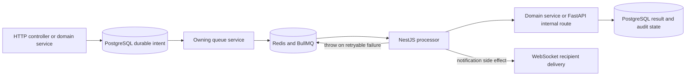
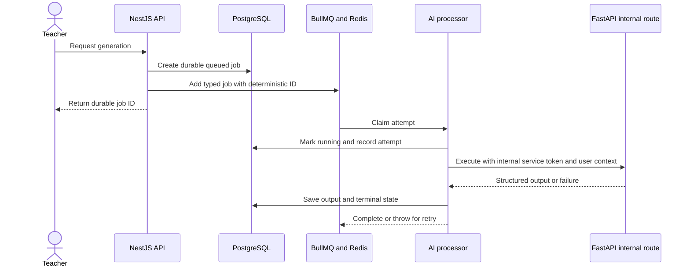

# Chapter 03 — BullMQ Async Queue and Job Orchestration

> **Snapshot authority.** This chapter describes commit `3d0c93e5270d44b9912deeae0218e95c9a311dd5` on branch `developement`. Source paths named below are the authority if the implementation changes after 2026-07-13.

This chapter is the asynchronous service manual for Redis-backed work. It documents every registered queue, producer call, job contract, worker, concurrency value, retry policy, retention rule, cancellation boundary, and recovery procedure.

## Source map

- `backend/src/app.module.ts`
- `backend/src/modules/ai-mentor/`
- `backend/src/modules/announcements/`
- `backend/src/modules/discussion-board/`
- `backend/src/modules/file-upload/`
- `backend/src/modules/notifications/`
- `backend/src/modules/performance/`
- `backend/src/modules/rag/`

## Orchestration authority

- NestJS owns durable job orchestration and Redis queue contracts.
- PostgreSQL owns authoritative academic state, AI job state, extraction state, files, and audit history.
- FastAPI performs AI and indexing execution but does not replace BullMQ retry ownership.
- Redis queue state is operational state. Never treat a completed BullMQ record as the sole proof that a durable business transition occurred.



## Global BullMQ defaults

| Option | Value | Meaning |
| --- | --- | --- |
| Connection | redis.url from ConfigService | All registered queues use the configured Redis connection. |
| Attempts | 3 | Applies when a producer does not override attempts. |
| Backoff | Exponential, initial delay 2,000 ms | Applies when a producer does not override backoff. |
| Completed retention | Age 3,600 seconds and count 100 | The global default bounds completed operational history. |
| Failed retention | Age 86,400 seconds and count 50 | The global default bounds failed operational history. |

> Per-job options override these defaults. The queue-specific tables below are authoritative for each enqueue site.

## Complete queue register

> **Exhaustive inventory rule.** The 7 queue processors below were extracted from `backend/src/modules/**/*.processor.ts` at commit `3d0c93e`. A later source change requires regenerating or manually reconciling this chapter.

| Queue | Concurrency | Processor | Producer class | Registered by |
| --- | --- | --- | --- | --- |
| ai-teacher-generation | 2 | AiGenerationProcessor | AiGenerationQueueService | backend/src/modules/ai-mentor/ai-mentor.module.ts |
| announcements | 3 | AnnouncementFanOutProcessor | AnnouncementsService | backend/src/modules/announcements/announcements.module.ts; backend/src/modules/notifications/notifications.module.ts |
| discussion-board | 3 | DiscussionBoardProcessor | DiscussionBoardService | backend/src/modules/discussion-board/discussion-board.module.ts |
| library-indexing | 2 | LibraryIndexingProcessor | LibraryIndexingService | backend/src/modules/file-upload/file-upload.module.ts |
| notifications | 3 | AssessmentNotificationProcessor | AssessmentNotificationDispatchService | backend/src/modules/notifications/notifications.module.ts |
| performance-recompute | 3 | PerformanceRecomputeProcessor | PerformanceRecomputeQueueService | backend/src/modules/performance/performance.module.ts |
| rag-indexing | 1 | RagIndexingProcessor | RagIndexingService | backend/src/modules/rag/rag.module.ts |

### Queue: ai-teacher-generation

Executes durable teacher lesson-plan, quiz, intervention, and module-extraction work through the FastAPI internal execution boundary.

| Service item | Current value |
| --- | --- |
| Registration | backend/src/modules/ai-mentor/ai-mentor.module.ts |
| Producer boundary | AiGenerationQueueService in backend/src/modules/ai-mentor/ai-generation-queue.service.ts |
| Processor | AiGenerationProcessor in backend/src/modules/ai-mentor/processors/ai-generation.processor.ts |
| Worker concurrency | 2 |
| Job names | lesson-plan-generation, quiz-generation, intervention-recommendation-generation, module-extraction |
| Success effect | The processor updates ai_generation_jobs and ai_generation_outputs, or extracted_modules for extraction work. |
| Failure effect | The processor records the attempt and terminal failure in durable PostgreSQL state, then rethrows so BullMQ owns retry timing. |

**Exact enqueue contracts.**

| Job name | Payload expression | Options expression | Producer source |
| --- | --- | --- | --- |
| lesson-plan-generation | { jobId, requestedByUserId: userId, queuedAt: new Date().toISOString() } | { SHARED_JOB_OPTIONS merged with, jobId: `lesson-plan:${jobId}`, } | backend/src/modules/ai-mentor/ai-generation-queue.service.ts |
| quiz-generation | { jobId, requestedByUserId: userId, queuedAt: new Date().toISOString() } | { SHARED_JOB_OPTIONS merged with, jobId: `quiz:${jobId}`, } | backend/src/modules/ai-mentor/ai-generation-queue.service.ts |
| intervention-recommendation-generation | { jobId, requestedByUserId: userId, queuedAt: new Date().toISOString() } | { SHARED_JOB_OPTIONS merged with, jobId: `intervention:${jobId}`, } | backend/src/modules/ai-mentor/ai-generation-queue.service.ts |
| module-extraction | { extractionId, requestedByUserId: userId, queuedAt: new Date().toISOString(), } | { SHARED_JOB_OPTIONS merged with, jobId: `extraction-${extractionId}`, } | backend/src/modules/ai-mentor/ai-generation-queue.service.ts |

**Maintenance boundary.** A job payload is a versioned internal contract even though it is not an HTTP DTO. Update producer, processor, tests, durable state transition, and this table together.

### Queue: announcements

Fans a published or scheduled class announcement out into per-user notification records and real-time notification events.

| Service item | Current value |
| --- | --- |
| Registration | backend/src/modules/announcements/announcements.module.ts; backend/src/modules/notifications/notifications.module.ts |
| Producer boundary | AnnouncementsService in backend/src/modules/announcements/announcements.service.ts |
| Processor | AnnouncementFanOutProcessor in backend/src/modules/notifications/processors/announcement-fan-out.processor.ts |
| Worker concurrency | 3 |
| Job names | fan-out, fan-out |
| Success effect | Notification rows are deduplicated by the notification service and emitted to connected recipients. |
| Failure effect | Failed jobs remain in Redis because removeOnFail is false; the producer config permits three attempts. |

**Exact enqueue contracts.**

| Job name | Payload expression | Options expression | Producer source |
| --- | --- | --- | --- |
| fan-out | { announcementId: announcement.id, classId, title: announcement.title, content: announcement.content, } | { attempts: 3, backoff: { type: 'exponential', delay: 2000 }, removeOnComplete: true, removeOnFail: false, } | backend/src/modules/announcements/announcements.service.ts |
| fan-out | { announcementId: ann.id, classId: ann.classId, title: ann.title, content: ann.content, } | { attempts: 3, backoff: { type: 'exponential', delay: 2000 }, removeOnComplete: true, removeOnFail: false, } | backend/src/modules/announcements/announcements.service.ts |

**Maintenance boundary.** A job payload is a versioned internal contract even though it is not an HTTP DTO. Update producer, processor, tests, durable state transition, and this table together.

### Queue: discussion-board

Creates notification side effects for newly published threads and newly created comments without holding the HTTP request open.

| Service item | Current value |
| --- | --- |
| Registration | backend/src/modules/discussion-board/discussion-board.module.ts |
| Producer boundary | DiscussionBoardService in backend/src/modules/discussion-board/discussion-board.service.ts |
| Processor | DiscussionBoardProcessor in backend/src/modules/discussion-board/discussion-board.processor.ts |
| Worker concurrency | 3 |
| Job names | thread-published, comment-created |
| Success effect | The worker strips unsafe presentation text, writes deduplicated notifications, and emits recipient updates. |
| Failure effect | Failed jobs remain in Redis because removeOnFail is false; three exponential-backoff attempts are configured. |

**Exact enqueue contracts.**

| Job name | Payload expression | Options expression | Producer source |
| --- | --- | --- | --- |
| thread-published | { classId, threadId: thread.id, title: thread.title, bodyHtml: thread.bodyHtml, } | { attempts: 3, backoff: { type: 'exponential', delay: 2000 }, removeOnComplete: true, removeOnFail: false, } | backend/src/modules/discussion-board/discussion-board.service.ts |
| comment-created | { classId, threadId: thread.id, commentId: comment.id, threadTitle: thread.title, commenterId: actorId, classTeacherId: access.classTeacherId, } | { attempts: 3, backoff: { type: 'exponential', delay: 2000 }, removeOnComplete: true, removeOnFail: false, } | backend/src/modules/discussion-board/discussion-board.service.ts |

**Maintenance boundary.** A job payload is a versioned internal contract even though it is not an HTTP DTO. Update producer, processor, tests, durable state transition, and this table together.

### Queue: library-indexing

Indexes one uploaded library file through the FastAPI internal file-indexing endpoint and reconciles indexing state and audit evidence.

| Service item | Current value |
| --- | --- |
| Registration | backend/src/modules/file-upload/file-upload.module.ts |
| Producer boundary | LibraryIndexingService in backend/src/modules/file-upload/library-indexing.service.ts |
| Processor | LibraryIndexingProcessor in backend/src/modules/file-upload/processors/library-indexing.processor.ts |
| Worker concurrency | 2 |
| Job names | index-library-file |
| Success effect | uploaded_files indexing status and related audit data reflect the FastAPI outcome. |
| Failure effect | The worker records an error state for the file and rethrows; the job is retained within the configured failed-job count. |

**Exact enqueue contracts.**

| Job name | Payload expression | Options expression | Producer source |
| --- | --- | --- | --- |
| index-library-file | { fileId, actorId: options.actorId ?? null, reason: options.reason, queuedAt: new Date().toISOString(), } | { jobId: `library-file:${fileId}:${Date.now()}`, removeOnComplete: 100, removeOnFail: 200, attempts: 3, backoff: { type: 'exponential', delay: 5000, }, } | backend/src/modules/file-upload/library-indexing.service.ts |

**Maintenance boundary.** A job payload is a versioned internal contract even though it is not an HTTP DTO. Update producer, processor, tests, durable state transition, and this table together.

### Queue: notifications

Creates assessment-assigned notifications immediately and assessment-due reminders at a calculated delayed time.

| Service item | Current value |
| --- | --- |
| Registration | backend/src/modules/notifications/notifications.module.ts |
| Producer boundary | AssessmentNotificationDispatchService in backend/src/modules/notifications/assessment-notification-dispatch.service.ts |
| Processor | AssessmentNotificationProcessor in backend/src/modules/notifications/processors/assessment-notification.processor.ts |
| Worker concurrency | 3 |
| Job names | ASSESSMENT_ASSIGNED_JOB, ASSESSMENT_DUE_REMINDER_JOB |
| Success effect | Eligible enrolled students receive durable and socket-delivered notifications; submitted students are excluded from due reminders. |
| Failure effect | Failed jobs remain in Redis because removeOnFail is false and may be inspected or retried operationally. |

**Exact enqueue contracts.**

| Job name | Payload expression | Options expression | Producer source |
| --- | --- | --- | --- |
| ASSESSMENT_ASSIGNED_JOB | this.toJobData(assessment) | { jobId: `${ASSESSMENT_ASSIGNED_JOB}:${assessment.id}`, attempts: 3, backoff: { type: 'exponential', delay: 5_000 }, removeOnComplete: true, removeOnFail: false, } | backend/src/modules/notifications/assessment-notification-dispatch.service.ts |
| ASSESSMENT_DUE_REMINDER_JOB | this.toJobData(assessment) | { jobId: `${ASSESSMENT_DUE_REMINDER_JOB}:${assessment.id}`, delay, attempts: 3, backoff: { type: 'exponential', delay: 5_000 }, removeOnComplete: true, removeOnFail: false, } | backend/src/modules/notifications/assessment-notification-dispatch.service.ts |

**Maintenance boundary.** A job payload is a versioned internal contract even though it is not an HTTP DTO. Update producer, processor, tests, durable state transition, and this table together.

### Queue: performance-recompute

Recomputes derived assessment performance or class-record score snapshots after authoritative academic mutations.

| Service item | Current value |
| --- | --- |
| Registration | backend/src/modules/performance/performance.module.ts |
| Producer boundary | PerformanceRecomputeQueueService in backend/src/modules/performance/performance-recompute-queue.service.ts |
| Processor | PerformanceRecomputeProcessor in backend/src/modules/performance/performance-recompute.processor.ts |
| Worker concurrency | 3 |
| Job names | recompute-assessment, recompute-class-scores |
| Success effect | PerformanceService refreshes derived state; the queue is not an authority for official scores. |
| Failure effect | The producer catches enqueue failures and logs them. Runtime jobs inherit the application default attempts and backoff. |

**Exact enqueue contracts.**

| Job name | Payload expression | Options expression | Producer source |
| --- | --- | --- | --- |
| recompute-assessment | { assessmentId, studentId } | { jobId: `assess-${assessmentId}-${studentId}-${Math.floor(Date.now() / 15000)}`, removeOnComplete: true, removeOnFail: { age: 86400, count: 50 }, } | backend/src/modules/performance/performance-recompute-queue.service.ts |
| recompute-class-scores | { classId, studentIds, triggerSource } | { jobId: `class-${classId}-${Math.floor(Date.now() / 15000)}`, removeOnComplete: true, removeOnFail: { age: 86400, count: 50 }, } | backend/src/modules/performance/performance-recompute-queue.service.ts |

**Maintenance boundary.** A job payload is a versioned internal contract even though it is not an HTTP DTO. Update producer, processor, tests, durable state transition, and this table together.

### Queue: rag-indexing

Serializes class-wide retrieval reindexing through the FastAPI internal class-index endpoint.

| Service item | Current value |
| --- | --- |
| Registration | backend/src/modules/rag/rag.module.ts |
| Producer boundary | RagIndexingService in backend/src/modules/rag/rag-indexing.service.ts |
| Processor | RagIndexingProcessor in backend/src/modules/rag/processors/rag-indexing.processor.ts |
| Worker concurrency | 1 |
| Job names | reindex-class |
| Success effect | The AI service rebuilds retrieval chunks and embeddings for the requested class scope. |
| Failure effect | The worker rethrows indexing failures; up to three attempts use five-second exponential backoff and retained failure history. |

**Exact enqueue contracts.**

| Job name | Payload expression | Options expression | Producer source |
| --- | --- | --- | --- |
| reindex-class | { classId, reason: options.reason, actorId: options.actorId ?? null, source: options.source ?? null, queuedAt: new Date().toISOString(), } | { jobId, removeOnComplete: 100, removeOnFail: 200, attempts: 3, backoff: { type: 'exponential', delay: 5000, }, } | backend/src/modules/rag/rag-indexing.service.ts |

**Maintenance boundary.** A job payload is a versioned internal contract even though it is not an HTTP DTO. Update producer, processor, tests, durable state transition, and this table together.

## Canonical job data contracts

```typescript
type TeacherAiJobData = {
  jobId?: string;
  extractionId?: string;
  requestedByUserId: string;
  queuedAt?: string;
};

type AnnouncementFanOutData = {
  announcementId: string;
  classId: string;
  title: string;
  content: string;
};

type DiscussionThreadPublishedData = {
  classId: string;
  threadId: string;
  title: string;
  bodyHtml: string;
};

type DiscussionCommentCreatedData = {
  classId: string;
  threadId: string;
  commentId: string;
  threadTitle: string;
  commenterId: string;
  classTeacherId: string;
};

type LibraryIndexingData = {
  fileId: string;
  actorId: string | null;
  reason: 'upload' | 'retry' | 'backfill' | 'metadata_update';
  queuedAt: string;
};

type AssessmentNotificationJobData = {
  assessmentId: string;
  classId: string;
  title: string;
  dueDate: string | null;
};

type AssessmentPerformanceData = { assessmentId: string; studentId: string };
type ClassPerformanceData = { classId: string; studentIds?: string[]; triggerSource?: string };

type RagIndexingData = {
  classId: string;
  reason: string;
  actorId: string | null;
  source: string | null;
  queuedAt: string;
};
```

## Job identity, deduplication, and scheduling

| Queue | Job identity rule | Operational effect |
| --- | --- | --- |
| ai-teacher-generation | lesson-plan:<jobId>, quiz:<jobId>, intervention:<jobId>, or extraction-<extractionId> | A second enqueue with the same durable work identifier cannot silently create another active identity. |
| announcements | No explicit jobId | Each publish or scheduled-publish call creates a new fan-out job; downstream notification deduplication is required. |
| discussion-board | No explicit jobId | Each thread or comment event is queued independently; durable notification uniqueness prevents duplicate inbox rows. |
| library-indexing | library-file:<fileId>:<current milliseconds> | Manual retries and metadata-triggered reindex operations are distinct executions. |
| notifications | assessment-assigned:<assessmentId> and assessment-due-reminder:<assessmentId> | One queued identity exists for each assessment event kind. |
| performance-recompute | Entity identifier plus a 15-second time bucket | Rapid duplicate mutations coalesce while later mutations can schedule another recomputation. |
| rag-indexing | reindex:<classId> | Only one active class reindex identity is intended at a time. |

- Assessment due reminders use BullMQ delay calculated from the due date, targeting one day before the deadline.
- Cancellation is explicitly implemented only for queued teacher AI work. It removes jobs in waiting, delayed, or prioritized state and refuses active or completed work.
- A cancellation request must also reconcile the related PostgreSQL job or extraction state. Removing Redis work alone is not a durable business cancellation.

## Teacher AI execution sequence



## Failure handling and dead-letter truth

- No dedicated dead-letter queue, QueueEvents failure bridge, or application-wide failed-job event handler was found in the active source.
- Failed work is retained according to per-job removeOnFail or the global age-and-count policy. That retained failed set is the operational inspection surface, not a separate DLQ.
- Announcement, discussion, and assessment-notification jobs set removeOnFail to false. Operators must bound Redis growth and explicitly decide whether a failure is safe to retry.
- The performance producer logs and absorbs enqueue failures. Therefore a missing performance job can require a manual recomputation even when the originating HTTP mutation succeeded.
- Chapter 09 documents the BullMQ backlog alert and the current metric-export caveat.

## Recovery runbook

1. Identify the queue, BullMQ job ID, job name, attempts made, failure reason, timestamp, and durable entity ID.
2. Verify PostgreSQL state before retrying. A timed-out processor may have completed the durable write even if Redis recorded a failure.
3. Verify Redis and the worker process are healthy, then verify the downstream database, FastAPI route, storage path, or socket dependency named by the worker.
4. For teacher AI and extraction jobs, compare ai_generation_jobs or extracted_modules state with the BullMQ state and inspect the associated output or error fields.
5. Retry through the owning application service or an approved BullMQ administrative tool. Do not edit raw Redis keys.
6. For RAG or library work, use the supported retry or reindex endpoint so file and audit state are updated with the new execution.
7. For performance work, call the owning recompute workflow after confirming the official assessment or class-record write is committed.
8. Record the operator, reason, affected entity, previous state, new job ID, and result in the maintenance log.

## Safe change checklist

- Add or change a payload type at both the producer and processor boundary.
- Make processor side effects idempotent before increasing attempts or concurrency.
- Keep official academic mutations transactional and separate from derived recomputation.
- Use a deterministic job ID only when duplicate executions represent the same durable intent.
- Test success, retryable failure, terminal failure, duplicate enqueue, cancellation, Redis outage, and downstream timeout.
- Verify retained-job behavior and Redis memory impact before changing removal rules.
- Update Chapter 09 alerts if a new queue requires distinct backlog or failure monitoring.
