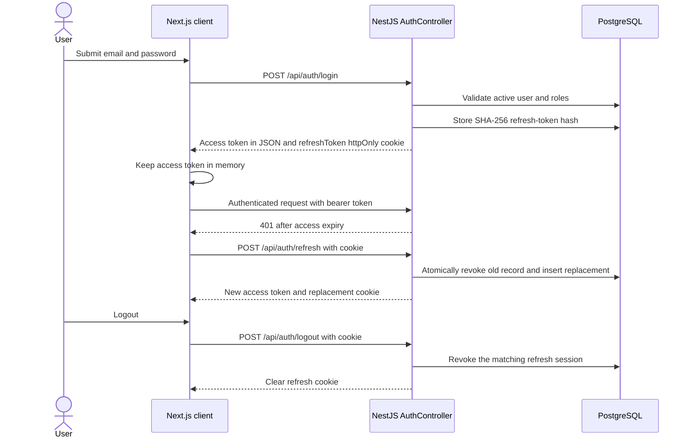
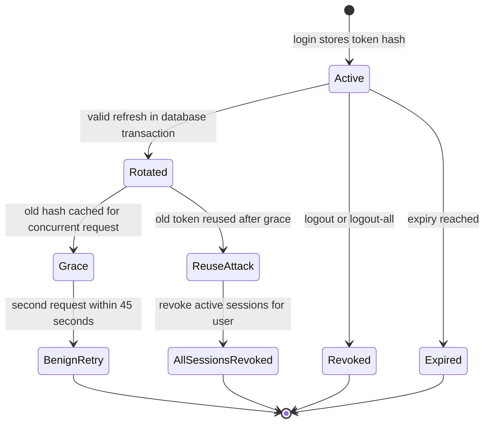
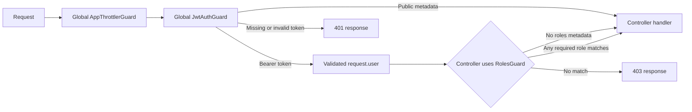
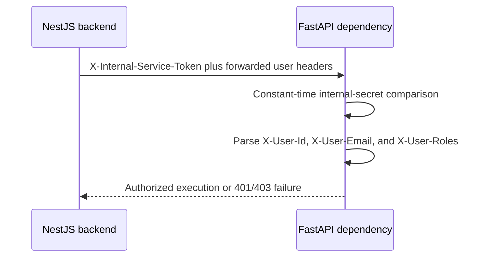

# Chapter 04 — Authentication, RBAC, Security, and Session Lifecycle

> **Snapshot authority.** This chapter describes commit `3d0c93e5270d44b9912deeae0218e95c9a311dd5` on branch `developement`. Source paths named below are the authority if the implementation changes after 2026-07-13.

This chapter documents Nexora identity and trust boundaries: credential login, web cookies, mobile bearer tokens, access-token validation, refresh rotation, session revocation, role guards, throttling, inter-service authentication, and operator-safe failure handling.

## Source map

- `backend/src/modules/auth/`
- `backend/src/common/guards/`
- `backend/src/common/decorators/`
- `backend/src/config/jwt.config.ts`
- `backend/src/app.module.ts`
- `backend/src/main.ts`
- `next-frontend/src/lib/api-client.ts`
- `next-frontend/src/providers/AuthProvider.tsx`
- `next-frontend/proxy.ts`
- `mobile/src/services/api.ts`
- `ai-service/app/dependencies/auth.py`

## Trust model

- The backend is the public authentication and RBAC authority.
- Web and mobile clients call backend routes under `/api`; neither client calls FastAPI directly.
- FastAPI receives an internal service secret plus forwarded user identity only from the backend boundary.
- AI output is assistive and does not become an official record without the backend-owned approval or mutation workflow.
- Access control is enforced server-side. Client route gating improves navigation but is not an authorization boundary.

## Token and session inventory

| Artifact | Transport and storage | Default lifetime | Authority and behavior |
| --- | --- | --- | --- |
| Access JWT | Returned in JSON; web keeps it in memory, mobile uses bearer auth | 15 minutes | Signed by the backend access secret and validated by the global JWT guard. |
| Web refresh token | Opaque value in an httpOnly cookie | 7 days | Hashed with SHA-256 before PostgreSQL storage; rotated on every accepted refresh. |
| Mobile refresh token | Opaque value returned in JSON and held through the mobile secure-storage layer | 7 days | Sent in the mobile refresh and logout request body; stored server-side only as a hash. |
| Refresh record | refresh_tokens table | Until expiry or revocation | Tracks user, hash, expiry, revocation, replacement, device context, and rotation grace. |
| Rotation grace | Redis auth:grace key with database fallback | 45 seconds | Allows a benign concurrent refresh race without treating it as theft. |

## Web login, refresh, and logout

### Cookie controls

| Attribute | Current rule | Reason |
| --- | --- | --- |
| httpOnly | Always true | Client JavaScript cannot read the refresh token. |
| secure | True in production | Production browsers send the cookie only over HTTPS. |
| sameSite | lax by default; none when cross-site configuration requires it | Balances CSRF resistance with an explicitly cross-site deployment. |
| domain | Optional environment-controlled value | Supports an intentional shared parent domain only. |
| path | / | Makes refresh and logout routes receive the cookie. |
| maxAge | Derived from configured refresh-token expiry | Browser retention follows the server token lifetime. |

## Mobile login, refresh, and logout

- `POST /api/auth/mobile/login` returns access and refresh tokens in JSON; no browser cookie is required.
- The mobile API layer attaches the access token as a bearer credential and serializes refresh so concurrent 401 responses do not rotate the same token independently.
- The mobile refresh token is sent to `POST /api/auth/mobile/refresh`. Logout sends it to `POST /api/auth/mobile/logout` for server-side revocation.
- Expo SecureStore is the primary credential store. AsyncStorage is a compatibility fallback and has weaker at-rest protection, so production devices should keep SecureStore available.
- Logout-all is authenticated and revokes all active refresh sessions for the current user.

## Refresh rotation and reuse detection

1. The raw opaque token is SHA-256 hashed; only the hash is queried and stored.
2. Rotation runs in one database transaction: the old record is revoked and linked to a newly inserted record.
3. The old hash receives a 45-second grace marker in Redis. The database graceExpiresAt field is a fallback if Redis is unavailable.
4. Reuse within grace is treated as a benign concurrent client race and returns a retry-oriented failure.
5. Reuse outside grace is treated as possible theft and revokes all active sessions for that user.

## Backend guard pipeline

| Control | Scope | Current behavior |
| --- | --- | --- |
| AppThrottlerGuard | Global APP_GUARD | Tracks by authenticated user, normalized login email, then forwarded or socket IP. |
| JwtAuthGuard | Global APP_GUARD | Allows Public metadata; otherwise requires a valid access JWT and populates request.user. |
| RolesGuard | Controller or handler opt-in | Allows a route with no role metadata; otherwise accepts any one required role present on the principal. |
| CurrentUser decorator | Handler parameter | Reads the validated principal from the request. |
| Public decorator | Controller or handler metadata | Bypasses access-token authentication only; throttling and handler validation still apply. |
| Global ValidationPipe | All controller inputs | Whitelists declared properties, forbids unknown properties, and transforms typed input. |
| Helmet and CORS | Application bootstrap | Sets security headers and constrains credentialed browser origins. |
| Global exception filter | Unhandled and HTTP failures | Formats sanitized API failures and prevents raw internal errors from becoming the public contract. |

## Controller access inventory

> **Exhaustive inventory rule.** The 385 controller routes below were extracted from every `backend/src/**/*.controller.ts` source at commit `3d0c93e`. A later source change requires regenerating or manually reconciling this chapter.

| Controller | Routes | Public routes | Effective access forms | Source |
| --- | --- | --- | --- | --- |
| AcademicStateController | 3 | 0 | JWT plus ADMIN | backend/src/modules/academic-state/academic-state.controller.ts |
| AdminController | 5 | 0 | JWT plus ADMIN | backend/src/modules/admin/admin.controller.ts |
| AiMentorController | 41 | 2 | JWT plus STUDENT; JWT plus STUDENT or ADMIN; JWT plus STUDENT or TEACHER or ADMIN; JWT plus TEACHER or ADMIN; Public through @Public | backend/src/modules/ai-mentor/ai-mentor.controller.ts |
| JaHubController | 11 | 0 | JWT plus STUDENT | backend/src/modules/ja/ja-hub.controller.ts |
| JaController | 7 | 0 | JWT plus STUDENT | backend/src/modules/ja/ja.controller.ts |
| AnalyticsController | 4 | 0 | JWT plus ADMIN; JWT plus TEACHER or ADMIN | backend/src/modules/analytics/analytics.controller.ts |
| AppVersionController | 1 | 1 | Public through @Public | backend/src/modules/app-version/app-version.controller.ts |
| AssessmentsController | 36 | 1 | JWT plus ADMIN or STUDENT; JWT plus ADMIN or TEACHER; JWT plus ADMIN or TEACHER or STUDENT; JWT plus STUDENT; Public through @Public | backend/src/modules/assessments/assessments.controller.ts |
| AssessmentsPublicController | 1 | 1 | Public through @Public | backend/src/modules/assessments/assessments-public.controller.ts |
| AuthController | 15 | 11 | JWT authenticated; Public through @Public | backend/src/modules/auth/auth.controller.ts |
| ClassRecordController | 18 | 0 | JWT plus ADMIN or TEACHER; JWT plus TEACHER or ADMIN; JWT plus TEACHER or ADMIN or STUDENT | backend/src/modules/class-record/class-record.controller.ts |
| ClassTemplatesController | 14 | 1 | JWT plus ADMIN; Public through @Public | backend/src/modules/class-templates/class-templates.controller.ts |
| ClassesController | 28 | 0 | JWT plus ADMIN; JWT plus ADMIN or STUDENT; JWT plus ADMIN or TEACHER; JWT plus ADMIN or TEACHER or STUDENT; JWT plus STUDENT | backend/src/modules/classes/classes.controller.ts |
| AnnouncementsController | 6 | 0 | JWT plus TEACHER or ADMIN; JWT plus TEACHER or STUDENT or ADMIN | backend/src/modules/announcements/announcements.controller.ts |
| DiscussionBoardController | 19 | 0 | JWT plus ADMIN or STUDENT; JWT plus ADMIN or TEACHER; JWT plus ADMIN or TEACHER or STUDENT | backend/src/modules/discussion-board/discussion-board.controller.ts |
| ClassesPublicController | 1 | 1 | Public through @Public | backend/src/modules/classes/classes.controller.ts |
| FileUploadController | 13 | 0 | JWT plus ADMIN; JWT plus ADMIN or TEACHER; JWT plus ADMIN or TEACHER or STUDENT; JWT plus TEACHER or ADMIN | backend/src/modules/file-upload/file-upload.controller.ts |
| HealthController | 3 | 3 | Public through @Public | backend/src/modules/health/health.controller.ts |
| MetricsController | 1 | 1 | Public through class-level @Public | backend/src/monitoring/metrics.controller.ts |
| InternalUploadsController | 1 | 1 | Public through @Public | backend/src/modules/file-upload/internal-uploads.controller.ts |
| LessonsController | 20 | 0 | JWT plus ADMIN or TEACHER; JWT plus ADMIN or TEACHER or STUDENT; JWT plus STUDENT | backend/src/modules/lessons/lessons.controller.ts |
| LxpController | 32 | 0 | JWT plus ADMIN; JWT plus STUDENT; JWT plus STUDENT or TEACHER; JWT plus STUDENT or TEACHER or ADMIN; JWT plus TEACHER or ADMIN | backend/src/modules/lxp/lxp.controller.ts |
| ContentModulesController | 20 | 1 | JWT plus ADMIN or TEACHER; JWT plus ADMIN or TEACHER or STUDENT; Public through @Public | backend/src/modules/content-modules/content-modules.controller.ts |
| NotificationsController | 4 | 0 | JWT plus TEACHER or STUDENT or ADMIN | backend/src/modules/notifications/notifications.controller.ts |
| OtpController | 2 | 2 | Public through @Public | backend/src/modules/otp/otp.controller.ts |
| PerformanceController | 11 | 0 | JWT plus ADMIN; JWT plus STUDENT; JWT plus TEACHER or ADMIN | backend/src/modules/performance/performance.controller.ts |
| ProfilesController | 9 | 1 | JWT plus ADMIN; JWT plus ADMIN or STUDENT or TEACHER; JWT plus STUDENT; JWT plus STUDENT or TEACHER or ADMIN; Public through @Public | backend/src/modules/profiles/profiles.controller.ts |
| ReportsController | 6 | 0 | JWT plus ADMIN or TEACHER | backend/src/modules/reports/reports.controller.ts |
| RosterImportController | 4 | 0 | JWT plus ADMIN or TEACHER | backend/src/modules/roster-import/roster-import.controller.ts |
| SchoolEventsController | 4 | 0 | JWT plus ADMIN; JWT plus ADMIN or TEACHER or STUDENT | backend/src/modules/school-events/school-events.controller.ts |
| SectionsController | 24 | 0 | JWT plus ADMIN; JWT plus ADMIN or TEACHER; JWT plus ADMIN or TEACHER or STUDENT | backend/src/modules/sections/sections.controller.ts |
| SectionsPublicController | 1 | 1 | Public through @Public | backend/src/modules/sections/sections.controller.ts |
| TeacherProfilesController | 4 | 0 | JWT plus TEACHER; JWT plus TEACHER or ADMIN | backend/src/modules/teacher-profiles/teacher-profiles.controller.ts |
| TeacherController | 3 | 0 | JWT plus TEACHER or ADMIN | backend/src/modules/teacher/teacher.controller.ts |
| UsersController | 13 | 0 | JWT plus ADMIN | backend/src/modules/users/users.controller.ts |

## Public route register

These are the routes explicitly marked public at this snapshot. Public means no access JWT is required; validation, throttling, secrets on internal FastAPI routes, and business checks still apply.

| Method | Path | Handler | Input | Source |
| --- | --- | --- | --- | --- |
| POST | /api/ai/demo/intervention-plan | AiMentorController.generateDemoInterventionPlan | Body() dto: DemoInterventionPlanDto | backend/src/modules/ai-mentor/ai-mentor.controller.ts |
| GET | /api/ai/health | AiMentorController.health | No handler parameters | backend/src/modules/ai-mentor/ai-mentor.controller.ts |
| GET | /api/app-version/check | AppVersionController.check | Query() query: CheckAppVersionDto | backend/src/modules/app-version/app-version.controller.ts |
| GET | /api/assessments/questions/images-private/:filename | AssessmentsController.serveQuestionImage | Param('filename') filename: string; Res() res: Response | backend/src/modules/assessments/assessments.controller.ts |
| GET | /api/assessments/questions/images/:filename | AssessmentsPublicController.serveQuestionImage | Param('filename') filename: string; Res() res: Response | backend/src/modules/assessments/assessments-public.controller.ts |
| POST | /api/auth/forgot-password | AuthController.forgotPassword | Body() dto: ForgotPasswordDto | backend/src/modules/auth/auth.controller.ts |
| POST | /api/auth/login | AuthController.login | Body() loginDto: LoginDto; Req() request: express.Request; Res({ passthrough: true }) response: express.Response | backend/src/modules/auth/auth.controller.ts |
| POST | /api/auth/logout | AuthController.logout | Req() request: express.Request; Res({ passthrough: true }) response: express.Response | backend/src/modules/auth/auth.controller.ts |
| POST | /api/auth/mobile/login | AuthController.mobileLogin | Body() loginDto: LoginDto; Req() request: express.Request | backend/src/modules/auth/auth.controller.ts |
| POST | /api/auth/mobile/logout | AuthController.mobileLogout | Body() dto: MobileLogoutDto | backend/src/modules/auth/auth.controller.ts |
| POST | /api/auth/mobile/refresh | AuthController.mobileRefresh | Body() dto: MobileRefreshDto; Req() request: express.Request | backend/src/modules/auth/auth.controller.ts |
| POST | /api/auth/refresh | AuthController.refresh | Req() request: express.Request; Res({ passthrough: true }) response: express.Response | backend/src/modules/auth/auth.controller.ts |
| POST | /api/auth/reset-password | AuthController.resetPassword | Body() dto: ResetPasswordDto | backend/src/modules/auth/auth.controller.ts |
| POST | /api/auth/set-activation-password | AuthController.setActivationPassword | Body() dto: SetActivationPasswordDto | backend/src/modules/auth/auth.controller.ts |
| POST | /api/auth/set-initial-password | AuthController.setInitialPassword | Body() dto: SetInitialPasswordDto | backend/src/modules/auth/auth.controller.ts |
| POST | /api/auth/validate-credentials | AuthController.validateCredentials | Body() dto: ValidateCredentialsDto | backend/src/modules/auth/auth.controller.ts |
| GET | /api/class-templates/images/:filename | ClassTemplatesController.serveAssessmentImage | Param('filename') filename: string; Res() res: Response | backend/src/modules/class-templates/class-templates.controller.ts |
| GET | /api/classes/banners/:filename | ClassesPublicController.serveClassBanner | Param('filename') filename: string; Res() res: any | backend/src/modules/classes/classes.controller.ts |
| GET | /api/health | HealthController.aliasCheck | No handler parameters | backend/src/modules/health/health.controller.ts |
| GET | /api/health/live | HealthController.check | No handler parameters | backend/src/modules/health/health.controller.ts |
| GET | /api/health/ready | HealthController.readiness | No handler parameters | backend/src/modules/health/health.controller.ts |
| GET | /api/internal/uploads/raw | InternalUploadsController.readUpload | Query('path') requestedPath: string; Headers('x-internal-service-token') token: string \| undefined; Res() res: Response | backend/src/modules/file-upload/internal-uploads.controller.ts |
| GET | /api/modules/covers/:filename | ContentModulesController.serveModuleCover | Param('filename') filename: string; Res() res: Response | backend/src/modules/content-modules/content-modules.controller.ts |
| POST | /api/otp/resend | OtpController.resendOtp | Body() resendOtpDto: ResendOtpDto | backend/src/modules/otp/otp.controller.ts |
| POST | /api/otp/verify | OtpController.verifyOtp | Body() verifyOtpDto: VerifyOtpDto | backend/src/modules/otp/otp.controller.ts |
| GET | /api/profiles/images/:filename | ProfilesController.serveProfileImage | Param('filename') filename: string; Res() res: Response | backend/src/modules/profiles/profiles.controller.ts |
| GET | /api/sections/banners/:filename | SectionsPublicController.serveSectionBanner | Param('filename') filename: string; Res() res: any | backend/src/modules/sections/sections.controller.ts |

## Role capability matrix

| Capability | Admin | Teacher | Student | Enforcement notes |
| --- | --- | --- | --- | --- |
| Identity, own profile, own sessions | Yes | Yes | Yes | JWT plus ownership checks in auth and profile services. |
| User, role, roster, and account administration | Yes | No | No | Admin controller role metadata and service checks. |
| Sections and academic system state administration | Yes | Limited viewing where exposed | Limited viewing where exposed | Route-specific roles and class membership rules apply. |
| Create and manage assigned classes | Administrative scope | Yes for owned classes | No | Role checks are supplemented by teacher ownership in services. |
| Author lessons, assessments, announcements, and class records | Administrative scope where exposed | Yes for owned classes | No | Ownership and class access are not replaced by role membership. |
| Submit assessments and consume published learning content | No normal learner flow | Preview or governance paths | Yes for enrolled classes | Enrollment, publication, schedule, and attempt rules are enforced in services. |
| Teacher AI generation and approval | Administrative visibility where exposed | Yes | No | Teacher role, class ownership, quotas, and approval state govern durable use. |
| Student Ja tutor and remedial experiences | Oversight paths | Oversight paths | Yes | Class AI policy, enrollment, rate limits, and guardrails apply. |
| Official grade finalization | Administrative governance | Yes for owned class records | No | AI has no direct authority to finalize official academic records. |
| Observability endpoints | Deployment controlled | Deployment controlled | Deployment controlled | Metrics and health exposure is a network/deployment concern, not a school role capability. |

## Rate limiting

| Surface | Limit | Tracker |
| --- | --- | --- |
| Global fallback | 300 requests per 60 seconds | Authenticated user ID, then login email, then client IP. |
| Web and mobile login | 15 attempts per 60 seconds | Normalized account email when present. |
| Web and mobile refresh | 60 attempts per 60 seconds | Request tracker selected by the global guard. |
| Forgot password | 3 attempts per 5 minutes | Email or IP fallback. |
| Reset, initial password, and activation password | 5 attempts per 5 minutes | Email or IP fallback. |
| Credential validation and change password | 5 attempts per 60 seconds | Email or authenticated user. |
| Logout and current-user reads | Explicitly skip throttling | Authentication and revocation rules still apply. |

## Backend-to-FastAPI authentication

| Header | Owner | Use |
| --- | --- | --- |
| X-Internal-Service-Token | Backend service client | Authenticates privileged internal execution routes; a nonempty matching configured secret is required. |
| X-User-Id | Backend from validated principal | Scopes ownership, auditing, and teacher or student work. |
| X-User-Email | Backend from validated principal | Carries human-readable identity context where required. |
| X-User-Roles | Backend from validated principal | Carries role context; FastAPI does not become the public RBAC authority. |

- FastAPI current-user dependency enforces the internal secret when one is configured. Privileged require-internal-service routes always require a nonempty matching secret.
- Do not expose FastAPI directly to browsers or mobile devices. Network isolation and the secret are both required controls.
- Rotate the internal secret through coordinated backend and AI-service deployment. Never log the secret or the Authorization header.

## Password, OTP, and account lifecycle

- Login accepts only a valid active account with a verified password flow and resolves current roles from backend-owned data.
- Forgot-password and reset-password routes are public but tightly throttled and use one-time verification state.
- Initial-password and activation-password routes support provisioned accounts without weakening normal login requirements.
- Password change is authenticated; session revocation behavior must be verified whenever password policy changes.
- OTP records track purpose, attempts, expiry, and consumption. An OTP is not reusable after successful consumption.
- Account status, role assignment, archived identity, and audit logs must be considered together during disablement or removal.

## Client route gating

- Next.js proxy checks for the refresh cookie before allowing dashboard navigation. It does not decode or authorize roles.
- AuthProvider bootstraps the session through the refresh endpoint, stores the access token in memory, and uses the dashboard route-access map for user experience gating.
- The API client permits credentials, uses a 30-second request timeout, serializes refresh with one shared promise, and retries a failed request once after successful rotation.
- Mobile chooses role-specific navigation after resolving the authenticated user. Screen visibility remains subordinate to backend authorization.

## Security failure matrix

| Failure or threat | Expected behavior | Operator evidence |
| --- | --- | --- |
| Invalid credentials | Generic authentication failure; no password detail or account enumeration signal. | Throttled request metadata and sanitized application log. |
| Expired access token | 401; client may perform one serialized refresh. | Request status and refresh result. |
| Revoked or expired refresh token | Refresh rejected and local session cleared. | refresh_tokens state and auth log. |
| Refresh-token reuse after grace | All active sessions for the user are revoked. | Security log and revoked refresh records. |
| Role mismatch | 403 from RolesGuard or a domain access check. | Controller route, principal roles, and ownership data. |
| Cross-class object access | Service rejects even if the role itself is allowed. | Class ownership or enrollment query and audit trail. |
| Missing internal service secret | FastAPI privileged internal route rejects. | Backend downstream error and FastAPI authentication log without secret material. |
| Redis unavailable during refresh grace | Database grace field provides the race-detection fallback. | Redis health plus refresh record timestamps. |
| Client-side route bypass | Backend still rejects unauthorized API calls. | 401 or 403 response from NestJS. |

## Security maintenance checklist

1. Trace every new route through Public metadata, JWT behavior, role metadata, ownership checks, validation, throttling, and audit requirements.
2. Never return or log password hashes, refresh tokens, OTP values, internal service secrets, cookies, or full Authorization headers.
3. Preserve atomic refresh rotation and the reuse-detection tests when changing sessions.
4. Test web cookie mode and mobile body-token mode independently.
5. Test role alone, ownership, enrollment, publication state, and lifecycle state; role membership is not sufficient for object access.
6. Confirm CORS origins and cookie SameSite mode together before any cross-site deployment.
7. Keep FastAPI on a private network path and reject direct client access.
8. Run targeted auth, guard, controller, frontend auth-provider, API-client, and mobile session tests before release.
