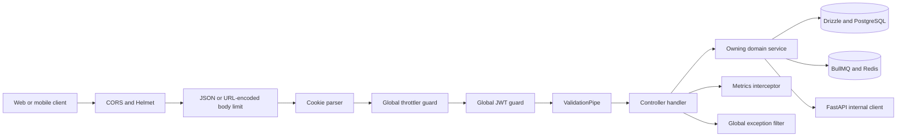
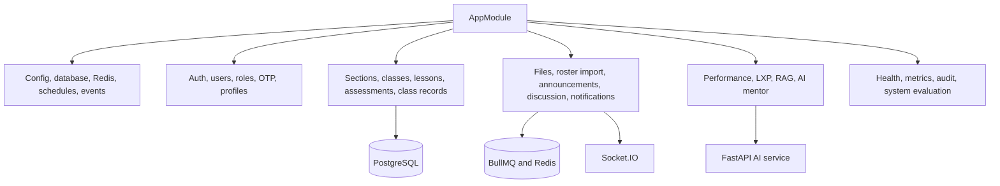

# Chapter 05 — NestJS Backend Module and API Catalog

> **Snapshot authority.** This chapter describes commit `3d0c93e5270d44b9912deeae0218e95c9a311dd5` on branch `developement`. Source paths named below are the authority if the implementation changes after 2026-07-13.

This chapter is the backend service catalog. It records the application pipeline, all active Nest modules, every controller route, effective access, handler inputs, declared outcomes, primary delegates, every DTO class, and the non-class contract declarations used at the API boundary.

## Source map

- `backend/src/app.module.ts`
- `backend/src/main.ts`
- `backend/src/database/`
- `backend/src/monitoring/`
- `backend/src/modules/`
- `backend/src/common/`
- `backend/src/config/`
- `backend/test/`

## Application service pipeline



| Bootstrap item | Current contract |
| --- | --- |
| Bind address | 0.0.0.0:3000 |
| Global API prefix | /api |
| Request body limit | REQUEST_BODY_LIMIT, default 1mb; file upload limits are handled separately by Multer. |
| Validation | whitelist true, forbidNonWhitelisted true, transform true |
| Security headers | Helmet; content-security-policy disabled only in development for Swagger compatibility. |
| CORS | Credentialed allowlist from frontend, Next frontend, mobile, and explicit origin environment values; localhost additions only outside production. |
| Proxy trust | TRUST_PROXY_HOPS; production default one hop, development default zero. |
| Swagger | Generated at /api only outside production. |
| Sockets | Socket.IO adapter supports backend-owned real-time notifications. |
| Shutdown | Nest shutdown hooks enabled so in-flight work can drain during controlled termination. |

## Module graph



## Complete module register

> **Exhaustive inventory rule.** The 37 Nest module declarations below were extracted from `backend/src/**/*.module.ts` at commit `3d0c93e`. A later source change requires regenerating or manually reconciling this chapter.

| Module class | Primary slice | Route count in slice | Extracted imports | Extracted controllers | Extracted providers | Extracted exports | Source |
| --- | --- | --- | --- | --- | --- | --- | --- |
| AppModule | application-root | 385 | ConfigModule.forRoot({ isGlobal: true, load: [databaseConfig, jwtConfig, redisConfig, ollamaConfig | No direct controller array extracted | { provide: APP_FILTER, useClass: GlobalExceptionFilter, // Sanitise all unhandled errors }, { provide: APP_GUARD, useClass: JwtAuthGuard, // Global auth guard }, { provide: APP_GUARD, useClass: AppThrottlerGuard, // Global rate-limit guard }, | No direct export array extracted | backend/src/app.module.ts |
| DatabaseModule | database | 0 | No explicit imports extracted | No direct controller array extracted | DatabaseService | DatabaseService | backend/src/database/database.module.ts |
| MetricsModule | monitoring | 1 | No explicit imports extracted | MetricsController | { provide: PROM_CLIENT_REGISTRY, useValue: register } | PROM_CLIENT_REGISTRY | backend/src/monitoring/metrics.module.ts |
| AcademicStateModule | academic-state | 3 | DatabaseModule, AuditModule | AcademicStateController | AcademicStateService | AcademicStateService | backend/src/modules/academic-state/academic-state.module.ts |
| AdminModule | admin | 5 | AuditModule, ReportsModule, AnalyticsModule, HealthModule | AdminController | AdminService | AdminService | backend/src/modules/admin/admin.module.ts |
| AiMentorModule | ai-mentor | 41 | DatabaseModule, AuditModule, AdminModule, ReportsModule, AnalyticsModule, PerformanceModule, LxpModule, BullModule.registerQueue({ name: 'ai-teacher-generation' }), | AiMentorController | AiProxyService, AdminAnalyticsChatService, AiGenerationQueueService, AiGenerationProcessor, | AiProxyService, AdminAnalyticsChatService | backend/src/modules/ai-mentor/ai-mentor.module.ts |
| AnalyticsModule | analytics | 4 | DatabaseModule | AnalyticsController | AnalyticsService | AnalyticsService | backend/src/modules/analytics/analytics.module.ts |
| AnnouncementsModule | announcements | 6 | AuditModule, BullModule.registerQueue({ name: 'announcements', }), | AnnouncementsController | AnnouncementsService, AnnouncementsScheduler | AnnouncementsService | backend/src/modules/announcements/announcements.module.ts |
| AppVersionModule | app-version | 1 | DatabaseModule | AppVersionController | AppVersionService | AppVersionService | backend/src/modules/app-version/app-version.module.ts |
| AssessmentsModule | assessments | 37 | DatabaseModule, EventEmitterModule, AuditModule, NotificationsModule, | AssessmentsController, AssessmentsPublicController | AssessmentsService, AssessmentAccessService, FeedbackService | AssessmentsService, AssessmentAccessService | backend/src/modules/assessments/assessments.module.ts |
| AuditModule | audit | 0 | DatabaseModule | No direct controller array extracted | AuditService | AuditService | backend/src/modules/audit/audit.module.ts |
| AuthModule | auth | 15 | UsersModule, OtpModule, DatabaseModule, AuditModule, PassportModule.register({ defaultStrategy: 'jwt' }), JwtModule.registerAsync({ imports: [ConfigModule | AuthController | AuthService, TokenService, TokenCleanupService, JwtStrategy | AuthService, TokenService, JwtModule | backend/src/modules/auth/auth.module.ts |
| ClassRecordModule | class-record | 18 | DatabaseModule, EventEmitterModule, AuditModule | ClassRecordController | ClassRecordService, ClassRecordComputationService, ClassRecordSyncService, AdviserSectionGuard, | ClassRecordService | backend/src/modules/class-record/class-record.module.ts |
| ClassTemplatesModule | class-templates | 14 | DatabaseModule, AuditModule | ClassTemplatesController | ClassTemplatesService | ClassTemplatesService | backend/src/modules/class-templates/class-templates.module.ts |
| ClassesModule | classes | 29 | DatabaseModule, AuditModule, ClassRecordModule, AcademicStateModule, AiMentorModule, | ClassesController, ClassesPublicController | ClassesService | ClassesService | backend/src/modules/classes/classes.module.ts |
| ContentModulesModule | content-modules | 20 | DatabaseModule, AuditModule | ContentModulesController | ContentModulesService | ContentModulesService | backend/src/modules/content-modules/content-modules.module.ts |
| DiscussionBoardModule | discussion-board | 19 | AuditModule, NotificationsModule, BullModule.registerQueue({ name: 'discussion-board', }), | DiscussionBoardController | DiscussionBoardService, DiscussionBoardProcessor | DiscussionBoardService | backend/src/modules/discussion-board/discussion-board.module.ts |
| FileUploadModule | file-upload | 14 | DatabaseModule, AuditModule, StorageModule, BullModule.registerQueue({ name: 'library-indexing', }), | FileUploadController, InternalUploadsController | FileUploadService, LibraryIndexingService, LibraryIndexingProcessor, | FileUploadService, LibraryIndexingService, StorageModule | backend/src/modules/file-upload/file-upload.module.ts |
| StorageModule | file-upload | 14 | No explicit imports extracted | No direct controller array extracted | { provide: STORAGE_PROVIDER_TOKEN, useFactory: () => { const driver = ( process.env.STORAGE_DRIVER \|\| process.env.STORAGE_PROVIDER \|\| 'local' ).toLowerCase(); if (driver === 's3' \|\| driver === 'r2') { return new S3StorageProvider(); } return new LocalStorageProvider(); }, }, StorageService, | STORAGE_PROVIDER_TOKEN, StorageService | backend/src/modules/file-upload/storage/storage.module.ts |
| HealthModule | health | 3 | ConfigModule, DatabaseModule | HealthController | HealthService | HealthService | backend/src/modules/health/health.module.ts |
| JaModule | ja | 18 | DatabaseModule, AuditModule, AiMentorModule, LxpModule | JaController, JaHubController | JaService | JaService | backend/src/modules/ja/ja.module.ts |
| LessonsModule | lessons | 20 | DatabaseModule, AuditModule | LessonsController | LessonsService | LessonsService | backend/src/modules/lessons/lessons.module.ts |
| LxpModule | lxp | 32 | DatabaseModule, NotificationsModule, EventEmitterModule, AuditModule, | LxpController | LxpService, SystemEvaluationService, LxpPerformanceListener | LxpService, SystemEvaluationService | backend/src/modules/lxp/lxp.module.ts |
| MailModule | mail | 0 | No explicit imports extracted | No direct controller array extracted | MailService | MailService | backend/src/modules/mail/mail.module.ts |
| NotificationsModule | notifications | 4 | // Consume the same 'announcements' queue that AnnouncementsModule enqueues into BullModule.registerQueue({ name: 'announcements', }), BullModule.registerQueue({ name: 'notifications', }), // JwtService needed by the WebSocket gateway for token verification JwtModule.registerAsync({ inject: [ConfigService | NotificationsController | NotificationsService, NotificationsGateway, AssessmentNotificationDispatchService, AnnouncementFanOutProcessor, AssessmentNotificationProcessor, | NotificationsService, NotificationsGateway, AssessmentNotificationDispatchService, | backend/src/modules/notifications/notifications.module.ts |
| OtpModule | otp | 2 | DatabaseModule, MailModule | OtpController | OtpService | OtpService | backend/src/modules/otp/otp.module.ts |
| PerformanceModule | performance | 11 | DatabaseModule, EventEmitterModule, AuditModule, BullModule.registerQueue({ name: 'performance-recompute', }), | PerformanceController | PerformanceService, PerformanceSnapshotReadService, PerformanceEventsListener, PerformanceRecomputeQueueService, PerformanceRecomputeProcessor, | PerformanceService, PerformanceSnapshotReadService, PerformanceRecomputeQueueService, | backend/src/modules/performance/performance.module.ts |
| ProfilesModule | profiles | 9 | DatabaseModule, AuditModule | ProfilesController | ProfilesService | ProfilesService | backend/src/modules/profiles/profiles.module.ts |
| RagModule | rag | 0 | ConfigModule, BullModule.registerQueue({ name: 'rag-indexing', }), | No direct controller array extracted | RagIndexingService, RagIndexingProcessor | RagIndexingService | backend/src/modules/rag/rag.module.ts |
| ReportsModule | reports | 6 | DatabaseModule, AuditModule | ReportsController | ReportsService | ReportsService | backend/src/modules/reports/reports.module.ts |
| RolesModule | roles | 0 | No explicit imports extracted | No direct controller array extracted | RolesService | RolesService | backend/src/modules/roles/roles.module.ts |
| RosterImportModule | roster-import | 4 | DatabaseModule | RosterImportController | RosterImportService | RosterImportService | backend/src/modules/roster-import/roster-import.module.ts |
| SchoolEventsModule | school-events | 4 | AuditModule | SchoolEventsController | SchoolEventsService | SchoolEventsService | backend/src/modules/school-events/school-events.module.ts |
| SectionsModule | sections | 25 | DatabaseModule, AuditModule, ClassRecordModule | SectionsController, SectionsPublicController | SectionsService | SectionsService | backend/src/modules/sections/sections.module.ts |
| TeacherProfilesModule | teacher-profiles | 4 | DatabaseModule, AuditModule | TeacherProfilesController | TeacherProfilesService | TeacherProfilesService | backend/src/modules/teacher-profiles/teacher-profiles.module.ts |
| TeacherModule | teacher | 3 | LessonsModule, AssessmentsModule, ClassesModule | TeacherController | TeacherService | No direct export array extracted | backend/src/modules/teacher/teacher.module.ts |
| UsersModule | users | 13 | RolesModule, OtpModule, MailModule, AuditModule | UsersController | UsersService, UserEventsListener | UsersService | backend/src/modules/users/users.module.ts |

### Module ownership rules

- Controllers translate HTTP transport into typed domain calls; business invariants belong in services.
- Drizzle schema and database providers remain the persistence boundary. Clients never query PostgreSQL directly.
- Queue producer services own asynchronous payload construction. Processors call domain or internal execution services.
- Backend AI clients attach the internal secret and forwarded user context. Web and mobile are not permitted to perform that call.
- Official scores, roles, enrollment, publication state, audit history, and session state remain backend-owned even when another process computes assistive output.

## Response and error contract

- Successful response bodies are handler-specific. The application does not install a global success-envelope interceptor.
- Nest defaults to HTTP 200 for most handlers and HTTP 201 for POST handlers unless HttpCode or a response decorator overrides it.
- Controller decorators in the catalog record explicit status or Swagger response declarations where present.
- The global exception filter returns a sanitized failure body with success false, statusCode, message, timestamp, and path. Optional data is preserved only when an HttpException explicitly supplies it.
- Unexpected exceptions are logged with stack detail internally and return the generic message `An unexpected error occurred`.
- File-size overflow returns 413 with the 100 MB upload-limit message; oversized JSON or form bodies return 413 with a generic payload-size message.

```json
{
  "success": false,
  "statusCode": 403,
  "message": "Forbidden resource",
  "timestamp": "2026-07-13T00:00:00.000Z",
  "path": "/api/classes/7f9c4e84-37b8-4e7d-beb9-2bd77e2c4081"
}
```

## Complete controller and endpoint catalog

> **Exhaustive inventory rule.** The 385 HTTP routes below were extracted from every `backend/src/**/*.controller.ts` source at commit `3d0c93e`. A later source change requires regenerating or manually reconciling this chapter.

Each full path already includes the global `/api` prefix. “Primary delegates” lists direct `this.<service>.<method>` calls extracted from the handler body; handler-local orchestration may perform additional work.

### AcademicStateController

Base path: `academic-state`. Source: `backend/src/modules/academic-state/academic-state.controller.ts`. Route count: 3.

| Method | Full path | Access | Handler | Inputs | Declared response and errors | Primary delegates |
| --- | --- | --- | --- | --- | --- | --- |
| GET | /api/academic-state/current | JWT plus ADMIN | getCurrent | No handler parameters | 200 by Nest default; global filter formats failures | this.academicStateService.getCurrentState |
| GET | /api/academic-state/impact-preview | JWT plus ADMIN | getImpactPreview | Query() query: ImpactPreviewQueryDto | 200 by Nest default; global filter formats failures | this.academicStateService.getImpactPreview |
| POST | /api/academic-state/transition | JWT plus ADMIN | transition | Body() dto: TransitionAcademicStateDto; CurrentUser() user: any | 201 by Nest default unless overridden; global filter formats failures | this.academicStateService.transition |

### AdminController

Base path: `admin`. Source: `backend/src/modules/admin/admin.controller.ts`. Route count: 5.

| Method | Full path | Access | Handler | Inputs | Declared response and errors | Primary delegates |
| --- | --- | --- | --- | --- | --- | --- |
| GET | /api/admin/activity-export | JWT plus ADMIN | exportActivity | Query('dateFrom') dateFrom: string \| undefined; Query('dateTo') dateTo: string \| undefined; Res() res: Response | 200 by Nest default; global filter formats failures | this.adminService.getUsageSummary |
| GET | /api/admin/audit-logs | JWT plus ADMIN | getAuditLogs | Query('page') page: string optional; Query('limit') limit: string optional; Query('action') action: string optional; Query('actorId') actorId: string optional; Query('dateFrom') dateFrom: string optional; Query('dateTo') dateTo: string optional | 200 by Nest default; global filter formats failures | this.adminService.getAuditLogs |
| GET | /api/admin/dashboard/stats | JWT plus ADMIN | getDashboardStats | No handler parameters | 200 by Nest default; global filter formats failures | this.adminService.getDashboardStats |
| GET | /api/admin/overview | JWT plus ADMIN | getOverview | No handler parameters | 200 by Nest default; global filter formats failures | this.adminService.getDashboardOverview |
| GET | /api/admin/usage-summary | JWT plus ADMIN | getUsageSummary | Query('dateFrom') dateFrom: string optional; Query('dateTo') dateTo: string optional | 200 by Nest default; global filter formats failures | this.adminService.getUsageSummary |

### AiMentorController

Base path: `ai`. Source: `backend/src/modules/ai-mentor/ai-mentor.controller.ts`. Route count: 41.

| Method | Full path | Access | Handler | Inputs | Declared response and errors | Primary delegates |
| --- | --- | --- | --- | --- | --- | --- |
| POST | /api/ai/admin/chat | JWT plus STUDENT or TEACHER or ADMIN | adminChat | Body() dto: AdminAnalyticsChatRequestDto; CurrentUser() user: { id: string; email: string; roles: string[] } | HttpCode HttpStatus.OK | this.adminAnalyticsChatService.chat |
| GET | /api/ai/admin/history | JWT plus STUDENT or TEACHER or ADMIN | adminHistory | CurrentUser() user: { id: string; email: string; roles: string[] } | 200 by Nest default; global filter formats failures | this.adminAnalyticsChatService.history |
| GET | /api/ai/admin/sessions/:sessionId | JWT plus STUDENT or TEACHER or ADMIN | getAdminSession | Param('sessionId', ParseUUIDPipe) sessionId: string; CurrentUser() user: { id: string; email: string; roles: string[] } | 200 by Nest default; global filter formats failures | this.adminAnalyticsChatService.getSession |
| POST | /api/ai/chat | JWT plus STUDENT or ADMIN | chat | Body() dto: ChatRequestDto; CurrentUser() user: { id: string; email: string; roles: string[] } | HttpCode HttpStatus.OK; 200 Ja | this.proxy.forward |
| POST | /api/ai/demo/intervention-plan | Public through @Public | generateDemoInterventionPlan | Body() dto: DemoInterventionPlanDto | HttpCode HttpStatus.OK; 200 Demo intervention plan generated; Throws ServiceUnavailableException | this.proxy.forward; this.logger.warn |
| POST | /api/ai/extract-module | JWT plus TEACHER or ADMIN | extractModule | Body() dto: ExtractModuleDto; CurrentUser() user: { id: string; email: string; roles: string[] } | HttpCode HttpStatus.ACCEPTED; 202 Extraction queued - poll for status; Throws ServiceUnavailableException | this.proxy.forward; this.aiGenerationQueueService.enqueueExtractionJob; this.proxy.markInternalExtractionFailed; this.logger.error; this.logger.warn |
| GET | /api/ai/extractions | JWT plus TEACHER or ADMIN | listExtractions | Query('classId', ParseUUIDPipe) classId: string; CurrentUser() user: { id: string; email: string; roles: string[] } | 200 by Nest default; global filter formats failures | this.proxy.forward; this.logger.warn; this.db.query.extractedModules.findMany |
| DELETE | /api/ai/extractions/:id | JWT plus TEACHER or ADMIN | deleteExtraction | Param('id', ParseUUIDPipe) id: string; CurrentUser() user: { id: string; email: string; roles: string[] } | Throws ServiceUnavailableException | this.proxy.forward; this.logger.warn |
| GET | /api/ai/extractions/:id | JWT plus TEACHER or ADMIN | getExtraction | Param('id', ParseUUIDPipe) id: string; CurrentUser() user: { id: string; email: string; roles: string[] } | Throws NotFoundException | this.proxy.forward; this.logger.warn; this.db.query.extractedModules.findFirst |
| PATCH | /api/ai/extractions/:id | JWT plus TEACHER or ADMIN | updateExtraction | Param('id', ParseUUIDPipe) id: string; Body() dto: UpdateExtractionDto; CurrentUser() user: { id: string; email: string; roles: string[] } | 200 Extraction updated; Throws ServiceUnavailableException | this.proxy.forward; this.logger.warn |
| POST | /api/ai/extractions/:id/apply | JWT plus TEACHER or ADMIN | applyExtraction | Param('id', ParseUUIDPipe) id: string; Body() dto: ApplyExtractionDto; CurrentUser() user: { id: string; email: string; roles: string[] } | HttpCode HttpStatus.CREATED; 201 Module sections with draft lessons/assessments created from extraction; Throws NotFoundException, ServiceUnavailableException | this.proxy.forward; this.logger.warn; this.db.query.extractedModules.findFirst |
| POST | /api/ai/extractions/:id/apply/preview | JWT plus TEACHER or ADMIN | previewApplyExtraction | Param('id', ParseUUIDPipe) id: string; Body() dto: ApplyExtractionDto; CurrentUser() user: { id: string; email: string; roles: string[] } | Throws ServiceUnavailableException | this.proxy.forward; this.logger.warn |
| POST | /api/ai/extractions/:id/cancel | JWT plus TEACHER or ADMIN | cancelExtraction | Param('id', ParseUUIDPipe) id: string; CurrentUser() user: { id: string; email: string; roles: string[] } | Throws ServiceUnavailableException | this.proxy.forward; this.aiGenerationQueueService.cancelQueuedExtractionJob; this.logger.warn |
| POST | /api/ai/extractions/:id/retry | JWT plus TEACHER or ADMIN | retryExtraction | Param('id', ParseUUIDPipe) id: string; Body() dto: RetryExtractionDto; CurrentUser() user: { id: string; email: string; roles: string[] } | HttpCode HttpStatus.ACCEPTED; Throws ServiceUnavailableException | this.proxy.forward; this.aiGenerationQueueService.enqueueExtractionJob; this.proxy.markInternalExtractionFailed; this.logger.error; this.logger.warn |
| GET | /api/ai/extractions/:id/status | JWT plus TEACHER or ADMIN | getExtractionStatus | Param('id', ParseUUIDPipe) id: string; CurrentUser() user: { id: string; email: string; roles: string[] } | Throws NotFoundException | this.proxy.forward; this.logger.warn; this.db.query.extractedModules.findFirst |
| GET | /api/ai/health | Public through @Public | health | No handler parameters | 200 by Nest default; global filter formats failures | this.proxy.forward; this.logger.warn |
| GET | /api/ai/history | JWT plus STUDENT or TEACHER or ADMIN | history | CurrentUser() user: { id: string; email: string; roles: string[] } | 200 by Nest default; global filter formats failures | this.proxy.forward; this.logger.warn |
| POST | /api/ai/index/classes/:classId | JWT plus TEACHER or ADMIN | reindexClass | Param('classId', ParseUUIDPipe) classId: string; CurrentUser() user: { id: string; email: string; roles: string[] } | 201 by Nest default unless overridden; global filter formats failures | this.proxy.forward |
| GET | /api/ai/index/classes/:classId/status | JWT plus TEACHER or ADMIN | getIndexClassStatus | Param('classId', ParseUUIDPipe) classId: string; CurrentUser() user: { id: string; email: string; roles: string[] } | 200 by Nest default; global filter formats failures | this.proxy.forward |
| POST | /api/ai/mentor/explain | JWT plus STUDENT or ADMIN | explainMistake | Body() dto: MentorExplainDto; CurrentUser() user: { id: string; email: string; roles: string[] } | HttpCode HttpStatus.OK | this.proxy.forward |
| GET | /api/ai/student/tutor/bootstrap | JWT plus STUDENT | studentTutorBootstrap | Query() query: StudentTutorBootstrapQueryDto; CurrentUser() user: { id: string; email: string; roles: string[] } | 200 by Nest default; global filter formats failures | this.proxy.forward |
| POST | /api/ai/student/tutor/session | JWT plus STUDENT | startStudentTutorSession | Body() dto: StudentTutorStartDto; CurrentUser() user: { id: string; email: string; roles: string[] } | Throws ForbiddenException | this.proxy.forward |
| GET | /api/ai/student/tutor/session/:sessionId | JWT plus STUDENT | getStudentTutorSession | Param('sessionId', ParseUUIDPipe) sessionId: string; CurrentUser() user: { id: string; email: string; roles: string[] } | 200 by Nest default; global filter formats failures | this.proxy.forward |
| POST | /api/ai/student/tutor/session/:sessionId/answers | JWT plus STUDENT | answerStudentTutorSession | Param('sessionId', ParseUUIDPipe) sessionId: string; Body() dto: StudentTutorAnswersDto; CurrentUser() user: { id: string; email: string; roles: string[] } | Throws NotFoundException | this.proxy.forward |
| POST | /api/ai/student/tutor/session/:sessionId/message | JWT plus STUDENT | messageStudentTutorSession | Param('sessionId', ParseUUIDPipe) sessionId: string; Body() dto: StudentTutorMessageDto; CurrentUser() user: { id: string; email: string; roles: string[] } | Throws NotFoundException | this.proxy.forward |
| GET | /api/ai/teacher/classes/:classId/policy | JWT plus TEACHER or ADMIN | getTeacherClassAiPolicy | Param('classId', ParseUUIDPipe) classId: string; CurrentUser() user: { id: string; email: string; roles: string[] } | 200 by Nest default; global filter formats failures | Handler-local composition or no direct this-call extracted |
| PATCH | /api/ai/teacher/classes/:classId/policy | JWT plus TEACHER or ADMIN | updateTeacherClassAiPolicy | Param('classId', ParseUUIDPipe) classId: string; Body() dto: UpdateClassAiPolicyDto; CurrentUser() user: { id: string; email: string; roles: string[] } | Throws BadRequestException | this.db .insert(classAiPolicies) .values({ classId, mentorExplainEnabled: dto.mentorExplainEnabled ?? this.defaultClassAiPolicy.mentorExplainEnabled, maxFollowUpTurns: dto.maxFollowUpTurns ?? this.defaultClassAiPolicy.maxFollowUpTurns, sourceScope: dto.sourceScope ?? this.defaultClassAiPolicy.sourceScope, strictGrounding: dto.strictGrounding ?? this.defaultClassAiPolicy.strictGrounding, updatedBy: user.id, }) .onConflictDoUpdate({ target: classAiPolicies.classId, set: { mentorExplainEnabled: dto.mentorExplainEnabled ?? sql`${classAiPolicies.mentorExplainEnabled}`, maxFollowUpTurns: dto.maxFollowUpTurns ?? sql`${classAiPolicies.maxFollowUpTurns}`, sourceScope: dto.sourceScope ?? sql`${classAiPolicies.sourceScope}`, strictGrounding: dto.strictGrounding ?? sql`${classAiPolicies.strictGrounding}`, updatedBy: user.id, updatedAt: new Date(), }, }).returning; this.db .insert(classAiPolicies) .values({ classId, mentorExplainEnabled: dto.mentorExplainEnabled ?? this.defaultClassAiPolicy.mentorExplainEnabled, maxFollowUpTurns: dto.maxFollowUpTurns ?? this.defaultClassAiPolicy.maxFollowUpTurns, sourceScope: dto.sourceScope ?? this.defaultClassAiPolicy.sourceScope, strictGrounding: dto.strictGrounding ?? this.defaultClassAiPolicy.strictGrounding, updatedBy: user.id, }).onConflictDoUpdate; this.db .insert(classAiPolicies).values; this.db.insert |
| POST | /api/ai/teacher/interventions/:caseId/jobs | JWT plus TEACHER or ADMIN | queueInterventionRecommendation | Param('caseId', ParseUUIDPipe) caseId: string; Body() dto: InterventionRecommendationDto; CurrentUser() user: { id: string; email: string; roles: string[] } | HttpCode HttpStatus.ACCEPTED | this.proxy.forward; this.aiGenerationQueueService.enqueueInterventionJob |
| POST | /api/ai/teacher/interventions/:caseId/recommend | JWT plus TEACHER or ADMIN | recommendIntervention | Param('caseId', ParseUUIDPipe) caseId: string; Body() dto: InterventionRecommendationDto; CurrentUser() user: { id: string; email: string; roles: string[] } | 201 by Nest default unless overridden; global filter formats failures | this.proxy.forward |
| DELETE | /api/ai/teacher/jobs/:jobId | JWT plus TEACHER or ADMIN | deleteTeacherJob | Param('jobId', ParseUUIDPipe) jobId: string; CurrentUser() user: { id: string; email: string; roles: string[] } | 200 by Nest default; global filter formats failures | this.aiGenerationQueueService.cancelQueuedTeacherAiJob; this.proxy.forward |
| GET | /api/ai/teacher/jobs/:jobId | JWT plus TEACHER or ADMIN | getTeacherJobStatus | Param('jobId', ParseUUIDPipe) jobId: string; CurrentUser() user: { id: string; email: string; roles: string[] } | Throws NotFoundException | this.proxy.forward; this.logger.warn; this.db.query.aiGenerationJobs.findFirst; this.db.query.aiGenerationOutputs.findFirst |
| GET | /api/ai/teacher/jobs/:jobId/result | JWT plus TEACHER or ADMIN | getTeacherJobResult | Param('jobId', ParseUUIDPipe) jobId: string; CurrentUser() user: { id: string; email: string; roles: string[] } | Throws NotFoundException | this.proxy.forward; this.logger.warn; this.db.query.aiGenerationJobs.findFirst; this.db.query.aiGenerationOutputs.findFirst |
| POST | /api/ai/teacher/lesson-plans/jobs | JWT plus TEACHER or ADMIN | queueLessonPlanJob | Body() dto: GenerateLessonPlanDto; CurrentUser() user: { id: string; email: string; roles: string[] } | HttpCode HttpStatus.ACCEPTED | this.proxy.forward; this.aiGenerationQueueService.enqueueLessonPlanJob |
| PATCH | /api/ai/teacher/lesson-plans/jobs/:jobId/draft | JWT plus TEACHER or ADMIN | updateLessonPlanDraft | Param('jobId', ParseUUIDPipe) jobId: string; Body() dto: UpdateLessonPlanDraftDto; CurrentUser() user: { id: string; email: string; roles: string[] } | 200 by Nest default; global filter formats failures | this.proxy.forward |
| POST | /api/ai/teacher/quizzes/generate-draft | JWT plus TEACHER or ADMIN | generateQuizDraft | Body() dto: GenerateQuizDraftDto; CurrentUser() user: { id: string; email: string; roles: string[] } | HttpCode HttpStatus.CREATED | this.proxy.forward |
| POST | /api/ai/teacher/quizzes/jobs | JWT plus TEACHER or ADMIN | queueQuizDraftJob | Body() dto: GenerateQuizDraftDto; CurrentUser() user: { id: string; email: string; roles: string[] } | HttpCode HttpStatus.ACCEPTED | this.proxy.forward; this.aiGenerationQueueService.enqueueQuizJob |
| POST | /api/ai/teacher/quizzes/jobs/:jobId/apply | JWT plus TEACHER or ADMIN | applyQuizDraft | Param('jobId', ParseUUIDPipe) jobId: string; CurrentUser() user: { id: string; email: string; roles: string[] } | 201 by Nest default unless overridden; global filter formats failures | this.proxy.forward |
| POST | /api/ai/teacher/quizzes/jobs/:jobId/apply/preview | JWT plus TEACHER or ADMIN | previewQuizDraftApply | Param('jobId', ParseUUIDPipe) jobId: string; CurrentUser() user: { id: string; email: string; roles: string[] } | 201 by Nest default unless overridden; global filter formats failures | this.proxy.forward |
| POST | /api/ai/teacher/quizzes/jobs/:jobId/cancel | JWT plus TEACHER or ADMIN | cancelQuizDraftJob | Param('jobId', ParseUUIDPipe) jobId: string; CurrentUser() user: { id: string; email: string; roles: string[] } | 201 by Nest default unless overridden; global filter formats failures | this.aiGenerationQueueService.cancelQueuedTeacherAiJob; this.proxy.forward |
| PATCH | /api/ai/teacher/quizzes/jobs/:jobId/draft | JWT plus TEACHER or ADMIN | updateQuizDraft | Param('jobId', ParseUUIDPipe) jobId: string; Body() dto: UpdateQuizDraftDto; CurrentUser() user: { id: string; email: string; roles: string[] } | 200 by Nest default; global filter formats failures | this.proxy.forward |
| POST | /api/ai/teacher/quizzes/jobs/:jobId/retry | JWT plus TEACHER or ADMIN | retryQuizDraftJob | Param('jobId', ParseUUIDPipe) jobId: string; CurrentUser() user: { id: string; email: string; roles: string[] } | HttpCode HttpStatus.ACCEPTED | this.proxy.forward; this.aiGenerationQueueService.enqueueQuizJob |

### JaHubController

Base path: `ai/student/ja`. Source: `backend/src/modules/ja/ja-hub.controller.ts`. Route count: 11.

| Method | Full path | Access | Handler | Inputs | Declared response and errors | Primary delegates |
| --- | --- | --- | --- | --- | --- | --- |
| GET | /api/ai/student/ja/ask/bootstrap | JWT plus STUDENT | askBootstrap | Query() query: JaAskBootstrapQueryDto; CurrentUser() user: { id: string; userId?: string; email: string; roles: string[] } | 200 by Nest default; global filter formats failures | this.jaService.askBootstrap |
| POST | /api/ai/student/ja/ask/threads | JWT plus STUDENT | createAskThread | Body() dto: CreateJaAskThreadDto; CurrentUser() user: { id: string; userId?: string; email: string; roles: string[] } | 201 by Nest default unless overridden; global filter formats failures | this.jaService.createAskThread |
| GET | /api/ai/student/ja/ask/threads/:threadId | JWT plus STUDENT | getAskThread | Param('threadId', ParseUUIDPipe) threadId: string; CurrentUser() user: { id: string; userId?: string; email: string; roles: string[] } | 200 by Nest default; global filter formats failures | this.jaService.getAskThread |
| POST | /api/ai/student/ja/ask/threads/:threadId/messages | JWT plus STUDENT | sendAskMessage | Param('threadId', ParseUUIDPipe) threadId: string; Body() dto: SendJaAskMessageDto; CurrentUser() user: { id: string; userId?: string; email: string; roles: string[] } | 201 by Nest default unless overridden; global filter formats failures | this.jaService.sendAskMessage |
| GET | /api/ai/student/ja/hub | JWT plus STUDENT | hub | Query() query: JaHubQueryDto; CurrentUser() user: { id: string; userId?: string; email: string; roles: string[] } | 200 by Nest default; global filter formats failures | this.jaService.hub |
| GET | /api/ai/student/ja/review/bootstrap | JWT plus STUDENT | reviewBootstrap | Query() query: JaReviewBootstrapQueryDto; CurrentUser() user: { id: string; userId?: string; email: string; roles: string[] } | 200 by Nest default; global filter formats failures | this.jaService.reviewBootstrap |
| POST | /api/ai/student/ja/review/sessions | JWT plus STUDENT | createReviewSession | Body() dto: CreateJaReviewSessionDto; CurrentUser() user: { id: string; userId?: string; email: string; roles: string[] } | 201 by Nest default unless overridden; global filter formats failures | this.jaService.createReviewSession |
| GET | /api/ai/student/ja/review/sessions/:sessionId | JWT plus STUDENT | getReviewSession | Param('sessionId', ParseUUIDPipe) sessionId: string; CurrentUser() user: { id: string; userId?: string; email: string; roles: string[] } | 200 by Nest default; global filter formats failures | this.jaService.getSession |
| POST | /api/ai/student/ja/review/sessions/:sessionId/complete | JWT plus STUDENT | completeReviewSession | Param('sessionId', ParseUUIDPipe) sessionId: string; Body() _dto: CompleteJaPracticeSessionDto; CurrentUser() user: { id: string; userId?: string; email: string; roles: string[] } | 201 by Nest default unless overridden; global filter formats failures | this.jaService.completeSession |
| POST | /api/ai/student/ja/review/sessions/:sessionId/events | JWT plus STUDENT | logReviewEvent | Param('sessionId', ParseUUIDPipe) sessionId: string; Body() dto: JaReviewEventDto; CurrentUser() user: { id: string; userId?: string; email: string; roles: string[] } | 201 by Nest default unless overridden; global filter formats failures | this.jaService.addEvent |
| POST | /api/ai/student/ja/review/sessions/:sessionId/responses | JWT plus STUDENT | submitReviewResponse | Param('sessionId', ParseUUIDPipe) sessionId: string; Body() dto: JaReviewSubmitResponseDto; CurrentUser() user: { id: string; userId?: string; email: string; roles: string[] } | 201 by Nest default unless overridden; global filter formats failures | this.jaService.submitResponse |

### JaController

Base path: `ai/student/ja/practice`. Source: `backend/src/modules/ja/ja.controller.ts`. Route count: 7.

| Method | Full path | Access | Handler | Inputs | Declared response and errors | Primary delegates |
| --- | --- | --- | --- | --- | --- | --- |
| GET | /api/ai/student/ja/practice/bootstrap | JWT plus STUDENT | bootstrap | Query() query: JaPracticeBootstrapQueryDto; CurrentUser() user: { id: string; userId?: string; email: string; roles: string[] } | 200 by Nest default; global filter formats failures | this.jaService.bootstrap |
| POST | /api/ai/student/ja/practice/sessions | JWT plus STUDENT | createSession | Body() dto: CreateJaPracticeSessionDto; CurrentUser() user: { id: string; userId?: string; email: string; roles: string[] } | 201 by Nest default unless overridden; global filter formats failures | this.jaService.createSession |
| DELETE | /api/ai/student/ja/practice/sessions/:sessionId | JWT plus STUDENT | deleteSession | Param('sessionId', ParseUUIDPipe) sessionId: string; CurrentUser() user: { id: string; userId?: string; email: string; roles: string[] } | 200 by Nest default; global filter formats failures | this.jaService.deleteSession |
| GET | /api/ai/student/ja/practice/sessions/:sessionId | JWT plus STUDENT | getSession | Param('sessionId', ParseUUIDPipe) sessionId: string; CurrentUser() user: { id: string; userId?: string; email: string; roles: string[] } | 200 by Nest default; global filter formats failures | this.jaService.getSession |
| POST | /api/ai/student/ja/practice/sessions/:sessionId/complete | JWT plus STUDENT | completeSession | Param('sessionId', ParseUUIDPipe) sessionId: string; Body() _dto: CompleteJaPracticeSessionDto; CurrentUser() user: { id: string; userId?: string; email: string; roles: string[] } | 201 by Nest default unless overridden; global filter formats failures | this.jaService.completeSession |
| POST | /api/ai/student/ja/practice/sessions/:sessionId/events | JWT plus STUDENT | logEvent | Param('sessionId', ParseUUIDPipe) sessionId: string; Body() dto: LogJaPracticeEventDto; CurrentUser() user: { id: string; userId?: string; email: string; roles: string[] } | 201 by Nest default unless overridden; global filter formats failures | this.jaService.addEvent |
| POST | /api/ai/student/ja/practice/sessions/:sessionId/responses | JWT plus STUDENT | submitResponse | Param('sessionId', ParseUUIDPipe) sessionId: string; Body() dto: SubmitJaPracticeResponseDto; CurrentUser() user: { id: string; userId?: string; email: string; roles: string[] } | 201 by Nest default unless overridden; global filter formats failures | this.jaService.submitResponse |

### AnalyticsController

Base path: `analytics`. Source: `backend/src/modules/analytics/analytics.controller.ts`. Route count: 4.

| Method | Full path | Access | Handler | Inputs | Declared response and errors | Primary delegates |
| --- | --- | --- | --- | --- | --- | --- |
| GET | /api/analytics/admin/overview | JWT plus ADMIN | getAdminOverview | No handler parameters | 200 by Nest default; global filter formats failures | this.analyticsService.getAdminOverview |
| GET | /api/analytics/classes/:classId/intervention-outcomes | JWT plus TEACHER or ADMIN | getInterventionOutcomes | Param('classId') classId: string; CurrentUser() user: any | 200 by Nest default; global filter formats failures | this.analyticsService.getInterventionOutcomes |
| GET | /api/analytics/classes/:classId/trends | JWT plus TEACHER or ADMIN | getClassTrends | Param('classId') classId: string; CurrentUser() user: any | 200 by Nest default; global filter formats failures | this.analyticsService.getClassTrends |
| GET | /api/analytics/teachers/:teacherId/workload | JWT plus TEACHER or ADMIN | getTeacherWorkload | Param('teacherId') teacherId: string; CurrentUser() user: any | 200 by Nest default; global filter formats failures | this.analyticsService.getTeacherWorkload |

### AppVersionController

Base path: `app-version`. Source: `backend/src/modules/app-version/app-version.controller.ts`. Route count: 1.

| Method | Full path | Access | Handler | Inputs | Declared response and errors | Primary delegates |
| --- | --- | --- | --- | --- | --- | --- |
| GET | /api/app-version/check | Public through @Public | check | Query() query: CheckAppVersionDto | 200 App version check evaluated successfully | this.appVersionService.checkVersion |

### AssessmentsController

Base path: `assessments`. Source: `backend/src/modules/assessments/assessments.controller.ts`. Route count: 36.

| Method | Full path | Access | Handler | Inputs | Declared response and errors | Primary delegates |
| --- | --- | --- | --- | --- | --- | --- |
| POST | /api/assessments | JWT plus ADMIN or TEACHER | createAssessment | Body() createAssessmentDto: CreateAssessmentDto; CurrentUser() user: any | HttpCode HttpStatus.CREATED | this.assessmentsService.createAssessment |
| GET | /api/assessments/:assessmentId/all-attempts | JWT plus ADMIN or TEACHER | getAssessmentAttempts | Param('assessmentId') assessmentId: string; CurrentUser() user: any | 200 by Nest default; global filter formats failures | this.assessmentsService.getAssessmentAttempts |
| GET | /api/assessments/:assessmentId/ongoing-attempt | JWT plus ADMIN or STUDENT | getOngoingAttempt | Param('assessmentId') assessmentId: string; CurrentUser() user: any | 200 by Nest default; global filter formats failures | this.assessmentsService.getOngoingAttempt |
| GET | /api/assessments/:assessmentId/question-analytics | JWT plus ADMIN or TEACHER | getQuestionAnalytics | Param('assessmentId') assessmentId: string; CurrentUser() user: any | 200 by Nest default; global filter formats failures | this.assessmentsService.getQuestionAnalytics |
| POST | /api/assessments/:assessmentId/return-all | JWT plus ADMIN or TEACHER | returnAllGrades | Param('assessmentId') assessmentId: string; Body() returnGradeDto: ReturnGradeDto; CurrentUser() user: any | HttpCode HttpStatus.OK | this.assessmentsService.returnAllGrades |
| PUT | /api/assessments/:assessmentId/rubric-review | JWT plus ADMIN or TEACHER | reviewRubric | Param('assessmentId') assessmentId: string; CurrentUser() user: any; Body() dto: UpdateAssessmentDto | 200 by Nest default; global filter formats failures | this.assessmentsService.reviewRubric |
| POST | /api/assessments/:assessmentId/rubric-source | JWT plus ADMIN or TEACHER | uploadRubricSource | Param('assessmentId') assessmentId: string; CurrentUser() user: any; UploadedFile() file: Express.Multer.File | Throws BadRequestException | this.assessmentsService.uploadRubricSource |
| POST | /api/assessments/:assessmentId/start | JWT plus ADMIN or STUDENT | startAttempt | Param('assessmentId') assessmentId: string; CurrentUser() user: any | HttpCode HttpStatus.CREATED | this.assessmentsService.startAttempt |
| GET | /api/assessments/:assessmentId/stats | JWT plus ADMIN or TEACHER | getAssessmentStats | Param('assessmentId') assessmentId: string; CurrentUser() user: any | 200 by Nest default; global filter formats failures | this.assessmentsService.getAssessmentStats |
| GET | /api/assessments/:assessmentId/student-attempts | JWT plus ADMIN or TEACHER or STUDENT | getStudentAttempts | Param('assessmentId') assessmentId: string; CurrentUser() user: any | 200 by Nest default; global filter formats failures | this.assessmentsService.getStudentAttempts |
| POST | /api/assessments/:assessmentId/submission-file | JWT plus STUDENT | uploadSubmissionFile | Param('assessmentId') assessmentId: string; CurrentUser() user: any; UploadedFile() file: Express.Multer.File | Throws BadRequestException | this.assessmentsService.uploadStudentSubmissionFile |
| DELETE | /api/assessments/:assessmentId/submission-files/:fileId | JWT plus STUDENT | removeSubmissionFile | Param('assessmentId') assessmentId: string; Param('fileId') fileId: string; CurrentUser() user: any | 200 by Nest default; global filter formats failures | this.assessmentsService.removeStudentSubmissionFile |
| GET | /api/assessments/:assessmentId/submissions | JWT plus ADMIN or TEACHER | getAssessmentSubmissions | Param('assessmentId') assessmentId: string; CurrentUser() user: any | 200 by Nest default; global filter formats failures | this.assessmentsService.getAssessmentSubmissions |
| POST | /api/assessments/:assessmentId/teacher-attachment | JWT plus ADMIN or TEACHER | uploadTeacherAttachment | Param('assessmentId') assessmentId: string; CurrentUser() user: any; UploadedFile() file: Express.Multer.File | Throws BadRequestException | this.assessmentsService.uploadTeacherAttachment |
| GET | /api/assessments/:assessmentId/teacher-attachment/download | JWT plus ADMIN or TEACHER or STUDENT | downloadTeacherAttachment | Param('assessmentId') assessmentId: string; CurrentUser() user: any; Res() res: Response | Throws BadRequestException | this.assessmentsService.getTeacherAttachmentDownload |
| POST | /api/assessments/:assessmentId/unsubmit-file-upload | JWT plus ADMIN or STUDENT | unsubmitFileUploadAssessment | Param('assessmentId') assessmentId: string; CurrentUser() user: any | HttpCode HttpStatus.OK | this.assessmentsService.unsubmitFileUploadAssessment |
| DELETE | /api/assessments/:id | JWT plus ADMIN or TEACHER | deleteAssessment | Param('id') id: string; CurrentUser() user: any | HttpCode HttpStatus.OK | this.assessmentsService.deleteAssessment |
| GET | /api/assessments/:id | JWT plus ADMIN or TEACHER or STUDENT | getAssessmentById | Param('id') id: string; CurrentUser() user: any | 200 by Nest default; global filter formats failures | this.assessmentsService.getAssessmentById |
| PUT | /api/assessments/:id | JWT plus ADMIN or TEACHER | updateAssessment | Param('id') id: string; Body() updateAssessmentDto: UpdateAssessmentDto; CurrentUser() user: any | 200 by Nest default; global filter formats failures | this.assessmentsService.updateAssessment |
| PATCH | /api/assessments/:id/core-release | JWT plus ADMIN or TEACHER | releaseCoreAssessment | Param('id') id: string; Body() dto: ReleaseCoreAssessmentDto; CurrentUser() user: any | 200 by Nest default; global filter formats failures | this.assessmentsService.releaseCoreAssessment |
| PATCH | /api/assessments/attempts/:attemptId/progress | JWT plus ADMIN or STUDENT | updateAttemptProgress | Param('attemptId') attemptId: string; Body() updateAttemptProgressDto: UpdateAttemptProgressDto; CurrentUser() user: any | 200 by Nest default; global filter formats failures | this.assessmentsService.updateAttemptProgress |
| GET | /api/assessments/attempts/:attemptId/results | JWT plus ADMIN or TEACHER or STUDENT | getAttemptResults | Param('attemptId') attemptId: string; CurrentUser() user: any | 200 by Nest default; global filter formats failures | this.assessmentsService.getAttemptResults |
| POST | /api/assessments/attempts/:attemptId/return | JWT plus ADMIN or TEACHER | returnGrade | Param('attemptId') attemptId: string; Body() returnGradeDto: ReturnGradeDto; CurrentUser() user: any | HttpCode HttpStatus.OK | this.assessmentsService.returnGrade |
| GET | /api/assessments/attempts/:attemptId/submission-file/download | JWT plus ADMIN or TEACHER or STUDENT | downloadAttemptSubmissionFile | Param('attemptId') attemptId: string; CurrentUser() user: any; Res() res: Response | Throws BadRequestException | this.assessmentsService.getAttemptSubmissionDownload |
| GET | /api/assessments/attempts/:attemptId/submission-files/:fileId/download | JWT plus ADMIN or TEACHER or STUDENT | downloadAttemptSubmissionAttachmentFile | Param('attemptId') attemptId: string; Param('fileId') fileId: string; CurrentUser() user: any; Res() res: Response | Throws BadRequestException | this.assessmentsService.getAttemptSubmissionDownload |
| POST | /api/assessments/attempts/:attemptId/unreturn | JWT plus ADMIN or TEACHER | unreturnGrade | Param('attemptId') attemptId: string; CurrentUser() user: any | HttpCode HttpStatus.OK | this.assessmentsService.unreturnGrade |
| POST | /api/assessments/attempts/bulk-return | JWT plus ADMIN or TEACHER | bulkReturnGrades | Body() bulkReturnGradesDto: BulkReturnGradesDto; CurrentUser() user: any | HttpCode HttpStatus.OK | this.assessmentsService.bulkReturnGrades |
| GET | /api/assessments/attempts/ongoing | JWT plus ADMIN or STUDENT | getOngoingAttempts | CurrentUser() user: any | 200 by Nest default; global filter formats failures | this.assessmentsService.getOngoingAttempts |
| GET | /api/assessments/class/:classId | JWT plus ADMIN or TEACHER or STUDENT | getAssessmentsByClass | Param('classId') classId: string; Query('page') pageQuery: string \| undefined; Query('limit') limitQuery: string \| undefined; Query('status') statusQuery: 'all' \| 'upcoming' \| 'past_due' \| 'completed' \| undefined; CurrentUser() user: any | 200 by Nest default; global filter formats failures | this.assessmentsService.getAssessmentsByClass |
| POST | /api/assessments/options/:id/image | JWT plus ADMIN or TEACHER | uploadOptionImage | Param('id') id: string; CurrentUser() user: any; UploadedFile() file: Express.Multer.File | Throws BadRequestException | this.assessmentsService.updateQuestionOptionImage |
| POST | /api/assessments/questions | JWT plus ADMIN or TEACHER | createQuestion | Body() createQuestionDto: CreateQuestionDto; CurrentUser() user: any | HttpCode HttpStatus.CREATED | this.assessmentsService.createQuestion |
| DELETE | /api/assessments/questions/:id | JWT plus ADMIN or TEACHER | deleteQuestion | Param('id') id: string; CurrentUser() user: any | HttpCode HttpStatus.OK | this.assessmentsService.deleteQuestion |
| PUT | /api/assessments/questions/:id | JWT plus ADMIN or TEACHER | updateQuestion | Param('id') id: string; Body() updateQuestionDto: UpdateQuestionDto; CurrentUser() user: any | 200 by Nest default; global filter formats failures | this.assessmentsService.updateQuestion |
| POST | /api/assessments/questions/:id/image | JWT plus ADMIN or TEACHER | uploadQuestionImage | Param('id') id: string; CurrentUser() user: any; UploadedFile() file: Express.Multer.File | Throws BadRequestException | this.assessmentsService.updateQuestion |
| GET | /api/assessments/questions/images-private/:filename | Public through @Public | serveQuestionImage | Param('filename') filename: string; Res() res: Response | Throws BadRequestException | Handler-local composition or no direct this-call extracted |
| POST | /api/assessments/submit | JWT plus ADMIN or STUDENT | submitAssessment | Body() submitAssessmentDto: SubmitAssessmentDto; CurrentUser() user: any | HttpCode HttpStatus.OK | this.assessmentsService.submitAssessment |

### AssessmentsPublicController

Base path: `assessments`. Source: `backend/src/modules/assessments/assessments-public.controller.ts`. Route count: 1.

| Method | Full path | Access | Handler | Inputs | Declared response and errors | Primary delegates |
| --- | --- | --- | --- | --- | --- | --- |
| GET | /api/assessments/questions/images/:filename | Public through @Public | serveQuestionImage | Param('filename') filename: string; Res() res: Response | Throws BadRequestException | Handler-local composition or no direct this-call extracted |

### AuthController

Base path: `auth`. Source: `backend/src/modules/auth/auth.controller.ts`. Route count: 15.

| Method | Full path | Access | Handler | Inputs | Declared response and errors | Primary delegates |
| --- | --- | --- | --- | --- | --- | --- |
| POST | /api/auth/change-password | JWT authenticated | changePassword | CurrentUser() user: any; Body() dto: ChangePasswordDto | HttpCode HttpStatus.OK; 200 Password changed successfully; 400 Current password is incorrect; Throws UnauthorizedException | this.authService.changePassword |
| POST | /api/auth/forgot-password | Public through @Public | forgotPassword | Body() dto: ForgotPasswordDto | 200 Reset code sent; 404 Account does not exist | this.authService.requestPasswordReset |
| POST | /api/auth/login | Public through @Public | login | Body() loginDto: LoginDto; Req() request: express.Request; Res({ passthrough: true }) response: express.Response | HttpCode HttpStatus.OK; 200 Login successful; 401 Invalid credentials; 429 Too many requests | this.authService.login |
| POST | /api/auth/logout | Public through @Public | logout | Req() request: express.Request; Res({ passthrough: true }) response: express.Response | HttpCode HttpStatus.OK; 200 Logout successful | this.authService.logout |
| POST | /api/auth/logout-all | JWT authenticated | logoutAll | CurrentUser() user: any; Res({ passthrough: true }) response: express.Response | HttpCode HttpStatus.OK; 200 All sessions revoked; Throws UnauthorizedException | this.tokenService.revokeAllForUser |
| GET | /api/auth/me | JWT authenticated | getCurrentUser | CurrentUser() user: any | 200 Current user data | Handler-local composition or no direct this-call extracted |
| POST | /api/auth/mobile/login | Public through @Public | mobileLogin | Body() loginDto: LoginDto; Req() request: express.Request | HttpCode HttpStatus.OK; 200 Mobile login successful | this.authService.login |
| POST | /api/auth/mobile/logout | Public through @Public | mobileLogout | Body() dto: MobileLogoutDto | HttpCode HttpStatus.OK; 200 Mobile logout successful | this.authService.logout |
| POST | /api/auth/mobile/refresh | Public through @Public | mobileRefresh | Body() dto: MobileRefreshDto; Req() request: express.Request | 200 Mobile token refreshed | this.authService.refreshToken |
| PATCH | /api/auth/profile | JWT authenticated | updateProfile | CurrentUser() user: any; Body() dto: UpdateProfileDto | 200 Profile updated; Throws UnauthorizedException, InternalServerErrorException | this.logger.warn; this.logger.debug; this.authService.updateProfile; this.logger.error |
| POST | /api/auth/refresh | Public through @Public | refresh | Req() request: express.Request; Res({ passthrough: true }) response: express.Response | 200 Token refreshed; 401 Invalid or expired refresh token; Throws UnauthorizedException | this.authService.refreshToken |
| POST | /api/auth/reset-password | Public through @Public | resetPassword | Body() dto: ResetPasswordDto | 200 Password reset successful | this.authService.resetPassword |
| POST | /api/auth/set-activation-password | Public through @Public | setActivationPassword | Body() dto: SetActivationPasswordDto | HttpCode HttpStatus.OK; 200 Password set successfully | this.authService.setActivationPassword |
| POST | /api/auth/set-initial-password | Public through @Public | setInitialPassword | Body() dto: SetInitialPasswordDto | HttpCode HttpStatus.OK; 200 Password set successfully | this.authService.setInitialPassword |
| POST | /api/auth/validate-credentials | Public through @Public | validateCredentials | Body() dto: ValidateCredentialsDto | HttpCode HttpStatus.OK; 200 Credentials valid; 401 Invalid credentials; 429 Too many requests | this.authService.validateCredentials |

### ClassRecordController

Base path: `class-record`. Source: `backend/src/modules/class-record/class-record.controller.ts`. Route count: 18.

| Method | Full path | Access | Handler | Inputs | Declared response and errors | Primary delegates |
| --- | --- | --- | --- | --- | --- | --- |
| POST | /api/class-record | JWT plus TEACHER or ADMIN | generateClassRecord | Body() dto: CreateClassRecordDto; CurrentUser() user: { userId: string; roles: string[] } | 201 by Nest default unless overridden; global filter formats failures | this.classRecordService.generateClassRecord |
| GET | /api/class-record/:classRecordId/final-grades/:studentId | JWT plus TEACHER or ADMIN or STUDENT | getStudentGrade | Param('classRecordId', ParseUUIDPipe) classRecordId: string; Param('studentId', ParseUUIDPipe) studentId: string; CurrentUser() user: { userId: string; roles: string[] } | 200 by Nest default; global filter formats failures | this.classRecordService.getStudentGrade |
| GET | /api/class-record/:id | JWT plus TEACHER or ADMIN | getClassRecord | Param('id', ParseUUIDPipe) id: string; CurrentUser() user: { userId: string; roles: string[] } | 200 by Nest default; global filter formats failures | this.classRecordService.getClassRecord |
| GET | /api/class-record/:id/final-grades | JWT plus TEACHER or ADMIN | getFinalGrades | Param('id', ParseUUIDPipe) id: string; CurrentUser() user: { userId: string; roles: string[] } | 200 by Nest default; global filter formats failures | this.classRecordService.getFinalGrades |
| POST | /api/class-record/:id/finalize | JWT plus TEACHER or ADMIN | finalizeClassRecord | Param('id', ParseUUIDPipe) id: string; CurrentUser() user: { userId: string; roles: string[] } | 201 by Nest default unless overridden; global filter formats failures | this.classRecordService.finalizeClassRecord |
| GET | /api/class-record/:id/preview-grades | JWT plus TEACHER or ADMIN | previewGrades | Param('id', ParseUUIDPipe) id: string; CurrentUser() user: { userId: string; roles: string[] } | 200 by Nest default; global filter formats failures | this.classRecordService.previewGrades |
| POST | /api/class-record/:id/reopen | JWT plus TEACHER or ADMIN | reopenClassRecord | Param('id', ParseUUIDPipe) id: string; CurrentUser() user: { userId: string; roles: string[] } | 201 by Nest default unless overridden; global filter formats failures | this.classRecordService.reopenClassRecord |
| GET | /api/class-record/:id/reports/class-average | JWT plus TEACHER or ADMIN | classAverage | Param('id', ParseUUIDPipe) id: string; CurrentUser() user: { userId: string; roles: string[] } | 200 by Nest default; global filter formats failures | this.classRecordService.getClassAverage |
| GET | /api/class-record/:id/reports/distribution | JWT plus TEACHER or ADMIN | gradeDistribution | Param('id', ParseUUIDPipe) id: string; CurrentUser() user: { userId: string; roles: string[] } | 200 by Nest default; global filter formats failures | this.classRecordService.getGradeDistribution |
| GET | /api/class-record/:id/reports/intervention | JWT plus TEACHER or ADMIN | interventionList | Param('id', ParseUUIDPipe) id: string; CurrentUser() user: { userId: string; roles: string[] } | 200 by Nest default; global filter formats failures | this.classRecordService.getInterventionList |
| GET | /api/class-record/:id/spreadsheet | JWT plus TEACHER or ADMIN | getSpreadsheet | Param('id', ParseUUIDPipe) id: string; CurrentUser() user: { userId: string; roles: string[] } | 200 by Nest default; global filter formats failures | this.classRecordService.getSpreadsheet |
| GET | /api/class-record/adviser/section/:sectionId | JWT plus ADMIN or TEACHER | listAdviserSection | Param('sectionId', ParseUUIDPipe) sectionId: string; CurrentUser() user: { userId: string; roles: string[] } | 200 by Nest default; global filter formats failures | this.classRecordService.listAdviserSection |
| GET | /api/class-record/by-class/:classId | JWT plus TEACHER or ADMIN | listForClass | Param('classId', ParseUUIDPipe) classId: string; CurrentUser() user: { userId: string; roles: string[] } | 200 by Nest default; global filter formats failures | this.classRecordService.listForClass |
| GET | /api/class-record/by-class/:classId/slot-overview | JWT plus TEACHER or ADMIN | getSlotOverview | Param('classId', ParseUUIDPipe) classId: string; Query('gradingPeriod') gradingPeriod: CreateClassRecordDto['gradingPeriod']; Query('assessmentId') assessmentId: string \| undefined; CurrentUser() user: { userId: string; roles: string[] } | 200 by Nest default; global filter formats failures | this.classRecordService.getSlotOverview |
| PATCH | /api/class-record/items/:itemId | JWT plus TEACHER or ADMIN | updateClassRecordItem | Param('itemId', ParseUUIDPipe) itemId: string; Body() dto: UpdateClassRecordItemDto; CurrentUser() user: { userId: string; roles: string[] } | 200 by Nest default; global filter formats failures | this.classRecordService.updateClassRecordItem |
| POST | /api/class-record/items/:itemId/scores | JWT plus TEACHER or ADMIN | recordScore | Param('itemId', ParseUUIDPipe) itemId: string; Body() dto: RecordScoreDto; CurrentUser() user: { userId: string; roles: string[] } | 201 by Nest default unless overridden; global filter formats failures | this.classRecordService.recordScore |
| POST | /api/class-record/items/:itemId/scores/bulk | JWT plus TEACHER or ADMIN | bulkRecordScores | Param('itemId', ParseUUIDPipe) itemId: string; Body() dto: BulkRecordScoresDto; CurrentUser() user: { userId: string; roles: string[] } | 201 by Nest default unless overridden; global filter formats failures | this.classRecordService.bulkRecordScores |
| POST | /api/class-record/items/:itemId/sync-scores | JWT plus TEACHER or ADMIN | syncScores | Param('itemId', ParseUUIDPipe) itemId: string; CurrentUser() user: { userId: string; roles: string[] } | 201 by Nest default unless overridden; global filter formats failures | this.classRecordService.syncScoresFromAssessment |

### ClassTemplatesController

Base path: `class-templates`. Source: `backend/src/modules/class-templates/class-templates.controller.ts`. Route count: 14.

| Method | Full path | Access | Handler | Inputs | Declared response and errors | Primary delegates |
| --- | --- | --- | --- | --- | --- | --- |
| GET | /api/class-templates | JWT plus ADMIN | getAll | CurrentUser() user: any; Query('subjectCode') subjectCode: string optional; Query('subjectGradeLevel') subjectGradeLevel: string optional | 200 by Nest default; global filter formats failures | this.classTemplatesService.findAll |
| POST | /api/class-templates | JWT plus ADMIN | create | Body() dto: CreateClassTemplateDto; CurrentUser() user: any | 201 by Nest default unless overridden; global filter formats failures | this.classTemplatesService.create |
| DELETE | /api/class-templates/:id | JWT plus ADMIN | remove | Param('id') id: string; CurrentUser() user: any | 200 by Nest default; global filter formats failures | this.classTemplatesService.remove |
| GET | /api/class-templates/:id | JWT plus ADMIN | getOne | Param('id') id: string | 200 by Nest default; global filter formats failures | this.classTemplatesService.findOne |
| PATCH | /api/class-templates/:id | JWT plus ADMIN | update | Param('id') id: string; Body() dto: UpdateClassTemplateDto; CurrentUser() user: any | 200 by Nest default; global filter formats failures | this.classTemplatesService.update |
| POST | /api/class-templates/:id/assessment-images | JWT plus ADMIN | uploadAssessmentImage | UploadedFile() file: Express.Multer.File | Throws BadRequestException | Handler-local composition or no direct this-call extracted |
| GET | /api/class-templates/:id/content | JWT plus ADMIN | getContent | Param('id') id: string | 200 by Nest default; global filter formats failures | this.classTemplatesService.getContent |
| PUT | /api/class-templates/:id/content | JWT plus ADMIN | updateContent | Param('id') id: string; Body() dto: UpdateClassTemplateContentDto; CurrentUser() user: any | 200 by Nest default; global filter formats failures | this.classTemplatesService.updateContent |
| GET | /api/class-templates/:id/engine-export | JWT plus ADMIN | getEngineExport | Param('id') id: string | 200 by Nest default; global filter formats failures | this.classTemplatesService.getEngineExport |
| POST | /api/class-templates/:id/publish | JWT plus ADMIN | publish | Param('id') id: string; Body() dto: PublishClassTemplateDto; CurrentUser() user: any | 201 by Nest default unless overridden; global filter formats failures | this.classTemplatesService.publish |
| GET | /api/class-templates/compatible | JWT plus ADMIN | getCompatible | Query('subjectCode') subjectCode: string; Query('subjectGradeLevel') subjectGradeLevel: string | 200 by Nest default; global filter formats failures | this.classTemplatesService.getPublishedByCompatibility |
| POST | /api/class-templates/engine-import | JWT plus ADMIN | importEngine | Body() dto: EngineImportDto; CurrentUser() user: any | 201 by Nest default unless overridden; global filter formats failures | this.classTemplatesService.importEngine |
| POST | /api/class-templates/engine-import/validate | JWT plus ADMIN | validateEngineImport | Body() dto: EngineImportValidateDto | 201 by Nest default unless overridden; global filter formats failures | this.classTemplatesService.validateEngineImport |
| GET | /api/class-templates/images/:filename | Public through @Public | serveAssessmentImage | Param('filename') filename: string; Res() res: Response | Throws BadRequestException | Handler-local composition or no direct this-call extracted |

### ClassesController

Base path: `classes`. Source: `backend/src/modules/classes/classes.controller.ts`. Route count: 28.

| Method | Full path | Access | Handler | Inputs | Declared response and errors | Primary delegates |
| --- | --- | --- | --- | --- | --- | --- |
| GET | /api/classes | JWT plus ADMIN or TEACHER | getAllClassesLegacy | Query('subjectId') subjectId: string optional; Query('sectionId') sectionId: string optional; Query('teacherId') teacherId: string optional; Query('schoolYear') schoolYear: string optional; Query('subjectGradeLevel') subjectGradeLevel: string optional; Query('isActive') isActive: string optional; Query('search') search: string optional; Query('room') room: string optional; Query('page') page: string optional; Query('limit') limit: string optional | 200 by Nest default; global filter formats failures | Handler-local composition or no direct this-call extracted |
| POST | /api/classes | JWT plus ADMIN | createClass | Body() createClassDto: CreateClassDto; CurrentUser() user: any | HttpCode HttpStatus.CREATED | this.classesService.create; this.aiProxy .forward( 'POST', `/index/classes/${newClass.id}`, { id: user?.userId, email: user?.email ?? '', roles: user?.roles ?? [], }, undefined, ).catch; this.aiProxy.forward; this.logger.warn |
| GET | /api/classes/:classId/candidates | JWT plus ADMIN or TEACHER | getCandidates | Param('classId') classId: string | 200 by Nest default; global filter formats failures | this.classesService.getCandidates |
| GET | /api/classes/:classId/enrollments | JWT plus ADMIN or TEACHER | getEnrollments | Param('classId') classId: string | 200 by Nest default; global filter formats failures | this.classesService.getEnrollments |
| POST | /api/classes/:classId/enrollments | JWT plus ADMIN or TEACHER | enrollStudent | Param('classId') classId: string; Body() dto: EnrollStudentDto; CurrentUser() user: any | HttpCode HttpStatus.CREATED | this.classesService.enrollStudent |
| DELETE | /api/classes/:classId/enrollments/:studentId | JWT plus ADMIN or TEACHER | removeStudent | Param('classId') classId: string; Param('studentId') studentId: string; CurrentUser() user: any | 200 by Nest default; global filter formats failures | this.classesService.removeStudent |
| GET | /api/classes/:classId/students/:studentId/overview | JWT plus ADMIN or TEACHER | getStudentOverviewForClass | Param('classId') classId: string; Param('studentId') studentId: string; CurrentUser() user: any | 200 by Nest default; global filter formats failures | this.classesService.getStudentOverviewForClass |
| GET | /api/classes/:classId/students/:studentId/profile | JWT plus ADMIN or TEACHER | getStudentProfileForClass | Param('classId') classId: string; Param('studentId') studentId: string; CurrentUser() user: any | 200 by Nest default; global filter formats failures | this.classesService.getStudentProfileForClass |
| GET | /api/classes/:classId/students/masterlist | JWT plus ADMIN or TEACHER | getStudentsMasterlistForClass | Param('classId') classId: string; CurrentUser() user: any; Query('gradeLevel') gradeLevel: string optional; Query('sectionId') sectionId: string optional; Query('search') search: string optional; Query('eligibility') eligibility: 'all' \| 'eligible' \| 'mismatch' optional; Query('sortBy') sortBy: \| 'lastName' \| 'firstName' \| 'email' \| 'gradeLevel' \| 'lrn' \| 'eligibility' optional; Query('sortDirection') sortDirection: 'asc' \| 'desc' optional; Query('prioritizeEligible') prioritizeEligible: string optional; Query('page') page: string optional; Query('limit') limit: string optional | 200 by Nest default; global filter formats failures | this.classesService.getStudentsMasterlistForClass |
| DELETE | /api/classes/:id | JWT plus ADMIN | deleteClass | Param('id') id: string; CurrentUser() user: any | HttpCode HttpStatus.NO_CONTENT | this.classesService.delete |
| GET | /api/classes/:id | JWT plus ADMIN or TEACHER or STUDENT | getClassById | Param('id') id: string; CurrentUser() user: any | 200 by Nest default; global filter formats failures | this.classesService.findById |
| PUT | /api/classes/:id | JWT plus ADMIN | updateClass | Param('id') id: string; Body() updateClassDto: UpdateClassDto; CurrentUser() user: any | 200 by Nest default; global filter formats failures | this.classesService.update |
| POST | /api/classes/:id/banner | JWT plus ADMIN or TEACHER | uploadClassBanner | Param('id') id: string; UploadedFile() file: Express.Multer.File; CurrentUser() user: any | HttpCode HttpStatus.CREATED | this.classesService.updatePresentation |
| PATCH | /api/classes/:id/hide | JWT plus ADMIN or TEACHER or STUDENT | hideClass | Param('id') id: string; CurrentUser() user: any | 200 by Nest default; global filter formats failures | this.classesService.setClassHiddenState |
| PATCH | /api/classes/:id/presentation | JWT plus ADMIN or TEACHER | updateClassPresentation | Param('id') id: string; Body() dto: UpdateClassPresentationDto; CurrentUser() user: any | 200 by Nest default; global filter formats failures | this.classesService.updatePresentation |
| DELETE | /api/classes/:id/purge | JWT plus ADMIN | purgeClass | Param('id') id: string; CurrentUser() user: any | 200 by Nest default; global filter formats failures | this.classesService.purge |
| PUT | /api/classes/:id/student-presentation | JWT plus STUDENT | updateStudentClassPresentation | Param('id') id: string; Body() dto: UpdateStudentClassPresentationDto; CurrentUser() user: any | 200 by Nest default; global filter formats failures | this.classesService.updateStudentClassPresentationPreference |
| PUT | /api/classes/:id/toggle-status | JWT plus ADMIN | toggleClassStatus | Param('id') id: string; CurrentUser() user: any | 200 by Nest default; global filter formats failures | this.classesService.toggleActive |
| PATCH | /api/classes/:id/unhide | JWT plus ADMIN or TEACHER or STUDENT | unhideClass | Param('id') id: string; CurrentUser() user: any | 200 by Nest default; global filter formats failures | this.classesService.setClassHiddenState |
| GET | /api/classes/all | JWT plus ADMIN or TEACHER | getAllClasses | Query('subjectId') subjectId: string optional; Query('sectionId') sectionId: string optional; Query('teacherId') teacherId: string optional; Query('schoolYear') schoolYear: string optional; Query('subjectGradeLevel') subjectGradeLevel: string optional; Query('isActive') isActive: string optional; Query('search') search: string optional; Query('room') room: string optional; Query('page') page: string optional; Query('limit') limit: string optional | 200 by Nest default; global filter formats failures | this.classesService.findAll |
| POST | /api/classes/bulk/lifecycle | JWT plus ADMIN | bulkLifecycle | Body() dto: BulkClassLifecycleDto; CurrentUser() user: any | 201 by Nest default unless overridden; global filter formats failures | this.classesService.bulkLifecycleAction |
| GET | /api/classes/section/:sectionId | JWT plus ADMIN or TEACHER | getClassesBySection | Param('sectionId') sectionId: string | 200 by Nest default; global filter formats failures | this.classesService.getClassesBySection |
| GET | /api/classes/student/:studentId | JWT plus ADMIN or TEACHER or STUDENT | getClassesByStudent | Param('studentId') studentId: string; Query('status') statusQuery: 'active' \| 'archived' \| 'hidden' \| 'all' \| undefined; CurrentUser() user: any | 200 by Nest default; global filter formats failures | this.classesService.getClassesByStudent |
| GET | /api/classes/student/:studentId/preferences/presentation | JWT plus ADMIN or STUDENT | getStudentClassPresentationPreferences | Param('studentId') studentId: string; CurrentUser() user: any | 200 by Nest default; global filter formats failures | this.classesService.getStudentClassPresentationPreferences |
| GET | /api/classes/student/:studentId/preferences/view | JWT plus ADMIN or STUDENT | getStudentCourseViewPreference | Param('studentId') studentId: string; CurrentUser() user: any | 200 by Nest default; global filter formats failures | this.classesService.getStudentCourseViewPreference |
| PUT | /api/classes/student/:studentId/preferences/view | JWT plus ADMIN or STUDENT | setStudentCourseViewPreference | Param('studentId') studentId: string; Body() dto: UpdateStudentCourseViewDto; CurrentUser() user: any | 200 by Nest default; global filter formats failures | this.classesService.setStudentCourseViewPreference |
| GET | /api/classes/subject/:subjectCode | JWT plus ADMIN or TEACHER | getClassesBySubject | Param('subjectCode') subjectCode: string | 200 by Nest default; global filter formats failures | this.classesService.getClassesBySubject |
| GET | /api/classes/teacher/:teacherId | JWT plus ADMIN or TEACHER | getClassesByTeacher | Param('teacherId') teacherId: string; Query('status') statusQuery: 'active' \| 'archived' \| 'hidden' \| 'all' \| undefined; CurrentUser() user: any | 200 by Nest default; global filter formats failures | this.classesService.getClassesByTeacher |

### AnnouncementsController

Base path: `classes/:classId/announcements`. Source: `backend/src/modules/announcements/announcements.controller.ts`. Route count: 6.

| Method | Full path | Access | Handler | Inputs | Declared response and errors | Primary delegates |
| --- | --- | --- | --- | --- | --- | --- |
| GET | /api/classes/:classId/announcements | JWT plus TEACHER or STUDENT or ADMIN | findAll | Param('classId', ParseUUIDPipe) classId: string; Query() query: QueryAnnouncementsDto; CurrentUser() user: { userId: string; roles: string[] } | 200 by Nest default; global filter formats failures | this.announcementsService.findAllByClass |
| POST | /api/classes/:classId/announcements | JWT plus TEACHER or ADMIN | create | Param('classId', ParseUUIDPipe) classId: string; Body() dto: CreateAnnouncementDto; CurrentUser() user: { userId: string; roles: string[] } | 201 by Nest default unless overridden; global filter formats failures | this.announcementsService.create |
| DELETE | /api/classes/:classId/announcements/:id | JWT plus TEACHER or ADMIN | remove | Param('classId', ParseUUIDPipe) classId: string; Param('id', ParseUUIDPipe) id: string; CurrentUser() user: { userId: string; roles: string[] } | HttpCode HttpStatus.OK | this.announcementsService.remove |
| GET | /api/classes/:classId/announcements/:id | JWT plus TEACHER or STUDENT or ADMIN | findOne | Param('classId', ParseUUIDPipe) classId: string; Param('id', ParseUUIDPipe) id: string; CurrentUser() user: { userId: string; roles: string[] } | 200 by Nest default; global filter formats failures | this.announcementsService.findOne |
| PATCH | /api/classes/:classId/announcements/:id | JWT plus TEACHER or ADMIN | update | Param('classId', ParseUUIDPipe) classId: string; Param('id', ParseUUIDPipe) id: string; Body() dto: UpdateAnnouncementDto; CurrentUser() user: { userId: string; roles: string[] } | 200 by Nest default; global filter formats failures | this.announcementsService.update |
| PATCH | /api/classes/:classId/announcements/:id/core-release | JWT plus TEACHER or ADMIN | releaseCore | Param('classId', ParseUUIDPipe) classId: string; Param('id', ParseUUIDPipe) id: string; Body() dto: ReleaseCoreAnnouncementDto; CurrentUser() user: { userId: string; roles: string[] } | 200 by Nest default; global filter formats failures | this.announcementsService.releaseCoreAnnouncement |

### DiscussionBoardController

Base path: `classes/:classId/discussion-threads`. Source: `backend/src/modules/discussion-board/discussion-board.controller.ts`. Route count: 19.

| Method | Full path | Access | Handler | Inputs | Declared response and errors | Primary delegates |
| --- | --- | --- | --- | --- | --- | --- |
| GET | /api/classes/:classId/discussion-threads | JWT plus ADMIN or TEACHER or STUDENT | listThreads | Param('classId', ParseUUIDPipe) classId: string; CurrentUser() user: { userId: string; roles: string[] }; Query() query: QueryDiscussionThreadsDto | 200 by Nest default; global filter formats failures | this.discussionBoardService.listThreads |
| POST | /api/classes/:classId/discussion-threads | JWT plus ADMIN or TEACHER | createThread | Param('classId', ParseUUIDPipe) classId: string; CurrentUser() user: { userId: string; roles: string[] }; Body() dto: CreateDiscussionThreadDto | HttpCode HttpStatus.CREATED | this.discussionBoardService.createThread |
| DELETE | /api/classes/:classId/discussion-threads/:threadId | JWT plus ADMIN or TEACHER | archiveThread | Param('classId', ParseUUIDPipe) classId: string; Param('threadId', ParseUUIDPipe) threadId: string; CurrentUser() user: { userId: string; roles: string[] } | 200 by Nest default; global filter formats failures | this.discussionBoardService.archiveThread |
| GET | /api/classes/:classId/discussion-threads/:threadId | JWT plus ADMIN or TEACHER or STUDENT | getThread | Param('classId', ParseUUIDPipe) classId: string; Param('threadId', ParseUUIDPipe) threadId: string; CurrentUser() user: { userId: string; roles: string[] } | 200 by Nest default; global filter formats failures | this.discussionBoardService.getThread |
| PATCH | /api/classes/:classId/discussion-threads/:threadId | JWT plus ADMIN or TEACHER | updateThread | Param('classId', ParseUUIDPipe) classId: string; Param('threadId', ParseUUIDPipe) threadId: string; CurrentUser() user: { userId: string; roles: string[] }; Body() dto: UpdateDiscussionThreadDto | 200 by Nest default; global filter formats failures | this.discussionBoardService.updateThread |
| GET | /api/classes/:classId/discussion-threads/:threadId/attachments/:attachmentId/download | JWT plus ADMIN or TEACHER or STUDENT | downloadThreadAttachment | Param('classId', ParseUUIDPipe) classId: string; Param('threadId', ParseUUIDPipe) threadId: string; Param('attachmentId', ParseUUIDPipe) attachmentId: string; CurrentUser() user: { userId: string; roles: string[] }; Res() res: Response | 200 by Nest default; global filter formats failures | this.discussionBoardService.getThreadAttachmentFile |
| GET | /api/classes/:classId/discussion-threads/:threadId/attachments/:attachmentId/inline | JWT plus ADMIN or TEACHER or STUDENT | openThreadAttachmentInline | Param('classId', ParseUUIDPipe) classId: string; Param('threadId', ParseUUIDPipe) threadId: string; Param('attachmentId', ParseUUIDPipe) attachmentId: string; CurrentUser() user: { userId: string; roles: string[] }; Res() res: Response | 200 by Nest default; global filter formats failures | this.discussionBoardService.getThreadAttachmentFile |
| POST | /api/classes/:classId/discussion-threads/:threadId/close | JWT plus ADMIN or TEACHER | closeThread | Param('classId', ParseUUIDPipe) classId: string; Param('threadId', ParseUUIDPipe) threadId: string; CurrentUser() user: { userId: string; roles: string[] } | 201 by Nest default unless overridden; global filter formats failures | this.discussionBoardService.closeThread |
| POST | /api/classes/:classId/discussion-threads/:threadId/comments | JWT plus ADMIN or STUDENT | createComment | Param('classId', ParseUUIDPipe) classId: string; Param('threadId', ParseUUIDPipe) threadId: string; CurrentUser() user: { userId: string; roles: string[] }; Body() dto: CreateDiscussionCommentDto | HttpCode HttpStatus.CREATED | this.discussionBoardService.createComment |
| DELETE | /api/classes/:classId/discussion-threads/:threadId/comments/:commentId | JWT plus ADMIN or TEACHER or STUDENT | deleteComment | Param('classId', ParseUUIDPipe) classId: string; Param('threadId', ParseUUIDPipe) threadId: string; Param('commentId', ParseUUIDPipe) commentId: string; CurrentUser() user: { userId: string; roles: string[] } | 200 by Nest default; global filter formats failures | this.discussionBoardService.deleteComment |
| GET | /api/classes/:classId/discussion-threads/:threadId/comments/:commentId/attachments/:attachmentId/download | JWT plus ADMIN or TEACHER or STUDENT | downloadCommentAttachment | Param('classId', ParseUUIDPipe) classId: string; Param('threadId', ParseUUIDPipe) threadId: string; Param('commentId', ParseUUIDPipe) commentId: string; Param('attachmentId', ParseUUIDPipe) attachmentId: string; CurrentUser() user: { userId: string; roles: string[] }; Res() res: Response | 200 by Nest default; global filter formats failures | this.discussionBoardService.getCommentAttachmentFile |
| GET | /api/classes/:classId/discussion-threads/:threadId/comments/:commentId/attachments/:attachmentId/inline | JWT plus ADMIN or TEACHER or STUDENT | openCommentAttachmentInline | Param('classId', ParseUUIDPipe) classId: string; Param('threadId', ParseUUIDPipe) threadId: string; Param('commentId', ParseUUIDPipe) commentId: string; Param('attachmentId', ParseUUIDPipe) attachmentId: string; CurrentUser() user: { userId: string; roles: string[] }; Res() res: Response | 200 by Nest default; global filter formats failures | this.discussionBoardService.getCommentAttachmentFile |
| DELETE | /api/classes/:classId/discussion-threads/:threadId/comments/:commentId/reaction | JWT plus ADMIN or STUDENT | removeReaction | Param('classId', ParseUUIDPipe) classId: string; Param('threadId', ParseUUIDPipe) threadId: string; Param('commentId', ParseUUIDPipe) commentId: string; CurrentUser() user: { userId: string; roles: string[] } | 200 by Nest default; global filter formats failures | this.discussionBoardService.removeCommentReaction |
| PUT | /api/classes/:classId/discussion-threads/:threadId/comments/:commentId/reaction | JWT plus ADMIN or STUDENT | setReaction | Param('classId', ParseUUIDPipe) classId: string; Param('threadId', ParseUUIDPipe) threadId: string; Param('commentId', ParseUUIDPipe) commentId: string; CurrentUser() user: { userId: string; roles: string[] }; Body() dto: SetDiscussionReactionDto | 200 by Nest default; global filter formats failures | this.discussionBoardService.setCommentReaction |
| POST | /api/classes/:classId/discussion-threads/:threadId/comments/:commentId/report | JWT plus ADMIN or TEACHER | reportComment | Param('classId', ParseUUIDPipe) classId: string; Param('threadId', ParseUUIDPipe) threadId: string; Param('commentId', ParseUUIDPipe) commentId: string; CurrentUser() user: { userId: string; roles: string[] }; Body() dto: ReportDiscussionCommentDto | 201 by Nest default unless overridden; global filter formats failures | this.discussionBoardService.reportComment |
| POST | /api/classes/:classId/discussion-threads/:threadId/comments/uploads | JWT plus ADMIN or STUDENT | uploadCommentImage | Param('classId', ParseUUIDPipe) classId: string; Param('threadId', ParseUUIDPipe) threadId: string; CurrentUser() user: { userId: string; roles: string[] }; UploadedFile() file: Express.Multer.File | Throws BadRequestException | this.discussionBoardService.uploadCommentImageFile |
| POST | /api/classes/:classId/discussion-threads/:threadId/publish | JWT plus ADMIN or TEACHER | publishThread | Param('classId', ParseUUIDPipe) classId: string; Param('threadId', ParseUUIDPipe) threadId: string; CurrentUser() user: { userId: string; roles: string[] } | 201 by Nest default unless overridden; global filter formats failures | this.discussionBoardService.publishThread |
| POST | /api/classes/:classId/discussion-threads/:threadId/reopen | JWT plus ADMIN or TEACHER | reopenThread | Param('classId', ParseUUIDPipe) classId: string; Param('threadId', ParseUUIDPipe) threadId: string; CurrentUser() user: { userId: string; roles: string[] } | 201 by Nest default unless overridden; global filter formats failures | this.discussionBoardService.reopenThread |
| POST | /api/classes/:classId/discussion-threads/uploads | JWT plus ADMIN or TEACHER | uploadThreadAttachment | Param('classId', ParseUUIDPipe) classId: string; CurrentUser() user: { userId: string; roles: string[] }; UploadedFile() file: Express.Multer.File | Throws BadRequestException | this.discussionBoardService.uploadThreadAttachmentFile |

### ClassesPublicController

Base path: `classes`. Source: `backend/src/modules/classes/classes.controller.ts`. Route count: 1.

| Method | Full path | Access | Handler | Inputs | Declared response and errors | Primary delegates |
| --- | --- | --- | --- | --- | --- | --- |
| GET | /api/classes/banners/:filename | Public through @Public | serveClassBanner | Param('filename') filename: string; Res() res: any | 200 by Nest default; global filter formats failures | Handler-local composition or no direct this-call extracted |

### FileUploadController

Base path: `files`. Source: `backend/src/modules/file-upload/file-upload.controller.ts`. Route count: 13.

| Method | Full path | Access | Handler | Inputs | Declared response and errors | Primary delegates |
| --- | --- | --- | --- | --- | --- | --- |
| GET | /api/files | JWT plus ADMIN or TEACHER or STUDENT | listFiles | CurrentUser() user: any; Query() query: FileQueryDto optional | 200 by Nest default; global filter formats failures | this.fileUploadService.findAll |
| DELETE | /api/files/:id | JWT plus ADMIN or TEACHER | deleteFile | Param('id', ParseUUIDPipe) id: string; CurrentUser() user: any | HttpCode HttpStatus.OK | this.fileUploadService.softDelete |
| GET | /api/files/:id | JWT plus ADMIN or TEACHER or STUDENT | getFile | Param('id', ParseUUIDPipe) id: string; CurrentUser() user: any | 200 by Nest default; global filter formats failures | this.fileUploadService.findOne |
| PATCH | /api/files/:id | JWT plus ADMIN or TEACHER | updateFile | Param('id', ParseUUIDPipe) id: string; Body() dto: UpdateFileMetadataDto; CurrentUser() user: any | 200 by Nest default; global filter formats failures | this.fileUploadService.updateFileMetadata |
| GET | /api/files/:id/download | JWT plus ADMIN or TEACHER or STUDENT | downloadFile | Param('id', ParseUUIDPipe) id: string; CurrentUser() user: any; Res() res: Response | 200 by Nest default; global filter formats failures | this.fileUploadService.getFileForDownload; this.storageService.serveOrRedirect |
| POST | /api/files/:id/index/retry | JWT plus ADMIN or TEACHER | retryIndex | Param('id', ParseUUIDPipe) id: string; CurrentUser() user: any | 201 by Nest default unless overridden; global filter formats failures | this.fileUploadService.retryIndex |
| POST | /api/files/admin/backfill-storage | JWT plus ADMIN | backfillStorage | No handler parameters | 201 by Nest default unless overridden; global filter formats failures | this.fileUploadService.migrateLocalFilesToStorage |
| GET | /api/files/folders | JWT plus ADMIN or TEACHER | listFolders | CurrentUser() user: any; Query() query: FileQueryDto | 200 by Nest default; global filter formats failures | this.fileUploadService.listFolders |
| POST | /api/files/folders | JWT plus ADMIN or TEACHER | createFolder | Body() dto: CreateLibraryFolderDto; CurrentUser() user: any | 201 by Nest default unless overridden; global filter formats failures | this.fileUploadService.createFolder |
| DELETE | /api/files/folders/:id | JWT plus ADMIN or TEACHER | deleteFolder | Param('id', ParseUUIDPipe) id: string; CurrentUser() user: any | HttpCode HttpStatus.OK | this.fileUploadService.deleteFolder |
| PATCH | /api/files/folders/:id | JWT plus ADMIN or TEACHER | updateFolder | Param('id', ParseUUIDPipe) id: string; Body() dto: UpdateLibraryFolderDto; CurrentUser() user: any | 200 by Nest default; global filter formats failures | this.fileUploadService.updateFolder |
| GET | /api/files/storage-summary | JWT plus ADMIN | getStorageSummary | No handler parameters | 200 by Nest default; global filter formats failures | this.fileUploadService.getStorageSummary |
| POST | /api/files/upload | JWT plus TEACHER or ADMIN | uploadFile | UploadedFile(new LibraryFileValidationPipe()) file: Express.Multer.File; Query() query: UploadFileDto; CurrentUser() user: any | HttpCode HttpStatus.CREATED | this.fileUploadService.saveFileRecord |

### HealthController

Base path: `health`. Source: `backend/src/modules/health/health.controller.ts`. Route count: 3.

| Method | Full path | Access | Handler | Inputs | Declared response and errors | Primary delegates |
| --- | --- | --- | --- | --- | --- | --- |
| GET | /api/health | Public through @Public | aliasCheck | No handler parameters | 200 by Nest default; global filter formats failures | Handler-local composition or no direct this-call extracted |
| GET | /api/health/live | Public through @Public | check | No handler parameters | 200 Server is healthy | this.healthService.getServiceMetadata |
| GET | /api/health/ready | Public through @Public | readiness | No handler parameters | 200 Server is ready to receive traffic; 503 One or more dependencies are not ready; Throws ServiceUnavailableException | this.healthService.getReadiness |

### MetricsController

Base path: root controller. Source: `backend/src/monitoring/metrics.controller.ts`. Route count: 1.

| Method | Full path | Access | Handler | Inputs | Declared response and errors | Primary delegates |
| --- | --- | --- | --- | --- | --- | --- |
| GET | /api/metrics | Public through class-level @Public | metrics | Res() res: Response | 200 with the shared Prometheus registry content type; global filter formats failures | this.databaseService.getPoolDiagnostics; updates dbPoolTotal, dbPoolIdle, and dbPoolWaiting gauges; this.register.metrics |

### InternalUploadsController

Base path: `internal/uploads`. Source: `backend/src/modules/file-upload/internal-uploads.controller.ts`. Route count: 1.

| Method | Full path | Access | Handler | Inputs | Declared response and errors | Primary delegates |
| --- | --- | --- | --- | --- | --- | --- |
| GET | /api/internal/uploads/raw | Public through @Public | readUpload | Query('path') requestedPath: string; Headers('x-internal-service-token') token: string \| undefined; Res() res: Response | Throws NotFoundException, ForbiddenException | this.storageService.getSignedDownloadUrl |

### LessonsController

Base path: `lessons`. Source: `backend/src/modules/lessons/lessons.controller.ts`. Route count: 20.

| Method | Full path | Access | Handler | Inputs | Declared response and errors | Primary delegates |
| --- | --- | --- | --- | --- | --- | --- |
| POST | /api/lessons | JWT plus ADMIN or TEACHER | createLesson | Body() createLessonDto: CreateLessonDto; CurrentUser() user: any | HttpCode HttpStatus.CREATED | this.lessonsService.createLesson |
| DELETE | /api/lessons/:id | JWT plus ADMIN or TEACHER | deleteLesson | Param('id') id: string; CurrentUser() user: any | 200 by Nest default; global filter formats failures | this.lessonsService.deleteLesson |
| GET | /api/lessons/:id | JWT plus ADMIN or TEACHER or STUDENT | getLessonById | Param('id') id: string | 200 by Nest default; global filter formats failures | this.lessonsService.getLessonById |
| PUT | /api/lessons/:id | JWT plus ADMIN or TEACHER | updateLesson | Param('id') id: string; Body() updateLessonDto: UpdateLessonDto; CurrentUser() user: any | 200 by Nest default; global filter formats failures | this.lessonsService.updateLesson |
| PUT | /api/lessons/:id/publish | JWT plus ADMIN or TEACHER | publishLesson | Param('id') id: string; CurrentUser() user: any | 200 by Nest default; global filter formats failures | this.lessonsService.publishLesson |
| GET | /api/lessons/:id/versions | JWT plus ADMIN or TEACHER | getLessonVersions | Param('id') lessonId: string; CurrentUser() user: any | 200 by Nest default; global filter formats failures | this.lessonsService.getLessonVersions |
| POST | /api/lessons/:id/versions | JWT plus ADMIN or TEACHER | createLessonVersion | Param('id') lessonId: string; Body() dto: CreateLessonVersionDto; CurrentUser() user: any | 201 by Nest default unless overridden; global filter formats failures | this.lessonsService.createManualVersion |
| POST | /api/lessons/:id/versions/:versionId/restore | JWT plus ADMIN or TEACHER | restoreLessonVersion | Param('id') lessonId: string; Param('versionId') versionId: string; CurrentUser() user: any | 201 by Nest default unless overridden; global filter formats failures | this.lessonsService.restoreLessonVersion |
| POST | /api/lessons/:lessonId/blocks | JWT plus ADMIN or TEACHER | addContentBlock | Param('lessonId') lessonId: string; Body() createBlockDto: CreateContentBlockDto; CurrentUser() user: any | HttpCode HttpStatus.CREATED | this.lessonsService.addContentBlock |
| POST | /api/lessons/:lessonId/complete | JWT plus STUDENT | markLessonComplete | Param('lessonId') lessonId: string; CurrentUser() user: any | 201 by Nest default unless overridden; global filter formats failures | this.lessonsService.markLessonComplete |
| GET | /api/lessons/:lessonId/completion-status | JWT plus STUDENT | getCompletionStatus | Param('lessonId') lessonId: string; CurrentUser() user: any | 200 by Nest default; global filter formats failures | this.lessonsService.isLessonCompleted |
| PUT | /api/lessons/:lessonId/reorder-blocks | JWT plus ADMIN or TEACHER | reorderBlocks | Param('lessonId') lessonId: string; Body() reorderDto: ReorderBlocksDto; CurrentUser() user: any | 200 by Nest default; global filter formats failures | this.lessonsService.reorderBlocks |
| DELETE | /api/lessons/blocks/:blockId | JWT plus ADMIN or TEACHER | deleteContentBlock | Param('blockId') blockId: string; CurrentUser() user: any | 200 by Nest default; global filter formats failures | this.lessonsService.deleteContentBlock |
| PUT | /api/lessons/blocks/:blockId | JWT plus ADMIN or TEACHER | updateContentBlock | Param('blockId') blockId: string; Body() updateBlockDto: UpdateContentBlockDto; CurrentUser() user: any | 200 by Nest default; global filter formats failures | this.lessonsService.updateContentBlock |
| GET | /api/lessons/class/:classId | JWT plus ADMIN or TEACHER or STUDENT | getLessonsByClass | Param('classId') classId: string; Query('page') pageQuery: string \| undefined; Query('pageSize') pageSizeQuery: string \| undefined; Query('status') statusQuery: string \| undefined; Query('includeBlocks') includeBlocksQuery: string \| undefined; CurrentUser() user: any | 200 by Nest default; global filter formats failures | this.lessonsService.getLessonsByClass |
| POST | /api/lessons/class/:classId/bulk-delete | JWT plus ADMIN or TEACHER | bulkDeleteLessons | Param('classId') classId: string; Body() dto: BulkLessonIdsDto; CurrentUser() user: any | 201 by Nest default unless overridden; global filter formats failures | this.lessonsService.bulkDeleteLessons |
| PUT | /api/lessons/class/:classId/bulk-status | JWT plus ADMIN or TEACHER | bulkUpdateLessonDraftState | Param('classId') classId: string; Body() dto: BulkLessonDraftStateDto; CurrentUser() user: any | 200 by Nest default; global filter formats failures | this.lessonsService.bulkUpdateLessonDraftState |
| GET | /api/lessons/class/:classId/completed | JWT plus STUDENT | getCompletedLessons | Param('classId') classId: string; CurrentUser() user: any | 200 by Nest default; global filter formats failures | this.lessonsService.getCompletedLessonsForClass |
| GET | /api/lessons/class/:classId/drafts | JWT plus ADMIN or TEACHER | getDraftLessons | Param('classId') classId: string | 200 by Nest default; global filter formats failures | this.lessonsService.getDraftLessons |
| PUT | /api/lessons/class/:classId/reorder | JWT plus ADMIN or TEACHER | reorderLessons | Param('classId') classId: string; Body() reorderDto: ReorderLessonsDto; CurrentUser() user: any | 200 by Nest default; global filter formats failures | this.lessonsService.reorderLessons |

### LxpController

Base path: `lxp`. Source: `backend/src/modules/lxp/lxp.controller.ts`. Route count: 32.

| Method | Full path | Access | Handler | Inputs | Declared response and errors | Primary delegates |
| --- | --- | --- | --- | --- | --- | --- |
| GET | /api/lxp/evaluations | JWT plus ADMIN | listEvaluations | CurrentUser() user: { userId: string; roles: string[] }; Query() query: ListSystemEvaluationsQueryDto optional | 200 by Nest default; global filter formats failures | this.lxpService.listSystemEvaluations |
| POST | /api/lxp/evaluations | JWT plus STUDENT or TEACHER or ADMIN | submitEvaluation | CurrentUser() user: { userId: string; roles: string[] }; Body() dto: SubmitSystemEvaluationDto | 201 by Nest default unless overridden; global filter formats failures | this.lxpService.submitSystemEvaluation |
| GET | /api/lxp/me/eligibility | JWT plus STUDENT | getEligibility | CurrentUser() user: { userId: string; roles: string[] } | 200 by Nest default; global filter formats failures | this.lxpService.getStudentEligibility |
| GET | /api/lxp/me/intervention-alerts | JWT plus STUDENT | getInterventionAlerts | CurrentUser() user: { userId: string; roles: string[] } | 200 by Nest default; global filter formats failures | this.lxpService.getStudentInterventionAlerts |
| GET | /api/lxp/me/overview/:classId | JWT plus STUDENT | getOverview | Param('classId', ParseUUIDPipe) classId: string; CurrentUser() user: { userId: string; roles: string[] } | 200 by Nest default; global filter formats failures | this.lxpService.getStudentOverview |
| GET | /api/lxp/me/playlist/:classId | JWT plus STUDENT | getPlaylist | Param('classId', ParseUUIDPipe) classId: string; CurrentUser() user: { userId: string; roles: string[] } | 200 by Nest default; global filter formats failures | this.lxpService.getStudentPlaylist |
| POST | /api/lxp/me/playlist/:classId/checkpoints/:assignmentId/complete | JWT plus STUDENT | completeCheckpoint | Param('classId', ParseUUIDPipe) classId: string; Param('assignmentId', ParseUUIDPipe) assignmentId: string; CurrentUser() user: { userId: string; roles: string[] } | 201 by Nest default unless overridden; global filter formats failures | this.lxpService.completeCheckpoint |
| GET | /api/lxp/me/playlist/:classId/generated-lessons/:assignmentId | JWT plus STUDENT | getGeneratedLesson | Param('classId', ParseUUIDPipe) classId: string; Param('assignmentId', ParseUUIDPipe) assignmentId: string; CurrentUser() user: { userId: string; roles: string[] } | 200 by Nest default; global filter formats failures | this.lxpService.getGeneratedLesson |
| PATCH | /api/lxp/me/playlist/:classId/guided-assessments/:assignmentId/progress | JWT plus STUDENT | updateGuidedAssessmentProgress | Param('classId', ParseUUIDPipe) classId: string; Param('assignmentId', ParseUUIDPipe) assignmentId: string; Body() dto: UpdateGuidedAssessmentProgressDto; CurrentUser() user: { userId: string; roles: string[] } | 200 by Nest default; global filter formats failures | this.lxpService.updateGuidedAssessmentProgress |
| GET | /api/lxp/me/playlist/:classId/guided-assessments/:assignmentId/result | JWT plus STUDENT | getGuidedAssessmentResult | Param('classId', ParseUUIDPipe) classId: string; Param('assignmentId', ParseUUIDPipe) assignmentId: string; CurrentUser() user: { userId: string; roles: string[] } | 200 by Nest default; global filter formats failures | this.lxpService.getGuidedAssessmentResult |
| POST | /api/lxp/me/playlist/:classId/guided-assessments/:assignmentId/start | JWT plus STUDENT | startGuidedAssessment | Param('classId', ParseUUIDPipe) classId: string; Param('assignmentId', ParseUUIDPipe) assignmentId: string; CurrentUser() user: { userId: string; roles: string[] }; Body() body: { forceNewAttempt?: boolean } optional | 201 by Nest default unless overridden; global filter formats failures | this.lxpService.startGuidedAssessment |
| POST | /api/lxp/me/playlist/:classId/guided-assessments/:assignmentId/submit | JWT plus STUDENT | submitGuidedAssessment | Param('classId', ParseUUIDPipe) classId: string; Param('assignmentId', ParseUUIDPipe) assignmentId: string; Body() dto: SubmitGuidedAssessmentDto; CurrentUser() user: { userId: string; roles: string[] } | 201 by Nest default unless overridden; global filter formats failures | this.lxpService.submitGuidedAssessment |
| GET | /api/lxp/me/system-evaluations | JWT plus STUDENT or TEACHER | getMySystemEvaluations | CurrentUser() user: { userId: string; roles: string[] } | 200 by Nest default; global filter formats failures | this.lxpService.getMySystemEvaluationDashboard |
| POST | /api/lxp/me/system-evaluations/:assignmentId/submit | JWT plus STUDENT or TEACHER | submitAssignedSystemEvaluation | Param('assignmentId', ParseUUIDPipe) assignmentId: string; CurrentUser() user: { userId: string; roles: string[] }; Body() dto: SubmitAssignedSystemEvaluationDto | 201 by Nest default unless overridden; global filter formats failures | this.lxpService.submitAssignedSystemEvaluation |
| GET | /api/lxp/me/teacher-evaluations | JWT plus STUDENT | getTeacherEvaluationDashboard | CurrentUser() user: { userId: string; roles: string[] } | 200 by Nest default; global filter formats failures | this.lxpService.getStudentTeacherEvaluationDashboard |
| POST | /api/lxp/me/teacher-evaluations | JWT plus STUDENT | submitTeacherEvaluation | CurrentUser() user: { userId: string; roles: string[] }; Body() dto: SubmitTeacherEvaluationDto | 201 by Nest default unless overridden; global filter formats failures | this.lxpService.submitTeacherEvaluation |
| GET | /api/lxp/system-evaluation-campaigns | JWT plus TEACHER or ADMIN | listSystemEvaluationCampaigns | CurrentUser() user: { userId: string; roles: string[] }; Query() query: ListSystemEvaluationCampaignsQueryDto optional | 200 by Nest default; global filter formats failures | this.lxpService.listSystemEvaluationCampaigns |
| POST | /api/lxp/system-evaluation-campaigns | JWT plus TEACHER or ADMIN | createSystemEvaluationCampaign | CurrentUser() user: { userId: string; roles: string[] }; Body() dto: CreateSystemEvaluationCampaignDto | 201 by Nest default unless overridden; global filter formats failures | this.lxpService.createSystemEvaluationCampaign |
| PATCH | /api/lxp/system-evaluation-campaigns/:campaignId/status | JWT plus TEACHER or ADMIN | updateSystemEvaluationCampaignStatus | Param('campaignId', ParseUUIDPipe) campaignId: string; CurrentUser() user: { userId: string; roles: string[] }; Body() dto: UpdateSystemEvaluationCampaignStatusDto | 200 by Nest default; global filter formats failures | this.lxpService.updateSystemEvaluationCampaignStatus |
| GET | /api/lxp/teacher/classes/:classId/interventions | JWT plus TEACHER or ADMIN | getTeacherQueue | Param('classId', ParseUUIDPipe) classId: string; CurrentUser() user: { userId: string; roles: string[] } | 200 by Nest default; global filter formats failures | this.lxpService.getTeacherQueue |
| GET | /api/lxp/teacher/classes/:classId/interventions/history | JWT plus TEACHER or ADMIN | getTeacherInterventionHistory | Param('classId', ParseUUIDPipe) classId: string; CurrentUser() user: { userId: string; roles: string[] } | 200 by Nest default; global filter formats failures | this.lxpService.getTeacherInterventionHistory |
| GET | /api/lxp/teacher/classes/:classId/reports/summary | JWT plus TEACHER or ADMIN | getClassReport | Param('classId', ParseUUIDPipe) classId: string; CurrentUser() user: { userId: string; roles: string[] } | 200 by Nest default; global filter formats failures | this.lxpService.getClassReport |
| GET | /api/lxp/teacher/evaluations/summary | JWT plus TEACHER or ADMIN | getTeacherEvaluationSummary | CurrentUser() user: { userId: string; roles: string[] }; Query() query: ListTeacherEvaluationSummaryQueryDto | 200 by Nest default; global filter formats failures | this.lxpService.getTeacherEvaluationSummary |
| GET | /api/lxp/teacher/interventions/:caseId | JWT plus TEACHER or ADMIN | getTeacherInterventionCase | Param('caseId', ParseUUIDPipe) caseId: string; CurrentUser() user: { userId: string; roles: string[] } | 200 by Nest default; global filter formats failures | this.lxpService.getTeacherInterventionCase |
| POST | /api/lxp/teacher/interventions/:caseId/activate | JWT plus TEACHER or ADMIN | activateIntervention | Param('caseId', ParseUUIDPipe) caseId: string; CurrentUser() user: { userId: string; roles: string[] } | 201 by Nest default unless overridden; global filter formats failures | this.lxpService.activateIntervention |
| POST | /api/lxp/teacher/interventions/:caseId/assign | JWT plus TEACHER or ADMIN | assignIntervention | Param('caseId', ParseUUIDPipe) caseId: string; Body() dto: AssignInterventionDto; CurrentUser() user: { userId: string; roles: string[] } | 201 by Nest default unless overridden; global filter formats failures | this.lxpService.assignIntervention |
| GET | /api/lxp/teacher/interventions/:caseId/detail | JWT plus TEACHER or ADMIN | getTeacherInterventionCaseDetail | Param('caseId', ParseUUIDPipe) caseId: string; CurrentUser() user: { userId: string; roles: string[] } | 200 by Nest default; global filter formats failures | this.lxpService.getTeacherInterventionCaseDetail |
| POST | /api/lxp/teacher/interventions/:caseId/generated-content/approve | JWT plus TEACHER or ADMIN | approveGeneratedArtifacts | Param('caseId', ParseUUIDPipe) caseId: string; Body() dto: ApproveGeneratedArtifactsDto; CurrentUser() user: { userId: string; roles: string[] } | 201 by Nest default unless overridden; global filter formats failures | this.lxpService.approveGeneratedArtifacts |
| POST | /api/lxp/teacher/interventions/:caseId/generated-content/reject | JWT plus TEACHER or ADMIN | rejectGeneratedArtifacts | Param('caseId', ParseUUIDPipe) caseId: string; Body() dto: ApproveGeneratedArtifactsDto; CurrentUser() user: { userId: string; roles: string[] } | 201 by Nest default unless overridden; global filter formats failures | this.lxpService.rejectGeneratedArtifacts |
| POST | /api/lxp/teacher/interventions/:caseId/regenerate | JWT plus TEACHER or ADMIN | regenerateInterventionPath | Param('caseId', ParseUUIDPipe) caseId: string; CurrentUser() user: { userId: string; roles: string[] } | 201 by Nest default unless overridden; global filter formats failures | this.lxpService.regenerateInterventionPath |
| POST | /api/lxp/teacher/interventions/:caseId/resolve | JWT plus TEACHER or ADMIN | resolveIntervention | Param('caseId', ParseUUIDPipe) caseId: string; Body() dto: ResolveInterventionDto; CurrentUser() user: { userId: string; roles: string[] } | 201 by Nest default unless overridden; global filter formats failures | this.lxpService.resolveIntervention |
| GET | /api/lxp/teacher/interventions/pending-count | JWT plus TEACHER or ADMIN | getTeacherPendingInterventionCount | CurrentUser() user: { userId: string; roles: string[] } | 200 by Nest default; global filter formats failures | this.lxpService.getTeacherPendingInterventionCount |

### ContentModulesController

Base path: `modules`. Source: `backend/src/modules/content-modules/content-modules.controller.ts`. Route count: 20.

| Method | Full path | Access | Handler | Inputs | Declared response and errors | Primary delegates |
| --- | --- | --- | --- | --- | --- | --- |
| POST | /api/modules | JWT plus ADMIN or TEACHER | create | Body() dto: CreateModuleDto; CurrentUser() user: any | 201 by Nest default unless overridden; global filter formats failures | this.contentModulesService.createModule |
| DELETE | /api/modules/:moduleId | JWT plus ADMIN or TEACHER | delete | Param('moduleId') moduleId: string; CurrentUser() user: any | 200 by Nest default; global filter formats failures | this.contentModulesService.deleteModule |
| PATCH | /api/modules/:moduleId | JWT plus ADMIN or TEACHER | update | Param('moduleId') moduleId: string; Body() dto: UpdateModuleDto; CurrentUser() user: any | 200 by Nest default; global filter formats failures | this.contentModulesService.updateModule |
| PATCH | /api/modules/:moduleId/core-release | JWT plus ADMIN or TEACHER | releaseCoreModule | Param('moduleId') moduleId: string; Body() dto: ReleaseCoreModuleDto; CurrentUser() user: any | 200 by Nest default; global filter formats failures | this.contentModulesService.releaseCoreModule |
| POST | /api/modules/:moduleId/cover | JWT plus ADMIN or TEACHER | uploadModuleCover | Param('moduleId') moduleId: string; UploadedFile() file: Express.Multer.File; CurrentUser() user: any | HttpCode HttpStatus.CREATED; Throws BadRequestException | this.contentModulesService.updateModule |
| PUT | /api/modules/:moduleId/grading-scale | JWT plus ADMIN or TEACHER | replaceGradingScale | Param('moduleId') moduleId: string; Body() dto: ReplaceModuleGradingScaleDto; CurrentUser() user: any | 200 by Nest default; global filter formats failures | this.contentModulesService.replaceGradingScale |
| POST | /api/modules/:moduleId/sections | JWT plus ADMIN or TEACHER | createSection | Param('moduleId') moduleId: string; Body() dto: CreateModuleSectionDto; CurrentUser() user: any | 201 by Nest default unless overridden; global filter formats failures | this.contentModulesService.createSection |
| PUT | /api/modules/:moduleId/sections/reorder | JWT plus ADMIN or TEACHER | reorderSections | Param('moduleId') moduleId: string; Body() dto: ReorderModuleSectionsDto; CurrentUser() user: any | 200 by Nest default; global filter formats failures | this.contentModulesService.reorderSections |
| GET | /api/modules/class/:classId | JWT plus ADMIN or TEACHER or STUDENT | getByClass | Param('classId') classId: string; CurrentUser() user: any | 200 by Nest default; global filter formats failures | this.contentModulesService.getModulesByClass |
| GET | /api/modules/class/:classId/:moduleId | JWT plus ADMIN or TEACHER or STUDENT | getByClassAndModule | Param('classId') classId: string; Param('moduleId') moduleId: string; CurrentUser() user: any | 200 by Nest default; global filter formats failures | this.contentModulesService.getModuleByClass |
| PUT | /api/modules/class/:classId/reorder | JWT plus ADMIN or TEACHER | reorderModules | Param('classId') classId: string; Body() dto: ReorderModulesDto; CurrentUser() user: any | 200 by Nest default; global filter formats failures | this.contentModulesService.reorderModules |
| GET | /api/modules/covers/:filename | Public through @Public | serveModuleCover | Param('filename') filename: string; Res() res: Response | Throws BadRequestException | Handler-local composition or no direct this-call extracted |
| DELETE | /api/modules/items/:itemId | JWT plus ADMIN or TEACHER | deleteItem | Param('itemId') itemId: string; CurrentUser() user: any | 200 by Nest default; global filter formats failures | this.contentModulesService.deleteItem |
| PATCH | /api/modules/items/:itemId | JWT plus ADMIN or TEACHER | updateItem | Param('itemId') itemId: string; Body() dto: UpdateModuleItemDto; CurrentUser() user: any | 200 by Nest default; global filter formats failures | this.contentModulesService.updateItem |
| PATCH | /api/modules/items/:itemId/core-release | JWT plus ADMIN or TEACHER | releaseCoreModuleItem | Param('itemId') itemId: string; Body() dto: ReleaseCoreModuleItemDto; CurrentUser() user: any | 200 by Nest default; global filter formats failures | this.contentModulesService.releaseCoreModuleItem |
| GET | /api/modules/items/:itemId/file/download | JWT plus ADMIN or TEACHER or STUDENT | downloadAttachedFile | Param('itemId', ParseUUIDPipe) itemId: string; CurrentUser() user: any; Res() res: Response | 200 by Nest default; global filter formats failures | this.contentModulesService.getAttachedFileForDownload |
| DELETE | /api/modules/sections/:sectionId | JWT plus ADMIN or TEACHER | deleteSection | Param('sectionId') sectionId: string; CurrentUser() user: any | 200 by Nest default; global filter formats failures | this.contentModulesService.deleteSection |
| PATCH | /api/modules/sections/:sectionId | JWT plus ADMIN or TEACHER | updateSection | Param('sectionId') sectionId: string; Body() dto: UpdateModuleSectionDto; CurrentUser() user: any | 200 by Nest default; global filter formats failures | this.contentModulesService.updateSection |
| POST | /api/modules/sections/:sectionId/items | JWT plus ADMIN or TEACHER | attachItem | Param('sectionId') sectionId: string; Body() dto: AttachModuleItemDto; CurrentUser() user: any | 201 by Nest default unless overridden; global filter formats failures | this.contentModulesService.attachItem |
| PUT | /api/modules/sections/:sectionId/items/reorder | JWT plus ADMIN or TEACHER | reorderItems | Param('sectionId') sectionId: string; Body() dto: ReorderModuleItemsDto; CurrentUser() user: any | 200 by Nest default; global filter formats failures | this.contentModulesService.reorderItems |

### NotificationsController

Base path: `notifications`. Source: `backend/src/modules/notifications/notifications.controller.ts`. Route count: 4.

| Method | Full path | Access | Handler | Inputs | Declared response and errors | Primary delegates |
| --- | --- | --- | --- | --- | --- | --- |
| GET | /api/notifications | JWT plus TEACHER or STUDENT or ADMIN | findAll | CurrentUser() user: { userId: string }; Query() query: QueryNotificationsDto | 200 by Nest default; global filter formats failures | this.notificationsService.findByUser |
| PATCH | /api/notifications/:id/read | JWT plus TEACHER or STUDENT or ADMIN | markRead | Param('id', ParseUUIDPipe) id: string; CurrentUser() user: { userId: string } | HttpCode HttpStatus.OK | this.notificationsService.markRead |
| PATCH | /api/notifications/read-all | JWT plus TEACHER or STUDENT or ADMIN | markAllRead | CurrentUser() user: { userId: string } | HttpCode HttpStatus.OK | this.notificationsService.markAllRead |
| GET | /api/notifications/unread-count | JWT plus TEACHER or STUDENT or ADMIN | getUnreadCount | CurrentUser() user: { userId: string } | 200 by Nest default; global filter formats failures | this.notificationsService.getUnreadCount |

### OtpController

Base path: `otp`. Source: `backend/src/modules/otp/otp.controller.ts`. Route count: 2.

| Method | Full path | Access | Handler | Inputs | Declared response and errors | Primary delegates |
| --- | --- | --- | --- | --- | --- | --- |
| POST | /api/otp/resend | Public through @Public | resendOtp | Body() resendOtpDto: ResendOtpDto | HttpCode HttpStatus.OK; 200 If the address is registered and unverified, a new code has been sent. | this.otpService.resendOTP |
| POST | /api/otp/verify | Public through @Public | verifyOtp | Body() verifyOtpDto: VerifyOtpDto | HttpCode HttpStatus.OK; 200 Email verified successfully; 400 Invalid or expired OTP | this.otpService.verifyOTP |

### PerformanceController

Base path: `performance`. Source: `backend/src/modules/performance/performance.controller.ts`. Route count: 11.

| Method | Full path | Access | Handler | Inputs | Declared response and errors | Primary delegates |
| --- | --- | --- | --- | --- | --- | --- |
| GET | /api/performance/admin/analytics | JWT plus ADMIN | getAdminAnalytics | CurrentUser() user: { userId: string; roles: string[] } | 200 by Nest default; global filter formats failures | this.performanceService.getAdminAnalytics |
| GET | /api/performance/analysis/jobs/:jobId | JWT plus TEACHER or ADMIN | getPerformanceAnalysisJobStatus | Param('jobId', ParseUUIDPipe) jobId: string; CurrentUser() user: { userId: string; roles: string[] } | 200 by Nest default; global filter formats failures | this.performanceService.getPerformanceAnalysisJobStatus |
| GET | /api/performance/analysis/jobs/:jobId/result | JWT plus TEACHER or ADMIN | getPerformanceAnalysisJobResult | Param('jobId', ParseUUIDPipe) jobId: string; CurrentUser() user: { userId: string; roles: string[] } | 200 by Nest default; global filter formats failures | this.performanceService.getPerformanceAnalysisJobResult |
| POST | /api/performance/classes/:classId/analysis/jobs | JWT plus TEACHER or ADMIN | createPerformanceAnalysisJob | Param('classId', ParseUUIDPipe) classId: string; Body() dto: CreatePerformanceAnalysisJobDto; CurrentUser() user: { userId: string; roles: string[] } | 201 by Nest default unless overridden; global filter formats failures | this.performanceService.createPerformanceAnalysisJob |
| GET | /api/performance/classes/:classId/at-risk | JWT plus TEACHER or ADMIN | getAtRiskStudents | Param('classId', ParseUUIDPipe) classId: string; CurrentUser() user: { userId: string; roles: string[] } | 200 by Nest default; global filter formats failures | this.performanceService.getAtRiskStudents |
| GET | /api/performance/classes/:classId/diagnostics | JWT plus TEACHER or ADMIN | getClassDiagnostics | Param('classId', ParseUUIDPipe) classId: string; CurrentUser() user: { userId: string; roles: string[] } | 200 by Nest default; global filter formats failures | this.performanceService.getClassDiagnostics |
| GET | /api/performance/classes/:classId/intervention-quiz-comparison | JWT plus TEACHER or ADMIN | getInterventionQuizComparison | Param('classId', ParseUUIDPipe) classId: string; CurrentUser() user: { userId: string; roles: string[] } | 200 by Nest default; global filter formats failures | this.performanceService.getInterventionQuizComparison |
| GET | /api/performance/classes/:classId/logs | JWT plus TEACHER or ADMIN | getClassLogs | Param('classId', ParseUUIDPipe) classId: string; Query() query: QueryPerformanceLogsDto; CurrentUser() user: { userId: string; roles: string[] } | 200 by Nest default; global filter formats failures | this.performanceService.getClassLogs |
| POST | /api/performance/classes/:classId/recompute | JWT plus TEACHER or ADMIN | recomputeClass | Param('classId', ParseUUIDPipe) classId: string; CurrentUser() user: { userId: string; roles: string[] } | 201 by Nest default unless overridden; global filter formats failures | this.performanceService.recomputeClass |
| GET | /api/performance/classes/:classId/summary | JWT plus TEACHER or ADMIN | getClassSummary | Param('classId', ParseUUIDPipe) classId: string; CurrentUser() user: { userId: string; roles: string[] } | 200 by Nest default; global filter formats failures | this.performanceService.getClassSummary |
| GET | /api/performance/students/me/summary | JWT plus STUDENT | getStudentSummary | CurrentUser() user: { userId: string } | 200 by Nest default; global filter formats failures | this.performanceService.getStudentOwnSummary |

### ProfilesController

Base path: `profiles`. Source: `backend/src/modules/profiles/profiles.controller.ts`. Route count: 9.

| Method | Full path | Access | Handler | Inputs | Declared response and errors | Primary delegates |
| --- | --- | --- | --- | --- | --- | --- |
| GET | /api/profiles/:userId | JWT plus ADMIN or STUDENT or TEACHER | getProfileByUserId | Param('userId') userId: string; CurrentUser() user: any | Throws ForbiddenException | this.profilesService.findByUserId |
| POST | /api/profiles/create | JWT plus ADMIN | createProfile | Body() dto: UpdateProfileDto & { userId: string }; CurrentUser() user: any | 201 by Nest default unless overridden; global filter formats failures | this.profilesService.createProfile |
| GET | /api/profiles/images/:filename | Public through @Public | serveProfileImage | Param('filename') filename: string; Res() res: Response | Throws BadRequestException | Handler-local composition or no direct this-call extracted |
| GET | /api/profiles/me | JWT plus STUDENT or TEACHER or ADMIN | getMyProfile | CurrentUser() user: any | 200 by Nest default; global filter formats failures | this.profilesService.findByUserId |
| GET | /api/profiles/me/academic-summary | JWT plus STUDENT | getMyAcademicSummary | CurrentUser() user: any | 200 by Nest default; global filter formats failures | this.profilesService.getAcademicSummary |
| GET | /api/profiles/me/assessment-history | JWT plus STUDENT | getMyAssessmentHistory | CurrentUser() user: any; Query('page') page: string optional; Query('limit') limit: string optional; Query('submission') submission: 'all' \| 'submitted' \| 'in_progress' optional; Query('search') search: string optional | 200 by Nest default; global filter formats failures | this.profilesService.getAssessmentHistory |
| POST | /api/profiles/me/avatar | JWT plus STUDENT | uploadMyAvatar | CurrentUser() user: any; UploadedFile() file: Express.Multer.File | Throws BadRequestException | this.profilesService.updateProfile |
| GET | /api/profiles/me/transcript | JWT plus STUDENT | getMyTranscript | CurrentUser() user: any; Query('page') page: string optional; Query('limit') limit: string optional; Query('status') status: 'all' \| 'enrolled' \| 'dropped' \| 'completed' optional; Query('search') search: string optional | 200 by Nest default; global filter formats failures | this.profilesService.getTranscript |
| PUT | /api/profiles/update/:userId | JWT plus STUDENT or TEACHER or ADMIN | updateProfile | Param('userId') userId: string; Body() dto: UpdateProfileDto; CurrentUser() user: any | Throws ForbiddenException | this.profilesService.updateProfile |

### ReportsController

Base path: `reports`. Source: `backend/src/modules/reports/reports.controller.ts`. Route count: 6.

| Method | Full path | Access | Handler | Inputs | Declared response and errors | Primary delegates |
| --- | --- | --- | --- | --- | --- | --- |
| GET | /api/reports/assessment-summary | JWT plus ADMIN or TEACHER | getAssessmentSummary | Query() query: any; CurrentUser() user: AuthUser; Res() res: Response | 200 by Nest default; global filter formats failures | this.reportsService.getAssessmentSummary |
| GET | /api/reports/class-enrollment | JWT plus ADMIN or TEACHER | getClassEnrollment | Query() query: any; CurrentUser() user: AuthUser; Res() res: Response | 200 by Nest default; global filter formats failures | this.reportsService.getClassEnrollment |
| GET | /api/reports/intervention-participation | JWT plus ADMIN or TEACHER | getInterventionParticipation | Query() query: any; CurrentUser() user: AuthUser; Res() res: Response | 200 by Nest default; global filter formats failures | this.reportsService.getInterventionParticipation |
| GET | /api/reports/student-master-list | JWT plus ADMIN or TEACHER | getStudentMasterList | Query() query: any; CurrentUser() user: AuthUser; Res() res: Response | 200 by Nest default; global filter formats failures | this.reportsService.getStudentMasterList |
| GET | /api/reports/student-performance | JWT plus ADMIN or TEACHER | getStudentPerformance | Query() query: any; CurrentUser() user: AuthUser; Res() res: Response | 200 by Nest default; global filter formats failures | this.reportsService.getStudentPerformance |
| GET | /api/reports/system-usage | JWT plus ADMIN or TEACHER | getSystemUsage | Query() query: any; CurrentUser() user: AuthUser; Res() res: Response | 200 by Nest default; global filter formats failures | this.reportsService.getSystemUsage |

### RosterImportController

Base path: `roster-import`. Source: `backend/src/modules/roster-import/roster-import.controller.ts`. Route count: 4.

| Method | Full path | Access | Handler | Inputs | Declared response and errors | Primary delegates |
| --- | --- | --- | --- | --- | --- | --- |
| POST | /api/roster-import/:sectionId/commit | JWT plus ADMIN or TEACHER | commit | Param('sectionId', ParseUUIDPipe) sectionId: string; Body() dto: RosterImportCommitDto; CurrentUser() user: { id: string; email: string; roles: string[] } | HttpCode HttpStatus.CREATED | this.rosterImportService.commitRoster |
| GET | /api/roster-import/:sectionId/pending | JWT plus ADMIN or TEACHER | getPending | Param('sectionId', ParseUUIDPipe) sectionId: string; CurrentUser() user: { id: string; email: string; roles: string[] } | 200 by Nest default; global filter formats failures | this.rosterImportService.getPendingRoster |
| POST | /api/roster-import/:sectionId/preview | JWT plus ADMIN or TEACHER | preview | Param('sectionId', ParseUUIDPipe) sectionId: string; UploadedFile(new RosterFileValidationPipe()) file: Express.Multer.File; CurrentUser() user: { id: string; email: string; roles: string[] } | HttpCode HttpStatus.OK | this.rosterImportService.parseAndPreview |
| PATCH | /api/roster-import/pending/:id/resolve | JWT plus ADMIN or TEACHER | resolvePending | Param('id', ParseUUIDPipe) id: string; Body() dto: ResolvePendingRowDto; CurrentUser() user: { id: string; email: string; roles: string[] } | 200 by Nest default; global filter formats failures | this.rosterImportService.resolvePendingRow |

### SchoolEventsController

Base path: `school-events`. Source: `backend/src/modules/school-events/school-events.controller.ts`. Route count: 4.

| Method | Full path | Access | Handler | Inputs | Declared response and errors | Primary delegates |
| --- | --- | --- | --- | --- | --- | --- |
| GET | /api/school-events | JWT plus ADMIN or TEACHER or STUDENT | findAll | Query() query: QuerySchoolEventsDto | 200 by Nest default; global filter formats failures | this.schoolEventsService.findAll |
| POST | /api/school-events | JWT plus ADMIN | create | Body() dto: CreateSchoolEventDto; CurrentUser() user: { userId: string } | 201 by Nest default unless overridden; global filter formats failures | this.schoolEventsService.create |
| DELETE | /api/school-events/:id | JWT plus ADMIN | remove | Param('id') id: string; CurrentUser() user: { userId: string } | HttpCode HttpStatus.OK | this.schoolEventsService.remove |
| PATCH | /api/school-events/:id | JWT plus ADMIN | update | Param('id') id: string; Body() dto: UpdateSchoolEventDto; CurrentUser() user: { userId: string } | 200 by Nest default; global filter formats failures | this.schoolEventsService.update |

### SectionsController

Base path: `sections`. Source: `backend/src/modules/sections/sections.controller.ts`. Route count: 24.

| Method | Full path | Access | Handler | Inputs | Declared response and errors | Primary delegates |
| --- | --- | --- | --- | --- | --- | --- |
| GET | /api/sections/:id | JWT plus ADMIN or TEACHER | getSectionById | Param('id', ParseUUIDPipe) id: string; CurrentUser() user: { userId: string; roles: string[] } | 200 by Nest default; global filter formats failures | this.sectionsService.findById |
| POST | /api/sections/:id/banner | JWT plus ADMIN or TEACHER | uploadSectionBanner | Param('id', ParseUUIDPipe) id: string; UploadedFile() file: Express.Multer.File; CurrentUser() user: { userId: string; roles: string[] } | HttpCode HttpStatus.CREATED | this.sectionsService.updatePresentation |
| GET | /api/sections/:id/candidates | JWT plus ADMIN or TEACHER | getCandidates | Param('id', ParseUUIDPipe) id: string; CurrentUser() user: { userId: string; roles: string[] }; Query('gradeLevel') gradeLevel: string optional; Query('search') search: string optional; Query('assignedSectionId') assignedSectionId: string optional; Query('eligibility') eligibility: 'all' \| 'eligible' \| 'mismatch' optional; Query('sortBy') sortBy: \| 'lastName' \| 'firstName' \| 'email' \| 'gradeLevel' \| 'lrn' \| 'eligibility' optional; Query('sortDirection') sortDirection: 'asc' \| 'desc' optional; Query('prioritizeEligible') prioritizeEligible: string optional; Query('page') page: string optional; Query('limit') limit: string optional | 200 by Nest default; global filter formats failures | this.sectionsService.getCandidates |
| PATCH | /api/sections/:id/hide | JWT plus ADMIN or TEACHER | hideSection | Param('id', ParseUUIDPipe) id: string; CurrentUser() user: { userId: string; roles: string[] } | 200 by Nest default; global filter formats failures | this.sectionsService.setSectionHiddenState |
| PATCH | /api/sections/:id/presentation | JWT plus ADMIN or TEACHER | updateSectionPresentation | Param('id', ParseUUIDPipe) id: string; Body() dto: UpdateSectionPresentationDto; CurrentUser() user: { userId: string; roles: string[] } | 200 by Nest default; global filter formats failures | this.sectionsService.updatePresentation |
| PUT | /api/sections/:id/restore | JWT plus ADMIN | restoreSection | Param('id', ParseUUIDPipe) id: string; CurrentUser() user: { userId: string; roles: string[] } | 200 by Nest default; global filter formats failures | this.sectionsService.restoreSection |
| GET | /api/sections/:id/roster | JWT plus ADMIN or TEACHER | getRoster | Param('id', ParseUUIDPipe) id: string; CurrentUser() user: { userId: string; roles: string[] } | 200 by Nest default; global filter formats failures | this.sectionsService.getRoster |
| POST | /api/sections/:id/roster | JWT plus ADMIN or TEACHER | addStudentsToSection | Param('id', ParseUUIDPipe) id: string; CurrentUser() user: { userId: string; roles: string[] }; Body() dto: BulkStudentsDto | 201 by Nest default unless overridden; global filter formats failures | this.sectionsService.addStudentsToSection |
| DELETE | /api/sections/:id/roster/:studentId | JWT plus ADMIN or TEACHER | removeStudentFromSection | Param('id', ParseUUIDPipe) id: string; Param('studentId', ParseUUIDPipe) studentId: string; CurrentUser() user: { userId: string; roles: string[] } | 200 by Nest default; global filter formats failures | this.sectionsService.removeStudentFromSection |
| GET | /api/sections/:id/schedule | JWT plus ADMIN or TEACHER or STUDENT | getSectionSchedule | Param('id', ParseUUIDPipe) id: string; CurrentUser() user: { userId: string; roles: string[] } | 200 by Nest default; global filter formats failures | this.sectionsService.getSectionSchedule |
| GET | /api/sections/:id/students/:studentId/profile | JWT plus ADMIN or TEACHER | getStudentProfileForSection | Param('id', ParseUUIDPipe) id: string; Param('studentId', ParseUUIDPipe) studentId: string; CurrentUser() user: { userId: string; roles: string[] } | 200 by Nest default; global filter formats failures | this.sectionsService.getStudentProfileForSection |
| PATCH | /api/sections/:id/unhide | JWT plus ADMIN or TEACHER | unhideSection | Param('id', ParseUUIDPipe) id: string; CurrentUser() user: { userId: string; roles: string[] } | 200 by Nest default; global filter formats failures | this.sectionsService.setSectionHiddenState |
| POST | /api/sections/access-students/fail | JWT plus ADMIN | failStudents | Body() dto: FailStudentsDto; CurrentUser() user: { userId: string; roles: string[] } | 201 by Nest default unless overridden; global filter formats failures | this.sectionsService.failStudents |
| POST | /api/sections/access-students/finalize-grades | JWT plus ADMIN | finalizeAccessStudentGrades | Body() dto: FinalizeAccessStudentGradesDto; CurrentUser() user: { userId: string; roles: string[] } | 201 by Nest default unless overridden; global filter formats failures | this.sectionsService.finalizeAccessStudentGrades |
| POST | /api/sections/access-students/move-up | JWT plus ADMIN | moveUpStudents | Body() dto: MoveUpStudentsDto; CurrentUser() user: { userId: string; roles: string[] } | 201 by Nest default unless overridden; global filter formats failures | this.sectionsService.moveUpStudents |
| GET | /api/sections/access-students/overview | JWT plus ADMIN | getAccessStudentsOverview | Query() query: AccessStudentsOverviewQueryDto | 200 by Nest default; global filter formats failures | this.sectionsService.getAccessStudentsOverview |
| GET | /api/sections/access-students/target-sections | JWT plus ADMIN | getAccessStudentsTargetSections | Query() query: AccessStudentsTargetSectionsQueryDto | 200 by Nest default; global filter formats failures | this.sectionsService.getAccessStudentsTargetSections |
| GET | /api/sections/all | JWT plus ADMIN or TEACHER | getAllSections | Query('gradeLevel') gradeLevel: string optional; Query('schoolYear') schoolYear: string optional; Query('isActive') isActive: string optional; Query('search') search: string optional; Query('page') page: string optional; Query('limit') limit: string optional | 200 by Nest default; global filter formats failures | this.sectionsService.findAll |
| POST | /api/sections/bulk/lifecycle | JWT plus ADMIN | bulkLifecycle | Body() dto: BulkSectionLifecycleDto; CurrentUser() user: { userId: string; roles: string[] } | 201 by Nest default unless overridden; global filter formats failures | this.sectionsService.bulkLifecycleAction |
| POST | /api/sections/create | JWT plus ADMIN | createSection | Body() createSectionDto: CreateSectionDto; CurrentUser() user: { userId: string; roles: string[] } | 201 by Nest default unless overridden; global filter formats failures | this.sectionsService.createSection |
| DELETE | /api/sections/delete/:id | JWT plus ADMIN | deleteSection | Param('id', ParseUUIDPipe) id: string; CurrentUser() user: { userId: string; roles: string[] } | 200 by Nest default; global filter formats failures | this.sectionsService.archiveSection |
| GET | /api/sections/my | JWT plus ADMIN or TEACHER | getMySections | Query('status') statusQuery: 'active' \| 'archived' \| 'hidden' \| 'all' \| undefined; CurrentUser() user: { userId: string; roles: string[] } | 200 by Nest default; global filter formats failures | this.sectionsService.findAll |
| DELETE | /api/sections/permanent/:id | JWT plus ADMIN | permanentlyDeleteSection | Param('id', ParseUUIDPipe) id: string; CurrentUser() user: { userId: string; roles: string[] } | 200 by Nest default; global filter formats failures | this.sectionsService.permanentlyDeleteSection |
| PUT | /api/sections/update/:id | JWT plus ADMIN | updateSection | Param('id', ParseUUIDPipe) id: string; Body() updateSectionDto: UpdateSectionDto; CurrentUser() user: { userId: string; roles: string[] } | 200 by Nest default; global filter formats failures | this.sectionsService.updateSection |

### SectionsPublicController

Base path: `sections`. Source: `backend/src/modules/sections/sections.controller.ts`. Route count: 1.

| Method | Full path | Access | Handler | Inputs | Declared response and errors | Primary delegates |
| --- | --- | --- | --- | --- | --- | --- |
| GET | /api/sections/banners/:filename | Public through @Public | serveSectionBanner | Param('filename') filename: string; Res() res: any | 200 by Nest default; global filter formats failures | Handler-local composition or no direct this-call extracted |

### TeacherProfilesController

Base path: `teacher-profiles`. Source: `backend/src/modules/teacher-profiles/teacher-profiles.controller.ts`. Route count: 4.

| Method | Full path | Access | Handler | Inputs | Declared response and errors | Primary delegates |
| --- | --- | --- | --- | --- | --- | --- |
| GET | /api/teacher-profiles/:userId | JWT plus TEACHER or ADMIN | getByUserId | Param('userId') userId: string; CurrentUser() user: AuthUser | Throws ForbiddenException | this.teacherProfilesService.findByUserId |
| PUT | /api/teacher-profiles/:userId | JWT plus TEACHER or ADMIN | updateByUserId | Param('userId') userId: string; Body() dto: UpdateTeacherProfileDto; CurrentUser() user: AuthUser | Throws ForbiddenException | this.teacherProfilesService.updateProfile |
| GET | /api/teacher-profiles/me | JWT plus TEACHER or ADMIN | getMyProfile | CurrentUser() user: AuthUser | 200 by Nest default; global filter formats failures | this.teacherProfilesService.findByUserId |
| POST | /api/teacher-profiles/me/avatar | JWT plus TEACHER | uploadMyAvatar | CurrentUser() user: AuthUser; UploadedFile() file: Express.Multer.File | Throws BadRequestException | this.teacherProfilesService.updateProfile |

### TeacherController

Base path: `teacher`. Source: `backend/src/modules/teacher/teacher.controller.ts`. Route count: 3.

| Method | Full path | Access | Handler | Inputs | Declared response and errors | Primary delegates |
| --- | --- | --- | --- | --- | --- | --- |
| GET | /api/teacher/assessments | JWT plus TEACHER or ADMIN | getAssessments | CurrentUser() user: any | 200 by Nest default; global filter formats failures | this.teacherService.getTeacherAssessments |
| GET | /api/teacher/classes | JWT plus TEACHER or ADMIN | getClasses | CurrentUser() user: any | 200 by Nest default; global filter formats failures | this.teacherService.getTeacherClasses |
| GET | /api/teacher/lessons | JWT plus TEACHER or ADMIN | getLessons | CurrentUser() user: any | 200 by Nest default; global filter formats failures | this.teacherService.getTeacherLessons |

### UsersController

Base path: `users`. Source: `backend/src/modules/users/users.controller.ts`. Route count: 13.

| Method | Full path | Access | Handler | Inputs | Declared response and errors | Primary delegates |
| --- | --- | --- | --- | --- | --- | --- |
| GET | /api/users/:id | JWT plus ADMIN | getUserById | Param('id') id: string | 200 by Nest default; global filter formats failures | this.usersService.findPublicById |
| GET | /api/users/:id/export | JWT plus ADMIN | exportUserData | Param('id') id: string; Res() res: Response; CurrentUser() admin: any | 200 by Nest default; global filter formats failures | this.usersService.exportUserData |
| DELETE | /api/users/:id/purge | JWT plus ADMIN | purgeUser | Param('id') id: string; CurrentUser() admin: any | 200 by Nest default; global filter formats failures | this.usersService.purgeUser |
| PATCH | /api/users/:id/reactivate | JWT plus ADMIN | reactivateUser | Param('id') id: string; CurrentUser() admin: any | 200 by Nest default; global filter formats failures | this.usersService.reactivateUser |
| POST | /api/users/:id/reset-password | JWT plus ADMIN | resetUserPassword | Param('id') id: string; CurrentUser() admin: any | 201 by Nest default unless overridden; global filter formats failures | this.usersService.adminResetPassword |
| DELETE | /api/users/:id/soft-delete | JWT plus ADMIN | softDeleteUser | Param('id') id: string; CurrentUser() admin: any | 200 by Nest default; global filter formats failures | this.usersService.softDeleteUser |
| PATCH | /api/users/:id/suspend | JWT plus ADMIN | suspendUser | Param('id') id: string; CurrentUser() admin: any | 200 by Nest default; global filter formats failures | this.usersService.suspendUser |
| GET | /api/users/all | JWT plus ADMIN | getAllUsers | Query('role') role: string optional; Query('status') status: string optional; Query('page') page: number optional; Query('limit') limit: number optional; Query('includeStatusCounts') includeStatusCountsQuery: string optional | 200 by Nest default; global filter formats failures | this.usersService.findAll |
| POST | /api/users/bulk/lifecycle | JWT plus ADMIN | bulkLifecycle | Body() dto: BulkUserLifecycleDto; CurrentUser() admin: any | 201 by Nest default unless overridden; global filter formats failures | this.usersService.bulkLifecycleAction |
| POST | /api/users/create | JWT plus ADMIN | createUser | Body() createUserDto: CreateUserDto; CurrentUser() admin: any | 201 by Nest default unless overridden; global filter formats failures | this.usersService.createUser |
| DELETE | /api/users/delete/:id | JWT plus ADMIN | deleteUser | Param('id') id: string; CurrentUser() admin: any | 200 by Nest default; global filter formats failures | this.usersService.deleteUser |
| GET | /api/users/reports/monitoring | JWT plus ADMIN | getMonitoringReport | Query('role') role: string optional; Query('status') status: string optional; Query('search') search: string optional; Query('page') page: string optional; Query('limit') limit: string optional | 200 by Nest default; global filter formats failures | this.usersService.getMonitoringReports |
| PUT | /api/users/update/:id | JWT plus ADMIN | updateUser | Param('id') id: string; Body() updateUserDto: UpdateUserDto; CurrentUser() admin: any | 200 by Nest default; global filter formats failures | this.usersService.updateUser |

## Complete DTO dictionary

> **Exhaustive inventory rule.** The 208 DTO classes below were extracted from `backend/src/modules/**/*dto.ts` at commit `3d0c93e`. A later source change requires regenerating or manually reconciling this chapter.

- Required means the TypeScript property lacks a question mark. Conditional validation can still change runtime requirements.
- Validation decorators are listed exactly enough to identify format, size, enum, nested-object, array, transform, and conditional rules.
- Global whitelisting rejects an input property that is absent from the DTO contract.

### DTO source: backend/src/modules/academic-state/DTO/impact-preview-query.dto.ts

#### ImpactPreviewQueryDto

No DTO inheritance clause is declared.

| Property | Type | Required | Default | Validation and transform decorators |
| --- | --- | --- | --- | --- |
| schoolYear | string | Yes | No explicit default | IsString(); Matches(/^\d{4}-\d{4}$/, { message: 'schoolYear must be in YYYY-YYYY format', }) |

### DTO source: backend/src/modules/academic-state/DTO/transition-academic-state.dto.ts

#### TransitionAcademicStateDto

No DTO inheritance clause is declared.

| Property | Type | Required | Default | Validation and transform decorators |
| --- | --- | --- | --- | --- |
| schoolYear | string | Yes | No explicit default | IsString(); Matches(/^\d{4}-\d{4}$/, { message: 'schoolYear must be in YYYY-YYYY format', }) |
| currentPassword | string | Yes | No explicit default | IsString(); IsNotEmpty() |
| confirmationText | string | Yes | No explicit default | IsString(); IsNotEmpty() |

### DTO source: backend/src/modules/ai-mentor/DTO/admin-chat.dto.ts

#### AdminAnalyticsChartSeriesDto

No DTO inheritance clause is declared.

| Property | Type | Required | Default | Validation and transform decorators |
| --- | --- | --- | --- | --- |
| name | string | Yes | No explicit default | ApiProperty({ example: 'At-risk students' }); IsString(); IsNotEmpty() |
| data | number[] | Yes | No explicit default | ApiProperty({ type: [Number], example: [2, 1, 0] }); IsArray() |

#### AdminAnalyticsChartDto

No DTO inheritance clause is declared.

| Property | Type | Required | Default | Validation and transform decorators |
| --- | --- | --- | --- | --- |
| type | 'bar' \| 'line' \| 'pie' \| 'donut' | Yes | No explicit default | ApiProperty({ enum: ['bar', 'line', 'pie', 'donut'], example: 'bar' }); IsString(); IsIn(['bar', 'line', 'pie', 'donut']) |
| title | string | Yes | No explicit default | ApiProperty({ example: 'At-risk students by class' }); IsString(); IsNotEmpty() |
| labels | string[] | Yes | No explicit default | ApiProperty({ type: [String], example: ['MATH-7', 'SCI-7'] }); IsArray() |
| series | AdminAnalyticsChartSeriesDto[] | Yes | No explicit default | ApiProperty({ type: [AdminAnalyticsChartSeriesDto] }); IsArray(); ValidateNested({ each: true }); Type(() => AdminAnalyticsChartSeriesDto) |
| yAxisLabel | string | No | No explicit default | ApiPropertyOptional({ example: 'Students' }); IsOptional(); IsString() |
| xAxisLabel | string | No | No explicit default | ApiPropertyOptional({ example: 'Classes' }); IsOptional(); IsString() |

#### AdminAnalyticsSourceDto

No DTO inheritance clause is declared.

| Property | Type | Required | Default | Validation and transform decorators |
| --- | --- | --- | --- | --- |
| source | string | Yes | No explicit default | ApiProperty({ example: 'student-performance-report' }); IsString(); IsNotEmpty() |
| filters | Record<string, unknown> | Yes | No explicit default | ApiProperty({ example: { window: 'latest', classId: null } }); IsObject() |
| window | string | No | No explicit default | ApiPropertyOptional({ example: 'latest snapshot' }); IsOptional(); IsString() |

#### AdminAnalyticsChatRequestDto

No DTO inheritance clause is declared.

| Property | Type | Required | Default | Validation and transform decorators |
| --- | --- | --- | --- | --- |
| message | string | Yes | No explicit default | ApiProperty({ description: 'The analytics question to ask the admin assistant.', example: 'Show me current at-risk trends across the platform.', }); IsString(); IsNotEmpty(); MaxLength(2000, { message: 'Message must be 2000 characters or fewer' }) |
| sessionId | string | No | No explicit default | ApiPropertyOptional({ description: 'Session ID from a previous admin analytics response. Omit to start a new conversation.', example: '11111111-1111-1111-1111-111111111111', }); IsOptional(); IsUUID() |

#### AdminAnalyticsChatMessageDto

No DTO inheritance clause is declared.

| Property | Type | Required | Default | Validation and transform decorators |
| --- | --- | --- | --- | --- |
| id | string | Yes | No explicit default | ApiProperty({ example: '11111111-1111-1111-1111-111111111111-assistant-0' }); IsString() |
| role | 'user' \| 'assistant' | Yes | No explicit default | ApiProperty({ enum: ['user', 'assistant'], example: 'assistant' }); IsString(); IsIn(['user', 'assistant']) |
| content | string | Yes | No explicit default | ApiProperty({ example: '2 students are currently flagged as at risk.' }); IsString() |
| createdAt | string | Yes | No explicit default | ApiProperty({ example: '2026-04-13T00:00:00.000Z' }); IsString() |
| chart | AdminAnalyticsChartDto \| null | No | No explicit default | ApiPropertyOptional({ type: () => AdminAnalyticsChartDto }); IsOptional(); ValidateNested(); Type(() => AdminAnalyticsChartDto) |
| sources | AdminAnalyticsSourceDto[] | No | No explicit default | ApiPropertyOptional({ type: [AdminAnalyticsSourceDto] }); IsOptional(); IsArray(); ValidateNested({ each: true }); Type(() => AdminAnalyticsSourceDto) |

#### AdminAnalyticsSessionSummaryDto

No DTO inheritance clause is declared.

| Property | Type | Required | Default | Validation and transform decorators |
| --- | --- | --- | --- | --- |
| sessionId | string | Yes | No explicit default | ApiProperty({ example: '11111111-1111-1111-1111-111111111111' }); IsString() |
| sessionType | string | Yes | No explicit default | ApiProperty({ example: 'admin_analytics_chat' }); IsString() |
| title | string | Yes | No explicit default | ApiProperty({ example: 'At-risk trends across classes' }); IsString() |
| preview | string | Yes | No explicit default | ApiProperty({ example: '2 students are currently flagged as at risk.' }); IsString() |
| updatedAt | string | Yes | No explicit default | ApiProperty({ example: '2026-04-13T00:00:00.000Z' }); IsString() |

#### AdminAnalyticsSessionDto

No DTO inheritance clause is declared.

| Property | Type | Required | Default | Validation and transform decorators |
| --- | --- | --- | --- | --- |
| sessionId | string | Yes | No explicit default | ApiProperty({ example: '11111111-1111-1111-1111-111111111111' }); IsString() |
| title | string | Yes | No explicit default | ApiProperty({ example: 'At-risk trends across classes' }); IsString() |
| updatedAt | string | Yes | No explicit default | ApiProperty({ example: '2026-04-13T00:00:00.000Z' }); IsString() |
| messages | AdminAnalyticsChatMessageDto[] | Yes | No explicit default | ApiProperty({ type: [AdminAnalyticsChatMessageDto] }); IsArray(); ValidateNested({ each: true }); Type(() => AdminAnalyticsChatMessageDto) |

#### AdminAnalyticsChatResponseDto

No DTO inheritance clause is declared.

| Property | Type | Required | Default | Validation and transform decorators |
| --- | --- | --- | --- | --- |
| reply | string | Yes | No explicit default | ApiProperty({ example: '2 students are currently flagged as at risk.' }); IsString() |
| sessionId | string | Yes | No explicit default | ApiProperty({ example: '11111111-1111-1111-1111-111111111111' }); IsString() |
| chart | AdminAnalyticsChartDto \| null | No | No explicit default | ApiPropertyOptional({ type: () => AdminAnalyticsChartDto }); IsOptional(); ValidateNested(); Type(() => AdminAnalyticsChartDto) |
| sources | AdminAnalyticsSourceDto[] | Yes | No explicit default | ApiProperty({ type: [AdminAnalyticsSourceDto] }); IsArray(); ValidateNested({ each: true }); Type(() => AdminAnalyticsSourceDto) |

### DTO source: backend/src/modules/ai-mentor/DTO/chat.dto.ts

#### ChatRequestDto

No DTO inheritance clause is declared.

| Property | Type | Required | Default | Validation and transform decorators |
| --- | --- | --- | --- | --- |
| message | string | Yes | No explicit default | ApiProperty({ description: 'The message to send to Ja (JAKIPIR AI Mentor)', example: 'Hi Ja, can you help me understand fractions?', }); IsString(); IsNotEmpty(); MaxLength(2000, { message: 'Message must be 2000 characters or fewer' }) |
| sessionId | string | No | No explicit default | ApiPropertyOptional({ description: 'Session ID from a previous chat response. Omit to start a new conversation.', example: 'a1b2c3d4-e5f6-7890-abcd-ef1234567890', }); IsUUID(); IsOptional() |
| attachments | ImageAttachmentDto[] | No | No explicit default | ApiPropertyOptional({ description: 'Optional image attachments for multimodal chat', type: [ImageAttachmentDto], }); IsOptional(); IsArray(); ValidateNested({ each: true }); Type(() => ImageAttachmentDto) |

### DTO source: backend/src/modules/ai-mentor/DTO/class-ai-policy.dto.ts

#### UpdateClassAiPolicyDto

No DTO inheritance clause is declared.

| Property | Type | Required | Default | Validation and transform decorators |
| --- | --- | --- | --- | --- |
| mentorExplainEnabled | boolean | No | No explicit default | ApiPropertyOptional({ description: 'Enable/disable AI mistake explanations and tutor interactions for this class.', example: true, }); IsOptional(); IsBoolean() |
| maxFollowUpTurns | number | No | No explicit default | ApiPropertyOptional({ description: 'Maximum allowed follow-up turns for AI assistance per context.', example: 3, minimum: 0, maximum: 10, }); IsOptional(); IsInt(); Min(0); Max(10) |
| sourceScope | AiPolicySourceScope | No | No explicit default | ApiPropertyOptional({ description: 'How broad the AI source retrieval scope should be.', enum: aiPolicySourceScopeEnum.enumValues, example: 'class_materials', }); IsOptional(); IsIn(aiPolicySourceScopeEnum.enumValues) |
| strictGrounding | boolean | No | No explicit default | ApiPropertyOptional({ description: 'When true, AI should return guarded fallback if grounding is weak.', example: false, }); IsOptional(); IsBoolean() |

### DTO source: backend/src/modules/ai-mentor/DTO/demo-intervention-plan.dto.ts

#### DemoInterventionPlanDto

No DTO inheritance clause is declared.

| Property | Type | Required | Default | Validation and transform decorators |
| --- | --- | --- | --- | --- |
| subjectId | 'english' \| 'science' | Yes | No explicit default | ApiProperty({ description: 'Selected demo subject track', enum: ['english', 'science'], example: 'science', }); IsString(); IsIn(['english', 'science']) |
| quarterExamScore | number | Yes | No explicit default | ApiProperty({ description: 'Quarter exam score from demo run', example: 68, }); IsNumber(); Min(0) |
| weakConcepts | string[] | No | No explicit default | ApiPropertyOptional({ description: 'Weak concepts detected during demo progression', type: [String], example: [ 'Cell structures and functions', 'Scientific method and variable control', ], }); IsOptional(); IsArray(); ArrayMaxSize(8); IsString({ each: true }); MaxLength(180, { each: true }) |
| moduleScores | number[] | No | No explicit default | ApiPropertyOptional({ description: 'Per-module score signals from demo assessments', type: [Number], example: [62, 70, 65], }); IsOptional(); IsArray(); ArrayMinSize(0); ArrayMaxSize(6); IsNumber({}, { each: true }) |

### DTO source: backend/src/modules/ai-mentor/DTO/extract-module.dto.ts

#### ExtractModuleDto

No DTO inheritance clause is declared.

| Property | Type | Required | Default | Validation and transform decorators |
| --- | --- | --- | --- | --- |
| fileId | string | Yes | No explicit default | ApiProperty({ description: 'UUID of the uploaded PDF file (from uploaded_files table)', example: 'a1b2c3d4-e5f6-7890-abcd-ef1234567890', }); IsUUID() |
| targetSectionCount | 3 \| 4 \| 5 | Yes | No explicit default | ApiProperty({ description: 'Teacher-selected target section count for structured extraction.', example: 4, enum: [3, 4, 5], }); IsInt(); IsIn([3, 4, 5]) |
| extractionStyle | 'faithful' \| 'clean' \| 'student_friendly' | No | No explicit default | ApiPropertyOptional({ description: 'Extraction output style.', enum: ['faithful', 'clean', 'student_friendly'], default: 'clean', }); IsOptional(); IsString(); IsIn(['faithful', 'clean', 'student_friendly']) |

#### RetryExtractionDto

No DTO inheritance clause is declared.

| Property | Type | Required | Default | Validation and transform decorators |
| --- | --- | --- | --- | --- |
| targetSectionCount | 3 \| 4 \| 5 | No | No explicit default | ApiPropertyOptional({ description: 'Optional target section count override for retry.', enum: [3, 4, 5], }); IsOptional(); IsInt(); IsIn([3, 4, 5]) |
| extractionStyle | 'faithful' \| 'clean' \| 'student_friendly' | No | No explicit default | ApiPropertyOptional({ description: 'Optional extraction style override for retry.', enum: ['faithful', 'clean', 'student_friendly'], }); IsOptional(); IsString(); IsIn(['faithful', 'clean', 'student_friendly']) |

#### ApplyExtractionDto

No DTO inheritance clause is declared.

| Property | Type | Required | Default | Validation and transform decorators |
| --- | --- | --- | --- | --- |
| sectionIndices | number[] | No | No explicit default | ApiPropertyOptional({ description: 'Array of section indices (0-based) to apply. If omitted, all sections are applied.', example: [0, 2, 3], type: [Number], }); IsOptional(); IsArray(); IsNumber({}, { each: true }) |
| lessonIndices | number[] | No | No explicit default | ApiPropertyOptional({ description: 'Legacy alias of sectionIndices for backward compatibility.', example: [0, 2, 3], type: [Number], }); IsOptional(); IsArray(); IsNumber({}, { each: true }) |

#### ExtractionBlockDto

No DTO inheritance clause is declared.

| Property | Type | Required | Default | Validation and transform decorators |
| --- | --- | --- | --- | --- |
| type | string | Yes | No explicit default | ApiProperty({ description: 'Block type', example: 'text' }); IsString() |
| order | number | Yes | No explicit default | ApiProperty({ description: 'Display order', example: 0 }); IsNumber() |
| content | Record<string, unknown> \| string | Yes | No explicit default | ApiProperty({ description: 'Block content object or plain string', oneOf: [{ type: 'object' }, { type: 'string' }], }) |
| metadata | Record<string, unknown> | No | No explicit default | ApiPropertyOptional({ description: 'Block metadata object' }); IsOptional(); IsObject() |

#### ExtractionLessonDto

No DTO inheritance clause is declared.

| Property | Type | Required | Default | Validation and transform decorators |
| --- | --- | --- | --- | --- |
| title | string | Yes | No explicit default | ApiProperty({ description: 'Lesson title' }); IsString() |
| description | string | No | No explicit default | ApiPropertyOptional({ description: 'Lesson description' }); IsOptional(); IsString() |
| blocks | ExtractionBlockDto[] | Yes | No explicit default | ApiProperty({ description: 'Content blocks for this lesson', type: [ExtractionBlockDto], }); IsArray(); ValidateNested({ each: true }); Type(() => ExtractionBlockDto) |

#### ExtractionAssessmentOptionDto

No DTO inheritance clause is declared.

| Property | Type | Required | Default | Validation and transform decorators |
| --- | --- | --- | --- | --- |
| text | string | Yes | No explicit default | ApiProperty({ description: 'Option text' }); IsString() |
| isCorrect | boolean | No | No explicit default | ApiPropertyOptional({ description: 'Whether this option is correct' }); IsOptional(); IsBoolean() |
| order | number | No | No explicit default | ApiPropertyOptional({ description: 'Display order' }); IsOptional(); IsNumber() |

#### ExtractionAssessmentQuestionDto

No DTO inheritance clause is declared.

| Property | Type | Required | Default | Validation and transform decorators |
| --- | --- | --- | --- | --- |
| content | string | Yes | No explicit default | ApiProperty({ description: 'Question content' }); IsString() |
| type | string | No | No explicit default | ApiPropertyOptional({ description: 'Question type' }); IsOptional(); IsString() |
| points | number | No | No explicit default | ApiPropertyOptional({ description: 'Points' }); IsOptional(); IsNumber() |
| order | number | No | No explicit default | ApiPropertyOptional({ description: 'Display order' }); IsOptional(); IsNumber() |
| explanation | string | No | No explicit default | ApiPropertyOptional({ description: 'Explanation' }); IsOptional(); IsString() |
| imageUrl | string | No | No explicit default | ApiPropertyOptional({ description: 'Optional image URL (supports data URL)', }); IsOptional(); IsString() |
| conceptTags | string[] | No | No explicit default | ApiPropertyOptional({ description: 'Optional concept tags', type: [String] }); IsOptional(); IsArray(); IsString({ each: true }) |
| options | ExtractionAssessmentOptionDto[] | No | No explicit default | ApiPropertyOptional({ description: 'Options', type: [ExtractionAssessmentOptionDto], }); IsOptional(); IsArray(); ValidateNested({ each: true }); Type(() => ExtractionAssessmentOptionDto) |

#### ExtractionAssessmentDraftDto

No DTO inheritance clause is declared.

| Property | Type | Required | Default | Validation and transform decorators |
| --- | --- | --- | --- | --- |
| title | string | No | No explicit default | ApiPropertyOptional({ description: 'Draft assessment title' }); IsOptional(); IsString() |
| description | string | No | No explicit default | ApiPropertyOptional({ description: 'Draft assessment description' }); IsOptional(); IsString() |
| type | string | No | No explicit default | ApiPropertyOptional({ description: 'Assessment type' }); IsOptional(); IsString() |
| passingScore | number | No | No explicit default | ApiPropertyOptional({ description: 'Passing score' }); IsOptional(); IsNumber() |
| feedbackLevel | string | No | No explicit default | ApiPropertyOptional({ description: 'Feedback level' }); IsOptional(); IsString() |
| questions | ExtractionAssessmentQuestionDto[] | No | No explicit default | ApiPropertyOptional({ description: 'Draft questions', type: [ExtractionAssessmentQuestionDto], }); IsOptional(); IsArray(); ValidateNested({ each: true }); Type(() => ExtractionAssessmentQuestionDto) |

#### ExtractionMediaCandidateDto

No DTO inheritance clause is declared.

| Property | Type | Required | Default | Validation and transform decorators |
| --- | --- | --- | --- | --- |
| sectionIndex | number | Yes | No explicit default | ApiProperty({ description: 'Candidate section index', example: 0 }); IsNumber() |
| score | number | Yes | No explicit default | ApiProperty({ description: 'Assignment score', example: 0.88 }); IsNumber() |
| explicitMatch | boolean | No | No explicit default | ApiPropertyOptional({ description: 'Whether the candidate was an explicit citation match', }); IsOptional(); IsBoolean() |
| scoreBreakdown | Record<string, number> | No | No explicit default | ApiPropertyOptional({ description: 'Assignment score breakdown object' }); IsOptional(); IsObject() |

#### ExtractionMediaAssetDto

No DTO inheritance clause is declared.

| Property | Type | Required | Default | Validation and transform decorators |
| --- | --- | --- | --- | --- |
| id | string | Yes | No explicit default | ApiProperty({ description: 'Stable media asset id' }); IsString() |
| url | string | Yes | No explicit default | ApiProperty({ description: 'Media URL or data URL' }); IsString() |
| pageNumber | number | No | No explicit default | ApiPropertyOptional({ description: 'Page number' }); IsOptional(); IsNumber() |
| caption | string | No | No explicit default | ApiPropertyOptional({ description: 'Caption text' }); IsOptional(); IsString() |
| anchorText | string | No | No explicit default | ApiPropertyOptional({ description: 'Anchor text found near the image' }); IsOptional(); IsString() |
| keywords | string[] | No | No explicit default | ApiPropertyOptional({ description: 'Image keywords', type: [String] }); IsOptional(); IsArray(); IsString({ each: true }) |
| figureReferences | string[] | No | No explicit default | ApiPropertyOptional({ description: 'Figure references', type: [String] }); IsOptional(); IsArray(); IsString({ each: true }) |
| selectedSectionIndex | number \| null | No | No explicit default | ApiPropertyOptional({ description: 'Selected section index for this image' }); IsOptional(); IsNumber() |
| assignmentConfidence | number | No | No explicit default | ApiPropertyOptional({ description: 'Assignment confidence score' }); IsOptional(); IsNumber() |
| assignmentBreakdown | Record<string, number> | No | No explicit default | ApiPropertyOptional({ description: 'Assignment score breakdown object' }); IsOptional(); IsObject() |
| candidateSections | ExtractionMediaCandidateDto[] | No | No explicit default | ApiPropertyOptional({ description: 'Candidate section scores', type: [ExtractionMediaCandidateDto], }); IsOptional(); IsArray(); ValidateNested({ each: true }); Type(() => ExtractionMediaCandidateDto) |
| teacherReviewed | boolean | No | No explicit default | ApiPropertyOptional({ description: 'Whether a teacher has reviewed this image placement', }); IsOptional(); IsBoolean() |
| reviewState | string | No | No explicit default | ApiPropertyOptional({ description: 'Review state label' }); IsOptional(); IsString() |

#### ExtractionSectionDto

No DTO inheritance clause is declared.

| Property | Type | Required | Default | Validation and transform decorators |
| --- | --- | --- | --- | --- |
| title | string | Yes | No explicit default | ApiProperty({ description: 'Section title' }); IsString() |
| description | string | No | No explicit default | ApiPropertyOptional({ description: 'Section description' }); IsOptional(); IsString() |
| order | number | No | No explicit default | ApiPropertyOptional({ description: 'Display order' }); IsOptional(); IsNumber() |
| lessonBlocks | ExtractionBlockDto[] | Yes | No explicit default | ApiProperty({ description: 'Lesson blocks for this section', type: [ExtractionBlockDto], }); IsArray(); ValidateNested({ each: true }); Type(() => ExtractionBlockDto) |
| assessmentDraft | ExtractionAssessmentDraftDto | No | No explicit default | ApiPropertyOptional({ description: 'Optional draft assessment for this section', type: ExtractionAssessmentDraftDto, }); IsOptional(); ValidateNested(); Type(() => ExtractionAssessmentDraftDto) |
| confidence | number | No | No explicit default | ApiPropertyOptional({ description: 'Section confidence score' }); IsOptional(); IsNumber() |
| graphKeywords | string[] | No | No explicit default | ApiPropertyOptional({ description: 'Graph keywords', type: [String] }); IsOptional(); IsArray(); IsString({ each: true }) |
| figureReferences | string[] | No | No explicit default | ApiPropertyOptional({ description: 'Figure references', type: [String] }); IsOptional(); IsArray(); IsString({ each: true }) |

#### UpdateExtractionDto

No DTO inheritance clause is declared.

| Property | Type | Required | Default | Validation and transform decorators |
| --- | --- | --- | --- | --- |
| title | string | No | No explicit default | ApiPropertyOptional({ description: 'Module title' }); IsOptional(); IsString() |
| description | string | No | No explicit default | ApiPropertyOptional({ description: 'Module description' }); IsOptional(); IsString() |
| sections | ExtractionSectionDto[] | No | No explicit default | ApiPropertyOptional({ description: 'Section-based extraction payload (canonical)', type: [ExtractionSectionDto], }); IsOptional(); IsArray(); ValidateNested({ each: true }); Type(() => ExtractionSectionDto) |
| reviewIssues | Record<string, unknown>[] | No | No explicit default | ApiPropertyOptional({ description: 'Teacher review issue state from the extraction review workspace', type: [Object], }); IsOptional(); IsArray(); IsObject({ each: true }) |
| reviewState | string | No | No explicit default | ApiPropertyOptional({ description: 'Teacher review state after local issue resolution', }); IsOptional(); IsString() |
| lessons | ExtractionLessonDto[] | No | No explicit default | ApiPropertyOptional({ description: 'Legacy lessons payload alias (accepted for compatibility)', type: [ExtractionLessonDto], }); IsOptional(); IsArray(); ValidateNested({ each: true }); Type(() => ExtractionLessonDto) |
| mediaAssets | ExtractionMediaAssetDto[] | No | No explicit default | ApiPropertyOptional({ description: 'Extracted image assets and teacher review state', type: [ExtractionMediaAssetDto], }); IsOptional(); IsArray(); ValidateNested({ each: true }); Type(() => ExtractionMediaAssetDto) |

### DTO source: backend/src/modules/ai-mentor/DTO/image-attachment.dto.ts

#### ImageAttachmentDto

No DTO inheritance clause is declared.

| Property | Type | Required | Default | Validation and transform decorators |
| --- | --- | --- | --- | --- |
| filePath | string | No | No explicit default | ApiPropertyOptional({ description: 'Absolute or server-local file path for an image attachment', example: 'C:\\uploads\\question-images\\diagram.png', }); IsOptional(); IsString(); MaxLength(500) |
| base64Data | string | No | No explicit default | ApiPropertyOptional({ description: 'Base64-encoded image content', }); IsOptional(); IsBase64() |
| mimeType | string | No | No explicit default | ApiPropertyOptional({ description: 'Image MIME type', example: 'image/png', }); IsOptional(); IsString(); MaxLength(100) |

### DTO source: backend/src/modules/ai-mentor/DTO/intervention-recommendation.dto.ts

#### InterventionRecommendationDto

No DTO inheritance clause is declared.

| Property | Type | Required | Default | Validation and transform decorators |
| --- | --- | --- | --- | --- |
| note | string | No | No explicit default | ApiPropertyOptional({ description: 'Optional teacher instruction to bias the recommendation', example: 'Focus on foundational remediation before retrying assessments.', }); IsOptional(); IsString(); MaxLength(500) |

### DTO source: backend/src/modules/ai-mentor/DTO/lesson-plan.dto.ts

#### LessonPlanHeaderDto

No DTO inheritance clause is declared.

| Property | Type | Required | Default | Validation and transform decorators |
| --- | --- | --- | --- | --- |
| instructionalFormat | string | No | No explicit default | ApiPropertyOptional({ description: 'Instructional format label shown in the PDF header', example: 'Detailed Lesson Plan', }); IsOptional(); IsString(); MaxLength(120) |
| schoolName | string | No | No explicit default | ApiPropertyOptional({ description: 'School name shown in the PDF header', example: 'Gat Andres Bonifacio High School', }); IsOptional(); IsString(); MaxLength(160) |
| quarter | string | No | No explicit default | ApiPropertyOptional({ example: 'Q1' }); IsOptional(); IsString(); MaxLength(40) |
| date | string | No | No explicit default | ApiPropertyOptional({ example: '2026-05-03' }); IsOptional(); IsString(); MaxLength(40) |
| startTime | string | No | No explicit default | ApiPropertyOptional({ example: '08:00' }); IsOptional(); IsString(); MaxLength(40) |
| endTime | string | No | No explicit default | ApiPropertyOptional({ example: '09:00' }); IsOptional(); IsString(); MaxLength(40) |

#### GenerateLessonPlanDto

No DTO inheritance clause is declared.

| Property | Type | Required | Default | Validation and transform decorators |
| --- | --- | --- | --- | --- |
| classId | string | Yes | No explicit default | ApiProperty({ description: 'Class where the lesson plan belongs', example: '7c6b6047-f8ef-483b-8d51-c4bac7ed13d2', }); IsUUID() |
| anchorType | 'module' \| 'lesson' | Yes | No explicit default | ApiProperty({ description: 'Whether the teacher selected a module or lesson as the anchor', enum: ['module', 'lesson'], }); IsString(); IsIn(['module', 'lesson']) |
| anchorId | string | Yes | No explicit default | ApiProperty({ description: 'Selected module or lesson id', }); IsUUID() |
| teacherNote | string | No | No explicit default | ApiPropertyOptional({ description: 'Optional teacher note to guide the generated plan', example: 'Focus on mixed-readiness support around decimal operations.', }); IsOptional(); IsString(); MaxLength(1000) |
| header | LessonPlanHeaderDto | No | No explicit default | ApiPropertyOptional({ description: 'Optional header overrides for the generated DLP', type: LessonPlanHeaderDto, }); IsOptional(); ValidateNested(); Type(() => LessonPlanHeaderDto) |

#### UpdateLessonPlanDraftDto

No DTO inheritance clause is declared.

| Property | Type | Required | Default | Validation and transform decorators |
| --- | --- | --- | --- | --- |
| structuredOutput | Record<string, unknown> | Yes | No explicit default | ApiProperty({ description: 'Reviewed structured lesson plan payload to persist', type: Object, }); IsObject() |

### DTO source: backend/src/modules/ai-mentor/DTO/mentor-explain.dto.ts

#### MentorExplainDto

No DTO inheritance clause is declared.

| Property | Type | Required | Default | Validation and transform decorators |
| --- | --- | --- | --- | --- |
| attemptId | string | Yes | No explicit default | ApiProperty({ description: 'Assessment attempt to explain', example: '0d8703f0-8249-4b14-9df9-94db137e0fd1', }); IsUUID() |
| questionId | string | Yes | No explicit default | ApiProperty({ description: 'Specific question to explain', example: '4af90fe7-7e0a-4d5c-8bd1-9ea38b9aab6e', }); IsUUID() |
| message | string | No | No explicit default | ApiPropertyOptional({ description: 'Optional follow-up prompt from the student', example: 'Can you explain why my answer is wrong without giving me the answer directly?', }); IsOptional(); IsString(); IsNotEmpty(); MaxLength(1000) |
| attachments | ImageAttachmentDto[] | No | No explicit default | ApiPropertyOptional({ description: 'Optional image attachments for image-based explanations', type: [ImageAttachmentDto], }); IsOptional(); IsArray(); ValidateNested({ each: true }); Type(() => ImageAttachmentDto) |

### DTO source: backend/src/modules/ai-mentor/DTO/quiz-generation.dto.ts

#### GenerateQuizDraftDto

No DTO inheritance clause is declared.

| Property | Type | Required | Default | Validation and transform decorators |
| --- | --- | --- | --- | --- |
| classId | string | Yes | No explicit default | ApiProperty({ description: 'Class where the assessment draft will be created', example: '7c6b6047-f8ef-483b-8d51-c4bac7ed13d2', }); IsUUID() |
| lessonIds | string[] | No | No explicit default | ApiPropertyOptional({ description: 'Limit generation to specific lessons', type: [String], }); IsOptional(); IsArray(); IsUUID('4', { each: true }) |
| extractionIds | string[] | No | No explicit default | ApiPropertyOptional({ description: 'Optionally include a reviewed extraction as source material', type: [String], }); IsOptional(); IsArray(); IsUUID('4', { each: true }) |
| title | string | No | No explicit default | ApiPropertyOptional({ description: 'Title for the generated draft assessment', example: 'Fractions Diagnostic Quiz', }); IsOptional(); IsString(); MaxLength(200) |
| questionCount | number | No | 5 | ApiPropertyOptional({ description: 'How many questions to generate', default: 5, }); IsOptional(); IsInt(); Min(1); Max(15) |
| questionType | QuestionType | No | QuestionType.MULTIPLE_CHOICE | ApiPropertyOptional({ description: 'Default question type to bias generation toward', enum: QuestionType, default: QuestionType.MULTIPLE_CHOICE, }); IsOptional(); IsEnum(QuestionType) |
| assessmentType | AssessmentType | No | AssessmentType.QUIZ | ApiPropertyOptional({ description: 'Assessment type to create', enum: AssessmentType, default: AssessmentType.QUIZ, }); IsOptional(); IsEnum(AssessmentType) |
| passingScore | number | No | 60 | ApiPropertyOptional({ description: 'Passing score for the draft assessment', default: 60, }); IsOptional(); IsInt(); Min(1); Max(100) |
| teacherNote | string | No | No explicit default | ApiPropertyOptional({ description: 'Optional teacher instruction to guide generation', example: 'Prioritize conceptual understanding and avoid purely memorization-based items.', }); IsOptional(); IsString(); MaxLength(1000) |
| feedbackLevel | FeedbackLevel | No | FeedbackLevel.STANDARD | ApiPropertyOptional({ enum: FeedbackLevel, default: FeedbackLevel.STANDARD, }); IsOptional(); IsEnum(FeedbackLevel) |
| classRecordCategory | ClassRecordCategory | No | No explicit default | ApiPropertyOptional({ enum: ClassRecordCategory }); IsOptional(); IsEnum(ClassRecordCategory) |
| quarter | Quarter | No | No explicit default | ApiPropertyOptional({ enum: Quarter }); IsOptional(); IsEnum(Quarter) |
| sourcePolicy | string | No | 'published_default' | ApiPropertyOptional({ description: 'Source policy used by the AI service for quiz evidence selection', enum: ['published_default', 'published_only', 'any_indexed'], default: 'published_default', }); IsOptional(); IsString() |
| allowDraftSources | boolean | No | false | ApiPropertyOptional({ description: 'Teacher acknowledgement that explicitly selected draft sources may be used when indexed', default: false, }); IsOptional(); IsBoolean() |
| retryOfJobId | string | No | No explicit default | ApiPropertyOptional({ description: 'Previous quiz generation job that this request retries', }); IsOptional(); IsUUID() |

#### UpdateQuizDraftDto

No DTO inheritance clause is declared.

| Property | Type | Required | Default | Validation and transform decorators |
| --- | --- | --- | --- | --- |
| structuredOutput | Record<string, unknown> | Yes | No explicit default | ApiProperty({ description: 'Reviewed structured quiz draft payload to persist', type: Object, }); IsObject() |

### DTO source: backend/src/modules/ai-mentor/DTO/student-tutor.dto.ts

#### TutorRecommendationPayloadDto

No DTO inheritance clause is declared.

| Property | Type | Required | Default | Validation and transform decorators |
| --- | --- | --- | --- | --- |
| id | string | Yes | No explicit default | ApiProperty(); IsString(); IsNotEmpty() |
| title | string | Yes | No explicit default | ApiProperty(); IsString(); IsNotEmpty() |
| reason | string | Yes | No explicit default | ApiProperty(); IsString(); IsNotEmpty() |
| focusText | string | Yes | No explicit default | ApiProperty(); IsString(); IsNotEmpty() |
| lessonId | string \| null | No | No explicit default | ApiPropertyOptional(); IsOptional(); IsUUID() |
| assessmentId | string \| null | No | No explicit default | ApiPropertyOptional(); IsOptional(); IsUUID() |
| questionId | string \| null | No | No explicit default | ApiPropertyOptional(); IsOptional(); IsUUID() |
| sourceChunkId | string \| null | No | No explicit default | ApiPropertyOptional(); IsOptional(); IsString() |

#### StudentTutorStartDto

No DTO inheritance clause is declared.

| Property | Type | Required | Default | Validation and transform decorators |
| --- | --- | --- | --- | --- |
| classId | string | Yes | No explicit default | ApiProperty(); IsUUID() |
| recommendation | TutorRecommendationPayloadDto | Yes | No explicit default | ApiProperty({ type: TutorRecommendationPayloadDto }); ValidateNested(); Type(() => TutorRecommendationPayloadDto) |

#### StudentTutorMessageDto

No DTO inheritance clause is declared.

| Property | Type | Required | Default | Validation and transform decorators |
| --- | --- | --- | --- | --- |
| sessionId | string | Yes | No explicit default | ApiProperty(); IsUUID() |
| message | string | Yes | No explicit default | ApiProperty(); IsString(); IsNotEmpty(); MaxLength(2000) |
| attachments | ImageAttachmentDto[] | No | No explicit default | ApiPropertyOptional({ type: [ImageAttachmentDto] }); IsOptional(); IsArray(); ValidateNested({ each: true }); Type(() => ImageAttachmentDto) |

#### StudentTutorAnswersDto

No DTO inheritance clause is declared.

| Property | Type | Required | Default | Validation and transform decorators |
| --- | --- | --- | --- | --- |
| sessionId | string | Yes | No explicit default | ApiProperty(); IsUUID() |
| answers | string[] | Yes | No explicit default | ApiProperty({ type: [String] }); IsArray(); ArrayMinSize(1); ArrayMaxSize(3); IsString({ each: true }) |
| attachments | ImageAttachmentDto[] | No | No explicit default | ApiPropertyOptional({ type: [ImageAttachmentDto] }); IsOptional(); IsArray(); ValidateNested({ each: true }); Type(() => ImageAttachmentDto) |

#### StudentTutorBootstrapQueryDto

No DTO inheritance clause is declared.

| Property | Type | Required | Default | Validation and transform decorators |
| --- | --- | --- | --- | --- |
| classId | string | No | No explicit default | ApiPropertyOptional(); IsOptional(); IsUUID() |

### DTO source: backend/src/modules/announcements/DTO/create-announcement.dto.ts

#### CreateAnnouncementDto

No DTO inheritance clause is declared.

| Property | Type | Required | Default | Validation and transform decorators |
| --- | --- | --- | --- | --- |
| title | string | Yes | No explicit default | ApiProperty({ example: 'Reminder: Project due tomorrow' }); IsString(); MinLength(1); MaxLength(255) |
| content | string | Yes | No explicit default | ApiProperty({ example: '<p>Please submit your projects by 11:59 PM.</p>' }); IsString(); MinLength(1) |
| isPinned | boolean | No | No explicit default | ApiPropertyOptional({ default: false }); IsOptional(); IsBoolean() |
| scheduledAt | string | No | No explicit default | ApiPropertyOptional({ description: 'ISO 8601 future date to schedule the announcement', example: '2026-03-01T08:00:00.000Z', }); IsOptional(); IsISO8601() |
| fileIds | string[] | No | No explicit default | ApiPropertyOptional({ description: 'UUIDs of uploaded files to attach', type: [String], }); IsOptional(); IsArray(); IsUUID('4', { each: true }) |

### DTO source: backend/src/modules/announcements/DTO/query-announcements.dto.ts

#### QueryAnnouncementsDto

No DTO inheritance clause is declared.

| Property | Type | Required | Default | Validation and transform decorators |
| --- | --- | --- | --- | --- |
| page | number | No | 1 | ApiPropertyOptional({ default: 1 }); IsOptional(); Type(() => Number); IsInt(); Min(1) |
| limit | number | No | 20 | ApiPropertyOptional({ default: 20 }); IsOptional(); Type(() => Number); IsInt(); Min(1); Max(100) |

### DTO source: backend/src/modules/announcements/DTO/update-announcement.dto.ts

#### UpdateAnnouncementDto

No DTO inheritance clause is declared.

| Property | Type | Required | Default | Validation and transform decorators |
| --- | --- | --- | --- | --- |
| title | string | No | No explicit default | ApiPropertyOptional(); IsOptional(); IsString(); MinLength(1); MaxLength(255) |
| content | string | No | No explicit default | ApiPropertyOptional(); IsOptional(); IsString(); MinLength(1) |
| isPinned | boolean | No | No explicit default | ApiPropertyOptional(); IsOptional(); IsBoolean() |
| scheduledAt | string | No | No explicit default | ApiPropertyOptional(); IsOptional(); IsISO8601() |
| fileIds | string[] | No | No explicit default | ApiPropertyOptional({ type: [String] }); IsOptional(); IsArray(); IsUUID('4', { each: true }) |

#### ReleaseCoreAnnouncementDto

No DTO inheritance clause is declared.

| Property | Type | Required | Default | Validation and transform decorators |
| --- | --- | --- | --- | --- |
| isVisible | boolean | No | No explicit default | ApiPropertyOptional(); IsOptional(); IsBoolean() |
| isPublished | boolean | No | No explicit default | ApiPropertyOptional(); IsOptional(); IsBoolean() |

### DTO source: backend/src/modules/app-version/dto/check-app-version.dto.ts

#### CheckAppVersionDto

No DTO inheritance clause is declared.

| Property | Type | Required | Default | Validation and transform decorators |
| --- | --- | --- | --- | --- |
| platform | string | No | 'android' | ApiPropertyOptional({ example: 'android', enum: ['android', 'ios'] }); IsOptional(); IsString(); IsIn(['android', 'ios']) |
| currentNativeVersion | string | No | No explicit default | ApiPropertyOptional({ example: '0.1.0' }); IsOptional(); IsString() |
| currentOtaVersion | string | No | No explicit default | ApiPropertyOptional({ example: '1' }); IsOptional(); IsString() |
| currentVersionCode | number | No | No explicit default | ApiPropertyOptional({ example: 1 }); IsOptional(); Type(() => Number); IsInt() |

### DTO source: backend/src/modules/assessments/DTO/assessment.dto.ts

#### CreateAssessmentDto

No DTO inheritance clause is declared.

| Property | Type | Required | Default | Validation and transform decorators |
| --- | --- | --- | --- | --- |
| title | string | Yes | No explicit default | IsString() |
| description | string | No | No explicit default | IsOptional(); IsString() |
| classId | string | Yes | No explicit default | IsUUID() |
| type | AssessmentType | No | AssessmentType.QUIZ | IsOptional(); IsEnum(AssessmentType) |
| dueDate | string | No | No explicit default | IsOptional(); IsDateString() |
| closeWhenDue | boolean | No | true | IsOptional(); IsBoolean() |
| randomizeQuestions | boolean | No | false | IsOptional(); IsBoolean() |
| timedQuestionsEnabled | boolean | No | false | IsOptional(); IsBoolean() |
| questionTimeLimitSeconds | number \| null | No | No explicit default | IsOptional(); ValidateIf((o) => o.questionTimeLimitSeconds !== null); IsInt(); Min(5) |
| strictMode | boolean | No | false | IsOptional(); IsBoolean() |
| fileUploadInstructions | string | No | No explicit default | IsOptional(); IsString() |
| teacherAttachmentFileId | string | No | No explicit default | IsOptional(); IsUUID() |
| rubricSourceFileId | string | No | No explicit default | IsOptional(); IsUUID() |
| allowedUploadMimeTypes | string[] | No | No explicit default | IsOptional(); IsArray(); IsString({ each: true }) |
| allowedUploadExtensions | string[] | No | No explicit default | IsOptional(); IsArray(); IsString({ each: true }) |
| maxUploadSizeBytes | number | No | No explicit default | IsOptional(); IsInt(); Min(1); Max(104857600) |
| passingScore | number | No | 60 | IsOptional(); IsInt(); Min(1) |
| maxAttempts | number | No | 1 | IsOptional(); IsInt(); Min(1) |
| timeLimitMinutes | number \| null | No | No explicit default | IsOptional(); ValidateIf((o) => o.timeLimitMinutes !== null); IsInt(); Min(1) |
| feedbackLevel | FeedbackLevel | No | FeedbackLevel.STANDARD | IsOptional(); IsEnum(FeedbackLevel) |
| feedbackDelayHours | number | No | 24 | IsOptional(); IsInt() |
| classRecordCategory | ClassRecordCategory | No | No explicit default | IsOptional(); IsEnum(ClassRecordCategory) |
| quarter | Quarter | No | No explicit default | IsOptional(); IsEnum(Quarter) |
| classRecordItemId | string | No | No explicit default | IsOptional(); IsUUID() |

#### RubricCriterionDto

No DTO inheritance clause is declared.

| Property | Type | Required | Default | Validation and transform decorators |
| --- | --- | --- | --- | --- |
| id | string | Yes | No explicit default | IsString(); MinLength(1) |
| title | string | Yes | No explicit default | IsString(); MinLength(1) |
| description | string | No | No explicit default | IsOptional(); IsString() |
| points | number | Yes | No explicit default | IsInt(); Min(0) |

#### UpdateAssessmentDto

No DTO inheritance clause is declared.

| Property | Type | Required | Default | Validation and transform decorators |
| --- | --- | --- | --- | --- |
| title | string | No | No explicit default | IsOptional(); IsString() |
| description | string | No | No explicit default | IsOptional(); IsString() |
| type | AssessmentType | No | No explicit default | IsOptional(); IsEnum(AssessmentType) |
| dueDate | string | No | No explicit default | IsOptional(); IsDateString() |
| closeWhenDue | boolean | No | No explicit default | IsOptional(); IsBoolean() |
| randomizeQuestions | boolean | No | No explicit default | IsOptional(); IsBoolean() |
| timedQuestionsEnabled | boolean | No | No explicit default | IsOptional(); IsBoolean() |
| questionTimeLimitSeconds | number \| null | No | No explicit default | IsOptional(); ValidateIf((o) => o.questionTimeLimitSeconds !== null); IsInt(); Min(5) |
| strictMode | boolean | No | No explicit default | IsOptional(); IsBoolean() |
| fileUploadInstructions | string | No | No explicit default | IsOptional(); IsString() |
| teacherAttachmentFileId | string \| null | No | No explicit default | IsOptional(); ValidateIf((o) => o.teacherAttachmentFileId !== null); IsUUID() |
| rubricSourceFileId | string \| null | No | No explicit default | IsOptional(); ValidateIf((o) => o.rubricSourceFileId !== null); IsUUID() |
| rubricCriteria | RubricCriterionDto[] | No | No explicit default | IsOptional(); IsArray(); ValidateNested({ each: true }); Type(() => RubricCriterionDto) |
| allowedUploadMimeTypes | string[] | No | No explicit default | IsOptional(); IsArray(); IsString({ each: true }) |
| allowedUploadExtensions | string[] | No | No explicit default | IsOptional(); IsArray(); IsString({ each: true }) |
| maxUploadSizeBytes | number | No | No explicit default | IsOptional(); IsInt(); Min(1); Max(104857600) |
| passingScore | number | No | No explicit default | IsOptional(); IsInt(); Min(1) |
| maxAttempts | number | No | No explicit default | IsOptional(); IsInt(); Min(1) |
| timeLimitMinutes | number \| null | No | No explicit default | IsOptional(); ValidateIf((o) => o.timeLimitMinutes !== null); IsInt(); Min(1) |
| isPublished | boolean | No | No explicit default | IsOptional(); IsBoolean() |
| feedbackLevel | FeedbackLevel | No | No explicit default | IsOptional(); IsEnum(FeedbackLevel) |
| feedbackDelayHours | number | No | No explicit default | IsOptional(); IsInt() |
| classRecordCategory | ClassRecordCategory | No | No explicit default | IsOptional(); IsEnum(ClassRecordCategory) |
| quarter | Quarter | No | No explicit default | IsOptional(); IsEnum(Quarter) |
| classRecordItemId | string \| null | No | No explicit default | IsOptional(); ValidateIf((o) => o.classRecordItemId !== null); IsUUID() |

#### OptionDto

No DTO inheritance clause is declared.

| Property | Type | Required | Default | Validation and transform decorators |
| --- | --- | --- | --- | --- |
| text | string | Yes | No explicit default | IsString() |
| isCorrect | boolean | Yes | No explicit default | IsBoolean() |
| order | number | Yes | No explicit default | IsInt() |
| imageUrl | string | No | No explicit default | IsOptional(); IsString() |
| imageDisplayMode | 'default' \| 'expanded' | No | No explicit default | IsOptional(); IsString() |
| imageZoom | number | No | No explicit default | IsOptional(); IsInt(); Min(50); Max(200) |
| imagePositionX | number | No | No explicit default | IsOptional(); IsInt(); Min(0); Max(100) |
| imagePositionY | number | No | No explicit default | IsOptional(); IsInt(); Min(0); Max(100) |

#### CreateQuestionDto

No DTO inheritance clause is declared.

| Property | Type | Required | Default | Validation and transform decorators |
| --- | --- | --- | --- | --- |
| assessmentId | string | Yes | No explicit default | IsUUID() |
| type | QuestionType | Yes | No explicit default | IsEnum(QuestionType) |
| content | string | Yes | No explicit default | IsString() |
| points | number | Yes | 1 | IsInt() |
| order | number | Yes | No explicit default | IsInt() |
| isRequired | boolean | No | true | IsOptional(); IsBoolean() |
| explanation | string | No | No explicit default | IsOptional(); IsString() |
| imageUrl | string | No | No explicit default | IsOptional(); IsString() |
| imageDisplayMode | 'default' \| 'expanded' | No | No explicit default | IsOptional(); IsString() |
| imageZoom | number | No | No explicit default | IsOptional(); IsInt(); Min(50); Max(200) |
| imagePositionX | number | No | No explicit default | IsOptional(); IsInt(); Min(0); Max(100) |
| imagePositionY | number | No | No explicit default | IsOptional(); IsInt(); Min(0); Max(100) |
| conceptTags | string[] | No | No explicit default | IsOptional(); IsArray(); IsString({ each: true }) |
| options | OptionDto[] | No | No explicit default | IsOptional(); IsArray(); ValidateNested({ each: true }); Type(() => OptionDto) |

#### UpdateQuestionDto

No DTO inheritance clause is declared.

| Property | Type | Required | Default | Validation and transform decorators |
| --- | --- | --- | --- | --- |
| content | string | No | No explicit default | IsOptional(); IsString() |
| points | number | No | No explicit default | IsOptional(); IsInt() |
| order | number | No | No explicit default | IsOptional(); IsInt() |
| isRequired | boolean | No | No explicit default | IsOptional(); IsBoolean() |
| explanation | string | No | No explicit default | IsOptional(); IsString() |
| imageUrl | string | No | No explicit default | IsOptional(); IsString() |
| imageDisplayMode | 'default' \| 'expanded' | No | No explicit default | IsOptional(); IsString() |
| imageZoom | number | No | No explicit default | IsOptional(); IsInt(); Min(50); Max(200) |
| imagePositionX | number | No | No explicit default | IsOptional(); IsInt(); Min(0); Max(100) |
| imagePositionY | number | No | No explicit default | IsOptional(); IsInt(); Min(0); Max(100) |
| conceptTags | string[] | No | No explicit default | IsOptional(); IsArray(); IsString({ each: true }) |
| options | OptionDto[] | No | No explicit default | IsOptional(); IsArray(); ValidateNested({ each: true }); Type(() => OptionDto) |

#### ResponseAnswerDto

No DTO inheritance clause is declared.

| Property | Type | Required | Default | Validation and transform decorators |
| --- | --- | --- | --- | --- |
| questionId | string | Yes | No explicit default | IsUUID() |
| studentAnswer | string | No | No explicit default | IsOptional(); IsString() |
| selectedOptionId | string | No | No explicit default | IsOptional(); IsUUID() |
| selectedOptionIds | string[] | No | No explicit default | IsOptional(); IsArray() |

#### ProgressResponseAnswerDto

Inheritance or composition: `extends ResponseAnswerDto`.

| Property | Type | Required | Default | Validation and transform decorators |
| --- | --- | --- | --- | --- |
| questionIndex | number | No | No explicit default | IsOptional(); IsInt(); Min(0) |

#### SubmitAssessmentDto

No DTO inheritance clause is declared.

| Property | Type | Required | Default | Validation and transform decorators |
| --- | --- | --- | --- | --- |
| assessmentId | string | Yes | No explicit default | IsUUID() |
| responses | ResponseAnswerDto[] | Yes | No explicit default | IsArray(); Type(() => ResponseAnswerDto) |
| timeSpentSeconds | number | Yes | No explicit default | IsInt() |

#### StartAssessmentDto

No DTO inheritance clause is declared.

| Property | Type | Required | Default | Validation and transform decorators |
| --- | --- | --- | --- | --- |
| assessmentId | string | Yes | No explicit default | IsUUID() |

#### UpdateAttemptProgressDto

No DTO inheritance clause is declared.

| Property | Type | Required | Default | Validation and transform decorators |
| --- | --- | --- | --- | --- |
| currentQuestionIndex | number | No | No explicit default | IsOptional(); IsInt(); Min(0) |
| responses | ProgressResponseAnswerDto[] | No | No explicit default | IsOptional(); IsArray(); Type(() => ProgressResponseAnswerDto) |
| registerViolation | boolean | No | No explicit default | IsOptional(); IsBoolean() |

#### ReturnedRubricScoreDto

No DTO inheritance clause is declared.

| Property | Type | Required | Default | Validation and transform decorators |
| --- | --- | --- | --- | --- |
| criterionId | string | Yes | No explicit default | IsString(); MinLength(1) |
| pointsEarned | number | Yes | No explicit default | IsInt(); Min(0) |
| feedback | string | No | No explicit default | IsOptional(); IsString() |

#### ManualResponseScoreDto

No DTO inheritance clause is declared.

| Property | Type | Required | Default | Validation and transform decorators |
| --- | --- | --- | --- | --- |
| questionId | string | Yes | No explicit default | IsUUID('4') |
| pointsEarned | number | Yes | No explicit default | IsInt(); Min(0) |

#### ReturnGradeDto

No DTO inheritance clause is declared.

| Property | Type | Required | Default | Validation and transform decorators |
| --- | --- | --- | --- | --- |
| teacherFeedback | string | No | No explicit default | IsOptional(); IsString() |
| directScore | number | No | No explicit default | IsOptional(); IsInt(); Min(0); Max(100) |
| rubricScores | ReturnedRubricScoreDto[] | No | No explicit default | IsOptional(); IsArray(); ValidateNested({ each: true }); Type(() => ReturnedRubricScoreDto) |
| manualResponseScores | ManualResponseScoreDto[] | No | No explicit default | IsOptional(); IsArray(); ValidateNested({ each: true }); Type(() => ManualResponseScoreDto) |

#### BulkReturnGradesDto

No DTO inheritance clause is declared.

| Property | Type | Required | Default | Validation and transform decorators |
| --- | --- | --- | --- | --- |
| attemptIds | string[] | Yes | No explicit default | IsArray(); ArrayNotEmpty(); IsUUID('4', { each: true }) |
| teacherFeedback | string | No | No explicit default | IsOptional(); IsString() |

#### ReleaseCoreAssessmentDto

No DTO inheritance clause is declared.

| Property | Type | Required | Default | Validation and transform decorators |
| --- | --- | --- | --- | --- |
| isPublished | boolean | Yes | No explicit default | IsBoolean() |

### DTO source: backend/src/modules/auth/DTO/change-password.dto.ts

#### ChangePasswordDto

No DTO inheritance clause is declared.

| Property | Type | Required | Default | Validation and transform decorators |
| --- | --- | --- | --- | --- |
| oldPassword | string | Yes | No explicit default | ApiProperty({ example: 'OldP@ss1', description: 'Current password' }); IsString({ message: 'Old password must be a string' }); IsNotEmpty({ message: 'Old password is required' }) |
| newPassword | string | Yes | No explicit default | IsNotEmpty({ message: 'New password is required' }); IsStrongPassword( 'NewP@ss1!', 'New password (min 8 chars, uppercase, lowercase, digit, special character)', ) |
| confirmPassword | string | Yes | No explicit default | IsNotEmpty({ message: 'Confirm password is required' }); IsStrongPassword( 'NewP@ss1!', 'Confirm password (min 8 chars, uppercase, lowercase, digit, special character)', ) |

### DTO source: backend/src/modules/auth/DTO/forgot-password.dto.ts

#### ForgotPasswordDto

No DTO inheritance clause is declared.

| Property | Type | Required | Default | Validation and transform decorators |
| --- | --- | --- | --- | --- |
| email | string | Yes | No explicit default | ApiProperty({ example: 'student@school.edu' }); IsEmail({}, { message: 'Must be a valid email address' }); Transform(({ value }) => value?.toLowerCase().trim()) |

### DTO source: backend/src/modules/auth/DTO/login.dto.ts

#### LoginDto

No DTO inheritance clause is declared.

| Property | Type | Required | Default | Validation and transform decorators |
| --- | --- | --- | --- | --- |
| email | string | Yes | No explicit default | ApiProperty({ example: 'admin@lms.local', description: 'User email address', }); IsEmail({}, { message: 'Must be a valid email address' }); Transform(({ value }) => lowerTrimmedValue(value)) |
| password | string | Yes | No explicit default | ApiProperty({ example: 'Test@123', description: 'User password' }); IsString(); IsNotEmpty({ message: 'Password is required' }); Matches(PASSWORD_SAFE_REGEX, { message: 'Password contains unsupported control characters', }) |

### DTO source: backend/src/modules/auth/DTO/mobile-logout.dto.ts

#### MobileLogoutDto

No DTO inheritance clause is declared.

| Property | Type | Required | Default | Validation and transform decorators |
| --- | --- | --- | --- | --- |
| refreshToken | string | Yes | No explicit default | ApiProperty(); IsString(); IsNotEmpty() |

### DTO source: backend/src/modules/auth/DTO/mobile-refresh.dto.ts

#### MobileRefreshDto

No DTO inheritance clause is declared.

| Property | Type | Required | Default | Validation and transform decorators |
| --- | --- | --- | --- | --- |
| refreshToken | string | Yes | No explicit default | ApiProperty(); IsString(); IsNotEmpty() |

### DTO source: backend/src/modules/auth/DTO/reset-password.dto.ts

#### ResetPasswordDto

No DTO inheritance clause is declared.

| Property | Type | Required | Default | Validation and transform decorators |
| --- | --- | --- | --- | --- |
| email | string | Yes | No explicit default | ApiProperty({ example: 'student@school.edu' }); IsEmail({}, { message: 'Must be a valid email address' }); Transform(({ value }) => value?.toLowerCase().trim()) |
| code | string | Yes | No explicit default | ApiProperty({ example: '123456', description: 'OTP code sent to email' }); IsString(); IsNotEmpty({ message: 'Code is required' }) |
| newPassword | string | Yes | No explicit default | IsStrongPassword( 'NewP@ss1!', 'New password (min 8 chars, uppercase, lowercase, digit, special character)', ) |

### DTO source: backend/src/modules/auth/DTO/set-activation-password.dto.ts

#### SetActivationPasswordDto

No DTO inheritance clause is declared.

| Property | Type | Required | Default | Validation and transform decorators |
| --- | --- | --- | --- | --- |
| email | string | Yes | No explicit default | ApiProperty({ example: 'student@school.edu' }); IsEmail({}, { message: 'Must be a valid email address' }); Transform(({ value }) => value?.toLowerCase().trim()) |
| newPassword | string | Yes | No explicit default | IsStrongPassword( 'MyP@ss1!', 'New password (min 8 chars, uppercase, lowercase, digit, special character)', ) |

### DTO source: backend/src/modules/auth/DTO/set-initial-password.dto.ts

#### SetInitialPasswordDto

No DTO inheritance clause is declared.

| Property | Type | Required | Default | Validation and transform decorators |
| --- | --- | --- | --- | --- |
| email | string | Yes | No explicit default | ApiProperty({ example: 'student@school.edu' }); IsEmail({}, { message: 'Must be a valid email address' }); Transform(({ value }) => value?.toLowerCase().trim()) |
| code | string | Yes | No explicit default | ApiProperty({ example: '123456', description: 'OTP activation code' }); IsString(); IsNotEmpty({ message: 'Code is required' }) |
| newPassword | string | Yes | No explicit default | IsStrongPassword( 'MyP@ss1!', 'Initial password (min 8 chars, uppercase, lowercase, digit, special character)', ) |

### DTO source: backend/src/modules/auth/DTO/update-profile.dto.ts

#### UpdateProfileDto

No DTO inheritance clause is declared.

| Property | Type | Required | Default | Validation and transform decorators |
| --- | --- | --- | --- | --- |
| firstName | string | No | No explicit default | ApiProperty({ example: 'Juan', required: false }); IsOptional(); IsString(); MaxLength(30); Matches(PERSON_NAME_REGEX, { message: 'First name may only contain letters, spaces, hyphens, and apostrophes', }); Transform(({ value }: { value: string }) => value?.trim()) |
| middleName | string | No | No explicit default | ApiProperty({ example: 'Santos', required: false }); IsOptional(); IsString(); MaxLength(30); Matches(PERSON_NAME_REGEX, { message: 'Middle name may only contain letters, spaces, hyphens, and apostrophes', }); Transform(({ value }: { value: string }) => trimValue(value)) |
| lastName | string | No | No explicit default | ApiProperty({ example: 'Dela Cruz', required: false }); IsOptional(); IsString(); MaxLength(30); Matches(PERSON_NAME_REGEX, { message: 'Last name may only contain letters, spaces, hyphens, and apostrophes', }); Transform(({ value }: { value: string }) => value?.trim()) |
| dob | string | No | No explicit default | ApiProperty({ example: '2005-08-15', required: false }); IsOptional(); IsDateString({}, { message: 'Date of birth must be a valid ISO date' }) |
| dateOfBirth | string | No | No explicit default | ApiProperty({ example: '2005-08-15', required: false }); IsOptional(); IsDateString({}, { message: 'Date of birth must be a valid ISO date' }) |
| gender | 'Male' \| 'Female' | No | No explicit default | ApiProperty({ example: 'Male', required: false }); IsOptional(); IsIn(['Male', 'Female'], { message: 'Gender must be either Male or Female', }) |
| lrn | string | No | No explicit default | ApiProperty({ example: '202401230001', required: false }); IsOptional(); IsString(); Matches(/^[0-9]{12}$/, { message: 'LRN must be exactly 12 digits (e.g., 202401230001)', }) |
| phone | string | No | No explicit default | ApiProperty({ example: '+639171234567', required: false }); IsOptional(); IsString(); Matches(PH_MOBILE_REGEX, { message: 'Student contact number must be a valid PH mobile format (e.g., 09171234567 or +639171234567)', }) |
| address | string | No | No explicit default | ApiProperty({ example: '123 Main St, Manila', required: false }); IsOptional(); IsString(); MaxLength(180); Matches(ADDRESS_REGEX, { message: 'Address may only contain letters, numbers, spaces, commas, periods, number signs, apostrophes, hyphens, and slashes', }); Transform(({ value }: { value?: string }) => trimValue(value)) |
| familyName | string | No | No explicit default | ApiProperty({ example: 'Dela Cruz', required: false }); IsOptional(); IsString(); MaxLength(80); Matches(PERSON_NAME_REGEX, { message: 'Guardian name may only contain letters, spaces, hyphens, and apostrophes', }); Transform(({ value }: { value?: string }) => trimValue(value)) |
| familyRelationship | string | No | No explicit default | ApiProperty({ example: 'Father', enum: ['Father', 'Mother', 'Guardian', 'Sibling', 'Other'], required: false, }); IsOptional(); IsIn(['Father', 'Mother', 'Guardian', 'Sibling', 'Other'], { message: 'Relationship must be one of: Father, Mother, Guardian, Sibling, Other', }) |
| familyContact | string | No | No explicit default | ApiProperty({ example: '+639179876543', required: false }); IsOptional(); IsString(); Matches(PH_MOBILE_REGEX, { message: 'Guardian contact number must be a valid PH mobile format (e.g., 09171234567 or +639171234567)', }) |
| profilePicture | string | No | No explicit default | ApiProperty({ example: '/api/profiles/images/student-avatar.png', required: false, }); IsOptional(); IsString() |

### DTO source: backend/src/modules/auth/DTO/validate-credentials.dto.ts

#### ValidateCredentialsDto

No DTO inheritance clause is declared.

| Property | Type | Required | Default | Validation and transform decorators |
| --- | --- | --- | --- | --- |
| email | string | Yes | No explicit default | ApiProperty({ example: 'student@school.edu' }); IsEmail({}, { message: 'Must be a valid email address' }); Transform(({ value }) => value.toLowerCase().trim()) |
| password | string | Yes | No explicit default | ApiProperty({ example: 'P@ssw0rd!' }); IsString(); IsNotEmpty({ message: 'Password is required' }) |

### DTO source: backend/src/modules/class-record/DTO/bulk-record-scores.dto.ts

#### BulkRecordScoresDto

No DTO inheritance clause is declared.

| Property | Type | Required | Default | Validation and transform decorators |
| --- | --- | --- | --- | --- |
| scores | RecordScoreDto[] | Yes | No explicit default | IsArray({ message: 'scores must be an array' }); ArrayMinSize(1, { message: 'scores must contain at least one entry' }); ValidateNested({ each: true }); Type(() => RecordScoreDto) |

### DTO source: backend/src/modules/class-record/DTO/create-class-record.dto.ts

#### CreateClassRecordDto

No DTO inheritance clause is declared.

| Property | Type | Required | Default | Validation and transform decorators |
| --- | --- | --- | --- | --- |
| classId | string | Yes | No explicit default | IsUUID('4', { message: 'classId must be a valid UUID' }) |
| gradingPeriod | 'Q1' \| 'Q2' \| 'Q3' \| 'Q4' | Yes | No explicit default | IsIn(['Q1', 'Q2', 'Q3', 'Q4'], { message: 'gradingPeriod must be Q1, Q2, Q3, or Q4', }) |

### DTO source: backend/src/modules/class-record/DTO/record-score.dto.ts

#### RecordScoreDto

No DTO inheritance clause is declared.

| Property | Type | Required | Default | Validation and transform decorators |
| --- | --- | --- | --- | --- |
| studentId | string | Yes | No explicit default | IsUUID('4', { message: 'studentId must be a valid UUID' }) |
| score | number | Yes | No explicit default | Type(() => Number); IsNumber({}, { message: 'score must be a number' }); Min(0, { message: 'score must be at least 0' }) |

### DTO source: backend/src/modules/class-record/DTO/update-class-record-item.dto.ts

#### UpdateClassRecordItemDto

No DTO inheritance clause is declared.

| Property | Type | Required | Default | Validation and transform decorators |
| --- | --- | --- | --- | --- |
| maxScore | number | Yes | No explicit default | Type(() => Number); IsNumber({}, { message: 'maxScore must be a number' }); Min(0, { message: 'maxScore must be at least 0' }) |

### DTO source: backend/src/modules/class-templates/dto/class-template.dto.ts

#### CreateClassTemplateDto

No DTO inheritance clause is declared.

| Property | Type | Required | Default | Validation and transform decorators |
| --- | --- | --- | --- | --- |
| name | string | Yes | No explicit default | IsString(); IsNotEmpty(); MaxLength(180) |
| subjectCode | string | Yes | No explicit default | IsString(); IsNotEmpty(); MaxLength(64) |
| subjectGradeLevel | string | Yes | No explicit default | IsString(); IsIn([spread operatorGRADE_LEVELS]) |

#### UpdateClassTemplateDto

No DTO inheritance clause is declared.

| Property | Type | Required | Default | Validation and transform decorators |
| --- | --- | --- | --- | --- |
| name | string | No | No explicit default | IsOptional(); IsString(); IsNotEmpty(); MaxLength(180) |

#### TemplateQuestionOptionDto

No DTO inheritance clause is declared.

| Property | Type | Required | Default | Validation and transform decorators |
| --- | --- | --- | --- | --- |
| id | string | No | No explicit default | IsOptional(); IsString() |
| text | string | Yes | No explicit default | IsString() |
| isCorrect | boolean | No | No explicit default | IsOptional(); IsBoolean() |
| order | number | No | No explicit default | IsOptional(); IsInt() |
| imageUrl | string | No | No explicit default | IsOptional(); IsString() |
| imageDisplayMode | 'default' \| 'expanded' | No | No explicit default | IsOptional(); IsString() |
| imageZoom | number | No | No explicit default | IsOptional(); IsInt(); Min(50); Max(200) |
| imagePositionX | number | No | No explicit default | IsOptional(); IsInt(); Min(0); Max(100) |
| imagePositionY | number | No | No explicit default | IsOptional(); IsInt(); Min(0); Max(100) |

#### TemplateQuestionDto

No DTO inheritance clause is declared.

| Property | Type | Required | Default | Validation and transform decorators |
| --- | --- | --- | --- | --- |
| id | string | No | No explicit default | IsOptional(); IsString() |
| type | string | Yes | No explicit default | IsString() |
| content | string | Yes | No explicit default | IsString() |
| points | number | No | No explicit default | IsOptional(); IsInt(); Min(0) |
| order | number | No | No explicit default | IsOptional(); IsInt() |
| isRequired | boolean | No | No explicit default | IsOptional(); IsBoolean() |
| explanation | string | No | No explicit default | IsOptional(); IsString() |
| imageUrl | string | No | No explicit default | IsOptional(); IsString() |
| imageDisplayMode | 'default' \| 'expanded' | No | No explicit default | IsOptional(); IsString() |
| imageZoom | number | No | No explicit default | IsOptional(); IsInt(); Min(50); Max(200) |
| imagePositionX | number | No | No explicit default | IsOptional(); IsInt(); Min(0); Max(100) |
| imagePositionY | number | No | No explicit default | IsOptional(); IsInt(); Min(0); Max(100) |
| options | TemplateQuestionOptionDto[] | No | No explicit default | IsOptional(); IsArray(); ValidateNested({ each: true }); Type(() => TemplateQuestionOptionDto) |

#### TemplateAssessmentSettingsDto

No DTO inheritance clause is declared.

| Property | Type | Required | Default | Validation and transform decorators |
| --- | --- | --- | --- | --- |
| dueDateOffsetDays | number | No | No explicit default | IsOptional(); IsInt() |
| maxAttempts | number | No | No explicit default | IsOptional(); IsInt() |
| passingScore | number | No | No explicit default | IsOptional(); IsInt() |
| randomizeQuestions | boolean | No | No explicit default | IsOptional(); IsBoolean() |
| closeWhenDue | boolean | No | No explicit default | IsOptional(); IsBoolean() |

#### ClassTemplateAssessmentDto

No DTO inheritance clause is declared.

| Property | Type | Required | Default | Validation and transform decorators |
| --- | --- | --- | --- | --- |
| id | string | No | No explicit default | IsOptional(); IsUUID() |
| title | string | Yes | No explicit default | IsString(); IsNotEmpty() |
| description | string | No | No explicit default | IsOptional(); IsString() |
| type | string | No | No explicit default | IsOptional(); IsString() |
| settings | TemplateAssessmentSettingsDto | No | No explicit default | IsOptional(); ValidateNested(); Type(() => TemplateAssessmentSettingsDto) |
| questions | TemplateQuestionDto[] | No | No explicit default | IsOptional(); IsArray(); ValidateNested({ each: true }); Type(() => TemplateQuestionDto) |
| totalPoints | number | No | No explicit default | IsOptional(); IsInt(); Min(0) |
| order | number | No | No explicit default | IsOptional(); IsInt() |

#### ClassTemplateModuleItemDto

No DTO inheritance clause is declared.

| Property | Type | Required | Default | Validation and transform decorators |
| --- | --- | --- | --- | --- |
| id | string | No | No explicit default | IsOptional(); IsUUID() |
| itemType | ClassTemplateItemType | Yes | No explicit default | IsEnum(ClassTemplateItemType) |
| templateAssessmentId | string | No | No explicit default | IsOptional(); IsUUID() |
| templateLessonId | string | No | No explicit default | IsOptional(); IsUUID() |
| order | number | No | No explicit default | IsOptional(); IsInt() |
| isRequired | boolean | No | No explicit default | IsOptional(); IsBoolean() |
| metadata | Record<string, unknown> | No | No explicit default | IsOptional(); IsObject() |
| points | number | No | No explicit default | IsOptional(); IsInt(); Min(0) |

#### ClassTemplateLessonBlockDto

No DTO inheritance clause is declared.

| Property | Type | Required | Default | Validation and transform decorators |
| --- | --- | --- | --- | --- |
| id | string | No | No explicit default | IsOptional(); IsUUID() |
| blockType | string | Yes | No explicit default | IsString(); IsNotEmpty() |
| blockVersion | number | No | No explicit default | IsOptional(); IsInt(); Min(1) |
| payload | Record<string, unknown> | Yes | No explicit default | IsObject() |
| order | number | No | No explicit default | IsOptional(); IsInt() |

#### ClassTemplateLessonDto

No DTO inheritance clause is declared.

| Property | Type | Required | Default | Validation and transform decorators |
| --- | --- | --- | --- | --- |
| id | string | No | No explicit default | IsOptional(); IsUUID() |
| title | string | Yes | No explicit default | IsString(); IsNotEmpty() |
| summary | string | No | No explicit default | IsOptional(); IsString() |
| order | number | No | No explicit default | IsOptional(); IsInt() |
| blocks | ClassTemplateLessonBlockDto[] | No | No explicit default | IsOptional(); IsArray(); ValidateNested({ each: true }); Type(() => ClassTemplateLessonBlockDto) |

#### ClassTemplateModuleSectionDto

No DTO inheritance clause is declared.

| Property | Type | Required | Default | Validation and transform decorators |
| --- | --- | --- | --- | --- |
| id | string | No | No explicit default | IsOptional(); IsUUID() |
| title | string | Yes | No explicit default | IsString(); IsNotEmpty() |
| description | string | No | No explicit default | IsOptional(); IsString() |
| order | number | No | No explicit default | IsOptional(); IsInt() |
| items | ClassTemplateModuleItemDto[] | No | No explicit default | IsOptional(); IsArray(); ValidateNested({ each: true }); Type(() => ClassTemplateModuleItemDto) |

#### ClassTemplateModuleDto

No DTO inheritance clause is declared.

| Property | Type | Required | Default | Validation and transform decorators |
| --- | --- | --- | --- | --- |
| id | string | No | No explicit default | IsOptional(); IsUUID() |
| title | string | Yes | No explicit default | IsString(); IsNotEmpty() |
| description | string | No | No explicit default | IsOptional(); IsString() |
| order | number | No | No explicit default | IsOptional(); IsInt() |
| themeKind | string | No | No explicit default | IsOptional(); IsString() |
| gradientId | string | No | No explicit default | IsOptional(); IsString() |
| coverImageUrl | string \| null | No | No explicit default | IsOptional(); IsString() |
| imagePositionX | number | No | No explicit default | IsOptional(); IsInt() |
| imagePositionY | number | No | No explicit default | IsOptional(); IsInt() |
| imageScale | number | No | No explicit default | IsOptional(); IsInt() |
| isVisible | boolean | No | No explicit default | IsOptional(); IsBoolean() |
| isLocked | boolean | No | No explicit default | IsOptional(); IsBoolean() |
| teacherNotes | string | No | No explicit default | IsOptional(); IsString() |
| sections | ClassTemplateModuleSectionDto[] | No | No explicit default | IsOptional(); IsArray(); ValidateNested({ each: true }); Type(() => ClassTemplateModuleSectionDto) |

#### ClassTemplateAnnouncementDto

No DTO inheritance clause is declared.

| Property | Type | Required | Default | Validation and transform decorators |
| --- | --- | --- | --- | --- |
| id | string | No | No explicit default | IsOptional(); IsUUID() |
| title | string | Yes | No explicit default | IsString(); IsNotEmpty() |
| content | string | Yes | No explicit default | IsString(); IsNotEmpty() |
| isPinned | boolean | No | No explicit default | IsOptional(); IsBoolean() |
| order | number | No | No explicit default | IsOptional(); IsInt() |

#### UpdateClassTemplateContentDto

No DTO inheritance clause is declared.

| Property | Type | Required | Default | Validation and transform decorators |
| --- | --- | --- | --- | --- |
| modules | ClassTemplateModuleDto[] | No | No explicit default | IsOptional(); IsArray(); ValidateNested({ each: true }); Type(() => ClassTemplateModuleDto) |
| assessments | ClassTemplateAssessmentDto[] | No | No explicit default | IsOptional(); IsArray(); ValidateNested({ each: true }); Type(() => ClassTemplateAssessmentDto) |
| announcements | ClassTemplateAnnouncementDto[] | No | No explicit default | IsOptional(); IsArray(); ValidateNested({ each: true }); Type(() => ClassTemplateAnnouncementDto) |
| lessons | ClassTemplateLessonDto[] | No | No explicit default | IsOptional(); IsArray(); ValidateNested({ each: true }); Type(() => ClassTemplateLessonDto) |

#### PublishClassTemplateDto

No DTO inheritance clause is declared.

| Property | Type | Required | Default | Validation and transform decorators |
| --- | --- | --- | --- | --- |
| status | ClassTemplateStatus | No | No explicit default | IsOptional(); IsEnum(ClassTemplateStatus) |

#### EngineImportValidateDto

No DTO inheritance clause is declared.

| Property | Type | Required | Default | Validation and transform decorators |
| --- | --- | --- | --- | --- |
| manifest | string | Yes | No explicit default | IsString(); IsNotEmpty() |

#### EngineImportDto

Inheritance or composition: `extends EngineImportValidateDto`.

| Property | Type | Required | Default | Validation and transform decorators |
| --- | --- | --- | --- | --- |
| publish | boolean | No | No explicit default | IsOptional(); IsBoolean() |

### DTO source: backend/src/modules/classes/DTO/bulk-class-lifecycle.dto.ts

#### BulkClassLifecycleDto

No DTO inheritance clause is declared.

| Property | Type | Required | Default | Validation and transform decorators |
| --- | --- | --- | --- | --- |
| action | BulkClassLifecycleAction | Yes | No explicit default | IsIn(BULK_CLASS_LIFECYCLE_ACTIONS) |
| classIds | string[] | Yes | No explicit default | IsArray(); ArrayMinSize(1); ArrayUnique(); IsString({ each: true }) |

### DTO source: backend/src/modules/classes/DTO/create-class.dto.ts

#### GradingProfileSumConstraint

Inheritance or composition: `implements ValidatorConstraintInterface`.

| Property | Type | Required | Default | Validation and transform decorators |
| --- | --- | --- | --- | --- |

#### ClassGradingProfileDto

No DTO inheritance clause is declared.

| Property | Type | Required | Default | Validation and transform decorators |
| --- | --- | --- | --- | --- |
| writtenWork | number | Yes | No explicit default | IsDefined({ message: 'writtenWork is required' }); IsInt({ message: 'writtenWork must be a whole number' }); Min(1, { message: 'writtenWork must be greater than 0' }); Max(99, { message: 'writtenWork must be 99 or less' }); Type(() => Number) |
| performanceTask | number | Yes | No explicit default | IsDefined({ message: 'performanceTask is required' }); IsInt({ message: 'performanceTask must be a whole number' }); Min(1, { message: 'performanceTask must be greater than 0' }); Max(99, { message: 'performanceTask must be 99 or less' }); Type(() => Number) |
| quarterlyAssessment | number | Yes | No explicit default | IsDefined({ message: 'quarterlyAssessment is required' }); IsInt({ message: 'quarterlyAssessment must be a whole number' }); Min(1, { message: 'quarterlyAssessment must be greater than 0' }); Max(99, { message: 'quarterlyAssessment must be 99 or less' }); Type(() => Number) |

#### CreateClassDto

No DTO inheritance clause is declared.

| Property | Type | Required | Default | Validation and transform decorators |
| --- | --- | --- | --- | --- |
| subjectName | string | Yes | No explicit default | IsString({ message: 'subjectName must be a string' }); Transform(({ value }: { value?: string }) => trimValue(value)); Matches(SUBJECT_NAME_REGEX, { message: 'subjectName may only contain letters, numbers, spaces, hyphens, and apostrophes', }) |
| subjectCode | string | Yes | No explicit default | IsString({ message: 'subjectCode must be a string' }); Transform(({ value }: { value?: string }) => upperTrimmedValue(value)); Matches(SUBJECT_CODE_REGEX, { message: 'subjectCode may only contain uppercase letters, numbers, and hyphens', }) |
| subjectGradeLevel | string | No | No explicit default | IsOptional(); IsIn([spread operatorGRADE_LEVELS], { message: 'subjectGradeLevel must be 7, 8, 9 or 10', }) |
| sectionId | string | Yes | No explicit default | IsUUID('4', { message: 'sectionId must be a valid UUID' }) |
| teacherId | string | Yes | No explicit default | IsUUID('4', { message: 'teacherId must be a valid UUID' }) |
| templateId | string | No | No explicit default | IsOptional(); IsUUID('4', { message: 'templateId must be a valid UUID' }) |
| schoolYear | string | Yes | No explicit default | IsString({ message: 'schoolYear must be a string' }); Validate(IsValidSchoolYearConstraint) |
| schedules | ScheduleSlotDto[] | Yes | No explicit default | IsArray({ message: 'schedules must be an array of schedule slots' }); ArrayMinSize(1, { message: 'At least one schedule slot is required' }); ValidateNested({ each: true }); Type(() => ScheduleSlotDto) |
| room | string | Yes | No explicit default | IsString({ message: 'room must be a string' }); Transform(({ value }: { value?: string }) => trimValue(value)); MinLength(1, { message: 'room is required' }); IsIn([spread operatorALLOWED_ROOM_NUMBERS], { message: ALLOWED_ROOM_NUMBERS_MESSAGE, }) |
| cardPreset | string | No | No explicit default | IsOptional(); IsString({ message: 'cardPreset must be a string' }) |
| cardBannerUrl | string | No | No explicit default | IsOptional(); IsString({ message: 'cardBannerUrl must be a string' }) |
| gradingProfile | ClassGradingProfileDto | No | No explicit default | IsOptional(); Validate(GradingProfileSumConstraint, { message: 'gradingProfile must sum to exactly 100', }); ValidateNested(); Type(() => ClassGradingProfileDto) |

### DTO source: backend/src/modules/classes/DTO/enroll-student.dto.ts

#### EnrollStudentDto

No DTO inheritance clause is declared.

| Property | Type | Required | Default | Validation and transform decorators |
| --- | --- | --- | --- | --- |
| studentId | string | Yes | No explicit default | IsUUID('4', { message: 'studentId must be a valid UUID' }) |

### DTO source: backend/src/modules/classes/DTO/schedule-slot.dto.ts

#### ScheduleSlotDto

No DTO inheritance clause is declared.

| Property | Type | Required | Default | Validation and transform decorators |
| --- | --- | --- | --- | --- |
| days | string[] | Yes | No explicit default | IsArray({ message: 'days must be an array' }); ArrayMinSize(1, { message: 'days must contain at least one day' }); IsIn(VALID_DAYS, { each: true, message: 'Each day must be one of: M, T, W, Th, F, Sa, Su', }) |
| startTime | string | Yes | No explicit default | IsString(); Matches(/^\d{2}:\d{2}$/, { message: 'startTime must be in HH:MM format (24-hour), e.g. "09:00"', }) |
| endTime | string | Yes | No explicit default | IsString(); Matches(/^\d{2}:\d{2}$/, { message: 'endTime must be in HH:MM format (24-hour), e.g. "10:00"', }) |

### DTO source: backend/src/modules/classes/DTO/update-class-presentation.dto.ts

#### UpdateClassPresentationDto

No DTO inheritance clause is declared.

| Property | Type | Required | Default | Validation and transform decorators |
| --- | --- | --- | --- | --- |
| cardPreset | string | No | No explicit default | IsOptional(); IsString({ message: 'cardPreset must be a string' }) |
| cardBannerUrl | string \| null | No | No explicit default | IsOptional(); IsString({ message: 'cardBannerUrl must be a string' }) |

### DTO source: backend/src/modules/classes/DTO/update-class.dto.ts

#### UpdateClassDto

No DTO inheritance clause is declared.

| Property | Type | Required | Default | Validation and transform decorators |
| --- | --- | --- | --- | --- |
| subjectName | string | No | No explicit default | IsOptional(); IsString({ message: 'subjectName must be a string' }); Transform(({ value }: { value?: string }) => trimValue(value)); Matches(SUBJECT_NAME_REGEX, { message: 'subjectName may only contain letters, numbers, spaces, hyphens, and apostrophes', }) |
| subjectCode | string | No | No explicit default | IsOptional(); IsString({ message: 'subjectCode must be a string' }); Transform(({ value }: { value?: string }) => upperTrimmedValue(value)); Matches(SUBJECT_CODE_REGEX, { message: 'subjectCode may only contain uppercase letters, numbers, and hyphens', }) |
| subjectGradeLevel | string | No | No explicit default | IsOptional(); IsIn([spread operatorGRADE_LEVELS], { message: 'subjectGradeLevel must be 7, 8, 9 or 10', }) |
| sectionId | string | No | No explicit default | IsOptional(); IsUUID('4', { message: 'sectionId must be a valid UUID' }) |
| teacherId | string | No | No explicit default | IsOptional(); IsUUID('4', { message: 'teacherId must be a valid UUID' }) |
| schoolYear | string | No | No explicit default | IsOptional(); IsString({ message: 'schoolYear must be a string' }); Validate(IsValidSchoolYearConstraint) |
| schedules | ScheduleSlotDto[] | No | No explicit default | IsOptional(); IsArray({ message: 'schedules must be an array of schedule slots' }); ArrayMinSize(1, { message: 'At least one schedule slot is required' }); ValidateNested({ each: true }); Type(() => ScheduleSlotDto) |
| room | string | No | No explicit default | IsOptional(); IsString({ message: 'room must be a string' }); Transform(({ value }: { value?: string }) => trimValue(value)); MinLength(1, { message: 'room cannot be empty' }); IsIn([spread operatorALLOWED_ROOM_NUMBERS], { message: ALLOWED_ROOM_NUMBERS_MESSAGE, }) |
| isActive | boolean | No | No explicit default | IsOptional(); IsBoolean({ message: 'isActive must be a boolean' }) |
| cardPreset | string | No | No explicit default | IsOptional(); IsString({ message: 'cardPreset must be a string' }) |
| cardBannerUrl | string \| null | No | No explicit default | IsOptional(); IsString({ message: 'cardBannerUrl must be a string' }) |

### DTO source: backend/src/modules/classes/DTO/update-student-class-presentation.dto.ts

#### UpdateStudentClassPresentationDto

No DTO inheritance clause is declared.

| Property | Type | Required | Default | Validation and transform decorators |
| --- | --- | --- | --- | --- |
| styleMode | StudentPresentationMode | Yes | No explicit default | IsIn(STUDENT_PRESENTATION_MODES, { message: `styleMode must be one of: ${STUDENT_PRESENTATION_MODES.join(', ')}`, }) |
| styleToken | string | Yes | No explicit default | IsString({ message: 'styleToken must be a string' }) |

### DTO source: backend/src/modules/classes/DTO/update-student-course-view.dto.ts

#### UpdateStudentCourseViewDto

No DTO inheritance clause is declared.

| Property | Type | Required | Default | Validation and transform decorators |
| --- | --- | --- | --- | --- |
| viewMode | StudentCourseViewMode | Yes | No explicit default | IsIn(STUDENT_COURSE_VIEW_MODES, { message: `viewMode must be one of: ${STUDENT_COURSE_VIEW_MODES.join(', ')}`, }) |

### DTO source: backend/src/modules/classes/DTO/validators.ts

#### IsValidSchoolYearConstraint

Inheritance or composition: `implements ValidatorConstraintInterface`.

| Property | Type | Required | Default | Validation and transform decorators |
| --- | --- | --- | --- | --- |

### DTO source: backend/src/modules/content-modules/DTO/module.dto.ts

#### ReorderEntryDto

No DTO inheritance clause is declared.

| Property | Type | Required | Default | Validation and transform decorators |
| --- | --- | --- | --- | --- |
| id | string | Yes | No explicit default | IsUUID() |
| order | number | Yes | No explicit default | IsInt(); Min(1) |

#### CreateModuleDto

No DTO inheritance clause is declared.

| Property | Type | Required | Default | Validation and transform decorators |
| --- | --- | --- | --- | --- |
| classId | string | Yes | No explicit default | IsUUID() |
| title | string | Yes | No explicit default | IsString(); IsNotEmpty() |
| description | string | No | No explicit default | IsOptional(); IsString() |
| order | number | No | No explicit default | IsOptional(); IsInt(); Min(1) |
| isVisible | boolean | No | No explicit default | IsOptional(); IsBoolean() |
| isLocked | boolean | No | No explicit default | IsOptional(); IsBoolean() |

#### UpdateModuleDto

No DTO inheritance clause is declared.

| Property | Type | Required | Default | Validation and transform decorators |
| --- | --- | --- | --- | --- |
| title | string | No | No explicit default | IsOptional(); IsString(); IsNotEmpty() |
| description | string | No | No explicit default | IsOptional(); IsString() |
| isVisible | boolean | No | No explicit default | IsOptional(); IsBoolean() |
| isLocked | boolean | No | No explicit default | IsOptional(); IsBoolean() |
| teacherNotes | string | No | No explicit default | IsOptional(); IsString() |
| themeKind | ModuleThemeKind | No | No explicit default | IsOptional(); IsEnum(ModuleThemeKind) |
| gradientId | string | No | No explicit default | IsOptional(); IsString(); Length(1, 64) |
| coverImageUrl | string \| null | No | No explicit default | IsOptional(); IsString() |
| imagePositionX | number | No | No explicit default | IsOptional(); IsInt(); Min(0); Max(100) |
| imagePositionY | number | No | No explicit default | IsOptional(); IsInt(); Min(0); Max(100) |
| imageScale | number | No | No explicit default | IsOptional(); IsInt(); Min(100); Max(220) |

#### ReorderModulesDto

No DTO inheritance clause is declared.

| Property | Type | Required | Default | Validation and transform decorators |
| --- | --- | --- | --- | --- |
| modules | ReorderEntryDto[] | Yes | No explicit default | IsArray(); ArrayMaxSize(500); ValidateNested({ each: true }); Type(() => ReorderEntryDto) |

#### CreateModuleSectionDto

No DTO inheritance clause is declared.

| Property | Type | Required | Default | Validation and transform decorators |
| --- | --- | --- | --- | --- |
| title | string | Yes | No explicit default | IsString(); IsNotEmpty() |
| description | string | No | No explicit default | IsOptional(); IsString() |
| order | number | No | No explicit default | IsOptional(); IsInt(); Min(1) |

#### UpdateModuleSectionDto

No DTO inheritance clause is declared.

| Property | Type | Required | Default | Validation and transform decorators |
| --- | --- | --- | --- | --- |
| title | string | No | No explicit default | IsOptional(); IsString(); IsNotEmpty() |
| description | string | No | No explicit default | IsOptional(); IsString() |

#### ReorderModuleSectionsDto

No DTO inheritance clause is declared.

| Property | Type | Required | Default | Validation and transform decorators |
| --- | --- | --- | --- | --- |
| sections | ReorderEntryDto[] | Yes | No explicit default | IsArray(); ArrayMaxSize(1000); ValidateNested({ each: true }); Type(() => ReorderEntryDto) |

#### AttachModuleItemDto

No DTO inheritance clause is declared.

| Property | Type | Required | Default | Validation and transform decorators |
| --- | --- | --- | --- | --- |
| itemType | ModuleItemType | Yes | No explicit default | IsEnum(ModuleItemType) |
| lessonId | string | No | No explicit default | IsOptional(); IsUUID() |
| assessmentId | string | No | No explicit default | IsOptional(); IsUUID() |
| fileId | string | No | No explicit default | IsOptional(); IsUUID() |
| order | number | No | No explicit default | IsOptional(); IsInt(); Min(1) |
| isVisible | boolean | No | No explicit default | IsOptional(); IsBoolean() |
| isRequired | boolean | No | No explicit default | IsOptional(); IsBoolean() |
| isGiven | boolean | No | No explicit default | IsOptional(); IsBoolean() |
| metadata | Record<string, unknown> | No | No explicit default | IsOptional(); IsObject() |
| points | number | No | No explicit default | IsOptional(); IsInt(); Min(0); Max(10000) |

#### UpdateModuleItemDto

No DTO inheritance clause is declared.

| Property | Type | Required | Default | Validation and transform decorators |
| --- | --- | --- | --- | --- |
| order | number | No | No explicit default | IsOptional(); IsInt(); Min(1) |
| isVisible | boolean | No | No explicit default | IsOptional(); IsBoolean() |
| isRequired | boolean | No | No explicit default | IsOptional(); IsBoolean() |
| isGiven | boolean | No | No explicit default | IsOptional(); IsBoolean() |
| metadata | Record<string, unknown> | No | No explicit default | IsOptional(); IsObject() |
| points | number | No | No explicit default | IsOptional(); IsInt(); Min(0); Max(10000) |

#### ReorderModuleItemsDto

No DTO inheritance clause is declared.

| Property | Type | Required | Default | Validation and transform decorators |
| --- | --- | --- | --- | --- |
| items | ReorderEntryDto[] | Yes | No explicit default | IsArray(); ArrayMaxSize(2000); ValidateNested({ each: true }); Type(() => ReorderEntryDto) |

#### ReleaseCoreModuleDto

No DTO inheritance clause is declared.

| Property | Type | Required | Default | Validation and transform decorators |
| --- | --- | --- | --- | --- |
| isVisible | boolean | No | No explicit default | IsOptional(); IsBoolean() |
| isLocked | boolean | No | No explicit default | IsOptional(); IsBoolean() |

#### ReleaseCoreModuleItemDto

No DTO inheritance clause is declared.

| Property | Type | Required | Default | Validation and transform decorators |
| --- | --- | --- | --- | --- |
| isVisible | boolean | No | No explicit default | IsOptional(); IsBoolean() |
| isGiven | boolean | No | No explicit default | IsOptional(); IsBoolean() |

#### ModuleGradingScaleEntryDto

No DTO inheritance clause is declared.

| Property | Type | Required | Default | Validation and transform decorators |
| --- | --- | --- | --- | --- |
| letter | string | Yes | No explicit default | IsString(); IsNotEmpty() |
| label | string | Yes | No explicit default | IsString(); IsNotEmpty() |
| minScore | number | Yes | No explicit default | IsInt(); Min(0); Max(100) |
| maxScore | number | Yes | No explicit default | IsInt(); Min(0); Max(100) |
| description | string | No | No explicit default | IsOptional(); IsString() |
| order | number | No | No explicit default | IsOptional(); IsInt(); Min(1) |

#### ReplaceModuleGradingScaleDto

No DTO inheritance clause is declared.

| Property | Type | Required | Default | Validation and transform decorators |
| --- | --- | --- | --- | --- |
| entries | ModuleGradingScaleEntryDto[] | Yes | No explicit default | IsArray(); ArrayMaxSize(20); ValidateNested({ each: true }); Type(() => ModuleGradingScaleEntryDto) |

### DTO source: backend/src/modules/discussion-board/DTO/discussion-comment.dto.ts

#### CreateDiscussionCommentDto

No DTO inheritance clause is declared.

| Property | Type | Required | Default | Validation and transform decorators |
| --- | --- | --- | --- | --- |
| bodyHtml | string | No | No explicit default | ApiPropertyOptional({ example: '<p>I agree with this explanation.</p>', description: 'Optional comment body in rich text HTML.', }); IsOptional(); IsString(); MinLength(1) |
| attachmentFileIds | string[] | No | No explicit default | ApiPropertyOptional({ type: [String], description: 'Uploaded image file IDs for comment attachments.', }); IsOptional(); IsArray(); ArrayMaxSize(4); IsUUID('4', { each: true }) |

#### SetDiscussionReactionDto

No DTO inheritance clause is declared.

| Property | Type | Required | Default | Validation and transform decorators |
| --- | --- | --- | --- | --- |
| reactionType | 'like' \| 'heart' \| 'wow' | Yes | No explicit default | ApiPropertyOptional({ enum: ['like', 'heart', 'wow'], example: 'heart', }); IsString(); IsIn(['like', 'heart', 'wow']) |

#### ReportDiscussionCommentDto

No DTO inheritance clause is declared.

| Property | Type | Required | Default | Validation and transform decorators |
| --- | --- | --- | --- | --- |
| reasonCode | \| 'inappropriate' \| 'spam' \| 'off_topic' \| 'harassment' \| 'academic_dishonesty' | Yes | No explicit default | ApiPropertyOptional({ enum: [ 'inappropriate', 'spam', 'off_topic', 'harassment', 'academic_dishonesty', ], example: 'inappropriate', }); IsString(); IsIn([ 'inappropriate', 'spam', 'off_topic', 'harassment', 'academic_dishonesty', ]) |
| notes | string | No | No explicit default | ApiPropertyOptional({ example: 'Contains personal attacks toward another learner.', description: 'Optional moderator notes for audit trail follow-up.', }); IsOptional(); IsString(); MaxLength(500) |

### DTO source: backend/src/modules/discussion-board/DTO/discussion-thread.dto.ts

#### DiscussionLinkAttachmentDto

No DTO inheritance clause is declared.

| Property | Type | Required | Default | Validation and transform decorators |
| --- | --- | --- | --- | --- |
| url | string | Yes | No explicit default | ApiProperty({ example: 'https://example.com/reference', description: 'External link attachment URL', }); IsUrl({ require_protocol: true }) |
| label | string | No | No explicit default | ApiPropertyOptional({ example: 'Reference material', }); IsOptional(); IsString(); MinLength(1); MaxLength(255) |

#### CreateDiscussionThreadDto

No DTO inheritance clause is declared.

| Property | Type | Required | Default | Validation and transform decorators |
| --- | --- | --- | --- | --- |
| title | string | Yes | No explicit default | ApiProperty({ example: 'Week 2 Open Forum' }); IsString(); MinLength(1); MaxLength(255) |
| bodyHtml | string | Yes | No explicit default | ApiProperty({ example: '<p>Share your insights and questions for this week.</p>', }); IsString(); MinLength(1) |
| themeId | DiscussionThemeId | No | No explicit default | ApiPropertyOptional({ enum: DISCUSSION_THEME_IDS, default: 'classic' }); IsOptional(); IsString(); MaxLength(64) |
| commentLimitPerStudent | number | No | No explicit default | ApiPropertyOptional({ description: 'Maximum active comments per student for this thread.', example: 1, }); IsOptional(); IsInt(); Min(1); Max(20) |
| allowComments | boolean | No | No explicit default | ApiPropertyOptional({ default: true }); IsOptional(); IsBoolean() |
| isPinned | boolean | No | No explicit default | ApiPropertyOptional({ default: false }); IsOptional(); IsBoolean() |
| fileAttachmentIds | string[] | No | No explicit default | ApiPropertyOptional({ description: 'Uploaded file IDs for image/pdf thread attachments.', type: [String], }); IsOptional(); IsArray(); ArrayMaxSize(10); IsUUID('4', { each: true }) |
| linkAttachments | DiscussionLinkAttachmentDto[] | No | No explicit default | ApiPropertyOptional({ type: [DiscussionLinkAttachmentDto], }); IsOptional(); IsArray(); ArrayMaxSize(10); ValidateNested({ each: true }); Type(() => DiscussionLinkAttachmentDto) |

#### UpdateDiscussionThreadDto

No DTO inheritance clause is declared.

| Property | Type | Required | Default | Validation and transform decorators |
| --- | --- | --- | --- | --- |
| title | string | No | No explicit default | ApiPropertyOptional({ example: 'Updated Thread Title' }); IsOptional(); IsString(); MinLength(1); MaxLength(255) |
| bodyHtml | string | No | No explicit default | ApiPropertyOptional({ example: '<p>Updated thread body</p>' }); IsOptional(); IsString(); MinLength(1) |
| themeId | DiscussionThemeId | No | No explicit default | ApiPropertyOptional({ enum: DISCUSSION_THEME_IDS }); IsOptional(); IsString(); MaxLength(64) |
| commentLimitPerStudent | number \| null | No | No explicit default | ApiPropertyOptional({ description: 'Maximum active comments per student for this thread.', example: 3, }); IsOptional(); IsInt(); Min(1); Max(20) |
| allowComments | boolean | No | No explicit default | ApiPropertyOptional(); IsOptional(); IsBoolean() |
| isPinned | boolean | No | No explicit default | ApiPropertyOptional(); IsOptional(); IsBoolean() |
| fileAttachmentIds | string[] | No | No explicit default | ApiPropertyOptional({ description: 'Replace existing file attachments with this file list.', type: [String], }); IsOptional(); IsArray(); ArrayMaxSize(10); IsUUID('4', { each: true }) |
| linkAttachments | DiscussionLinkAttachmentDto[] | No | No explicit default | ApiPropertyOptional({ description: 'Replace existing link attachments with this list.', type: [DiscussionLinkAttachmentDto], }); IsOptional(); IsArray(); ArrayMaxSize(10); ValidateNested({ each: true }); Type(() => DiscussionLinkAttachmentDto) |

#### QueryDiscussionThreadsDto

No DTO inheritance clause is declared.

| Property | Type | Required | Default | Validation and transform decorators |
| --- | --- | --- | --- | --- |
| page | number | No | No explicit default | ApiPropertyOptional({ default: 1 }); IsOptional(); Type(() => Number); IsInt(); Min(1) |
| limit | number | No | No explicit default | ApiPropertyOptional({ default: 20 }); IsOptional(); Type(() => Number); IsInt(); Min(1); Max(100) |

### DTO source: backend/src/modules/file-upload/dto/file-upload.dto.ts

#### UploadFileDto

No DTO inheritance clause is declared.

| Property | Type | Required | Default | Validation and transform decorators |
| --- | --- | --- | --- | --- |
| classId | string | No | No explicit default | IsUUID('4', { message: 'classId must be a valid UUID' }); IsOptional() |
| folderId | string | No | No explicit default | IsUUID('4', { message: 'folderId must be a valid UUID' }); IsOptional() |
| scope | FileScopeDto | No | No explicit default | IsEnum(FileScopeDto, { message: 'scope must be private or general' }); IsOptional() |
| subjectKey | LibrarySubjectKeyDto | No | No explicit default | IsEnum(LibrarySubjectKeyDto, { message: 'subjectKey must be one of math, science, english, filipino, ap, tle, mapeh, esp', }); IsOptional() |
| gradeLevel | GradeLevelDto | No | No explicit default | IsEnum(GradeLevelDto, { message: 'gradeLevel must be one of 7, 8, 9, 10', }); IsOptional() |
| teacherVisible | boolean | No | No explicit default | Transform(({ value }) => toBoolean(value)); IsBoolean(); IsOptional() |
| aiEnabled | boolean | No | No explicit default | Transform(({ value }) => toBoolean(value)); IsBoolean(); IsOptional() |

#### FileQueryDto

No DTO inheritance clause is declared.

| Property | Type | Required | Default | Validation and transform decorators |
| --- | --- | --- | --- | --- |
| classId | string | No | No explicit default | IsUUID('4', { message: 'classId must be a valid UUID' }); IsOptional() |
| folderId | string | No | No explicit default | IsUUID('4', { message: 'folderId must be a valid UUID' }); IsOptional() |
| ownerId | string | No | No explicit default | IsUUID('4', { message: 'ownerId must be a valid UUID' }); IsOptional() |
| scope | FileScopeDto | No | No explicit default | IsEnum(FileScopeDto, { message: 'scope must be private or general' }); IsOptional() |
| subjectKey | LibrarySubjectKeyDto | No | No explicit default | IsEnum(LibrarySubjectKeyDto, { message: 'subjectKey must be one of math, science, english, filipino, ap, tle, mapeh, esp', }); IsOptional() |
| gradeLevel | GradeLevelDto | No | No explicit default | IsEnum(GradeLevelDto, { message: 'gradeLevel must be one of 7, 8, 9, 10', }); IsOptional() |
| indexStatus | LibraryIndexStatusDto | No | No explicit default | IsEnum(LibraryIndexStatusDto); IsOptional() |
| teacherVisible | boolean | No | No explicit default | Transform(({ value }) => toBoolean(value)); IsBoolean(); IsOptional() |
| search | string | No | No explicit default | IsString(); IsOptional() |
| page | number | No | 1 | IsOptional(); Type(() => Number); IsInt(); Min(1) |
| limit | number | No | 20 | IsOptional(); Type(() => Number); IsInt(); Min(1); Max(100) |

#### CreateLibraryFolderDto

No DTO inheritance clause is declared.

| Property | Type | Required | Default | Validation and transform decorators |
| --- | --- | --- | --- | --- |
| name | string | Yes | No explicit default | IsString(); Length(1, 255) |
| parentId | string | No | No explicit default | IsUUID('4', { message: 'parentId must be a valid UUID' }); IsOptional() |
| scope | FileScopeDto | No | No explicit default | IsEnum(FileScopeDto, { message: 'scope must be private or general' }); IsOptional() |

#### UpdateLibraryFolderDto

No DTO inheritance clause is declared.

| Property | Type | Required | Default | Validation and transform decorators |
| --- | --- | --- | --- | --- |
| name | string | No | No explicit default | IsString(); Length(1, 255); IsOptional() |
| parentId | string \| null | No | No explicit default | IsUUID('4', { message: 'parentId must be a valid UUID' }); IsOptional() |
| scope | FileScopeDto | No | No explicit default | IsEnum(FileScopeDto, { message: 'scope must be private or general' }); IsOptional() |

#### UpdateFileMetadataDto

No DTO inheritance clause is declared.

| Property | Type | Required | Default | Validation and transform decorators |
| --- | --- | --- | --- | --- |
| originalName | string | No | No explicit default | IsString(); Length(1, 255); IsOptional() |
| folderId | string \| null | No | No explicit default | IsUUID('4', { message: 'folderId must be a valid UUID' }); IsOptional() |
| classId | string \| null | No | No explicit default | IsUUID('4', { message: 'classId must be a valid UUID' }); IsOptional() |
| scope | FileScopeDto | No | No explicit default | IsEnum(FileScopeDto, { message: 'scope must be private or general' }); IsOptional() |
| subjectKey | LibrarySubjectKeyDto | No | No explicit default | IsEnum(LibrarySubjectKeyDto, { message: 'subjectKey must be one of math, science, english, filipino, ap, tle, mapeh, esp', }); IsOptional() |
| gradeLevel | GradeLevelDto | No | No explicit default | IsEnum(GradeLevelDto, { message: 'gradeLevel must be one of 7, 8, 9, 10', }); IsOptional() |
| aiEnabled | boolean | No | No explicit default | Transform(({ value }) => toBoolean(value)); IsBoolean(); IsOptional() |
| teacherVisible | boolean | No | No explicit default | IsBoolean(); IsOptional() |

### DTO source: backend/src/modules/ja/dto/ja-practice.dto.ts

#### JaPracticeRecommendationDto

No DTO inheritance clause is declared.

| Property | Type | Required | Default | Validation and transform decorators |
| --- | --- | --- | --- | --- |
| id | string | Yes | No explicit default | ApiProperty(); IsString(); IsNotEmpty() |
| title | string | Yes | No explicit default | ApiProperty(); IsString(); IsNotEmpty() |
| reason | string | Yes | No explicit default | ApiProperty(); IsString(); IsNotEmpty() |
| focusText | string | Yes | No explicit default | ApiProperty(); IsString(); IsNotEmpty() |
| lessonId | string \| null | No | No explicit default | ApiPropertyOptional(); IsOptional(); IsUUID() |
| assessmentId | string \| null | No | No explicit default | ApiPropertyOptional(); IsOptional(); IsUUID() |
| questionId | string \| null | No | No explicit default | ApiPropertyOptional(); IsOptional(); IsUUID() |
| sourceChunkId | string \| null | No | No explicit default | ApiPropertyOptional(); IsOptional(); IsString() |

#### JaPracticeBootstrapQueryDto

No DTO inheritance clause is declared.

| Property | Type | Required | Default | Validation and transform decorators |
| --- | --- | --- | --- | --- |
| classId | string | No | No explicit default | ApiPropertyOptional(); IsOptional(); IsUUID() |

#### JaHubQueryDto

No DTO inheritance clause is declared.

| Property | Type | Required | Default | Validation and transform decorators |
| --- | --- | --- | --- | --- |
| classId | string | No | No explicit default | ApiPropertyOptional(); IsOptional(); IsUUID() |

#### CreateJaPracticeSessionDto

No DTO inheritance clause is declared.

| Property | Type | Required | Default | Validation and transform decorators |
| --- | --- | --- | --- | --- |
| classId | string | Yes | No explicit default | ApiProperty(); IsUUID() |
| recommendation | JaPracticeRecommendationDto | No | No explicit default | ApiPropertyOptional({ type: JaPracticeRecommendationDto }); IsOptional(); ValidateNested(); Type(() => JaPracticeRecommendationDto) |

#### SubmitJaPracticeResponseDto

No DTO inheritance clause is declared.

| Property | Type | Required | Default | Validation and transform decorators |
| --- | --- | --- | --- | --- |
| itemId | string | Yes | No explicit default | ApiProperty(); IsUUID() |
| answer | Record<string, unknown> | Yes | No explicit default | ApiProperty(); IsObject() |

#### LogJaPracticeEventDto

No DTO inheritance clause is declared.

| Property | Type | Required | Default | Validation and transform decorators |
| --- | --- | --- | --- | --- |
| eventType | \| 'focus_lost' \| 'focus_restored' \| 'focus_strike' \| 'resumed' \| 'completed' \| 'deleted' | Yes | No explicit default | ApiProperty({ enum: [ 'focus_lost', 'focus_restored', 'focus_strike', 'resumed', 'completed', 'deleted', ], }); IsString(); IsIn([ 'focus_lost', 'focus_restored', 'focus_strike', 'resumed', 'completed', 'deleted', ]) |
| payload | Record<string, unknown> | No | No explicit default | ApiPropertyOptional(); IsOptional(); IsObject() |

#### CompleteJaPracticeSessionDto

No DTO inheritance clause is declared.

| Property | Type | Required | Default | Validation and transform decorators |
| --- | --- | --- | --- | --- |
| metadata | Record<string, unknown> | No | No explicit default | ApiPropertyOptional({ description: 'Reserved for replay summary metadata.', }); IsOptional(); IsObject() |

#### JaAskBootstrapQueryDto

No DTO inheritance clause is declared.

| Property | Type | Required | Default | Validation and transform decorators |
| --- | --- | --- | --- | --- |
| classId | string | No | No explicit default | ApiPropertyOptional(); IsOptional(); IsUUID() |

#### CreateJaAskThreadDto

No DTO inheritance clause is declared.

| Property | Type | Required | Default | Validation and transform decorators |
| --- | --- | --- | --- | --- |
| classId | string | Yes | No explicit default | ApiProperty(); IsUUID() |
| lessonId | string | No | No explicit default | ApiPropertyOptional(); IsOptional(); IsUUID() |
| title | string | No | No explicit default | ApiPropertyOptional(); IsOptional(); IsString(); IsNotEmpty() |

#### SendJaAskMessageDto

No DTO inheritance clause is declared.

| Property | Type | Required | Default | Validation and transform decorators |
| --- | --- | --- | --- | --- |
| message | string | Yes | No explicit default | ApiProperty(); IsString(); IsNotEmpty() |
| lessonId | string | No | No explicit default | ApiPropertyOptional(); IsOptional(); IsUUID() |
| quickAction | string | No | No explicit default | ApiPropertyOptional(); IsOptional(); IsString() |

#### JaReviewBootstrapQueryDto

No DTO inheritance clause is declared.

| Property | Type | Required | Default | Validation and transform decorators |
| --- | --- | --- | --- | --- |
| classId | string | No | No explicit default | ApiPropertyOptional(); IsOptional(); IsUUID() |

#### CreateJaReviewSessionDto

No DTO inheritance clause is declared.

| Property | Type | Required | Default | Validation and transform decorators |
| --- | --- | --- | --- | --- |
| classId | string | Yes | No explicit default | ApiProperty(); IsUUID() |
| attemptId | string | Yes | No explicit default | ApiProperty(); IsUUID() |
| questionCount | number | No | 10 | ApiPropertyOptional({ default: 10 }); IsOptional(); IsInt(); Min(5); Max(20) |

#### JaReviewEventDto

Inheritance or composition: `extends LogJaPracticeEventDto`.

| Property | Type | Required | Default | Validation and transform decorators |
| --- | --- | --- | --- | --- |

#### JaReviewSubmitResponseDto

Inheritance or composition: `extends SubmitJaPracticeResponseDto`.

| Property | Type | Required | Default | Validation and transform decorators |
| --- | --- | --- | --- | --- |

### DTO source: backend/src/modules/lessons/DTO/lesson.dto.ts

#### BlockOrderItem

No DTO inheritance clause is declared.

| Property | Type | Required | Default | Validation and transform decorators |
| --- | --- | --- | --- | --- |
| id | string | Yes | No explicit default | IsUUID() |
| order | number | Yes | No explicit default | IsInt() |

#### LessonOrderItem

No DTO inheritance clause is declared.

| Property | Type | Required | Default | Validation and transform decorators |
| --- | --- | --- | --- | --- |
| id | string | Yes | No explicit default | IsUUID() |
| order | number | Yes | No explicit default | IsInt() |

#### CreateLessonDto

No DTO inheritance clause is declared.

| Property | Type | Required | Default | Validation and transform decorators |
| --- | --- | --- | --- | --- |
| title | string | Yes | No explicit default | IsString(); IsNotEmpty() |
| description | string | No | No explicit default | IsOptional(); IsString() |
| classId | string | Yes | No explicit default | IsUUID() |
| order | number | No | No explicit default | IsOptional(); IsInt() |

#### UpdateLessonDto

No DTO inheritance clause is declared.

| Property | Type | Required | Default | Validation and transform decorators |
| --- | --- | --- | --- | --- |
| title | string | No | No explicit default | IsOptional(); IsString(); IsNotEmpty() |
| description | string | No | No explicit default | IsOptional(); IsString() |
| order | number | No | No explicit default | IsOptional(); IsInt() |
| isDraft | boolean | No | No explicit default | IsOptional(); IsBoolean() |

#### CreateContentBlockDto

No DTO inheritance clause is declared.

| Property | Type | Required | Default | Validation and transform decorators |
| --- | --- | --- | --- | --- |
| lessonId | string | No | No explicit default | IsOptional(); IsUUID() |
| type | ContentBlockType | Yes | No explicit default | IsString(); IsIn(CONTENT_BLOCK_TYPES) |
| order | number | Yes | No explicit default | IsInt() |
| content | any | Yes | No explicit default | IsNotEmpty() |
| metadata | Record<string, unknown> | No | No explicit default | IsOptional(); IsObject() |

#### UpdateContentBlockDto

No DTO inheritance clause is declared.

| Property | Type | Required | Default | Validation and transform decorators |
| --- | --- | --- | --- | --- |
| type | ContentBlockType | No | No explicit default | IsOptional(); IsString(); IsIn(CONTENT_BLOCK_TYPES) |
| order | number | No | No explicit default | IsOptional(); IsInt() |
| content | any | No | No explicit default | IsOptional() |
| metadata | Record<string, unknown> | No | No explicit default | IsOptional(); IsObject() |

#### ReorderBlocksDto

No DTO inheritance clause is declared.

| Property | Type | Required | Default | Validation and transform decorators |
| --- | --- | --- | --- | --- |
| blocks | BlockOrderItem[] | Yes | No explicit default | IsArray(); ArrayNotEmpty(); ValidateNested({ each: true }); Type(() => BlockOrderItem) |

#### ReorderLessonsDto

No DTO inheritance clause is declared.

| Property | Type | Required | Default | Validation and transform decorators |
| --- | --- | --- | --- | --- |
| lessons | LessonOrderItem[] | Yes | No explicit default | IsArray(); ArrayNotEmpty(); ValidateNested({ each: true }); Type(() => LessonOrderItem) |

#### BulkLessonIdsDto

No DTO inheritance clause is declared.

| Property | Type | Required | Default | Validation and transform decorators |
| --- | --- | --- | --- | --- |
| lessonIds | string[] | Yes | No explicit default | IsArray(); ArrayNotEmpty(); IsUUID('4', { each: true }) |

#### BulkLessonDraftStateDto

Inheritance or composition: `extends BulkLessonIdsDto`.

| Property | Type | Required | Default | Validation and transform decorators |
| --- | --- | --- | --- | --- |
| isDraft | boolean | Yes | No explicit default | IsBoolean() |

#### CreateLessonVersionDto

No DTO inheritance clause is declared.

| Property | Type | Required | Default | Validation and transform decorators |
| --- | --- | --- | --- | --- |
| label | string | No | No explicit default | IsOptional(); IsString(); MaxLength(80) |

### DTO source: backend/src/modules/lxp/dto/lxp.dto.ts

#### LessonAssignmentDto

No DTO inheritance clause is declared.

| Property | Type | Required | Default | Validation and transform decorators |
| --- | --- | --- | --- | --- |
| lessonId | string | Yes | No explicit default | IsUUID('4') |
| label | string | No | No explicit default | IsOptional(); IsString() |
| xpAwarded | number | Yes | No explicit default | IsInt(); Min(0); Max(10000) |

#### AssessmentAssignmentDto

No DTO inheritance clause is declared.

| Property | Type | Required | Default | Validation and transform decorators |
| --- | --- | --- | --- | --- |
| assessmentId | string | Yes | No explicit default | IsUUID('4') |
| label | string | No | No explicit default | IsOptional(); IsString() |
| xpAwarded | number | Yes | No explicit default | IsInt(); Min(0); Max(10000) |

#### AssignInterventionDto

No DTO inheritance clause is declared.

| Property | Type | Required | Default | Validation and transform decorators |
| --- | --- | --- | --- | --- |
| lessonIds | string[] | No | No explicit default | IsOptional(); IsArray(); IsUUID('4', { each: true }) |
| assessmentIds | string[] | No | No explicit default | IsOptional(); IsArray(); IsUUID('4', { each: true }) |
| lessonAssignments | LessonAssignmentDto[] | No | No explicit default | IsOptional(); IsArray(); ValidateNested({ each: true }); Type(() => LessonAssignmentDto) |
| assessmentAssignments | AssessmentAssignmentDto[] | No | No explicit default | IsOptional(); IsArray(); ValidateNested({ each: true }); Type(() => AssessmentAssignmentDto) |
| note | string | No | No explicit default | IsOptional(); IsString() |

#### ResolveInterventionDto

No DTO inheritance clause is declared.

| Property | Type | Required | Default | Validation and transform decorators |
| --- | --- | --- | --- | --- |
| note | string | No | No explicit default | IsOptional(); IsString() |

#### GeneratedLessonDraftDto

No DTO inheritance clause is declared.

| Property | Type | Required | Default | Validation and transform decorators |
| --- | --- | --- | --- | --- |
| title | string | Yes | No explicit default | IsString() |
| summary | string \| null | No | No explicit default | IsOptional(); IsString() |
| lessonBody | string | Yes | No explicit default | IsString() |
| weakConcepts | string[] | Yes | No explicit default | IsArray(); IsString({ each: true }) |
| sourceLessonIds | string[] | Yes | No explicit default | IsArray(); IsUUID('4', { each: true }) |
| sourceReferences | Record<string, unknown>[] | Yes | No explicit default | IsArray() |

#### GuidedQuestionOptionDto

No DTO inheritance clause is declared.

| Property | Type | Required | Default | Validation and transform decorators |
| --- | --- | --- | --- | --- |
| id | string | Yes | No explicit default | IsString() |
| text | string | Yes | No explicit default | IsString() |
| isCorrect | boolean | Yes | No explicit default | IsBoolean() |

#### GeneratedGuidedQuestionDto

No DTO inheritance clause is declared.

| Property | Type | Required | Default | Validation and transform decorators |
| --- | --- | --- | --- | --- |
| id | string | Yes | No explicit default | IsString() |
| type | string | Yes | No explicit default | IsIn(['multiple_choice', 'multiple_select', 'true_false', 'dropdown']) |
| stem | string | Yes | No explicit default | IsString() |
| explanation | string | Yes | No explicit default | IsString() |
| hint | string \| null | No | No explicit default | IsOptional(); IsString() |
| reviewHint | string \| null | No | No explicit default | IsOptional(); IsString() |
| weakConceptTag | string \| null | No | No explicit default | IsOptional(); IsString() |
| sourceQuestionId | string \| null | No | No explicit default | IsOptional(); IsString() |
| options | GuidedQuestionOptionDto[] | Yes | No explicit default | IsArray(); ValidateNested({ each: true }); Type(() => GuidedQuestionOptionDto) |

#### GeneratedGuidedAssessmentDraftDto

No DTO inheritance clause is declared.

| Property | Type | Required | Default | Validation and transform decorators |
| --- | --- | --- | --- | --- |
| sourceAssessmentId | string \| null | No | No explicit default | IsOptional(); IsUUID('4') |
| title | string | Yes | No explicit default | IsString() |
| description | string \| null | No | No explicit default | IsOptional(); IsString() |
| weakConcepts | string[] | Yes | No explicit default | IsArray(); IsString({ each: true }) |
| formativeSummary | string \| null | No | No explicit default | IsOptional(); IsString() |
| sourceReferences | Record<string, unknown>[] | Yes | No explicit default | IsArray() |
| questions | GeneratedGuidedQuestionDto[] | Yes | No explicit default | IsArray(); ValidateNested({ each: true }); Type(() => GeneratedGuidedQuestionDto) |

#### ApproveGeneratedArtifactsDto

No DTO inheritance clause is declared.

| Property | Type | Required | Default | Validation and transform decorators |
| --- | --- | --- | --- | --- |
| generatedLessonDraft | GeneratedLessonDraftDto \| null | No | No explicit default | IsOptional(); ValidateNested(); Type(() => GeneratedLessonDraftDto) |
| generatedGuidedAssessmentDraft | GeneratedGuidedAssessmentDraftDto \| null | No | No explicit default | IsOptional(); ValidateNested(); Type(() => GeneratedGuidedAssessmentDraftDto) |

#### GuidedAssessmentProgressResponseDto

No DTO inheritance clause is declared.

| Property | Type | Required | Default | Validation and transform decorators |
| --- | --- | --- | --- | --- |
| questionId | string | Yes | No explicit default | IsString() |
| answer | string \| string[] | No | No explicit default | IsOptional() |
| isCorrect | boolean | No | No explicit default | IsOptional() |
| explanationShown | boolean | No | No explicit default | IsOptional() |

#### UpdateGuidedAssessmentProgressDto

No DTO inheritance clause is declared.

| Property | Type | Required | Default | Validation and transform decorators |
| --- | --- | --- | --- | --- |
| currentQuestionIndex | number | No | No explicit default | IsOptional(); IsInt(); Min(0) |
| responses | GuidedAssessmentProgressResponseDto[] | No | No explicit default | IsOptional(); IsArray(); ValidateNested({ each: true }); Type(() => GuidedAssessmentProgressResponseDto) |
| hintedQuestionIds | string[] | No | No explicit default | IsOptional(); IsArray(); IsString({ each: true }) |

#### SubmitGuidedAssessmentDto

No DTO inheritance clause is declared.

| Property | Type | Required | Default | Validation and transform decorators |
| --- | --- | --- | --- | --- |
| responses | GuidedAssessmentProgressResponseDto[] | Yes | No explicit default | IsArray(); ValidateNested({ each: true }); Type(() => GuidedAssessmentProgressResponseDto) |
| hintedQuestionIds | string[] | Yes | No explicit default | IsArray(); IsString({ each: true }) |

#### AiEvaluationContextDto

No DTO inheritance clause is declared.

| Property | Type | Required | Default | Validation and transform decorators |
| --- | --- | --- | --- | --- |
| sessionType | AiSessionType | No | No explicit default | IsOptional(); IsIn(aiSessionTypes) |
| attemptId | string | No | No explicit default | IsOptional(); IsUUID('4') |
| questionId | string | No | No explicit default | IsOptional(); IsUUID('4') |
| classId | string | No | No explicit default | IsOptional(); IsUUID('4') |
| sourceFlow | string | No | No explicit default | IsOptional(); IsString(); MaxLength(64) |

#### SubmitSystemEvaluationDto

No DTO inheritance clause is declared.

| Property | Type | Required | Default | Validation and transform decorators |
| --- | --- | --- | --- | --- |
| targetModule | SystemEvaluationTarget | Yes | No explicit default | IsIn(systemTargets) |
| usabilityScore | number | Yes | No explicit default | IsInt(); Min(0); Max(5) |
| functionalityScore | number | Yes | No explicit default | IsInt(); Min(0); Max(5) |
| performanceScore | number | Yes | No explicit default | IsInt(); Min(0); Max(5) |
| satisfactionScore | number | Yes | No explicit default | IsInt(); Min(0); Max(5) |
| feedback | string | No | No explicit default | IsOptional(); IsString(); MaxLength(2000) |
| aiContextMetadata | AiEvaluationContextDto | No | No explicit default | IsOptional(); ValidateNested(); Type(() => AiEvaluationContextDto) |

#### ListSystemEvaluationsQueryDto

No DTO inheritance clause is declared.

| Property | Type | Required | Default | Validation and transform decorators |
| --- | --- | --- | --- | --- |
| targetModule | SystemEvaluationTarget | No | No explicit default | IsOptional(); IsIn(systemTargets) |
| aiClassId | string | No | No explicit default | IsOptional(); IsUUID('4') |
| aiSessionType | AiSessionType | No | No explicit default | IsOptional(); IsIn(aiSessionTypes) |
| aiSourceFlow | string | No | No explicit default | IsOptional(); IsString(); MaxLength(64) |
| campaignId | string | No | No explicit default | IsOptional(); IsUUID('4') |
| audienceRole | SystemEvaluationAudienceRole | No | No explicit default | IsOptional(); IsIn(systemEvaluationAudienceRoles) |
| from | string | No | No explicit default | IsOptional(); IsISO8601() |
| to | string | No | No explicit default | IsOptional(); IsISO8601() |

#### SubmitAssignedSystemEvaluationDto

No DTO inheritance clause is declared.

| Property | Type | Required | Default | Validation and transform decorators |
| --- | --- | --- | --- | --- |
| questionRatings | Record<string, number> | Yes | No explicit default | IsObject() |
| feedback | string | No | No explicit default | IsOptional(); IsString(); MaxLength(2000) |

#### CreateSystemEvaluationCampaignDto

No DTO inheritance clause is declared.

| Property | Type | Required | Default | Validation and transform decorators |
| --- | --- | --- | --- | --- |
| formType | SystemEvaluationFormType | Yes | No explicit default | IsIn(systemEvaluationFormTypes) |
| audienceRole | SystemEvaluationAudienceRole | Yes | No explicit default | IsIn(systemEvaluationAudienceRoles) |
| classId | string | No | No explicit default | IsOptional(); IsUUID('4') |
| title | string | Yes | No explicit default | IsString(); MaxLength(160) |
| startsAt | string | Yes | No explicit default | IsISO8601() |
| endsAt | string | Yes | No explicit default | IsISO8601() |
| status | SystemEvaluationCampaignStatus | No | No explicit default | IsOptional(); IsIn(systemEvaluationCampaignStatuses) |

#### ListSystemEvaluationCampaignsQueryDto

No DTO inheritance clause is declared.

| Property | Type | Required | Default | Validation and transform decorators |
| --- | --- | --- | --- | --- |
| formType | SystemEvaluationFormType | No | No explicit default | IsOptional(); IsIn(systemEvaluationFormTypes) |
| audienceRole | SystemEvaluationAudienceRole | No | No explicit default | IsOptional(); IsIn(systemEvaluationAudienceRoles) |
| status | SystemEvaluationCampaignStatus | No | No explicit default | IsOptional(); IsIn(systemEvaluationCampaignStatuses) |
| classId | string | No | No explicit default | IsOptional(); IsUUID('4') |

#### UpdateSystemEvaluationCampaignStatusDto

No DTO inheritance clause is declared.

| Property | Type | Required | Default | Validation and transform decorators |
| --- | --- | --- | --- | --- |
| status | SystemEvaluationCampaignStatus | Yes | No explicit default | IsIn(systemEvaluationCampaignStatuses) |

#### SubmitTeacherEvaluationDto

No DTO inheritance clause is declared.

| Property | Type | Required | Default | Validation and transform decorators |
| --- | --- | --- | --- | --- |
| classId | string | Yes | No explicit default | IsUUID('4') |
| gradingPeriod | TeacherEvaluationGradingPeriod | Yes | No explicit default | IsIn(gradingPeriods) |
| evaluationType | TeacherEvaluationType | Yes | No explicit default | IsIn(teacherEvaluationTypes) |
| ratings | Record<string, number> | Yes | No explicit default | IsObject() |
| comment | string | No | No explicit default | IsOptional(); IsString(); MaxLength(2000) |

#### ListTeacherEvaluationSummaryQueryDto

No DTO inheritance clause is declared.

| Property | Type | Required | Default | Validation and transform decorators |
| --- | --- | --- | --- | --- |
| evaluationType | TeacherEvaluationType | Yes | No explicit default | IsIn(teacherEvaluationTypes) |
| classId | string | No | No explicit default | IsOptional(); IsUUID('4') |
| gradingPeriod | TeacherEvaluationGradingPeriod | No | No explicit default | IsOptional(); IsIn(gradingPeriods) |

### DTO source: backend/src/modules/notifications/DTO/query-notifications.dto.ts

#### QueryNotificationsDto

No DTO inheritance clause is declared.

| Property | Type | Required | Default | Validation and transform decorators |
| --- | --- | --- | --- | --- |
| page | number | No | 1 | ApiPropertyOptional({ default: 1 }); IsOptional(); Type(() => Number); IsInt(); Min(1) |
| limit | number | No | 20 | ApiPropertyOptional({ default: 20 }); IsOptional(); Type(() => Number); IsInt(); Min(1); Max(100) |
| isRead | boolean | No | No explicit default | ApiPropertyOptional({ description: 'Filter notifications by read status', type: Boolean, }); IsOptional(); Transform(({ value }) => { if (value === undefined \|\| value === null \|\| value === '') return undefined; if (typeof value === 'boolean') return value; if (value === 'true') return true; if (value === 'false') return false; return value; }); IsBoolean() |

### DTO source: backend/src/modules/otp/dto/resend-otp.dto.ts

#### ResendOtpDto

No DTO inheritance clause is declared.

| Property | Type | Required | Default | Validation and transform decorators |
| --- | --- | --- | --- | --- |
| email | string | Yes | No explicit default | IsEmail({}, { message: 'Invalid email address' }); IsNotEmpty() |

### DTO source: backend/src/modules/otp/dto/verify-otp.dto.ts

#### VerifyOtpDto

No DTO inheritance clause is declared.

| Property | Type | Required | Default | Validation and transform decorators |
| --- | --- | --- | --- | --- |
| email | string | Yes | No explicit default | IsEmail(); Transform(({ value }) => value.toLowerCase().trim()) |
| code | string | Yes | No explicit default | IsNumberString({}, { message: 'OTP must contain only numbers' }); Length(6, 6, { message: 'OTP must be exactly 6 digits' }) |

### DTO source: backend/src/modules/performance/DTO/create-performance-analysis-job.dto.ts

#### CreatePerformanceAnalysisJobDto

No DTO inheritance clause is declared.

| Property | Type | Required | Default | Validation and transform decorators |
| --- | --- | --- | --- | --- |
| studentId | string | No | No explicit default | IsOptional(); IsUUID('4') |
| note | string | No | No explicit default | IsOptional(); IsString() |

### DTO source: backend/src/modules/performance/DTO/query-performance-logs.dto.ts

#### QueryPerformanceLogsDto

No DTO inheritance clause is declared.

| Property | Type | Required | Default | Validation and transform decorators |
| --- | --- | --- | --- | --- |
| studentId | string | No | No explicit default | IsOptional(); IsUUID('4', { message: 'studentId must be a valid UUID' }) |
| limit | number | No | 50 | IsOptional(); Type(() => Number); IsInt({ message: 'limit must be an integer' }); Min(1, { message: 'limit must be at least 1' }); Max(200, { message: 'limit cannot exceed 200' }) |

### DTO source: backend/src/modules/profiles/DTO/update-profile.dto.ts

#### UpdateProfileDto

No DTO inheritance clause is declared.

| Property | Type | Required | Default | Validation and transform decorators |
| --- | --- | --- | --- | --- |
| firstName | string | No | No explicit default | IsOptional(); IsString(); MaxLength(30); Matches(PERSON_NAME_REGEX, { message: 'First name may only contain letters, spaces, hyphens, and apostrophes', }); Transform(({ value }: { value: string }) => value?.trim()) |
| middleName | string | No | No explicit default | IsOptional(); IsString(); MaxLength(30); Matches(PERSON_NAME_REGEX, { message: 'Middle name may only contain letters, spaces, hyphens, and apostrophes', }); Transform(({ value }: { value: string }) => trimValue(value)) |
| lastName | string | No | No explicit default | IsOptional(); IsString(); MaxLength(30); Matches(PERSON_NAME_REGEX, { message: 'Last name may only contain letters, spaces, hyphens, and apostrophes', }); Transform(({ value }: { value: string }) => value?.trim()) |
| lrn | string | No | No explicit default | IsOptional(); IsString(); Matches(/^[0-9]{12}$/, { message: 'LRN must be exactly 12 digits (e.g., 202401230001)', }) |
| dob | string | No | No explicit default | IsOptional(); IsDateString({}, { message: 'Date of birth must be a valid ISO date' }) |
| dateOfBirth | string | No | No explicit default | IsOptional(); IsDateString({}, { message: 'Date of birth must be a valid ISO date' }) |
| gender | 'Male' \| 'Female' | No | No explicit default | IsOptional(); IsIn(['Male', 'Female'], { message: 'Gender must be either Male or Female', }) |
| phone | string | No | No explicit default | IsOptional(); IsString(); Matches(PH_MOBILE_REGEX, { message: 'Student contact number must be a valid PH mobile format (e.g., 09171234567 or +639171234567)', }) |
| address | string | No | No explicit default | IsOptional(); IsString(); MaxLength(180); Matches(ADDRESS_REGEX, { message: 'Address may only contain letters, numbers, spaces, commas, periods, number signs, apostrophes, hyphens, and slashes', }); Transform(({ value }: { value?: string }) => trimValue(value)) |
| familyName | string | No | No explicit default | IsOptional(); IsString(); MaxLength(80); Matches(PERSON_NAME_REGEX, { message: 'Guardian name may only contain letters, spaces, hyphens, and apostrophes', }); Transform(({ value }: { value?: string }) => trimValue(value)) |
| familyRelationship | string | No | No explicit default | IsOptional(); IsIn(['Father', 'Mother', 'Guardian', 'Sibling', 'Other'], { message: 'Relationship must be one of: Father, Mother, Guardian, Sibling, Other', }) |
| familyContact | string | No | No explicit default | IsOptional(); IsString(); Matches(PH_MOBILE_REGEX, { message: 'Guardian contact number must be a valid PH mobile format (e.g., 09171234567 or +639171234567)', }) |
| gradeLevel | '7' \| '8' \| '9' \| '10' | No | No explicit default | IsOptional(); IsIn(['7', '8', '9', '10'], { message: 'Grade level must be one of: 7, 8, 9, 10', }) |
| profilePicture | string | No | No explicit default | IsOptional(); IsString() |

### DTO source: backend/src/modules/roster-import/dto/roster-import.dto.ts

#### ParsedNameDto

No DTO inheritance clause is declared.

| Property | Type | Required | Default | Validation and transform decorators |
| --- | --- | --- | --- | --- |
| lastName | string | Yes | No explicit default | IsString(); IsNotEmpty() |
| firstName | string | Yes | No explicit default | IsString(); IsNotEmpty() |
| middleName | string | No | No explicit default | IsOptional(); IsString() |

#### SectionMatchDto

No DTO inheritance clause is declared.

| Property | Type | Required | Default | Validation and transform decorators |
| --- | --- | --- | --- | --- |
| fileHeader | string | Yes | No explicit default | No property decorator extracted |
| foundSection | { id: string; name: string; gradeLevel: string; } | Yes | No explicit default | No property decorator extracted |

#### PreviewStudentRowDto

No DTO inheritance clause is declared.

| Property | Type | Required | Default | Validation and transform decorators |
| --- | --- | --- | --- | --- |
| rowNumber | number | Yes | No explicit default | No property decorator extracted |
| name | ParsedNameDto | Yes | No explicit default | No property decorator extracted |
| lrn | string | Yes | No explicit default | No property decorator extracted |
| email | string | Yes | No explicit default | No property decorator extracted |
| userId | string | Yes | No explicit default | No property decorator extracted |
| alreadyEnrolled | boolean | Yes | No explicit default | No property decorator extracted |

#### PreviewPendingRowDto

No DTO inheritance clause is declared.

| Property | Type | Required | Default | Validation and transform decorators |
| --- | --- | --- | --- | --- |
| rowNumber | number | Yes | No explicit default | No property decorator extracted |
| name | ParsedNameDto | Yes | No explicit default | No property decorator extracted |
| lrn | string | Yes | No explicit default | No property decorator extracted |
| email | string | Yes | No explicit default | No property decorator extracted |

#### RowErrorDto

No DTO inheritance clause is declared.

| Property | Type | Required | Default | Validation and transform decorators |
| --- | --- | --- | --- | --- |
| rowNumber | number | Yes | No explicit default | No property decorator extracted |
| rawData | string[] | Yes | No explicit default | No property decorator extracted |
| issues | string[] | Yes | No explicit default | No property decorator extracted |

#### PreviewSummaryDto

No DTO inheritance clause is declared.

| Property | Type | Required | Default | Validation and transform decorators |
| --- | --- | --- | --- | --- |
| totalDataRows | number | Yes | No explicit default | No property decorator extracted |
| validRows | number | Yes | No explicit default | No property decorator extracted |
| registeredCount | number | Yes | No explicit default | No property decorator extracted |
| alreadyEnrolledCount | number | Yes | No explicit default | No property decorator extracted |
| pendingCount | number | Yes | No explicit default | No property decorator extracted |
| errorCount | number | Yes | No explicit default | No property decorator extracted |

#### RosterImportPreviewResponseDto

No DTO inheritance clause is declared.

| Property | Type | Required | Default | Validation and transform decorators |
| --- | --- | --- | --- | --- |
| sectionMatch | SectionMatchDto | Yes | No explicit default | No property decorator extracted |
| registered | PreviewStudentRowDto[] | Yes | No explicit default | No property decorator extracted |
| pending | PreviewPendingRowDto[] | Yes | No explicit default | No property decorator extracted |
| errors | RowErrorDto[] | Yes | No explicit default | No property decorator extracted |
| summary | PreviewSummaryDto | Yes | No explicit default | No property decorator extracted |

#### CommitStudentRowDto

No DTO inheritance clause is declared.

| Property | Type | Required | Default | Validation and transform decorators |
| --- | --- | --- | --- | --- |
| userId | string | Yes | No explicit default | IsUUID('4') |
| name | ParsedNameDto | Yes | No explicit default | ValidateNested(); Type(() => ParsedNameDto) |
| lrn | string | Yes | No explicit default | IsString(); Matches(/^\d{12}$/, { message: 'LRN must be exactly 12 numeric digits' }) |
| email | string | Yes | No explicit default | IsEmail() |

#### CommitPendingRowDto

No DTO inheritance clause is declared.

| Property | Type | Required | Default | Validation and transform decorators |
| --- | --- | --- | --- | --- |
| name | ParsedNameDto | Yes | No explicit default | ValidateNested(); Type(() => ParsedNameDto) |
| lrn | string | Yes | No explicit default | IsString(); Matches(/^\d{12}$/, { message: 'LRN must be exactly 12 numeric digits' }) |
| email | string | Yes | No explicit default | IsEmail() |

#### RosterImportCommitDto

No DTO inheritance clause is declared.

| Property | Type | Required | Default | Validation and transform decorators |
| --- | --- | --- | --- | --- |
| sectionId | string | Yes | No explicit default | IsUUID('4') |
| enrolledRows | CommitStudentRowDto[] | Yes | No explicit default | IsArray(); ValidateNested({ each: true }); Type(() => CommitStudentRowDto) |
| pendingRows | CommitPendingRowDto[] | Yes | No explicit default | IsArray(); ValidateNested({ each: true }); Type(() => CommitPendingRowDto) |

#### RosterImportCommitResponseDto

No DTO inheritance clause is declared.

| Property | Type | Required | Default | Validation and transform decorators |
| --- | --- | --- | --- | --- |
| enrolledUserIds | string[] | Yes | No explicit default | No property decorator extracted |
| pendingRosterIds | string[] | Yes | No explicit default | No property decorator extracted |
| alreadyEnrolledSkipped | number | Yes | No explicit default | No property decorator extracted |
| summary | { enrolled: number; pending: number; total: number; } | Yes | No explicit default | No property decorator extracted |

#### PendingRosterRowDto

No DTO inheritance clause is declared.

| Property | Type | Required | Default | Validation and transform decorators |
| --- | --- | --- | --- | --- |
| id | string | Yes | No explicit default | No property decorator extracted |
| sectionId | string | Yes | No explicit default | No property decorator extracted |
| lastName | string | Yes | No explicit default | No property decorator extracted |
| firstName | string | Yes | No explicit default | No property decorator extracted |
| middleInitial | string \| null | Yes | No explicit default | No property decorator extracted |
| lrn | string | Yes | No explicit default | No property decorator extracted |
| rosterEmail | string | Yes | No explicit default | No property decorator extracted |
| resolvedAt | Date \| null | Yes | No explicit default | No property decorator extracted |
| resolvedUserId | string \| null | Yes | No explicit default | No property decorator extracted |
| importedAt | Date | Yes | No explicit default | No property decorator extracted |

#### ResolvePendingRowDto

No DTO inheritance clause is declared.

| Property | Type | Required | Default | Validation and transform decorators |
| --- | --- | --- | --- | --- |
| resolvedUserId | string | No | No explicit default | IsOptional(); IsUUID('4') |

### DTO source: backend/src/modules/school-events/DTO/create-school-event.dto.ts

#### CreateSchoolEventDto

No DTO inheritance clause is declared.

| Property | Type | Required | Default | Validation and transform decorators |
| --- | --- | --- | --- | --- |
| eventType | 'school_event' \| 'holiday_break' | Yes | No explicit default | ApiProperty({ enum: ['school_event', 'holiday_break'] }); IsIn(['school_event', 'holiday_break'], { message: 'eventType must be school_event or holiday_break', }) |
| schoolYear | string | Yes | No explicit default | ApiProperty({ example: '2026-2027' }); IsString(); Validate(IsValidSchoolYearConstraint) |
| title | string | Yes | No explicit default | ApiProperty({ example: 'Foundation Day Program' }); IsString(); MinLength(1); MaxLength(180) |
| description | string | No | No explicit default | ApiPropertyOptional({ example: 'School-wide activity at the quadrangle.' }); IsOptional(); IsString(); MaxLength(2000) |
| location | string | No | No explicit default | ApiPropertyOptional({ example: 'Main Campus Quadrangle' }); ValidateIf( (payload: CreateSchoolEventDto) => payload.eventType === 'school_event' \|\| payload.location !== undefined, ); IsString(); Transform(({ value }: { value?: string }) => value?.trim()); MinLength(1, { message: 'Location is required for school events' }); MaxLength(180) |
| startsAt | string | Yes | No explicit default | ApiProperty({ example: '2026-10-15T00:00:00.000Z' }); IsISO8601() |
| endsAt | string | Yes | No explicit default | ApiProperty({ example: '2026-10-15T23:59:59.999Z' }); IsISO8601() |
| allDay | boolean | No | No explicit default | ApiPropertyOptional({ default: true }); IsOptional(); IsBoolean() |

### DTO source: backend/src/modules/school-events/DTO/query-school-events.dto.ts

#### QuerySchoolEventsDto

No DTO inheritance clause is declared.

| Property | Type | Required | Default | Validation and transform decorators |
| --- | --- | --- | --- | --- |
| schoolYear | string | No | No explicit default | ApiPropertyOptional({ example: '2026-2027' }); IsOptional(); IsString(); Validate(IsValidSchoolYearConstraint) |
| from | string | No | No explicit default | ApiPropertyOptional({ description: 'Inclusive lower bound by event range', example: '2026-06-01T00:00:00.000Z', }); IsOptional(); IsISO8601() |
| to | string | No | No explicit default | ApiPropertyOptional({ description: 'Inclusive upper bound by event range', example: '2027-03-31T23:59:59.999Z', }); IsOptional(); IsISO8601() |

### DTO source: backend/src/modules/school-events/DTO/update-school-event.dto.ts

#### UpdateSchoolEventDto

No DTO inheritance clause is declared.

| Property | Type | Required | Default | Validation and transform decorators |
| --- | --- | --- | --- | --- |
| eventType | 'school_event' \| 'holiday_break' | No | No explicit default | ApiPropertyOptional({ enum: ['school_event', 'holiday_break'] }); IsOptional(); IsIn(['school_event', 'holiday_break'], { message: 'eventType must be school_event or holiday_break', }) |
| schoolYear | string | No | No explicit default | ApiPropertyOptional({ example: '2026-2027' }); IsOptional(); IsString(); Validate(IsValidSchoolYearConstraint) |
| title | string | No | No explicit default | ApiPropertyOptional({ example: 'Foundation Day Program' }); IsOptional(); IsString(); MinLength(1); MaxLength(180) |
| description | string | No | No explicit default | ApiPropertyOptional({ example: 'School-wide activity at the quadrangle.' }); IsOptional(); IsString(); MaxLength(2000) |
| location | string | No | No explicit default | ApiPropertyOptional({ example: 'Main Campus Quadrangle' }); ValidateIf( (payload: UpdateSchoolEventDto) => payload.eventType === 'school_event' \|\| payload.location !== undefined, ); IsString(); Transform(({ value }: { value?: string }) => value?.trim()); MinLength(1, { message: 'Location is required for school events' }); MaxLength(180) |
| startsAt | string | No | No explicit default | ApiPropertyOptional({ example: '2026-10-15T00:00:00.000Z' }); IsOptional(); IsISO8601() |
| endsAt | string | No | No explicit default | ApiPropertyOptional({ example: '2026-10-15T23:59:59.999Z' }); IsOptional(); IsISO8601() |
| allDay | boolean | No | No explicit default | ApiPropertyOptional({ default: true }); IsOptional(); IsBoolean() |

### DTO source: backend/src/modules/sections/DTO/access-students-overview.dto.ts

#### AccessStudentsOverviewQueryDto

No DTO inheritance clause is declared.

| Property | Type | Required | Default | Validation and transform decorators |
| --- | --- | --- | --- | --- |
| schoolYear | string | No | No explicit default | IsOptional(); IsString(); Matches(SCHOOL_YEAR_PATTERN, { message: 'schoolYear must be in YYYY-YYYY format', }) |
| gradeLevel | string | No | No explicit default | IsOptional(); IsString(); IsIn(['7', '8', '9', '10'], { message: 'gradeLevel must be one of: 7, 8, 9, 10', }) |
| sectionId | string | No | No explicit default | IsOptional(); IsUUID('4', { message: 'sectionId must be a valid UUID' }) |
| search | string | No | No explicit default | IsOptional(); IsString() |

### DTO source: backend/src/modules/sections/DTO/access-students-target-sections.dto.ts

#### AccessStudentsTargetSectionsQueryDto

No DTO inheritance clause is declared.

| Property | Type | Required | Default | Validation and transform decorators |
| --- | --- | --- | --- | --- |
| fromSectionId | string | Yes | No explicit default | IsUUID('4', { message: 'fromSectionId must be a valid UUID' }) |
| mode | 'promote' \| 'retain' | Yes | No explicit default | IsString(); IsIn(['promote', 'retain'], { message: 'mode must be either promote or retain', }) |
| schoolYear | string | No | No explicit default | IsOptional(); IsString(); Matches(SCHOOL_YEAR_PATTERN, { message: 'schoolYear must be in YYYY-YYYY format', }) |

### DTO source: backend/src/modules/sections/DTO/bulk-section-lifecycle.dto.ts

#### BulkSectionLifecycleDto

No DTO inheritance clause is declared.

| Property | Type | Required | Default | Validation and transform decorators |
| --- | --- | --- | --- | --- |
| action | BulkSectionLifecycleAction | Yes | No explicit default | IsIn(BULK_SECTION_LIFECYCLE_ACTIONS) |
| sectionIds | string[] | Yes | No explicit default | IsArray(); ArrayMinSize(1); ArrayUnique(); IsString({ each: true }) |

### DTO source: backend/src/modules/sections/DTO/bulk-students.dto.ts

#### BulkStudentsDto

No DTO inheritance clause is declared.

| Property | Type | Required | Default | Validation and transform decorators |
| --- | --- | --- | --- | --- |
| studentIds | string[] | Yes | No explicit default | IsArray({ message: 'studentIds must be an array' }); ArrayMinSize(1, { message: 'At least one student ID is required' }); ArrayMaxSize(50, { message: 'Cannot add more than 50 students at once' }); IsUUID('4', { each: true, message: 'Each student ID must be a valid UUID' }) |

### DTO source: backend/src/modules/sections/DTO/create-section.dto.ts

#### CreateSectionDto

No DTO inheritance clause is declared.

| Property | Type | Required | Default | Validation and transform decorators |
| --- | --- | --- | --- | --- |
| name | string | Yes | No explicit default | IsString(); IsNotEmpty({ message: 'Section name is required' }); MinLength(1, { message: 'Section name must be at least 1 character' }); MaxLength(100, { message: 'Section name must not exceed 100 characters' }); Transform(({ value }) => trimValue(value)); Matches(SECTION_NAME_REGEX, { message: 'Section name may only contain letters, numbers, spaces, hyphens, and apostrophes', }) |
| gradeLevel | string | Yes | No explicit default | IsString(); IsNotEmpty({ message: 'Grade level is required' }); IsIn(VALID_GRADE_LEVELS, { message: 'gradeLevel must be one of: 7, 8, 9, 10', }); Transform(({ value }) => value?.trim()) |
| schoolYear | string | Yes | No explicit default | IsString(); IsNotEmpty({ message: 'School year is required' }); Validate(IsValidSchoolYearConstraint); Transform(({ value }) => value?.trim()) |
| capacity | number | Yes | No explicit default | IsInt({ message: 'Capacity must be an integer' }); Min(1, { message: 'Capacity must be at least 1' }) |
| roomNumber | string | No | No explicit default | IsString(); IsOptional(); Transform(({ value }) => trimValue(value)); IsIn([spread operatorALLOWED_ROOM_NUMBERS], { message: ALLOWED_ROOM_NUMBERS_MESSAGE, }) |
| adviserId | string | No | No explicit default | IsUUID('4', { message: 'Adviser ID must be a valid UUID' }); IsOptional() |

### DTO source: backend/src/modules/sections/DTO/fail-students.dto.ts

#### FailStudentsDto

No DTO inheritance clause is declared.

| Property | Type | Required | Default | Validation and transform decorators |
| --- | --- | --- | --- | --- |
| fromSectionId | string | Yes | No explicit default | IsUUID('4', { message: 'fromSectionId must be a valid UUID' }) |
| targetSectionId | string | Yes | No explicit default | IsUUID('4', { message: 'targetSectionId must be a valid UUID' }) |
| studentIds | string[] | Yes | No explicit default | IsArray({ message: 'studentIds must be an array' }); ArrayMinSize(1, { message: 'At least one student ID is required' }); ArrayMaxSize(200, { message: 'Cannot process more than 200 students at once', }); ArrayUnique({ message: 'studentIds must not contain duplicates' }); IsUUID('4', { each: true, message: 'Each student ID must be a valid UUID' }) |

### DTO source: backend/src/modules/sections/DTO/finalize-access-student-grades.dto.ts

#### FinalizeAccessStudentGradesDto

No DTO inheritance clause is declared.

| Property | Type | Required | Default | Validation and transform decorators |
| --- | --- | --- | --- | --- |
| sectionId | string | Yes | No explicit default | IsUUID('4', { message: 'sectionId must be a valid UUID' }) |
| studentIds | string[] | No | No explicit default | IsOptional(); IsArray(); ArrayNotEmpty({ message: 'studentIds must contain at least one student when provided', }); IsUUID('4', { each: true, message: 'Each studentId must be a valid UUID' }) |

### DTO source: backend/src/modules/sections/DTO/move-up-students.dto.ts

#### MoveUpStudentsDto

No DTO inheritance clause is declared.

| Property | Type | Required | Default | Validation and transform decorators |
| --- | --- | --- | --- | --- |
| fromSectionId | string | Yes | No explicit default | IsUUID('4', { message: 'fromSectionId must be a valid UUID' }) |
| targetSectionId | string | Yes | No explicit default | IsUUID('4', { message: 'targetSectionId must be a valid UUID' }) |
| studentIds | string[] | Yes | No explicit default | IsArray({ message: 'studentIds must be an array' }); ArrayMinSize(1, { message: 'At least one student ID is required' }); ArrayMaxSize(200, { message: 'Cannot move more than 200 students at once' }); ArrayUnique({ message: 'studentIds must not contain duplicates' }); IsUUID('4', { each: true, message: 'Each student ID must be a valid UUID' }) |
| allowFailingPromotion | boolean | No | No explicit default | IsOptional(); IsBoolean() |

### DTO source: backend/src/modules/sections/DTO/update-section-presentation.dto.ts

#### UpdateSectionPresentationDto

No DTO inheritance clause is declared.

| Property | Type | Required | Default | Validation and transform decorators |
| --- | --- | --- | --- | --- |
| cardBannerUrl | string \| null | No | No explicit default | IsOptional(); IsString({ message: 'cardBannerUrl must be a string' }) |

### DTO source: backend/src/modules/sections/DTO/update-section.dto.ts

#### UpdateSectionDto

No DTO inheritance clause is declared.

| Property | Type | Required | Default | Validation and transform decorators |
| --- | --- | --- | --- | --- |
| name | string | No | No explicit default | IsString(); IsOptional(); MinLength(1, { message: 'Section name must be at least 1 character' }); MaxLength(100, { message: 'Section name must not exceed 100 characters' }); Transform(({ value }) => trimValue(value)); Matches(SECTION_NAME_REGEX, { message: 'Section name may only contain letters, numbers, spaces, hyphens, and apostrophes', }) |
| gradeLevel | string | No | No explicit default | IsString(); IsOptional(); IsIn(VALID_GRADE_LEVELS, { message: 'gradeLevel must be one of: 7, 8, 9, 10', }); Transform(({ value }) => value?.trim()) |
| schoolYear | string | No | No explicit default | IsString(); IsOptional(); Validate(IsValidSchoolYearConstraint); Transform(({ value }) => value?.trim()) |
| capacity | number | No | No explicit default | IsInt({ message: 'Capacity must be an integer' }); IsOptional(); Min(1, { message: 'Capacity must be at least 1' }) |
| roomNumber | string | No | No explicit default | IsString(); IsOptional(); Transform(({ value }) => trimValue(value)); IsIn([spread operatorALLOWED_ROOM_NUMBERS], { message: ALLOWED_ROOM_NUMBERS_MESSAGE, }) |
| adviserId | string \| null | No | No explicit default | IsOptional(); ValidateIf((o) => o.adviserId !== null); IsUUID('4', { message: 'Adviser ID must be a valid UUID' }) |
| isActive | boolean | No | No explicit default | IsBoolean(); IsOptional() |

### DTO source: backend/src/modules/teacher-profiles/DTO/update-teacher-profile.dto.ts

#### UpdateTeacherProfileDto

No DTO inheritance clause is declared.

| Property | Type | Required | Default | Validation and transform decorators |
| --- | --- | --- | --- | --- |
| dateOfBirth | string | No | No explicit default | IsOptional(); IsDateString({}, { message: 'Date of birth must be a valid ISO date' }) |
| dob | string | No | No explicit default | IsOptional(); IsDateString({}, { message: 'Date of birth must be a valid ISO date' }) |
| gender | 'Male' \| 'Female' | No | No explicit default | IsOptional(); IsIn(['Male', 'Female'], { message: 'Gender must be either Male or Female', }) |
| address | string | No | No explicit default | IsOptional(); IsString(); MaxLength(180); Matches(ADDRESS_REGEX, { message: 'Address may only contain letters, numbers, spaces, commas, periods, number signs, apostrophes, hyphens, and slashes', }); Transform(({ value }: { value?: string }) => trimValue(value)) |
| department | string | No | No explicit default | IsOptional(); IsString(); MaxLength(80); Matches(LABEL_TEXT_REGEX, { message: 'Department may only contain letters, numbers, spaces, periods, apostrophes, hyphens, and slashes', }); Transform(({ value }: { value?: string }) => trimValue(value)) |
| specialization | string | No | No explicit default | IsOptional(); IsString(); MaxLength(80); Matches(LABEL_TEXT_REGEX, { message: 'Specialization may only contain letters, numbers, spaces, periods, apostrophes, hyphens, and slashes', }); Transform(({ value }: { value?: string }) => trimValue(value)) |
| profilePicture | string | No | No explicit default | IsOptional(); IsString(); Transform(({ value }: { value?: string }) => value?.trim()) |
| contactNumber | string | No | No explicit default | IsOptional(); IsString(); Transform(({ value }: { value?: string }) => trimValue(value)); Matches(PH_MOBILE_REGEX, { message: 'Contact number must be a valid PH mobile format (e.g., 09171234567 or +639171234567)', }) |
| phone | string | No | No explicit default | IsOptional(); IsString(); Transform(({ value }: { value?: string }) => trimValue(value)); Matches(PH_MOBILE_REGEX, { message: 'Phone number must be a valid PH mobile format (e.g., 09171234567 or +639171234567)', }) |
| employeeId | string | No | No explicit default | IsOptional(); IsString(); Transform(({ value }: { value?: string }) => upperTrimmedValue(value)); Matches(EMPLOYEE_ID_REGEX, { message: 'Employee ID must be 1-20 characters using letters, numbers, or hyphens', }) |

### DTO source: backend/src/modules/users/DTO/bulk-user-lifecycle.dto.ts

#### BulkUserLifecycleDto

No DTO inheritance clause is declared.

| Property | Type | Required | Default | Validation and transform decorators |
| --- | --- | --- | --- | --- |
| action | BulkUserLifecycleAction | Yes | No explicit default | IsIn(BULK_USER_LIFECYCLE_ACTIONS) |
| userIds | string[] | Yes | No explicit default | IsArray(); ArrayMinSize(1); ArrayUnique(); IsString({ each: true }) |

### DTO source: backend/src/modules/users/DTO/create-user.dto.ts

#### CreateUserDto

No DTO inheritance clause is declared.

| Property | Type | Required | Default | Validation and transform decorators |
| --- | --- | --- | --- | --- |
| email | string | Yes | No explicit default | IsEmail({}, { message: 'Must be a valid email address' }); IsPopularEmailProvider(); Transform(({ value }: { value: string }) => lowerTrimmedValue(value)) |
| password | string | No | No explicit default | IsOptional(); IsString({ message: 'Password must be a string' }); MinLength(8, { message: 'Password must be at least 8 characters' }); Matches(/[A-Z]/, { message: 'Password must contain at least one uppercase letter', }); Matches(/[a-z]/, { message: 'Password must contain at least one lowercase letter', }); Matches(/\d/, { message: 'Password must contain at least one number' }); Matches(/[@$!%*?&#]/, { message: 'Password must contain at least one special character', }); Matches(PASSWORD_SAFE_REGEX, { message: 'Password contains unsupported control characters', }) |
| firstName | string | Yes | No explicit default | IsString(); Matches(PERSON_NAME_REGEX, { message: 'First name may only contain letters, spaces, hyphens, and apostrophes', }); Transform(({ value }: { value: string }) => trimValue(value)) |
| middleName | string | No | No explicit default | IsOptional(); IsString(); Matches(PERSON_NAME_REGEX, { message: 'Middle name may only contain letters, spaces, hyphens, and apostrophes', }); Transform(({ value }: { value?: string }) => trimValue(value)) |
| lastName | string | Yes | No explicit default | IsString(); Matches(PERSON_NAME_REGEX, { message: 'Last name may only contain letters, spaces, hyphens, and apostrophes', }); Transform(({ value }: { value: string }) => trimValue(value)) |
| role | string | Yes | No explicit default | IsIn(['student', 'teacher', 'admin'], { message: 'Role must be student, teacher, or admin', }) |
| employeeId | string | No | No explicit default | ValidateIf((o: { role: string }) => o.role === 'teacher'); IsString({ message: 'Employee ID is required for teacher accounts' }); Transform(({ value }: { value?: string }) => upperTrimmedValue(value)); Matches(EMPLOYEE_ID_REGEX, { message: 'Employee ID must be 1-20 characters using letters, numbers, or hyphens', }) |
| contactNumber | string | No | No explicit default | ValidateIf((o: { role: string }) => o.role === 'teacher'); IsString({ message: 'Contact number is required for teacher accounts' }); Transform(({ value }: { value?: string }) => trimValue(value)); Matches(PH_MOBILE_REGEX, { message: 'Contact number must be a valid PH mobile format (e.g., 09171234567 or +639171234567)', }) |
| lrn | string | No | No explicit default | ValidateIf((o: { role: string }) => o.role === 'student'); IsString({ message: 'LRN must be a string' }); Matches(/^[0-9]{12}$/, { message: 'LRN must be exactly 12 digits (e.g., 202401230001)', }) |

### DTO source: backend/src/modules/users/DTO/update-user.dto.ts

#### UpdateUserDto

No DTO inheritance clause is declared.

| Property | Type | Required | Default | Validation and transform decorators |
| --- | --- | --- | --- | --- |
| email | string | No | No explicit default | IsOptional(); IsEmail({}, { message: 'Must be a valid email address' }); Transform(({ value }: { value: string }) => lowerTrimmedValue(value)) |
| password | string | No | No explicit default | IsOptional(); IsString({ message: 'Password must be a string' }); MinLength(8, { message: 'Password must be at least 8 characters' }); Matches(/[A-Z]/, { message: 'Password must contain at least one uppercase letter', }); Matches(/[a-z]/, { message: 'Password must contain at least one lowercase letter', }); Matches(/\d/, { message: 'Password must contain at least one number' }); Matches(/[@$!%*?&#]/, { message: 'Password must contain at least one special character', }); Matches(PASSWORD_SAFE_REGEX, { message: 'Password contains unsupported control characters', }) |
| firstName | string | No | No explicit default | IsOptional(); IsString(); MaxLength(30); Matches(PERSON_NAME_REGEX, { message: 'First name may only contain letters, spaces, hyphens, and apostrophes', }); Transform(({ value }: { value: string }) => value?.trim()) |
| middleName | string | No | No explicit default | IsOptional(); IsString(); MaxLength(30); Matches(PERSON_NAME_REGEX, { message: 'Middle name may only contain letters, spaces, hyphens, and apostrophes', }); Transform(({ value }: { value: string }) => value?.trim()) |
| lastName | string | No | No explicit default | IsOptional(); IsString(); MaxLength(30); Matches(PERSON_NAME_REGEX, { message: 'Last name may only contain letters, spaces, hyphens, and apostrophes', }); Transform(({ value }: { value: string }) => value?.trim()) |
| role | string | No | No explicit default | IsOptional(); IsIn(['student', 'teacher', 'admin'], { message: 'Role must be student, teacher, or admin', }) |
| employeeId | string | No | No explicit default | IsOptional(); IsString({ message: 'Employee ID must be a string' }); Transform(({ value }: { value?: string }) => upperTrimmedValue(value)); Matches(EMPLOYEE_ID_REGEX, { message: 'Employee ID must be 1-20 characters using letters, numbers, or hyphens', }) |
| contactNumber | string | No | No explicit default | IsOptional(); IsString({ message: 'Contact number must be a string' }); Transform(({ value }: { value?: string }) => trimValue(value)); Matches(PH_MOBILE_REGEX, { message: 'Contact number must be a valid PH mobile format (e.g., 09171234567 or +639171234567)', }) |
| lrn | string | No | No explicit default | IsOptional(); IsString({ message: 'LRN must be a string' }); Transform(({ value }: { value: string }) => trimValue(value)); Matches(/^[0-9]{12}$/, { message: 'LRN must be exactly 12 digits (e.g., 202401230001)', }) |
| dob | string | No | No explicit default | IsOptional(); IsDateString({}, { message: 'Date of birth must be a valid ISO date' }) |
| dateOfBirth | string | No | No explicit default | IsOptional(); IsDateString({}, { message: 'Date of birth must be a valid ISO date' }) |
| gender | 'Male' \| 'Female' | No | No explicit default | IsOptional(); IsIn(['Male', 'Female'], { message: 'Gender must be either Male or Female', }) |
| phone | string | No | No explicit default | IsOptional(); IsString(); Matches(PH_MOBILE_REGEX, { message: 'Student contact number must be a valid PH mobile format (e.g., 09171234567 or +639171234567)', }) |
| address | string | No | No explicit default | IsOptional(); IsString(); MaxLength(180); Matches(ADDRESS_REGEX, { message: 'Address may only contain letters, numbers, spaces, commas, periods, number signs, apostrophes, hyphens, and slashes', }); Transform(({ value }: { value?: string }) => trimValue(value)) |
| familyName | string | No | No explicit default | IsOptional(); IsString(); MaxLength(80); Matches(PERSON_NAME_REGEX, { message: 'Guardian name may only contain letters, spaces, hyphens, and apostrophes', }); Transform(({ value }: { value?: string }) => trimValue(value)) |
| familyRelationship | string | No | No explicit default | IsOptional(); IsIn(['Father', 'Mother', 'Guardian', 'Sibling', 'Other'], { message: 'Relationship must be one of: Father, Mother, Guardian, Sibling, Other', }) |
| familyContact | string | No | No explicit default | IsOptional(); IsString(); Matches(PH_MOBILE_REGEX, { message: 'Guardian contact number must be a valid PH mobile format (e.g., 09171234567 or +639171234567)', }) |
| gradeLevel | '7' \| '8' \| '9' \| '10' | No | No explicit default | IsOptional(); IsIn(['7', '8', '9', '10'], { message: 'Grade level must be one of: 7, 8, 9, 10', }) |
| profilePicture | string | No | No explicit default | IsOptional(); IsString() |

## Interface contracts

| Interface | Definition | Source |
| --- | --- | --- |
| BulkClassLifecycleFailure | export interface BulkClassLifecycleFailure { classId: string; reason: string; } | backend/src/modules/classes/DTO/bulk-class-lifecycle.dto.ts |
| BulkClassLifecycleResult | export interface BulkClassLifecycleResult { message: string; data: { action: BulkClassLifecycleAction; requested: number; succeeded: string[]; failed: BulkClassLifecycleFailure[]; }; } | backend/src/modules/classes/DTO/bulk-class-lifecycle.dto.ts |
| ReportQuery | export interface ReportQuery { classId?: string; sectionId?: string; gradingPeriod?: 'Q1' \| 'Q2' \| 'Q3' \| 'Q4'; studentId?: string; teacherId?: string; dateFrom?: Date; dateTo?: Date; page?: number; limit?: number; export?: ReportExportFormat; } | backend/src/modules/reports/dto/report-query.dto.ts |
| BulkSectionLifecycleFailure | export interface BulkSectionLifecycleFailure { sectionId: string; reason: string; } | backend/src/modules/sections/DTO/bulk-section-lifecycle.dto.ts |
| BulkSectionLifecycleResult | export interface BulkSectionLifecycleResult { message: string; data: { action: BulkSectionLifecycleAction; requested: number; succeeded: string[]; failed: BulkSectionLifecycleFailure[]; }; } | backend/src/modules/sections/DTO/bulk-section-lifecycle.dto.ts |
| BulkLifecycleFailure | export interface BulkLifecycleFailure { userId: string; reason: string; } | backend/src/modules/users/DTO/bulk-user-lifecycle.dto.ts |
| BulkUserLifecycleResult | export interface BulkUserLifecycleResult { message: string; data: { action: BulkUserLifecycleAction; requested: number; succeeded: string[]; failed: BulkLifecycleFailure[]; }; } | backend/src/modules/users/DTO/bulk-user-lifecycle.dto.ts |

## Type-alias contracts

| Type alias | Definition | Source |
| --- | --- | --- |
| AiPolicySourceScope | (typeof aiPolicySourceScopeEnum.enumValues)[number] | backend/src/modules/ai-mentor/DTO/class-ai-policy.dto.ts |
| BulkClassLifecycleAction | (typeof BULK_CLASS_LIFECYCLE_ACTIONS)[number] | backend/src/modules/classes/DTO/bulk-class-lifecycle.dto.ts |
| DayAbbreviation | (typeof VALID_DAYS)[number] | backend/src/modules/classes/DTO/schedule-slot.dto.ts |
| StudentPresentationMode | (typeof STUDENT_PRESENTATION_MODES)[number] | backend/src/modules/classes/DTO/update-student-class-presentation.dto.ts |
| StudentCourseViewMode | (typeof STUDENT_COURSE_VIEW_MODES)[number] | backend/src/modules/classes/DTO/update-student-course-view.dto.ts |
| DiscussionThemeId | (typeof DISCUSSION_THEME_IDS)[number] | backend/src/modules/discussion-board/DTO/discussion-thread.dto.ts |
| ContentBlockType | (typeof CONTENT_BLOCK_TYPES)[number] | backend/src/modules/lessons/DTO/lesson.dto.ts |
| SystemEvaluationTarget | (typeof systemTargets)[number] | backend/src/modules/lxp/dto/lxp.dto.ts |
| SystemEvaluationFormType | (typeof systemEvaluationFormTypes)[number] | backend/src/modules/lxp/dto/lxp.dto.ts |
| SystemEvaluationAudienceRole | (typeof systemEvaluationAudienceRoles)[number] | backend/src/modules/lxp/dto/lxp.dto.ts |
| SystemEvaluationCampaignStatus | (typeof systemEvaluationCampaignStatuses)[number] | backend/src/modules/lxp/dto/lxp.dto.ts |
| TeacherEvaluationType | (typeof teacherEvaluationTypes)[number] | backend/src/modules/lxp/dto/lxp.dto.ts |
| TeacherEvaluationGradingPeriod | (typeof gradingPeriods)[number] | backend/src/modules/lxp/dto/lxp.dto.ts |
| AiSessionType | (typeof aiSessionTypes)[number] | backend/src/modules/lxp/dto/lxp.dto.ts |
| ReportExportFormat | 'csv' | backend/src/modules/reports/dto/report-query.dto.ts |
| BulkSectionLifecycleAction | (typeof BULK_SECTION_LIFECYCLE_ACTIONS)[number] | backend/src/modules/sections/DTO/bulk-section-lifecycle.dto.ts |
| BulkUserLifecycleAction | (typeof BULK_USER_LIFECYCLE_ACTIONS)[number] | backend/src/modules/users/DTO/bulk-user-lifecycle.dto.ts |

## Backend extension procedure

1. Select the owning module and confirm whether the change crosses a public API, database, queue, AI, web, or mobile contract.
2. Define or update the DTO first, including validation, transformation, Swagger metadata, and negative tests.
3. Add the controller route with explicit access metadata and delegate business decisions to the service.
4. Enforce object ownership, class membership, publication, lifecycle, and audit rules in the service.
5. Use a transaction when multiple authoritative writes must succeed or fail together.
6. If work is long-running, persist intent before enqueueing and make the processor idempotent.
7. Update all typed consumers and this catalog in the same change.
8. Run the focused unit and integration tests, migration checks when applicable, backend typecheck or build, and the smallest cross-client smoke that proves the contract.
