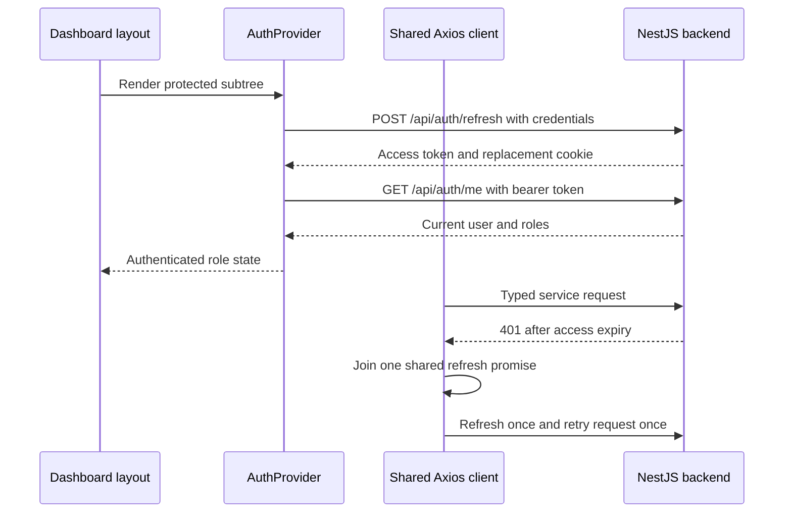
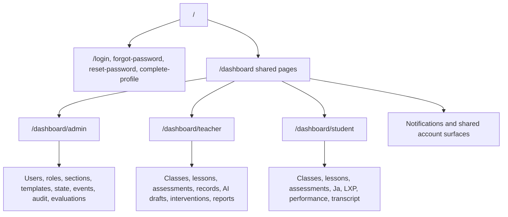

# Chapter 07 — Next.js 16 Web Frontend

> **Snapshot authority.** This chapter describes commit `3d0c93e5270d44b9912deeae0218e95c9a311dd5` on branch `developement`. Source paths named below are the authority if the implementation changes after 2026-07-13.

This chapter is the web-client service manual. It records the App Router tree, role-scoped navigation, every page, API service, provider, query-cache policy, session bootstrap, notification delivery, reusable UI boundary, and design-token declaration.

## Source map

- `next-frontend/app/`
- `next-frontend/src/components/`
- `next-frontend/src/lib/`
- `next-frontend/src/providers/`
- `next-frontend/src/services/`
- `next-frontend/src/types/`
- `next-frontend/proxy.ts`
- `next-frontend/next.config.ts`

## Web-client boundary

```mermaid
flowchart LR
  BROWSER[Browser] --> NEXT[Next.js App Router]
  NEXT --> PROVIDERS[Theme, query, auth, notification providers]
  PROVIDERS --> PAGE[Role-scoped page and components]
  PAGE --> SERVICE[Typed frontend service]
  SERVICE --> AXIOS[Shared Axios API client]
  AXIOS -->|relative /api path| REWRITE[Next.js rewrite]
  REWRITE --> BACKEND[NestJS backend]
  BACKEND -->|Socket.IO event| NOTIFY[NotificationProvider]
  NOTIFY --> CACHE[React Query and local notification state]
```

- The web frontend consumes backend `/api` contracts. It does not call FastAPI directly.
- The production build uses Next standalone output. The rewrite destination is selected from the explicit internal API origin, Railway backend origin, or local backend fallback.
- Browser requests stay relative to `/api`, keeping deployment origin and cookie behavior under the Next.js boundary.

## Provider composition and responsibilities

| Provider | Responsibility | Key behavior | Source |
| --- | --- | --- | --- |
| ThemeProvider | Application theme state | Supplies consistent theme selection to App Router content. | next-frontend/src/providers/ThemeProvider.tsx |
| QueryProvider | Server-state cache | 30-second stale time, two retries, exponential jitter, no refetch on window focus, development devtools. | next-frontend/src/providers/QueryProvider.tsx |
| AuthProvider | Session bootstrap and role helpers | Refreshes the httpOnly-cookie session, stores access token in memory, fetches current user, and exposes bootstrapping, authenticated, or unauthenticated state. | next-frontend/src/providers/AuthProvider.tsx |
| NotificationProvider | Inbox, sockets, polling, extraction tracking, and student reminders | Authenticates Socket.IO with current access token and combines durable notification fetches with bounded polling and route-aware toasts. | next-frontend/src/providers/NotificationProvider.tsx |

## Authentication and request lifecycle

| Client control | Current setting |
| --- | --- |
| Base URL | Relative /api |
| Credentials | withCredentials true for refresh-cookie transport |
| Request timeout | 30 seconds |
| Access token | Process-memory variable in the browser bundle; not localStorage |
| 401 recovery | One shared refresh promise and one retry marker per failed request |
| Auth bootstrap refresh timeout | 5 seconds |
| Current-user lookup | Timeout-protected with one delayed retry |

## Route access and navigation

| Role | Scoped prefix | Default post-login route |
| --- | --- | --- |
| Admin | /dashboard/admin | /dashboard/admin |
| Teacher | /dashboard/teacher | /dashboard/teacher/classes |
| Student | /dashboard/student | /dashboard/student |

- Next proxy checks for the refresh cookie before dashboard navigation. It is an early session hint, not a role verifier.
- Dashboard layouts use AuthProvider and dashboard-route-access to prevent a user from navigating into another role prefix.
- Requested post-login paths must be local single-slash paths. External-origin and protocol-relative paths are rejected.
- Backend JWT, role, ownership, and enrollment checks remain authoritative even when a page is hidden.

## Complete App Router page catalog

> **Exhaustive inventory rule.** The 103 App Router pages below were extracted from `next-frontend/app/**/page.tsx` at commit `3d0c93e`. A later source change requires regenerating or manually reconciling this chapter.

| Route | Role slice | Exports | Local API-path evidence | Source |
| --- | --- | --- | --- | --- |
| /complete-profile | PUBLIC/SHARED | metadata, CompleteProfilePage | Uses components, hooks, or services; no local path literal extracted | next-frontend/app/(auth)/complete-profile/page.tsx |
| /forgot-password | PUBLIC/SHARED | metadata, ForgotPasswordPage | Uses components, hooks, or services; no local path literal extracted | next-frontend/app/(auth)/forgot-password/page.tsx |
| /login | PUBLIC/SHARED | metadata, LoginPage | Uses components, hooks, or services; no local path literal extracted | next-frontend/app/(auth)/login/page.tsx |
| /reset-password | PUBLIC/SHARED | metadata, ResetPasswordPage | Uses components, hooks, or services; no local path literal extracted | next-frontend/app/(auth)/reset-password/page.tsx |
| /set-initial-password | PUBLIC/SHARED | metadata, SetInitialPasswordPage | Uses components, hooks, or services; no local path literal extracted | next-frontend/app/(auth)/set-initial-password/page.tsx |
| /verify-email | PUBLIC/SHARED | metadata, VerifyEmailPage | Uses components, hooks, or services; no local path literal extracted | next-frontend/app/(auth)/verify-email/page.tsx |
| /dashboard/admin/access-students | ADMIN | AdminAccessStudentsPage | Uses components, hooks, or services; no local path literal extracted | next-frontend/app/(dashboard)/dashboard/admin/access-students/page.tsx |
| /dashboard/admin/announcements | ADMIN | AdminAnnouncementsPage | Uses components, hooks, or services; no local path literal extracted | next-frontend/app/(dashboard)/dashboard/admin/announcements/page.tsx |
| /dashboard/admin/audit | ADMIN | AuditTrailPage | Uses components, hooks, or services; no local path literal extracted | next-frontend/app/(dashboard)/dashboard/admin/audit/page.tsx |
| /dashboard/admin/calendar | ADMIN | AdminCalendarPage | Uses components, hooks, or services; no local path literal extracted | next-frontend/app/(dashboard)/dashboard/admin/calendar/page.tsx |
| /dashboard/admin/chatbot | ADMIN | AdminChatbotPage | Uses components, hooks, or services; no local path literal extracted | next-frontend/app/(dashboard)/dashboard/admin/chatbot/page.tsx |
| /dashboard/admin/class-templates/:id/announcements/:announcementKey/edit | ADMIN | AdminTemplateAnnouncementEditPage | /dashboard/admin/class-templates/:param | next-frontend/app/(dashboard)/dashboard/admin/class-templates/[id]/announcements/[announcementKey]/edit/page.tsx |
| /dashboard/admin/class-templates/:id/announcements/new | ADMIN | AdminTemplateAnnouncementCreatePage | /dashboard/admin/class-templates/:param | next-frontend/app/(dashboard)/dashboard/admin/class-templates/[id]/announcements/new/page.tsx |
| /dashboard/admin/class-templates/:id/assessments/:assessmentKey/edit | ADMIN | AdminTemplateAssessmentEditorPage | /dashboard/admin/class-templates/:param | next-frontend/app/(dashboard)/dashboard/admin/class-templates/[id]/assessments/[assessmentKey]/edit/page.tsx |
| /dashboard/admin/class-templates/:id/lessons/:lessonKey/edit | ADMIN | LessonEditorPage | Uses components, hooks, or services; no local path literal extracted | next-frontend/app/(dashboard)/dashboard/admin/class-templates/[id]/lessons/[lessonKey]/edit/page.tsx |
| /dashboard/admin/class-templates/:id/modules/:moduleKey | ADMIN | AdminTemplateModuleWorkspacePage | /dashboard/admin/class-templates/:param, /dashboard/admin/class-templates/:param/assessments/:param/edit, /dashboard/admin/class-templates/:param/lessons/:param/edit | next-frontend/app/(dashboard)/dashboard/admin/class-templates/[id]/modules/[moduleKey]/page.tsx |
| /dashboard/admin/class-templates/:id | ADMIN | ClassTemplateEditorPage | /dashboard/admin/class-templates, /dashboard/admin/class-templates/:param/announcements/:param/edit, /dashboard/admin/class-templates/:param/announcements/new, /dashboard/admin/class-templates/:param/assessments/:param/edit, /dashboard/admin/class-templates/:param/modules/:param | next-frontend/app/(dashboard)/dashboard/admin/class-templates/[id]/page.tsx |
| /dashboard/admin/class-templates | ADMIN | ClassTemplatesPage | /dashboard/admin/class-templates/:param, /dashboard/admin/classes, /dashboard/admin/classes/new?:param | next-frontend/app/(dashboard)/dashboard/admin/class-templates/page.tsx |
| /dashboard/admin/classes/:id/edit | ADMIN | EditClassPage | /dashboard/admin/classes | next-frontend/app/(dashboard)/dashboard/admin/classes/[id]/edit/page.tsx |
| /dashboard/admin/classes/:id | ADMIN | AdminClassDetailPage | /dashboard/admin/calendar, /dashboard/admin/classes, /dashboard/admin/classes/:param/edit, /dashboard/admin/classes/:param/students/add, /dashboard/admin/classes/:param?view=:param, /dashboard/admin/sections/:param/roster, /dashboard/admin/users/:param | next-frontend/app/(dashboard)/dashboard/admin/classes/[id]/page.tsx |
| /dashboard/admin/classes/:id/students/add | ADMIN | AdminAddStudentsPage | /dashboard/admin/classes/:param, /dashboard/admin/classes/:param/students/add, /dashboard/admin/classes/:param/students/add?:param, /dashboard/admin/users/:param | next-frontend/app/(dashboard)/dashboard/admin/classes/[id]/students/add/page.tsx |
| /dashboard/admin/classes/new | ADMIN | CreateClassPage | /dashboard/admin/classes | next-frontend/app/(dashboard)/dashboard/admin/classes/new/page.tsx |
| /dashboard/admin/classes | ADMIN | ClassManagementPage | /, /dashboard/admin/class-templates, /dashboard/admin/classes/:param, /dashboard/admin/classes/:param/edit, /dashboard/admin/classes/new | next-frontend/app/(dashboard)/dashboard/admin/classes/page.tsx |
| /dashboard/admin/diagnostics | ADMIN | AdminDiagnosticsPage | Uses components, hooks, or services; no local path literal extracted | next-frontend/app/(dashboard)/dashboard/admin/diagnostics/page.tsx |
| /dashboard/admin/evaluations | ADMIN | AdminEvaluationsPage | Uses components, hooks, or services; no local path literal extracted | next-frontend/app/(dashboard)/dashboard/admin/evaluations/page.tsx |
| /dashboard/admin/library | ADMIN | DashboardAdminLibraryPage | Uses components, hooks, or services; no local path literal extracted | next-frontend/app/(dashboard)/dashboard/admin/library/page.tsx |
| /dashboard/admin | ADMIN | AdminDashboardPage | /dashboard/admin/classes, /dashboard/admin/diagnostics, /dashboard/admin/sections, /dashboard/admin/users | next-frontend/app/(dashboard)/dashboard/admin/page.tsx |
| /dashboard/admin/profile | ADMIN | AdminProfileRoute | Uses components, hooks, or services; no local path literal extracted | next-frontend/app/(dashboard)/dashboard/admin/profile/page.tsx |
| /dashboard/admin/reports | ADMIN | AdminReportsPage | Uses components, hooks, or services; no local path literal extracted | next-frontend/app/(dashboard)/dashboard/admin/reports/page.tsx |
| /dashboard/admin/roster-import | ADMIN | RosterImportPage | Uses components, hooks, or services; no local path literal extracted | next-frontend/app/(dashboard)/dashboard/admin/roster-import/page.tsx |
| /dashboard/admin/sections/:id/edit | ADMIN | EditSectionPage | /dashboard/admin/sections, /dashboard/admin/sections/:param/students/add, /dashboard/admin/users/:param | next-frontend/app/(dashboard)/dashboard/admin/sections/[id]/edit/page.tsx |
| /dashboard/admin/sections/:id/roster | ADMIN | AdminSectionRosterPage | /dashboard/admin/sections, /dashboard/admin/sections/:param/edit, /dashboard/admin/sections/:param/students/add, /dashboard/admin/users/:param | next-frontend/app/(dashboard)/dashboard/admin/sections/[id]/roster/page.tsx |
| /dashboard/admin/sections/:id/students/add | ADMIN | AddSectionStudentsPage | /dashboard/admin/sections, /dashboard/admin/sections/:param/roster, /dashboard/admin/sections/:param/students/add, /dashboard/admin/sections/:param/students/add?:param, /dashboard/admin/users/:param | next-frontend/app/(dashboard)/dashboard/admin/sections/[id]/students/add/page.tsx |
| /dashboard/admin/sections/:id/students | ADMIN | StudentsLandingPage | /dashboard/admin/sections/:param/students/add | next-frontend/app/(dashboard)/dashboard/admin/sections/[id]/students/page.tsx |
| /dashboard/admin/sections/new | ADMIN | CreateSectionPage | /dashboard/admin/sections | next-frontend/app/(dashboard)/dashboard/admin/sections/new/page.tsx |
| /dashboard/admin/sections | ADMIN | SectionManagementPage | /dashboard/admin/sections/:param/edit, /dashboard/admin/sections/:param/roster, /dashboard/admin/sections/new | next-frontend/app/(dashboard)/dashboard/admin/sections/page.tsx |
| /dashboard/admin/system-settings | ADMIN | AdminSystemSettingsPage | Uses components, hooks, or services; no local path literal extracted | next-frontend/app/(dashboard)/dashboard/admin/system-settings/page.tsx |
| /dashboard/admin/user-reports | ADMIN | AdminUserReportsPage | Uses components, hooks, or services; no local path literal extracted | next-frontend/app/(dashboard)/dashboard/admin/user-reports/page.tsx |
| /dashboard/admin/users/:id | ADMIN | AdminUserDetailPage | /dashboard/admin/users | next-frontend/app/(dashboard)/dashboard/admin/users/[id]/page.tsx |
| /dashboard/admin/users/create | ADMIN | AdminCreateUserPage | /dashboard/admin/users | next-frontend/app/(dashboard)/dashboard/admin/users/create/page.tsx |
| /dashboard/admin/users | ADMIN | UserManagementPage | /dashboard/admin/users/:param, /dashboard/admin/users/create | next-frontend/app/(dashboard)/dashboard/admin/users/page.tsx |
| /dashboard/library | PUBLIC/SHARED | DashboardLibraryAliasPage | /dashboard/admin/library, /dashboard/teacher/library | next-frontend/app/(dashboard)/dashboard/library/page.tsx |
| /dashboard/notifications | PUBLIC/SHARED | NotificationsPage | Uses components, hooks, or services; no local path literal extracted | next-frontend/app/(dashboard)/dashboard/notifications/page.tsx |
| /dashboard | PUBLIC/SHARED | DashboardPage | Uses components, hooks, or services; no local path literal extracted | next-frontend/app/(dashboard)/dashboard/page.tsx |
| /dashboard/profile | PUBLIC/SHARED | ProfileRedirectPage | Uses components, hooks, or services; no local path literal extracted | next-frontend/app/(dashboard)/dashboard/profile/page.tsx |
| /dashboard/student/announcements | STUDENT | StudentAnnouncementsPage | Uses components, hooks, or services; no local path literal extracted | next-frontend/app/(dashboard)/dashboard/student/announcements/page.tsx |
| /dashboard/student/assessment-history | STUDENT | StudentAssessmentHistoryPage | /dashboard/student/profile | next-frontend/app/(dashboard)/dashboard/student/assessment-history/page.tsx |
| /dashboard/student/assessments/:id | STUDENT | StudentAssessmentPage | /dashboard/student, /dashboard/student/assessments/:param/results/:param, /dashboard/student/assessments/:param/take, /dashboard/student/assessments/:param/take?attemptId=:param, /dashboard/student/classes/:param?view=assignments | next-frontend/app/(dashboard)/dashboard/student/assessments/[id]/page.tsx |
| /dashboard/student/assessments/:id/results/:attemptId | STUDENT | StudentAssessmentResultsPage | /dashboard/student/assessments/:param, /dashboard/student/classes | next-frontend/app/(dashboard)/dashboard/student/assessments/[id]/results/[attemptId]/page.tsx |
| /dashboard/student/assessments/:id/take | STUDENT | StudentAssessmentTakePage | /dashboard/student/assessments/:param, /dashboard/student/assessments/:param/results/:param, /dashboard/student/assessments/:param?view=submitted | next-frontend/app/(dashboard)/dashboard/student/assessments/[id]/take/page.tsx |
| /dashboard/student/assessments | STUDENT | StudentAssessmentsIndexPage | /dashboard/student/assessment-history | next-frontend/app/(dashboard)/dashboard/student/assessments/page.tsx |
| /dashboard/student/calendar | STUDENT | StudentCalendarPage | /dashboard/student/classes/:param, /dashboard/student/classes/:param?view=announcements, /dashboard/student/classes/:param?view=calendar, /dashboard/student/courses | next-frontend/app/(dashboard)/dashboard/student/calendar/page.tsx |
| /dashboard/student/chatbot | STUDENT | StudentChatbotRedirectPage | /dashboard/student/ja?mode=ask | next-frontend/app/(dashboard)/dashboard/student/chatbot/page.tsx |
| /dashboard/student/classes/:id/modules/:moduleId | STUDENT | StudentModuleDetailPage | /dashboard/student/assessments/:param, /dashboard/student/assessments/:param/results/:param, /dashboard/student/assessments/:param/take?attemptId=:param, /dashboard/student/classes/:param/modules/:param, /dashboard/student/classes/:param/modules/:param?assessmentId=:param, /dashboard/student/classes/:param/modules/:param?fileItemId=:param, /dashboard/student/classes/:param/modules/:param?lessonId=:param, /dashboard/student/classes/:param?view=modules | next-frontend/app/(dashboard)/dashboard/student/classes/[id]/modules/[moduleId]/page.tsx |
| /dashboard/student/classes/:id | STUDENT | StudentClassDetailPage | /, /dashboard/student/assessments/:param?classId=:param, /dashboard/student/classes/:param/modules/:param, /dashboard/student/classes/:param?view=:param, /dashboard/student/courses, /images/JA/ja_cheer.png, /images/JA/ja_thinking.png, /images/JA/ja_wave.png, /images/modules/module-stock-board.svg, /images/modules/module-stock-library.svg, /images/modules/module-stock-science.svg | next-frontend/app/(dashboard)/dashboard/student/classes/[id]/page.tsx |
| /dashboard/student/classes | STUDENT | StudentClassesIndexPage | /dashboard/student/courses | next-frontend/app/(dashboard)/dashboard/student/classes/page.tsx |
| /dashboard/student/courses | STUDENT | StudentCoursesPage | /dashboard/student/classes/:param, /dashboard/student/classes/:param?view=announcements, /dashboard/student/classes/:param?view=assignments, /dashboard/student/classes/:param?view=calendar, /images/JA/ja_cheer.png, /images/JA/ja_thinking.png, /images/JA/ja_wave.png | next-frontend/app/(dashboard)/dashboard/student/courses/page.tsx |
| /dashboard/student/evaluations | STUDENT | StudentEvaluationsPage | Uses components, hooks, or services; no local path literal extracted | next-frontend/app/(dashboard)/dashboard/student/evaluations/page.tsx |
| /dashboard/student/ja | STUDENT | StudentJaPage | Uses components, hooks, or services; no local path literal extracted | next-frontend/app/(dashboard)/dashboard/student/ja/page.tsx |
| /dashboard/student/lessons/:id | STUDENT | StudentLessonViewPage | /dashboard/student/, /dashboard/student/classes/:param/modules/:param, /dashboard/student/classes/:param/modules/:param?lessonId=:param, /dashboard/student/classes/:param?view=modules | next-frontend/app/(dashboard)/dashboard/student/lessons/[id]/page.tsx |
| /dashboard/student/lessons | STUDENT | StudentLessonsIndexPage | /dashboard/student/lxp | next-frontend/app/(dashboard)/dashboard/student/lessons/page.tsx |
| /dashboard/student/lxp/:classId/generated-lessons/:assignmentId | STUDENT | StudentGeneratedLessonPage | /dashboard/student/lxp/:param | next-frontend/app/(dashboard)/dashboard/student/lxp/[classId]/generated-lessons/[assignmentId]/page.tsx |
| /dashboard/student/lxp/:classId/guided-assessment/:assignmentId | STUDENT | StudentGuidedAssessmentPage | /dashboard/student/lxp/:param?tab=replays, /images/JA/ja_cheer.png, /images/JA/ja_wave.png | next-frontend/app/(dashboard)/dashboard/student/lxp/[classId]/guided-assessment/[assignmentId]/page.tsx |
| /dashboard/student/lxp/:classId | STUDENT | StudentLxpDetailPage | Uses components, hooks, or services; no local path literal extracted | next-frontend/app/(dashboard)/dashboard/student/lxp/[classId]/page.tsx |
| /dashboard/student/lxp | STUDENT | StudentLxpPage | Uses components, hooks, or services; no local path literal extracted | next-frontend/app/(dashboard)/dashboard/student/lxp/page.tsx |
| /dashboard/student | STUDENT | StudentDashboardPage | /dashboard/student/announcements, /dashboard/student/assessments/:param, /dashboard/student/classes/:param, /dashboard/student/classes/:param?view=announcements, /dashboard/student/courses, /dashboard/student/lessons/:param, /images/JA/ja_cheer.png, /images/JA/ja_thinking.png, /images/JA/ja_wave.png | next-frontend/app/(dashboard)/dashboard/student/page.tsx |
| /dashboard/student/performance | STUDENT | StudentPerformancePage | Uses components, hooks, or services; no local path literal extracted | next-frontend/app/(dashboard)/dashboard/student/performance/page.tsx |
| /dashboard/student/profile | STUDENT | StudentProfileRoute | Uses components, hooks, or services; no local path literal extracted | next-frontend/app/(dashboard)/dashboard/student/profile/page.tsx |
| /dashboard/student/transcript | STUDENT | StudentTranscriptPage | /dashboard/student/profile | next-frontend/app/(dashboard)/dashboard/student/transcript/page.tsx |
| /dashboard/teacher/announcements | TEACHER | TeacherAnnouncementsPage | Uses components, hooks, or services; no local path literal extracted | next-frontend/app/(dashboard)/dashboard/teacher/announcements/page.tsx |
| /dashboard/teacher/assessments/:id/edit | TEACHER | AssessmentEditorPage | /dashboard/teacher/assessments, /dashboard/teacher/classes/:param?view=assignments | next-frontend/app/(dashboard)/dashboard/teacher/assessments/[id]/edit/page.tsx |
| /dashboard/teacher/assessments/:id | TEACHER | TeacherAssessmentDetailPage | /dashboard/teacher/assessments, /dashboard/teacher/assessments/:param/edit, /dashboard/teacher/classes/:param?view=assignments | next-frontend/app/(dashboard)/dashboard/teacher/assessments/[id]/page.tsx |
| /dashboard/teacher/assessments/:id/results/:attemptId | TEACHER | TeacherAttemptResultsPage | Uses components, hooks, or services; no local path literal extracted | next-frontend/app/(dashboard)/dashboard/teacher/assessments/[id]/results/[attemptId]/page.tsx |
| /dashboard/teacher/assessments | TEACHER | TeacherAssessmentsPage | /dashboard/teacher, /dashboard/teacher/assessments/:param, /dashboard/teacher/assessments/:param/edit | next-frontend/app/(dashboard)/dashboard/teacher/assessments/page.tsx |
| /dashboard/teacher/calendar | TEACHER | TeacherCalendarPage | Uses components, hooks, or services; no local path literal extracted | next-frontend/app/(dashboard)/dashboard/teacher/calendar/page.tsx |
| /dashboard/teacher/class-record | TEACHER | ClassRecordPage | Uses components, hooks, or services; no local path literal extracted | next-frontend/app/(dashboard)/dashboard/teacher/class-record/page.tsx |
| /dashboard/teacher/classes/:id/ai-draft | TEACHER | TeacherAiDraftQuizPage | /dashboard/teacher/assessments/:param/edit, /dashboard/teacher/classes/:param?view=assignments | next-frontend/app/(dashboard)/dashboard/teacher/classes/[id]/ai-draft/page.tsx |
| /dashboard/teacher/classes/:id/modules/:moduleId/files/:fileId | TEACHER | TeacherModuleFileEditorPage | /dashboard/teacher/classes/:param/modules/:param, /dashboard/teacher/classes/:param/modules/:param/files/:param | next-frontend/app/(dashboard)/dashboard/teacher/classes/[id]/modules/[moduleId]/files/[fileId]/page.tsx |
| /dashboard/teacher/classes/:id/modules/:moduleId | TEACHER | TeacherModuleDetailPage | /dashboard/teacher/assessments, /dashboard/teacher/assessments/:param/edit, /dashboard/teacher/assessments/:param/edit?classId=:param&moduleId=:param, /dashboard/teacher/classes/:param, /dashboard/teacher/classes/:param/modules/:param/files/:param, /dashboard/teacher/lessons/:param/edit, /dashboard/teacher/lessons/:param/view?classId=:param&moduleId=:param | next-frontend/app/(dashboard)/dashboard/teacher/classes/[id]/modules/[moduleId]/page.tsx |
| /dashboard/teacher/classes/:id | TEACHER | TeacherClassDetailPage | /, /dashboard/teacher/assessments/:param, /dashboard/teacher/assessments/:param/edit, /dashboard/teacher/calendar?classId=:param, /dashboard/teacher/classes, /dashboard/teacher/classes/:param/ai-draft, /dashboard/teacher/classes/:param/modules/:param, /dashboard/teacher/classes/:param/students/:param, /dashboard/teacher/classes/:param/students/add, /dashboard/teacher/classes/:param?view=:param, /dashboard/teacher/classes/:param?view=assignments, /dashboard/teacher/classes/:param?view=calendar, /dashboard/teacher/extractions/:param | next-frontend/app/(dashboard)/dashboard/teacher/classes/[id]/page.tsx |
| /dashboard/teacher/classes/:id/students/:studentId | TEACHER | TeacherStudentProfilePage | /dashboard/teacher/classes/:param?view=students | next-frontend/app/(dashboard)/dashboard/teacher/classes/[id]/students/[studentId]/page.tsx |
| /dashboard/teacher/classes/:id/students/add | TEACHER | TeacherAddStudentsPage | /dashboard/teacher/classes/:param, /dashboard/teacher/classes/:param/students/:param, /dashboard/teacher/classes/:param/students/add, /dashboard/teacher/classes/:param/students/add?:param | next-frontend/app/(dashboard)/dashboard/teacher/classes/[id]/students/add/page.tsx |
| /dashboard/teacher/classes | TEACHER | TeacherClassesPage | /dashboard/teacher/announcements, /dashboard/teacher/classes/:param, /dashboard/teacher/classes/:param?view=announcements, /dashboard/teacher/classes/:param?view=assignments, /dashboard/teacher/classes/:param?view=modules | next-frontend/app/(dashboard)/dashboard/teacher/classes/page.tsx |
| /dashboard/teacher/evaluations | TEACHER | TeacherEvaluationsPage | Uses components, hooks, or services; no local path literal extracted | next-frontend/app/(dashboard)/dashboard/teacher/evaluations/page.tsx |
| /dashboard/teacher/extractions/:id | TEACHER | ExtractionReviewPage | Uses components, hooks, or services; no local path literal extracted | next-frontend/app/(dashboard)/dashboard/teacher/extractions/[id]/page.tsx |
| /dashboard/teacher/interventions/:caseId | TEACHER | TeacherInterventionWorkspacePage | /dashboard/teacher/interventions, /dashboard/teacher/interventions?classId=:param | next-frontend/app/(dashboard)/dashboard/teacher/interventions/[caseId]/page.tsx |
| /dashboard/teacher/interventions | TEACHER | TeacherInterventionsPage | /dashboard/teacher/interventions/:param, /dashboard/teacher/interventions/:param?classId=:param | next-frontend/app/(dashboard)/dashboard/teacher/interventions/page.tsx |
| /dashboard/teacher/lessons/:id/edit | TEACHER | LessonEditorPage | Uses components, hooks, or services; no local path literal extracted | next-frontend/app/(dashboard)/dashboard/teacher/lessons/[id]/edit/page.tsx |
| /dashboard/teacher/lessons/:id/view | TEACHER | TeacherLessonViewPage | Uses components, hooks, or services; no local path literal extracted | next-frontend/app/(dashboard)/dashboard/teacher/lessons/[id]/view/page.tsx |
| /dashboard/teacher/lessons | TEACHER | TeacherLessonsPage | /dashboard/teacher, /dashboard/teacher/lessons/:param/edit | next-frontend/app/(dashboard)/dashboard/teacher/lessons/page.tsx |
| /dashboard/teacher/library | TEACHER | DashboardTeacherLibraryPage | Uses components, hooks, or services; no local path literal extracted | next-frontend/app/(dashboard)/dashboard/teacher/library/page.tsx |
| /dashboard/teacher/modules | TEACHER | TeacherModulesIndexPage | /dashboard/teacher/library | next-frontend/app/(dashboard)/dashboard/teacher/modules/page.tsx |
| /dashboard/teacher | TEACHER | TeacherDashboardRedirectPage | /dashboard/teacher/classes | next-frontend/app/(dashboard)/dashboard/teacher/page.tsx |
| /dashboard/teacher/performance | TEACHER | TeacherPerformancePage | Uses components, hooks, or services; no local path literal extracted | next-frontend/app/(dashboard)/dashboard/teacher/performance/page.tsx |
| /dashboard/teacher/profile | TEACHER | TeacherProfileRoute | Uses components, hooks, or services; no local path literal extracted | next-frontend/app/(dashboard)/dashboard/teacher/profile/page.tsx |
| /dashboard/teacher/reports | TEACHER | TeacherReportsPage | Uses components, hooks, or services; no local path literal extracted | next-frontend/app/(dashboard)/dashboard/teacher/reports/page.tsx |
| /dashboard/teacher/sections/:id/roster | TEACHER | SectionRosterPage | /dashboard/teacher/sections, /dashboard/teacher/sections/:param/students/:param, /dashboard/teacher/sections/:param/students/add | next-frontend/app/(dashboard)/dashboard/teacher/sections/[id]/roster/page.tsx |
| /dashboard/teacher/sections/:id/students/:studentId | TEACHER | TeacherSectionStudentProfilePage | /dashboard/teacher/sections/:param/roster | next-frontend/app/(dashboard)/dashboard/teacher/sections/[id]/students/[studentId]/page.tsx |
| /dashboard/teacher/sections/:id/students/add | TEACHER | TeacherAddSectionStudentsPage | /dashboard/teacher/sections/:param/roster, /dashboard/teacher/sections/:param/students/:param, /dashboard/teacher/sections/:param/students/add, /dashboard/teacher/sections/:param/students/add?:param | next-frontend/app/(dashboard)/dashboard/teacher/sections/[id]/students/add/page.tsx |
| /dashboard/teacher/sections | TEACHER | TeacherSectionsPage | /dashboard/teacher/announcements, /dashboard/teacher/announcements?classId=:param, /dashboard/teacher/sections/:param/roster | next-frontend/app/(dashboard)/dashboard/teacher/sections/page.tsx |
| /dashboard/theme-test | PUBLIC/SHARED | ThemeTestPage | Uses components, hooks, or services; no local path literal extracted | next-frontend/app/(dashboard)/dashboard/theme-test/page.tsx |
| /demo | PUBLIC/SHARED | DemoPage | /, /images/JA/ja_cheer.png, /images/JA/ja_sad.png, /images/JA/ja_thinking.png, /images/JA/ja_wave.png | next-frontend/app/demo/page.tsx |
| / | PUBLIC/SHARED | LandingPage | /, /Gatbg.png, /NexoraHome.png, /dashboard, /demo, /downloads/nexora-student-mobile-release.apk, /taguigpic.png | next-frontend/app/page.tsx |

## Complete frontend API service catalog

> **Exhaustive inventory rule.** The 30 frontend service modules below were extracted from `next-frontend/src/services/*.ts` at commit `3d0c93e`. A later source change requires regenerating or manually reconciling this chapter.

| Service source | Exports | Backend path literals |
| --- | --- | --- |
| next-frontend/src/services/academic-state-service.ts | academicStateService | /academic-state/current, /academic-state/impact-preview, /academic-state/transition |
| next-frontend/src/services/admin-chatbot-service.ts | adminChatbotService | /ai/admin/chat, /ai/admin/history, /ai/admin/sessions/:param, /ai/health, /api/ai/admin/chat |
| next-frontend/src/services/admin-service.ts | adminService | /admin/audit-logs, /admin/overview, /admin/usage-summary, /api/admin/activity-export:param, /health/live, /health/ready |
| next-frontend/src/services/ai-service.ts | aiService | /ai/index/classes/:param, /ai/index/classes/:param/status, /ai/mentor/explain, /ai/student/tutor/bootstrap, /ai/student/tutor/session, /ai/student/tutor/session/:param, /ai/student/tutor/session/:param/answers, /ai/student/tutor/session/:param/message, /ai/teacher/classes/:param/policy, /ai/teacher/interventions/:param/jobs, /ai/teacher/interventions/:param/recommend, /ai/teacher/jobs/:param, /ai/teacher/jobs/:param/result, /ai/teacher/lesson-plans/jobs, /ai/teacher/lesson-plans/jobs/:param/draft, /ai/teacher/quizzes/generate-draft, /ai/teacher/quizzes/jobs, /ai/teacher/quizzes/jobs/:param/apply, /ai/teacher/quizzes/jobs/:param/apply/preview, /ai/teacher/quizzes/jobs/:param/cancel, /ai/teacher/quizzes/jobs/:param/draft, /ai/teacher/quizzes/jobs/:param/retry |
| next-frontend/src/services/analytics-service.ts | analyticsService | /analytics/admin/overview, /analytics/classes/:param/intervention-outcomes, /analytics/classes/:param/trends, /analytics/teachers/:param/workload |
| next-frontend/src/services/announcement-service.ts | announcementService | /classes/:param/announcements, /classes/:param/announcements/:param, /classes/:param/announcements/:param/core-release |
| next-frontend/src/services/assessment-service.ts | assessmentService | /assessments, /assessments/:param, /assessments/:param/all-attempts, /assessments/:param/core-release, /assessments/:param/ongoing-attempt, /assessments/:param/question-analytics, /assessments/:param/return-all, /assessments/:param/rubric-review, /assessments/:param/rubric-source, /assessments/:param/start, /assessments/:param/stats, /assessments/:param/student-attempts, /assessments/:param/submission-file, /assessments/:param/submission-files/:param, /assessments/:param/submissions, /assessments/:param/teacher-attachment, /assessments/:param/teacher-attachment/download, /assessments/:param/unsubmit-file-upload, /assessments/attempts/:param/progress, /assessments/attempts/:param/results, /assessments/attempts/:param/return, /assessments/attempts/:param/submission-file/download, /assessments/attempts/:param/submission-files/:param/download, /assessments/attempts/:param/unreturn, /assessments/attempts/bulk-return, /assessments/attempts/ongoing, /assessments/class/:param, /assessments/options/:param/image, /assessments/questions, /assessments/questions/:param, /assessments/questions/:param/image, /assessments/submit |
| next-frontend/src/services/class-record-service.ts | classRecordService | /class-record, /class-record/:param, /class-record/:param/final-grades, /class-record/:param/final-grades/:param, /class-record/:param/finalize, /class-record/:param/preview-grades, /class-record/:param/reopen, /class-record/:param/reports/class-average, /class-record/:param/reports/distribution, /class-record/:param/reports/intervention, /class-record/:param/spreadsheet, /class-record/adviser/section/:param, /class-record/by-class/:param, /class-record/by-class/:param/slot-overview, /class-record/items/:param, /class-record/items/:param/scores, /class-record/items/:param/scores/bulk, /class-record/items/:param/sync-scores |
| next-frontend/src/services/class-service.ts | classService | /classes, /classes/:param, /classes/:param/banner, /classes/:param/candidates, /classes/:param/enrollments, /classes/:param/enrollments/:param, /classes/:param/hide, /classes/:param/presentation, /classes/:param/purge, /classes/:param/student-presentation, /classes/:param/students/:param/overview, /classes/:param/students/:param/profile, /classes/:param/students/masterlist, /classes/:param/toggle-status, /classes/:param/unhide, /classes/all, /classes/bulk/lifecycle, /classes/section/:param, /classes/student/:param, /classes/student/:param/preferences/presentation, /classes/student/:param/preferences/view, /classes/subject/:param, /classes/teacher/:param |
| next-frontend/src/services/class-template-service.ts | classTemplateService | /class-templates, /class-templates/:param, /class-templates/:param/assessment-images, /class-templates/:param/content, /class-templates/:param/engine-export, /class-templates/:param/publish, /class-templates/compatible, /class-templates/engine-import, /class-templates/engine-import/validate |
| next-frontend/src/services/dashboard-service.ts | dashboardService | /admin/dashboard/stats, /teacher/assessments, /teacher/classes, /teacher/lessons |
| next-frontend/src/services/demo-ai-plan-service.ts | generateDemoAiPlan | /api/ai/demo/intervention-plan |
| next-frontend/src/services/discussion-board-service.ts | discussionBoardService | /classes/:param/discussion-threads, /classes/:param/discussion-threads/:param, /classes/:param/discussion-threads/:param/close, /classes/:param/discussion-threads/:param/comments, /classes/:param/discussion-threads/:param/comments/:param, /classes/:param/discussion-threads/:param/comments/:param/reaction, /classes/:param/discussion-threads/:param/comments/:param/report, /classes/:param/discussion-threads/:param/comments/uploads, /classes/:param/discussion-threads/:param/publish, /classes/:param/discussion-threads/:param/reopen, /classes/:param/discussion-threads/uploads |
| next-frontend/src/services/extraction-service.ts | extractionService | /ai/extract-module, /ai/extractions, /ai/extractions/:param, /ai/extractions/:param/apply, /ai/extractions/:param/apply/preview, /ai/extractions/:param/cancel, /ai/extractions/:param/retry, /ai/extractions/:param/status |
| next-frontend/src/services/file-service.ts | fileService | /files, /files/:param, /files/:param/download, /files/:param/index/retry, /files/folders, /files/folders/:param, /files/storage-summary, /files/upload |
| next-frontend/src/services/health-service.ts | FRONTEND_APP_VERSION, healthService | /ai/health, /health/live, /health/ready |
| next-frontend/src/services/index.ts | No named export extracted | No static API path literal extracted |
| next-frontend/src/services/ja-service.ts | jaService | /ai/student/ja/ask/bootstrap, /ai/student/ja/ask/threads, /ai/student/ja/ask/threads/:param, /ai/student/ja/ask/threads/:param/messages, /ai/student/ja/hub, /ai/student/ja/practice/bootstrap, /ai/student/ja/practice/sessions, /ai/student/ja/practice/sessions/:param, /ai/student/ja/practice/sessions/:param/complete, /ai/student/ja/practice/sessions/:param/events, /ai/student/ja/practice/sessions/:param/responses, /ai/student/ja/review/bootstrap, /ai/student/ja/review/sessions, /ai/student/ja/review/sessions/:param, /ai/student/ja/review/sessions/:param/complete, /ai/student/ja/review/sessions/:param/events, /ai/student/ja/review/sessions/:param/responses |
| next-frontend/src/services/lesson-service.ts | lessonService | /lessons, /lessons/:param, /lessons/:param/blocks, /lessons/:param/complete, /lessons/:param/completion-status, /lessons/:param/publish, /lessons/:param/reorder-blocks, /lessons/:param/versions, /lessons/:param/versions/:param/restore, /lessons/blocks/:param, /lessons/class/:param, /lessons/class/:param/bulk-delete, /lessons/class/:param/bulk-status, /lessons/class/:param/completed, /lessons/class/:param/reorder |
| next-frontend/src/services/lxp-service.ts | lxpService | /lxp/evaluations, /lxp/me/eligibility, /lxp/me/overview/:param, /lxp/me/playlist/:param, /lxp/me/playlist/:param/checkpoints/:param/complete, /lxp/me/playlist/:param/generated-lessons/:param, /lxp/me/playlist/:param/guided-assessments/:param/progress, /lxp/me/playlist/:param/guided-assessments/:param/result, /lxp/me/playlist/:param/guided-assessments/:param/start, /lxp/me/playlist/:param/guided-assessments/:param/submit, /lxp/me/system-evaluations, /lxp/me/system-evaluations/:param/submit, /lxp/me/teacher-evaluations, /lxp/system-evaluation-campaigns, /lxp/system-evaluation-campaigns/:param/status, /lxp/teacher/classes/:param/interventions, /lxp/teacher/classes/:param/interventions/history, /lxp/teacher/classes/:param/reports/summary, /lxp/teacher/evaluations/summary, /lxp/teacher/interventions/:param, /lxp/teacher/interventions/:param/activate, /lxp/teacher/interventions/:param/assign, /lxp/teacher/interventions/:param/detail, /lxp/teacher/interventions/:param/generated-content/approve, /lxp/teacher/interventions/:param/generated-content/reject, /lxp/teacher/interventions/:param/regenerate, /lxp/teacher/interventions/:param/resolve, /lxp/teacher/interventions/pending-count |
| next-frontend/src/services/module-service.ts | moduleService | /modules, /modules/:param, /modules/:param/core-release, /modules/:param/cover, /modules/:param/grading-scale, /modules/:param/sections, /modules/:param/sections/reorder, /modules/class/:param, /modules/class/:param/:param, /modules/class/:param/reorder, /modules/items/:param, /modules/items/:param/core-release, /modules/items/:param/file/download, /modules/sections/:param, /modules/sections/:param/items, /modules/sections/:param/items/reorder |
| next-frontend/src/services/notification-service.ts | normalizeNotification, notificationService | /notifications, /notifications/:param/read, /notifications/read-all, /notifications/unread-count |
| next-frontend/src/services/performance-service.ts | performanceService | /performance/admin/analytics, /performance/analysis/jobs/:param, /performance/analysis/jobs/:param/result, /performance/classes/:param/analysis/jobs, /performance/classes/:param/at-risk, /performance/classes/:param/diagnostics, /performance/classes/:param/intervention-quiz-comparison, /performance/classes/:param/logs, /performance/classes/:param/recompute, /performance/classes/:param/summary, /performance/students/me/summary |
| next-frontend/src/services/profile-service.ts | profileService | /profiles/me, /profiles/me/academic-summary, /profiles/me/assessment-history, /profiles/me/avatar, /profiles/me/transcript, /profiles/update/:param |
| next-frontend/src/services/report-service.ts | reportService | /reports/assessment-summary, /reports/class-enrollment, /reports/intervention-participation, /reports/student-master-list, /reports/student-performance, /reports/system-usage |
| next-frontend/src/services/roster-import-service.ts | rosterImportService | /roster-import/:param/commit, /roster-import/:param/pending, /roster-import/:param/preview, /roster-import/pending/:param/resolve |
| next-frontend/src/services/school-event-service.ts | schoolEventService | /school-events, /school-events/:param |
| next-frontend/src/services/section-service.ts | sectionService | /sections/:param, /sections/:param/banner, /sections/:param/candidates, /sections/:param/hide, /sections/:param/presentation, /sections/:param/restore, /sections/:param/roster, /sections/:param/roster/:param, /sections/:param/schedule, /sections/:param/students/:param/profile, /sections/:param/unhide, /sections/access-students/fail, /sections/access-students/finalize-grades, /sections/access-students/move-up, /sections/access-students/overview, /sections/access-students/target-sections, /sections/all, /sections/bulk/lifecycle, /sections/create, /sections/delete/:param, /sections/my, /sections/permanent/:param, /sections/update/:param |
| next-frontend/src/services/teacher-profile-service.ts | teacherProfileService | /teacher-profiles/:param, /teacher-profiles/me, /teacher-profiles/me/avatar |
| next-frontend/src/services/user-service.ts | userService | /users/:param, /users/:param/export, /users/:param/purge, /users/:param/reactivate, /users/:param/reset-password, /users/:param/soft-delete, /users/:param/suspend, /users/all, /users/bulk/lifecycle, /users/create, /users/delete/:param, /users/reports/monitoring, /users/update/:param |

### Service-layer rules

- Components and pages should use the owning service or query hook instead of constructing a second Axios client.
- Service methods normalize the backend response contract and keep route parameters, query parameters, and payload types in one place.
- Dynamic `:param` entries in the table represent a template expression extracted from source, not a literal backend route segment.
- A path already beginning with `/api` must be reviewed carefully because the shared client base is also `/api`; intentional direct fetches and Axios calls have different joining behavior.

## React Query policy and invalidation

| Concern | Current policy | Maintenance rule |
| --- | --- | --- |
| Staleness | 30 seconds by default | Override only when the domain has a clearer freshness requirement. |
| Retries | Two retries with exponential delay, 30-second cap, and random jitter | Do not retry a known validation or authorization failure through a query wrapper. |
| Window focus | No automatic refetch | Mutations and notification events must invalidate affected keys deliberately. |
| QueryClient lifetime | One client created with useState per provider instance | Never create a new client during each render. |
| Mutation reconciliation | Service or hook-specific invalidateQueries or cache update | Invalidate list, detail, counts, and role dashboard summaries affected by the mutation. |
| Devtools | Mounted closed by default | Exclude sensitive values from query keys and cached debug content. |

## Real-time notification behavior

- NotificationProvider fetches the durable inbox and connects Socket.IO after authentication.
- Disconnected polling runs every 15 seconds; connected fallback polling runs every 30 seconds.
- Extraction status polling runs every 10 seconds for tracked nonterminal extraction work.
- Student pending-task and intervention reminders are synthesized on a 90-second cadence from backend data and use route-aware display logic.
- Socket delivery accelerates user feedback; the durable notifications table and fetch endpoint remain the recovery source after reconnect.

## Reusable UI component register

| Component source | Ownership |
| --- | --- |
| next-frontend/src/components/ui/avatar.tsx | Reusable primitive under src/components/ui; feature-specific composition belongs outside this directory. |
| next-frontend/src/components/ui/badge.tsx | Reusable primitive under src/components/ui; feature-specific composition belongs outside this directory. |
| next-frontend/src/components/ui/button.tsx | Reusable primitive under src/components/ui; feature-specific composition belongs outside this directory. |
| next-frontend/src/components/ui/card.tsx | Reusable primitive under src/components/ui; feature-specific composition belongs outside this directory. |
| next-frontend/src/components/ui/dialog.tsx | Reusable primitive under src/components/ui; feature-specific composition belongs outside this directory. |
| next-frontend/src/components/ui/dropdown-menu.tsx | Reusable primitive under src/components/ui; feature-specific composition belongs outside this directory. |
| next-frontend/src/components/ui/input.tsx | Reusable primitive under src/components/ui; feature-specific composition belongs outside this directory. |
| next-frontend/src/components/ui/label.tsx | Reusable primitive under src/components/ui; feature-specific composition belongs outside this directory. |
| next-frontend/src/components/ui/popover.tsx | Reusable primitive under src/components/ui; feature-specific composition belongs outside this directory. |
| next-frontend/src/components/ui/progress.tsx | Reusable primitive under src/components/ui; feature-specific composition belongs outside this directory. |
| next-frontend/src/components/ui/select.tsx | Reusable primitive under src/components/ui; feature-specific composition belongs outside this directory. |
| next-frontend/src/components/ui/separator.tsx | Reusable primitive under src/components/ui; feature-specific composition belongs outside this directory. |
| next-frontend/src/components/ui/sheet.tsx | Reusable primitive under src/components/ui; feature-specific composition belongs outside this directory. |
| next-frontend/src/components/ui/skeleton.tsx | Reusable primitive under src/components/ui; feature-specific composition belongs outside this directory. |
| next-frontend/src/components/ui/sonner.tsx | Reusable primitive under src/components/ui; feature-specific composition belongs outside this directory. |
| next-frontend/src/components/ui/table.tsx | Reusable primitive under src/components/ui; feature-specific composition belongs outside this directory. |
| next-frontend/src/components/ui/tabs.tsx | Reusable primitive under src/components/ui; feature-specific composition belongs outside this directory. |
| next-frontend/src/components/ui/textarea.tsx | Reusable primitive under src/components/ui; feature-specific composition belongs outside this directory. |
| next-frontend/src/components/ui/tooltip.tsx | Reusable primitive under src/components/ui; feature-specific composition belongs outside this directory. |

## Design token dictionary

> The style inventory contains 459 CSS custom-property declarations and 408 distinct name/value pairs across base and theme selectors. Repeated declarations are theme or selector overrides; all distinct pairs are listed.

| Custom property | Declared value |
| --- | --- |
| --color-background | #ffffff |
| --color-foreground | #000000 |
| --color-primary | #dc2626 |
| --color-primary-foreground | #ffffff |
| --color-secondary | #374151 |
| --color-secondary-foreground | #ffffff |
| --color-muted | #f3f4f6 |
| --color-muted-foreground | #6b7280 |
| --color-accent | #f59e0b |
| --color-accent-foreground | #000000 |
| --color-destructive | #dc2626 |
| --color-destructive-foreground | #ffffff |
| --color-border | #e5e7eb |
| --color-input | #ffffff |
| --color-ring | #dc2626 |
| --color-card | #ffffff |
| --color-card-foreground | #000000 |
| --color-popover | #ffffff |
| --color-popover-foreground | #000000 |
| --color-sidebar | #ffffff |
| --color-sidebar-foreground | #000000 |
| --color-sidebar-border | #e5e7eb |
| --color-sidebar-accent | #f3f4f6 |
| --color-sidebar-accent-foreground | #000000 |
| --color-sidebar-ring | #dc2626 |
| --radius-sm | 0.25rem |
| --radius-md | 0.375rem |
| --radius-lg | 0.5rem |
| --radius-xl | 0.75rem |
| --color-foreground | #111827 |
| --color-accent | #f3f4f6 |
| --color-accent-foreground | #111827 |
| --color-card-foreground | #111827 |
| --color-popover-foreground | #111827 |
| --color-sidebar-foreground | #111827 |
| --color-sidebar-accent-foreground | #111827 |
| --student-shell | #fffaf9 |
| --student-page-gradient | radial-gradient(circle at 12% 0%, rgba(220, 38, 38, 0.14), transparent 34%), linear-gradient(180deg, #fffaf9 0%, #fff3f1 52%, #fffdfc 100%) |
| --student-topbar-gradient | linear-gradient(135deg, rgba(255, 255, 255, 0.96), rgba(255, 240, 240, 0.92)) |
| --student-sidebar-gradient | linear-gradient(180deg, rgba(255, 255, 255, 0.98), rgba(255, 244, 244, 0.96)) |
| --student-surface | #fff8f7 |
| --student-surface-soft | #fff0ee |
| --student-elevated | #ffffff |
| --student-glass | rgba(255, 255, 255, 0.72) |
| --student-outline | rgba(248, 113, 113, 0.22) |
| --student-outline-strong | rgba(239, 68, 68, 0.34) |
| --student-text-strong | #0f172a |
| --student-text-muted | #64748b |
| --student-accent | #ef4444 |
| --student-accent-soft | rgba(239, 68, 68, 0.12) |
| --student-accent-soft-strong | rgba(239, 68, 68, 0.28) |
| --student-accent-contrast | #ffffff |
| --student-hero-stripe | rgba(239, 68, 68, 0.08) |
| --student-progress-track | rgba(226, 232, 240, 0.9) |
| --student-progress-fill | linear-gradient(90deg, #ef4444 0%, #fb7185 100%) |
| --student-success-bg | #ecfdf5 |
| --student-success-border | #a7f3d0 |
| --student-success-text | #047857 |
| --student-danger-bg | #fff1f2 |
| --student-danger-border | #fecdd3 |
| --student-danger-text | #be123c |
| --student-shadow | 0 18px 44px -28px rgba(127, 29, 29, 0.38) |
| --student-shadow-hover | 0 24px 60px -28px rgba(127, 29, 29, 0.46) |
| --student-radius | 18px |
| --student-motion-fast | 0.18s |
| --student-motion-normal | 0.28s |
| --teacher-page-gradient | radial-gradient(circle at 10% 0%, rgba(220, 38, 38, 0.14), transparent 34%), linear-gradient(180deg, #fffaf9 0%, #fff4f3 54%, #fffdfc 100%) |
| --teacher-surface | rgba(255, 255, 255, 0.92) |
| --teacher-surface-soft | rgba(255, 244, 244, 0.92) |
| --teacher-surface-strong | #fff1f2 |
| --teacher-outline | rgba(248, 113, 113, 0.2) |
| --teacher-outline-strong | rgba(239, 68, 68, 0.3) |
| --teacher-text-strong | #0f172a |
| --teacher-text-muted | #64748b |
| --teacher-accent | #dc2626 |
| --teacher-accent-strong | #ef4444 |
| --teacher-accent-warm | #fb7185 |
| --teacher-glow | 0 22px 52px -34px rgba(127, 29, 29, 0.28) |
| --teacher-glow-hover | 0 28px 64px -34px rgba(127, 29, 29, 0.34) |
| --teacher-shadow | 0 22px 52px -34px rgba(127, 29, 29, 0.28) |
| --teacher-radius | 24px |
| --teacher-motion-fast | 0.18s |
| --teacher-motion-normal | 0.28s |
| --student-shell | #09111f |
| --student-page-gradient | radial-gradient(circle at 14% 0%, rgba(56, 189, 248, 0.18), transparent 34%), linear-gradient(180deg, #09111f 0%, #0f172a 52%, #060b16 100%) |
| --student-topbar-gradient | linear-gradient(135deg, rgba(8, 15, 28, 0.9), rgba(17, 24, 39, 0.88)) |
| --student-sidebar-gradient | linear-gradient(180deg, rgba(8, 15, 28, 0.98), rgba(15, 23, 42, 0.94)) |
| --student-surface | #0f172a |
| --student-surface-soft | #162033 |
| --student-elevated | #111c31 |
| --student-glass | rgba(9, 17, 31, 0.72) |
| --student-outline | rgba(96, 165, 250, 0.2) |
| --student-outline-strong | rgba(56, 189, 248, 0.32) |
| --student-text-strong | #e5eefc |
| --student-text-muted | #94a3b8 |
| --student-accent | #38bdf8 |
| --student-accent-soft | rgba(56, 189, 248, 0.14) |
| --student-accent-soft-strong | rgba(56, 189, 248, 0.28) |
| --student-accent-contrast | #08111f |
| --student-hero-stripe | rgba(56, 189, 248, 0.1) |
| --student-progress-track | rgba(30, 41, 59, 0.92) |
| --student-progress-fill | linear-gradient(90deg, #38bdf8 0%, #2dd4bf 100%) |
| --student-success-bg | rgba(6, 95, 70, 0.24) |
| --student-success-border | rgba(16, 185, 129, 0.34) |
| --student-success-text | #86efac |
| --student-danger-bg | rgba(127, 29, 29, 0.2) |
| --student-danger-border | rgba(251, 113, 133, 0.24) |
| --student-danger-text | #fecdd3 |
| --student-shadow | 0 24px 55px -30px rgba(2, 6, 23, 0.74) |
| --student-shadow-hover | 0 30px 70px -30px rgba(2, 6, 23, 0.82) |
| --teacher-page-gradient | radial-gradient(circle at 12% 0%, rgba(34, 211, 238, 0.16), transparent 28%), radial-gradient(circle at 100% 12%, rgba(251, 191, 36, 0.14), transparent 28%), linear-gradient(180deg, #08111d 0%, #0d1725 48%, #111827 100%) |
| --teacher-surface | rgba(8, 18, 33, 0.9) |
| --teacher-surface-soft | rgba(13, 31, 54, 0.88) |
| --teacher-surface-strong | #102034 |
| --teacher-outline | rgba(34, 211, 238, 0.16) |
| --teacher-outline-strong | rgba(56, 189, 248, 0.28) |
| --teacher-text-strong | #e6f1ff |
| --teacher-text-muted | rgba(255, 255, 255, 0.88) |
| --teacher-accent | #38bdf8 |
| --teacher-accent-strong | #2dd4bf |
| --teacher-accent-warm | #fbbf24 |
| --teacher-glow | 0 26px 66px -34px rgba(2, 6, 23, 0.76) |
| --teacher-glow-hover | 0 32px 82px -34px rgba(34, 211, 238, 0.18) |
| --student-shell | #f2fbff |
| --student-page-gradient | radial-gradient(circle at 12% 0%, rgba(14, 165, 233, 0.16), transparent 32%), linear-gradient(180deg, #f2fbff 0%, #ecfeff 54%, #f7fffd 100%) |
| --student-topbar-gradient | linear-gradient(135deg, rgba(255, 255, 255, 0.9), rgba(237, 253, 255, 0.92)) |
| --student-sidebar-gradient | linear-gradient(180deg, rgba(248, 254, 255, 0.98), rgba(237, 252, 255, 0.94)) |
| --student-surface | #f8feff |
| --student-surface-soft | #e8f9ff |
| --student-outline | rgba(14, 165, 233, 0.18) |
| --student-outline-strong | rgba(13, 148, 136, 0.26) |
| --student-text-muted | #4b6477 |
| --student-accent | #0f766e |
| --student-accent-soft | rgba(15, 118, 110, 0.12) |
| --student-accent-soft-strong | rgba(14, 165, 233, 0.26) |
| --student-accent-contrast | #f8feff |
| --student-hero-stripe | rgba(14, 165, 233, 0.1) |
| --student-progress-track | rgba(207, 250, 254, 0.9) |
| --student-progress-fill | linear-gradient(90deg, #0ea5e9 0%, #14b8a6 100%) |
| --student-success-bg | #ecfeff |
| --student-success-border | #99f6e4 |
| --student-success-text | #0f766e |
| --student-danger-bg | #fff7ed |
| --student-danger-border | #fdba74 |
| --student-danger-text | #c2410c |
| --student-shadow | 0 22px 48px -30px rgba(8, 47, 73, 0.3) |
| --student-shadow-hover | 0 28px 66px -28px rgba(8, 47, 73, 0.36) |
| --student-shell | #0a0a0a |
| --student-page-gradient | radial-gradient(circle at 16% 0%, rgba(168, 85, 247, 0.22), transparent 36%), linear-gradient(180deg, #0a0a0a 0%, #111111 56%, #080808 100%) |
| --student-topbar-gradient | linear-gradient(135deg, rgba(10, 10, 10, 0.95), rgba(20, 20, 20, 0.92)) |
| --student-sidebar-gradient | linear-gradient(180deg, rgba(10, 10, 10, 0.98), rgba(17, 17, 17, 0.96)) |
| --student-surface | #121212 |
| --student-surface-soft | #1a1a1a |
| --student-elevated | #1e1e1e |
| --student-glass | rgba(20, 20, 20, 0.75) |
| --student-outline | rgba(168, 85, 247, 0.22) |
| --student-outline-strong | rgba(147, 51, 234, 0.36) |
| --student-text-strong | #f1f5f9 |
| --student-accent | #a855f7 |
| --student-accent-soft | rgba(168, 85, 247, 0.16) |
| --student-accent-soft-strong | rgba(147, 51, 234, 0.30) |
| --student-accent-contrast | #0a0a0a |
| --student-hero-stripe | rgba(168, 85, 247, 0.12) |
| --student-progress-track | rgba(30, 30, 30, 0.94) |
| --student-progress-fill | linear-gradient(90deg, #a855f7 0%, #6366f1 100%) |
| --student-success-bg | rgba(34, 197, 94, 0.18) |
| --student-success-border | rgba(34, 197, 94, 0.32) |
| --student-danger-bg | rgba(239, 68, 68, 0.18) |
| --student-danger-border | rgba(239, 68, 68, 0.32) |
| --student-danger-text | #fecaca |
| --student-shadow | 0 26px 60px -32px rgba(0, 0, 0, 0.85) |
| --student-shadow-hover | 0 32px 75px -32px rgba(0, 0, 0, 0.90) |
| --student-shell | #fff8f0 |
| --student-page-gradient | radial-gradient(circle at 10% 0%, rgba(255, 107, 107, 0.18), transparent 30%), linear-gradient(180deg, #fff8f0 0%, #fff0e6 50%, #fff7f0 100%) |
| --student-topbar-gradient | linear-gradient(135deg, rgba(255, 248, 240, 0.95), rgba(255, 240, 230, 0.92)) |
| --student-sidebar-gradient | linear-gradient(180deg, rgba(255, 250, 245, 0.98), rgba(255, 245, 238, 0.96)) |
| --student-surface | #fffaf3 |
| --student-surface-soft | #fff3e6 |
| --student-glass | rgba(255, 255, 255, 0.80) |
| --student-outline | rgba(255, 107, 107, 0.20) |
| --student-outline-strong | rgba(255, 107, 107, 0.34) |
| --student-text-strong | #2d3748 |
| --student-text-muted | #718096 |
| --student-accent | #ff6b6b |
| --student-accent-soft | rgba(255, 107, 107, 0.14) |
| --student-accent-soft-strong | rgba(255, 107, 107, 0.28) |
| --student-accent-contrast | #fffaf3 |
| --student-hero-stripe | rgba(255, 107, 107, 0.12) |
| --student-progress-track | rgba(255, 229, 229, 0.92) |
| --student-progress-fill | linear-gradient(90deg, #ff6b6b 0%, #f56565 100%) |
| --student-success-bg | #e6fffa |
| --student-success-border | #9ae6b4 |
| --student-success-text | #2f855a |
| --student-danger-bg | #fed7d7 |
| --student-danger-border | #feb2b2 |
| --student-danger-text | #c53030 |
| --student-shadow | 0 20px 40px -24px rgba(255, 107, 107, 0.25) |
| --student-shadow-hover | 0 24px 50px -24px rgba(255, 107, 107, 0.35) |
| --student-shell | #fdf6ff |
| --student-page-gradient | radial-gradient(circle at 12% 0%, rgba(79, 70, 229, 0.16), transparent 32%), linear-gradient(180deg, #fdf6ff 0%, #faf5ff 52%, #f7f0ff 100%) |
| --student-topbar-gradient | linear-gradient(135deg, rgba(253, 246, 255, 0.95), rgba(250, 245, 255, 0.92)) |
| --student-sidebar-gradient | linear-gradient(180deg, rgba(253, 246, 255, 0.98), rgba(250, 245, 255, 0.96)) |
| --student-surface | #faf5ff |
| --student-surface-soft | #f7f0ff |
| --student-glass | rgba(255, 255, 255, 0.78) |
| --student-outline | rgba(79, 70, 229, 0.18) |
| --student-outline-strong | rgba(120, 113, 255, 0.30) |
| --student-text-strong | #1e293b |
| --student-accent | #f59e0b |
| --student-accent-soft | rgba(245, 158, 11, 0.12) |
| --student-accent-soft-strong | rgba(245, 158, 11, 0.26) |
| --student-accent-contrast | #faf5ff |
| --student-hero-stripe | rgba(79, 70, 229, 0.10) |
| --student-progress-track | rgba(238, 236, 255, 0.90) |
| --student-progress-fill | linear-gradient(90deg, #f59e0b 0%, #eab308 100%) |
| --student-success-border | #bbf7d0 |
| --student-success-text | #166534 |
| --student-danger-border | #fecaca |
| --student-danger-text | #b91c1c |
| --student-shadow | 0 22px 45px -28px rgba(79, 70, 229, 0.22) |
| --student-shadow-hover | 0 26px 55px -28px rgba(79, 70, 229, 0.32) |
| --student-shell | #fff7ed |
| --student-page-gradient | radial-gradient(circle at 14% 0%, rgba(249, 115, 22, 0.18), transparent 34%), linear-gradient(180deg, #fff7ed 0%, #fff3e0 54%, #fff0db 100%) |
| --student-topbar-gradient | linear-gradient(135deg, rgba(255, 247, 237, 0.95), rgba(255, 243, 224, 0.92)) |
| --student-sidebar-gradient | linear-gradient(180deg, rgba(255, 247, 237, 0.98), rgba(255, 243, 224, 0.96)) |
| --student-surface | #fff3e0 |
| --student-surface-soft | #ffeaa7 |
| --student-glass | rgba(255, 255, 255, 0.76) |
| --student-outline | rgba(249, 115, 22, 0.20) |
| --student-outline-strong | rgba(234, 88, 12, 0.32) |
| --student-text-strong | #1f2937 |
| --student-text-muted | #6b7280 |
| --student-accent | #f97316 |
| --student-accent-soft | rgba(249, 115, 22, 0.14) |
| --student-accent-soft-strong | rgba(234, 88, 12, 0.28) |
| --student-accent-contrast | #fff3e0 |
| --student-hero-stripe | rgba(249, 115, 22, 0.12) |
| --student-progress-track | rgba(254, 215, 170, 0.92) |
| --student-progress-fill | linear-gradient(90deg, #f97316 0%, #f59e0b 100%) |
| --student-shadow | 0 24px 50px -30px rgba(249, 115, 22, 0.28) |
| --student-shadow-hover | 0 30px 65px -30px rgba(249, 115, 22, 0.38) |
| --student-shell | #0a1628 |
| --student-page-gradient | radial-gradient(circle at 16% 0%, rgba(0, 217, 255, 0.2), transparent 36%), linear-gradient(180deg, #0a1628 0%, #0d1f36 52%, #081422 100%) |
| --student-topbar-gradient | linear-gradient(135deg, rgba(10, 22, 40, 0.95), rgba(13, 31, 54, 0.92)) |
| --student-sidebar-gradient | linear-gradient(180deg, rgba(10, 22, 40, 0.98), rgba(13, 31, 54, 0.96)) |
| --student-surface | #0f2438 |
| --student-surface-soft | #132d45 |
| --student-elevated | #113456 |
| --student-glass | rgba(10, 22, 40, 0.72) |
| --student-outline | rgba(0, 217, 255, 0.18) |
| --student-outline-strong | rgba(0, 255, 136, 0.26) |
| --student-text-strong | #e0f7ff |
| --student-text-muted | #7aa3b8 |
| --student-accent | #00d9ff |
| --student-accent-soft | rgba(0, 217, 255, 0.14) |
| --student-accent-soft-strong | rgba(0, 255, 136, 0.28) |
| --student-accent-contrast | #0a1628 |
| --student-hero-stripe | rgba(0, 217, 255, 0.12) |
| --student-progress-track | rgba(15, 36, 56, 0.92) |
| --student-progress-fill | linear-gradient(90deg, #00d9ff 0%, #00ff88 100%) |
| --student-success-bg | rgba(0, 255, 136, 0.18) |
| --student-success-border | rgba(0, 255, 136, 0.32) |
| --student-success-text | #7effcc |
| --student-danger-bg | rgba(255, 71, 87, 0.18) |
| --student-danger-border | rgba(255, 71, 87, 0.32) |
| --student-danger-text | #ff9aa2 |
| --student-shadow-hover | 0 32px 75px -32px rgba(0, 217, 255, 0.25) |
| --student-shell | #f5ede0 |
| --student-page-gradient | radial-gradient(circle at 12% 0%, rgba(139, 115, 85, 0.16), transparent 32%), linear-gradient(180deg, #f5ede0 0%, #ede5d8 52%, #f9f3eb 100%) |
| --student-topbar-gradient | linear-gradient(135deg, rgba(245, 237, 224, 0.95), rgba(237, 229, 216, 0.92)) |
| --student-sidebar-gradient | linear-gradient(180deg, rgba(245, 237, 224, 0.98), rgba(237, 229, 216, 0.96)) |
| --student-surface | #f1e8dc |
| --student-surface-soft | #e8dcd0 |
| --student-elevated | #faf6f0 |
| --student-glass | rgba(245, 237, 224, 0.76) |
| --student-outline | rgba(139, 115, 85, 0.18) |
| --student-outline-strong | rgba(120, 90, 60, 0.28) |
| --student-text-strong | #3d3d3d |
| --student-text-muted | #6b6055 |
| --student-accent | #8b7355 |
| --student-accent-soft | rgba(139, 115, 85, 0.12) |
| --student-accent-soft-strong | rgba(139, 115, 85, 0.26) |
| --student-accent-contrast | #f5ede0 |
| --student-hero-stripe | rgba(139, 115, 85, 0.10) |
| --student-progress-track | rgba(224, 214, 202, 0.90) |
| --student-progress-fill | linear-gradient(90deg, #8b7355 0%, #a0826d 100%) |
| --student-success-bg | #e8f5e9 |
| --student-success-border | #c8e6c9 |
| --student-success-text | #2e7d32 |
| --student-danger-bg | #ffebee |
| --student-danger-border | #ffcdd2 |
| --student-danger-text | #c62828 |
| --student-shadow | 0 22px 48px -30px rgba(61, 61, 61, 0.3) |
| --student-shadow-hover | 0 28px 66px -28px rgba(139, 115, 85, 0.36) |
| --student-surface | #fff7f7 |
| --student-surface-soft | #fef2f2 |
| --student-border-strong | #fecaca |
| --student-text-soft | #6b7280 |
| --student-shadow | 0 10px 24px -16px rgba(127, 29, 29, 0.35) |
| --student-shadow-hover | 0 16px 36px -18px rgba(127, 29, 29, 0.42) |
| --student-radius | 16px |
| --admin-accent | #f70a10 |
| --admin-accent-strong | #d9070e |
| --admin-accent-warm | #4f86ff |
| --admin-accent-soft | #fff0f0 |
| --admin-text-strong | #13223a |
| --admin-text-muted | #8da0bf |
| --admin-outline | #e6edf7 |
| --admin-outline-strong | #d5dfec |
| --admin-surface | #ffffff |
| --admin-surface-soft | #f6f8fc |
| --admin-shell-bg | #f4f6fb |
| --admin-sidebar-bg | #151e33 |
| --admin-sidebar-border | rgba(255, 255, 255, 0.08) |
| --admin-sidebar-hover | rgba(255, 255, 255, 0.06) |
| --admin-sidebar-active | #f70a10 |
| --admin-sidebar-text | #8ea0bc |
| --admin-sidebar-text-strong | #ffffff |
| --admin-shadow | 0 20px 36px -30px rgba(19, 34, 58, 0.22) |
| --teacher-page-gradient | #f4f6fb |
| --teacher-surface | #ffffff |
| --teacher-surface-soft | #f6f8fc |
| --teacher-surface-strong | #eff4fb |
| --teacher-outline | #e6edf7 |
| --teacher-outline-strong | #d5dfec |
| --teacher-text-strong | #13223a |
| --teacher-text-muted | #8da0bf |
| --teacher-accent | var(--admin-accent) |
| --teacher-accent-strong | var(--admin-accent-strong) |
| --teacher-accent-warm | var(--admin-accent-warm) |
| --teacher-glow | var(--admin-shadow) |
| --teacher-glow-hover | var(--admin-shadow) |
| --teacher-shadow | var(--admin-shadow) |
| --active | :before { background: #16a34a |
| --archived | :before, .admin-status-pill--suspended::before { background: #7b90b3 |
| --pending | :before { background: #d97706 |
| --landing-ink | var(--student-text-strong) |
| --landing-ink-soft | #334155 |
| --landing-surface | rgba(255, 255, 255, 0.8) |
| --landing-surface-strong | rgba(255, 244, 244, 0.92) |
| --landing-border | rgba(239, 68, 68, 0.14) |
| --landing-border-strong | rgba(239, 68, 68, 0.24) |
| --landing-text-muted | #5f6b7c |
| --teacher-page-gradient | linear-gradient(180deg, #f7f8fc 0%, #f3f6fb 52%, #f7f9fd 100%) |
| --teacher-surface-soft | #f7f9fd |
| --teacher-surface-strong | #eef3fb |
| --teacher-outline | #e4eaf4 |
| --teacher-outline-strong | #cad6e8 |
| --teacher-text-muted | #5d6b82 |
| --teacher-accent | #0f172a |
| --teacher-accent-strong | #1e293b |
| --teacher-accent-warm | #3b82f6 |
| --teacher-glow | 0 16px 36px -28px rgba(15, 23, 42, 0.24) |
| --teacher-glow-hover | 0 20px 42px -28px rgba(15, 23, 42, 0.3) |
| --teacher-shadow | 0 14px 28px -22px rgba(15, 23, 42, 0.2) |
| --teacher-radius | 14px |
| --teacher-motion-fast | 0.16s |
| --teacher-motion-normal | 0.24s |
| --teacher-page-gradient | linear-gradient(180deg, #0b1322 0%, #101a2d 56%, #101827 100%) |
| --teacher-surface | #111d32 |
| --teacher-surface-soft | #142238 |
| --teacher-surface-strong | #1a2b44 |
| --teacher-outline | rgba(148, 163, 184, 0.22) |
| --teacher-outline-strong | rgba(148, 163, 184, 0.36) |
| --teacher-text-strong | #e6edf8 |
| --teacher-text-muted | #b6c3d7 |
| --teacher-accent | #e6edf8 |
| --teacher-accent-strong | #f8fafc |
| --teacher-accent-warm | #60a5fa |
| --teacher-glow | 0 18px 34px -28px rgba(2, 6, 23, 0.86) |
| --teacher-glow-hover | 0 24px 42px -28px rgba(2, 6, 23, 0.9) |
| --teacher-shadow | 0 16px 30px -24px rgba(2, 6, 23, 0.75) |
| --danger | hover { border-color: #b91c1c |
| --interactive | hover { border-color: #c6d7ec |
| --interactive | focus-visible { outline: 2px solid #315fdf |
| --library-bg | #f3f4f7 |
| --library-surface | #ffffff |
| --library-border | #d8dde7 |
| --library-text-strong | #122033 |
| --library-text-muted | #5f6c80 |
| --library-accent | #cf2027 |
| --library-chip-bg | #eef1f6 |
| --library-chip-text | #495769 |
| --library-focus | rgba(207, 32, 39, 0.18) |
| --library-bg | #f4f6fb |
| --library-border | #d5dce8 |
| --library-text-strong | #132338 |
| --library-text-muted | #617187 |
| --library-chip-bg | #eef2f7 |
| --library-chip-text | #4d5a6d |
| --library-focus | rgba(220, 38, 38, 0.18) |
| --library-bg | #f3f5f8 |
| --library-border | #d4dae4 |
| --library-text-muted | #607085 |
| --library-chip-bg | #edf1f6 |
| --library-chip-text | #506073 |
| --library-focus | rgba(242, 39, 39, 0.2) |
| --solid | hover { background: #b91c23 |
| --intervention-border | #dbe2ec |
| --intervention-border-soft | #edf1f6 |
| --intervention-surface | #ffffff |
| --intervention-muted | #637083 |
| --intervention-strong | #111827 |
| --intervention-red | #a32d2d |
| --intervention-red-soft | #fcebeb |
| --intervention-amber | #ba7517 |
| --intervention-green | #3b6d11 |
| --progress | 0% |

### UI maintenance rules

- Reuse semantic tokens for background, foreground, border, status, and focus state; avoid cloning page-specific color literals into shared components.
- Preserve keyboard focus, screen-reader names, contrast, reduced-motion behavior, and mobile-width layout when changing an interactive primitive.
- Keep loading, empty, error, forbidden, and stale-data states explicit on data-heavy pages.
- A button that starts durable background work must expose queued, running, retryable, failed, cancelled, and completed states where the backend contract supports them.

## Web feature extension procedure

1. Confirm the backend route, DTO, response, role, ownership, and lifecycle contract.
2. Add or update shared frontend types and the owning service method.
3. Define stable query keys and mutation invalidation before wiring the page.
4. Place the page under the correct App Router role prefix and add navigation only for authorized roles.
5. Build explicit loading, empty, failure, forbidden, and success states with reusable UI primitives.
6. Test access bootstrap, direct deep-link navigation, refresh after access expiry, mutation invalidation, and narrow viewport behavior.
7. Run targeted component tests, service tests, Next lint or typecheck, production build, and a browser smoke of the critical path.
