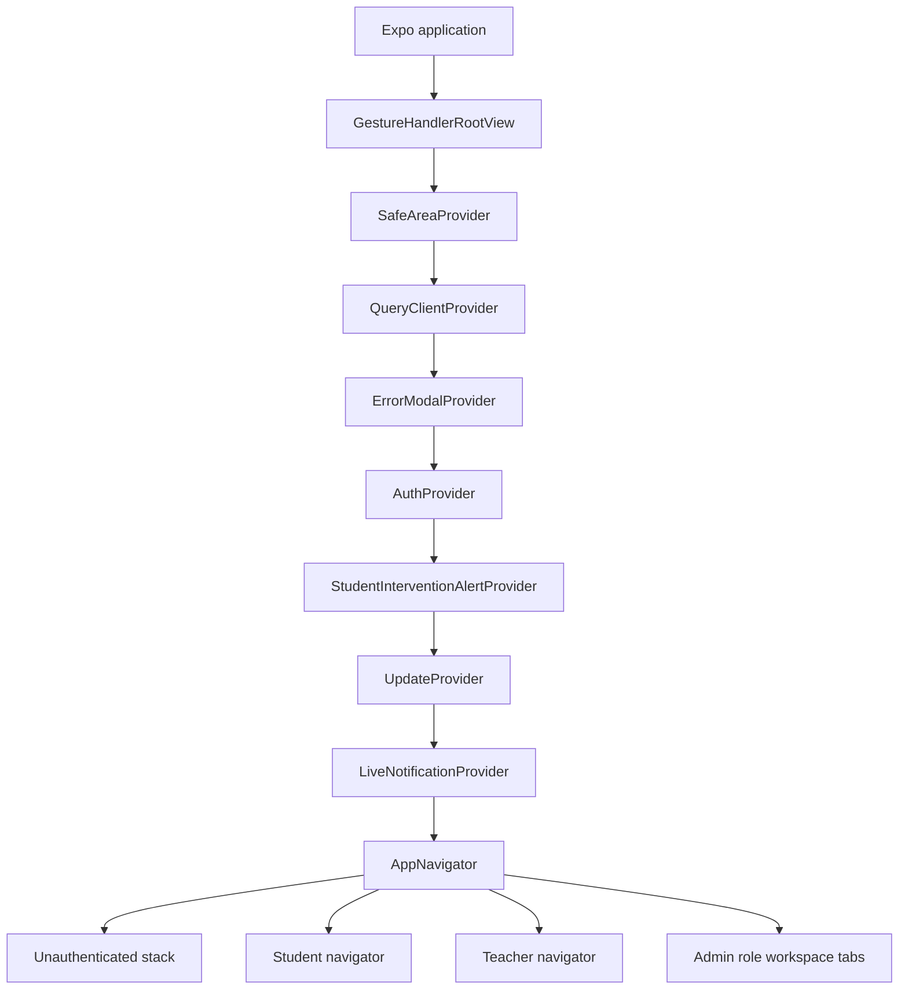
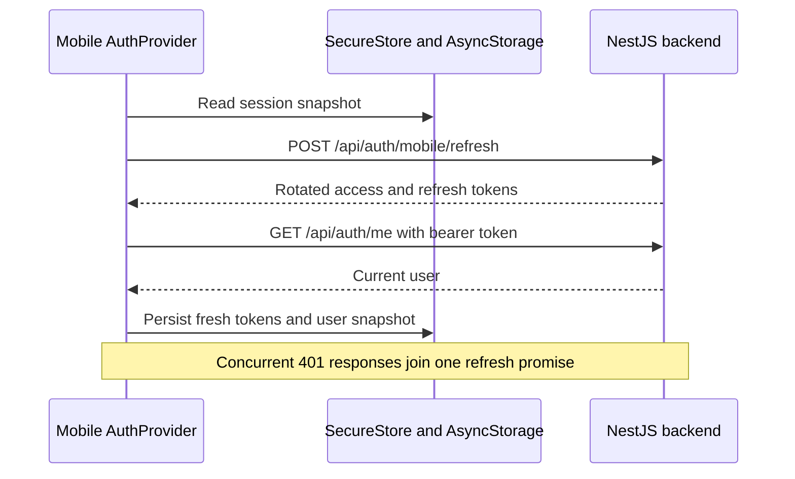
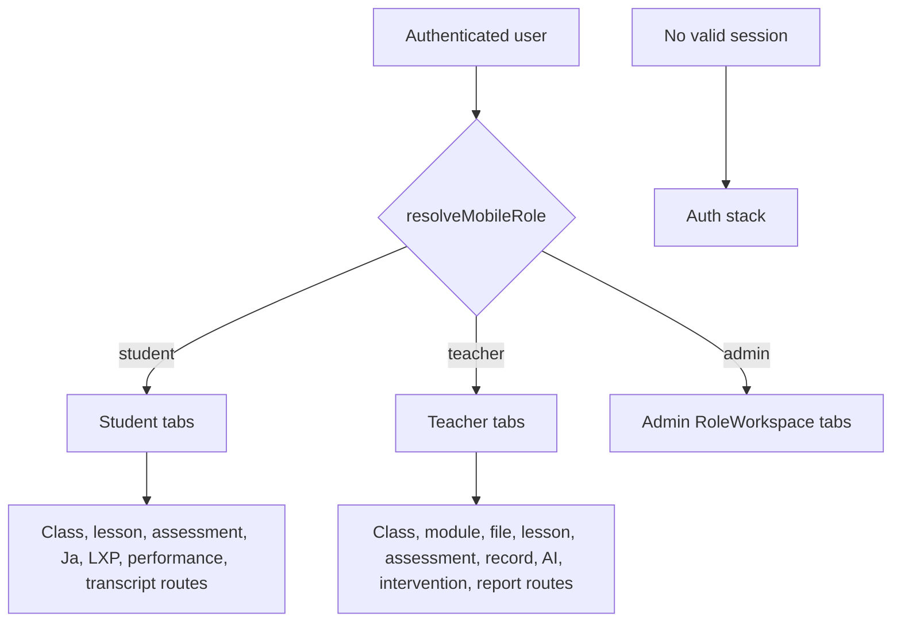

# Chapter 08 — Expo 54 Mobile Application

> **Snapshot authority.** This chapter describes commit `3d0c93e5270d44b9912deeae0218e95c9a311dd5` on branch `developement`. Source paths named below are the authority if the implementation changes after 2026-07-13.

This chapter is the mobile-client service manual. It records provider boot order, secure session storage, API refresh behavior, role resolution, student and teacher navigation, admin workspace behavior, every registered navigation entry, every screen file, every mobile API service, notifications, update policy, and offline boundaries.

## Source map

- `mobile/App.tsx`
- `mobile/src/navigation/`
- `mobile/src/providers/`
- `mobile/src/api/`
- `mobile/src/screens/`
- `mobile/src/types/`
- `mobile/src/theme/`
- `mobile/app.json`

## Application boot topology

## Session and API transport

| Concern | Current behavior |
| --- | --- |
| API base URL | Resolved by mobile API configuration; every app request targets the NestJS /api contract. |
| Timeout | 30 seconds for public and authenticated Axios clients. |
| Access token | Held in memory and persisted by the storage layer; attached as a bearer credential. |
| Refresh token | Returned by mobile auth endpoints and persisted by the storage layer. |
| Native primary storage | Expo SecureStore. |
| Compatibility copy | AsyncStorage is written alongside SecureStore; web uses AsyncStorage. |
| Hydration | Tokens are loaded before authenticated requests when memory is empty. |
| 401 recovery | One shared refresh promise rotates tokens and retries each failed request at most once. |
| Transient refresh failure | Does not clear the session unless the backend returns 401 or 403. |
| Definitive rejection | Clears access token, refresh token, and session snapshot. |

> The session snapshot improves startup presentation but is not proof of a valid current session. Bootstrap refresh and /auth/me establish current authority.

## Query-client policy

| Option | Value |
| --- | --- |
| Stale time | 30 seconds |
| Retry count | 2 |
| Retry delay | Exponential with 30-second cap and random jitter |
| Refetch on window focus | False |

## Role resolution and navigator selection

- Roles may be strings or objects containing name. Matching is case-insensitive.
- Admin takes precedence, teacher is second, and all other authenticated role sets fall back to student.
- That fallback makes an unrecognized role appear as student navigation; backend authorization still blocks unauthorized calls, but role additions must update the resolver deliberately.

| Resolved role | Root experience | Primary tabs |
| --- | --- | --- |
| Student | Student stack with tabs and deep learning routes | Dashboard, Classes, Assessments, JA, Announcements, Profile |
| Teacher | Teacher stack with full parity routes | Home, Assessments, Classes, Announcements, Sections, Profile |
| Admin | RoleWorkspace tab composition | Home, Classes, Assessments, Announcements, Profile |
| Unauthenticated | Authentication stack | Login, VerifyEmail, ForgotPassword, ResetPassword, SetInitialPassword |

## Navigation map

## Complete registered navigation catalog

> **Exhaustive inventory rule.** The 70 JSX screen registrations below were extracted from `mobile/src/navigation/**/*.tsx` at commit `3d0c93e`. A later source change requires regenerating or manually reconciling this chapter.

| Navigator | Resolved route name | Component expression |
| --- | --- | --- |
| Tab | Dashboard | studentTabScreens.Dashboard |
| Tab | Classes | studentTabScreens.Classes |
| Tab | Assessments | studentTabScreens.Assessments |
| Tab | JA | studentTabScreens.JA |
| Tab | Announcements | studentTabScreens.Announcements |
| Tab | Profile | studentTabScreens.Profile |
| RootStack | ClassDetail | studentStackScreens.ClassDetail |
| RootStack | ModuleDetail | studentStackScreens.ModuleDetail |
| RootStack | Calendar | studentStackScreens.Calendar |
| RootStack | Courses | studentStackScreens.Courses |
| RootStack | Lessons | studentStackScreens.Lessons |
| RootStack | LessonDetail | studentStackScreens.LessonDetail |
| RootStack | AssessmentDetail | studentStackScreens.AssessmentDetail |
| RootStack | AssessmentTake | studentStackScreens.AssessmentTake |
| RootStack | AssessmentResults | studentStackScreens.AssessmentResults |
| RootStack | AssessmentHistory | studentStackScreens.AssessmentHistory |
| RootStack | Chatbot | studentStackScreens.Chatbot |
| RootStack | Performance | studentStackScreens.Performance |
| RootStack | Transcript | studentStackScreens.Transcript |
| RootStack | LXP | studentStackScreens.LXP |
| RootStack | ClassWorkspace | studentSupportScreens.ClassWorkspace |
| RootStack | AiTutor | studentSupportScreens.AiTutor |
| AuthStack | Login | LoginScreen |
| AuthStack | VerifyEmail | VerifyEmailScreen |
| AuthStack | ForgotPassword | ForgotPasswordScreen |
| AuthStack | ResetPassword | ResetPasswordScreen |
| AuthStack | SetInitialPassword | SetInitialPasswordScreen |
| RootStack | MainTabs | StudentTabs |
| RootStack | StudentGuidedAssessment | StudentGuidedAssessmentScreen |
| RootStack | StudentJaReviewAssessment | StudentJaReviewAssessmentScreen |
| Tab | Home | TeacherHomeScreen |
| Tab | Assessments | TeacherAssessmentsScreen |
| Tab | Classes | TeacherClassesScreen |
| Tab | Announcements | NotificationsInboxScreen |
| Tab | Sections | TeacherSectionsScreen |
| Tab | Profile | TeacherProfileScreen |
| RootStack | MainTabs | TeacherTabs |
| RootStack | TeacherClassDetail | TeacherClassDetailScreen |
| RootStack | TeacherModuleDetail | TeacherModuleDetailScreen |
| RootStack | TeacherModuleFileDetail | TeacherModuleFileDetailScreen |
| RootStack | TeacherLessonDetail | TeacherLessonDetailScreen |
| RootStack | TeacherLessonEditor | TeacherLessonEditorScreen |
| RootStack | TeacherAssessmentDetail | TeacherAssessmentDetailScreen |
| RootStack | TeacherAssessmentEditor | TeacherAssessmentEditorScreen |
| RootStack | TeacherAssessmentReview | TeacherAssessmentReviewScreen |
| RootStack | TeacherAssessmentAttemptResult | TeacherAssessmentAttemptResultScreen |
| RootStack | TeacherCalendar | TeacherCalendarScreen |
| RootStack | TeacherCreateModule | TeacherCreateModuleScreen |
| RootStack | TeacherCreateAssessment | TeacherCreateAssessmentScreen |
| RootStack | TeacherClassAddStudents | TeacherClassAddStudentsScreen |
| RootStack | TeacherClassStudentOverview | TeacherClassStudentOverviewScreen |
| RootStack | TeacherSectionDetail | TeacherSectionDetailScreen |
| RootStack | TeacherSectionAddStudents | TeacherSectionAddStudentsScreen |
| RootStack | TeacherSectionStudentProfile | TeacherSectionStudentProfileScreen |
| RootStack | TeacherExtractionDetail | TeacherExtractionDetailScreen |
| RootStack | TeacherAiDraft | TeacherAiDraftScreen |
| RootStack | TeacherInterventionDetail | TeacherInterventionDetailScreen |
| RootStack | TeacherLibrary | TeacherLibraryScreen |
| RootStack | TeacherClassRecord | TeacherClassRecordScreen |
| RootStack | TeacherReports | TeacherReportsScreen |
| RootStack | TeacherInterventions | TeacherInterventionsScreen |
| RootStack | TeacherPerformance | TeacherPerformanceScreen |
| RootStack | TeacherEvaluations | TeacherEvaluationsScreen |
| RootStack | TeacherAnnouncements | TeacherAnnouncementsScreen |
| RootStack | TeacherMore | TeacherMoreScreen |
| Tab | Home | None |
| Tab | Classes | None |
| Tab | Assessments | None |
| Tab | Announcements | NotificationsInboxScreen |
| Tab | Profile | None |

### Student route contract

| Layer | Routes |
| --- | --- |
| Tabs | Dashboard, Classes, Assessments, JA, Announcements, Profile |
| Stack | ClassDetail, ModuleDetail, Calendar, Courses, Lessons, LessonDetail, AssessmentDetail, AssessmentTake, AssessmentResults, AssessmentHistory, Chatbot, Performance, Transcript, LXP |
| Support | ClassWorkspace, AiTutor |
| Additional mounted assessment routes | StudentGuidedAssessment, StudentJaReviewAssessment |

### Teacher route contract

| Layer | Routes |
| --- | --- |
| Tabs | Home, Assessments, Classes, Announcements, Sections, Profile |
| Class and content | TeacherClassDetail, TeacherModuleDetail, TeacherModuleFileDetail, TeacherLessonDetail, TeacherLessonEditor, TeacherCreateModule |
| Assessment | TeacherAssessmentDetail, TeacherAssessmentEditor, TeacherAssessmentReview, TeacherAssessmentAttemptResult, TeacherCreateAssessment |
| Roster and sections | TeacherClassAddStudents, TeacherClassStudentOverview, TeacherSectionDetail, TeacherSectionAddStudents, TeacherSectionStudentProfile |
| AI and extraction | TeacherExtractionDetail, TeacherAiDraft, TeacherInterventionDetail, TeacherInterventions |
| Operations | TeacherLibrary, TeacherClassRecord, TeacherReports, TeacherPerformance, TeacherEvaluations, TeacherAnnouncements, TeacherCalendar, TeacherMore |

## Complete screen-file catalog

> **Exhaustive inventory rule.** The 57 non-test screen implementation files below were extracted from `mobile/src/screens/**/*.tsx`, excluding test files and barrel exports, at commit `3d0c93e`. A later source change requires regenerating or manually reconciling this chapter.

| Screen source | Exports | Local API-path literals |
| --- | --- | --- |
| mobile/src/screens/AiTutorScreen.tsx | AiTutorScreen | Uses hooks or API services; no local path literal extracted |
| mobile/src/screens/AnnouncementsScreen.tsx | AnnouncementsScreen | Uses hooks or API services; no local path literal extracted |
| mobile/src/screens/AssessmentDetailScreen.tsx | AssessmentDetailScreen | Uses hooks or API services; no local path literal extracted |
| mobile/src/screens/AssessmentHistoryScreen.tsx | AssessmentHistoryScreen | Uses hooks or API services; no local path literal extracted |
| mobile/src/screens/AssessmentResultsScreen.tsx | AssessmentResultsScreen | Uses hooks or API services; no local path literal extracted |
| mobile/src/screens/AssessmentTakeScreen.tsx | AssessmentTakeScreen | /, /:param |
| mobile/src/screens/AssessmentsScreen.tsx | AssessmentsScreen | Uses hooks or API services; no local path literal extracted |
| mobile/src/screens/CalendarScreen.tsx | CalendarScreen | Uses hooks or API services; no local path literal extracted |
| mobile/src/screens/ClassDetailScreen.tsx | StudentClassDetailContent, ClassDetailScreen | / |
| mobile/src/screens/CoursesScreen.tsx | CoursesScreen | Uses hooks or API services; no local path literal extracted |
| mobile/src/screens/DashboardScreen.tsx | DashboardScreen | Uses hooks or API services; no local path literal extracted |
| mobile/src/screens/ForgotPasswordScreen.tsx | ForgotPasswordScreen | Uses hooks or API services; no local path literal extracted |
| mobile/src/screens/JaScreen.tsx | JaScreen | Uses hooks or API services; no local path literal extracted |
| mobile/src/screens/LessonDetailScreen.tsx | LessonDetailScreen | Uses hooks or API services; no local path literal extracted |
| mobile/src/screens/LessonsScreen.tsx | LessonsScreen | Uses hooks or API services; no local path literal extracted |
| mobile/src/screens/LoginScreen.tsx | LoginScreen | Uses hooks or API services; no local path literal extracted |
| mobile/src/screens/LxpScreen.tsx | LxpScreen | Uses hooks or API services; no local path literal extracted |
| mobile/src/screens/ModuleDetailScreen.tsx | ModuleDetailScreen | Uses hooks or API services; no local path literal extracted |
| mobile/src/screens/NotificationsInboxScreen.tsx | NotificationsInboxScreen | Uses hooks or API services; no local path literal extracted |
| mobile/src/screens/PerformanceScreen.tsx | PerformanceScreen | Uses hooks or API services; no local path literal extracted |
| mobile/src/screens/ProfileScreen.tsx | ProfileScreen | Uses hooks or API services; no local path literal extracted |
| mobile/src/screens/ProgressScreen.tsx | ProgressScreen | Uses hooks or API services; no local path literal extracted |
| mobile/src/screens/ResetPasswordScreen.tsx | ResetPasswordScreen | Uses hooks or API services; no local path literal extracted |
| mobile/src/screens/RoleWorkspaceScreen.tsx | RoleWorkspaceScreen | Uses hooks or API services; no local path literal extracted |
| mobile/src/screens/SetInitialPasswordScreen.tsx | SetInitialPasswordScreen | Uses hooks or API services; no local path literal extracted |
| mobile/src/screens/StudentGuidedAssessmentScreen.tsx | StudentGuidedAssessmentScreen | Uses hooks or API services; no local path literal extracted |
| mobile/src/screens/StudentJaReviewAssessmentScreen.tsx | StudentJaReviewAssessmentScreen | Uses hooks or API services; no local path literal extracted |
| mobile/src/screens/SubjectLessonsScreen.tsx | SubjectLessonsScreen | Uses hooks or API services; no local path literal extracted |
| mobile/src/screens/TeacherAiDraftScreen.tsx | TeacherAiDraftScreen | Uses hooks or API services; no local path literal extracted |
| mobile/src/screens/TeacherAnnouncementsScreen.tsx | TeacherAnnouncementsScreen | Uses hooks or API services; no local path literal extracted |
| mobile/src/screens/TeacherAssessmentDetailScreen.tsx | TeacherAssessmentDetailScreen | Uses hooks or API services; no local path literal extracted |
| mobile/src/screens/TeacherAssessmentEditorScreen.tsx | TeacherAssessmentEditorScreen | Uses hooks or API services; no local path literal extracted |
| mobile/src/screens/TeacherAssessmentReviewScreen.tsx | TeacherAssessmentReviewScreen | Uses hooks or API services; no local path literal extracted |
| mobile/src/screens/TeacherAssessmentsScreen.tsx | TeacherAssessmentsScreen | Uses hooks or API services; no local path literal extracted |
| mobile/src/screens/TeacherCalendarScreen.tsx | TeacherCalendarScreen | Uses hooks or API services; no local path literal extracted |
| mobile/src/screens/TeacherClassDetailScreen.tsx | TeacherClassDetailScreen | Uses hooks or API services; no local path literal extracted |
| mobile/src/screens/TeacherClassRecordScreen.tsx | TeacherClassRecordScreen | Uses hooks or API services; no local path literal extracted |
| mobile/src/screens/TeacherClassesScreen.tsx | TeacherClassesScreen | / |
| mobile/src/screens/TeacherCreateAssessmentScreen.tsx | TeacherCreateAssessmentScreen | Uses hooks or API services; no local path literal extracted |
| mobile/src/screens/TeacherCreateModuleScreen.tsx | TeacherCreateModuleScreen | Uses hooks or API services; no local path literal extracted |
| mobile/src/screens/TeacherDeepParityScreens.tsx | TeacherAssessmentAttemptResultScreen, TeacherClassStudentOverviewScreen, TeacherClassAddStudentsScreen, TeacherSectionAddStudentsScreen, TeacherSectionStudentProfileScreen, TeacherModuleFileDetailScreen, TeacherLessonEditorScreen, TeacherInterventionWorkspaceContent, TeacherInterventionDetailScreen | Uses hooks or API services; no local path literal extracted |
| mobile/src/screens/TeacherEvaluationsScreen.tsx | TeacherEvaluationsScreen | Uses hooks or API services; no local path literal extracted |
| mobile/src/screens/TeacherExtractionDetailScreen.tsx | TeacherExtractionDetailScreen | Uses hooks or API services; no local path literal extracted |
| mobile/src/screens/TeacherHomeScreen.tsx | TeacherHomeScreen | Uses hooks or API services; no local path literal extracted |
| mobile/src/screens/TeacherInterventionsScreen.tsx | TeacherInterventionsScreen | Uses hooks or API services; no local path literal extracted |
| mobile/src/screens/TeacherLessonDetailScreen.tsx | TeacherLessonDetailScreen | Uses hooks or API services; no local path literal extracted |
| mobile/src/screens/TeacherLibraryScreen.tsx | TeacherLibraryScreen | Uses hooks or API services; no local path literal extracted |
| mobile/src/screens/TeacherModuleDetailScreen.tsx | TeacherModuleDetailScreen | Uses hooks or API services; no local path literal extracted |
| mobile/src/screens/TeacherMoreScreen.tsx | TeacherMoreScreen | Uses hooks or API services; no local path literal extracted |
| mobile/src/screens/TeacherPerformanceScreen.tsx | TeacherPerformanceScreen | Uses hooks or API services; no local path literal extracted |
| mobile/src/screens/TeacherProfileScreen.tsx | TeacherProfileScreen | Uses hooks or API services; no local path literal extracted |
| mobile/src/screens/TeacherReportsScreen.tsx | TeacherReportsScreen | Uses hooks or API services; no local path literal extracted |
| mobile/src/screens/TeacherSectionDetailScreen.tsx | TeacherSectionDetailScreen | Uses hooks or API services; no local path literal extracted |
| mobile/src/screens/TeacherSectionsScreen.tsx | TeacherSectionsScreen | Uses hooks or API services; no local path literal extracted |
| mobile/src/screens/TeacherUnsupportedScreen.tsx | TeacherUnsupportedScreen | Uses hooks or API services; no local path literal extracted |
| mobile/src/screens/TranscriptScreen.tsx | TranscriptScreen | Uses hooks or API services; no local path literal extracted |
| mobile/src/screens/VerifyEmailScreen.tsx | VerifyEmailScreen | Uses hooks or API services; no local path literal extracted |

## Complete mobile API service catalog

> **Exhaustive inventory rule.** The 22 mobile API service modules below were extracted from `mobile/src/api/services/*.ts` at commit `3d0c93e`. A later source change requires regenerating or manually reconciling this chapter.

| Service source | Exports | Backend path literals |
| --- | --- | --- |
| mobile/src/api/services/ai.ts | aiApi | /ai/index/classes/:param, /ai/index/classes/:param/status, /ai/student/tutor/bootstrap:param, /ai/student/tutor/session, /ai/student/tutor/session/:param, /ai/student/tutor/session/:param/answers, /ai/student/tutor/session/:param/message, /ai/teacher/classes/:param/policy, /ai/teacher/interventions/:param/jobs, /ai/teacher/jobs/:param, /ai/teacher/jobs/:param/result, /ai/teacher/quizzes/jobs |
| mobile/src/api/services/announcements.ts | announcementsApi | /classes/:param/announcements, /classes/:param/announcements/:param |
| mobile/src/api/services/assessments.ts | assessmentsApi | /assessments, /assessments/:param, /assessments/:param/ongoing-attempt, /assessments/:param/start, /assessments/:param/student-attempts, /assessments/:param/submission-file, /assessments/:param/submission-files/:param, /assessments/:param/submissions, /assessments/:param/teacher-attachment/download, /assessments/:param/unsubmit-file-upload, /assessments/attempts/:param/progress, /assessments/attempts/:param/results, /assessments/attempts/:param/return, /assessments/attempts/:param/submission-file/download, /assessments/attempts/:param/submission-files/:param/download, /assessments/attempts/:param/unreturn, /assessments/class/:param, /assessments/questions, /assessments/questions/:param, /assessments/submit, /profiles/me/assessment-history |
| mobile/src/api/services/auth.ts | authApi | /auth/forgot-password, /auth/me, /auth/mobile/login, /auth/mobile/logout, /auth/profile, /auth/reset-password, /auth/set-activation-password, /auth/validate-credentials, /otp/resend, /otp/verify |
| mobile/src/api/services/class-record.ts | classRecordApi | /class-record, /class-record/:param, /class-record/:param/final-grades, /class-record/:param/finalize, /class-record/:param/preview-grades, /class-record/:param/reopen, /class-record/:param/reports/class-average, /class-record/:param/reports/distribution, /class-record/:param/reports/intervention, /class-record/:param/spreadsheet, /class-record/by-class/:param, /class-record/items/:param, /class-record/items/:param/scores, /class-record/items/:param/scores/bulk, /class-record/items/:param/sync-scores |
| mobile/src/api/services/classes.ts | classesApi | /classes/:param, /classes/:param/enrollments, /classes/:param/enrollments/:param, /classes/:param/students/:param/overview, /classes/:param/students/:param/profile, /classes/:param/students/masterlist, /classes/all, /classes/student/:param, /classes/teacher/:param |
| mobile/src/api/services/dashboard.ts | dashboardApi | No static API path literal extracted |
| mobile/src/api/services/discussion-board.ts | discussionBoardApi | /classes/:param/discussion-threads, /classes/:param/discussion-threads/:param, /classes/:param/discussion-threads/:param/close, /classes/:param/discussion-threads/:param/comments, /classes/:param/discussion-threads/:param/comments/:param, /classes/:param/discussion-threads/:param/comments/:param/reaction, /classes/:param/discussion-threads/:param/comments/:param/report, /classes/:param/discussion-threads/:param/comments/uploads, /classes/:param/discussion-threads/:param/publish, /classes/:param/discussion-threads/:param/reopen, /classes/:param/discussion-threads/uploads |
| mobile/src/api/services/extractions.ts | extractionsApi | /ai/extract-module, /ai/extractions, /ai/extractions/:param, /ai/extractions/:param/apply |
| mobile/src/api/services/file-upload.ts | fileUploadApi | /files/:param, /files/:param/download, /files/upload |
| mobile/src/api/services/ja.ts | jaApi | /ai/student/ja/ask/threads, /ai/student/ja/ask/threads/:param, /ai/student/ja/ask/threads/:param/messages, /ai/student/ja/hub:param, /ai/student/ja/practice/sessions, /ai/student/ja/practice/sessions/:param, /ai/student/ja/practice/sessions/:param/complete, /ai/student/ja/practice/sessions/:param/events, /ai/student/ja/practice/sessions/:param/responses, /ai/student/ja/review/sessions, /ai/student/ja/review/sessions/:param, /ai/student/ja/review/sessions/:param/complete, /ai/student/ja/review/sessions/:param/events, /ai/student/ja/review/sessions/:param/responses |
| mobile/src/api/services/lessons.ts | lessonsApi | /lessons/:param, /lessons/:param/blocks, /lessons/:param/complete, /lessons/:param/completion-status, /lessons/:param/publish, /lessons/:param/reorder-blocks, /lessons/blocks/:param, /lessons/class/:param, /lessons/class/:param/bulk-status, /lessons/class/:param/completed |
| mobile/src/api/services/lxp.ts | lxpApi | /lxp/me/eligibility, /lxp/me/intervention-alerts, /lxp/me/overview/:param, /lxp/me/playlist/:param, /lxp/me/playlist/:param/checkpoints/:param/complete, /lxp/me/playlist/:param/guided-assessments/:param/progress, /lxp/me/playlist/:param/guided-assessments/:param/result, /lxp/me/playlist/:param/guided-assessments/:param/start, /lxp/me/playlist/:param/guided-assessments/:param/submit, /lxp/teacher/classes/:param/interventions, /lxp/teacher/classes/:param/interventions/history, /lxp/teacher/classes/:param/reports/summary, /lxp/teacher/evaluations/summary, /lxp/teacher/interventions/:param, /lxp/teacher/interventions/:param/activate, /lxp/teacher/interventions/:param/assign, /lxp/teacher/interventions/:param/detail, /lxp/teacher/interventions/:param/generated-content/approve, /lxp/teacher/interventions/:param/generated-content/reject, /lxp/teacher/interventions/:param/regenerate, /lxp/teacher/interventions/:param/resolve, /lxp/teacher/interventions/pending-count |
| mobile/src/api/services/modules.ts | modulesApi | /modules, /modules/:param, /modules/class/:param, /modules/class/:param/:param, /modules/items/:param, /modules/items/:param/file/download |
| mobile/src/api/services/notifications.ts | notificationsApi | /notifications, /notifications/:param/read, /notifications/unread-count |
| mobile/src/api/services/performance.ts | performanceApi | /performance/classes/:param/at-risk, /performance/classes/:param/intervention-quiz-comparison, /performance/classes/:param/summary, /performance/students/me/summary |
| mobile/src/api/services/profile.ts | profileApi | /profiles/me, /profiles/me/avatar, /profiles/update/:param |
| mobile/src/api/services/protected-files.ts | buildProtectedUrl, openLocalFile, downloadProtectedFile, buildProtectedImageSource | /, /:param, /api/ |
| mobile/src/api/services/reports.ts | reportsApi | /profiles/me/assessment-history, /profiles/me/transcript, /reports/assessment-summary, /reports/class-enrollment, /reports/intervention-participation, /reports/student-performance, /reports/system-usage |
| mobile/src/api/services/school-events.ts | schoolEventsApi | /school-events |
| mobile/src/api/services/sections.ts | sectionsApi | /sections/:param, /sections/:param/candidates, /sections/:param/roster, /sections/:param/roster/:param, /sections/:param/schedule, /sections/:param/students/:param/profile, /sections/all, /sections/my |
| mobile/src/api/services/teacher-profile.ts | teacherProfileApi | /teacher-profiles/:param, /teacher-profiles/me, /teacher-profiles/me/avatar |

## Notifications, intervention alerts, and updates

- LiveNotificationProvider owns real-time notification reception and mobile presentation after authentication.
- StudentInterventionAlertProvider evaluates current learner intervention state and surfaces actionable alerts without changing official records.
- UpdateProvider consumes backend app-version policy so a deployment can recommend or require a supported mobile version.
- Notification taps must resolve through the typed navigation contract and revalidate backend access before showing protected detail.

## Offline and degraded-network truth

- Persisted tokens and the user snapshot permit startup continuity, but protected data still requires backend validation.
- React Query caches in memory under the current provider. No durable offline mutation queue or conflict-resolution engine was found.
- A transient refresh-network failure does not immediately erase valid local state; a definitive 401 or 403 does.
- Mutations must present pending and retry states and must not imply success until the backend confirms the authoritative write.
- Socket disconnection must fall back to refetch or polling where the provider implements it; push delivery alone is not durable evidence.

## Mobile security and accessibility

- Never place credentials, OTPs, internal secrets, or full response bodies in production console logs.
- SecureStore should remain available on native production builds. AsyncStorage compatibility does not provide equivalent secret protection.
- Deep links and notification payloads are untrusted input; validate route name, required parameters, current role, and backend object access.
- Preserve safe-area handling, touch target size, text scaling, loading announcements, keyboard navigation on web target, and error recovery.

## Mobile feature extension procedure

1. Confirm the backend contract and add or update mobile types and the owning API service.
2. Add the route name and exact params to the appropriate typed manifest and navigator.
3. Build the screen against service or query hooks with explicit loading, empty, offline, failure, forbidden, and success states.
4. Persist only the minimum state necessary; never create a second authority for official academic records.
5. Reconcile mutations by invalidating or updating every affected query key.
6. Test cold boot, token rotation, transient network loss, definitive session rejection, role selection, deep link, back navigation, and small-screen accessibility.
7. Run mobile unit tests, typecheck, Expo configuration validation, and focused device or simulator smoke tests.
