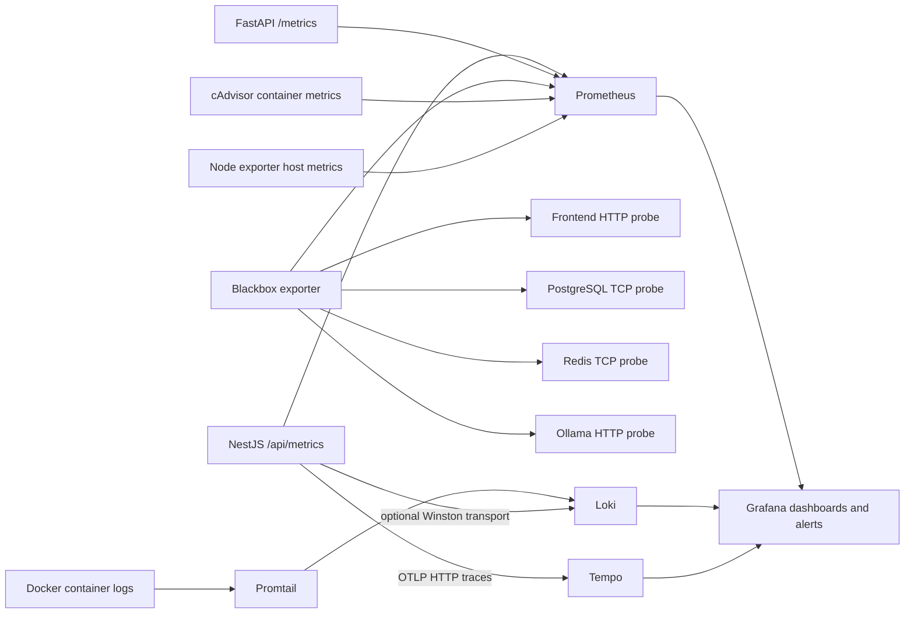
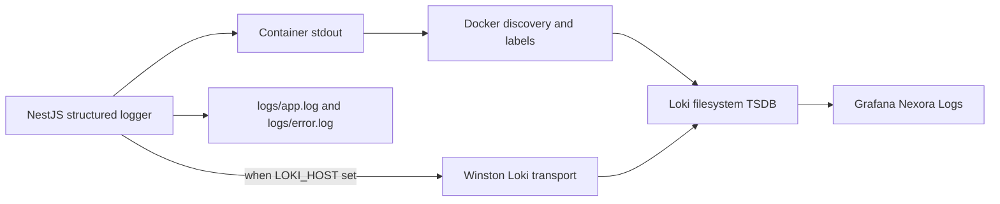
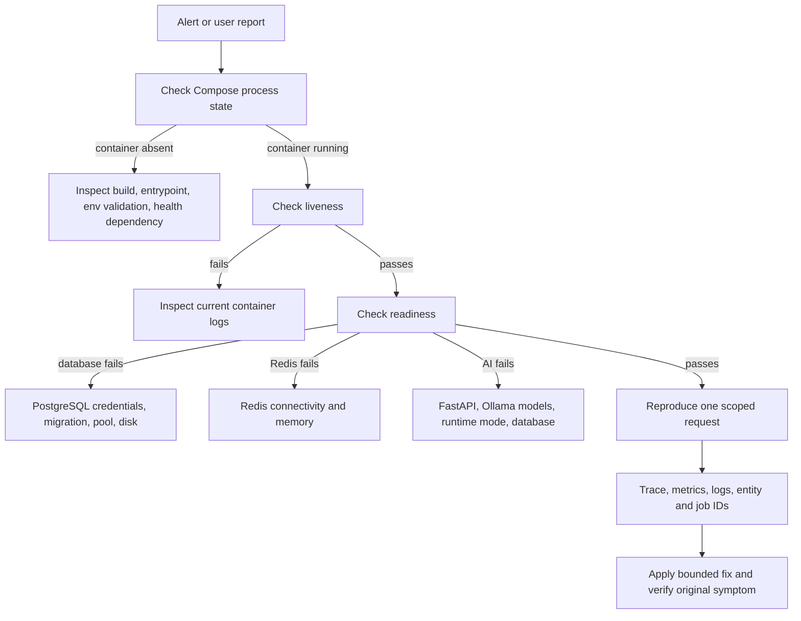

# Chapter 09 — Observability, Telemetry, and Diagnostics

> **Snapshot authority.** This chapter describes commit `3d0c93e5270d44b9912deeae0218e95c9a311dd5` on branch `developement`. Source paths named below are the authority if the implementation changes after 2026-07-13.

This chapter is the operator service sheet for health, metrics, dashboards, alerts, logs, traces, container probes, failure isolation, and cross-process diagnostics. It distinguishes currently instrumented evidence from correlation gaps that must not be guessed around.

## Source map

- `monitoring/`
- `docker-compose.yml`
- `docker-compose.debug.yml`
- `backend/src/monitoring/`
- `backend/src/modules/health/`
- `backend/src/tracing.ts`
- `backend/src/common/logger/`
- `ai-service/app/main.py`

## Telemetry topology



- The entire observability suite is opt-in through the Compose `observability` profile. Core application startup does not require it.
- Prometheus stores metrics, Loki stores logs, Tempo stores traces, and Grafana presents provisioned data sources, dashboards, and alert rules.
- Blackbox exporter probes HTTP or TCP reachability where an application-native metric endpoint is unavailable.
- cAdvisor observes containers and node-exporter observes the host.

## Prometheus scrape register

> **Exhaustive inventory rule.** The 10 scrape jobs below were extracted from `monitoring/prometheus.yml` at commit `3d0c93e`. A later source change requires regenerating or manually reconciling this chapter.

| Job | Metrics path | Targets | Evidence type |
| --- | --- | --- | --- |
| prometheus | /metrics | prometheus:9090 | Native metrics scrape |
| backend | /api/metrics | backend:3000 | Native metrics scrape |
| ai-service | /metrics | ai-service:8000 | Native metrics scrape |
| frontend | /probe | http://frontend:3001 | Blackbox reachability probe |
| loki | /probe | http://loki:3100/ready | Blackbox reachability probe |
| postgres | /probe | postgres:5432 | Blackbox reachability probe |
| redis | /probe | redis:6379 | Blackbox reachability probe |
| ollama | /probe | http://ollama:11434/ | Blackbox reachability probe |
| cadvisor | /metrics | cadvisor:8080 | Native metrics scrape |
| node-exporter | /metrics | node-exporter:9100 | Native metrics scrape |

## Application metric dictionary

| Metric | Type | Labels or value | Owner |
| --- | --- | --- | --- |
| http_request_duration_seconds | Histogram | method, route, status_code | NestJS metrics interceptor |
| http_requests_total | Counter | method, route, status_code | NestJS metrics interceptor |
| http_request_errors_total | Counter | method, route, status_code | NestJS metrics interceptor |
| storage_cleanup_failures_total | Counter | Storage cleanup failure count | NestJS storage maintenance |
| db_pool_total_connections | Gauge | Current pg Pool totalCount | NestJS MetricsController |
| db_pool_idle_connections | Gauge | Current pg Pool idleCount | NestJS MetricsController |
| db_pool_waiting_requests | Gauge | Current pg Pool waitingCount | NestJS MetricsController |
| nexora_ai_http_requests_total | Counter | method, route, status | FastAPI middleware |
| nexora_ai_http_request_duration_seconds | Histogram | method and route latency | FastAPI middleware |
| nexora_ai_ready | Gauge | 1 ready, 0 degraded or not ready | FastAPI readiness |
| nexora_ai_ollama_available | Gauge | 1 reachable, 0 unavailable | FastAPI runtime health |

> No active backend metric declaration for `bullmq_waiting_total` was found. The provisioned queue-backlog alert therefore enters NoData unless another deployment component exports that exact metric. Instrument queue state before relying on the alert.

## Health and readiness endpoint register

| Endpoint | Meaning | Expected use |
| --- | --- | --- |
| GET /api/health | Compatibility alias of backend liveness | Simple process check. |
| GET /api/health/live | Backend process and service metadata | Container liveness and first diagnostic. |
| GET /api/health/ready | Backend database, Redis, and AI dependency readiness | Traffic admission; returns 503 when a required dependency is unavailable. |
| GET /api/ai/health | Backend proxy view of AI or Ollama availability | Public compatibility check through the backend boundary. |
| GET ai-service:8000/health | FastAPI process and runtime status | Private network diagnostics. |
| GET ai-service:8000/ready | FastAPI database and configured runtime readiness | AI-service container readiness. |
| GET ai-service:8000/metrics | FastAPI Prometheus exposition | Prometheus scrape only. |
| GET backend:3000/api/metrics | NestJS Prometheus exposition and pool gauges | Prometheus scrape only. |

## Alert rule register

> **Exhaustive inventory rule.** The 15 Grafana alert rules below were extracted from `monitoring/grafana/provisioning/alerting/` at commit `3d0c93e`. A later source change requires regenerating or manually reconciling this chapter.

| Group | Alert | Expression | Pending duration | No-data state | Execution-error state | UID |
| --- | --- | --- | --- | --- | --- | --- |
| nexora-platform-availability | Backend Down | up{job="backend"} == 0 | 2m | Alerting | Alerting | backend-down |
| nexora-platform-availability | AI Service Down | up{job="ai-service"} == 0 | 2m | Alerting | Alerting | ai-service-down |
| nexora-platform-availability | Frontend Down | probe_success{job="frontend"} == 0 | 2m | Alerting | Alerting | frontend-down |
| nexora-platform-availability | Postgres Down | probe_success{job="postgres"} == 0 | 2m | Alerting | Alerting | postgres-down |
| nexora-platform-availability | Redis Down | probe_success{job="redis"} == 0 | 2m | Alerting | Alerting | redis-down |
| nexora-platform-availability | Ollama Unavailable | probe_success{job="ollama"} == 0 | 2m | Alerting | Alerting | ollama-unavailable |
| nexora-platform-availability | AI Readiness Degraded | nexora_ai_ready == 0 | 2m | Alerting | Alerting | ai-ready-degraded |
| nexora-platform-pressure | Host Memory Pressure | (1 - (node_memory_MemAvailable_bytes / node_memory_MemTotal_bytes)) > 0.90 | 5m | NoData | Alerting | host-memory-pressure |
| nexora-platform-pressure | Host Disk Pressure | (1 - (node_filesystem_avail_bytes{fstype!~"tmpfs\|squashfs"} / node_filesystem_size_bytes{fstype!~"tmpfs\|squashfs"})) > 0.90 | 5m | NoData | Alerting | host-disk-pressure |
| nexora-platform-pressure | Backend 5xx Rate High | sum(rate(http_requests_total{job="backend",status_code=~"5.."}[5m])) > 0.05 | 5m | NoData | Alerting | backend-5xx-rate |
| nexora-platform-pressure | AI Service Error Rate High | sum(rate(nexora_ai_http_requests_total{status=~"5.."}[5m])) > 0 | 5m | NoData | Alerting | ai-service-error-rate |
| nexora-platform-pressure | Container Lifecycle Churn High | sum(changes(container_start_time_seconds[15m])) > 3 | 10m | NoData | Alerting | container-lifecycle-churn |
| nexora-platform-pressure | BullMQ Queue Backlog High | bullmq_waiting_total > 10 | 5m | NoData | Alerting | bullmq-waiting-jobs |
| nexora-platform-pressure | AI Job Failure Rate High | sum(rate(nexora_ai_http_requests_total{status=~"5.."}[10m])) > 0.1 | 10m | NoData | Alerting | ai-job-failure-rate |
| nexora-platform-pressure | DB Pool Connection Starvation | db_pool_waiting_requests > 5 | 2m | NoData | Alerting | db-pool-starvation |

### Alert interpretation

- Availability alerts deliberately treat no data as alerting because the monitoring path itself may be down.
- Pressure alerts generally use NoData so a missing optional metric does not masquerade as measured pressure; operators must still investigate absent expected telemetry.
- A firing probe proves the probe failed, not the root cause. Confirm DNS, network, process, dependency, and application response in that order.
- The AI failure alerts currently derive from AI HTTP 5xx metrics. They do not count every durable BullMQ terminal failure unless that failure also produced the measured HTTP response.

## Grafana dashboard register

| Dashboard | Panels | Provisioned source |
| --- | --- | --- |
| Nexora AI Service | AI Ready, Ollama Available, AI Requests, AI Latency | monitoring/grafana/dashboards/nexora-ai-service.json |
| Nexora Backend & DB Pool | Backend Up, Backend Request Rate, Backend P95 / P99 Latency (s), Backend 5xx Error Rate, Database Connection Pool Diagnostics, HTTP Error Spike Breakdown by Route | monitoring/grafana/dashboards/nexora-backend.json |
| Nexora Containers | Container CPU, Container Memory, Container Lifecycle Churn | monitoring/grafana/dashboards/nexora-containers.json |
| Nexora Infrastructure | Host CPU, Host Memory, Host Disk Utilization | monitoring/grafana/dashboards/nexora-infrastructure.json |
| Nexora Logs | Docker Logs | monitoring/grafana/dashboards/nexora-logs.json |
| Nexora Overview | Backend Up, AI Service Up, Prometheus Up, Loki Ready, Container CPU, Trace Volume | monitoring/grafana/dashboards/nexora-overview.json |
| Nexora Traces | Backend Trace Search, Trace Volume | monitoring/grafana/dashboards/nexora-traces.json |

## Logging pipeline



- Console logs always run. JSON file transports write all events to `logs/app.log` and errors to `logs/error.log`.
- When LOKI_HOST is set, the backend also sends logs directly with app, service_name, and environment labels.
- Promtail discovers Docker containers through the Docker socket and labels container ID, name, Compose project, service, container number, and image.
- If both direct Loki and Promtail paths are active, equivalent backend events can appear twice unless queries or deployment policy select one ingestion path.
- Loki is configured as a single local filesystem instance with authentication disabled inside the deployment network. Do not expose it publicly.

## Trace pipeline

- Backend startup imports `backend/src/tracing.ts` before Nest bootstrap.
- OpenTelemetry Node auto-instrumentations export OTLP HTTP spans to the configured endpoint, defaulting to `http://tempo:4318/v1/traces`.
- Resource attributes identify service name, namespace `nexora`, container or process instance, and application version.
- Tempo stores traces locally and compacts blocks with 24-hour retention.
- Trace initialization can be disabled by setting the OTLP endpoint to an empty value.

## End-to-end request correlation: current truth

> No application-wide X-Request-ID generator, response header, structured request-ID log field, BullMQ correlation field, or explicit FastAPI request-ID propagation contract was found. A guaranteed Next.js → NestJS → BullMQ → FastAPI request-ID trace is not currently available.

Use the strongest identifiers that do exist:

1. Record client time, authenticated user ID, HTTP method, backend path, target entity ID, and response status.
2. Search the backend trace dashboard around that time for the HTTP span and inspect auto-instrumented downstream HTTP and PostgreSQL spans.
3. For queued work, obtain the durable AI job UUID, extraction UUID, file ID, class ID, or deterministic BullMQ job ID returned or logged by the workflow.
4. Search backend logs by the durable ID and queue job name. Compare attemptsMade and durable database status.
5. Search FastAPI logs and metrics in the same interval by route and durable ID. Confirm the internal call result and database transition.
6. Treat time-only matching as inference. Do not claim one event caused another without a shared durable ID or trace context.

### Recommended correlation improvement

Introduce one validated X-Request-ID at the backend ingress, return it to clients, add it to structured logs and audit-safe metadata, copy it into every BullMQ payload, forward it to FastAPI, and include it as a trace attribute. Keep durable job IDs separate because one request may create multiple jobs.

## Diagnostic command sheet

```bash
# Render the effective Compose configuration without starting services
docker compose config

# Inspect core and observability container state
docker compose --profile observability ps

# Read recent service logs without following forever
docker compose logs --since=15m backend ai-service redis postgres ollama

# Check public backend liveness and readiness
curl --fail --silent --show-error http://localhost:3000/api/health/live
curl --fail --silent --show-error http://localhost:3000/api/health/ready

# Check private dependencies from their containers
docker compose exec redis redis-cli ping
docker compose exec postgres pg_isready -U postgres -d capstone
docker compose exec ollama ollama list

# Check Prometheus target health and Grafana health when the profile is running
curl --fail --silent --show-error http://localhost:9090/-/ready
curl --fail --silent --show-error http://localhost:3002/api/health

# Check Loki and Tempo readiness when their default host ports are published
curl --fail --silent --show-error http://localhost:3100/ready
curl --fail --silent --show-error http://localhost:3200/ready
```

## Incident isolation decision tree



## Common symptom runbooks

| Symptom | First evidence | Likely branches | Safe next action |
| --- | --- | --- | --- |
| Backend readiness 503 | /api/health/ready response and backend logs | Database, Redis, or AI dependency failure | Test each dependency from the backend network and correct only the failed branch. |
| AI readiness degraded | /ready response, nexora_ai_ready, Ollama probe | Missing model, runtime unavailable, database failure, cloud config mismatch | Confirm selected runtime mode and exact configured model names. |
| Requests slow but healthy | Backend and AI latency histograms plus DB pool gauges | Pool waiting, model saturation, slow query, container pressure | Match the slow route to pool, trace, and resource evidence before tuning. |
| Queue work not completing | Durable job row, BullMQ job state, worker logs | Worker absent, retained failure, dependency timeout, invalid payload | Reconcile durable and Redis state before retrying. |
| Notifications delayed | notifications queue, socket connection, inbox fetch | Worker failure, socket disconnect, polling delay | Verify durable notification rows before focusing on real-time transport. |
| Frontend down alert | Blackbox probe and frontend logs | Next process, rewrite target, backend health, DNS | Probe the frontend and backend separately. |
| Disk pressure | node filesystem metric and Docker disk usage | Logs, image layers, volumes, model data | Identify the consuming path before any deletion; preserve database and upload backups. |

## Observability maintenance checklist

1. Add a metric only with a stable name, type, labels, cardinality budget, dashboard consumer, alert rationale, and test.
2. Never place user content, tokens, cookies, secrets, or full request bodies in metric labels.
3. Verify every alert expression against the currently scraped metric names before enabling notification delivery.
4. Keep core Compose independent of the observability profile.
5. Test no-data and monitoring-stack failure behavior, not only the nominal alert threshold.
6. Confirm retention and disk capacity for Prometheus, Loki, Tempo, and Grafana volumes.
7. After a change, reproduce a request and show its metric, log, and trace evidence where instrumentation supports it.
