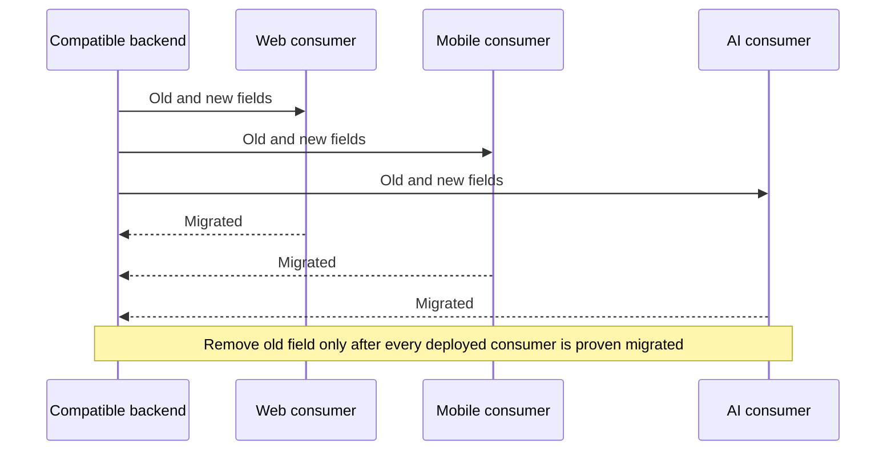

# Chapter 10 — Developer Cookbook and Modification Recipes

> **Snapshot authority.** This chapter describes commit `3d0c93e5270d44b9912deeae0218e95c9a311dd5` on branch `developement`. Source paths named below are the authority if the implementation changes after 2026-07-13.

This chapter turns the architecture into repeatable maintenance procedures. Each recipe names the current owning paths, provides concrete code patterns, identifies every contract consumer, and ends with evidence gates. Adapt names only after tracing the current source at the edition commit.

## Source map

- `backend/src/`
- `backend/drizzle/`
- `ai-service/app/`
- `next-frontend/app/`
- `next-frontend/src/`
- `mobile/src/`
- `docker-compose.yml`
- `.github/workflows/`

## Universal change workflow

```mermaid
flowchart LR
  INTENT[Define user-visible intent] --> OWNER[Select owning subsystem]
  OWNER --> CONTRACT[Trace schema, API, queue, and client contracts]
  CONTRACT --> TEST[Write failing focused test]
  TEST --> IMPLEMENT[Implement smallest coherent change]
  IMPLEMENT --> FOCUSED[Run focused verification]
  FOCUSED --> CASCADE[Run affected subsystem and cross-contract verification]
  CASCADE --> DOC[Update manual and operational evidence]
  DOC --> REVIEW[Review security, failure, rollback, and dirty-tree scope]
  REVIEW --> RELEASE[Eligible for integration]
```



### Pre-change record

```bash
git status --short
git branch --show-current
git rev-parse HEAD
docker compose config --quiet
```

- Preserve unrelated dirty worktree changes.
- Read the root and owning subsystem AGENTS.md files.
- Use current source paths. The active database schema is `backend/src/drizzle/schema/`, not the legacy path named in older prose.
- State whether the change modifies official state, derived state, AI assistive output, a public contract, or only presentation.
- Do not broaden an implementation because a nearby subsystem could also be improved.

## Recipe 10.1 — Add a database entity and CRUD API

This concrete example adds admin-maintained operational notes. It demonstrates the complete schema → migration → DTO → service → controller → module → test chain without granting AI or clients direct database authority.

### Step 1 — Add the Drizzle schema

Create `backend/src/drizzle/schema/maintenance-notes.schema.ts`:

```typescript
import { index, pgTable, text, timestamp, uuid, varchar } from 'drizzle-orm/pg-core';
import { users } from './base.schema';

export const maintenanceNotes = pgTable(
  'maintenance_notes',
  {
    id: uuid('id').defaultRandom().primaryKey(),
    targetType: varchar('target_type', { length: 80 }).notNull(),
    targetId: uuid('target_id'),
    body: text('body').notNull(),
    createdBy: uuid('created_by')
      .notNull()
      .references(() => users.id, { onDelete: 'restrict' }),
    createdAt: timestamp('created_at', { withTimezone: true }).defaultNow().notNull(),
    updatedAt: timestamp('updated_at', { withTimezone: true }).defaultNow().notNull(),
  },
  (table) => ({
    targetIdx: index('maintenance_notes_target_idx').on(table.targetType, table.targetId),
    createdByIdx: index('maintenance_notes_created_by_idx').on(table.createdBy),
  }),
);
```

Add this exact export to `backend/src/drizzle/schema/index.ts`:

```typescript
export * from './maintenance-notes.schema';
```

Design checks before migration:

- The table has an explicit primary key, bounded target type, required actor, timezone-aware timestamps, and indexes matching list predicates.
- Actor deletion is restricted so maintenance evidence cannot silently lose provenance.
- targetId is intentionally nullable because some notes can describe a subsystem rather than one row.

### Step 2 — Generate, inspect, and apply the migration

```bash
cd backend
npx drizzle-kit generate --name add_maintenance_notes
npm run check:migrations
cd ..

# Apply through the repository migration runner in an already-running disposable stack
docker compose exec backend node run-migrations.js
```

Open the generated SQL and journal entry. Confirm table name, foreign key delete action, both indexes, and no unrelated drop or rename. Never use Drizzle push against a shared or deployed database. Exercise the migration on a disposable database before a persistent volume.

### Step 3 — Add validated DTOs

Create `backend/src/modules/maintenance-notes/DTO/maintenance-note.dto.ts`:

```typescript
import { ApiProperty, ApiPropertyOptional } from '@nestjs/swagger';
import { IsOptional, IsString, IsUUID, MaxLength, MinLength } from 'class-validator';

export class CreateMaintenanceNoteDto {
  @ApiProperty({ example: 'queue-job' })
  @IsString()
  @MinLength(2)
  @MaxLength(80)
  targetType!: string;

  @ApiPropertyOptional({ example: '42e8dbe5-3797-4fc7-a64a-c288747e401b' })
  @IsOptional()
  @IsUUID()
  targetId?: string;

  @ApiProperty({ example: 'Reviewed retained failure and approved one retry.' })
  @IsString()
  @MinLength(3)
  @MaxLength(4000)
  body!: string;
}

export class UpdateMaintenanceNoteDto {
  @ApiProperty({ example: 'Retry completed and durable state was reconciled.' })
  @IsString()
  @MinLength(3)
  @MaxLength(4000)
  body!: string;
}
```

### Step 4 — Implement service and audit behavior

Create `backend/src/modules/maintenance-notes/maintenance-notes.service.ts`:

```typescript
import { Injectable, NotFoundException } from '@nestjs/common';
import { desc, eq } from 'drizzle-orm';
import { DatabaseService } from '../../database/database.service';
import { maintenanceNotes } from '../../drizzle/schema';
import { AuditService } from '../audit/audit.service';
import { CreateMaintenanceNoteDto, UpdateMaintenanceNoteDto } from './DTO/maintenance-note.dto';

@Injectable()
export class MaintenanceNotesService {
  constructor(
    private readonly databaseService: DatabaseService,
    private readonly auditService: AuditService,
  ) {}

  private get db() {
    return this.databaseService.db;
  }

  findAll() {
    return this.db.query.maintenanceNotes.findMany({
      orderBy: [desc(maintenanceNotes.createdAt)],
      limit: 200,
    });
  }

  async create(dto: CreateMaintenanceNoteDto, actorId: string) {
    const [created] = await this.db.insert(maintenanceNotes).values({
      targetType: dto.targetType.trim(),
      targetId: dto.targetId ?? null,
      body: dto.body.trim(),
      createdBy: actorId,
    }).returning();
    await this.auditService.log({
      actorId,
      action: 'maintenance_note.created',
      targetType: 'maintenance_note',
      targetId: created.id,
      metadata: { targetType: created.targetType, targetId: created.targetId },
    });
    return created;
  }

  async update(id: string, dto: UpdateMaintenanceNoteDto, actorId: string) {
    const [updated] = await this.db.update(maintenanceNotes).set({
      body: dto.body.trim(),
      updatedAt: new Date(),
    }).where(eq(maintenanceNotes.id, id)).returning();
    if (!updated) throw new NotFoundException('Maintenance note not found');
    await this.auditService.log({
      actorId,
      action: 'maintenance_note.updated',
      targetType: 'maintenance_note',
      targetId: updated.id,
    });
    return updated;
  }

  async remove(id: string, actorId: string) {
    const [removed] = await this.db.delete(maintenanceNotes)
      .where(eq(maintenanceNotes.id, id)).returning();
    if (!removed) throw new NotFoundException('Maintenance note not found');
    await this.auditService.log({
      actorId,
      action: 'maintenance_note.deleted',
      targetType: 'maintenance_note',
      targetId: removed.id,
    });
    return { id: removed.id };
  }
}
```

### Step 5 — Add controller and RBAC

Create `backend/src/modules/maintenance-notes/maintenance-notes.controller.ts`:

```typescript
import { Body, Controller, Delete, Get, Param, ParseUUIDPipe, Patch, Post, UseGuards } from '@nestjs/common';
import { ApiBearerAuth, ApiTags } from '@nestjs/swagger';
import { RoleName } from '../../common/constants/role.constants';
import { CurrentUser } from '../auth/decorators/current-user.decorator';
import { Roles } from '../auth/decorators/roles.decorator';
import { JwtAuthGuard } from '../auth/guards/jwt-auth.guard';
import { RolesGuard } from '../auth/guards/roles.guard';
import { CreateMaintenanceNoteDto, UpdateMaintenanceNoteDto } from './DTO/maintenance-note.dto';
import { MaintenanceNotesService } from './maintenance-notes.service';

@ApiTags('Maintenance Notes')
@ApiBearerAuth('token')
@UseGuards(JwtAuthGuard, RolesGuard)
@Roles(RoleName.Admin)
@Controller('maintenance-notes')
export class MaintenanceNotesController {
  constructor(private readonly service: MaintenanceNotesService) {}

  @Get()
  async findAll() {
    return { success: true, data: await this.service.findAll() };
  }

  @Post()
  async create(
    @Body() dto: CreateMaintenanceNoteDto,
    @CurrentUser() user: { userId: string },
  ) {
    return { success: true, data: await this.service.create(dto, user.userId) };
  }

  @Patch(':id')
  async update(
    @Param('id', ParseUUIDPipe) id: string,
    @Body() dto: UpdateMaintenanceNoteDto,
    @CurrentUser() user: { userId: string },
  ) {
    return { success: true, data: await this.service.update(id, dto, user.userId) };
  }

  @Delete(':id')
  async remove(
    @Param('id', ParseUUIDPipe) id: string,
    @CurrentUser() user: { userId: string },
  ) {
    return { success: true, data: await this.service.remove(id, user.userId) };
  }
}
```

Create `backend/src/modules/maintenance-notes/maintenance-notes.module.ts`:

```typescript
import { Module } from '@nestjs/common';
import { AuditModule } from '../audit/audit.module';
import { MaintenanceNotesController } from './maintenance-notes.controller';
import { MaintenanceNotesService } from './maintenance-notes.service';

@Module({
  imports: [AuditModule],
  controllers: [MaintenanceNotesController],
  providers: [MaintenanceNotesService],
  exports: [MaintenanceNotesService],
})
export class MaintenanceNotesModule {}
```

Import MaintenanceNotesModule in `backend/src/app.module.ts` and add it once to the AppModule imports array.

### Step 6 — Lock the route contract with tests

Create focused DTO, service, and controller specs. This controller example verifies delegation and response shape:

```typescript
import { MaintenanceNotesController } from './maintenance-notes.controller';

describe('MaintenanceNotesController', () => {
  const service = {
    findAll: jest.fn(),
    create: jest.fn(),
    update: jest.fn(),
    remove: jest.fn(),
  };
  const controller = new MaintenanceNotesController(service as never);

  afterEach(() => jest.clearAllMocks());

  it('creates an admin maintenance note through the service', async () => {
    const dto = {
      targetType: 'queue-job',
      targetId: '42e8dbe5-3797-4fc7-a64a-c288747e401b',
      body: 'Approved one retry after durable-state reconciliation.',
    };
    const created = { id: 'note-1', targetType: dto.targetType, targetId: dto.targetId, body: dto.body };
    service.create.mockResolvedValue(created);
    await expect(controller.create(dto, { userId: 'admin-1' })).resolves.toEqual({
      success: true,
      data: created,
    });
    expect(service.create).toHaveBeenCalledWith(dto, 'admin-1');
  });
});
```

Also test invalid UUID, unknown properties, missing body, overlong body, unauthenticated access, teacher and student rejection, not-found update, delete audit behavior, and migration rollback in a disposable database.

### Verification gate

```bash
npm --prefix backend run check:migrations
npm --prefix backend test -- maintenance-notes
npm --prefix backend run lint
npm --prefix backend run build
```

## Recipe 10.2 — Add a BullMQ queue and worker

The current repository registers queues in the owning module; there is no central QueueModule. This example adds a durable manual-export queue whose worker writes a bounded audit export through the existing storage abstraction.

### Step 1 — Define constants and contracts

Create `backend/src/modules/manual-export/manual-export.contract.ts`:

```typescript
export const MANUAL_EXPORT_QUEUE = 'manual-export';
export const BUILD_MANUAL_EXPORT_JOB = 'build-manual-export';

export interface BuildManualExportJobData {
  exportId: string;
  requestedByUserId: string;
  queuedAt: string;
}

export interface BuildManualExportResult {
  exportId: string;
  storageKey: string;
  rowCount: number;
}
```

### Step 2 — Implement bounded domain work

Create `backend/src/modules/manual-export/manual-export.service.ts`:

```typescript
import { Injectable } from '@nestjs/common';
import { desc } from 'drizzle-orm';
import { DatabaseService } from '../../database/database.service';
import { auditLogs } from '../../drizzle/schema';
import { StorageService } from '../file-upload/storage/storage.service';
import { BuildManualExportResult } from './manual-export.contract';

@Injectable()
export class ManualExportService {
  constructor(
    private readonly databaseService: DatabaseService,
    private readonly storageService: StorageService,
  ) {}

  async build(exportId: string): Promise<BuildManualExportResult> {
    const rows = await this.databaseService.db.query.auditLogs.findMany({
      orderBy: [desc(auditLogs.createdAt)],
      limit: 10000,
    });
    const storageKey = "maintenance-exports/" + exportId + ".json";
    await this.storageService.putObject({
      key: storageKey,
      body: Buffer.from(JSON.stringify(rows), "utf8"),
      contentType: 'application/json',
    });
    return { exportId, storageKey, rowCount: rows.length };
  }
}
```

### Step 3 — Implement producer and processor

Create `backend/src/modules/manual-export/manual-export-queue.service.ts`:

```typescript
import { InjectQueue } from '@nestjs/bullmq';
import { Injectable } from '@nestjs/common';
import type { Queue } from 'bullmq';
import { BUILD_MANUAL_EXPORT_JOB, BuildManualExportJobData, MANUAL_EXPORT_QUEUE } from './manual-export.contract';

@Injectable()
export class ManualExportQueueService {
  constructor(@InjectQueue(MANUAL_EXPORT_QUEUE) private readonly queue: Queue) {}

  async enqueue(exportId: string, requestedByUserId: string): Promise<void> {
    const data: BuildManualExportJobData = {
      exportId,
      requestedByUserId,
      queuedAt: new Date().toISOString(),
    };
    await this.queue.add(BUILD_MANUAL_EXPORT_JOB, data, {
      jobId: "manual-export:" + exportId,
      attempts: 3,
      backoff: { type: 'exponential', delay: 5000 },
      removeOnComplete: 100,
      removeOnFail: 200,
    });
  }
}
```

Create `backend/src/modules/manual-export/manual-export.processor.ts`:

```typescript
import { Processor, WorkerHost } from '@nestjs/bullmq';
import { Injectable } from '@nestjs/common';
import type { Job } from 'bullmq';
import { BUILD_MANUAL_EXPORT_JOB, BuildManualExportJobData, BuildManualExportResult, MANUAL_EXPORT_QUEUE } from './manual-export.contract';
import { ManualExportService } from './manual-export.service';

@Injectable()
@Processor(MANUAL_EXPORT_QUEUE, { concurrency: 1 })
export class ManualExportProcessor extends WorkerHost {
  constructor(private readonly manualExportService: ManualExportService) {
    super();
  }

  async process(job: Job<BuildManualExportJobData>): Promise<BuildManualExportResult> {
    if (job.name !== BUILD_MANUAL_EXPORT_JOB) {
      throw new Error("Unsupported manual-export job: " + job.name);
    }
    return this.manualExportService.build(job.data.exportId);
  }
}
```

The processor throws unknown-job and domain failures so BullMQ owns retry behavior. Storage keys are deterministic, making a retry replace the same export object rather than create an unbounded duplicate.

### Step 4 — Register the queue in its owner

Create `backend/src/modules/manual-export/manual-export.module.ts`:

```typescript
import { BullModule } from '@nestjs/bullmq';
import { Module } from '@nestjs/common';
import { DatabaseModule } from '../../database/database.module';
import { StorageModule } from '../file-upload/storage/storage.module';
import { MANUAL_EXPORT_QUEUE } from './manual-export.contract';
import { ManualExportProcessor } from './manual-export.processor';
import { ManualExportQueueService } from './manual-export-queue.service';
import { ManualExportService } from './manual-export.service';

@Module({
  imports: [
    DatabaseModule,
    StorageModule,
    BullModule.registerQueue({ name: MANUAL_EXPORT_QUEUE }),
  ],
  providers: [ManualExportService, ManualExportQueueService, ManualExportProcessor],
  exports: [ManualExportQueueService],
})
export class ManualExportModule {}
```

Import ManualExportModule in AppModule. Persist an export-request row before enqueueing if users must poll status after restarts; do not rely on Redis as the only business record.

### Step 5 — Verify job semantics

- Unit-test exact queue name, job name, payload, deterministic ID, attempts, backoff, completion retention, and failure retention.
- Processor-test success, unknown job, storage failure, database failure, retry idempotency, and the 10,000-row bound.
- Integration-test Redis unavailable at enqueue, worker restart during execution, duplicate enqueue, and retained terminal failure.
- Add queue waiting, active, completed, failed, and duration metrics before creating a backlog alert.

```bash
npm --prefix backend test -- manual-export
npm --prefix backend run lint
npm --prefix backend run build
```

## Recipe 10.3 — Add a grounded AI feature

This example adds an internal study-summary execution route. A public NestJS controller must authorize the teacher and either queue durable work or call the proxy with a bounded timeout. The example performs class-scoped retrieval before generation.

### Step 1 — Add Pydantic contracts

Add to `ai-service/app/schemas.py`:

```python
class StudySummaryRequest(BaseModel):
    class_id: str = Field(alias='classId')
    topic: str = Field(min_length=3, max_length=300)
    top_k: int = Field(default=6, ge=2, le=10, alias="topK")

    model_config = ConfigDict(populate_by_name=True)


class StudySummaryResponse(BaseModel):
    summary: str
    source_ids: list[str] = Field(alias="sourceIds")

    model_config = ConfigDict(populate_by_name=True)
```

### Step 2 — Add the internal router

Create `ai-service/app/routers/study_summary.py`:

```python
from collections.abc import Callable

from fastapi import APIRouter, Depends, HTTPException
from sqlalchemy.ext.asyncio import AsyncSession

from ..database import get_db
from ..ollama_client import generate
from ..retrieval_service import similarity_search
from ..schemas import StudySummaryRequest, StudySummaryResponse

STUDY_SUMMARY_SYSTEM_PROMPT = (
    "You create concise teacher-facing study summaries. "
    "Use only the supplied evidence. State when evidence is insufficient. "
    "Do not invent grades, student facts, citations, or official decisions."
)


def build_study_summary_router(require_internal_service: Callable):
    router = APIRouter()

    @router.post(
        "/internal/study-summary",
        response_model=StudySummaryResponse,
    )
    async def create_study_summary(
        body: StudySummaryRequest,
        _auth: None = Depends(require_internal_service),
        db: AsyncSession = Depends(get_db),
    ):
        chunks = await similarity_search(
            db,
            query_text=body.topic,
            class_id=body.class_id,
            top_k=body.top_k,
            only_published=True,
            policy_name="general",
        )
        if len(chunks) < 2:
            raise HTTPException(422, "Insufficient grounded evidence for a study summary")
        evidence = "\n\n".join(
            "SOURCE " + str(index + 1) + ": " + str(chunk["chunkText"])
            for index, chunk in enumerate(chunks)
        )
        prompt = "TOPIC: " + body.topic + "\n\nEVIDENCE:\n" + evidence
        summary = await generate(
            prompt=prompt,
            system=STUDY_SUMMARY_SYSTEM_PROMPT,
            task="chat",
            temperature=0.1,
            num_predict=700,
        )
        return StudySummaryResponse(
            summary=summary.strip(),
            sourceIds=[str(chunk["sourceId"]) for chunk in chunks],
        )

    return router
```

In `ai-service/app/main.py`, import the builder after dependency definitions, build it with require_internal_service, and call app.include_router once. Keep the route internal.

### Step 3 — Add the backend execution seam

Add a bounded method to `backend/src/modules/ai-mentor/ai-proxy.service.ts` or a dedicated client. The shared proxy already attaches user headers and the internal secret:

```typescript
async createInternalStudySummary(
  user: { id?: string; userId?: string; email?: string; roles?: string[] },
  body: { classId: string; topic: string; topK: number },
): Promise<unknown> {
  return this.forward('POST', '/internal/study-summary', user, body);
}
```

Before calling it, the NestJS controller and service must enforce teacher or admin role and class ownership. If the operation can exceed the request budget, create a durable ai_generation_jobs row, enqueue a typed BullMQ job, call this method from the worker, and persist output or failure.

### Step 4 — Validate grounding and failure behavior

- Unit-test the Pydantic aliases, topic length, topK bounds, internal secret, insufficient evidence, and source ID response.
- Mock similarity_search and generate separately so retrieval failures are distinguishable from model failures.
- Test cross-class attempts through the public backend route, not only the internal FastAPI function.
- Test Ollama timeout, malformed runtime response, database outage, duplicate queued execution, and cancellation where supported.
- Add latency, outcome, and evidence-count metrics without student content in labels.

```bash
python -m pytest ai-service/tests -q
npm --prefix backend test -- ai-mentor
npm --prefix backend run build
```

## Recipe 10.4 — Add a role-restricted web and mobile screen

This example adds a teacher-only study-summary surface backed by the Chapter 10.3 backend contract.

### Step 1 — Add the web service and query hook

Add the method to `next-frontend/src/services/ai-service.ts` using the existing shared API client:

```typescript
export type StudySummaryRequest = {
  classId: string;
  topic: string;
  topK: number;
};

export type StudySummaryResult = {
  summary: string;
  sourceIds: string[];
};

export async function createStudySummary(
  payload: StudySummaryRequest,
): Promise<StudySummaryResult> {
  const response = await apiClient.post('/ai/teacher/study-summary', payload);
  return response.data.data as StudySummaryResult;
}
```

Create `next-frontend/src/hooks/use-study-summary.ts`:

```typescript
'use client';

import { useMutation } from '@tanstack/react-query';
import { createStudySummary } from '@/services/ai-service';

export function useStudySummary() {
  return useMutation({ mutationFn: createStudySummary });
}
```

### Step 2 — Add the teacher App Router page

Create `next-frontend/app/(dashboard)/dashboard/teacher/study-summary/page.tsx`. The page must use AuthProvider role state or the enclosing teacher layout, expose topic and class selection, disable duplicate submission while pending, render backend failure text safely, and show source references returned by the contract. Add the route to teacher navigation and dashboard-route-access tests.

### Step 3 — Add mobile API and route types

Add this method to the owning mobile AI service:

```typescript
export type MobileStudySummaryRequest = {
  classId: string;
  topic: string;
  topK: number;
};

export async function createStudySummary(payload: MobileStudySummaryRequest) {
  const response = await apiClient.post('/ai/teacher/study-summary', payload);
  return response.data.data as { summary: string; sourceIds: string[] };
}
```

Add `TeacherStudySummary: { classId: string }` to RootStackParamList in `mobile/src/navigation/types.ts`, add `TeacherStudySummary` to teacherRouteManifest.stack, create `mobile/src/screens/TeacherStudySummaryScreen.tsx`, import it in AppNavigator, and register:

```tsx
<RootStack.Screen name="TeacherStudySummary" component={TeacherStudySummaryScreen} />
```

Add a teacher web-to-mobile mapping entry in the teacher route manifest so parity tests cover the new surface.

### Step 4 — Verify authorization and client behavior

- Direct web and mobile navigation as teacher succeeds only for an owned class.
- Student access is hidden in navigation and rejected by the backend.
- Admin behavior matches the backend policy rather than being inferred by the clients.
- Access-token expiry performs one refresh and one request retry.
- Offline submission does not display success; retry remains explicit.
- Loading, empty evidence, validation, 403, 422, 429, 503, and timeout states are accessible and actionable.

```bash
npm --prefix next-frontend test -- study-summary dashboard-route-access
npm --prefix next-frontend run lint
npm --prefix next-frontend run build
npm --prefix mobile test -- study-summary app-navigator-role-resolution
npm --prefix mobile run typecheck
```

## Recipe 10.5 — Safely upgrade dependencies and run tests

### Step 1 — Establish the before-state

```bash
git status --short
node --version
npm --version
npm --prefix backend outdated
npm --prefix next-frontend outdated
npm --prefix mobile outdated
python --version
python -m pip check
```

Read release notes and migration guides for every direct major upgrade. Keep backend, web, mobile, and AI upgrades in separate commits unless one contract requires coordinated versions.

### Step 2 — Change one dependency family

- Use the package manager and lockfile already owned by the subsystem.
- Keep Nest peer packages on compatible major versions and Next, React, React DOM, and test renderer versions aligned.
- Keep Expo SDK packages on versions accepted by the selected Expo SDK.
- Regenerate Python requirements from the repository input workflow rather than manually editing transitive pins.
- Do not combine an ORM upgrade with an unrelated schema change.

After editing the declared dependency, run the deterministic install:

```bash
npm --prefix backend install
npm --prefix next-frontend install
npm --prefix mobile install
python -m pip check
```

### Step 3 — Run subsystem gates

```bash
# Backend
npm --prefix backend run check:src-clean
npm --prefix backend run check:migrations
npm --prefix backend run lint
npm --prefix backend test -- --runInBand
npm --prefix backend run build

# Web
npm --prefix next-frontend run lint
npm --prefix next-frontend test -- --runInBand
npm --prefix next-frontend run build

# Mobile
npm --prefix mobile run typecheck
npm --prefix mobile test

# AI service
python -m pytest ai-service/tests -q
```

### Step 4 — Run integration gates

```bash
docker compose config --quiet
docker compose build backend ai-service frontend
docker compose up -d postgres redis ollama backend ai-service frontend
docker compose ps
curl --fail --silent --show-error http://localhost:3000/api/health/ready
curl --fail --silent --show-error http://localhost:3001/
npm --prefix next-frontend run test:e2e
```

Use a disposable Compose project when migration, database bootstrap, Redis state, model bootstrap, or startup ordering is under test. Do not delete persistent volumes as a routine upgrade step.

### Step 5 — Review and rollback readiness

- Inspect package manifests and lockfiles for only intended dependency movement.
- Compare application image size, startup time, health timing, route latency, bundle warnings, and advisory output with the recorded before-state.
- Confirm migrations remain forward-only and the prior application version can coexist during a rolling deployment when the deployment model requires it.
- Document the exact rollback unit: application image, lockfile, configuration, and migration compatibility.

## Recipe 10.6 — Add or change a public API contract safely

1. Identify every consumer in web services, mobile services, FastAPI SQL or schemas, queue payloads, tests, seed data, and reports.
2. Prefer additive fields and routes. Keep old fields until all deployed consumers have migrated.
3. Update DTO validation and response types before client wiring.
4. Add contract tests for allowed roles, ownership, validation failure, success body, and backward compatibility.
5. Deploy backend compatibility first, then clients, then remove deprecated fields in a later gated release.



## Recipe 10.7 — Release evidence packet

For a release-affecting change, retain:

- Commit SHA and dirty-tree status.
- Exact install and verification commands with exit codes.
- Migration integrity result and disposable migration evidence when schema changed.
- Health and readiness responses from the candidate stack.
- Targeted browser, device, queue, or AI scenario evidence.
- Security review covering auth, ownership, secrets, logging, upload handling, and data egress.
- Known limitations, rollback trigger, and rollback unit.

## Final maintenance rule

A change is complete only when the owning source, every affected contract consumer, tests, migration or queue behavior, operational telemetry, and this manual agree. Passing one subsystem build does not prove a cross-system workflow.
