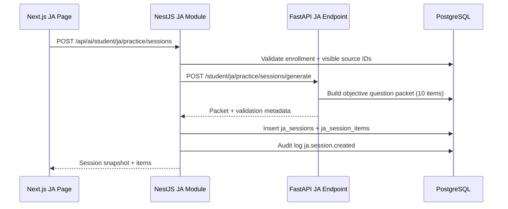
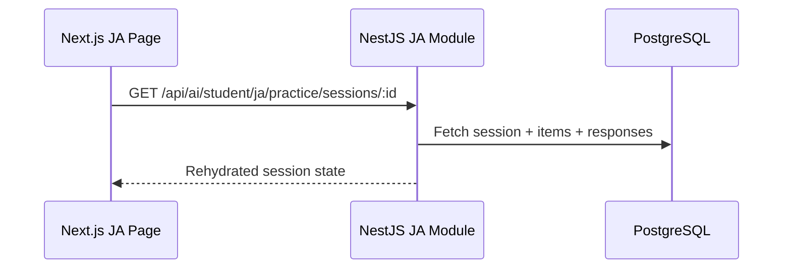
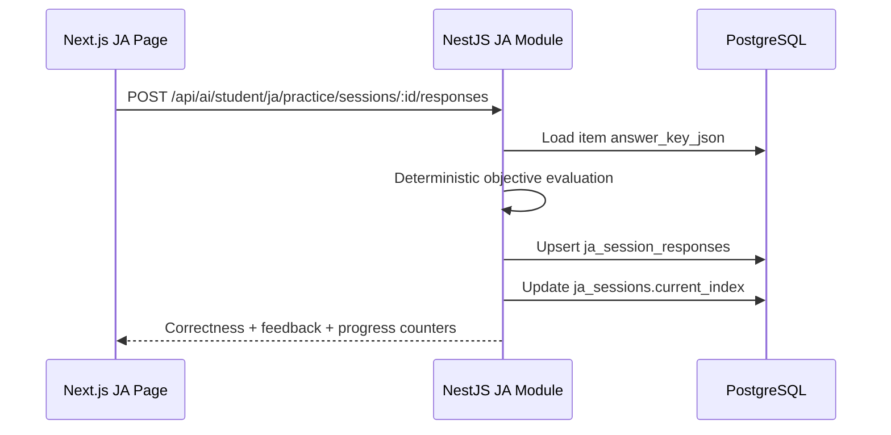
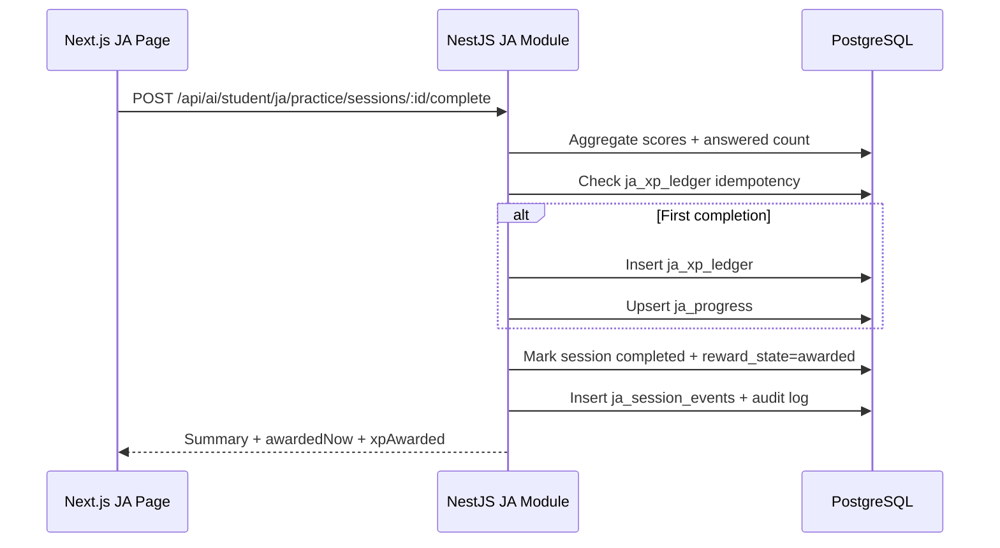

# JA Practice v1 Implementation Spec

Date: 2026-04-03

## Goal
Implement JA Practice as a first-class student subsystem with:
- unified student entry at `/dashboard/student/ja`
- JA-owned persistence and XP
- synchronous generation of 10 objective items
- deterministic answer checking
- save/resume + anti-cheat strike telemetry

## Delivered Boundaries
- Official assessment/LXP records are untouched.
- JA data is isolated in JA-specific tables.
- Existing student tutor endpoints remain operational (legacy compatibility).
- Student `chatbot` and `lxp` routes redirect to JA.

## Backend Surface
- `GET /api/ai/student/ja/practice/bootstrap`
- `POST /api/ai/student/ja/practice/sessions`
- `GET /api/ai/student/ja/practice/sessions/:sessionId`
- `POST /api/ai/student/ja/practice/sessions/:sessionId/responses`
- `POST /api/ai/student/ja/practice/sessions/:sessionId/events`
- `POST /api/ai/student/ja/practice/sessions/:sessionId/complete`
- `DELETE /api/ai/student/ja/practice/sessions/:sessionId`

## Data Model
- `ja_sessions`
- `ja_session_items`
- `ja_session_responses`
- `ja_session_events`
- `ja_progress`
- `ja_xp_ledger`

## AI-Service Internal Contracts
- `GET /student/ja/practice/bootstrap`
- `POST /student/ja/practice/sessions/generate`

## Sequence: Start Session

## Sequence: Resume Session

## Sequence: Submit Response

## Sequence: Complete + Award

## QA Acceptance Checklist
- session stores exactly 10 validated objective items
- response upsert works on re-answer
- completion idempotency prevents double XP
- focus strike events are recorded
- deleting session removes JA-owned rows only
- `/dashboard/student/chatbot` redirects to `/dashboard/student/ja`
- `/dashboard/student/lxp` redirects to `/dashboard/student/ja`
